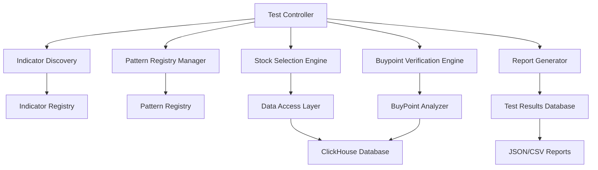

# Design Document

## Overview

The comprehensive stock selection testing system is designed to validate all technical indicators and their patterns through closed-loop verification using ClickHouse real data across all 4000+ stocks. The system ensures that every indicator pattern can successfully select corresponding stocks, and validates these selections through reverse buypoint analysis to confirm pattern consistency.

The design follows a high-performance modular architecture that integrates with the existing indicator system, pattern registry, and buypoint analysis components while providing comprehensive testing coverage within a 5-minute execution window for complete stock selection across all patterns.

## Architecture

### High-Level Architecture



### Core Components

1. **Test Controller**: Orchestrates the entire testing workflow
2. **Indicator Discovery**: Discovers and loads all available indicators
3. **Pattern Registry Manager**: Manages pattern registration and retrieval
4. **Stock Selection Engine**: Executes stock selection for each pattern
5. **Buypoint Verification Engine**: Performs reverse verification through buypoint analysis
6. **Report Generator**: Generates comprehensive test reports

## Components and Interfaces

### 1. Test Controller

```python
class ComprehensiveStockSelectionTester:
    """Main controller for comprehensive stock selection testing"""
    
    def __init__(self, config: TestConfig):
        self.config = config
        self.indicator_discovery = IndicatorDiscovery()
        self.pattern_manager = PatternRegistryManager()
        self.selection_engine = StockSelectionEngine()
        self.verification_engine = BuypointVerificationEngine()
        self.report_generator = ReportGenerator()
    
    async def run_comprehensive_test(self) -> TestResults:
        """Execute comprehensive testing workflow"""
        pass
    
    async def test_all_indicators(self) -> Dict[str, IndicatorTestResult]:
        """Test all available indicators"""
        pass
    
    async def test_indicator_patterns(self, indicator_name: str) -> PatternTestResults:
        """Test all patterns for a specific indicator"""
        pass
```

### 2. Indicator Discovery

```python
class IndicatorDiscovery:
    """Discovers and manages available indicators"""
    
    def discover_all_indicators(self) -> List[IndicatorInfo]:
        """Discover all available indicators in the system"""
        pass
    
    def load_indicator(self, indicator_name: str) -> Any:
        """Load a specific indicator instance"""
        pass
    
    def get_indicator_patterns(self, indicator_name: str) -> List[str]:
        """Get all patterns for a specific indicator"""
        pass
```

### 3. Pattern Registry Manager

```python
class PatternRegistryManager:
    """Manages pattern registry operations for testing"""
    
    def __init__(self):
        self.pattern_registry = get_pattern_registry()
    
    def ensure_patterns_registered(self, indicator_name: str) -> None:
        """Ensure all patterns for an indicator are registered"""
        pass
    
    def get_all_patterns_by_indicator(self, indicator_name: str) -> List[PatternInfo]:
        """Get all registered patterns for an indicator"""
        pass
    
    def validate_pattern_registration(self) -> ValidationResult:
        """Validate pattern registration completeness"""
        pass
```

### 4. Stock Selection Engine

```python
class StockSelectionEngine:
    """Executes stock selection based on indicator patterns"""
    
    def __init__(self, data_access: DataAccessInterface):
        self.data_access = data_access
    
    async def select_stocks_for_pattern(self, 
                                      pattern_id: str, 
                                      date_range: DateRange,
                                      universe: List[str]) -> SelectionResult:
        """Select stocks matching a specific pattern"""
        pass
    
    async def batch_select_stocks(self, 
                                patterns: List[str],
                                date_range: DateRange) -> Dict[str, SelectionResult]:
        """Batch select stocks for multiple patterns"""
        pass
```

### 5. Buypoint Verification Engine

```python
class BuypointVerificationEngine:
    """Performs closed-loop verification through buypoint analysis"""
    
    def __init__(self, buypoint_analyzer: BuyPointAnalyzer):
        self.buypoint_analyzer = buypoint_analyzer
    
    async def verify_stock_selection(self, 
                                   stock_code: str,
                                   date: str,
                                   expected_pattern: str) -> VerificationResult:
        """Verify a single stock selection through buypoint analysis"""
        pass
    
    async def batch_verify_selections(self, 
                                    selections: List[StockSelection]) -> List[VerificationResult]:
        """Batch verify multiple stock selections"""
        pass
    
    def compare_patterns(self, 
                        expected_pattern: str,
                        detected_patterns: List[str]) -> PatternMatchResult:
        """Compare expected vs detected patterns"""
        pass
```

### 6. Report Generator

```python
class ReportGenerator:
    """Generates comprehensive test reports"""
    
    def generate_comprehensive_report(self, 
                                    test_results: TestResults) -> ComprehensiveReport:
        """Generate comprehensive test report"""
        pass
    
    def generate_indicator_report(self, 
                                indicator_results: IndicatorTestResult) -> IndicatorReport:
        """Generate report for a specific indicator"""
        pass
    
    def generate_pattern_report(self, 
                              pattern_results: PatternTestResults) -> PatternReport:
        """Generate report for pattern testing"""
        pass
```

## Data Models

### Test Configuration

```python
@dataclass
class TestConfig:
    """Test configuration parameters"""
    date_range: DateRange
    stock_universe: List[str]
    indicators_to_test: Optional[List[str]]
    patterns_to_test: Optional[List[str]]
    verification_threshold: float
    batch_size: int
    parallel_workers: int
    output_format: str
    report_level: str
```

### Test Results

```python
@dataclass
class TestResults:
    """Comprehensive test results"""
    test_id: str
    start_time: datetime
    end_time: datetime
    total_indicators_tested: int
    total_patterns_tested: int
    total_stocks_selected: int
    total_verifications_performed: int
    overall_success_rate: float
    indicator_results: Dict[str, IndicatorTestResult]
    summary_statistics: SummaryStatistics
```

### Indicator Test Result

```python
@dataclass
class IndicatorTestResult:
    """Test results for a specific indicator"""
    indicator_name: str
    total_patterns: int
    patterns_tested: int
    patterns_with_selections: int
    total_stocks_selected: int
    verification_success_rate: float
    pattern_results: Dict[str, PatternTestResult]
    performance_metrics: PerformanceMetrics
```

### Pattern Test Result

```python
@dataclass
class PatternTestResult:
    """Test results for a specific pattern"""
    pattern_id: str
    pattern_name: str
    stocks_selected: int
    verifications_attempted: int
    verifications_successful: int
    success_rate: float
    selected_stocks: List[StockSelection]
    verification_results: List[VerificationResult]
```

### Verification Result

```python
@dataclass
class VerificationResult:
    """Result of buypoint verification"""
    stock_code: str
    date: str
    expected_pattern: str
    detected_patterns: List[str]
    pattern_match: bool
    confidence_score: float
    verification_details: Dict[str, Any]
```

## Error Handling

### Error Categories

1. **Configuration Errors**: Invalid test parameters or missing configuration
2. **Data Access Errors**: Database connection issues or missing data
3. **Indicator Errors**: Indicator loading or calculation failures
4. **Pattern Errors**: Pattern registration or detection issues
5. **Verification Errors**: Buypoint analysis failures
6. **System Errors**: Resource constraints or timeout issues

### Error Handling Strategy

```python
class TestErrorHandler:
    """Centralized error handling for testing system"""
    
    def handle_indicator_error(self, indicator_name: str, error: Exception) -> ErrorResult:
        """Handle indicator-specific errors"""
        pass
    
    def handle_pattern_error(self, pattern_id: str, error: Exception) -> ErrorResult:
        """Handle pattern-specific errors"""
        pass
    
    def handle_verification_error(self, stock_code: str, error: Exception) -> ErrorResult:
        """Handle verification errors"""
        pass
    
    def should_continue_testing(self, error_count: int, total_tests: int) -> bool:
        """Determine if testing should continue based on error rate"""
        pass
```

## Testing Strategy

### Test Execution Flow

1. **Initialization Phase**
   - Load test configuration
   - Initialize system components
   - Discover available indicators
   - Validate pattern registry

2. **Pattern Registration Phase**
   - Ensure all indicator patterns are registered
   - Validate pattern completeness
   - Generate pattern inventory

3. **Stock Selection Phase**
   - For each indicator and pattern combination:
     - Execute stock selection algorithm
     - Record selection results
     - Handle selection failures

4. **Verification Phase**
   - For each selected stock:
     - Perform buypoint analysis
     - Compare detected vs expected patterns
     - Record verification results

5. **Reporting Phase**
   - Aggregate all test results
   - Generate comprehensive reports
   - Export results in multiple formats

### Parallel Processing Strategy

```python
class ParallelTestExecutor:
    """Manages parallel test execution"""
    
    def __init__(self, max_workers: int):
        self.max_workers = max_workers
        self.executor = ThreadPoolExecutor(max_workers=max_workers)
    
    async def execute_parallel_tests(self, test_tasks: List[TestTask]) -> List[TestResult]:
        """Execute tests in parallel with proper resource management"""
        pass
    
    def manage_resource_usage(self) -> None:
        """Monitor and manage system resource usage"""
        pass
```

### Memory Management

- Implement batch processing for large datasets
- Use data streaming for continuous processing
- Implement garbage collection strategies
- Monitor memory usage and implement early stopping if needed

## Performance Optimization

### 5-Minute Execution Target

The system must complete comprehensive testing of all indicators and patterns across 4000+ stocks within 5 minutes. This requires aggressive optimization strategies:

1. **Parallel Processing**: Maximum parallelization across indicators, patterns, and stocks
2. **ClickHouse Optimization**: Leverage ClickHouse's columnar storage and parallel query execution
3. **Memory Management**: Efficient memory usage to avoid garbage collection delays
4. **Batch Processing**: Process stocks in optimized batches to maximize throughput

### ClickHouse Database Optimization

```python
class ClickHouseOptimizer:
    """Optimizes ClickHouse queries for maximum performance"""
    
    def __init__(self):
        self.connection_pool_size = 50  # High concurrency
        self.batch_size = 1000  # Optimal batch size for ClickHouse
        self.query_timeout = 30  # Prevent hanging queries
    
    def optimize_stock_selection_query(self, pattern_conditions: Dict) -> str:
        """Generate optimized ClickHouse query for stock selection"""
        # Use PREWHERE for early filtering
        # Leverage columnar storage advantages
        # Use parallel processing hints
        pass
    
    def batch_execute_queries(self, queries: List[str]) -> List[QueryResult]:
        """Execute multiple queries in parallel with connection pooling"""
        pass
```

### Caching Strategy

1. **Indicator Calculation Cache**: Cache calculated indicator values with Redis/Memory
2. **Pattern Detection Cache**: Cache pattern detection results for reuse
3. **Stock Data Cache**: Cache frequently accessed stock data with TTL
4. **Verification Results Cache**: Cache buypoint analysis results
5. **Query Result Cache**: Cache ClickHouse query results for identical patterns

### Database Optimization

1. **Connection Pooling**: 50+ concurrent ClickHouse connections
2. **Query Optimization**: Use PREWHERE, parallel processing, and columnar advantages
3. **Batch Operations**: Process 1000 stocks per batch for optimal throughput
4. **Indexing Strategy**: Ensure proper ClickHouse table indexing
5. **Compression**: Use ClickHouse compression for faster data transfer

### Monitoring and Metrics

```python
class TestMonitor:
    """Monitors test execution and performance with 5-minute timeout"""
    
    def __init__(self):
        self.start_time = None
        self.timeout_seconds = 300  # 5 minutes
        self.performance_threshold = 0.8  # Stop at 80% of timeout for optimization
    
    def track_test_progress(self, completed: int, total: int) -> None:
        """Track and report test progress with timeout checking"""
        pass
    
    def check_timeout(self) -> bool:
        """Check if execution time exceeds 5-minute limit"""
        if self.start_time is None:
            return False
        elapsed = time.time() - self.start_time
        return elapsed > self.timeout_seconds
    
    def should_optimize_performance(self) -> bool:
        """Check if performance optimization is needed (at 80% of timeout)"""
        if self.start_time is None:
            return False
        elapsed = time.time() - self.start_time
        return elapsed > (self.timeout_seconds * self.performance_threshold)
    
    def monitor_resource_usage(self) -> ResourceMetrics:
        """Monitor system resource usage"""
        pass
    
    def detect_performance_issues(self) -> List[PerformanceIssue]:
        """Detect and report performance issues"""
        pass
    
    def trigger_early_stop(self, reason: str) -> None:
        """Trigger early stop and performance optimization"""
        pass
```

### Early Stopping and Performance Optimization

```python
class PerformanceManager:
    """Manages performance and implements early stopping"""
    
    def __init__(self, timeout_seconds: int = 300):
        self.timeout_seconds = timeout_seconds
        self.optimization_triggers = []
    
    def monitor_execution_time(self) -> None:
        """Continuously monitor execution time"""
        pass
    
    def trigger_performance_optimization(self) -> None:
        """Trigger performance optimization when approaching timeout"""
        # Reduce batch sizes
        # Increase parallelization
        # Skip non-critical patterns
        # Implement aggressive caching
        pass
    
    def implement_early_stop(self) -> TestResults:
        """Implement early stop with partial results"""
        pass
```

## Integration Points

### Existing System Integration

1. **Indicator System**: Integrates with existing indicator calculation framework
2. **Pattern Registry**: Uses existing PatternRegistry for pattern management
3. **Buypoint Analyzer**: Leverages existing BuyPointAnalyzer for verification
4. **Data Access Layer**: Uses existing DataAccessInterface for data operations
5. **Configuration System**: Integrates with existing configuration management

### External Dependencies

1. **ClickHouse Database**: Primary data source for stock information
2. **Pandas/NumPy**: Data processing and analysis
3. **AsyncIO**: Asynchronous processing support
4. **Logging System**: Comprehensive logging and monitoring

## Security and Reliability

### Data Security

- Implement secure database connections
- Validate all input parameters
- Sanitize data before processing
- Implement audit logging

### Reliability Features

- Implement retry mechanisms for transient failures
- Provide graceful degradation for partial failures
- Implement circuit breaker patterns for external dependencies
- Ensure data consistency across test runs

### Backup and Recovery

- Implement test result backup mechanisms
- Provide test resumption capabilities
- Implement rollback procedures for failed tests
- Maintain test execution history