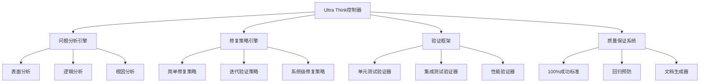
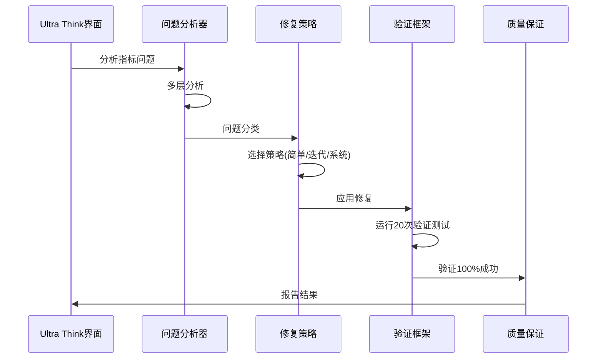
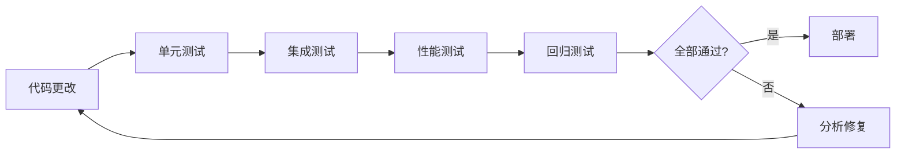

# 技术指标系统修复和测试设计文档

## 概述

本设计文档概述了使用已验证的Ultra Think方法论系统性修复和测试技术指标系统的架构和实施方法。系统将把当前18个指标100%成功率的成果扩展到覆盖全部112+个指标。

## 架构设计

### 核心组件



### 数据流架构



## 组件和接口

### 1. Ultra Think控制器

**目的**：实施Ultra Think方法论的中央编排器

**核心方法**：
- `analyze_indicator_problem(indicator_name)` - 执行多层问题分析
- `select_repair_strategy(problem_classification)` - 选择适当的修复方法
- `execute_repair_with_validation(strategy, indicator)` - 应用修复并持续验证
- `ensure_perfect_standard(test_results)` - 强制执行100%成功要求

**接口定义**：
```python
class UltraThinkController:
    def repair_indicator(self, indicator_name: str) -> RepairResult:
        """应用Ultra Think方法论修复指标"""
        
    def validate_repair_quality(self, indicator_name: str) -> QualityReport:
        """确保修复满足100%完美标准"""
        
    def generate_repair_documentation(self, repair_session: RepairSession) -> Documentation:
        """记录修复过程以便知识传承"""
```

### 2. 问题分析引擎

**目的**：实施Ultra Think方法论的三层分析方法

**分析层次**：
1. **表面分析**：直接错误观察和症状记录
2. **逻辑分析**：数据流追踪和组件交互分析  
3. **根因分析**：深层系统级问题识别

**核心方法**：
- `analyze_surface_symptoms(indicator)` - 记录直接可观察的错误
- `trace_data_flow(indicator)` - 跟踪数据在系统组件间的流转
- `identify_root_cause(symptoms, flow_analysis)` - 确定根本问题

### 3. 修复策略引擎

**目的**：基于问题分类实施不同的修复策略

**策略类型**：

#### 简单修复策略
- **使用场景**：单一组件，明确错误信息
- **方法**：直接修复加单次验证
- **成功标准**：最低80%成功率

#### 迭代验证策略  
- **使用场景**：动态指标（BOLL、KDJ类型问题）
- **方法**：多次尝试加最终状态验证
- **成功标准**：要求100%成功率

#### 系统级修复策略
- **使用场景**：多组件架构问题
- **方法**：分层修复加集成测试
- **成功标准**：100%成功率加完整集成

### 4. 验证框架

**目的**：全面测试确保修复满足Ultra Think标准

**验证级别**：
1. **单元验证**：个别指标功能
2. **集成验证**：系统组件交互
3. **性能验证**：大规模处理能力
4. **回归验证**：确保现有功能不变

**质量标准**：
- **基础标准**：80%成功率（初步修复）
- **生产标准**：90%成功率（部署前）
- **完美标准**：100%成功率（Ultra Think要求）

## 数据模型

### 修复会话
```python
@dataclass
class RepairSession:
    indicator_name: str
    start_time: datetime
    problem_analysis: ProblemAnalysis
    repair_strategy: RepairStrategy
    validation_results: List[ValidationResult]
    final_status: RepairStatus
    documentation: RepairDocumentation
```

### 问题分析
```python
@dataclass
class ProblemAnalysis:
    surface_symptoms: List[str]
    data_flow_issues: List[DataFlowIssue]
    root_causes: List[RootCause]
    problem_classification: ProblemType
    complexity_level: ComplexityLevel
```

### 验证结果
```python
@dataclass
class ValidationResult:
    test_round: int
    success_rate: float
    failed_tests: List[TestFailure]
    performance_metrics: PerformanceMetrics
    meets_perfect_standard: bool
```

## 错误处理

### 错误分类系统
1. **表面错误**：直接测试失败、导入错误
2. **逻辑错误**：计算错误、数据格式问题
3. **集成错误**：组件交互问题
4. **系统错误**：架构级设计缺陷

### 错误恢复策略
- **优雅降级**：回退到更简单的实现
- **迭代重试**：多次修复尝试加策略调整
- **回滚能力**：返回到最后已知良好状态
- **文档记录**：记录所有失败以供学习

## 测试策略

### 多级测试方法

#### 第1级：单元测试
- **范围**：个别指标方法
- **频率**：每次代码更改后
- **成功标准**：100%测试通过率
- **工具**：pytest，自定义指标测试框架

#### 第2级：集成测试  
- **范围**：指标与买点分析系统的交互
- **频率**：指标修复完成后
- **成功标准**：现有功能无回归
- **工具**：集成测试套件，系统健康检查

#### 第3级：系统测试
- **范围**：4000+股票的完整系统
- **频率**：批量修复后（5-10个指标）
- **成功标准**：性能和准确性保持
- **工具**：负载测试框架，性能监控器

#### 第4级：回归测试
- **范围**：所有之前修复的指标
- **频率**：每次部署前
- **成功标准**：任何已修复指标无降级
- **工具**：自动化回归测试套件

### 持续验证流程



## 实施阶段

### 第1阶段：框架搭建（第1周）
- 实施Ultra Think控制器
- 建立问题分析引擎
- 创建基础修复策略引擎
- 建立验证框架

### 第2阶段：核心修复引擎（第2周）
- 实施所有三种修复策略
- 添加全面验证逻辑
- 创建质量保证系统
- 构建文档生成器

### 第3阶段：批量处理（第3-4周）
- 将方法论应用到剩余94+个指标
- 实施并行处理以提高效率
- 添加监控和告警
- 创建全面报告

### 第4阶段：优化和监控（第5周）
- 性能优化
- 高级监控仪表板
- 知识库完善
- 团队培训材料

## 性能考虑

### 可扩展性要求
- **并发修复**：支持5-10个指标同时修复
- **大数据集处理**：高效处理4000+股票
- **内存管理**：针对大规模操作优化
- **响应时间**：个别操作保持亚秒级响应

### 优化策略
- **缓存**：缓存计算结果和测试数据
- **并行处理**：利用多核处理进行批量操作
- **延迟加载**：按需加载指标数据
- **资源池**：重用数据库连接和计算资源

## 安全性和可靠性

### 数据完整性
- **验证**：确保所有计算产生一致结果
- **备份**：维护工作指标实现的备份
- **版本控制**：详细版本历史跟踪所有更改
- **回滚**：失败修复的快速回滚能力

### 系统可靠性
- **错误隔离**：防止单个指标失败影响系统
- **健康监控**：持续系统健康检查
- **告警**：关键问题的即时通知
- **恢复**：常见失败的自动恢复程序

## 监控和可观测性

### 关键指标
- **修复成功率**：达到100%标准的指标百分比
- **系统性能**：处理速度和资源利用率
- **错误率**：遇到的错误频率和类型
- **质量指标**：测试覆盖率和验证完整性

### 监控仪表板
- **实时状态**：当前系统健康和活跃修复
- **历史趋势**：成功率和性能随时间变化
- **告警管理**：活跃告警和解决状态
- **资源使用**：CPU、内存和数据库利用率

### 日志策略
- **结构化日志**：JSON格式日志便于解析
- **日志级别**：DEBUG、INFO、WARN、ERROR适当过滤
- **审计跟踪**：所有修复活动的完整记录
- **性能日志**：详细的时间和资源使用数据