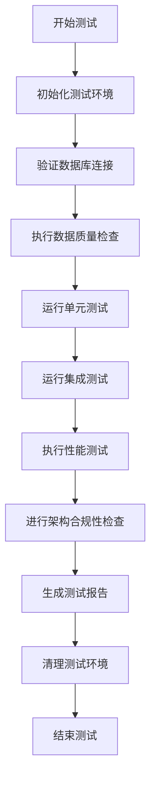

# 股票选股策略系统综合测试设计文档

## 概述

本设计文档基于需求文档，详细描述了股票选股策略系统综合测试的技术实现方案。测试系统将采用分层测试架构，确保从单元测试到集成测试的全面覆盖，同时严格遵循系统的六层架构原则。

## 架构设计

### 测试架构分层

```
L6: 测试应用层 (Test Application Layer)
├── test_runners/          # 测试执行器和主程序
├── test_suites/          # 测试套件管理
└── reporting/            # 测试报告生成

L5: 测试业务层 (Test Business Layer)  
├── strategy_tests/       # 选股策略测试
├── performance_tests/    # 性能测试逻辑
└── validation_tests/     # 数据验证测试

L4: 测试服务层 (Test Service Layer)
├── indicator_tests/      # 技术指标测试服务
├── data_quality_tests/   # 数据质量测试服务
└── monitoring_tests/     # 监控测试服务

L3: 测试数据层 (Test Data Layer)
├── test_data_manager/    # 测试数据管理
├── mock_services/        # 模拟服务（仅用于单元测试）
└── database_tests/       # 数据库连接测试

L2: 测试基础设施层 (Test Infrastructure Layer)
├── test_config/          # 测试配置管理
├── test_utils/           # 测试工具
└── test_fixtures/        # 测试夹具

L1: 测试数据存储层 (Test Data Storage Layer)
├── test_data/            # 测试数据文件
└── test_results/         # 测试结果存储
```

### 核心组件设计

#### 1. 测试执行引擎
```python
class ComprehensiveTestEngine:
    """综合测试执行引擎"""
    
    def __init__(self):
        self.test_suites = []
        self.performance_monitor = PerformanceMonitor()
        self.report_generator = TestReportGenerator()
    
    def run_all_tests(self) -> TestResults:
        """执行所有测试套件"""
        pass
    
    def run_specific_suite(self, suite_name: str) -> TestResults:
        """执行特定测试套件"""
        pass
```

#### 2. 真实数据验证器
```python
class RealDataValidator:
    """真实数据验证器"""
    
    def __init__(self):
        self.query_executor = get_query_executor()
        self.data_quality_checker = DataQualityChecker()
    
    def validate_database_connection(self) -> bool:
        """验证数据库连接"""
        pass
    
    def validate_data_integrity(self) -> DataIntegrityReport:
        """验证数据完整性"""
        pass
    
    def validate_data_quality(self) -> DataQualityReport:
        """验证数据质量"""
        pass
```

#### 3. 选股功能测试器
```python
class StockSelectionTester:
    """选股功能测试器"""
    
    def __init__(self):
        self.strategy_factory = StrategyFactory()
        self.test_data_manager = TestDataManager()
    
    def test_dual_ma_strategy(self) -> StrategyTestResult:
        """测试双均线策略"""
        pass
    
    def test_main_force_strategy(self) -> StrategyTestResult:
        """测试主力行为策略"""
        pass
    
    def test_market_conditions(self) -> MarketConditionTestResult:
        """测试不同市场条件"""
        pass
```

#### 4. 性能基准测试器
```python
class PerformanceBenchmarkTester:
    """性能基准测试器"""
    
    def __init__(self):
        self.performance_monitor = PerformanceMonitor()
        self.memory_profiler = MemoryProfiler()
        self.query_analyzer = QueryAnalyzer()
    
    def test_single_stock_query_performance(self) -> PerformanceResult:
        """测试单股查询性能"""
        pass
    
    def test_batch_processing_performance(self) -> PerformanceResult:
        """测试批量处理性能"""
        pass
    
    def test_memory_usage(self) -> MemoryUsageReport:
        """测试内存使用情况"""
        pass
```

#### 5. 架构合规性检查器
```python
class ArchitectureComplianceChecker:
    """架构合规性检查器"""
    
    def __init__(self):
        self.dependency_analyzer = DependencyAnalyzer()
        self.code_analyzer = CodeAnalyzer()
    
    def check_layer_dependencies(self) -> ComplianceReport:
        """检查分层依赖关系"""
        pass
    
    def check_database_access_patterns(self) -> AccessPatternReport:
        """检查数据库访问模式"""
        pass
    
    def check_configuration_usage(self) -> ConfigurationReport:
        """检查配置使用情况"""
        pass
```

## 组件和接口

### 1. 测试数据管理接口

```python
class ITestDataManager:
    """测试数据管理接口"""
    
    def get_test_stock_codes(self, count: int) -> List[str]:
        """获取测试股票代码"""
        pass
    
    def get_historical_data(self, code: str, start_date: str, end_date: str) -> pd.DataFrame:
        """获取历史数据"""
        pass
    
    def get_market_condition_data(self, condition: MarketCondition) -> pd.DataFrame:
        """获取特定市场条件数据"""
        pass
```

### 2. 性能监控接口

```python
class IPerformanceMonitor:
    """性能监控接口"""
    
    def start_monitoring(self, test_name: str) -> None:
        """开始监控"""
        pass
    
    def stop_monitoring(self) -> PerformanceMetrics:
        """停止监控并返回指标"""
        pass
    
    def get_memory_usage(self) -> MemoryMetrics:
        """获取内存使用情况"""
        pass
    
    def get_query_performance(self) -> QueryMetrics:
        """获取查询性能指标"""
        pass
```

### 3. 测试报告接口

```python
class ITestReportGenerator:
    """测试报告生成接口"""
    
    def generate_comprehensive_report(self, results: TestResults) -> str:
        """生成综合测试报告"""
        pass
    
    def generate_performance_report(self, metrics: PerformanceMetrics) -> str:
        """生成性能测试报告"""
        pass
    
    def generate_coverage_report(self, coverage: CoverageData) -> str:
        """生成覆盖率报告"""
        pass
```

## 数据模型

### 1. 测试结果数据模型

```python
@dataclass
class TestResult:
    """单个测试结果"""
    test_name: str
    status: TestStatus
    execution_time: float
    error_message: Optional[str]
    metrics: Dict[str, Any]

@dataclass
class TestSuiteResult:
    """测试套件结果"""
    suite_name: str
    total_tests: int
    passed_tests: int
    failed_tests: int
    skipped_tests: int
    execution_time: float
    test_results: List[TestResult]

@dataclass
class ComprehensiveTestResults:
    """综合测试结果"""
    start_time: datetime
    end_time: datetime
    total_execution_time: float
    suite_results: List[TestSuiteResult]
    performance_metrics: PerformanceMetrics
    coverage_report: CoverageReport
    compliance_report: ComplianceReport
```

### 2. 性能指标数据模型

```python
@dataclass
class PerformanceMetrics:
    """性能指标"""
    cpu_usage: float
    memory_usage: float
    disk_io: float
    network_io: float
    query_execution_times: List[float]
    cache_hit_rate: float
    connection_pool_usage: int

@dataclass
class QueryMetrics:
    """查询指标"""
    query_type: str
    execution_time: float
    rows_returned: int
    memory_used: float
    cache_hit: bool

@dataclass
class MemoryMetrics:
    """内存指标"""
    peak_memory: float
    average_memory: float
    memory_leaks: List[str]
    gc_collections: int
```

### 3. 数据质量模型

```python
@dataclass
class DataQualityReport:
    """数据质量报告"""
    total_records: int
    missing_values: Dict[str, int]
    duplicate_records: int
    data_type_errors: List[str]
    value_range_errors: List[str]
    time_continuity_issues: List[str]
    quality_score: float

@dataclass
class DataIntegrityReport:
    """数据完整性报告"""
    required_fields_present: bool
    data_volume_sufficient: bool
    time_range_coverage: Dict[str, str]
    data_freshness: Dict[str, datetime]
    integrity_score: float
```

## 错误处理

### 1. 测试异常层次结构

```python
class TestException(Exception):
    """测试基础异常"""
    pass

class DataValidationException(TestException):
    """数据验证异常"""
    pass

class PerformanceTestException(TestException):
    """性能测试异常"""
    pass

class ArchitectureComplianceException(TestException):
    """架构合规性异常"""
    pass

class TestConfigurationException(TestException):
    """测试配置异常"""
    pass
```

### 2. 错误处理策略

```python
class TestErrorHandler:
    """测试错误处理器"""
    
    def __init__(self):
        self.logger = get_logger(__name__)
        self.error_recovery = ErrorRecoveryManager()
    
    def handle_test_failure(self, test_name: str, error: Exception) -> TestResult:
        """处理测试失败"""
        self.logger.error(f"测试失败: {test_name}, 错误: {error}")
        
        # 尝试错误恢复
        if self.error_recovery.can_recover(error):
            return self.error_recovery.recover_test(test_name, error)
        
        return TestResult(
            test_name=test_name,
            status=TestStatus.FAILED,
            error_message=str(error),
            execution_time=0.0,
            metrics={}
        )
    
    def handle_performance_degradation(self, metrics: PerformanceMetrics) -> None:
        """处理性能下降"""
        if metrics.query_execution_times and max(metrics.query_execution_times) > 10.0:
            self.logger.warning("检测到慢查询，建议优化")
        
        if metrics.memory_usage > 8.0:  # 8GB
            self.logger.warning("内存使用过高，可能存在内存泄漏")
```

## 测试策略

### 1. 单元测试策略

```python
class UnitTestStrategy:
    """单元测试策略"""
    
    def test_individual_indicators(self) -> List[TestResult]:
        """测试单个技术指标"""
        indicators = [
            'MA', 'MACD', 'RSI', 'KDJ', 'BOLL', 
            'DMI', 'TRIX', 'AROON', 'ROC', 'MOMENTUM'
        ]
        
        results = []
        for indicator in indicators:
            result = self._test_single_indicator(indicator)
            results.append(result)
        
        return results
    
    def test_strategy_components(self) -> List[TestResult]:
        """测试策略组件"""
        pass
    
    def test_data_access_components(self) -> List[TestResult]:
        """测试数据访问组件"""
        pass
```

### 2. 集成测试策略

```python
class IntegrationTestStrategy:
    """集成测试策略"""
    
    def test_end_to_end_workflow(self) -> TestResult:
        """测试端到端工作流"""
        # 1. 数据获取
        # 2. 指标计算
        # 3. 策略执行
        # 4. 结果输出
        pass
    
    def test_database_integration(self) -> TestResult:
        """测试数据库集成"""
        pass
    
    def test_component_interactions(self) -> List[TestResult]:
        """测试组件交互"""
        pass
```

### 3. 性能测试策略

```python
class PerformanceTestStrategy:
    """性能测试策略"""
    
    def test_load_performance(self) -> PerformanceResult:
        """测试负载性能"""
        test_cases = [
            {'stock_count': 1, 'expected_time': 2.0},
            {'stock_count': 100, 'expected_time': 30.0},
            {'stock_count': 1000, 'expected_time': 300.0},
            {'stock_count': 4000, 'expected_time': 1200.0}
        ]
        
        results = []
        for case in test_cases:
            result = self._execute_load_test(case)
            results.append(result)
        
        return PerformanceResult(results)
    
    def test_memory_performance(self) -> MemoryResult:
        """测试内存性能"""
        pass
    
    def test_concurrent_performance(self) -> ConcurrencyResult:
        """测试并发性能"""
        pass
```

## 监控和日志

### 1. 测试监控系统

```python
class TestMonitoringSystem:
    """测试监控系统"""
    
    def __init__(self):
        self.metrics_collector = MetricsCollector()
        self.alert_manager = AlertManager()
        self.dashboard = TestDashboard()
    
    def start_monitoring(self) -> None:
        """开始监控"""
        self.metrics_collector.start()
        self.dashboard.initialize()
    
    def collect_metrics(self) -> TestMetrics:
        """收集测试指标"""
        return self.metrics_collector.get_current_metrics()
    
    def check_alerts(self) -> List[Alert]:
        """检查告警"""
        return self.alert_manager.get_active_alerts()
```

### 2. 测试日志管理

```python
class TestLogManager:
    """测试日志管理器"""
    
    def __init__(self):
        self.logger = get_logger('test_system')
        self.log_aggregator = LogAggregator()
    
    def log_test_start(self, test_name: str) -> None:
        """记录测试开始"""
        self.logger.info(f"开始执行测试: {test_name}")
    
    def log_test_result(self, result: TestResult) -> None:
        """记录测试结果"""
        if result.status == TestStatus.PASSED:
            self.logger.info(f"测试通过: {result.test_name}")
        else:
            self.logger.error(f"测试失败: {result.test_name}, 错误: {result.error_message}")
    
    def log_performance_metrics(self, metrics: PerformanceMetrics) -> None:
        """记录性能指标"""
        self.logger.info(f"性能指标 - CPU: {metrics.cpu_usage}%, 内存: {metrics.memory_usage}GB")
```

## 报告生成

### 1. 综合测试报告

```python
class ComprehensiveTestReportGenerator:
    """综合测试报告生成器"""
    
    def generate_html_report(self, results: ComprehensiveTestResults) -> str:
        """生成HTML格式报告"""
        template = self._load_report_template()
        return template.render(results=results)
    
    def generate_json_report(self, results: ComprehensiveTestResults) -> str:
        """生成JSON格式报告"""
        return json.dumps(results, cls=TestResultEncoder, indent=2)
    
    def generate_performance_charts(self, metrics: PerformanceMetrics) -> List[str]:
        """生成性能图表"""
        charts = []
        
        # CPU使用率图表
        cpu_chart = self._create_cpu_chart(metrics)
        charts.append(cpu_chart)
        
        # 内存使用图表
        memory_chart = self._create_memory_chart(metrics)
        charts.append(memory_chart)
        
        # 查询性能图表
        query_chart = self._create_query_performance_chart(metrics)
        charts.append(query_chart)
        
        return charts
```

### 2. 覆盖率报告

```python
class CoverageReportGenerator:
    """覆盖率报告生成器"""
    
    def generate_code_coverage_report(self) -> CoverageReport:
        """生成代码覆盖率报告"""
        pass
    
    def generate_functional_coverage_report(self) -> FunctionalCoverageReport:
        """生成功能覆盖率报告"""
        pass
    
    def generate_scenario_coverage_report(self) -> ScenarioCoverageReport:
        """生成场景覆盖率报告"""
        pass
```

## 配置管理

### 1. 测试配置

```yaml
# test_config.yaml
test_configuration:
  database:
    host: "localhost"
    port: 9000
    database: "stock_test"
    timeout: 30
    
  performance_thresholds:
    single_stock_query: 2.0  # seconds
    batch_100_stocks: 30.0   # seconds
    batch_1000_stocks: 300.0 # seconds
    full_market_scan: 1200.0 # seconds
    max_memory_usage: 8.0    # GB
    
  test_data:
    sample_stock_codes: ["000001", "000002", "600000", "600036"]
    test_date_range:
      start: "2023-01-01"
      end: "2024-12-31"
    
  reporting:
    output_directory: "test_results"
    generate_html: true
    generate_json: true
    generate_charts: true
    
  monitoring:
    enable_real_time_monitoring: true
    alert_thresholds:
      cpu_usage: 80.0
      memory_usage: 6.0
      query_timeout: 10.0
```

### 2. 环境配置

```python
class TestEnvironmentConfig:
    """测试环境配置"""
    
    def __init__(self):
        self.config = self._load_config()
    
    def get_database_config(self) -> Dict[str, Any]:
        """获取数据库配置"""
        return self.config['database']
    
    def get_performance_thresholds(self) -> Dict[str, float]:
        """获取性能阈值"""
        return self.config['performance_thresholds']
    
    def get_test_data_config(self) -> Dict[str, Any]:
        """获取测试数据配置"""
        return self.config['test_data']
```

## 部署和执行

### 1. 测试执行流程



### 2. 持续集成配置

```yaml
# .github/workflows/comprehensive_test.yml
name: Comprehensive Stock Selection Testing

on:
  push:
    branches: [ main, develop ]
  pull_request:
    branches: [ main ]
  schedule:
    - cron: '0 2 * * *'  # 每天凌晨2点执行

jobs:
  comprehensive-test:
    runs-on: ubuntu-latest
    
    steps:
    - uses: actions/checkout@v2
    
    - name: Set up Python
      uses: actions/setup-python@v2
      with:
        python-version: '3.9'
    
    - name: Install dependencies
      run: |
        pip install -r requirements.txt
        pip install pytest pytest-cov pytest-html
    
    - name: Start ClickHouse
      run: |
        docker run -d --name clickhouse-server \
          -p 8123:8123 -p 9000:9000 \
          yandex/clickhouse-server
    
    - name: Run comprehensive tests
      run: |
        python -m pytest tests/comprehensive/ \
          --cov=. \
          --cov-report=html \
          --html=test_report.html \
          --self-contained-html
    
    - name: Upload test results
      uses: actions/upload-artifact@v2
      with:
        name: test-results
        path: |
          test_report.html
          htmlcov/
```

这个设计文档提供了一个全面的测试系统架构，涵盖了所有需求中提到的测试方面。接下来我需要询问用户是否对这个设计满意，然后继续创建任务文档。