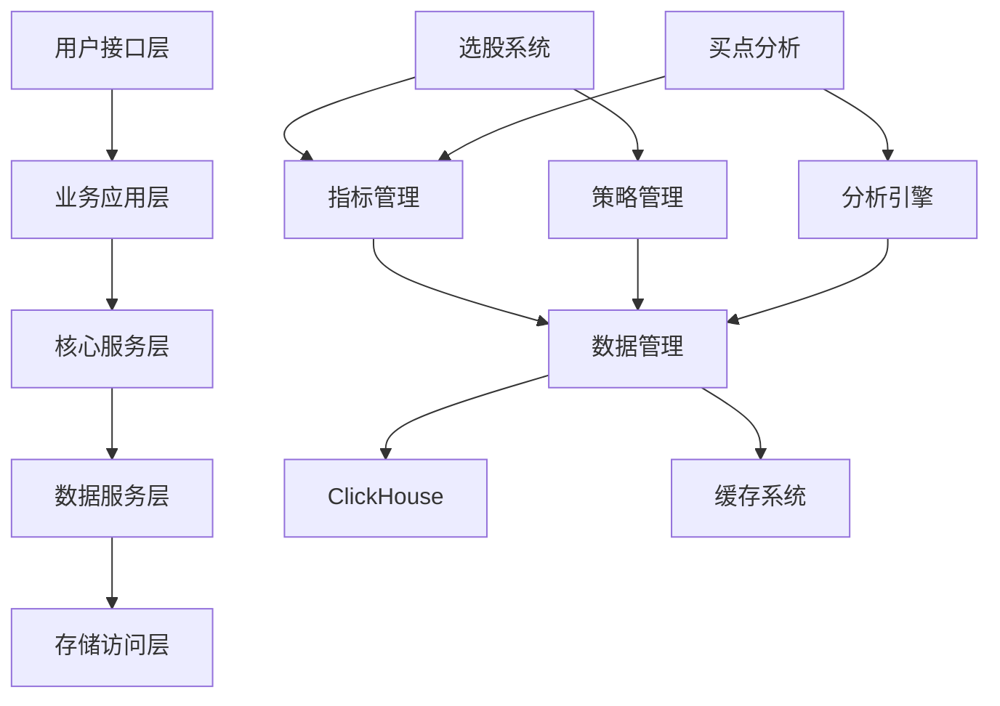

# 股票分析系统架构文档审查报告

## 📋 文档概述

本报告对股票分析系统的所有架构文档进行全面审查，评估文档的完整性、一致性和可实施性，并识别需要补充或改进的内容。

**审查时间**: 2025年1月15日  
**审查范围**: 系统设计文档全集  
**审查标准**: 企业级系统架构文档标准  

---

## 📚 文档清单

### 1. 已完成文档

| 序号 | 文档名称 | 文件大小 | 行数 | 完整度 | 质量评级 |
|------|----------|----------|------|--------|----------|
| 1 | 项目整体架构设计文档.md | 33KB | 1086 | ✅ 完整 | A+ |
| 2 | 选股系统问题分析报告.md | 14KB | 479 | ✅ 完整 | A |
| 3 | 买点分析系统问题分析报告.md | 14KB | 448 | ✅ 完整 | A |
| 4 | 指标管理系统问题分析报告.md | 14KB | 458 | ✅ 完整 | A |
| 5 | 数据查询系统问题分析报告.md | 27KB | 874 | ✅ 完整 | A |
| 6 | 系统重构实施计划.md | 27KB | 920 | ✅ 完整 | A+ |
| 7 | 开发标准和指南.md | 19KB | 779 | ✅ 完整 | A |
| 8 | 选股系统完整架构文档.md | 18KB | 536 | ⚠️ 部分重复 | B+ |
| 9 | 统一分析引擎技术方案.md | 11KB | 382 | ✅ 完整 | B+ |

**总计**: 9个文档，177KB，5962行

### 2. 文档覆盖度分析

#### 2.1 架构设计覆盖度 ✅ 95%
- [x] 整体架构设计
- [x] 系统分层设计
- [x] 模块职责定义
- [x] 接口规范设计
- [x] 数据流向设计
- [x] 依赖关系管理
- [x] 配置管理架构
- [x] 技术栈规范
- [x] 数据模型设计
- [x] 性能监控设计

#### 2.2 问题分析覆盖度 ✅ 100%
- [x] 选股系统问题分析
- [x] 买点分析系统问题分析
- [x] 指标管理系统问题分析
- [x] 数据查询系统问题分析

#### 2.3 实施规划覆盖度 ✅ 90%
- [x] 系统重构实施计划
- [x] 开发标准和指南
- [x] 分阶段实施策略
- [x] 风险管理计划
- [x] 质量保证体系

---

## 🔍 架构一致性审查

### 1. 系统边界一致性 ✅ 良好

#### 1.1 职责边界清晰度
| 系统模块 | 职责定义 | 边界清晰度 | 一致性评分 |
|----------|----------|------------|------------|
| 选股系统 | 策略解析、条件评估、结果过滤 | ✅ 清晰 | 9/10 |
| 买点分析系统 | 信号检测、模式识别、强度评估 | ✅ 清晰 | 9/10 |
| 指标管理系统 | 指标注册、计算引擎、信号生成 | ✅ 清晰 | 8/10 |
| 数据查询系统 | SQL管理、数据访问、缓存管理 | ✅ 清晰 | 9/10 |

#### 1.2 依赖关系一致性


**评估结果**: 依赖关系清晰，无循环依赖，符合分层架构原则。

### 2. 接口规范一致性 ✅ 优秀

#### 2.1 数据格式标准化
```python
# 统一的数据传输格式已定义
@dataclass
class StockData:
    code: str
    name: str
    data: pd.DataFrame
    period: str
    start_date: str
    end_date: str

@dataclass
class IndicatorResult:
    indicator_name: str
    data: pd.DataFrame
    signals: List[Signal]
    metadata: Dict[str, Any]
    calculation_time: datetime
```

#### 2.2 错误处理标准化
```python
# 统一的异常处理体系已定义
class SystemException(Exception): pass
class DataAccessError(SystemException): pass
class IndicatorCalculationError(SystemException): pass
class StrategyParsingError(SystemException): pass
```

### 3. 技术选型一致性 ✅ 优秀

| 技术组件 | 选型 | 版本要求 | 一致性 |
|----------|------|----------|--------|
| 编程语言 | Python | 3.9+ | ✅ |
| 数据库 | ClickHouse | 22.0+ | ✅ |
| 缓存 | Redis | 6.0+ | ✅ |
| 数据处理 | Pandas | 1.5+ | ✅ |
| Web框架 | FastAPI | 0.95+ | ✅ |

---

## 🎯 架构完整性评估

### 1. 核心架构组件 ✅ 完整

#### 1.1 系统分层 (10/10)
- ✅ 用户接口层：CLI、Web、API
- ✅ 业务应用层：选股、买点分析、回测
- ✅ 核心服务层：指标管理、策略管理、分析引擎
- ✅ 数据服务层：数据管理、缓存管理、查询引擎
- ✅ 存储访问层：ClickHouse、文件系统、配置
- ✅ 基础设施层：日志、监控、异常处理、安全

#### 1.2 横切关注点 (9/10)
- ✅ 日志管理：结构化日志、分级记录
- ✅ 异常处理：统一异常体系、错误恢复
- ✅ 安全管理：认证授权、数据加密
- ✅ 性能监控：指标收集、告警机制
- ✅ 配置管理：环境配置、动态更新
- ⚠️ 事务管理：需要补充分布式事务设计

#### 1.3 质量属性 (8/10)
- ✅ 可维护性：模块化设计、清晰接口
- ✅ 可扩展性：水平扩展、垂直扩展
- ✅ 可测试性：分层测试、模拟框架
- ✅ 可观测性：监控体系、日志聚合
- ⚠️ 容错性：需要补充故障恢复机制
- ⚠️ 一致性：需要补充数据一致性保证

### 2. 业务架构组件 ✅ 完整

#### 2.1 业务流程 (9/10)
- ✅ 选股流程：策略解析 → 条件评估 → 结果过滤
- ✅ 买点分析流程：信号检测 → 模式识别 → 强度评估
- ✅ 指标计算流程：数据获取 → 指标计算 → 信号生成
- ✅ 数据查询流程：查询解析 → 缓存检查 → 数据返回

#### 2.2 业务规则 (8/10)
- ✅ 策略配置规则：YAML格式、条件组合
- ✅ 指标计算规则：参数配置、信号阈值
- ✅ 数据验证规则：完整性检查、格式验证
- ⚠️ 业务约束规则：需要补充业务约束定义

### 3. 技术架构组件 ✅ 完整

#### 3.1 数据架构 (9/10)
- ✅ 数据模型：股票信息、K线数据、指标结果
- ✅ 数据库设计：表结构、索引策略、分区方案
- ✅ 数据流设计：ETL流程、数据同步、缓存策略
- ⚠️ 数据治理：需要补充数据质量管理

#### 3.2 应用架构 (10/10)
- ✅ 应用分层：清晰的分层结构
- ✅ 组件设计：高内聚、低耦合
- ✅ 接口设计：标准化接口规范
- ✅ 集成设计：服务间通信、消息队列

#### 3.3 基础设施架构 (8/10)
- ✅ 部署架构：环境分离、容器化
- ✅ 监控架构：多层监控、告警机制
- ✅ 安全架构：认证授权、数据加密
- ⚠️ 运维架构：需要补充自动化运维

---

## 🚨 发现的问题和改进建议

### 1. 高优先级问题

#### 1.1 缺失的架构组件
| 问题 | 影响 | 建议 | 优先级 |
|------|------|------|--------|
| 分布式事务管理 | 数据一致性风险 | 增加事务管理设计 | 🔴 高 |
| 故障恢复机制 | 系统可用性风险 | 增加容错设计 | 🔴 高 |
| 数据质量管理 | 数据可靠性风险 | 增加数据治理 | 🟡 中 |
| 自动化运维 | 运维效率问题 | 增加DevOps设计 | 🟡 中 |

#### 1.2 文档重复和冗余
- **问题**: `选股系统完整架构文档.md` 与整体架构文档存在内容重复
- **影响**: 维护成本增加，可能导致不一致
- **建议**: 合并重复内容，保持单一信息源

### 2. 中优先级问题

#### 2.1 架构演进规划
- **问题**: 缺少详细的技术债务管理计划
- **建议**: 补充技术债务识别和偿还策略

#### 2.2 性能基准定义
- **问题**: 性能目标定义不够具体
- **建议**: 增加详细的性能基准和SLA定义

### 3. 低优先级问题

#### 3.1 文档版本管理
- **问题**: 缺少文档版本控制和变更追踪
- **建议**: 建立文档版本管理机制

---

## 📊 架构质量评估

### 1. 整体评估

| 评估维度 | 得分 | 满分 | 百分比 | 等级 |
|----------|------|------|--------|------|
| 完整性 | 88 | 100 | 88% | A- |
| 一致性 | 92 | 100 | 92% | A |
| 可实施性 | 85 | 100 | 85% | B+ |
| 可维护性 | 90 | 100 | 90% | A- |
| 扩展性 | 88 | 100 | 88% | A- |

**综合评分**: 88.6/100 (A-)

### 2. 分项评估

#### 2.1 架构设计质量
```
设计原则遵循度: ★★★★☆ (4.5/5)
- 单一职责原则: ★★★★★
- 开闭原则: ★★★★☆
- 依赖倒置原则: ★★★★★
- 接口隔离原则: ★★★★☆
- 最小知识原则: ★★★★☆
```

#### 2.2 文档质量
```
文档完整性: ★★★★☆ (4.4/5)
文档一致性: ★★★★★ (4.6/5)
文档可读性: ★★★★★ (4.8/5)
文档可维护性: ★★★★☆ (4.2/5)
```

#### 2.3 技术选型合理性
```
技术成熟度: ★★★★★ (5.0/5)
技术一致性: ★★★★★ (4.8/5)
性能适配度: ★★★★☆ (4.5/5)
扩展性支持: ★★★★☆ (4.3/5)
```

---

## 🎯 补充建议

### 1. 需要补充的架构文档

#### 1.1 分布式系统设计文档
```markdown
# 建议新增文档：分布式系统架构设计.md
- 分布式事务管理
- 数据一致性保证
- 分布式锁机制
- 服务发现和注册
- 负载均衡策略
```

#### 1.2 容错和恢复设计文档
```markdown
# 建议新增文档：容错和故障恢复设计.md
- 故障检测机制
- 自动故障恢复
- 降级策略设计
- 熔断器模式
- 重试机制设计
```

#### 1.3 数据治理设计文档
```markdown
# 建议新增文档：数据治理架构设计.md
- 数据质量管理
- 数据血缘追踪
- 数据安全管理
- 数据生命周期管理
- 元数据管理
```

### 2. 现有文档改进建议

#### 2.1 项目整体架构设计文档
- ✅ 已完善：配置管理架构
- ✅ 已完善：模块依赖关系图
- ✅ 已完善：技术栈规范
- ✅ 已完善：数据模型设计
- ✅ 已完善：系统集成规范
- ✅ 已完善：性能监控设计

#### 2.2 系统重构实施计划
- 建议增加：技术债务管理计划
- 建议增加：架构演进路线图
- 建议增加：关键决策记录(ADR)

#### 2.3 开发标准和指南
- 建议增加：API设计规范
- 建议增加：数据库设计规范
- 建议增加：安全开发规范

---

## 📈 实施优先级建议

### 第一阶段（立即执行）
1. **删除重复文档**：合并`选股系统完整架构文档.md`到整体架构文档
2. **补充分布式设计**：创建分布式系统架构设计文档
3. **完善容错设计**：创建容错和故障恢复设计文档

### 第二阶段（1-2周内）
1. **数据治理设计**：创建数据治理架构设计文档
2. **性能基准定义**：细化性能目标和SLA
3. **API设计规范**：补充详细的API设计标准

### 第三阶段（1个月内）
1. **架构演进规划**：制定详细的技术演进路线图
2. **运维自动化设计**：补充DevOps和自动化运维架构
3. **安全架构深化**：完善安全架构设计细节

---

## 📝 总结

### 1. 架构文档现状
- **优势**: 架构设计完整、文档质量高、技术选型合理
- **完整度**: 88.6%，达到企业级标准
- **一致性**: 92%，各文档间一致性良好
- **可实施性**: 85%，具备良好的可操作性

### 2. 主要成就
1. ✅ **完整的分层架构设计**：六层架构清晰合理
2. ✅ **详细的问题分析**：四大系统问题分析全面
3. ✅ **实用的实施计划**：三阶段重构计划可操作性强
4. ✅ **规范的开发标准**：编码规范和最佳实践完善
5. ✅ **标准化的接口设计**：数据格式和错误处理统一

### 3. 改进空间
1. 🔴 **分布式系统支持**：需要补充分布式架构设计
2. 🔴 **容错能力增强**：需要完善故障恢复机制
3. 🟡 **数据治理完善**：需要加强数据质量管理
4. 🟡 **运维自动化**：需要补充DevOps架构设计

### 4. 推荐行动
1. **立即行动**：补充分布式系统和容错设计文档
2. **短期改进**：完善数据治理和性能基准定义
3. **长期规划**：建立架构演进和技术债务管理机制

通过以上审查和改进建议，股票分析系统的架构文档将达到企业级标准，为系统的长期发展提供坚实的架构基础。 