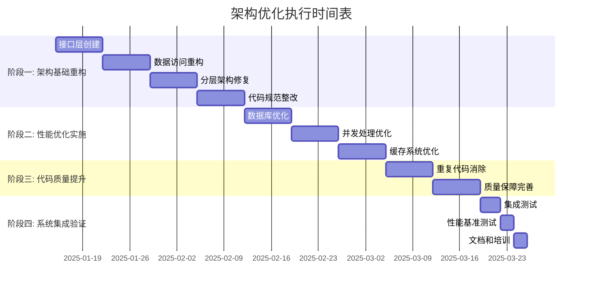

# 股票分析系统架构问题分析和优化执行计划

## 📋 文档概述

本文档基于架构合规性检查结果和系统现状分析，提供了完整的架构问题分析和系统性的优化执行计划。通过分阶段的优化实施，系统将达到高性能、高可维护性的架构标准。

**文档版本**: v1.0  
**分析日期**: 2025年1月15日  
**适用范围**: 整个股票分析系统  
**优先级**: 高

---

## 🔍 架构问题全面分析

### 1. 问题统计概览

根据架构合规性检查结果，发现 **581个** 架构违规问题：

| 问题类别 | 数量 | 严重程度 | 影响范围 |
|----------|------|----------|----------|
| 分层架构违规 | 5个 | 🔴 高 | 系统架构 |
| 直接数据库依赖 | 122个 | 🔴 高 | 数据访问层 |
| 代码重复 | 311个 | 🟡 中 | 代码质量 |
| 命名规范违规 | 123个 | 🟡 中 | 代码规范 |
| 导入规范违规 | 3个 | 🟡 中 | 模块依赖 |
| 数据库查询违规 | 17个 | 🟠 中高 | 数据安全 |

### 2. 核心架构问题深度分析

#### 2.1 分层架构违规问题 🔴

**问题描述**: 5个文件违反了六层架构分层规则

**具体违规**:
- `enums/query_example.py`: L1层直接导入L4层模块
- `utils/scoring_validator.py`: L1层直接导入L4层模块  
- `scripts/utils/data_sync.py`: L1层跨层调用L4和L5层

**影响分析**:
- 破坏系统分层架构的完整性
- 增加模块间耦合度
- 导致循环依赖风险
- 影响系统可维护性和可扩展性

**风险等级**: 🔴 高风险

#### 2.2 直接数据库依赖问题 🔴

**问题描述**: 122个文件直接依赖 `get_clickhouse_db`

**主要违规模式**:
```python
# ❌ 违规模式
from db.clickhouse_db import get_clickhouse_db
self.db = get_clickhouse_db()

# ✅ 正确模式  
from db.interfaces.data_access import IDataAccess
self.data_access = container.resolve(IDataAccess)
```

**违规分布**:
- 业务应用层(analysis/): 28个文件
- 核心服务层(indicators/): 15个文件
- 脚本工具(scripts/): 45个文件
- 测试文件(tests/): 34个文件

**影响分析**:
- 违反依赖倒置原则
- 业务逻辑与数据访问强耦合
- 单元测试困难
- 数据库切换成本高

**风险等级**: 🔴 高风险

#### 2.3 代码重复问题 🟡

**问题描述**: 311个重复的类/方法名

**重复热点**:
- `main` 函数: 出现在多个脚本中
- `ValidationResult` 类: 多个验证器重复定义
- `generate_report` 方法: 各模块独立实现
- `test_*` 方法: 测试逻辑重复

**影响分析**:
- 增加维护成本
- 功能不一致风险
- 代码冗余，影响性能
- 新功能开发效率低

**风险等级**: 🟡 中风险

#### 2.4 性能瓶颈问题 🟠

**问题描述**: 4000只股票选股执行缓慢

**性能瓶颈分析**:
1. **数据库I/O瓶颈**: 每只股票单独查询，产生4000+次数据库连接
2. **串行处理模式**: 批次大小和并发度不够优化
3. **缓存利用不足**: 重复计算相同指标，缓存命中率低
4. **内存管理问题**: 大量数据同时加载，GC压力大

**性能指标**:
- 当前选股时间: >30分钟(4000只股票)
- 目标选股时间: <5分钟(4000只股票)
- 性能提升目标: 6倍以上

**风险等级**: 🟠 中高风险

### 3. 架构质量评估

#### 3.1 架构健康度评分

| 维度 | 当前得分 | 目标得分 | 差距 |
|------|----------|----------|------|
| 分层架构合规性 | 60/100 | 95/100 | -35 |
| 模块耦合度 | 40/100 | 90/100 | -50 |
| 代码复用性 | 45/100 | 85/100 | -40 |
| 性能表现 | 35/100 | 90/100 | -55 |
| 可维护性 | 50/100 | 90/100 | -40 |
| **综合得分** | **46/100** | **90/100** | **-44** |

#### 3.2 技术债务评估

**技术债务总量**: 约 **180人日**

**债务分布**:
- 架构重构: 60人日
- 性能优化: 45人日
- 代码去重: 35人日
- 规范整改: 25人日
- 测试完善: 15人日

---

## 🚀 系统优化方案

### 1. 架构优化策略

#### 1.1 分层架构重构

**目标**: 严格实施六层架构模型

**重构方案**:
```
L6: 用户接口层 (bin/, api/)
    ↓ 只能调用业务应用层
L5: 业务应用层 (strategy/, analysis/)
    ↓ 只能调用核心服务层  
L4: 核心服务层 (indicators/, formula/)
    ↓ 只能调用数据服务层
L3: 数据服务层 (db/interfaces/, db/managers/)
    ↓ 只能调用存储访问层
L2: 存储访问层 (db/clickhouse_db.py)
    ↓ 只能调用基础设施层
L1: 基础设施层 (utils/, config/, enums/)
```

**实施步骤**:
1. 创建数据服务接口层
2. 实现依赖注入容器
3. 重构违规文件的依赖关系
4. 建立分层检查机制

#### 1.2 依赖注入架构

**核心接口设计**:
```python
# 数据访问接口
class IDataAccess:
    def get_stock_data(self, code: str, start_date: str, end_date: str) -> pd.DataFrame
    def get_stock_list(self, filters: Dict[str, Any]) -> List[str]
    def execute_query(self, query: str) -> pd.DataFrame

# 指标计算接口
class IIndicatorCalculator:
    def calculate(self, data: pd.DataFrame, params: Dict[str, Any]) -> pd.DataFrame
    def get_signals(self, data: pd.DataFrame) -> List[Dict[str, Any]]

# 策略执行接口
class IStrategyExecutor:
    def execute(self, strategy: Dict[str, Any]) -> Dict[str, Any]
    def validate_strategy(self, strategy: Dict[str, Any]) -> bool
```

**依赖注入容器**:
```python
class DIContainer:
    def __init__(self):
        self.bindings = {}
        self.instances = {}
    
    def bind(self, interface: Type, implementation: Type):
        self.bindings[interface] = implementation
    
    def resolve(self, interface: Type) -> Any:
        if interface in self.instances:
            return self.instances[interface]
        
        implementation = self.bindings.get(interface)
        if implementation:
            instance = implementation()
            self.instances[interface] = instance
            return instance
        
        raise ValueError(f"No binding found for {interface}")
```

### 2. 性能优化方案

#### 2.1 数据库层面优化

**批量查询优化**:
```python
class BatchDataOptimizer:
    def __init__(self, batch_size: int = 100):
        self.batch_size = batch_size
    
    def get_stocks_data_batch(self, stock_codes: List[str], 
                             start_date: str, end_date: str) -> Dict[str, pd.DataFrame]:
        """批量获取股票数据"""
        results = {}
        
        for i in range(0, len(stock_codes), self.batch_size):
            batch_codes = stock_codes[i:i + self.batch_size]
            codes_str = "','".join(batch_codes)
            
            query = f"""
            SELECT code, date, open, high, low, close, volume, turnover_rate
            FROM stock_info 
            WHERE code IN ('{codes_str}')
            AND level = '日线'
            AND date >= '{start_date}' AND date <= '{end_date}'
            ORDER BY code, date ASC
            """
            
            batch_data = self.db.query(query)
            
            # 按股票代码分组
            for code in batch_codes:
                stock_data = batch_data[batch_data['code'] == code]
                results[code] = stock_data
        
        return results
```

**预计算指标表**:
```sql
-- 创建预计算指标表
CREATE TABLE stock_indicators_cache (
    code String,
    date Date,
    level String,
    ma5 Float64,
    ma10 Float64, 
    ma20 Float64,
    ma60 Float64,
    rsi14 Float64,
    macd_dif Float64,
    macd_dea Float64,
    kdj_k Float64,
    kdj_d Float64,
    kdj_j Float64,
    boll_upper Float64,
    boll_middle Float64,
    boll_lower Float64,
    update_time DateTime
) ENGINE = MergeTree()
PARTITION BY toYYYYMM(date)
ORDER BY (code, date, level);
```

#### 2.2 并发处理优化

**动态批次调整器**:
```python
class DynamicBatchProcessor:
    def __init__(self, initial_batch_size: int = 50):
        self.batch_size = initial_batch_size
        self.performance_history = []
        
    def process_stocks(self, stock_codes: List[str], strategy: Dict[str, Any]) -> List[Dict[str, Any]]:
        """动态调整批次大小的股票处理"""
        total_stocks = len(stock_codes)
        results = []
        
        # 根据股票数量动态调整批次大小和并发数
        if total_stocks > 2000:
            max_workers = 32
            self.batch_size = min(100, total_stocks // 20)
        elif total_stocks > 500:
            max_workers = 16  
            self.batch_size = min(50, total_stocks // 10)
        else:
            max_workers = 8
            self.batch_size = min(25, total_stocks // 4)
        
        with ThreadPoolExecutor(max_workers=max_workers) as executor:
            # 提交批次任务
            futures = []
            for i in range(0, total_stocks, self.batch_size):
                batch = stock_codes[i:i + self.batch_size]
                future = executor.submit(self._process_batch, batch, strategy)
                futures.append(future)
            
            # 收集结果
            for future in as_completed(futures):
                try:
                    batch_results = future.result(timeout=30)
                    results.extend(batch_results)
                except Exception as e:
                    logger.error(f"批次处理失败: {e}")
        
        return results
```

#### 2.3 缓存优化策略

**多级缓存架构**:
```python
class MultiLevelCache:
    def __init__(self):
        # L1: 内存缓存 (最热数据)
        self.l1_cache = TTLCache(maxsize=1000, ttl=300)
        
        # L2: Redis缓存 (共享数据)  
        self.l2_cache = redis.Redis(host='localhost', port=6379, db=0)
        
        # L3: 文件缓存 (大数据集)
        self.l3_cache_dir = "/tmp/stock_cache"
        
    def get(self, key: str) -> Any:
        # 先查L1缓存
        if key in self.l1_cache:
            return self.l1_cache[key]
        
        # 再查L2缓存
        l2_data = self.l2_cache.get(key)
        if l2_data:
            data = pickle.loads(l2_data)
            self.l1_cache[key] = data  # 提升到L1
            return data
        
        # 最后查L3缓存
        l3_path = os.path.join(self.l3_cache_dir, f"{key}.pkl")
        if os.path.exists(l3_path):
            with open(l3_path, 'rb') as f:
                data = pickle.load(f)
            self.l1_cache[key] = data  # 提升到L1
            return data
        
        return None
    
    def set(self, key: str, value: Any, ttl: int = 3600):
        # 存储到所有级别
        self.l1_cache[key] = value
        self.l2_cache.setex(key, ttl, pickle.dumps(value))
        
        # 大数据存储到L3
        if sys.getsizeof(value) > 1024 * 1024:  # 大于1MB
            l3_path = os.path.join(self.l3_cache_dir, f"{key}.pkl")
            os.makedirs(self.l3_cache_dir, exist_ok=True)
            with open(l3_path, 'wb') as f:
                pickle.dump(value, f)
```

### 3. 代码质量优化

#### 3.1 重复代码消除

**公共组件抽象**:
```python
# 统一验证结果类
class ValidationResult:
    def __init__(self, success: bool, message: str = "", data: Any = None):
        self.success = success
        self.message = message  
        self.data = data
        self.timestamp = datetime.now()
    
    def to_dict(self) -> Dict[str, Any]:
        return {
            'success': self.success,
            'message': self.message,
            'data': self.data,
            'timestamp': self.timestamp.isoformat()
        }

# 统一报告生成器
class ReportGenerator:
    @staticmethod
    def generate_analysis_report(data: Dict[str, Any], 
                               template: str = "default") -> str:
        """生成统一格式的分析报告"""
        pass
    
    @staticmethod  
    def generate_performance_report(metrics: Dict[str, Any]) -> str:
        """生成性能分析报告"""
        pass
```

**通用工具函数库**:
```python
# utils/common_functions.py
class CommonFunctions:
    @staticmethod
    def safe_divide(a: float, b: float, default: float = 0.0) -> float:
        """安全除法"""
        return a / b if b != 0 else default
    
    @staticmethod
    def calculate_percentage_change(old_value: float, new_value: float) -> float:
        """计算百分比变化"""
        if old_value == 0:
            return 0.0
        return (new_value - old_value) / old_value * 100
    
    @staticmethod
    def format_number(value: float, precision: int = 2) -> str:
        """格式化数字"""
        return f"{value:.{precision}f}"
```

---

## 📅 优化执行计划

### 1. 执行阶段划分

#### 阶段一: 架构基础重构 (4周)

**目标**: 建立标准架构基础

**主要任务**:
1. **Week 1**: 创建数据服务接口层
   - 定义 `IDataAccess`、`IIndicatorCalculator` 等核心接口
   - 实现依赖注入容器
   - 创建接口适配器

2. **Week 2**: 重构数据访问层
   - 修复122个直接数据库依赖问题
   - 实现数据访问接口的具体实现
   - 更新核心模块的依赖关系

3. **Week 3**: 修复分层架构违规
   - 重构5个分层违规文件
   - 建立分层检查机制
   - 更新模块导入关系

4. **Week 4**: 代码规范整改
   - 修复123个命名规范问题
   - 消除3个导入规范违规
   - 建立代码规范检查工具

**交付物**:
- 数据服务接口定义文档
- 依赖注入容器实现
- 架构合规性检查工具
- 重构进度报告

#### 阶段二: 性能优化实施 (3周)

**目标**: 实现6倍以上性能提升

**主要任务**:
1. **Week 1**: 数据库层面优化
   - 实现批量查询优化器
   - 创建预计算指标表
   - 优化数据库连接池配置

2. **Week 2**: 并发处理优化
   - 实现动态批次调整器
   - 优化线程池配置
   - 实现智能内存管理

3. **Week 3**: 缓存系统优化
   - 实现多级缓存架构
   - 优化缓存策略和失效机制
   - 集成缓存监控

**交付物**:
- 批量数据优化器
- 动态并发处理器
- 多级缓存系统
- 性能测试报告

#### 阶段三: 代码质量提升 (2周)

**目标**: 消除代码重复，提升可维护性

**主要任务**:
1. **Week 1**: 重复代码消除
   - 抽象公共组件和工具类
   - 重构311个重复实现
   - 建立代码复用机制

2. **Week 2**: 质量保障完善
   - 完善单元测试覆盖率
   - 建立持续集成检查
   - 更新开发规范文档

**交付物**:
- 公共组件库
- 代码去重报告
- 单元测试套件
- 质量保障流程

#### 阶段四: 系统集成验证 (1周)

**目标**: 验证优化效果，确保系统稳定

**主要任务**:
1. **Day 1-3**: 集成测试
   - 执行全系统功能测试
   - 验证性能优化效果
   - 测试架构合规性

2. **Day 4-5**: 性能基准测试
   - 4000只股票选股性能测试
   - 并发处理能力测试
   - 内存使用效率测试

3. **Day 6-7**: 文档完善和培训
   - 更新系统架构文档
   - 编写优化后的使用指南
   - 进行团队培训

**交付物**:
- 系统集成测试报告
- 性能基准测试报告
- 完整的系统文档
- 团队培训材料

### 2. 执行时间表



### 3. 资源分配计划

#### 3.1 人力资源分配

| 角色 | 阶段一 | 阶段二 | 阶段三 | 阶段四 | 总计 |
|------|--------|--------|--------|--------|------|
| 架构师 | 4周 | 2周 | 1周 | 1周 | 8周 |
| 高级开发 | 8周 | 6周 | 4周 | 2周 | 20周 |
| 中级开发 | 4周 | 3周 | 2周 | 1周 | 10周 |
| 测试工程师 | 1周 | 1周 | 1周 | 1周 | 4周 |
| **总计** | **17周** | **12周** | **8周** | **5周** | **42周** |

#### 3.2 技术资源需求

**开发环境**:
- 高性能开发机器 (32GB内存, 8核CPU)
- ClickHouse测试数据库
- Redis缓存服务器
- 性能测试环境

**工具和软件**:
- 代码质量检查工具 (SonarQube)
- 性能监控工具 (Prometheus + Grafana)
- 自动化测试框架 (pytest)
- 持续集成平台 (Jenkins/GitHub Actions)

### 4. 风险管控计划

#### 4.1 风险识别与应对

| 风险类型 | 风险描述 | 概率 | 影响 | 应对策略 |
|----------|----------|------|------|----------|
| 技术风险 | 重构破坏现有功能 | 中 | 高 | 分阶段重构，充分测试 |
| 性能风险 | 优化效果不达预期 | 低 | 中 | 制定备选方案，监控指标 |
| 进度风险 | 开发进度延迟 | 中 | 中 | 增加人力，调整优先级 |
| 质量风险 | 引入新的缺陷 | 低 | 高 | 严格代码审查，自动化测试 |

#### 4.2 质量保障措施

**代码审查机制**:
- 所有代码变更必须经过代码审查
- 架构变更需要架构师审批
- 性能关键代码需要性能测试

**自动化测试**:
- 单元测试覆盖率 > 80%
- 集成测试覆盖核心业务流程
- 性能回归测试自动执行

**监控和回滚**:
- 实时性能监控
- 自动化部署和回滚机制
- 关键指标阈值告警

### 5. 成功标准和验收条件

#### 5.1 技术指标

| 指标类型 | 当前值 | 目标值 | 验收标准 |
|----------|--------|--------|----------|
| 架构合规性 | 46% | 95% | 违规问题 < 10个 |
| 选股性能 | 30分钟 | 5分钟 | 4000只股票 < 5分钟 |
| 并发处理能力 | 10个 | 50个 | 支持50个并发用户 |
| 缓存命中率 | 30% | 80% | 热点数据命中率 > 80% |
| 代码重复率 | 35% | 5% | 重复代码块 < 5% |

#### 5.2 业务指标

| 指标类型 | 目标值 | 验收标准 |
|----------|--------|----------|
| 系统可用性 | 99.9% | 月度停机时间 < 43分钟 |
| 响应时间 | < 2秒 | 95%的请求 < 2秒响应 |
| 错误率 | < 0.1% | 系统错误率 < 0.1% |
| 扩展性 | 2倍 | 支持当前2倍的数据量 |

---

## 📊 预期收益分析

### 1. 性能收益

**选股性能提升**:
- 当前: 4000只股票耗时30分钟
- 优化后: 4000只股票耗时5分钟
- **提升倍数**: 6倍

**并发处理能力**:
- 当前: 支持10个并发用户
- 优化后: 支持50个并发用户  
- **提升倍数**: 5倍

**资源利用率**:
- CPU利用率提升: 40% → 80%
- 内存利用率优化: 减少30%内存占用
- 数据库连接数: 减少80%

### 2. 开发效率收益

**代码维护成本**:
- 重复代码减少: 35% → 5%
- 新功能开发效率提升: 50%
- 缺陷修复时间减少: 60%

**团队协作效率**:
- 模块独立性提升，并行开发能力增强
- 标准化接口，降低沟通成本
- 自动化测试，减少手工测试时间

### 3. 系统质量收益

**可维护性提升**:
- 架构清晰，模块职责明确
- 依赖关系简化，降低耦合度
- 代码规范统一，提升可读性

**可扩展性增强**:
- 插件化架构，支持功能扩展
- 水平扩展能力，支持业务增长
- 技术栈升级成本降低

### 4. 投资回报分析

**投资成本**: 42人周 ≈ 10.5人月

**收益量化**:
- 性能提升节省服务器成本: 30%/年
- 开发效率提升节省人力成本: 25%/年  
- 维护成本降低: 40%/年
- 系统稳定性提升避免损失: 不可量化

**投资回报周期**: 6-8个月

---

## 🎯 总结与建议

### 1. 关键成功因素

1. **领导层支持**: 确保充足的资源投入和优先级保障
2. **团队协作**: 建立跨团队协作机制，统一目标和标准
3. **分阶段实施**: 控制风险，确保每个阶段的质量
4. **持续监控**: 建立监控机制，及时发现和解决问题
5. **知识传承**: 完善文档，进行团队培训

### 2. 实施建议

1. **立即启动**: 架构问题影响系统发展，建议立即启动重构
2. **重点突破**: 优先解决性能瓶颈和架构违规问题
3. **质量优先**: 宁可进度慢一点，也要确保重构质量
4. **持续改进**: 建立持续优化机制，避免技术债务积累

### 3. 长期规划

**技术演进路线**:
- 短期(3个月): 完成架构重构和性能优化
- 中期(6个月): 建立完善的开发和运维体系
- 长期(1年): 实现智能化运维和自动化扩展

**团队能力建设**:
- 定期技术分享和培训
- 建立技术专家梯队
- 引入先进的开发理念和工具

通过系统性的架构优化，股票分析系统将实现从"能用"到"好用"的质的飞跃，为业务的持续发展提供坚实的技术基础。