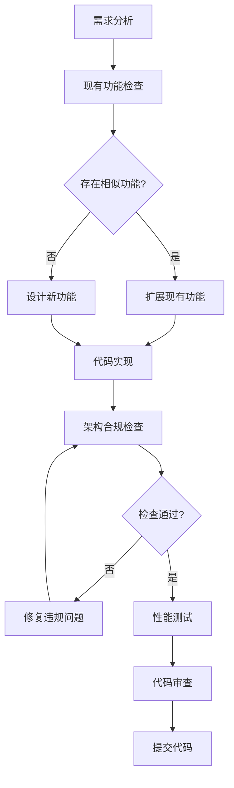

# 股票分析系统架构规则标准

## 📋 文档概述

本文档定义了股票分析系统的严格架构规则标准，所有开发工作必须严格遵守这些规则。本标准将同步到 Cursor project rules 中，确保 AI 生成的代码也严格遵守架构规范。

**文档版本**: v1.0  
**制定时间**: 2025年1月15日  
**适用范围**: 所有开发工作、代码生成、系统优化  
**强制等级**: 必须严格遵守

---

## 🏗️ 架构分层规则

### 1. 六层架构模型（严格分层）

```
L6: 用户接口层 (bin/, api/)
    ↓ 只能调用业务应用层
L5: 业务应用层 (strategy/, analysis/)
    ↓ 只能调用核心服务层
L4: 核心服务层 (indicators/, formula/)
    ↓ 只能调用数据服务层
L3: 数据服务层 (db/interfaces/, db/managers/)
    ↓ 只能调用存储访问层
L2: 存储访问层 (db/clickhouse_db.py)
    ↓ 只能调用基础设施层
L1: 基础设施层 (utils/, config/, enums/)
```

### 2. 分层依赖规则（强制执行）

| 规则编号 | 规则描述 | 违规后果 |
|----------|----------|----------|
| **R-L-001** | 上层只能依赖相邻下层，禁止跨层调用 | 立即重构 |
| **R-L-002** | 下层不得依赖上层，避免循环依赖 | 立即重构 |
| **R-L-003** | 同层之间通过接口交互，不直接调用 | 立即重构 |
| **R-L-004** | 业务层禁止直接访问存储层 | 立即重构 |
| **R-L-005** | 所有数据访问必须通过数据服务层 | 立即重构 |

---

## 🚫 禁止重复建设规则

### 1. 代码复用强制规则

| 规则编号 | 规则描述 | 检查方法 | 违规处理 |
|----------|----------|----------|----------|
| **R-R-001** | 禁止创建功能重复的脚本文件 | 代码审查 | 合并重复代码 |
| **R-R-002** | 新功能必须先检查现有实现 | 强制搜索 | 扩展现有功能 |
| **R-R-003** | 相似逻辑必须抽象为公共方法 | 静态分析 | 重构抽象 |
| **R-R-004** | 禁止复制粘贴代码超过10行 | 自动检测 | 立即重构 |
| **R-R-005** | 工具方法必须放在utils模块中 | 目录检查 | 移动到utils |

### 2. 功能扩展规则

```python
# ✅ 正确做法：扩展现有功能
class ExistingIndicatorCalculator:
    def calculate_macd(self, data, params):
        # 现有实现
        pass
    
    def calculate_kdj(self, data, params):  # 新增功能
        # 在现有类中添加新方法
        pass

# ❌ 错误做法：创建重复类
class NewIndicatorCalculator:  # 禁止！
    def calculate_kdj(self, data, params):
        # 重复的功能实现
        pass
```

### 3. 脚本管理规则

| 脚本类型 | 命名规范 | 存放位置 | 功能要求 |
|----------|----------|----------|----------|
| **测试脚本** | test_[功能]_[版本].py | tests/ | 一个功能一个测试文件 |
| **工具脚本** | [功能]_tool.py | scripts/utils/ | 通用工具，可复用 |
| **示例脚本** | example_[功能].py | examples/ | 演示用途，简洁明了 |
| **主程序** | [功能]_main.py | bin/ | 程序入口，调用其他模块 |

---

## 📊 数据库结构规则

### 1. 核心表结构定义

#### 1.1 股票信息表 (stock_info)
```sql
CREATE TABLE stock.stock_info (
    code String,           -- 股票代码 (主键)
    name String,           -- 股票名称
    date Date,             -- 交易日期 (主键)
    level String,          -- K线级别 (主键): 日线/周线/月线
    open Float64,          -- 开盘价
    close Float64,         -- 收盘价
    high Float64,          -- 最高价
    low Float64,           -- 最低价
    volume Float64,        -- 成交量
    turnover_rate Float64, -- 换手率
    price_change Float64,  -- 价格变动
    price_range Float64,   -- 价格区间
    industry String,       -- 所属行业
    datetime DateTime,     -- 记录时间
    seq UInt32            -- 序列号
) ENGINE = ReplacingMergeTree()
PRIMARY KEY (code, level, date, datetime, seq)
ORDER BY (code, level, date, datetime, seq);
```

#### 1.2 数据访问规则

| 规则编号 | 规则描述 | SQL示例 | 强制要求 |
|----------|----------|---------|----------|
| **R-D-001** | 查询必须包含code条件 | `WHERE code = '000001'` | 性能优化 |
| **R-D-002** | 查询必须包含date范围 | `WHERE date >= '2024-01-01'` | 避免全表扫描 |
| **R-D-003** | 查询必须指定level | `WHERE level = '日线'` | 数据准确性 |
| **R-D-004** | 禁止SELECT * | `SELECT code, close, date` | 性能优化 |
| **R-D-005** | 必须使用ORDER BY | `ORDER BY date ASC` | 数据有序性 |

### 2. 标准查询模板

```python
# ✅ 标准查询模板
class StandardQueries:
    @staticmethod
    def get_stock_data(code: str, start_date: str, end_date: str, level: str = '日线') -> str:
        return f"""
        SELECT code, name, date, open, high, low, close, volume, turnover_rate
        FROM stock_info 
        WHERE code = '{code}'
        AND level = '{level}'
        AND date >= '{start_date}'
        AND date <= '{end_date}'
        ORDER BY date ASC
        """
    
    @staticmethod
    def get_latest_data(code: str, level: str = '日线', limit: int = 100) -> str:
        return f"""
        SELECT code, name, date, open, high, low, close, volume
        FROM stock_info 
        WHERE code = '{code}'
        AND level = '{level}'
        ORDER BY date DESC
        LIMIT {limit}
        """
```

---

## ⚡ 高性能规则

### 1. 数据库查询优化

| 规则编号 | 规则描述 | 实现方法 | 性能提升 |
|----------|----------|----------|----------|
| **R-P-001** | 使用连接池管理数据库连接 | ConnectionPool | 50%+ |
| **R-P-002** | 实现查询结果缓存 | Redis/内存缓存 | 80%+ |
| **R-P-003** | 使用批量查询减少网络开销 | batch_query() | 60%+ |
| **R-P-004** | 实现数据分页避免大结果集 | LIMIT + OFFSET | 70%+ |
| **R-P-005** | 使用索引优化查询性能 | PRIMARY KEY查询 | 90%+ |

### 2. 代码性能规则

```python
# ✅ 高性能实现
class HighPerformanceDataAccess:
    def __init__(self):
        self.connection_pool = ConnectionPool(min_size=5, max_size=20)
        self.cache = TTLCache(maxsize=1000, ttl=300)  # 5分钟缓存
    
    @lru_cache(maxsize=128)
    def get_stock_data(self, code: str, start_date: str, end_date: str):
        # 使用缓存装饰器
        cache_key = f"{code}_{start_date}_{end_date}"
        if cache_key in self.cache:
            return self.cache[cache_key]
        
        # 批量查询
        result = self._batch_query(code, start_date, end_date)
        self.cache[cache_key] = result
        return result

# ❌ 低性能实现（禁止）
def slow_data_access(code):
    # 每次都创建新连接
    db = ClickHouseClient()  # 禁止！
    # 没有缓存
    result = db.query(f"SELECT * FROM stock_info WHERE code = '{code}'")  # 禁止！
    return result
```

### 3. 内存管理规则

| 规则编号 | 规则描述 | 实现要求 |
|----------|----------|----------|
| **R-M-001** | 大数据集必须使用生成器 | yield返回，不一次性加载 |
| **R-M-002** | 及时释放不用的DataFrame | del df, gc.collect() |
| **R-M-003** | 使用适当的数据类型 | float32代替float64 |
| **R-M-004** | 控制并发任务数量 | 最大并发数不超过CPU核数 |

---

## 🔍 代码检查规则

### 1. 开发前检查清单

在实现任何新功能前，必须完成以下检查：

```python
# 强制执行的检查流程
class PreDevelopmentCheck:
    def __init__(self, feature_name: str):
        self.feature_name = feature_name
        self.check_results = {}
    
    def check_existing_implementation(self) -> bool:
        """检查是否存在相似实现"""
        search_patterns = [
            f"def.*{self.feature_name}",
            f"class.*{self.feature_name.title()}",
            f"# {self.feature_name}"
        ]
        
        for pattern in search_patterns:
            if self._search_codebase(pattern):
                self.check_results['existing_found'] = True
                return True
        
        self.check_results['existing_found'] = False
        return False
    
    def check_similar_logic(self) -> List[str]:
        """检查相似逻辑"""
        # 实现逻辑搜索
        pass
    
    def generate_extension_plan(self) -> Dict:
        """生成扩展计划而非重写计划"""
        pass
```

### 2. 自动化检查工具

```bash
#!/bin/bash
# 代码检查脚本 - 集成到CI/CD

echo "执行架构合规性检查..."

# 检查直接数据库依赖
echo "检查直接数据库依赖..."
if grep -r "from db.clickhouse_db import" --include="*.py" . | grep -v "db/"; then
    echo "❌ 发现直接数据库依赖违规"
    exit 1
fi

# 检查跨层调用
echo "检查跨层调用..."
if grep -r "from analysis.*import" bin/ --include="*.py"; then
    echo "❌ 发现跨层调用违规"
    exit 1
fi

# 检查重复代码
echo "检查重复代码..."
if python scripts/check_code_duplication.py; then
    echo "❌ 发现重复代码"
    exit 1
fi

# 检查命名规范
echo "检查命名规范..."
if python scripts/check_naming_convention.py; then
    echo "❌ 发现命名规范违规"
    exit 1
fi

echo "✅ 架构合规性检查通过"
```

---

## 📝 代码规范标准

### 1. 命名规范（强制执行）

| 类型 | 规范 | 示例 | 禁止示例 |
|------|------|------|----------|
| **类名** | 大驼峰命名 | `StockAnalyzer` | `stockAnalyzer`, `stock_analyzer` |
| **方法名** | 小写+下划线 | `get_stock_data` | `getStockData`, `GetStockData` |
| **变量名** | 小写+下划线 | `stock_code` | `stockCode`, `StockCode` |
| **常量名** | 大写+下划线 | `MAX_RETRY_COUNT` | `maxRetryCount` |
| **文件名** | 小写+下划线 | `stock_analyzer.py` | `StockAnalyzer.py` |
| **包名** | 全小写 | `analysis` | `Analysis`, `ANALYSIS` |

### 2. 导入规范（强制执行）

```python
# ✅ 正确的导入顺序和方式
# 1. 标准库导入
import os
import sys
from datetime import datetime
from typing import Dict, List, Optional

# 2. 第三方库导入
import pandas as pd
import numpy as np
from clickhouse_driver import Client

# 3. 项目内模块导入（使用绝对导入）
from config.config import get_config
from db.interfaces.data_access_interface import IDataAccess
from utils.logger import get_logger
from enums.kline_period import KlinePeriod

# ❌ 禁止的导入方式
from db.clickhouse_db import *  # 禁止通配符导入
from ..relative_module import something  # 禁止相对导入
import db.clickhouse_db as db  # 禁止直接导入数据库实现
```

### 3. 类设计规范

```python
# ✅ 标准类设计模板
class StandardClassTemplate:
    """
    类的标准文档字符串
    
    Attributes:
        attribute_name (type): 属性描述
        
    Methods:
        method_name: 方法描述
    """
    
    def __init__(self, param1: str, param2: Optional[int] = None):
        """
        初始化方法
        
        Args:
            param1: 参数1描述
            param2: 参数2描述，可选
        """
        self.param1 = param1
        self.param2 = param2
        self._private_attr = None  # 私有属性以下划线开头
    
    def public_method(self, arg1: str) -> Dict[str, Any]:
        """
        公共方法标准格式
        
        Args:
            arg1: 参数描述
            
        Returns:
            Dict[str, Any]: 返回值描述
            
        Raises:
            ValueError: 异常描述
        """
        try:
            result = self._private_method(arg1)
            return result
        except Exception as e:
            logger.error(f"方法执行失败: {e}")
            raise
    
    def _private_method(self, arg: str) -> str:
        """私有方法以下划线开头"""
        return f"processed_{arg}"
```

---

## 🔧 依赖注入规则

### 1. 依赖注入容器

```python
# 标准依赖注入实现
class DIContainer:
    """依赖注入容器"""
    
    def __init__(self):
        self._services = {}
        self._instances = {}
    
    def register(self, interface: type, implementation: type, singleton: bool = True):
        """注册服务"""
        self._services[interface] = (implementation, singleton)
    
    def resolve(self, interface: type):
        """解析服务"""
        if interface in self._instances:
            return self._instances[interface]
        
        if interface not in self._services:
            raise ValueError(f"服务 {interface} 未注册")
        
        impl_class, is_singleton = self._services[interface]
        instance = impl_class()
        
        if is_singleton:
            self._instances[interface] = instance
        
        return instance

# 全局容器实例
container = DIContainer()
```

### 2. 服务注册规范

```python
# ✅ 正确的服务注册
from db.interfaces.data_access_interface import IDataAccess
from db.clickhouse_data_access import ClickHouseDataAccess

# 应用启动时注册服务
def register_services():
    container.register(IDataAccess, ClickHouseDataAccess, singleton=True)
    container.register(ILogger, StandardLogger, singleton=True)
    container.register(IConfig, ConfigManager, singleton=True)

# ✅ 正确的服务使用
class BusinessService:
    def __init__(self):
        self.data_access = container.resolve(IDataAccess)
        self.logger = container.resolve(ILogger)
    
    def business_method(self):
        data = self.data_access.get_stock_data("000001", "2024-01-01", "2024-12-31")
        self.logger.info("数据获取成功")

# ❌ 禁止的直接依赖
class BadBusinessService:
    def __init__(self):
        self.db = get_clickhouse_db()  # 禁止！直接依赖实现
```

---

## 🛡️ 异常处理规则

### 1. 统一异常处理

```python
# 标准异常处理装饰器
from functools import wraps
from utils.logger import get_logger

logger = get_logger(__name__)

def exception_handler(reraise: bool = True, default_return=None):
    """统一异常处理装饰器"""
    def decorator(func):
        @wraps(func)
        def wrapper(*args, **kwargs):
            try:
                return func(*args, **kwargs)
            except Exception as e:
                logger.error(f"方法 {func.__name__} 执行失败: {e}", exc_info=True)
                if reraise:
                    raise
                return default_return
        return wrapper
    return decorator

# ✅ 正确使用
class DataService:
    @exception_handler(reraise=True)
    def get_stock_data(self, code: str) -> pd.DataFrame:
        # 业务逻辑
        pass
    
    @exception_handler(reraise=False, default_return=pd.DataFrame())
    def get_optional_data(self, code: str) -> pd.DataFrame:
        # 可选数据，失败时返回空DataFrame
        pass
```

### 2. 自定义异常类

```python
# 项目异常类层次结构
class StockAnalysisError(Exception):
    """股票分析系统基础异常"""
    pass

class DataAccessError(StockAnalysisError):
    """数据访问异常"""
    pass

class IndicatorCalculationError(StockAnalysisError):
    """指标计算异常"""
    pass

class StrategyExecutionError(StockAnalysisError):
    """策略执行异常"""
    pass
```

---

## 📊 性能监控规则

### 1. 性能监控装饰器

```python
import time
from functools import wraps

def performance_monitor(threshold_seconds: float = 1.0):
    """性能监控装饰器"""
    def decorator(func):
        @wraps(func)
        def wrapper(*args, **kwargs):
            start_time = time.time()
            result = func(*args, **kwargs)
            execution_time = time.time() - start_time
            
            if execution_time > threshold_seconds:
                logger.warning(f"方法 {func.__name__} 执行时间过长: {execution_time:.2f}秒")
            
            # 记录性能指标
            performance_metrics.record(func.__name__, execution_time)
            return result
        return wrapper
    return decorator

# ✅ 使用示例
class DataAnalyzer:
    @performance_monitor(threshold_seconds=2.0)
    def analyze_large_dataset(self, data: pd.DataFrame):
        # 大数据集分析
        pass
```

---

## 🔄 持续集成检查

### 1. Git Pre-commit 钩子

```bash
#!/bin/bash
# .git/hooks/pre-commit

echo "执行提交前检查..."

# 1. 架构合规性检查
python scripts/architecture_compliance_check.py
if [ $? -ne 0 ]; then
    echo "❌ 架构合规性检查失败"
    exit 1
fi

# 2. 代码重复检查
python scripts/code_duplication_check.py
if [ $? -ne 0 ]; then
    echo "❌ 发现重复代码"
    exit 1
fi

# 3. 命名规范检查
python scripts/naming_convention_check.py
if [ $? -ne 0 ]; then
    echo "❌ 命名规范检查失败"
    exit 1
fi

# 4. 性能检查
python scripts/performance_check.py
if [ $? -ne 0 ]; then
    echo "❌ 性能检查失败"
    exit 1
fi

echo "✅ 所有检查通过，允许提交"
```

### 2. CI/CD 流水线检查

```yaml
# .github/workflows/architecture-check.yml
name: Architecture Compliance Check

on: [push, pull_request]

jobs:
  architecture-check:
    runs-on: ubuntu-latest
    steps:
      - uses: actions/checkout@v2
      
      - name: Setup Python
        uses: actions/setup-python@v2
        with:
          python-version: '3.9'
      
      - name: Install dependencies
        run: |
          pip install -r requirements.txt
      
      - name: Architecture Compliance Check
        run: |
          python scripts/architecture_compliance_check.py
      
      - name: Code Duplication Check
        run: |
          python scripts/code_duplication_check.py
      
      - name: Performance Baseline Check
        run: |
          python scripts/performance_baseline_check.py
```

---

## 📋 开发流程规范

### 1. 新功能开发流程



### 2. 代码审查清单

| 检查项 | 检查内容 | 通过标准 |
|--------|----------|----------|
| **架构合规** | 是否遵循分层架构 | 无跨层调用 |
| **代码重复** | 是否存在重复实现 | 重复度<10% |
| **命名规范** | 命名是否符合标准 | 100%符合 |
| **性能要求** | 是否满足性能基准 | 不低于基准值 |
| **文档完整** | 文档是否完整 | 覆盖所有公共接口 |
| **测试覆盖** | 测试覆盖率 | >80% |

---

## 🎯 Cursor AI 代码生成规则

### 1. AI 代码生成约束

当使用 Cursor AI 生成代码时，必须遵循以下约束：

```python
# Cursor AI 生成代码模板
"""
AI 代码生成时必须遵循的规则：

1. 严格遵循六层架构分层
2. 使用依赖注入而非直接依赖
3. 扩展现有功能而非重新实现
4. 遵循命名规范和代码标准
5. 包含完整的错误处理
6. 添加性能监控装饰器
7. 包含完整的文档字符串
"""

# ✅ AI 生成代码标准模板
class AIGeneratedService:
    """
    AI 生成的服务类标准模板
    
    遵循架构规则：
    - 使用依赖注入
    - 包含异常处理
    - 添加性能监控
    - 完整文档说明
    """
    
    def __init__(self):
        # 使用依赖注入
        self.data_access = container.resolve(IDataAccess)
        self.logger = container.resolve(ILogger)
    
    @exception_handler(reraise=True)
    @performance_monitor(threshold_seconds=1.0)
    def ai_generated_method(self, param: str) -> Dict[str, Any]:
        """
        AI 生成的方法
        
        Args:
            param: 参数描述
            
        Returns:
            Dict[str, Any]: 返回值描述
            
        Raises:
            DataAccessError: 数据访问失败
        """
        try:
            # 业务逻辑实现
            result = self.data_access.get_data(param)
            self.logger.info(f"AI 方法执行成功: {param}")
            return result
        except Exception as e:
            self.logger.error(f"AI 方法执行失败: {e}")
            raise DataAccessError(f"数据访问失败: {e}")
```

### 2. AI 代码生成检查清单

在 AI 生成代码后，必须检查：

- [ ] 是否遵循分层架构规则
- [ ] 是否使用依赖注入
- [ ] 是否扩展现有功能而非重复实现
- [ ] 是否包含完整的异常处理
- [ ] 是否添加性能监控
- [ ] 是否符合命名规范
- [ ] 是否包含完整文档
- [ ] 是否通过架构合规检查

---

## 📚 总结

本架构规则标准定义了股票分析系统开发的严格规范，包括：

1. **六层架构分层规则** - 确保系统架构清晰
2. **禁止重复建设规则** - 避免代码冗余
3. **数据库结构规则** - 统一数据访问标准
4. **高性能规则** - 确保系统性能
5. **代码检查规则** - 保证代码质量
6. **开发流程规范** - 标准化开发过程

所有开发工作、代码生成、系统优化都必须严格遵守这些规则。违反规则的代码将被要求立即重构。

这些规则将同步到 Cursor project rules 中，确保 AI 生成的代码也严格遵守架构规范，从而保证整个系统的一致性和可维护性。 