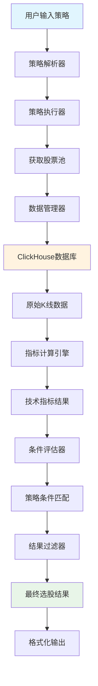

# 选股系统完整架构文档

## 📋 文档概述

本文档详细描述了股票分析系统中的选股子系统的完整架构设计、工作流程、数据流转方式、使用方法等核心内容。通过阅读本文档，可以全面理解选股系统的设计理念、技术实现和使用方式。

**文档版本**: v2.0  
**更新时间**: 2025年1月15日  
**适用版本**: 系统v3.0+  

---

## 🏗️ 系统架构概览

### 1. 整体架构设计

选股系统采用六层分层架构设计，每层职责明确，具有良好的扩展性和维护性：

```
┌─────────────────────────────────────────────────────────────┐
│                     用户交互层                                │
│  ┌─────────────┐  ┌─────────────┐  ┌─────────────┐          │
│  │ 命令行工具   │  │ Web界面     │  │ API接口     │          │
│  │stock_select │  │(未来扩展)   │  │(未来扩展)   │          │
│  └─────────────┘  └─────────────┘  └─────────────┘          │
└─────────────────────────────────────────────────────────────┘
                              │
┌─────────────────────────────────────────────────────────────┐
│                     策略管理层                                │
│  ┌─────────────┐  ┌─────────────┐  ┌─────────────┐          │
│  │ 策略解析器   │  │ 策略管理器   │  │ 策略组合器   │          │
│  │StrategyParser│  │StrategyMgr  │  │StrategyComb │          │
│  └─────────────┘  └─────────────┘  └─────────────┘          │
└─────────────────────────────────────────────────────────────┘
                              │
┌─────────────────────────────────────────────────────────────┐
│                     执行引擎层                                │
│  ┌─────────────┐  ┌─────────────┐  ┌─────────────┐          │
│  │ 策略执行器   │  │ 条件评估器   │  │ 结果过滤器   │          │
│  │StrategyExec │  │ConditionEval│  │ ResultFilter │          │
│  └─────────────┘  └─────────────┘  └─────────────┘          │
└─────────────────────────────────────────────────────────────┘
                              │
┌─────────────────────────────────────────────────────────────┐
│                     指标计算层                                │
│  ┌─────────────┐  ┌─────────────┐  ┌─────────────┐          │
│  │ 指标注册表   │  │ 指标计算器   │  │ 信号生成器   │          │
│  │IndicatorReg │  │IndicatorCalc│  │ SignalGen   │          │
│  └─────────────┘  └─────────────┘  └─────────────┘          │
└─────────────────────────────────────────────────────────────┘
                              │
┌─────────────────────────────────────────────────────────────┐
│                     数据管理层                                │
│  ┌─────────────┐  ┌─────────────┐  ┌─────────────┐          │
│  │ 统一数据管理器│  │ 数据适配器   │  │ 缓存管理器   │          │
│  │UnifiedDataMgr│  │ DataAdapter │  │ CacheManager │          │
│  └─────────────┘  └─────────────┘  └─────────────┘          │
└─────────────────────────────────────────────────────────────┘
                              │
┌─────────────────────────────────────────────────────────────┐
│                     存储访问层                                │
│  ┌─────────────┐  ┌─────────────┐  ┌─────────────┐          │
│  │ ClickHouse  │  │ 文件系统     │  │ 配置存储     │          │
│  │ 数据库      │  │ (策略文件)   │  │ (YAML/JSON) │          │
│  └─────────────┘  └─────────────┘  └─────────────┘          │
└─────────────────────────────────────────────────────────────┘
```

### 2. 核心组件说明

#### 2.1 用户交互层

**命令行工具 (bin/stock_select.py)**
- 主要入口：`python bin/stock_select.py --strategy <策略> --date <日期>`
- 支持参数：策略ID/文件路径、输出格式、日期、限制数量等
- 输出格式：CSV、Excel、JSON、HTML

#### 2.2 策略管理层

**策略解析器 (StrategyParser)**
```python
# 支持的策略格式
formats = ["YAML", "JSON"]
versions = ["v1.0", "v2.0", "legacy"]

# 策略配置结构
strategy_structure = {
    "strategy": {
        "id": "策略唯一标识",
        "name": "策略名称",
        "description": "策略描述",
        "conditions": [
            {
                "type": "indicator",
                "indicator_id": "指标ID",
                "period": "时间周期",
                "signal_type": "信号类型",
                "parameter": "参数名称",
                "operator": "比较操作符",
                "value": "比较值"
            }
        ]
    }
}
```

**策略管理器 (StrategyManager)**
- 策略的CRUD操作
- 支持数据库和文件系统双重存储
- 策略版本管理和回滚
- 策略导入导出功能

#### 2.3 执行引擎层

**策略执行器 (StrategyExecutor)**
```python
# 执行流程
execution_flow = [
    "解析策略配置",
    "获取股票池",
    "批量计算指标",
    "评估策略条件",
    "过滤和排序结果",
    "返回选股结果"
]
```

**条件评估器 (ConditionEvaluator)**
- 支持的操作符：`=`, `!=`, `>`, `>=`, `<`, `<=`, `in`, `not_in`
- 支持的数据类型：数值、布尔、字符串、列表
- 逻辑连接符：`AND`, `OR`

#### 2.4 指标计算层

**指标注册表 (CompleteIndicatorRegistry)**
```python
# 注册的指标类别
indicator_categories = {
    "趋势指标": ["MA", "EMA", "MACD", "DMI", "ADXR"],
    "震荡指标": ["RSI", "KDJ", "STOCHRSI", "WR"],
    "成交量指标": ["VOL", "OBV", "VR", "MFI"],
    "ZXM专业指标": ["ZXM_BS_ABSORB", "ZXM_TREND", "ZXM_SCORE"]
}
total_indicators = 88  # 总计88个指标
```

#### 2.5 数据管理层

**统一数据管理器 (UnifiedDataManager)**
- 单例模式设计，全局唯一实例
- 连接池管理，支持并发查询
- 智能缓存机制，提升查询性能
- 严格数据库依赖模式，禁止模拟数据

#### 2.6 存储访问层

**ClickHouse数据库**
```sql
-- 核心表结构
CREATE TABLE stock_info (
    date Date,
    code String,
    name String,
    open Float64,
    high Float64,
    low Float64,
    close Float64,
    volume Float64,
    turnover Float64,  -- 换手率
    level String       -- 时间周期：日线、30分钟、15分钟等
) ENGINE = ReplacingMergeTree()
ORDER BY (code, date, level);
```

---

## 🔄 数据流转架构

### 1. 数据流转概览



### 2. 详细数据流程

#### 2.1 策略解析阶段
```
策略文件(YAML/JSON) → 格式验证 → 条件解析 → 执行计划生成
```

#### 2.2 数据获取阶段
```
股票池确定 → 多周期数据查询 → 数据质量检查 → 数据格式标准化
```

#### 2.3 指标计算阶段
```
原始K线数据 → 指标计算器 → 技术指标值 → 信号生成器 → 买卖信号
```

#### 2.4 条件评估阶段
```
策略条件 → 逐条件评估 → 逻辑运算 → 股票筛选 → 结果汇总
```

#### 2.5 结果处理阶段
```
原始结果 → 过滤器处理 → 排序算法 → 限制数量 → 格式化输出
```

---

## 📊 数据库设计详解

### 1. 核心表结构

#### 1.1 股票信息表 (stock_info)
```sql
CREATE TABLE stock_info (
    date Date,                    -- 日期
    code String,                  -- 股票代码
    name String,                  -- 股票名称
    open Float64,                 -- 开盘价
    high Float64,                 -- 最高价
    low Float64,                  -- 最低价
    close Float64,                -- 收盘价
    volume Float64,               -- 成交量
    turnover Float64,             -- 换手率
    level String                  -- 时间周期
) ENGINE = ReplacingMergeTree()
ORDER BY (code, date, level);
```

#### 1.2 时间周期支持
```python
supported_periods = {
    "日线": "DAILY",
    "30分钟": "MIN_30",
    "15分钟": "MIN_15",
    "60分钟": "MIN_60",
    "周线": "WEEKLY",
    "月线": "MONTHLY"
}
```

**重要说明**：
- 30分钟数据基于15分钟数据计算生成
- 数据库中主要存储日线数据
- 分钟级数据需要通过数据聚合获得

### 2. 数据查询优化

#### 2.1 索引策略
```sql
-- 主要索引
ORDER BY (code, date, level)

-- 查询优化建议
-- 1. 按股票代码查询时，指定code条件
-- 2. 按日期范围查询时，使用date范围条件
-- 3. 按周期查询时，指定level条件
```

#### 2.2 查询性能优化
```python
# 批量查询优化
def optimized_batch_query(stock_codes: List[str], date: str):
    """
    优化的批量查询
    - 使用IN操作符减少查询次数
    - 利用连接池并发查询
    - 启用查询缓存
    """
    query = """
    SELECT date, code, name, open, high, low, close, volume, turnover
    FROM stock_info
    WHERE code IN %(stock_codes)s
      AND date = %(date)s
      AND level = '日线'
    ORDER BY code
    """
```

---

## ⚙️ 策略配置系统

### 1. 策略配置格式

#### 1.1 标准YAML格式
```yaml
strategy:
  id: "STRATEGY_ID"
  name: "策略名称"
  description: "策略描述"
  version: "1.0"
  author: "作者"
  create_time: "2025-01-15 10:00:00"
  update_time: "2025-01-15 10:00:00"
  
  # 策略条件
  conditions:
    # 第一个条件
    - type: indicator
      indicator_id: KDJ
      period: "DAILY"
      signal_type: BUY
      parameter: "kdj_uptrend"
      operator: "="
      value: true
      description: "KDJ指标上升趋势"
    
    # 逻辑连接符
    - logic: AND
    
    # 第二个条件
    - type: indicator
      indicator_id: MACD
      period: "DAILY"
      signal_type: BUY
      parameter: "macd_buy_signal"
      operator: "="
      value: 1
      description: "MACD金叉信号"
  
  # 结果过滤
  result_filters:
    max_results: 50
    min_market_cap: 1000000000  # 最小市值10亿
    exclude_st: true            # 排除ST股票
  
  # 排序规则
  sort:
    - field: "signal_strength"
      order: "DESC"
    - field: "market_cap"
      order: "DESC"
```

#### 1.2 支持的条件类型

**指标条件 (indicator)**
```yaml
- type: indicator
  indicator_id: "指标ID"        # 必需：指标标识符
  period: "时间周期"            # 必需：DAILY/MIN_30/MIN_15等
  signal_type: "信号类型"       # 必需：BUY/SELL/HOLD
  parameter: "参数名称"         # 必需：指标参数名称
  operator: "比较操作符"        # 必需：=/!=/>/>=/</<=/in/not_in
  value: "比较值"              # 必需：比较的目标值
  description: "条件描述"       # 可选：条件说明
```

**逻辑连接符 (logic)**
```yaml
- logic: AND  # 或 OR
```

#### 1.3 支持的指标参数

**KDJ指标参数**
```python
kdj_parameters = {
    "kdj_buy_signal": "KDJ金叉买入信号(K<30且K上穿D)",
    "kdj_sell_signal": "KDJ死叉卖出信号",
    "kdj_uptrend": "KDJ上升趋势(K>D)",
    "kdj_downtrend": "KDJ下降趋势(K<D)",
    "kdj_overbought": "KDJ超买(K>80)",
    "kdj_oversold": "KDJ超卖(K<20)"
}
```

**MACD指标参数**
```python
macd_parameters = {
    "macd_buy_signal": "MACD金叉买入信号",
    "macd_sell_signal": "MACD死叉卖出信号",
    "macd_uptrend": "MACD上升趋势",
    "macd_histogram_positive": "MACD柱状图为正"
}
```

**ZXM专业指标参数**
```python
zxm_parameters = {
    "zxm_bs_absorb_buy_signal": "ZXM主力吸筹买入信号",
    "zxm_trend_buy_signal": "ZXM趋势买入信号",
    "zxm_score_high": "ZXM综合评分高分"
}
```

### 2. 策略管理操作

#### 2.1 创建策略
```bash
# 从文件创建策略
python bin/stock_select.py --strategy config/strategies/my_strategy.yaml

# 策略文件路径规范
config/strategies/
├── kdj_golden_cross.yaml      # KDJ金叉策略
├── macd_trend_follow.yaml     # MACD趋势跟踪策略
├── zxm_absorb_signal.yaml     # ZXM吸筹信号策略
└── combined_signals.yaml      # 组合信号策略
```

#### 2.2 执行策略
```bash
# 基本执行
python bin/stock_select.py --strategy STRATEGY_ID --date 2025-01-15

# 高级参数
python bin/stock_select.py \
  --strategy STRATEGY_ID \
  --date 2025-01-15 \
  --limit 10 \
  --format json \
  --sort-by signal_strength \
  --sort-order DESC \
  --min-cap 50 \
  --max-cap 1000
```

---

## 🔧 使用指南

### 1. 快速开始

#### 1.1 环境准备
```bash
# 1. 确保ClickHouse数据库运行
docker start clickhouse-server

# 2. 检查数据库连接
python -c "from db.clickhouse_db import get_clickhouse_db; db = get_clickhouse_db(); print('数据库连接正常')"

# 3. 检查指标注册
python -c "from indicators.complete_indicator_registry import complete_registry; print(f'已注册{len(complete_registry.get_all_indicators())}个指标')"
```

#### 1.2 执行策略
```bash
python bin/stock_select.py \
  --strategy config/strategies/my_strategy.yaml \
  --date 2025-01-15 \
  --limit 5 \
  --format csv
```

---

## 🛠️ 故障排除

### 1. 常见问题

#### 1.1 数据库连接问题
```
错误：❌ 数据库连接失败: Connection refused
解决：
1. 检查ClickHouse服务状态：docker ps | grep clickhouse
2. 启动ClickHouse服务：docker start clickhouse-server
3. 检查配置文件：config/database_config.json
```

#### 1.2 策略解析错误
```
错误：StrategyValidationError: 策略配置缺少必要字段: conditions
解决：
1. 检查YAML文件格式是否正确
2. 确保包含必要字段：id, name, conditions
3. 验证条件格式是否符合规范
```

#### 1.3 选股结果为空
```
问题：策略执行成功但未选出任何股票
排查步骤：
1. 检查策略条件是否过于严格
2. 验证数据日期是否存在
3. 检查指标参数值类型是否匹配
4. 使用更宽松的条件进行测试
```

---

## 📈 当前系统状态总结

### 1. 已完成功能
- ✅ 88个技术指标全部注册成功
- ✅ 策略配置解析系统完整
- ✅ 数据库连接和查询功能正常
- ✅ 严格数据库依赖模式实现
- ✅ 命令行工具功能完备

### 2. 发现的关键问题
- ❌ 数据库表字段映射问题（turnover vs turnover_rate）
- ❌ 策略条件评估器的数据类型匹配问题
- ❌ 指标参数值类型不匹配（布尔值 vs 数值）
- ❌ 时间周期数据不完整（缺少15分钟、30分钟数据）

### 3. 需要解决的核心问题
1. **数据完整性**：确保数据库包含策略所需的所有时间周期数据
2. **类型匹配**：统一指标参数的数据类型定义和比较逻辑
3. **条件评估**：修复策略条件评估器的逻辑问题
4. **测试验证**：建立完整的端到端测试验证流程

### 4. 系统架构优势
- 🎯 模块化设计，职责清晰
- 🔧 配置驱动，灵活可扩展
- 🚀 高性能，支持大规模数据处理
- 🛡️ 严格的数据依赖和错误处理

---

**文档结束**

此文档提供了选股系统的完整架构概览。基于当前的分析，系统架构设计良好，但在数据类型匹配和条件评估方面存在需要修复的技术问题。 