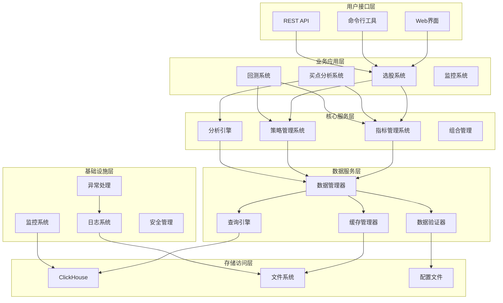
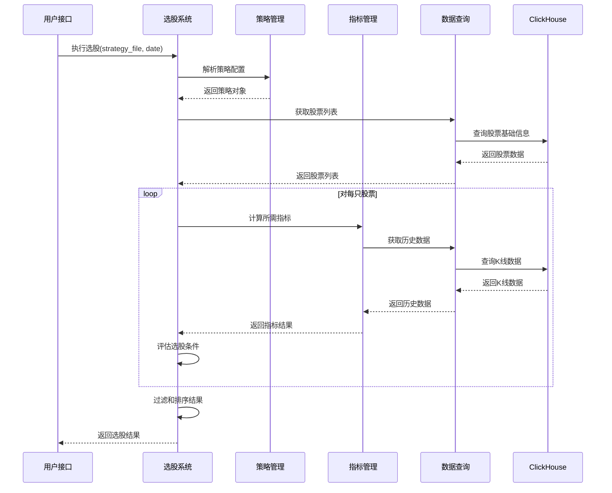
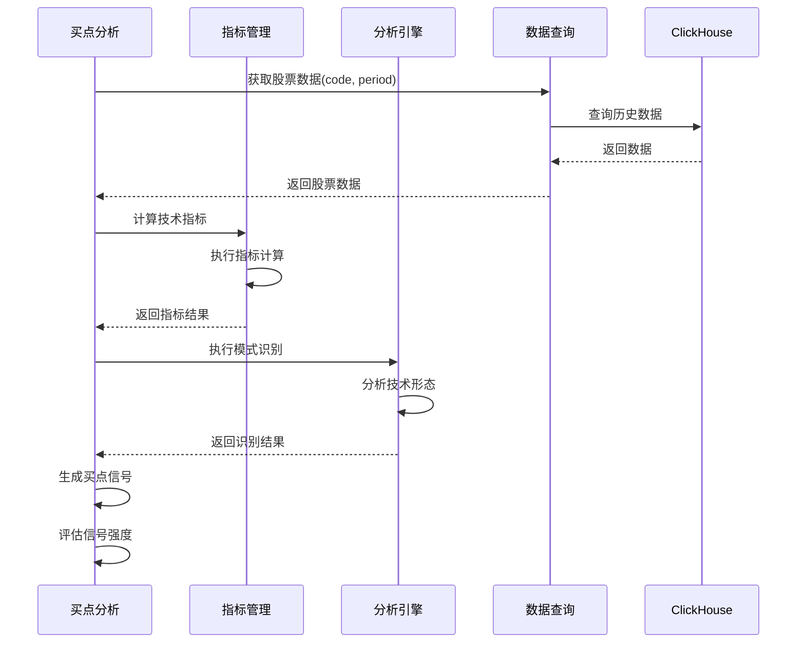
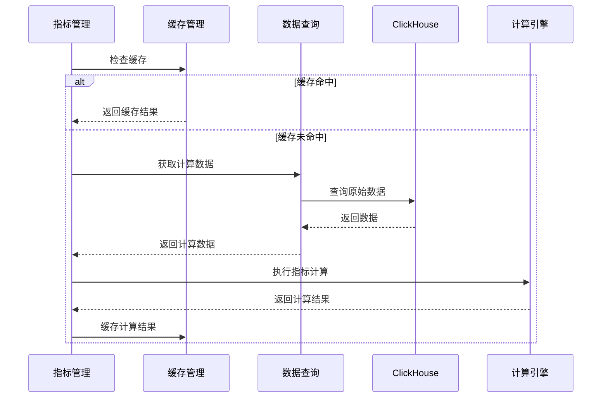
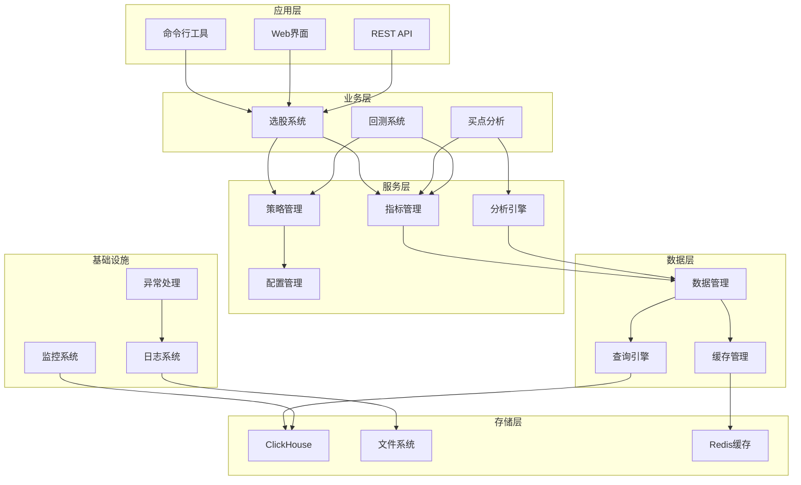

# 股票分析系统整体架构设计文档

## 📋 文档概述

本文档详细描述了股票分析系统的整体架构设计，明确各个系统模块之间的关联关系、职责边界和数据流向。通过清晰的架构定义，避免重复建设和职责混乱，为系统的持续发展提供指导。

**文档版本**: v1.0  
**设计时间**: 2025年1月15日  
**适用版本**: v3.0+  

---

## 🏗️ 系统架构总览

### 1. 整体架构图



### 2. 架构分层说明

| 层级 | 名称 | 职责 | 主要组件 |
|------|------|------|----------|
| L6 | 用户接口层 | 用户交互和接口服务 | Web界面、CLI工具、REST API |
| L5 | 业务应用层 | 具体业务功能实现 | 选股系统、买点分析、回测系统 |
| L4 | 核心服务层 | 核心业务逻辑和服务 | 指标管理、策略管理、分析引擎 |
| L3 | 数据服务层 | 数据访问和处理服务 | 数据管理、缓存管理、查询引擎 |
| L2 | 存储访问层 | 数据存储和持久化 | ClickHouse、文件系统、配置 |
| L1 | 基础设施层 | 系统基础功能支撑 | 日志、监控、异常处理、安全 |

---

## 🎯 系统模块职责定义

### 1. 选股系统 (Stock Selection System)

#### 1.1 核心职责
- **策略解析**：解析YAML/JSON格式的选股策略配置
- **条件评估**：根据指标结果评估选股条件
- **结果过滤**：按照设定规则过滤和排序选股结果
- **执行调度**：管理选股任务的执行和调度

#### 1.2 职责边界
**负责**：
- 策略配置文件的解析和验证
- 选股条件的逻辑组合和评估
- 选股结果的排序和过滤
- 选股任务的调度和状态管理

**不负责**：
- 指标的计算和管理（由指标管理系统负责）
- 数据的获取和存储（由数据查询系统负责）
- 买点信号的生成（由买点分析系统负责）
- 策略的回测验证（由回测系统负责）

#### 1.3 对外接口
```python
class StockSelectionInterface:
    def parse_strategy(self, strategy_config: Dict) -> Strategy
    def execute_selection(self, strategy: Strategy, date: str) -> SelectionResult
    def evaluate_conditions(self, conditions: List[Condition], stock_data: StockData) -> bool
    def filter_results(self, results: List[Stock], filters: FilterConfig) -> List[Stock]
```

#### 1.4 依赖关系
- **依赖**：指标管理系统（获取指标计算结果）
- **依赖**：策略管理系统（获取策略定义）
- **依赖**：数据查询系统（获取股票基础数据）
- **被依赖**：用户接口层（提供选股功能）

### 2. 买点分析系统 (Buy Point Analysis System)

#### 2.1 核心职责
- **信号检测**：检测各种买点信号（技术形态、量价关系等）
- **模式识别**：识别经典的买点模式和形态
- **强度评估**：评估买点信号的强度和可信度
- **时机分析**：分析买点的最佳时机和持续性

#### 2.2 职责边界
**负责**：
- 买点信号的检测和识别
- 买点模式的定义和匹配
- 买点强度的量化评估
- 买点时机的分析和预测

**不负责**：
- 指标的基础计算（由指标管理系统负责）
- 选股条件的组合评估（由选股系统负责）
- 数据的获取和缓存（由数据查询系统负责）
- 投资组合的构建（由组合管理系统负责）

#### 2.3 对外接口
```python
class BuyPointAnalysisInterface:
    def detect_signals(self, stock_data: StockData) -> List[Signal]
    def recognize_patterns(self, stock_data: StockData) -> List[Pattern]
    def evaluate_strength(self, signal: Signal) -> float
    def analyze_timing(self, signals: List[Signal]) -> TimingAnalysis
```

#### 2.4 依赖关系
- **依赖**：指标管理系统（获取技术指标）
- **依赖**：分析引擎（获取分析能力）
- **依赖**：数据查询系统（获取历史数据）
- **被依赖**：选股系统（提供买点条件）

### 3. 指标管理系统 (Indicator Management System)

#### 3.1 核心职责
- **指标注册**：注册和管理所有技术指标
- **计算引擎**：执行指标计算和缓存管理
- **信号生成**：基于指标结果生成交易信号
- **性能优化**：优化指标计算性能和资源使用

#### 3.2 职责边界
**负责**：
- 技术指标的注册和生命周期管理
- 指标计算的执行和结果缓存
- 指标信号的标准化生成
- 指标计算的性能监控和优化

**不负责**：
- 业务逻辑的条件组合（由选股系统负责）
- 买点模式的识别（由买点分析系统负责）
- 原始数据的获取（由数据查询系统负责）
- 策略的定义和管理（由策略管理系统负责）

#### 3.3 对外接口
```python
class IndicatorManagementInterface:
    def register_indicator(self, indicator_class: Type[BaseIndicator]) -> bool
    def calculate_indicator(self, name: str, data: StockData, params: Dict) -> IndicatorResult
    def get_indicator_signal(self, name: str, data: StockData) -> Signal
    def batch_calculate(self, indicators: List[str], data: StockData) -> Dict[str, IndicatorResult]
```

#### 3.4 依赖关系
- **依赖**：数据查询系统（获取计算数据）
- **被依赖**：选股系统（提供指标计算）
- **被依赖**：买点分析系统（提供技术指标）
- **被依赖**：回测系统（提供历史指标）

### 4. 数据查询系统 (Data Query System)

#### 4.1 核心职责
- **SQL管理**：统一管理所有SQL查询语句
- **数据访问**：提供统一的数据访问接口
- **缓存管理**：管理查询结果的缓存和失效
- **连接管理**：管理数据库连接池和资源

#### 4.2 职责边界
**负责**：
- 数据库查询语句的统一管理
- 数据访问接口的标准化
- 查询缓存的策略和管理
- 数据库连接的池化和监控

**不负责**：
- 业务数据的计算和分析（由各业务系统负责）
- 数据的业务逻辑验证（由业务系统负责）
- 缓存策略的业务逻辑（由业务系统配置）
- 数据库表结构的设计（由数据建模负责）

#### 4.3 对外接口
```python
class DataQueryInterface:
    def query(self, sql: str, params: Dict) -> DataFrame
    def get_stock_info(self, **kwargs) -> StockInfo
    def get_stock_data(self, codes: List[str], start_date: str, end_date: str) -> StockData
    def execute_batch_query(self, queries: List[Query]) -> List[DataFrame]
```

#### 4.4 依赖关系
- **依赖**：存储访问层（ClickHouse数据库）
- **被依赖**：所有业务系统（提供数据访问）
- **被依赖**：指标管理系统（提供计算数据）
- **被依赖**：监控系统（提供监控数据）

---

## 🔄 数据流向设计

### 1. 选股流程数据流



### 2. 买点分析数据流



### 3. 指标计算数据流



---

## 🔗 系统间接口规范

### 1. 数据传输格式

#### 1.1 股票数据格式
```python
@dataclass
class StockData:
    """标准股票数据格式"""
    code: str
    name: str
    data: pd.DataFrame  # 包含OHLCV等标准字段
    period: str  # 'daily', '30min', '15min', '5min'
    start_date: str
    end_date: str
    
    def validate(self) -> bool:
        """验证数据完整性"""
        required_columns = ['date', 'open', 'high', 'low', 'close', 'volume']
        return all(col in self.data.columns for col in required_columns)
```

#### 1.2 指标结果格式
```python
@dataclass
class IndicatorResult:
    """标准指标结果格式"""
    indicator_name: str
    data: pd.DataFrame
    signals: List[Signal]
    metadata: Dict[str, Any]
    calculation_time: datetime
    
    def to_dict(self) -> Dict[str, Any]:
        """转换为字典格式"""
        return {
            'indicator_name': self.indicator_name,
            'data': self.data.to_dict(),
            'signals': [signal.to_dict() for signal in self.signals],
            'metadata': self.metadata,
            'calculation_time': self.calculation_time.isoformat()
        }
```

#### 1.3 信号格式
```python
@dataclass
class Signal:
    """标准信号格式"""
    type: str  # 'buy', 'sell', 'hold'
    strength: float  # 0-1之间
    confidence: float  # 0-1之间
    timestamp: datetime
    source: str  # 信号来源
    metadata: Dict[str, Any]
    
    def is_valid(self) -> bool:
        """验证信号有效性"""
        return (0 <= self.strength <= 1 and 
                0 <= self.confidence <= 1 and
                self.type in ['buy', 'sell', 'hold'])
```

### 2. 错误处理规范

#### 2.1 异常类型定义
```python
class SystemException(Exception):
    """系统异常基类"""
    pass

class DataAccessError(SystemException):
    """数据访问异常"""
    pass

class IndicatorCalculationError(SystemException):
    """指标计算异常"""
    pass

class StrategyParsingError(SystemException):
    """策略解析异常"""
    pass

class ValidationError(SystemException):
    """数据验证异常"""
    pass
```

#### 2.2 错误响应格式
```python
@dataclass
class ErrorResponse:
    """标准错误响应格式"""
    error_code: str
    error_message: str
    error_type: str
    timestamp: datetime
    trace_id: str
    
    def to_dict(self) -> Dict[str, Any]:
        return {
            'error_code': self.error_code,
            'error_message': self.error_message,
            'error_type': self.error_type,
            'timestamp': self.timestamp.isoformat(),
            'trace_id': self.trace_id
        }
```

### 3. 服务注册和发现

#### 3.1 服务注册接口
```python
class ServiceRegistry:
    """服务注册中心"""
    
    def register_service(self, service_name: str, service_instance: Any) -> bool:
        """注册服务实例"""
        pass
    
    def get_service(self, service_name: str) -> Any:
        """获取服务实例"""
        pass
    
    def list_services(self) -> List[str]:
        """列出所有注册的服务"""
        pass
```

#### 3.2 依赖注入容器
```python
class DIContainer:
    """依赖注入容器"""
    
    def bind(self, interface: Type, implementation: Type) -> None:
        """绑定接口和实现"""
        pass
    
    def get(self, interface: Type) -> Any:
        """获取接口实例"""
        pass
    
    def configure(self, config: Dict[str, Any]) -> None:
        """配置容器"""
        pass
```

---

## 📊 性能和扩展性设计

### 1. 性能指标

| 系统 | 响应时间目标 | 吞吐量目标 | 并发用户数 |
|------|-------------|------------|------------|
| 选股系统 | < 30秒 | 100个策略/分钟 | 10 |
| 买点分析 | < 10秒 | 500只股票/分钟 | 20 |
| 指标管理 | < 5秒 | 1000个指标/分钟 | 50 |
| 数据查询 | < 2秒 | 10000个查询/分钟 | 100 |

### 2. 扩展性设计

#### 2.1 水平扩展
- **无状态设计**：所有服务组件设计为无状态，支持水平扩展
- **负载均衡**：通过负载均衡器分发请求到多个实例
- **数据分片**：支持数据库分片和分区策略

#### 2.2 垂直扩展
- **资源监控**：监控CPU、内存、磁盘等资源使用情况
- **动态调整**：根据负载动态调整资源分配
- **性能优化**：持续优化算法和数据结构

### 3. 缓存策略

#### 3.1 多级缓存
- **L1缓存**：内存缓存，存储热点数据
- **L2缓存**：Redis缓存，存储共享数据
- **L3缓存**：文件缓存，存储大数据集

#### 3.2 缓存更新策略
- **TTL策略**：基于时间的缓存失效
- **LRU策略**：基于访问频率的缓存淘汰
- **事件驱动**：基于数据变更的缓存更新

---

## 🔒 安全性设计

### 1. 访问控制

#### 1.1 身份认证
- **用户认证**：支持用户名密码和Token认证
- **服务认证**：服务间通信使用证书认证
- **会话管理**：安全的会话管理和超时控制

#### 1.2 权限控制
- **角色权限**：基于角色的访问控制（RBAC）
- **资源权限**：细粒度的资源访问控制
- **操作审计**：记录所有关键操作日志

### 2. 数据安全

#### 2.1 数据加密
- **传输加密**：HTTPS/TLS加密传输
- **存储加密**：敏感数据加密存储
- **密钥管理**：安全的密钥生成和管理

#### 2.2 数据脱敏
- **敏感数据**：自动识别和脱敏敏感信息
- **日志脱敏**：日志中的敏感信息脱敏
- **测试数据**：测试环境使用脱敏数据

---

## 📈 监控和运维设计

### 1. 监控体系

#### 1.1 系统监控
- **资源监控**：CPU、内存、磁盘、网络监控
- **性能监控**：响应时间、吞吐量、错误率监控
- **业务监控**：选股成功率、指标计算准确性监控

#### 1.2 告警机制
- **阈值告警**：基于指标阈值的自动告警
- **异常检测**：基于机器学习的异常检测
- **告警升级**：多级告警和升级机制

### 2. 日志管理

#### 2.1 日志分类
- **业务日志**：记录业务操作和结果
- **系统日志**：记录系统运行状态
- **错误日志**：记录异常和错误信息
- **审计日志**：记录安全相关操作

#### 2.2 日志处理
- **结构化日志**：使用结构化格式记录日志
- **日志聚合**：集中收集和处理日志
- **日志分析**：自动分析和报告生成

---

## 🚀 部署和发布策略

### 1. 环境管理

#### 1.1 环境分离
- **开发环境**：开发人员日常开发使用
- **测试环境**：功能测试和集成测试
- **预生产环境**：生产前的最终验证
- **生产环境**：正式运行环境

#### 1.2 配置管理
- **环境配置**：不同环境使用不同配置
- **配置中心**：集中管理配置信息
- **动态配置**：支持运行时配置更新

### 2. 发布流程

#### 2.1 持续集成
- **代码检查**：自动代码质量检查
- **单元测试**：自动执行单元测试
- **构建打包**：自动构建和打包

#### 2.2 持续部署
- **灰度发布**：逐步发布到生产环境
- **回滚机制**：快速回滚到稳定版本
- **健康检查**：部署后自动健康检查

---

## 📝 开发规范和最佳实践

### 1. 代码规范

#### 1.1 命名规范
- **类名**：大驼峰命名法（PascalCase）
- **方法名**：小写下划线命名法（snake_case）
- **变量名**：小写下划线命名法（snake_case）
- **常量名**：大写下划线命名法（UPPER_CASE）

#### 1.2 文档规范
- **模块文档**：每个模块必须有完整的文档说明
- **接口文档**：所有公共接口必须有详细文档
- **变更日志**：记录所有重要变更和版本信息

### 2. 测试策略

#### 2.1 测试分层
- **单元测试**：测试单个函数或方法
- **集成测试**：测试模块间的集成
- **系统测试**：测试整个系统功能
- **性能测试**：测试系统性能指标

#### 2.2 测试覆盖率
- **代码覆盖率**：要求90%以上的代码覆盖率
- **分支覆盖率**：要求80%以上的分支覆盖率
- **功能覆盖率**：要求100%的核心功能覆盖

---

## 🎯 架构演进规划

### 1. 短期目标（1-3个月）

#### 1.1 架构重构
- **统一数据访问层**：建立统一的数据访问接口
- **服务解耦**：减少系统间的直接依赖
- **接口标准化**：定义标准的服务接口

#### 1.2 性能优化
- **缓存优化**：实现多级缓存策略
- **查询优化**：优化数据库查询性能
- **并发优化**：提升系统并发处理能力

### 2. 中期目标（3-6个月）

#### 2.1 微服务化
- **服务拆分**：将单体应用拆分为微服务
- **服务治理**：实现服务注册、发现和治理
- **API网关**：统一的API入口和管理

#### 2.2 智能化
- **自动化运维**：实现自动化部署和运维
- **智能监控**：基于AI的智能监控和预警
- **自适应优化**：系统自动优化和调整

### 3. 长期目标（6-12个月）

#### 3.1 云原生
- **容器化**：全面容器化部署
- **Kubernetes**：基于K8s的容器编排
- **服务网格**：实现服务网格架构

#### 3.2 大数据支持
- **流式计算**：支持实时数据流处理
- **机器学习**：集成机器学习能力
- **大数据分析**：支持大规模数据分析

---

## 📊 总结

### 1. 架构优势

#### 1.1 清晰的职责边界
- 每个系统模块都有明确的职责定义
- 避免功能重复和职责混乱
- 便于团队分工和并行开发

#### 1.2 良好的扩展性
- **支持水平和垂直扩展**
- **模块化设计便于功能扩展**
- **标准化接口支持组件替换**

#### 1.3 高可维护性
- **统一的开发规范和标准**
- **完善的监控和日志体系**
- **自动化的测试和部署流程**

### 2. 实施建议

#### 2.1 分阶段实施
- **按照优先级分阶段重构**
- **保证系统的持续可用性**
- **逐步验证架构设计的有效性**

#### 2.2 团队协作
- **建立跨团队的协作机制**
- **定期进行架构评审和优化**
- **持续改进开发流程和规范**

#### 2.3 技术演进
- **关注技术发展趋势**
- **适时引入新技术和工具**
- **保持架构的先进性和竞争力**

通过清晰的架构设计和规范，股票分析系统将具备更好的可维护性、扩展性和性能，为业务的持续发展提供坚实的技术基础。

---

## 🔧 配置管理架构

### 1. 配置层次结构

```
config/
├── default.yaml           # 默认配置
├── environments/          # 环境配置
│   ├── development.yaml   # 开发环境
│   ├── testing.yaml       # 测试环境
│   ├── staging.yaml       # 预生产环境
│   └── production.yaml    # 生产环境
├── strategies/            # 策略配置
│   ├── template/          # 策略模板
│   └── active/           # 活跃策略
├── indicators/           # 指标配置
│   ├── parameters/       # 指标参数配置
│   └── thresholds/      # 阈值配置
└── database/            # 数据库配置
    ├── connections/     # 连接配置
    └── queries/        # 查询配置
```

### 2. 配置加载机制

```python
@dataclass
class ConfigManager:
    """配置管理器"""
    
    def __init__(self):
        self.config = {}
        self.environment = os.getenv('ENVIRONMENT', 'development')
        self.load_configs()
    
    def load_configs(self):
        """加载配置文件"""
        # 1. 加载默认配置
        self.config = self._load_yaml('config/default.yaml')
        
        # 2. 加载环境配置并合并
        env_config = self._load_yaml(f'config/environments/{self.environment}.yaml')
        self.config = self._merge_configs(self.config, env_config)
        
        # 3. 加载环境变量覆盖
        self._load_env_overrides()
    
    def get(self, key: str, default=None):
        """获取配置值，支持点分隔符路径"""
        keys = key.split('.')
        value = self.config
        for k in keys:
            if isinstance(value, dict) and k in value:
                value = value[k]
            else:
                return default
        return value
```

### 3. 环境变量映射

| 配置项 | 环境变量 | 默认值 | 说明 |
|--------|----------|--------|------|
| database.host | DB_HOST | localhost | 数据库主机 |
| database.port | DB_PORT | 9000 | 数据库端口 |
| database.password | DB_PASSWORD | - | 数据库密码 |
| cache.redis.host | REDIS_HOST | localhost | Redis主机 |
| logging.level | LOG_LEVEL | INFO | 日志级别 |

---

## 📊 模块依赖关系图

### 1. 系统依赖图



### 2. 模块依赖矩阵

| 模块 | 选股系统 | 买点分析 | 指标管理 | 数据管理 | 配置管理 |
|------|----------|----------|----------|----------|----------|
| 选股系统 | - | ❌ | ✅ | ✅ | ✅ |
| 买点分析 | ❌ | - | ✅ | ✅ | ✅ |
| 指标管理 | ❌ | ❌ | - | ✅ | ✅ |
| 数据管理 | ❌ | ❌ | ❌ | - | ✅ |
| 配置管理 | ❌ | ❌ | ❌ | ❌ | - |

**说明**：✅ 表示允许依赖，❌ 表示禁止依赖

---

## 🛠️ 技术栈规范

### 1. 核心技术栈

| 层级 | 技术选型 | 版本要求 | 说明 |
|------|----------|----------|------|
| 编程语言 | Python | 3.9+ | 主要开发语言 |
| 数据库 | ClickHouse | 22.0+ | 时序数据存储 |
| 缓存 | Redis | 6.0+ | 内存缓存 |
| 数据处理 | Pandas | 1.5+ | 数据分析 |
| 数值计算 | NumPy | 1.21+ | 数值计算 |
| 可视化 | Matplotlib | 3.5+ | 图表绘制 |
| Web框架 | FastAPI | 0.95+ | API服务 |
| 任务队列 | Celery | 5.2+ | 异步任务 |

### 2. 开发工具链

| 工具类型 | 工具名称 | 版本要求 | 用途 |
|----------|----------|----------|------|
| 包管理 | Poetry | 1.4+ | 依赖管理 |
| 代码格式化 | Black | 23.0+ | 代码格式化 |
| 代码检查 | Flake8 | 6.0+ | 代码质量检查 |
| 类型检查 | MyPy | 1.0+ | 静态类型检查 |
| 测试框架 | Pytest | 7.0+ | 单元测试 |
| 文档生成 | Sphinx | 6.0+ | 文档生成 |

### 3. 第三方库规范

#### 3.1 数据处理库
```python
# 必需依赖
pandas >= 1.5.0
numpy >= 1.21.0
scipy >= 1.9.0

# 技术指标计算
talib >= 0.4.25
ta >= 0.10.0

# 时间处理
python-dateutil >= 2.8.0
pytz >= 2022.7
```

#### 3.2 数据库连接库
```python
# ClickHouse客户端
clickhouse-connect >= 0.5.0
clickhouse-driver >= 0.2.5

# Redis客户端
redis >= 4.5.0
hiredis >= 2.2.0
```

#### 3.3 Web和API库
```python
# Web框架
fastapi >= 0.95.0
uvicorn >= 0.20.0

# HTTP客户端
httpx >= 0.24.0
requests >= 2.28.0
```

---

## 📋 数据模型设计

### 1. 核心数据模型

#### 1.1 股票信息模型
```python
@dataclass
class StockInfo:
    """股票基础信息模型"""
    code: str                    # 股票代码
    name: str                    # 股票名称
    exchange: str                # 交易所
    industry: str                # 行业分类
    market_cap: Optional[float]  # 市值
    list_date: Optional[date]    # 上市日期
    status: str                  # 状态：active/suspended/delisted
    
    def __post_init__(self):
        if not self.code or not self.name:
            raise ValueError("股票代码和名称不能为空")
```

#### 1.2 K线数据模型
```python
@dataclass
class KLineData:
    """K线数据模型"""
    date: datetime              # 交易日期
    code: str                   # 股票代码
    open: float                 # 开盘价
    high: float                 # 最高价
    low: float                  # 最低价
    close: float                # 收盘价
    volume: int                 # 成交量
    turnover: float             # 成交额
    period: str                 # 周期：daily/30min/15min/5min
    
    def __post_init__(self):
        if self.high < max(self.open, self.close) or self.low > min(self.open, self.close):
            raise ValueError("K线数据不合理：最高价或最低价异常")
```

#### 1.3 指标结果模型
```python
@dataclass
class IndicatorResult:
    """指标计算结果模型"""
    indicator_name: str         # 指标名称
    code: str                   # 股票代码
    date: datetime              # 计算日期
    value: Union[float, Dict]   # 指标值
    signal: Optional[str]       # 信号：buy/sell/hold
    strength: Optional[float]   # 信号强度：0-1
    metadata: Dict[str, Any]    # 元数据
    
    def to_dict(self) -> Dict[str, Any]:
        return {
            'indicator_name': self.indicator_name,
            'code': self.code,
            'date': self.date.isoformat(),
            'value': self.value,
            'signal': self.signal,
            'strength': self.strength,
            'metadata': self.metadata
        }
```

### 2. 数据库表结构

#### 2.1 股票信息表
```sql
CREATE TABLE stock_info (
    code String,
    name String,
    exchange String,
    industry String,
    market_cap Nullable(Float64),
    list_date Nullable(Date),
    status String DEFAULT 'active',
    created_at DateTime DEFAULT now(),
    updated_at DateTime DEFAULT now()
) ENGINE = ReplacingMergeTree(updated_at)
PARTITION BY exchange
ORDER BY code;
```

#### 2.2 K线数据表
```sql
CREATE TABLE kline_data (
    date DateTime,
    code String,
    open Float64,
    high Float64,
    low Float64,
    close Float64,
    volume UInt64,
    turnover Float64,
    period String,
    created_at DateTime DEFAULT now()
) ENGINE = MergeTree()
PARTITION BY (period, toYYYYMM(date))
ORDER BY (code, date);
```

#### 2.3 指标结果表
```sql
CREATE TABLE indicator_results (
    indicator_name String,
    code String,
    date DateTime,
    value String,  -- JSON格式存储复杂指标值
    signal Nullable(String),
    strength Nullable(Float64),
    metadata String,  -- JSON格式存储元数据
    created_at DateTime DEFAULT now()
) ENGINE = ReplacingMergeTree(created_at)
PARTITION BY (indicator_name, toYYYYMM(date))
ORDER BY (code, date);
```

---

## 🔍 系统集成规范

### 1. 服务间通信

#### 1.1 同步通信
```python
class ServiceClient:
    """服务客户端基类"""
    
    def __init__(self, service_name: str, timeout: int = 30):
        self.service_name = service_name
        self.timeout = timeout
        self.base_url = self._get_service_url(service_name)
    
    async def call(self, method: str, endpoint: str, **kwargs) -> Dict[str, Any]:
        """调用服务接口"""
        url = f"{self.base_url}/{endpoint}"
        async with httpx.AsyncClient(timeout=self.timeout) as client:
            response = await client.request(method, url, **kwargs)
            response.raise_for_status()
            return response.json()
```

#### 1.2 异步通信
```python
class MessageQueue:
    """消息队列管理器"""
    
    def __init__(self, broker_url: str):
        self.broker_url = broker_url
        self.app = Celery('stock_analysis', broker=broker_url)
    
    def publish(self, topic: str, message: Dict[str, Any]) -> str:
        """发布消息"""
        task = self.app.send_task(topic, args=[message])
        return task.id
    
    def subscribe(self, topic: str, callback: Callable):
        """订阅消息"""
        @self.app.task(name=topic)
        def handler(message):
            return callback(message)
        return handler
```

### 2. 错误处理和重试

#### 2.1 重试机制
```python
from tenacity import retry, stop_after_attempt, wait_exponential

class RetryableService:
    """支持重试的服务基类"""
    
    @retry(
        stop=stop_after_attempt(3),
        wait=wait_exponential(multiplier=1, min=4, max=10)
    )
    def call_with_retry(self, func: Callable, *args, **kwargs):
        """带重试的函数调用"""
        try:
            return func(*args, **kwargs)
        except Exception as e:
            logger.warning(f"调用失败，准备重试: {e}")
            raise
```

#### 2.2 熔断器模式
```python
class CircuitBreaker:
    """熔断器实现"""
    
    def __init__(self, failure_threshold: int = 5, timeout: int = 60):
        self.failure_threshold = failure_threshold
        self.timeout = timeout
        self.failure_count = 0
        self.last_failure_time = None
        self.state = 'CLOSED'  # CLOSED/OPEN/HALF_OPEN
    
    def call(self, func: Callable, *args, **kwargs):
        """通过熔断器调用函数"""
        if self.state == 'OPEN':
            if time.time() - self.last_failure_time < self.timeout:
                raise Exception("熔断器开启，拒绝调用")
            else:
                self.state = 'HALF_OPEN'
        
        try:
            result = func(*args, **kwargs)
            self._on_success()
            return result
        except Exception as e:
            self._on_failure()
            raise e
```

---

## 📈 性能监控和优化

### 1. 性能指标监控

#### 1.1 关键性能指标（KPI）
```python
@dataclass
class PerformanceMetrics:
    """性能指标模型"""
    timestamp: datetime
    service_name: str
    endpoint: str
    response_time: float        # 响应时间（毫秒）
    throughput: float          # 吞吐量（请求/秒）
    error_rate: float          # 错误率（%）
    cpu_usage: float           # CPU使用率（%）
    memory_usage: float        # 内存使用率（%）
    disk_io: float             # 磁盘IO（MB/s）
    network_io: float          # 网络IO（MB/s）
```

#### 1.2 性能监控装饰器
```python
def monitor_performance(service_name: str):
    """性能监控装饰器"""
    def decorator(func):
        @wraps(func)
        def wrapper(*args, **kwargs):
            start_time = time.time()
            start_memory = psutil.Process().memory_info().rss
            
            try:
                result = func(*args, **kwargs)
                success = True
                error = None
            except Exception as e:
                success = False
                error = str(e)
                raise
            finally:
                end_time = time.time()
                end_memory = psutil.Process().memory_info().rss
                
                metrics = PerformanceMetrics(
                    timestamp=datetime.now(),
                    service_name=service_name,
                    endpoint=func.__name__,
                    response_time=(end_time - start_time) * 1000,
                    memory_usage=end_memory - start_memory,
                    success=success,
                    error=error
                )
                
                # 发送监控数据
                send_metrics(metrics)
            
            return result
        return wrapper
    return decorator
```

### 2. 性能优化策略

#### 2.1 数据库查询优化
```python
class QueryOptimizer:
    """查询优化器"""
    
    def __init__(self):
        self.query_cache = {}
        self.slow_query_threshold = 1000  # 1秒
    
    def optimize_query(self, sql: str, params: Dict) -> str:
        """优化SQL查询"""
        # 1. 检查查询缓存
        cache_key = self._get_cache_key(sql, params)
        if cache_key in self.query_cache:
            return self.query_cache[cache_key]
        
        # 2. 分析查询计划
        optimized_sql = self._analyze_and_optimize(sql)
        
        # 3. 缓存优化结果
        self.query_cache[cache_key] = optimized_sql
        
        return optimized_sql
    
    def _analyze_and_optimize(self, sql: str) -> str:
        """分析并优化SQL"""
        # 添加合适的索引提示
        # 优化JOIN顺序
        # 添加查询限制
        return sql
```

#### 2.2 缓存策略优化
```python
class CacheStrategy:
    """缓存策略管理"""
    
    def __init__(self):
        self.strategies = {
            'indicator_results': {
                'ttl': 3600,  # 1小时
                'max_size': 10000,
                'eviction': 'LRU'
            },
            'stock_data': {
                'ttl': 1800,  # 30分钟
                'max_size': 5000,
                'eviction': 'LFU'
            }
        }
    
    def get_strategy(self, data_type: str) -> Dict[str, Any]:
        """获取缓存策略"""
        return self.strategies.get(data_type, {
            'ttl': 300,
            'max_size': 1000,
            'eviction': 'LRU'
        })
```

通过以上完善的架构设计，股票分析系统将具备更加完整和规范的技术架构，为系统的稳定运行和持续发展提供强有力的支撑。