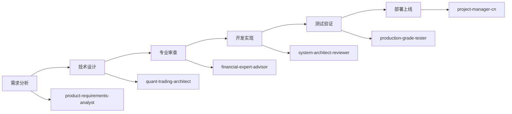

# Agent协作计划书
## 7周实施计划中的多Agent协同工作方案

---

## 📋 协作概览

### 项目背景
基于四角色综合评估结果（综合评分74.85分），通过7周集中实施计划，将系统从当前状态提升至95分+的生产级标准。本协作计划明确了各Agent在实施过程中的角色定位、工作分工、协作机制和质量保证措施。

### 核心目标
- **Tech-Manager**: 88.9分 → 95分（技术架构和性能优化）
- **Product-Manager**: 70分 → 95分（产品设计和用户体验）
- **Architect**: 74.5分 → 92分（系统架构和集成设计）
- **Finance-Expert**: 66分 → 90分（金融业务和风险管理）

---

## 👥 Agent角色定义

### Tech-Manager（技术经理）
**核心职责**: 技术架构设计、系统性能优化、数据管理
**评估目标**: 88.9分 → 95分
**主导周次**: 第1周（数据纯净化）、第5周（底层架构）

#### 专业领域
- 数据库架构设计和优化（ClickHouse、Redis）
- 系统性能调优和并发处理
- 数据接入和ETL流程设计
- 缓存策略和存储优化
- 技术选型和架构评估

#### 关键交付物
- 数据纯净化改造方案（第1周）
- 高性能数据访问层（第5周）
- 系统性能优化报告
- 技术架构文档

#### 质量标准
- 系统响应时间<100ms
- 数据查询性能<1秒
- 并发处理能力>10,000
- 数据准确性>99.9%

### Finance-Expert（金融专家）
**核心职责**: 金融业务逻辑、风险管理体系、合规性保证
**评估目标**: 66分 → 90分
**主导周次**: 第2周（金融逻辑）、第3周（风控体系）

#### 专业领域
- A股交易规则和市场机制
- 技术指标算法和买点识别
- 风险评估和控制策略
- 量化策略设计和回测
- 金融合规和监管要求

#### 关键交付物
- 实盘级交易逻辑系统（第2周）
- 全面风险管理体系（第3周）
- 金融业务规则引擎
- 合规性验证报告

#### 质量标准
- 交易逻辑100%符合监管要求
- 买点识别准确率>85%
- 风险覆盖率>95%
- 回测精度>99.9%

### Architect（架构师）
**核心职责**: 系统架构设计、微服务拆分、集成架构
**评估目标**: 74.5分 → 92分
**主导周次**: 第4周（前三层架构）、第5周（后三层架构）

#### 专业领域
- 企业级六层架构设计
- 微服务架构和服务治理
- 系统集成和接口设计
- 容器化和云原生架构
- 系统安全和可扩展性

#### 关键交付物
- 六层企业架构实现（第4-5周）
- 微服务拆分方案
- 系统集成架构
- 容器化部署方案

#### 质量标准
- 架构层次清晰度100%
- 系统稳定性>99.9%
- 服务独立部署率100%
- 接口标准化率100%

### Product-Manager（产品经理）
**核心职责**: 产品设计、用户体验、界面优化
**评估目标**: 70分 → 95分
**主导周次**: 第6周（用户体验优化）

#### 专业领域
- 金融产品设计和用户体验
- 专业交易终端界面设计
- 用户需求分析和产品规划
- 数据可视化和报表设计
- 移动端产品设计

#### 关键交付物
- 专业交易界面系统（第6周）
- 用户体验优化方案
- 数据可视化平台
- 移动端产品

#### 质量标准
- 界面专业度>90%
- 用户满意度>90%
- 操作流畅度>95%
- 功能完整度>95%

---

## 第一阶段：端到端工作流整合（Week 1-2）

### Task 1.1: 历史买点自动策略生成算法开发

#### 主导：quant-trading-architect
**职责**：
- 设计买点模式识别算法架构
- 开发机器学习模型选择策略
- 实现特征工程和数据预处理流程
- 优化算法性能和准确率

**具体任务**：
```python
# 1. 买点特征提取
def extract_buypoint_features(buypoint_data):
    """
    - 价格特征：突破位、支撑位、阻力位
    - 成交量特征：放量、缩量、量价配合
    - 技术指标特征：MACD、KDJ、RSI等128个指标
    - 形态特征：头肩底、双底、三角形等
    """
    pass

# 2. 策略规则生成
def generate_strategy_rules(features, ml_model):
    """
    - 条件组合优化
    - 参数阈值确定
    - 置信度评分
    """
    pass
```

#### 支持：financial-expert-advisor
**职责**：
- 验证买点识别的金融逻辑正确性
- 审查策略生成规则的合理性
- 提供行业最佳实践建议
- 确保符合监管要求

**验证清单**：
- [ ] 买点类型分类是否全面
- [ ] 技术指标选择是否合理
- [ ] 风险控制参数是否适当
- [ ] 策略逻辑是否符合市场规律

#### 审查：tech-solution-reviewer
**职责**：
- 代码质量审查
- 算法效率评估
- 技术架构合规性检查
- 性能优化建议

**审查标准**：
- 代码覆盖率 > 90%
- 算法复杂度 O(n log n)
- 内存使用 < 2GB
- 响应时间 < 5秒

---

### Task 1.2: 工作流编排引擎实现

#### 主导：system-architect-reviewer
**职责**：
- 设计工作流引擎架构
- 实现DAG执行器
- 开发任务调度系统
- 建立状态管理机制

**架构设计**：
```yaml
workflow_engine:
  components:
    - dag_executor:
        type: "directed_acyclic_graph"
        parallelism: 10
        retry: 3
    - task_scheduler:
        type: "priority_queue"
        workers: 5
    - state_manager:
        type: "distributed"
        persistence: "clickhouse"
```

#### 支持：production-grade-tester
**职责**：
- 设计测试用例
- 执行压力测试
- 验证容错机制
- 性能基准测试

**测试计划**：
| 测试类型 | 测试内容 | 通过标准 |
|---------|---------|----------|
| 功能测试 | 工作流执行 | 100%通过 |
| 性能测试 | 并发处理 | >50工作流 |
| 容错测试 | 故障恢复 | <30秒恢复 |
| 压力测试 | 极限负载 | 无崩溃 |

---

### Task 1.3: 双向验证系统增强

#### 主导：financial-expert-advisor
**职责**：
- 设计验证逻辑框架
- 定义验证指标体系
- 实现统计检验方法
- 生成验证报告模板

**验证框架**：
```python
class BidirectionalValidator:
    def forward_validate(self, strategy, historical_buypoints):
        """策略 → 买点验证"""
        # 1. 应用策略到历史数据
        # 2. 识别产生的买点信号
        # 3. 与实际买点对比
        # 4. 计算准确率、召回率、F1分数
        pass

    def backward_validate(self, buypoints, generated_strategy):
        """买点 → 策略验证"""
        # 1. 使用生成的策略
        # 2. 在历史数据上回测
        # 3. 验证是否产生相同买点
        # 4. 评估策略稳定性
        pass
```

#### 支持：quant-trading-architect
**职责**：
- 提供技术指标计算支持
- 优化验证算法性能
- 实现并行计算加速
- 数据流优化

---

## 第二阶段：策略回测验证系统（Week 3）

### Task 2.1: 历史回测引擎优化

#### 主导：quant-trading-architect
**职责**：
- 向量化计算实现
- 多进程并行优化
- 内存管理优化
- 缓存策略设计

**优化方案**：
```python
# 向量化计算示例
import numpy as np
import numba

@numba.jit(nopython=True, parallel=True)
def vectorized_backtest(prices, signals, positions):
    """
    使用NumPy和Numba加速回测计算
    - 向量化收益计算
    - 并行处理多个股票
    - JIT编译加速
    """
    returns = np.diff(prices) / prices[:-1]
    portfolio_returns = returns * positions[:-1]
    return portfolio_returns
```

#### 支持：production-grade-tester
**职责**：
- 性能基准测试
- 内存泄漏检测
- 并发压力测试
- 回测准确性验证

---

### Task 2.2: 策略性能评估框架

#### 主导：financial-expert-advisor
**职责**：
- 定义完整指标体系
- 实现风险调整收益计算
- 建立基准对比系统
- 开发统计检验工具

**指标体系**：
| 类别 | 指标 | 计算公式 | 阈值要求 |
|------|------|----------|----------|
| 收益指标 | 年化收益率 | (1+总收益)^(252/天数)-1 | >15% |
| 风险指标 | 夏普比率 | (收益-无风险)/标准差 | >1.5 |
| 交易指标 | 胜率 | 盈利次数/总交易次数 | >55% |
| 回撤指标 | 最大回撤 | max(峰值-谷值)/峰值 | <20% |

#### 支持：product-requirements-analyst
**职责**：
- 收集用户需求
- 定义报告格式
- 设计用户界面
- 编写使用文档

---

### Task 2.3: 回测报告自动生成

#### 主导：product-requirements-analyst
**职责**：
- 设计报告模板
- 实现可视化组件
- 开发报告生成器
- 建立分发系统

**报告结构**：
```markdown
# 策略回测报告

## 1. 执行摘要
- 策略名称
- 回测期间
- 主要指标

## 2. 收益分析
- 累计收益曲线
- 月度/年度收益
- 与基准对比

## 3. 风险分析
- 回撤分析
- 波动率分析
- 风险指标

## 4. 交易分析
- 交易次数统计
- 持仓时间分布
- 盈亏分布

## 5. 建议与优化
- 性能瓶颈
- 优化建议
- 风险提示
```

#### 支持：tech-solution-reviewer
**职责**：
- 审查技术实现
- 优化渲染性能
- 验证数据准确性
- 代码质量控制

---

## 第三阶段：生产级部署与运维（Week 4）

### Task 3.1: 容器化与编排部署

#### 主导：system-architect-reviewer
**职责**：
- 设计微服务架构
- 编写Dockerfile
- 配置Kubernetes
- 实现CI/CD流水线

**部署架构**：
```yaml
services:
  - name: api-gateway
    replicas: 2
    resources:
      cpu: 2
      memory: 4Gi

  - name: strategy-engine
    replicas: 3
    resources:
      cpu: 4
      memory: 8Gi

  - name: backtest-worker
    replicas: 5
    resources:
      cpu: 2
      memory: 4Gi

  - name: monitor-service
    replicas: 2
    resources:
      cpu: 1
      memory: 2Gi
```

#### 支持：production-grade-tester
**职责**：
- 容器镜像测试
- 部署流程验证
- 故障模拟测试
- 性能压测

---

### Task 3.2: 监控与告警系统完善

#### 主导：production-grade-tester
**职责**：
- 配置Prometheus监控
- 设计Grafana面板
- 设置告警规则
- 实现告警路由

**监控指标**：
| 层级 | 指标类型 | 具体指标 | 告警阈值 |
|------|----------|----------|----------|
| 系统层 | CPU使用率 | cpu_usage_percent | >80% |
| 系统层 | 内存使用 | memory_usage_gb | >90% |
| 应用层 | API响应时间 | api_response_ms | >1000ms |
| 业务层 | 策略执行成功率 | strategy_success_rate | <95% |

#### 支持：tech-solution-reviewer
**职责**：
- 审查监控配置
- 优化采集性能
- 验证告警准确性
- 提供优化建议

---

### Task 3.3: 自动化运维脚本开发

#### 主导：project-manager-cn
**职责**：
- 编写运维脚本
- 制定运维流程
- 编写运维文档
- 培训运维人员

**脚本清单**：
```bash
# 1. 健康检查脚本
scripts/health_check.sh
- 检查服务状态
- 验证端口连通性
- 测试API响应
- 检查数据库连接

# 2. 自动恢复脚本
scripts/auto_recovery.sh
- 服务重启
- 清理缓存
- 重建索引
- 恢复数据

# 3. 备份脚本
scripts/backup.sh
- 数据库备份
- 配置文件备份
- 日志归档
- 远程同步
```

#### 支持：system-architect-reviewer
**职责**：
- 审查脚本逻辑
- 验证操作安全性
- 优化执行效率
- 提供架构指导

---

## Agent协作流程

### 1. 日常协作机制



### 2. 决策机制

| 决策类型 | 主导Agent | 参与Agent | 决策方式 |
|---------|-----------|-----------|----------|
| 技术架构 | system-architect-reviewer | 全体技术Agent | 技术评审会 |
| 业务逻辑 | financial-expert-advisor | 业务相关Agent | 业务评审会 |
| 项目进度 | project-manager-cn | 全体Agent | 项目例会 |
| 质量标准 | production-grade-tester | 质量相关Agent | 质量评审 |

### 3. 沟通机制

**每日站会**（15分钟）
- 时间：每天09:00
- 参与：当日工作Agent
- 内容：进度同步、问题协调

**周例会**（1小时）
- 时间：每周一14:00
- 参与：全体Agent
- 内容：周计划、风险评估、资源协调

**技术评审**（按需）
- 触发：重大技术决策
- 参与：相关技术Agent
- 输出：技术方案、风险评估

**紧急响应**（24/7）
- 触发：生产故障
- 参与：oncall Agent
- 响应：15分钟内响应，2小时内解决

---

## 交付物管理

### 1. 文档交付物

| Agent | 负责文档 | 交付时间 |
|-------|----------|----------|
| product-requirements-analyst | 需求文档、用户手册 | 各阶段开始前 |
| quant-trading-architect | 技术设计文档、算法文档 | 开发前 |
| financial-expert-advisor | 业务规则文档、合规文档 | 各阶段审查时 |
| system-architect-reviewer | 架构文档、部署文档 | 设计完成后 |
| production-grade-tester | 测试计划、测试报告 | 测试完成后 |
| tech-solution-reviewer | 代码审查报告、优化建议 | 审查完成后 |
| project-manager-cn | 项目计划、进度报告 | 每周更新 |

### 2. 代码交付物

```
freedom/
├── strategy_generation/     # quant-trading-architect
│   ├── buypoint_analyzer/
│   ├── pattern_recognizer/
│   └── rule_generator/
├── workflow_engine/         # system-architect-reviewer
│   ├── dag_executor/
│   ├── task_scheduler/
│   └── state_manager/
├── validation_system/       # financial-expert-advisor
│   ├── forward_validator/
│   ├── backward_validator/
│   └── report_generator/
├── deployment/             # system-architect-reviewer
│   ├── docker/
│   ├── kubernetes/
│   └── ci_cd/
└── tests/                  # production-grade-tester
    ├── unit_tests/
    ├── integration_tests/
    └── performance_tests/
```

---

## 质量保证责任矩阵

| 质量维度 | 主要负责 | 次要负责 | 验收标准 |
|---------|---------|---------|----------|
| 功能完整性 | product-requirements-analyst | project-manager-cn | 100%需求覆盖 |
| 技术正确性 | quant-trading-architect | tech-solution-reviewer | 算法准确率>95% |
| 业务合规性 | financial-expert-advisor | - | 100%合规 |
| 系统稳定性 | system-architect-reviewer | production-grade-tester | 可用性>99.95% |
| 代码质量 | tech-solution-reviewer | all developers | 覆盖率>90% |
| 性能指标 | production-grade-tester | system-architect-reviewer | 满足SLA |
| 项目进度 | project-manager-cn | - | 按时交付 |

---

## 风险责任分配

| 风险类型 | 识别负责 | 评估负责 | 缓解负责 | 监控负责 |
|---------|---------|---------|---------|----------|
| 技术风险 | tech-solution-reviewer | system-architect-reviewer | quant-trading-architect | production-grade-tester |
| 业务风险 | financial-expert-advisor | product-requirements-analyst | financial-expert-advisor | project-manager-cn |
| 项目风险 | project-manager-cn | project-manager-cn | all agents | project-manager-cn |
| 运维风险 | production-grade-tester | system-architect-reviewer | system-architect-reviewer | production-grade-tester |

---

## 成功标准与KPI

### Agent个人KPI

| Agent | KPI指标 | 目标值 |
|-------|---------|--------|
| product-requirements-analyst | 需求变更率 | <10% |
| quant-trading-architect | 算法准确率 | >90% |
| financial-expert-advisor | 合规通过率 | 100% |
| system-architect-reviewer | 架构稳定性 | >99% |
| production-grade-tester | 缺陷逃逸率 | <1% |
| tech-solution-reviewer | 代码质量分 | >95 |
| project-manager-cn | 项目延期率 | <5% |

### 团队整体KPI

- **项目交付**: 按时交付率 100%
- **质量指标**: 生产缺陷率 <0.1%
- **性能指标**: 系统可用性 >99.95%
- **客户满意**: 用户满意度 >90%

---

*文档版本: 1.0*
*创建日期: 2025-09-13*
*编制: 高级PMO*