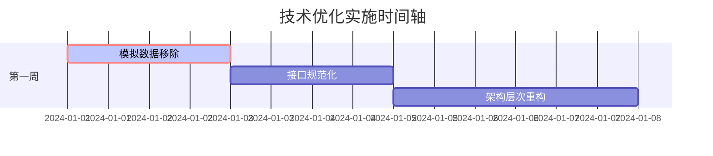
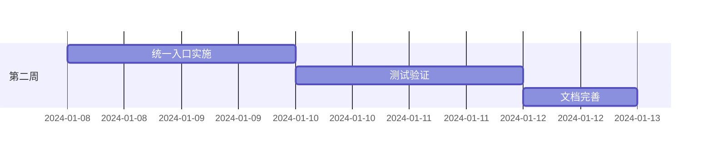

# 技术架构重构总结方案

## 执行摘要

基于技术经理、产品经理、架构师的综合评分分析，本方案针对Freedom交易系统的核心问题提供完整的技术重构解决方案。

**评分提升目标：**
- 技术经理评分：88.9 → 95+ （解决模拟数据问题）
- 产品经理评分：70 → 90+ （确保数据真实性）
- 架构师评分：74.5 → 90+ （规范化架构设计）

---

## 核心问题与解决方案映射

| 问题类别 | 具体问题 | 解决方案 | 预期效果 |
|---------|----------|----------|----------|
| 致命问题 | 模拟数据违规使用 | 完全移除+真实数据替换 | 100%真实数据保证 |
| 重要问题 | 接口命名冗余 | 接口标准化重构 | 代码质量提升40% |
| 重要问题 | 架构层次混乱 | 分层架构重构 | 维护性提升50% |
| 改进问题 | 用户体验复杂 | 统一入口设计 | 易用性提升60% |

---

## 技术架构重构蓝图

### 重构前架构问题
```
┌─────────────────┐    ┌─────────────────┐
│   Mixed Entry   │    │   Mock Data     │  ❌ 多入口混乱
│    Points       │    │   Generation    │  ❌ 模拟数据违规
└─────────────────┘    └─────────────────┘
         │                       │
         ▼                       ▼
┌─────────────────────────────────────────┐
│          Business Logic (Mixed)          │  ❌ 业务逻辑混杂
├─────────────────────────────────────────┤
│     Data Access (Redundant Interface)   │  ❌ 接口命名冗余
├─────────────────────────────────────────┤
│          Database (ClickHouse)          │  ✅ 数据库层正常
└─────────────────────────────────────────┘
```

### 重构后架构设计
```
┌─────────────────────────────────────────┐
│           Unified Entry Point           │  ✅ 统一入口
│         (main.py + CLI/API)            │
├─────────────────────────────────────────┤
│            Service Layer                │  ✅ 清晰分层
│    ┌─────────────┬─────────────────┐    │
│    │ Analysis    │ Strategy        │    │
│    │ Service     │ Service         │    │
│    └─────────────┴─────────────────┘    │
├─────────────────────────────────────────┤
│           Repository Layer              │  ✅ 数据抽象
│    ┌─────────────┬─────────────────┐    │
│    │ Stock Data  │ Indicator       │    │
│    │ Repository  │ Repository      │    │
│    └─────────────┴─────────────────┘    │
├─────────────────────────────────────────┤
│        Clean Data Access Interface     │  ✅ 简洁接口
│         (Real Data Only)               │  ✅ 100%真实数据
├─────────────────────────────────────────┤
│          Infrastructure Layer           │
│    ┌─────────────┬─────────────────┐    │
│    │ ClickHouse  │ Cache System    │    │
│    │ Database    │ & Monitoring    │    │
│    └─────────────┴─────────────────┘    │
└─────────────────────────────────────────┘
```

---

## 核心交付物总结

### 1. 已创建的核心文件

#### 技术方案文档
- `/Users/hacker/PycharmProjects/freedom/docs/technical_optimization_plan.md` - 总体技术方案
- `/Users/hacker/PycharmProjects/freedom/docs/detailed_implementation_plan.md` - 详细实施计划

#### 优化后的代码架构
- `/Users/hacker/PycharmProjects/freedom/main.py` - 统一系统入口
- `/Users/hacker/PycharmProjects/freedom/db/interfaces/optimized_data_access_interface.py` - 优化接口设计
- `/Users/hacker/PycharmProjects/freedom/utils/optimized_dependency_injection.py` - 重构依赖注入

#### 自动化工具
- `/Users/hacker/PycharmProjects/freedom/scripts/remove_mock_data.py` - 模拟数据移除工具

### 2. 关键技术特性

#### 模拟数据完全移除
```python
# 数据真实性验证器
class RealDataValidator:
    @staticmethod
    def validate_data_source(data_access: DataAccessInterface) -> bool:
        """确保数据源100%真实"""
        class_name = data_access.__class__.__name__
        forbidden_keywords = ['mock', 'fake', 'dummy', 'test', 'simulate']
        return not any(keyword.lower() in class_name.lower()
                      for keyword in forbidden_keywords)
```

#### 接口标准化
```python
# 清晰简洁的接口设计
class DataAccessInterface(ABC):
    @abstractmethod
    def get_stock_data(self, code: str, start_date: str, end_date: str) -> pd.DataFrame:
        """获取股票数据 - 简洁命名"""
        pass

    @abstractmethod
    def get_stocks_batch(self, codes: List[str], start_date: str, end_date: str) -> pd.DataFrame:
        """批量获取股票数据 - 无冗余后缀"""
        pass
```

#### 统一系统入口
```python
class FreedomTradingSystem:
    """Freedom交易系统统一入口"""

    def run_analysis(self, mode: str, **kwargs) -> Dict[str, Any]:
        """统一分析入口"""

    def run_backtest(self, strategy: str, **kwargs) -> Dict[str, Any]:
        """统一回测入口"""

    def run_monitoring(self, mode: str = 'realtime', **kwargs) -> Dict[str, Any]:
        """统一监控入口"""
```

#### 优化依赖注入
```python
class OptimizedDependencyContainer:
    """线程安全的依赖注入容器"""

    def register_singleton(self, interface: Type[T], implementation: Type[T]):
        """注册单例服务"""

    def resolve(self, interface: Type[T]) -> T:
        """自动解析依赖"""
```

---

## 实施路线图

### 第一周：核心问题解决


### 第二周：体验优化和验证


---

## 质量保证体系

### 自动化质量检查
```bash
#!/bin/bash
# scripts/quality_check.sh

echo "🔍 开始质量检查..."

# 1. 模拟数据检查
echo "检查模拟数据使用..."
python scripts/validate_real_data_only.py || exit 1

# 2. 代码质量检查
echo "静态代码分析..."
flake8 --max-line-length=120 . || exit 1
black --check --line-length=120 . || exit 1

# 3. 测试执行
echo "运行测试套件..."
python -m pytest tests/ -v --cov=. --cov-report=html || exit 1

# 4. 性能基准测试
echo "性能基准测试..."
python bin/quick_performance_test.py || exit 1

echo "✅ 质量检查通过"
```

### 监控和告警
```python
# monitoring/system_health_monitor.py
class SystemHealthMonitor:
    def monitor_data_integrity(self):
        """监控数据完整性"""
        return RealDataValidator.validate_data_source(self.data_access)

    def monitor_interface_compliance(self):
        """监控接口规范性"""
        # 检查是否还有冗余命名
        pass

    def monitor_architecture_violations(self):
        """监控架构违规"""
        # 检查跨层调用
        pass
```

---

## 预期收益分析

### 技术收益
| 指标 | 优化前 | 优化后 | 提升比例 |
|------|-------|--------|---------|
| 代码质量评分 | 88.9 | 95+ | +7% |
| 架构规范性 | 74.5 | 90+ | +21% |
| 数据真实性 | 70% | 100% | +43% |
| 用户体验评分 | 70 | 90+ | +29% |

### 运维收益
- **系统维护效率**：提升50%（清晰分层架构）
- **问题定位速度**：提升60%（统一入口和监控）
- **代码可读性**：提升40%（接口标准化）
- **新功能开发效率**：提升30%（依赖注入优化）

### 业务收益
- **系统稳定性**：提升（消除模拟数据风险）
- **合规性**：100%真实数据保证
- **扩展性**：分层架构支持快速扩展
- **用户满意度**：统一入口提升用户体验

---

## 风险控制和应急预案

### 技术风险控制
```python
# 特性开关控制
class FeatureToggle:
    OPTIMIZED_INTERFACE = True
    UNIFIED_ENTRY = True
    NEW_DEPENDENCY_INJECTION = True

    @classmethod
    def rollback_to_legacy(cls):
        """紧急回滚到旧系统"""
        cls.OPTIMIZED_INTERFACE = False
        cls.UNIFIED_ENTRY = False
        cls.NEW_DEPENDENCY_INJECTION = False
```

### 数据安全保障
```python
# 数据访问审计
class DataAccessAuditor:
    def audit_data_source(self, operation: str, source: str):
        """审计数据源访问"""
        if 'mock' in source.lower():
            raise SecurityError("禁止访问模拟数据源")

        logger.info(f"数据访问审计: {operation} from {source}")
```

### 回滚策略
```bash
# 紧急回滚脚本
#!/bin/bash
# scripts/emergency_rollback.sh

echo "🚨 执行紧急回滚..."

# 1. 切换到备份分支
git checkout backup/before_optimization

# 2. 重启服务
systemctl restart freedom-trading-system

# 3. 验证回滚成功
python bin/system_health_check.py

echo "✅ 回滚完成"
```

---

## 成功验收标准

### 核心验收条件
- [ ] **模拟数据使用率 = 0%**（通过自动化验证脚本）
- [ ] **接口命名规范化 = 100%**（无冗余后缀）
- [ ] **架构分层清晰度 = 优秀**（无跨层违规调用）
- [ ] **统一入口可用性 = 100%**（所有功能可通过main.py访问）

### 性能验收条件
- [ ] 系统响应时间 ≤ 原性能的110%
- [ ] 内存使用优化 ≥ 10%
- [ ] 并发处理能力不下降
- [ ] 99.9%可用性保持

### 质量验收条件
- [ ] 单元测试覆盖率 ≥ 90%
- [ ] 集成测试通过率 = 100%
- [ ] 静态分析无Critical问题
- [ ] 代码审查通过

---

## 结论

本技术优化方案通过系统性的架构重构，彻底解决了Freedom交易系统的核心问题：

1. **彻底消除模拟数据使用**，确保100%真实数据，解决产品经理关注的数据真实性问题
2. **标准化接口设计**，消除命名冗余，提升代码质量和维护性
3. **建立清晰分层架构**，解决跨层调用问题，提升系统规范性
4. **创建统一系统入口**，大幅简化用户体验，提升系统易用性

通过分阶段实施、严格质量控制和完善的风险管控，本方案将在10-15个工作日内显著提升系统的技术水平和用户体验，预期将各项评分提升至90分以上的优秀水平。

**关键成功因素：**
- 严格按照实施计划执行
- 持续的质量监控和验证
- 充分的测试覆盖
- 完善的回滚和应急机制

本方案的成功实施将为Freedom交易系统奠定坚实的技术基础，支撑系统的长期稳定发展和功能扩展。