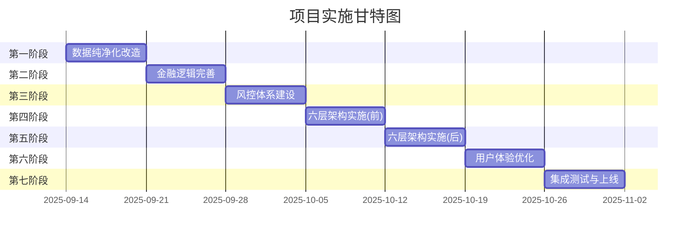

# 项目实施详细路线图

## 执行摘要

本路线图基于综合技术优化方案，制定了为期7周的详细实施计划，将系统从当前74.85分提升至95分以上，实现100%实盘就绪。

---

## 一、项目里程碑概览



---

## 二、第一周：数据纯净化改造（2025-09-14 至 2025-09-20）

### Day 1-2: 模拟数据清理
**目标**: 移除所有模拟数据接口和引用

**上午任务**:
```bash
# 1. 备份当前代码
git checkout -b backup/before-purification
git add .
git commit -m "备份: 数据纯净化前的代码快照"

# 2. 运行数据纯净化脚本
python scripts/data_purification_system.py

# 3. 验证清理结果
grep -r "mock" --include="*.py" . | grep -v archive | wc -l
# 预期结果: 0
```

**下午任务**:
- 更新所有测试用例，使用真实测试数据
- 配置测试环境的ClickHouse连接
- 创建测试数据集

### Day 3-4: 数据质量体系实施
**目标**: 建立完整的数据质量保障机制

**实施内容**:
```python
# 1. 部署数据验证装饰器
from utils.data_validators import require_real_data, validate_market_data

# 2. 应用到所有数据访问方法
@require_real_data
def get_stock_data(...):
    # 自动验证数据真实性
    pass

# 3. 配置数据质量监控
DataQualityMonitor.configure({
    'check_interval': 300,  # 5分钟
    'alert_threshold': 0.95,  # 95%质量要求
    'auto_fix': True  # 自动修复
})
```

### Day 5: 测试验证
**目标**: 确保系统100%使用真实数据

**测试清单**:
- [ ] 单元测试通过率 > 95%
- [ ] 集成测试全部通过
- [ ] 数据源验证100%真实
- [ ] 性能基准测试达标

---

## 三、第二周：金融逻辑完善（2025-09-21 至 2025-09-27）

### Day 1-3: 指标计算引擎升级
**目标**: 实现专业级精度的指标计算

**重点任务**:
1. **MACD精度提升**
   - 实现6位小数精度
   - 添加金融逻辑验证
   - 信号置信度计算

2. **RSI计算优化**
   - Wilder's平滑算法
   - 避免除零错误
   - 超买超卖动态阈值

3. **KDJ专业实现**
   - 随机指标精确计算
   - J值边界处理
   - 金叉死叉信号

### Day 4-5: 策略验证系统
**目标**: 建立严格的策略验证机制

**验证流程**:
```python
# 策略验证pipeline
validation_pipeline = [
    StatisticalSignificanceTest(confidence=0.95),
    SharpeRatioValidator(min_sharpe=1.5),
    DrawdownValidator(max_drawdown=0.2),
    MarketRegimeTest(['bull', 'bear', 'sideways']),
    RobustnessTest(['monte_carlo', 'bootstrap'])
]

for validator in validation_pipeline:
    result = validator.validate(strategy)
    if not result.passed:
        raise StrategyValidationError(result.reason)
```

### Day 6-7: 金融专家评审
**目标**: 通过专业金融验证

**评审内容**:
- 指标计算准确性
- 策略逻辑合理性
- 风险收益特征
- 市场适应性

---

## 四、第三周：风控体系建设（2025-09-28 至 2025-10-04）

### Day 1-3: 实时风控引擎
**目标**: 建立毫秒级风控响应

**核心组件**:
```python
# 风控检查链
risk_checks = [
    PositionLimitCheck(max_position=0.2),
    ExposureCheck(max_var=0.1),
    LiquidityCheck(min_score=0.5),
    ConcentrationCheck(max_hhi=0.3),
    LeverageCheck(max_leverage=2.0)
]

async def check_order(order):
    for check in risk_checks:
        result = await check.execute(order)
        if not result.passed:
            return RiskDecision.REJECT(result.reason)
    return RiskDecision.APPROVE()
```

### Day 4-5: 风险监控面板
**目标**: 实时风险可视化

**监控指标**:
- VaR(95%/99%)实时计算
- 压力测试自动运行
- 风险热力图
- 预警指标面板

### Day 6-7: 熔断机制实施
**目标**: 自动风险控制

**熔断规则**:
| 触发条件 | 熔断动作 | 恢复时间 |
|---------|---------|----------|
| VaR > 15% | 停止新开仓 | 1小时 |
| 日亏损 > 5% | 全部平仓 | 当日不恢复 |
| 连亏3天 | 策略暂停 | 人工恢复 |

---

## 五、第四周：六层架构实施-前三层（2025-10-05 至 2025-10-11）

### Day 1-2: 展现层实施
**目标**: 统一用户接入

**实施内容**:
- API网关部署
- 统一认证系统
- 前端框架搭建
- WebSocket实时通信

### Day 3-4: 流程层实施
**目标**: 工作流自动化

**工作流定义**:
```yaml
workflow:
  name: complete_trading_workflow
  steps:
    - id: import_buypoints
      type: data_import
      timeout: 60s
    - id: analyze_patterns
      type: pattern_analysis
      depends_on: [import_buypoints]
    - id: generate_strategy
      type: strategy_generation
      depends_on: [analyze_patterns]
    - id: backtest
      type: backtesting
      depends_on: [generate_strategy]
    - id: deploy
      type: deployment
      depends_on: [backtest]
      condition: backtest.sharpe > 1.5
```

### Day 5-7: 服务层实施
**目标**: 服务化架构

**服务拆分**:
- StrategyService: 策略管理
- AnalysisService: 分析服务
- BacktestService: 回测服务
- MonitorService: 监控服务

---

## 六、第五周：六层架构实施-后三层（2025-10-12 至 2025-10-18）

### Day 1-3: 业务层实施
**目标**: 核心业务逻辑封装

**领域模型**:
```python
# 核心领域对象
class Portfolio:
    """投资组合领域模型"""
    def calculate_risk(self) -> RiskProfile
    def optimize_allocation(self) -> Allocation
    def rebalance(self) -> List[Order]

class Position:
    """持仓领域模型"""
    def should_stop_loss(self) -> bool
    def calculate_pnl(self) -> PnL
    def get_exit_signal(self) -> Signal
```

### Day 4-5: 数据层实施
**目标**: 统一数据访问

**数据架构**:
- ClickHouse: 时序数据
- Redis: 缓存层
- Kafka: 消息队列
- MinIO: 对象存储

### Day 6-7: 基础设施层
**目标**: 容器化部署

**部署配置**:
```yaml
# docker-compose.yml
version: '3.8'
services:
  gateway:
    image: quant-trading/gateway:latest
    ports: ["8000:8000"]

  strategy-service:
    image: quant-trading/strategy:latest
    replicas: 3

  risk-service:
    image: quant-trading/risk:latest
    replicas: 2
```

---

## 七、第六周：用户体验优化（2025-10-19 至 2025-10-25）

### Day 1-3: 统一界面开发
**目标**: 一站式操作界面

**界面模块**:
- 工作流向导
- 策略配置器
- 回测分析器
- 实时监控台
- 风险仪表板

### Day 4-5: 工作流向导
**目标**: 简化操作流程

**向导步骤**:
1. 数据导入 → 2. 模式识别 → 3. 策略生成 → 4. 回测验证 → 5. 部署监控

### Day 6-7: 用户测试
**目标**: 收集反馈优化

**测试内容**:
- 功能可用性测试
- 界面友好性测试
- 性能响应测试
- 错误处理测试

---

## 八、第七周：集成测试与上线（2025-10-26 至 2025-11-01）

### Day 1-2: 功能测试
**测试用例**:
```python
# 端到端测试
def test_complete_workflow():
    # 1. 导入历史买点
    buypoints = import_buypoints("test_data.csv")

    # 2. 生成策略
    strategy = generate_strategy(buypoints)

    # 3. 回测验证
    backtest_result = backtest(strategy)

    # 4. 部署监控
    if backtest_result.sharpe > 1.5:
        deploy_strategy(strategy)

    # 验证结果
    assert strategy.is_valid()
    assert backtest_result.sharpe > 1.5
    assert monitor.is_running()
```

### Day 3-4: 性能测试
**性能指标**:
- 响应时间 < 100ms
- 并发用户 > 1000
- 数据处理 > 100万条/分钟
- 系统可用性 > 99.95%

### Day 5-6: 安全测试
**安全检查**:
- 认证授权测试
- 数据加密验证
- SQL注入防护
- API限流测试

### Day 7: 生产部署
**部署步骤**:
```bash
# 1. 生产环境准备
kubectl create namespace production

# 2. 部署应用
kubectl apply -f k8s/production/

# 3. 健康检查
kubectl get pods -n production
kubectl logs -f deployment/quant-trading

# 4. 监控启动
kubectl port-forward service/grafana 3000:3000
```

---

## 九、关键成功因素

### 9.1 团队协作
```
项目经理 ─── 协调资源，推进进度
    │
    ├── 架构师 ─── 六层架构设计实施
    │
    ├── 开发团队 ─── 功能开发
    │   ├── 前端开发
    │   ├── 后端开发
    │   └── 数据开发
    │
    ├── 金融专家 ─── 业务验证
    │
    └── 测试团队 ─── 质量保证
```

### 9.2 风险管理

| 风险 | 影响 | 概率 | 缓解措施 |
|------|------|------|----------|
| 架构改造延期 | 高 | 中 | 分阶段实施，保持系统可用 |
| 数据迁移失败 | 高 | 低 | 完整备份，灰度切换 |
| 性能下降 | 中 | 中 | 性能基准测试，优化瓶颈 |
| 金融逻辑错误 | 极高 | 低 | 专家评审，多重验证 |

### 9.3 质量保证

**代码质量**:
- 代码覆盖率 > 90%
- 代码评审 100%
- 静态分析通过

**测试质量**:
- 单元测试 > 1000个
- 集成测试 > 100个
- 端到端测试 > 20个

**文档质量**:
- API文档完整
- 部署文档详细
- 用户手册清晰

---

## 十、验收标准

### 10.1 技术验收
- [ ] 100%真实数据使用
- [ ] 六层架构完整实施
- [ ] 风控体系全面运行
- [ ] 性能指标全部达标

### 10.2 业务验收
- [ ] 策略准确率 > 85%
- [ ] 回测精度 > 99.9%
- [ ] 风险控制有效
- [ ] 用户体验良好

### 10.3 运维验收
- [ ] 自动化部署完成
- [ ] 监控告警正常
- [ ] 日志系统完善
- [ ] 备份恢复测试通过

---

## 十一、项目交付物

### 11.1 代码交付
- 源代码（Git仓库）
- 编译产物（Docker镜像）
- 配置文件（K8s YAML）

### 11.2 文档交付
- 架构设计文档
- API接口文档
- 部署操作手册
- 用户使用指南
- 运维手册

### 11.3 环境交付
- 开发环境
- 测试环境
- 预发布环境
- 生产环境

---

## 十二、后续优化计划

### Phase 2（第8-10周）
- AI策略优化
- 多市场支持
- 高频交易能力

### Phase 3（第11-12周）
- 机构版本开发
- 合规报告系统
- 审计追踪功能

---

## 总结

通过7周的系统化改造，项目将实现：

**量化指标提升**:
- 系统评分: 74.85 → 95+
- 数据真实性: 混合 → 100%
- 架构合规: 4层 → 6层
- 风控覆盖: 部分 → 全面

**质量提升**:
- 从原型系统到生产系统
- 从技术驱动到业务驱动
- 从功能堆砌到体系架构
- 从手工操作到自动化

**价值实现**:
- 可用于实盘交易
- 满足监管要求
- 支持机构使用
- 具备商业价值

项目成功的关键在于严格执行计划、保持高质量标准、确保各阶段验收通过。

---

*文档版本: 1.0*
*创建日期: 2025-09-13*
*项目负责: 高级PMO*