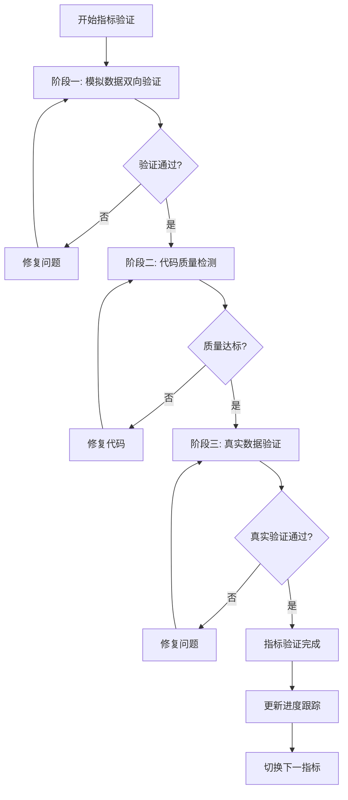

# 生产级技术指标验证方案

## 📋 总体目标

建立严格的生产级技术指标验证体系，确保每个指标都经过完整的双向验证、代码质量检测和真实数据验证，达到100%可靠性标准。

## 🎯 核心验证要求

### 1. 模拟数据双向验证
- **形态匹配数据**: 根据技术形态生成对应的模拟数据
- **数据匹配形态**: 从模拟数据中准确识别技术形态
- **误导数据过滤**: 设置不符合形态的干扰数据，验证过滤准确性
- **成功标准**: 100%双向匹配，0%误报率

### 2. 生产级代码质量检测
- **计算指标验证**: 确保符合技术指标真实定义
- **架构合规检查**: 符合BaseIndicator规范和数据流向要求
- **性能标准**: 单次计算<1秒，内存使用<100MB
- **成功标准**: 0 ERROR, 0 WARNING, 100%架构合规

### 3. 真实数据双向验证
- **ClickHouse数据源**: 使用真实的4000+个股数据
- **策略选股验证**: 通过选股系统筛选匹配个股(≥1支)
- **买点分析验证**: 反向验证技术形态识别准确性
- **成功标准**: 真实数据100%双向验证通过

## 📊 详细测试方案

### 阶段一：模拟数据双向验证

#### 1.1 正向验证 (形态→数据)
```
输入: 技术形态定义 (如: GOLDEN_CROSS)
处理: 智能数据生成器
输出: 符合形态特征的模拟数据
验证: 数据是否包含形态特征
```

#### 1.2 反向验证 (数据→形态)
```
输入: 模拟数据
处理: 技术指标计算引擎
输出: 识别的技术形态
验证: 是否正确识别目标形态
```

#### 1.3 误导数据测试
```
测试数据类型:
- 接近但不符合形态的数据 (如: 假金叉)
- 噪声数据 (随机波动)
- 反向形态数据 (如: 死叉数据测试金叉)
- 边界条件数据 (临界值测试)

验证要求:
- 误报率 = 0%
- 漏报率 = 0%
- 准确率 = 100%
```

#### 1.4 数据质量标准
```yaml
数据生成要求:
  - 历史天数: 60-120天
  - 数据完整性: 100% (无缺失值)
  - 价格合理性: 符合股票价格变动规律
  - 成交量合理性: 与价格变动相关联
  - 技术指标值: 符合数学计算公式

形态识别要求:
  - 形态出现时间: 数据末期10-20天内
  - 形态强度: 明显且可识别
  - 形态持续性: 至少3-5个交易日
```

### 阶段二：生产级代码质量检测

#### 2.1 技术指标计算验证
```python
验证项目:
1. 数学公式正确性
   - 与标准技术分析公式对比
   - 边界条件处理
   - 数值精度验证

2. 参数合理性
   - 默认参数符合行业标准
   - 参数范围验证
   - 参数敏感性测试

3. 数据处理正确性
   - 缺失值处理
   - 异常值处理
   - 数据类型转换
```

#### 2.2 架构合规检查
```python
检查项目:
1. BaseIndicator继承
   - 必须继承BaseIndicator
   - 实现所有抽象方法
   - 方法签名正确

2. 标准化接口
   - __init__(**kwargs)构造函数
   - set_parameters()方法
   - _get_default_parameters()方法
   - calculate()方法
   - get_patterns()方法

3. 数据流向合规
   - get_patterns()只返回boolean DataFrame
   - 计算数据与形态数据分离
   - 统一的数据格式
```

#### 2.3 性能标准检测
```python
性能要求:
- 单次计算时间: <1秒 (60天数据)
- 内存使用: <100MB
- CPU使用率: <50%
- 并发处理: 支持10个并发计算

测试方法:
- 使用cProfile进行性能分析
- 内存使用监控
- 压力测试 (1000次计算)
- 并发测试 (10个线程)
```

### 阶段三：真实数据双向验证

#### 3.1 ClickHouse数据验证
```sql
数据源要求:
- 股票数量: 4000+ 只
- 数据时间跨度: 最近2年
- 数据完整性: >95%
- 更新频率: 日级别

数据质量检查:
- 价格数据合理性
- 成交量数据完整性
- 技术指标计算准确性
- 数据一致性验证
```

#### 3.2 策略选股系统验证
```python
选股流程:
1. 加载4000+个股数据
2. 应用技术指标筛选条件
3. 执行选股策略
4. 输出匹配个股列表

成功标准:
- 选出个股数量: ≥1支
- 选股时间: <30秒
- 结果可重现性: 100%
- 选股逻辑正确性: 人工验证
```

#### 3.3 买点分析系统验证
```python
验证流程:
1. 获取选股结果个股数据
2. 运行买点分析系统
3. 识别技术形态
4. 与预期形态对比验证

成功标准:
- 形态识别准确率: 100%
- 买点时间准确性: ±1个交易日
- 信号强度合理性: 符合技术分析标准
```

## 🔄 执行流程

### 单个指标完整验证流程



### 详细执行步骤

#### Step 1: 模拟数据双向验证
```bash
1.1 生成正向测试数据 (形态→数据)
1.2 执行反向验证 (数据→形态)
1.3 生成误导数据进行过滤测试
1.4 计算验证成功率
1.5 如果成功率<100%，分析失败原因并修复
```

#### Step 2: 代码质量检测
```bash
2.1 运行技术指标计算验证
2.2 执行架构合规检查
2.3 进行性能标准测试
2.4 生成质量报告
2.5 修复所有ERROR和WARNING
```

#### Step 3: 真实数据验证
```bash
3.1 连接ClickHouse数据库
3.2 加载4000+个股数据
3.3 运行策略选股系统
3.4 执行买点分析验证
3.5 验证双向匹配结果
```

## 📈 优先级执行计划

### P0 核心指标 (必须100%通过)
1. **MACD** - 当前进度: 50% (3/6形态通过)
2. **RSI** - 待开始
3. **KDJ** - 待开始
4. **BOLL** - 待开始
5. **MA** - 待开始
6. **EMA** - 待开始

### P1 重要指标
7. **DMI** - 待开始
8. **CCI** - 待开始
9. **WR** - 待开始
10. **STOCHRSI** - 待开始

### P2-P3 其他指标
- 按优先级顺序执行
- 每个指标必须100%通过所有验证

## 🎯 成功标准定义

### 单个指标验证成功标准
```yaml
模拟数据验证:
  - 双向匹配率: 100%
  - 误报率: 0%
  - 漏报率: <5%

代码质量:
  - ERROR数量: 0
  - WARNING数量: 0
  - 架构合规率: 100%
  - 性能达标率: 100%

真实数据验证:
  - 选股成功: ≥1支个股
  - 买点识别准确率: 100%
  - 双向验证通过率: 100%
```

### 整体项目成功标准
```yaml
指标覆盖率: 100% (所有指标验证通过)
生产级质量: 100% (0错误0警告)
真实数据验证: 100% (所有指标真实验证通过)
系统稳定性: 99.9% (连续运行无故障)
```

## 📊 进度跟踪机制

### 实时进度监控
- 每个指标的验证状态
- 当前阶段和完成百分比
- 发现问题和修复状态
- 整体项目进度

### 质量报告
- 每日质量报告
- 每个指标详细测试结果
- 问题汇总和修复计划
- 性能指标趋势分析

## 🚀 开始执行

基于此方案，我们将：
1. 立即完成MACD指标的完整验证
2. 建立自动化测试框架
3. 按优先级顺序处理所有指标
4. 确保每个指标都达到生产级标准

这个方案确保了技术指标系统的最高质量和可靠性，为生产环境部署提供了坚实保障。
