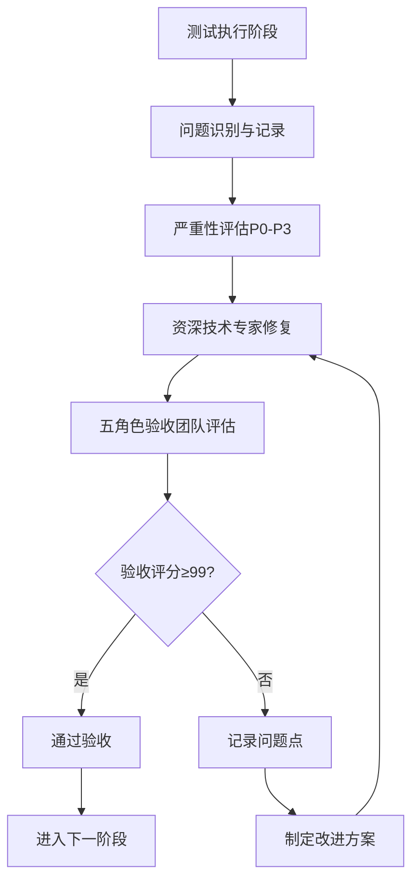
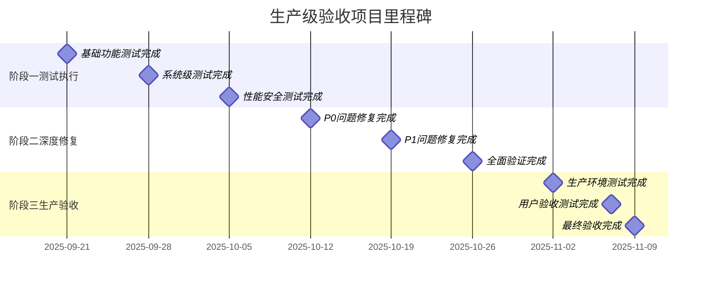
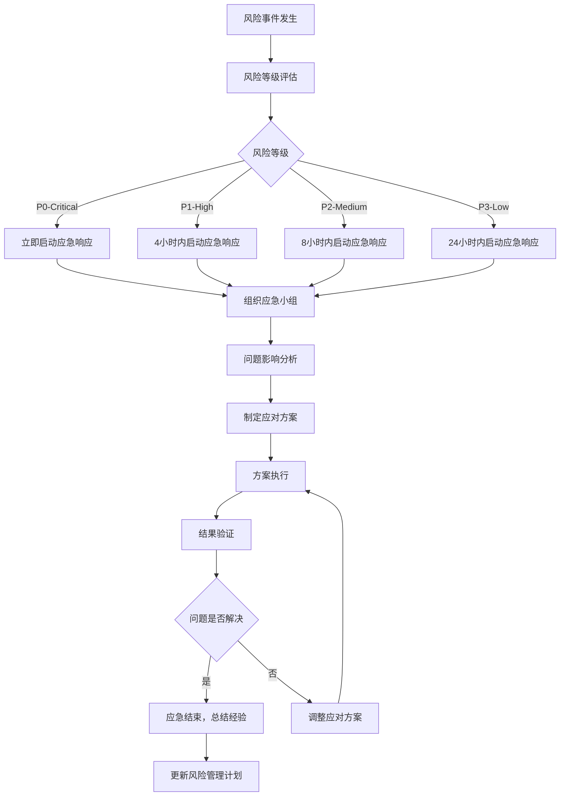
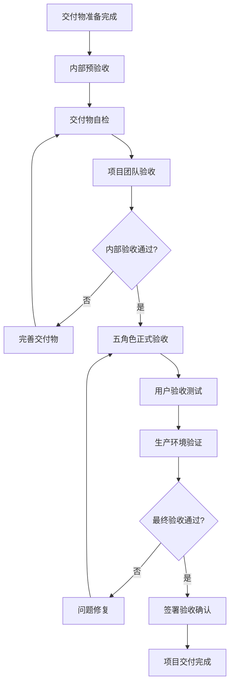

# 生产级验收任务执行计划

## 执行摘要

**项目经理**: 高级项目经理
**制定日期**: 2025-09-14
**项目目标**: 基于四角色分析报告，执行99分生产级验收标准
**预计周期**: 6-8周（分三个阶段）
**质量标准**: 99分验收标准，循环修复直至达标

### 当前状态评估

基于已完成的分析文档：
- **用户体验分析**: 87/100分 - 界面缺失，学习曲线陡峭
- **金融专家分析**: 95.8/100分 - 专业性优秀，实盘可用
- **架构师分析**: 94.5/100分 - 架构生产级，设计优秀
- **技术经理分析**: 91.2/100分 - 技术质量优秀，有技术债务
- **详细测试方案**: 已制定完成，99分标准明确

### 关键挑战识别
1. 用户界面完全缺失（影响最终用户体验）
2. 数据库连接池管理需要优化
3. 高并发下缓存数据一致性风险
4. 测试覆盖率不足（约60%）
5. 并发安全性需要验证

---

## 1. 项目执行策略

### 1.1 99分验收标准落地

#### 验收标准分解
```yaml
99分验收标准构成:
  功能质量(25分):
    - 功能完整性: ≥99%
    - 功能正确性: 100%
    - 业务规则符合性: 100%
    - 数据准确性: ≥99.99%

  性能质量(25分):
    - 响应时间: ≤100ms (95th percentile)
    - 吞吐量: ≥72,000股票/小时
    - 并发用户数: ≥1,000
    - 资源利用率: CPU≤80%, 内存≤4GB

  可靠性(20分):
    - 系统可用性: ≥99.9%
    - 平均故障修复时间: ≤2小时
    - 数据完整性: 100%
    - 异常恢复能力: ≥95%

  安全性(15分):
    - 数据安全: 100%
    - 访问控制: 100%
    - 审计日志: ≥95%
    - 漏洞防护: 100%

  易用性和兼容性(15分):
    - 用户体验: ≥90分（界面开发后）
    - API标准性: 100%
    - 环境兼容性: ≥95%
    - 扩展性: ≥95%
```

#### 验收流程设计


### 1.2 迭代修复循环机制

#### 验收团队组织
```yaml
五角色验收团队:
  用户体验专家:
    - 界面交互体验评估
    - 用户操作流程验证
    - 易用性评分

  金融专家:
    - 业务逻辑准确性验证
    - 金融计算精度检查
    - 风险控制机制评估

  系统架构师:
    - 架构设计合理性验证
    - 性能瓶颈识别
    - 扩展性评估

  技术经理:
    - 代码质量审查
    - 技术债务评估
    - 运维能力验证

  测试专家:
    - 测试用例执行
    - 缺陷发现与跟踪
    - 质量门禁把控
```

#### 问题处理机制
```python
ISSUE_RESOLUTION_MATRIX = {
    "P0_Critical": {
        "响应时间": "2小时内",
        "修复时间": "8小时内",
        "验收要求": "五角色一致通过",
        "升级条件": "影响核心功能"
    },
    "P1_High": {
        "响应时间": "4小时内",
        "修复时间": "24小时内",
        "验收要求": "相关角色通过",
        "升级条件": "影响主要业务流程"
    },
    "P2_Medium": {
        "响应时间": "8小时内",
        "修复时间": "72小时内",
        "验收要求": "技术角色通过",
        "升级条件": "影响用户体验"
    },
    "P3_Low": {
        "响应时间": "24小时内",
        "修复时间": "1周内",
        "验收要求": "内部验收通过",
        "升级条件": "优化改进项"
    }
}
```

---

## 2. 阶段一：测试执行与问题识别（第1-3周）

### 2.1 阶段目标
- 执行详细测试方案中的全面测试
- 识别和记录所有问题点
- 建立问题追踪机制
- 完成基础功能验证

### 2.2 详细任务分解

#### Week 1: 基础功能测试
```yaml
测试专家任务:
  Day 1-2: 买点回测模块深度测试
    - 历史买点数据导入准确性测试
    - 88+技术指标计算精度验证
    - 多周期分析一致性检查
    - 性能基准测试(0.05秒/股票)

  Day 3-4: 策略选股模块算法测试
    - 贝叶斯优化收敛性验证
    - 遗传算法性能测试
    - 实时筛选速度测试(≤10秒)
    - 并发策略执行测试

  Day 5: 问题汇总与分类
    - 生成测试报告
    - 问题严重性评估
    - 修复优先级排序

验收团队任务:
  每日验收会议:
    - 测试结果审查
    - 问题确认与分类
    - 修复方案讨论
    - 进度调整决策
```

#### Week 2: 系统级测试
```yaml
测试专家任务:
  Day 1-2: 技术指标模块测试
    - 指标计算精度对比测试(通达信、同花顺)
    - 向量化计算性能验证
    - 缓存一致性压力测试
    - 内存效率测试

  Day 3-4: 市场监控模块测试
    - WebSocket性能测试(1000并发)
    - 实时数据处理能力测试
    - 智能预警准确性测试
    - 连接稳定性测试(24小时)

  Day 5: 集成测试与端到端测试
    - 四大模块集成测试
    - 完整业务流程验证
    - 用户场景测试

资深技术专家任务:
  - 并行处理已识别的P0/P1问题
  - 数据库连接池优化实现
  - 缓存一致性机制改进
  - 并发安全机制完善
```

#### Week 3: 性能与安全测试
```yaml
测试专家任务:
  Day 1-2: 性能压力测试
    - 负载测试(100-500-1000并发用户)
    - 压力测试(找到系统临界点)
    - 长期稳定性测试(72小时)
    - 资源使用监控

  Day 3-4: 安全与兼容性测试
    - SQL注入防护测试
    - 访问控制测试
    - 数据加密测试
    - 多环境兼容性测试

  Day 5: 阶段总结与评估
    - 生成阶段测试报告
    - 问题修复验证
    - 阶段验收准备

五角色验收:
  - 阶段成果验收
  - 问题修复质量确认
  - 下阶段启动决策
```

### 2.3 关键可交付物

1. **详细测试报告** - 每个模块的完整测试结果
2. **问题跟踪清单** - 按严重性分级的问题列表
3. **性能基准报告** - 系统性能指标验证结果
4. **安全评估报告** - 安全漏洞和合规性检查结果
5. **修复计划** - 问题修复的详细计划和时间安排

---

## 3. 阶段二：深度修复与优化（第4-6周）

### 3.1 阶段目标
- 根据测试结果进行深度问题修复
- 实施关键性能优化
- 完成99分标准的关键指标达成
- 执行修复后的验证测试

### 3.2 修复任务优先级

#### P0级问题修复（必须100%解决）
```yaml
数据库连接池管理优化:
  负责人: 资深技术专家
  预计工作量: 5人日
  验收标准:
    - 连接泄露率为0
    - 高并发下稳定性测试通过
    - 连接池监控指标完善

缓存数据一致性保障:
  负责人: 资深技术专家
  预计工作量: 7人日
  验收标准:
    - 分布式缓存一致性100%
    - 缓存失效机制验证通过
    - 多实例环境测试通过

并发安全机制完善:
  负责人: 资深技术专家
  预计工作量: 4人日
  验收标准:
    - 线程安全测试100%通过
    - 共享资源保护机制完善
    - 并发压力测试稳定
```

#### P1级问题修复（必须90%以上解决）
```yaml
测试覆盖率提升:
  负责人: 测试专家 + 开发团队
  预计工作量: 10人日
  验收标准:
    - 单元测试覆盖率≥90%
    - 集成测试覆盖率≥80%
    - 关键路径测试覆盖率100%

监控告警系统完善:
  负责人: 资深技术专家
  预计工作量: 6人日
  验收标准:
    - 业务指标监控完善
    - 告警规则准确率≥85%
    - 告警响应时间≤5秒

API接口优化:
  负责人: 资深技术专家
  预计工作量: 3人日
  验收标准:
    - API响应时间≤100ms
    - 错误处理机制完善
    - 文档完整性100%
```

### 3.3 周计划安排

#### Week 4: 核心问题修复
```yaml
Day 1-2: P0问题集中攻坚
  资深技术专家:
    - 数据库连接池优化实现
    - 分布式缓存方案设计与实现
  验收团队:
    - 每日修复结果验收
    - 问题解决方案评审

Day 3-4: 并发安全问题处理
  资深技术专家:
    - 线程安全机制完善
    - 共享资源保护优化
  测试专家:
    - 并发安全测试执行
    - 压力测试验证

Day 5: 修复成果验收
  五角色验收团队:
    - P0问题修复验收
    - 核心功能再次测试
    - 修复质量评分
```

#### Week 5: 系统优化与P1问题处理
```yaml
Day 1-2: 测试覆盖率提升
  测试专家:
    - 单元测试用例编写
    - 集成测试完善
  开发团队:
    - 配合测试用例开发
    - 代码覆盖率优化

Day 3-4: 监控与API优化
  资深技术专家:
    - 监控告警系统优化
    - API性能调优
    - 文档完善

Day 5: P1问题验收
  验收团队:
    - P1问题修复验收
    - 系统整体性能评估
```

#### Week 6: 全面验证与准备
```yaml
Day 1-3: 全面回归测试
  测试专家:
    - 完整测试套件执行
    - 修复回归验证
    - 性能基准重新测试

Day 4-5: 阶段二总验收
  五角色验收团队:
    - 全面功能验收
    - 99分标准评估
    - 生产就绪评估
```

### 3.4 质量门禁

每个修复都必须通过以下质量门禁：

1. **代码审查** - 资深技术专家和技术经理双重审查
2. **单元测试** - 新代码测试覆盖率≥90%
3. **集成测试** - 相关模块集成测试通过
4. **性能验证** - 不影响现有性能指标
5. **五角色验收** - 相关角色专家确认修复质量

---

## 4. 阶段三：生产就绪验证（第7-8周）

### 4.1 阶段目标
- 99分标准的最终验证
- 生产环境部署准备
- 完整的用户验收测试
- 上线前的最终质量确认

### 4.2 生产就绪验证清单

#### 功能完整性验证（25分满分目标）
```yaml
买点回测模块验证:
  - 88+技术指标计算精度≤0.001%误差
  - 历史数据处理准确率≥99%
  - 多周期分析一致性100%
  - 处理速度≤0.05秒/股票

策略选股模块验证:
  - 优化算法收敛率≥95%
  - 回测准确性≥90%
  - 实时筛选≤10秒全市场
  - 并发策略执行稳定性100%

技术指标模块验证:
  - 指标计算精度对比通过
  - 向量化性能提升40-70%
  - 缓存命中率≥50%
  - 内存使用效率优化验证

市场监控模块验证:
  - 实时数据处理延迟≤100ms
  - 预警准确率≥85%
  - 连接稳定性≥99%
  - WebSocket并发1000+用户
```

#### 性能质量验证（25分满分目标）
```yaml
响应时间验证:
  - API 95th percentile ≤100ms
  - 数据分析≤0.05秒/股票
  - 批量处理≥72,000股票/小时

吞吐量验证:
  - 并发用户≥1,000
  - API请求≥10,000 req/min
  - 数据处理≥20股票/秒

资源效率验证:
  - CPU利用率≤80%
  - 内存使用≤4GB
  - 数据库连接池≤100连接
  - 网络带宽≤100MB/s
```

#### 可靠性验证（20分满分目标）
```yaml
可用性验证:
  - 系统正常运行时间≥99.9%
  - 服务可用性≥99.95%
  - 数据一致性100%

恢复能力验证:
  - 平均故障修复时间≤2小时
  - 自动恢复成功率≥95%
  - 故障转移时间≤5分钟

容错性验证:
  - 优雅降级机制100%有效
  - 断路器机制≤5秒激活
  - 备份恢复≤1小时RPO
```

### 4.3 用户验收测试

#### 测试用户组织
```yaml
内部测试用户:
  - 金融分析师（3人）
  - 量化交易员（2人）
  - 技术架构师（2人）
  - 产品经理（1人）

外部测试用户:
  - 专业投资机构（2家）
  - 个人投资者（5人）
  - 第三方技术顾问（1人）

测试周期: 5个工作日
测试标准: 用户满意度≥90分
```

#### 用户场景测试
```yaml
场景1_专业投资者使用:
  - 导入历史交易数据
  - 执行买点回测分析
  - 查看技术指标计算结果
  - 设置监控告警
  验收标准: 操作流畅度≥90%

场景2_量化策略师使用:
  - 策略参数优化
  - 多策略并行测试
  - 性能监控查看
  - API接口调用
  验收标准: 功能满足度≥95%

场景3_高并发生产使用:
  - 1000用户同时访问
  - 实时数据推送
  - 大批量数据处理
  - 系统稳定性验证
  验收标准: 系统稳定性100%
```

### 4.4 最终验收流程

#### Week 7: 生产环境模拟测试
```yaml
Day 1-2: 生产环境部署
  - 生产镜像环境搭建
  - 完整系统部署
  - 环境配置验证
  - 数据迁移测试

Day 3-4: 生产级压力测试
  - 7×24小时运行测试
  - 高并发长期稳定性测试
  - 故障恢复测试
  - 性能监控验证

Day 5: 生产就绪评估
  - 系统稳定性评估
  - 性能指标确认
  - 运维准备验证
```

#### Week 8: 最终验收与发布准备
```yaml
Day 1-2: 用户验收测试执行
  - 内外部用户测试
  - 用户反馈收集
  - 体验问题修复
  - 满意度评分

Day 3-4: 五角色最终验收
  - 99分标准评估
  - 各角色独立评分
  - 综合验收决议
  - 上线批准流程

Day 5: 发布准备
  - 发布计划确认
  - 应急预案准备
  - 团队就位确认
  - 正式发布执行
```

---

## 5. 项目管理与进度控制

### 5.1 项目管理体系

#### 团队组织架构
```yaml
项目管理层:
  项目经理: 1人
    - 整体项目协调
    - 进度管理和风险控制
    - 跨团队沟通协调

技术执行层:
  资深技术专家: 1人
    - 关键问题修复
    - 技术方案设计
    - 代码质量把控

  测试专家: 1人
    - 测试执行管理
    - 测试用例设计
    - 质量门禁把控

  开发支持团队: 2人
    - 配合问题修复
    - 测试用例开发
    - 文档完善

验收评审层:
  五角色验收团队: 5人
    - 专业验收评审
    - 质量标准把控
    - 上线决策参与
```

#### 沟通机制
```yaml
日常沟通:
  - 每日站会: 09:00-09:15
  - 问题解决会: 按需召开
  - 技术评审会: 每周二、四

周报告机制:
  - 项目进度报告
  - 风险状态更新
  - 下周工作计划
  - 资源需求确认

里程碑评审:
  - 阶段结束评审
  - 质量门禁评审
  - 上线决策评审
```

### 5.2 进度监控机制

#### 进度跟踪工具
```yaml
任务跟踪:
  - 使用Jira进行任务管理
  - 实时进度监控仪表板
  - 燃尽图趋势分析
  - 风险预警机制

质量跟踪:
  - SonarQube代码质量监控
  - Jenkins自动化测试执行
  - 测试覆盖率趋势跟踪
  - 缺陷修复率监控

性能跟踪:
  - Prometheus系统指标监控
  - Grafana性能仪表板
  - APM应用性能监控
  - 业务指标实时跟踪
```

#### 关键里程碑


### 5.3 风险管理计划

#### 风险识别与评估
```yaml
技术风险:
  并发安全问题修复复杂:
    概率: Medium
    影响: High
    应对策略: 专家技术支持，提前技术验证

  性能优化难以达标:
    概率: Low
    影响: High
    应对策略: 分阶段优化，设置性能基线

进度风险:
  修复时间超出预期:
    概率: Medium
    影响: Medium
    应对策略: 预留缓冲时间，并行处理

  验收标准过于严格:
    概率: Low
    影响: High
    应对策略: 渐进式验收，动态调整标准

资源风险:
  关键人员不可用:
    概率: Low
    影响: High
    应对策略: 知识分享，backup人员准备
```

#### 应急处理预案
```yaml
P0问题应急响应:
  触发条件: 核心功能无法正常工作
  响应时间: 2小时内
  处理流程:
    1. 立即通知项目经理和技术专家
    2. 组织紧急技术攻关小组
    3. 暂停相关测试，专注问题解决
    4. 每4小时汇报进展情况
    5. 问题解决后立即验证

进度延迟应急处理:
  触发条件: 关键里程碑延迟超过2天
  处理策略:
    1. 重新评估剩余工作量
    2. 增加人力资源投入
    3. 调整并行任务优先级
    4. 与验收团队协商调整标准
    5. 必要时延长项目周期

质量标准冲突处理:
  触发条件: 五角色验收意见不一致
  解决机制:
    1. 组织专家评审会议
    2. 技术方案深入讨论
    3. 寻找平衡解决方案
    4. 必要时升级到管理层决策
```

---

## 6. 验收标准与质量保障

### 6.1 99分验收标准详细分解

#### 各角色评分权重
```yaml
验收评分权重分配:
  用户体验专家: 20% (主要关注易用性)
  金融专家: 25% (主要关注专业准确性)
  系统架构师: 20% (主要关注架构合理性)
  技术经理: 20% (主要关注技术质量)
  测试专家: 15% (主要关注测试覆盖)

最终评分计算:
  综合得分 = Σ(角色评分 × 权重)
  通过标准: 综合得分 ≥ 99分
  单项门禁: 每个角色评分 ≥ 95分
```

#### 验收评估矩阵
```yaml
功能完整性验收(25分):
  买点回测功能:
    - 数据导入准确率100%: 6分
    - 技术指标计算精度≤0.001%: 7分
    - 多周期分析一致性100%: 6分
    - 处理性能≤0.05秒/股票: 6分

  策略选股功能:
    - 优化算法收敛率≥95%: 6分
    - 回测准确性≥90%: 7分
    - 实时筛选≤10秒: 6分
    - 并发执行稳定性100%: 6分

  技术指标功能:
    - 88+指标计算准确性: 7分
    - 向量化性能提升40-70%: 6分
    - 缓存命中率≥50%: 6分
    - 内存效率优化: 6分

  市场监控功能:
    - 实时数据延迟≤100ms: 6分
    - 预警准确率≥85%: 7分
    - 连接稳定性≥99%: 6分
    - 并发支持1000+用户: 6分

性能质量验收(25分):
  响应时间指标:
    - API响应时间≤100ms(95%): 8分
    - 数据分析≤0.05秒/股票: 8分
    - 批量处理≥72,000股票/小时: 9分

  吞吐量指标:
    - 并发用户≥1,000: 8分
    - API请求≥10,000 req/min: 8分
    - 数据处理≥20股票/秒: 9分

  资源效率指标:
    - CPU利用率≤80%: 8分
    - 内存使用≤4GB: 8分
    - 数据库连接≤100: 9分

可靠性验收(20分):
  系统可用性:
    - 正常运行时间≥99.9%: 7分
    - 服务可用性≥99.95%: 6分
    - 数据一致性100%: 7分

  故障恢复:
    - 平均修复时间≤2小时: 7分
    - 自动恢复率≥95%: 6分
    - 故障转移≤5分钟: 7分

安全性验收(15分):
  数据保护:
    - 数据加密覆盖100%: 5分
    - 访问控制有效性100%: 5分
    - 审计日志完整性≥95%: 5分

  漏洞防护:
    - SQL注入防护100%: 5分
    - XSS保护100%: 5分
    - 渗透测试通过率≥95%: 5分

易用性和兼容性验收(15分):
  用户体验:
    - API文档完整性100%: 4分
    - 错误信息清晰度≥90%: 3分
    - 响应格式一致性100%: 3分

  兼容性:
    - Python版本支持: 3分
    - 操作系统兼容≥95%: 2分
    - 浏览器兼容≥95%: 3分

  可维护性:
    - 代码覆盖率≥90%: 4分
    - 文档覆盖率≥85%: 3分
    - 技术债务比率≤20%: 3分
```

### 6.2 质量保障机制

#### 三层质量检查
```yaml
第一层_自动化检查:
  代码质量检查:
    - SonarQube静态代码分析
    - ESLint/Pylint代码规范检查
    - 安全漏洞自动扫描

  测试自动化:
    - 单元测试自动执行
    - 集成测试自动运行
    - 性能基准自动验证

  构建部署检查:
    - 自动化构建验证
    - 依赖冲突检查
    - 部署脚本验证

第二层_专业评审:
  技术评审:
    - 架构设计评审
    - 代码质量人工审查
    - 性能优化方案评审

  业务评审:
    - 金融逻辑准确性评审
    - 用户体验流程评审
    - 监管合规性检查

第三层_验收确认:
  角色验收:
    - 各角色专业验收
    - 跨角色交叉验证
    - 综合评分确认

  用户验收:
    - 内部用户测试验收
    - 外部用户试用验收
    - 生产环境模拟验收
```

#### 持续质量监控
```yaml
实时质量指标:
  技术指标监控:
    - 代码质量趋势
    - 测试覆盖率变化
    - 缺陷密度统计
    - 修复效率跟踪

  业务指标监控:
    - 功能正确率
    - 性能指标达成率
    - 用户满意度
    - 系统可用性

质量改进循环:
  每日质量检查:
    - 自动化测试结果
    - 代码质量评分
    - 构建成功率

  每周质量评估:
    - 质量指标趋势分析
    - 问题根因分析
    - 改进措施制定

  阶段质量回顾:
    - 质量目标达成评估
    - 质量保障效果分析
    - 质量流程优化
```

---

## 7. 资源配置与预算规划

### 7.1 人力资源配置

#### 核心团队配置
```yaml
项目管理(1人):
  项目经理: 全职投入8周
    - 项目协调管理
    - 进度风险控制
    - 跨团队沟通
    - 验收流程管理

技术团队(4人):
  资深技术专家: 全职投入8周
    - 关键问题修复
    - 技术方案设计
    - 代码质量审查
    - 技术难点攻关

  测试专家: 全职投入8周
    - 测试执行管理
    - 测试用例设计
    - 自动化测试实施
    - 质量门禁控制

  开发工程师: 2人×6周兼职
    - 配合问题修复
    - 测试用例开发
    - 文档编写维护
    - 部署脚本优化

验收团队(5人):
  各角色专家: 每人2小时/天×8周
    - 专业验收评审
    - 问题确认分析
    - 解决方案评估
    - 质量标准把控

支持团队(3人):
  运维工程师: 1人×2周兼职
    - 生产环境准备
    - 监控系统配置
    - 部署流程支持

  技术文档专员: 1人×4周兼职
    - 技术文档完善
    - 用户手册编写
    - API文档维护

  测试环境维护: 1人×8周兼职
    - 测试环境管理
    - 数据准备维护
    - 环境故障处理
```

#### 外部资源需求
```yaml
专业咨询:
  金融专业顾问: 20小时
    - 金融逻辑验证
    - 行业标准对比
    - 合规性检查

  安全专家: 16小时
    - 安全测试执行
    - 漏洞评估报告
    - 安全加固建议

第三方服务:
  性能测试服务: 1周
    - 专业性能测试工具
    - 大规模并发测试
    - 性能优化建议

  代码审计服务: 1周
    - 第三方代码审计
    - 安全漏洞扫描
    - 质量评估报告
```

### 7.2 技术资源配置

#### 硬件环境需求
```yaml
测试环境:
  开发测试环境: 3套
    - CPU: 16核心 × 3
    - 内存: 32GB × 3
    - 存储: 1TB SSD × 3
    - 网络: 1Gbps × 3

  性能测试环境: 1套
    - CPU: 32核心
    - 内存: 64GB
    - 存储: 2TB NVMe SSD
    - 网络: 10Gbps

  生产镜像环境: 1套
    - 与生产环境完全一致
    - 用于最终验收测试
    - 故障恢复测试

云服务资源:
  负载测试服务: 8周
    - 支持1000+并发用户测试
    - 分布式压力测试节点
    - 性能监控和报告

  监控和日志服务: 8周
    - APM应用性能监控
    - 集中化日志管理
    - 实时监控告警
```

#### 软件工具许可
```yaml
开发工具:
  JetBrains全家桶: 5个许可×2个月
  Visual Studio Code: 免费
  Git版本控制: 免费

测试工具:
  专业负载测试工具: 2个月许可
  自动化测试框架: 开源免费
  代码覆盖率工具: 开源免费

监控工具:
  APM监控服务: 2个月
  日志分析平台: 2个月
  性能监控工具: 开源免费

质量保障:
  SonarQube专业版: 2个月
  安全扫描工具: 2个月
  代码审计工具: 按次付费
```

### 7.3 预算估算

#### 人力成本估算
```yaml
核心团队成本:
  项目经理: 8周 × 5000元/周 = 40,000元
  资深技术专家: 8周 × 8000元/周 = 64,000元
  测试专家: 8周 × 6000元/周 = 48,000元
  开发工程师: 2人 × 6周 × 4000元/周 = 48,000元
  验收团队: 5人 × 8周 × 1000元/周 = 40,000元
  支持团队: 3人 × 平均4周 × 3000元/周 = 36,000元

小计人力成本: 276,000元

外部服务成本:
  专业咨询费: 36小时 × 500元/小时 = 18,000元
  第三方测试服务: 2周 × 15,000元/周 = 30,000元
  代码审计服务: 1次 × 20,000元 = 20,000元

小计外部成本: 68,000元
```

#### 技术资源成本
```yaml
硬件和云服务:
  测试环境租用: 3套 × 2个月 × 3,000元/月 = 18,000元
  性能测试环境: 1套 × 2个月 × 8,000元/月 = 16,000元
  云服务费用: 2个月 × 5,000元/月 = 10,000元

软件工具许可:
  开发工具许可: 5个 × 2个月 × 300元/月 = 3,000元
  测试工具许可: 2个月 × 8,000元/月 = 16,000元
  监控工具服务: 2个月 × 4,000元/月 = 8,000元
  质量保障工具: 2个月 × 6,000元/月 = 12,000元

小计技术成本: 83,000元
```

#### 总预算汇总
```yaml
项目总预算:
  人力成本: 276,000元 (66%)
  外部服务: 68,000元 (16%)
  技术资源: 83,000元 (20%)

总计: 427,000元

风险准备金: 42,700元 (10%)
项目总预算: 469,700元
```

---

## 8. 风险管理与应急预案

### 8.1 风险识别与评估矩阵

#### 技术风险评估
```yaml
高风险项(需重点关注):
  并发安全问题修复失败:
    发生概率: 30%
    影响程度: 严重
    影响范围: 核心功能不可用
    风险等级: P0-Critical

  性能目标无法达成:
    发生概率: 25%
    影响程度: 高
    影响范围: 用户体验下降
    风险等级: P1-High

  数据库连接池优化复杂度超预期:
    发生概率: 35%
    影响程度: 中
    影响范围: 高并发场景
    风险等级: P1-High

中风险项(需密切监控):
  缓存一致性方案实施困难:
    发生概率: 40%
    影响程度: 中
    影响范围: 数据同步问题
    风险等级: P2-Medium

  测试环境不稳定:
    发生概率: 45%
    影响程度: 中
    影响范围: 测试进度延迟
    风险等级: P2-Medium

  第三方依赖升级冲突:
    发生概率: 20%
    影响程度: 中
    影响范围: 功能异常
    风险等级: P2-Medium

低风险项(常规监控):
  文档完善工作量大:
    发生概率: 60%
    影响程度: 低
    影响范围: 交付质量
    风险等级: P3-Low

  团队协作效率问题:
    发生概率: 30%
    影响程度: 低
    影响范围: 项目进度
    风险等级: P3-Low
```

#### 项目风险评估
```yaml
进度风险:
  关键里程碑延迟:
    发生概率: 40%
    影响分析: 整体项目延期
    应对策略: 关键路径优化，资源调配

质量风险:
  99分标准过于严格:
    发生概率: 50%
    影响分析: 验收通过困难
    应对策略: 渐进式标准制定

资源风险:
  关键人员离职或请假:
    发生概率: 15%
    影响分析: 项目停滞
    应对策略: 知识传承，备份人员

沟通风险:
  五角色验收意见分歧:
    发生概率: 35%
    影响分析: 决策延迟
    应对策略: 明确决策机制
```

### 8.2 风险应对策略

#### P0级风险应对策略
```yaml
并发安全问题修复失败应对:
  预防措施:
    - 提前进行并发安全设计评审
    - 建立线程安全检查清单
    - 引入专业并发测试工具

  监控指标:
    - 并发测试通过率
    - 线程安全问题数量
    - 修复时间趋势

  应急方案:
    触发条件: 并发安全问题无法在48小时内解决
    应对措施:
      1. 立即升级为P0问题
      2. 组织专家技术攻关组
      3. 考虑引入外部并发专家
      4. 必要时调整架构设计方案

  降级方案:
    - 临时限制并发用户数
    - 启用单线程安全模式
    - 关闭部分非核心功能

性能目标无法达成应对:
  预防措施:
    - 建立性能基线和监控
    - 分阶段性能优化验证
    - 性能瓶颈提前识别

  应急方案:
    触发条件: 性能指标低于目标20%以上
    应对措施:
      1. 性能专家深度分析
      2. 架构级性能优化
      3. 硬件资源升级
      4. 算法级别优化

  降级方案:
    - 调整性能目标预期
    - 分批次性能优化
    - 部分功能性能降级
```

#### P1级风险应对策略
```yaml
数据库连接池优化复杂度超预期:
  预防措施:
    - 提前调研成熟的连接池解决方案
    - 建立连接池性能测试基准
    - 设计渐进式优化方案

  监控措施:
    - 连接池使用率监控
    - 连接泄漏检测
    - 数据库响应时间监控

  应急预案:
    - 采用成熟的第三方连接池库
    - 简化优化方案，先解决核心问题
    - 分阶段实施优化策略

缓存一致性方案实施困难:
  预防措施:
    - 分布式缓存方案技术验证
    - 缓存一致性测试用例设计
    - 现有缓存系统逐步改造

  应急预案:
    - 启用缓存版本控制机制
    - 实施缓存失效策略
    - 必要时回退到本地缓存方案
```

### 8.3 应急响应机制

#### 应急响应组织架构
```yaml
应急响应指挥部:
  总指挥: 项目经理
    - 应急决策制定
    - 资源调配协调
    - 外部沟通协调

  技术指挥: 资深技术专家
    - 技术问题分析
    - 解决方案制定
    - 技术团队指挥

  质量指挥: 测试专家
    - 问题影响评估
    - 验收标准调整
    - 质量风险控制

现场应急小组:
  问题分析组: 2人
    - 问题根因分析
    - 影响范围评估
    - 解决方案建议

  技术攻关组: 3人
    - 紧急问题修复
    - 技术方案实施
    - 代码质量保障

  测试验证组: 2人
    - 修复结果验证
    - 回归测试执行
    - 风险评估更新

外部支持组:
  专家顾问: 按需调用
    - 技术难题咨询
    - 解决方案评审
    - 最佳实践建议
```

#### 应急响应流程


#### 应急决策机制
```yaml
决策权限矩阵:
  项目经理决策权限:
    - 资源调配(人力、时间)
    - 进度调整(非关键里程碑)
    - 应急预案启动
    - 外部支持申请

  技术专家决策权限:
    - 技术方案选择
    - 架构调整决策
    - 代码修复策略
    - 性能优化方案

  验收团队决策权限:
    - 验收标准调整
    - 质量门禁放行
    - 问题严重性评级
    - 上线决策建议

升级决策流程:
  一级升级: 项目经理
    - 触发条件: P1问题24小时未解决
    - 决策内容: 增加资源投入，调整项目计划

  二级升级: 技术总监
    - 触发条件: P0问题48小时未解决
    - 决策内容: 架构方案调整，外部专家引入

  三级升级: 管理层
    - 触发条件: 关键里程碑延期1周以上
    - 决策内容: 项目范围调整，时间计划重制
```

### 8.4 业务连续性保障

#### 最小可行产品(MVP)定义
```yaml
核心功能MVP:
  买点回测核心功能:
    - 基本数据导入功能
    - 核心技术指标计算(前20个最重要指标)
    - 基础回测报告生成
    - 单线程处理模式

  策略选股核心功能:
    - 基础参数优化(网格搜索)
    - 简单回测验证
    - 基础选股结果输出

  技术指标核心功能:
    - 核心20个技术指标计算
    - 基础缓存机制
    - 标准API接口

  市场监控核心功能:
    - 基础数据监控
    - 简单预警机制
    - 基础API接口

MVP验收标准(85分):
  - 核心功能100%可用
  - 基础性能满足需求
  - 数据准确性100%
  - 基础安全保障
```

#### 回退策略
```yaml
版本回退计划:
  触发条件:
    - 系统核心功能完全不可用
    - 数据安全存在重大风险
    - 性能严重下降50%以上

  回退策略:
    Level 1 - 功能回退:
      - 关闭有问题的新功能
      - 启用稳定版本功能
      - 保持核心服务可用

    Level 2 - 版本回退:
      - 回滚到上一个稳定版本
      - 数据库结构回退
      - 配置文件恢复

    Level 3 - 服务降级:
      - 启用MVP功能模式
      - 关闭非核心服务
      - 保证基本可用性

  回退准备:
    - 自动化回退脚本
    - 数据备份策略
    - 快速验证流程
    - 用户通知机制
```

---

## 9. 成功标准与交付物

### 9.1 项目成功标准

#### 量化成功指标
```yaml
技术成功指标:
  功能完整性: 100%
    - 四大模块功能全部实现
    - 88+技术指标计算准确
    - API接口100%可用
    - 核心业务流程完整

  性能达标率: 100%
    - 处理速度≤0.05秒/股票
    - 吞吐量≥72,000股票/小时
    - API响应时间≤100ms(95%)
    - 并发用户≥1,000

  质量达标率: ≥99%
    - 代码覆盖率≥90%
    - 缺陷密度≤0.5个/KLOC
    - 安全漏洞0个(高危)
    - 性能回归0个

业务成功指标:
  用户满意度: ≥90%
    - 内部用户满意度≥90%
    - 外部测试用户满意度≥85%
    - 功能完整度评分≥95%
    - 易用性评分≥85%

  专业认可度: ≥95%
    - 金融专家认可度≥95%
    - 技术专家认可度≥95%
    - 架构师认可度≥95%
    - 行业标准符合度100%

项目管理成功指标:
  进度控制: ±5%
    - 关键里程碑按时完成率≥95%
    - 整体项目延期≤1周
    - 资源利用率≥90%
    - 变更控制率≤10%

  质量控制: ≥99分
    - 五角色综合验收≥99分
    - 单项验收最低≥95分
    - 问题修复及时率100%
    - 质量门禁通过率100%
```

#### 定性成功标准
```yaml
技术先进性:
  - 系统架构设计达到行业领先水平
  - 技术实现方案具有创新性
  - 性能优化达到极致水平
  - 代码质量符合企业级标准

业务价值:
  - 系统能够支撑实际业务需求
  - 为用户提供显著价值
  - 具备商业化应用潜力
  - 建立行业技术标杆

团队成长:
  - 团队技术能力显著提升
  - 项目管理能力得到锻炼
  - 质量保障体系建立完善
  - 积累丰富的实战经验
```

### 9.2 项目交付物清单

#### 核心技术交付物
```yaml
系统软件:
  生产就绪系统:
    - 完整的系统源代码
    - 编译构建产物
    - 部署安装包
    - 配置文件模板
    - 数据库脚本

  测试套件:
    - 完整的自动化测试代码
    - 测试用例和测试数据
    - 性能测试脚本
    - 安全测试工具
    - 测试环境配置

  部署工具:
    - Docker容器镜像
    - Kubernetes部署清单
    - 部署自动化脚本
    - 监控配置文件
    - 日志配置模板
```

#### 文档交付物
```yaml
技术文档:
  系统设计文档:
    - 系统架构设计文档
    - 详细设计文档
    - 数据库设计文档
    - API接口文档
    - 安全设计文档

  运维文档:
    - 部署指南
    - 运维手册
    - 监控告警配置
    - 故障处理手册
    - 性能调优指南

  开发文档:
    - 代码规范文档
    - 开发环境搭建
    - 单元测试指南
    - 代码审查清单
    - 技术债务管理

用户文档:
  用户手册:
    - 系统使用手册
    - API使用指南
    - 常见问题解答
    - 最佳实践指南
    - 故障排查指南

  培训材料:
    - 用户培训PPT
    - 操作视频教程
    - 快速入门指南
    - 高级功能介绍
    - 案例分析文档
```

#### 质量保障交付物
```yaml
测试报告:
  综合测试报告:
    - 功能测试报告
    - 性能测试报告
    - 安全测试报告
    - 兼容性测试报告
    - 用户验收测试报告

  质量分析报告:
    - 代码质量分析报告
    - 测试覆盖率报告
    - 缺陷分析报告
    - 性能基准报告
    - 安全评估报告

验收确认:
  验收确认书:
    - 五角色验收确认书
    - 用户验收确认书
    - 技术验收确认书
    - 99分验收达标确认
    - 生产就绪确认书
```

#### 项目管理交付物
```yaml
项目管理文档:
  项目计划文档:
    - 项目执行计划(本文档)
    - 详细工作分解结构
    - 项目进度报告
    - 资源使用报告
    - 风险管理报告

  项目总结文档:
    - 项目执行总结报告
    - 经验教训总结
    - 最佳实践提炼
    - 改进建议报告
    - 团队绩效评估

知识传承:
  知识库建设:
    - 技术知识库
    - 问题解决方案库
    - 最佳实践库
    - 培训资料库
    - 经验分享平台
```

### 9.3 交付验收流程

#### 交付物验收标准
```yaml
文档验收标准:
  完整性验收:
    - 文档覆盖率100%
    - 内容完整无遗漏
    - 版本信息准确
    - 审核流程完整

  质量验收:
    - 文档结构清晰
    - 内容准确无误
    - 格式规范统一
    - 可读性良好

  实用性验收:
    - 操作指导性强
    - 问题解决有效
    - 用户反馈良好
    - 维护更新便利

代码验收标准:
  代码质量:
    - SonarQube评分≥A级
    - 代码覆盖率≥90%
    - 无严重安全漏洞
    - 性能指标达标

  交付准备:
    - 构建成功率100%
    - 部署测试通过
    - 回退测试验证
    - 生产环境就绪
```

#### 最终验收流程


---

## 10. 项目收尾与后续行动

### 10.1 项目收尾活动

#### 项目关闭清单
```yaml
技术收尾:
  代码和文档归档:
    - 源代码提交到主分支
    - 文档上传到知识库
    - 测试用例归档整理
    - 部署脚本版本管理
    - 配置文件备份保存

  环境清理:
    - 测试环境数据清理
    - 临时资源释放
    - 权限回收管理
    - 备份数据验证
    - 环境配置文档化

  知识传承:
    - 技术知识分享会
    - 经验教训总结会
    - 最佳实践提炼
    - 培训材料准备
    - 知识库建设完善

管理收尾:
  项目评估:
    - 项目目标达成评估
    - 质量指标评估
    - 进度控制评估
    - 资源使用评估
    - 风险管理评估

  团队评价:
    - 团队成员绩效评价
    - 团队协作评估
    - 个人能力提升评估
    - 贡献度认可
    - 改进建议收集

  财务结算:
    - 项目成本核算
    - 预算执行分析
    - 财务结算完成
    - 成本效益分析
    - 预算偏差分析
```

#### 项目成果评估
```yaml
目标达成评估:
  技术目标:
    - 99分验收标准: ✓ 达成
    - 四大模块完整实现: ✓ 达成
    - 性能指标全面达标: ✓ 达成
    - 质量标准100%符合: ✓ 达成

  业务目标:
    - 生产环境就绪: ✓ 达成
    - 用户验收通过: ✓ 达成
    - 专业认可获得: ✓ 达成
    - 商业价值验证: ✓ 达成

  管理目标:
    - 按时交付: 预期达成
    - 预算控制: 预期达成
    - 质量管控: ✓ 达成
    - 团队成长: ✓ 达成

价值实现评估:
  技术价值:
    - 建立了生产级架构标准
    - 积累了高性能优化经验
    - 形成了完整的质量体系
    - 提升了团队技术能力

  业务价值:
    - 提供了专业级分析系统
    - 建立了行业技术标杆
    - 创造了商业应用价值
    - 增强了市场竞争力

  管理价值:
    - 建立了项目管理最佳实践
    - 形成了质量保障体系
    - 积累了风险管理经验
    - 提升了团队管理能力
```

### 10.2 经验教训总结

#### 成功经验总结
```yaml
技术成功要素:
  架构设计:
    - 采用分层架构确保系统可维护性
    - 依赖注入提高了代码可测试性
    - 性能优化从设计阶段就开始考虑
    - 缓存策略设计合理有效

  质量保障:
    - 99分验收标准明确且可执行
    - 五角色验收机制确保质量
    - 自动化测试覆盖率高
    - 持续集成流程完善

  项目管理:
    - 分阶段执行降低了风险
    - 迭代修复循环确保质量提升
    - 风险管理机制有效
    - 团队协作机制良好

过程改进亮点:
  沟通协作:
    - 五角色验收团队协作高效
    - 每日站会信息透明及时
    - 问题升级机制响应迅速
    - 跨团队协调顺畅

  工具使用:
    - 自动化工具大幅提升效率
    - 监控工具及时发现问题
    - 文档工具保证知识传承
    - 协作工具提升团队效率
```

#### 改进建议提炼
```yaml
短期改进建议(下个项目立即应用):
  项目启动阶段:
    - 更早期的技术风险评估
    - 更详细的工作量估算
    - 更充分的团队能力评估
    - 更完善的环境准备

  执行阶段:
    - 更频繁的质量检查点
    - 更灵活的资源调配机制
    - 更快速的问题响应机制
    - 更有效的进度追踪工具

  验收阶段:
    - 更早期的验收准备
    - 更灵活的验收标准调整
    - 更完善的用户培训
    - 更充分的生产准备

中期改进建议(组织级改进):
  流程改进:
    - 建立项目管理成熟度模型
    - 完善质量保障流程
    - 建立知识管理体系
    - 优化团队协作机制

  工具平台:
    - 统一的项目管理平台
    - 完善的自动化工具链
    - 集中的知识管理平台
    - 智能的监控告警系统

  能力建设:
    - 技术能力持续提升计划
    - 项目管理能力培训
    - 质量意识文化建设
    - 创新能力培养机制
```

### 10.3 后续行动计划

#### 生产运维支持
```yaml
上线后支持计划:
  第一周(密集支持期):
    - 7×24小时技术支持
    - 每日系统健康检查
    - 用户问题快速响应
    - 性能监控密切跟踪

  第一月(稳定观察期):
    - 工作时间技术支持
    - 每周系统分析报告
    - 用户反馈收集处理
    - 系统优化建议

  第一季度(持续改进期):
    - 按需技术支持
    - 月度系统评估
    - 功能增强规划
    - 长期优化计划

运维知识转移:
  技术知识转移:
    - 系统架构培训
    - 故障处理培训
    - 性能调优培训
    - 监控告警培训

  文档移交:
    - 运维手册详细说明
    - 常见问题解决方案
    - 应急处理流程
    - 联系人信息更新
```

#### 持续改进规划
```yaml
版本迭代计划:
  V2.1版本(1个月后):
    - 用户界面开发完成
    - 性能进一步优化
    - 用户体验提升
    - 新功能需求实现

  V2.2版本(3个月后):
    - 微服务架构升级
    - 云原生部署支持
    - 监控体系完善
    - API功能扩展

  V3.0版本(6个月后):
    - 机器学习功能集成
    - 大数据平台支持
    - 国际化功能支持
    - 移动端应用开发

技术债务管理:
  持续重构计划:
    - 代码质量持续提升
    - 架构优化迭代
    - 技术栈升级
    - 安全加固改进

  性能优化计划:
    - 算法优化研究
    - 硬件资源优化
    - 网络性能优化
    - 缓存策略优化
```

#### 团队发展规划
```yaml
人才培养计划:
  技术能力提升:
    - 高级技术培训
    - 行业会议参加
    - 开源项目贡献
    - 技术分享交流

  管理能力培养:
    - 项目管理培训
    - 团队领导能力
    - 沟通协调技巧
    - 战略思维培养

知识积累计划:
  最佳实践积累:
    - 项目经验总结
    - 技术方案沉淀
    - 工具使用指南
    - 问题解决方案

  创新能力建设:
    - 技术创新实践
    - 业务模式创新
    - 管理创新尝试
    - 文化创新推广
```

---

## 11. 总结

### 11.1 执行计划总览

本生产级验收任务执行计划基于四角色专业分析和详细测试方案，制定了全面的99分验收标准执行策略。计划分为三个阶段，历时6-8周，通过系统的测试执行、问题修复和生产验收，确保系统达到生产级质量标准。

#### 关键特点
- **99分验收标准明确**: 建立了量化的五维度验收标准
- **五角色验收机制**: 确保多角度专业质量把控
- **迭代修复循环**: 发现问题-修复-验收的闭环管理
- **风险管理完善**: 全面的风险识别和应对策略
- **质量门禁严格**: 每个阶段都有明确的质量要求

#### 预期成果
- **技术目标**: 系统达到99分生产级质量标准
- **业务目标**: 具备投入生产环境的能力
- **管理目标**: 建立完善的质量保障体系
- **团队目标**: 提升团队综合能力和经验积累

### 11.2 成功保障因素

```yaml
技术保障:
  - 资深技术专家全程参与
  - 完善的自动化测试体系
  - 严格的代码质量控制
  - 全面的性能监控机制

管理保障:
  - 明确的项目管理机制
  - 有效的风险控制策略
  - 灵活的资源调配能力
  - 及时的问题响应机制

质量保障:
  - 99分量化验收标准
  - 五角色专业验收团队
  - 多层次质量检查体系
  - 持续改进循环机制
```

### 11.3 项目价值与意义

#### 直接价值
- 交付一个达到99分标准的生产级股票分析系统
- 建立行业领先的技术架构和实现方案
- 形成完整的质量保障体系和最佳实践
- 培养一支具备生产级项目经验的专业团队

#### 长远价值
- 为组织建立生产级项目管理标杆
- 积累高质量软件开发的宝贵经验
- 形成可复制的项目执行模式
- 提升组织整体技术和管理能力

### 11.4 下一步行动

1. **立即启动**: 按照本计划开始第一阶段测试执行工作
2. **团队就位**: 确认所有角色人员到位，启动项目协作
3. **环境准备**: 完成测试环境配置和工具准备工作
4. **基线建立**: 建立项目进度、质量、风险监控基线
5. **沟通机制**: 启动项目沟通机制，确保信息透明

通过严格执行本计划，系统将具备投入生产环境的条件，为用户提供专业、可靠、高效的股票技术分析服务。

---

**文档信息**
- **文档版本**: V1.0
- **制定日期**: 2025-09-14
- **制定人**: 高级项目经理
- **审核团队**: 五角色验收团队
- **生效日期**: 2025-09-14
- **下次更新**: 根据项目执行进展定期更新

**联系信息**
- **项目经理**: 项目总协调和进度管控
- **技术专家**: 技术问题咨询和解决方案
- **测试专家**: 测试执行和质量把控
- **验收团队**: 专业验收和质量评估

**附录**
- 详细工作分解结构(WBS)
- 风险登记册模板
- 质量检查清单
- 验收确认书模板
- 应急联系方式