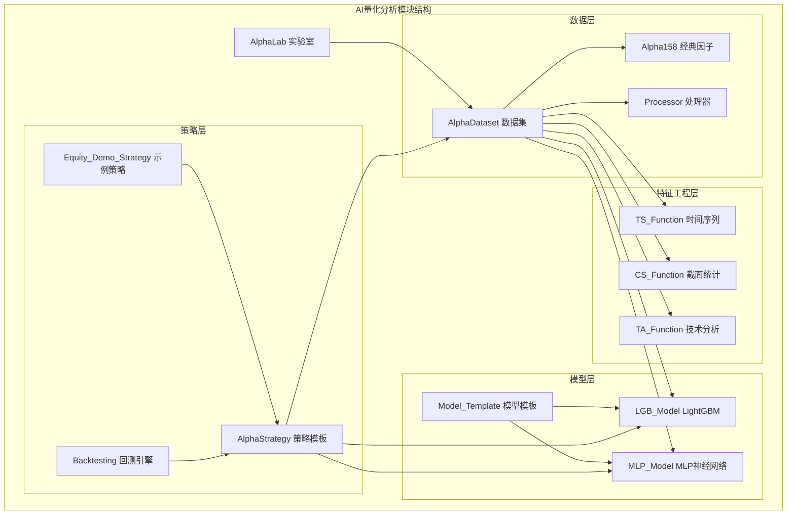
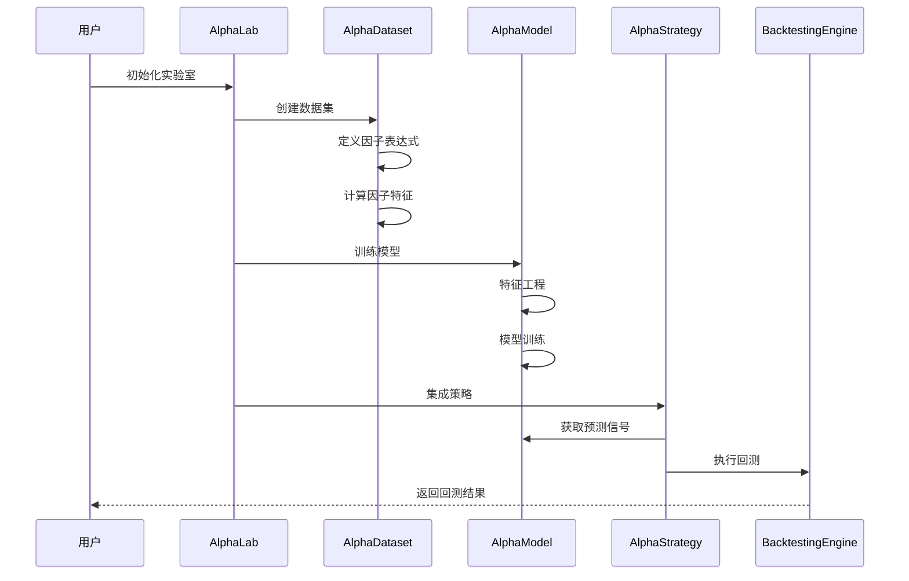
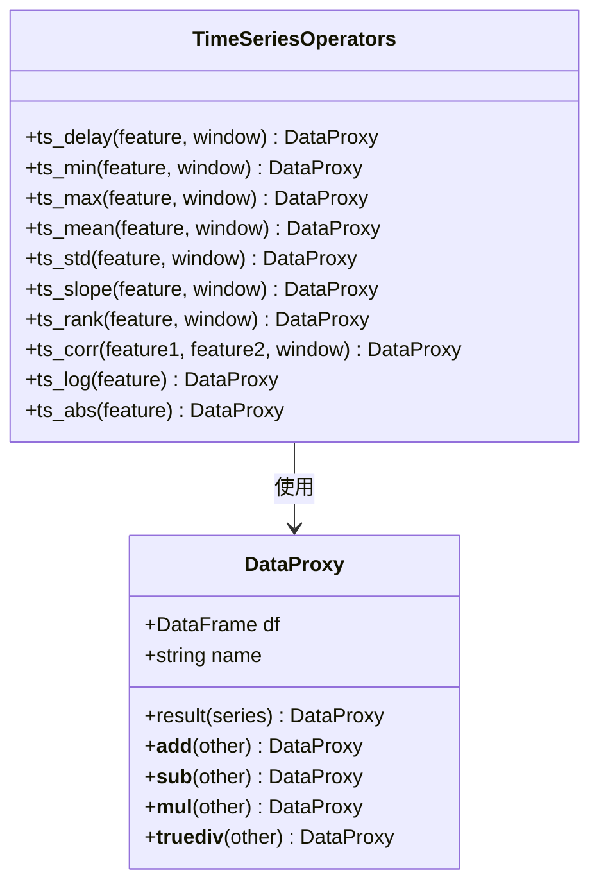
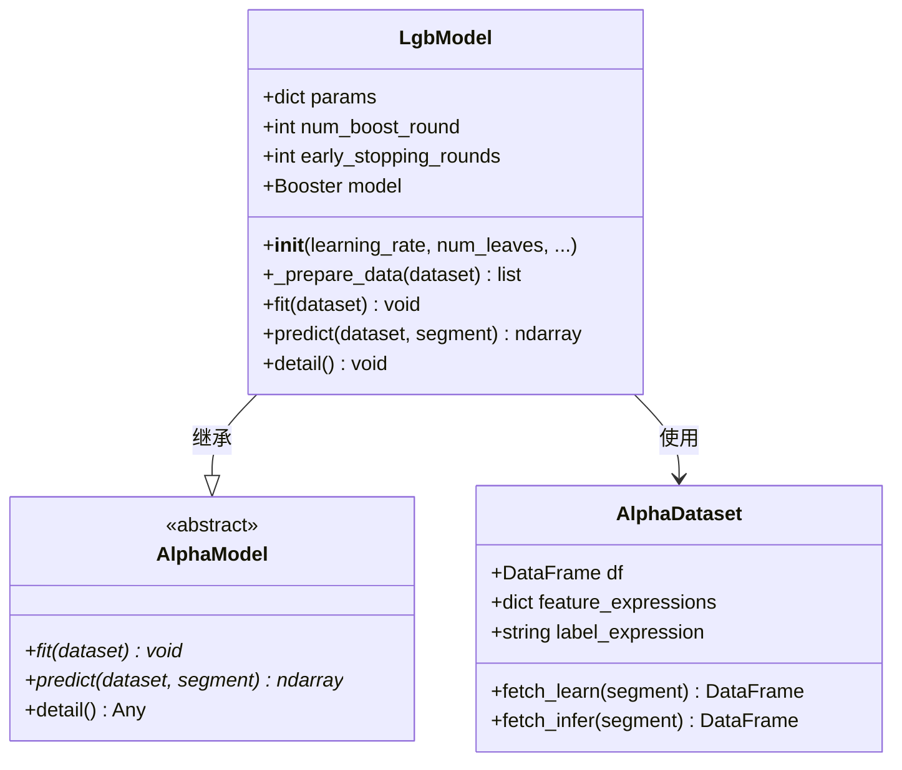
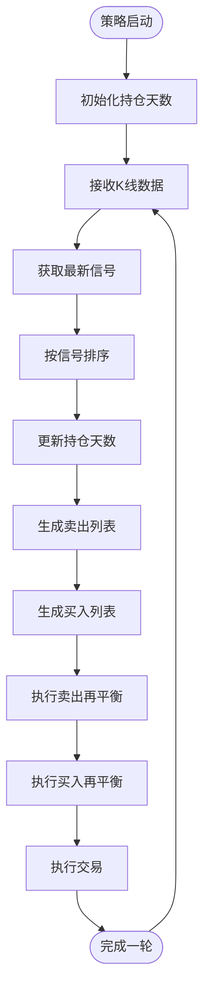
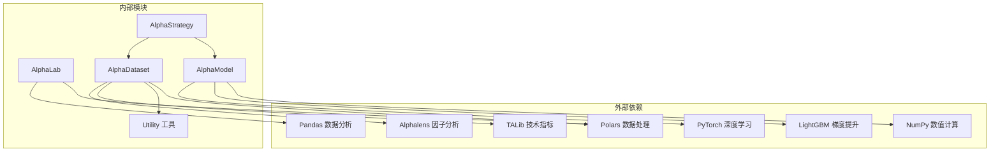

# AI量化分析模块

<cite>
**本文档引用的文件**
- [lab.py](file://vnpy/alpha/lab.py)
- [alpha_158.py](file://vnpy/alpha/dataset/datasets/alpha_158.py)
- [ta_function.py](file://vnpy/alpha/dataset/ta_function.py)
- [ts_function.py](file://vnpy/alpha/dataset/ts_function.py)
- [cs_function.py](file://vnpy/alpha/dataset/cs_function.py)
- [utility.py](file://vnpy/alpha/dataset/utility.py)
- [template.py](file://vnpy/alpha/dataset/template.py)
- [lgb_model.py](file://vnpy/alpha/model/models/lgb_model.py)
- [mlp_model.py](file://vnpy/alpha/model/models/mlp_model.py)
- [template.py](file://vnpy/alpha/model/template.py)
- [equity_demo_strategy.py](file://vnpy/alpha/strategy/strategies/equity_demo_strategy.py)
- [__init__.py](file://vnpy/alpha/__init__.py)
</cite>

## 目录
1. [简介](#简介)
2. [项目结构](#项目结构)
3. [核心组件](#核心组件)
4. [架构概览](#架构概览)
5. [详细组件分析](#详细组件分析)
6. [依赖关系分析](#依赖关系分析)
7. [性能考虑](#性能考虑)
8. [故障排除指南](#故障排除指南)
9. [结论](#结论)

## 简介

AI量化分析模块是vnpy框架中的核心组件，专门用于构建和实施基于人工智能的量化投资策略。该模块提供了完整的因子工程、模型训练和策略开发工作流程，支持多种机器学习算法，并集成了先进的技术分析功能。

模块的主要特点包括：
- **完整的因子工程体系**：包含158个经典因子和自定义技术指标
- **多模型支持**：支持LightGBM、MLP等多种机器学习模型
- **策略集成**：提供完整的交易策略开发和回测环境
- **高效的数据处理**：基于Polars的高性能数据处理引擎
- **实验平台**：提供完整的投研实验工作流

## 项目结构

AI量化分析模块采用分层架构设计，主要分为以下几个层次：



**图表来源**
- [lab.py](file://vnpy/alpha/lab.py#L1-L50)
- [template.py](file://vnpy/alpha/dataset/template.py#L1-L50)
- [template.py](file://vnpy/alpha/model/template.py#L1-L30)

**章节来源**
- [__init__.py](file://vnpy/alpha/__init__.py#L1-L17)

## 核心组件

### AlphaLab 实验室

AlphaLab是整个AI量化分析模块的核心实验平台，提供了完整的数据管理、模型训练和策略回测功能。

```python
class AlphaLab:
    """Alpha Research Laboratory"""
    
    def __init__(self, lab_path: str) -> None:
        """Constructor"""
        # 设置数据路径
        self.lab_path: Path = Path(lab_path)
        self.daily_path: Path = self.lab_path.joinpath("daily")
        self.minute_path: Path = self.lab_path.joinpath("minute")
        self.dataset_path: Path = self.lab_path.joinpath("dataset")
        self.model_path: Path = self.lab_path.joinpath("model")
        self.signal_path: Path = self.lab_path.joinpath("signal")
```

主要功能包括：
- **数据管理**：支持分钟级和日线级K线数据的存储和加载
- **索引成分管理**：支持股票指数成分股的历史变更记录
- **合约设置管理**：维护交易合约的基本信息
- **数据集管理**：提供AlphaDataset的持久化存储
- **模型管理**：支持各种机器学习模型的保存和加载
- **信号管理**：管理预测信号的存储和检索

### AlphaDataset 数据集

AlphaDataset是因子工程的核心类，负责定义和计算各种技术指标和因子。

```python
class Alpha158(AlphaDataset):
    """158 basic factors from Qlib"""
    
    def __init__(self, df: pl.DataFrame, train_period: tuple[str, str], 
                 valid_period: tuple[str, str], test_period: tuple[str, str]) -> None:
        """Constructor"""
        super().__init__(df=df, train_period=train_period, valid_period=valid_period, 
                        test_period=test_period)
        
        # 添加158个经典因子
        self.add_feature("kmid", "(close - open) / open")
        self.add_feature("klen", "(high - low) / open")
        # ... 更多因子定义
```

**章节来源**
- [lab.py](file://vnpy/alpha/lab.py#L1-L100)
- [alpha_158.py](file://vnpy/alpha/dataset/datasets/alpha_158.py#L1-L130)

## 架构概览

AI量化分析模块采用模块化设计，各组件之间通过清晰的接口进行交互：



**图表来源**
- [lab.py](file://vnpy/alpha/lab.py#L20-L80)
- [template.py](file://vnpy/alpha/dataset/template.py#L20-L100)
- [template.py](file://vnpy/alpha/model/template.py#L1-L30)

## 详细组件分析

### 因子工程系统

#### 158个经典因子集

Alpha158类实现了Qlib中的158个经典因子，涵盖了价格形态、时间序列统计、动量指标等多个维度：

```python
# 蜡烛图模式特征
self.add_feature("kmid", "(close - open) / open")
self.add_feature("klen", "(high - low) / open")
self.add_feature("kup", "(high - ts_greater(open, close)) / open")
self.add_feature("klow", "(ts_less(open, close) - low) / open")

# 价格变化特征
for field in ["open", "high", "low", "vwap"]:
    self.add_feature(f"{field}_0", f"{field} / close")

# 时间序列特征
windows: list[int] = [5, 10, 20, 30, 60]
for w in windows:
    self.add_feature(f"ma_{w}", f"ts_mean(close, {w}) / close")
    self.add_feature(f"std_{w}", f"ts_std(close, {w}) / close")
```

#### 时间序列操作符

ts_function.py提供了丰富的时序数据分析功能：



**图表来源**
- [ts_function.py](file://vnpy/alpha/dataset/ts_function.py#L1-L50)
- [utility.py](file://vnpy/alpha/dataset/utility.py#L1-L50)

#### 截面统计操作符

cs_function.py提供了跨市场统计分析功能：

```python
def cs_rank(feature: DataProxy) -> DataProxy:
    """执行截面排名"""
    df: pl.DataFrame = feature.df.select(
        pl.col("datetime"),
        pl.col("vt_symbol"),
        pl.col("data").rank().over("datetime")
    )
    return DataProxy(df)

def cs_mean(feature: DataProxy) -> DataProxy:
    """计算截面均值"""
    df: pl.DataFrame = feature.df.select(
        pl.col("datetime"),
        pl.col("vt_symbol"),
        pl.col("data").mean().over("datetime")
    )
    return DataProxy(df)
```

#### 技术分析函数

ta_function.py集成了TALib的技术指标计算：

```python
def ta_rsi(close: DataProxy, window: int) -> DataProxy:
    """按合约计算RSI指标"""
    close_: pd.Series = to_pd_series(close)
    result: pd.Series = talib.RSI(close_, timeperiod=window)
    df: pl.DataFrame = to_pl_dataframe(result)
    return DataProxy(df)

def ta_atr(high: DataProxy, low: DataProxy, close: DataProxy, window: int) -> DataProxy:
    """按合约计算ATR指标"""
    high_: pd.Series = to_pd_series(high)
    low_: pd.Series = to_pd_series(low)
    close_: pd.Series = to_pd_series(close)
    result: pd.Series = talib.ATR(high_, low_, close_, timeperiod=window)
    df: pl.DataFrame = to_pl_dataframe(result)
    return DataProxy(df)
```

**章节来源**
- [alpha_158.py](file://vnpy/alpha/dataset/datasets/alpha_158.py#L15-L130)
- [ts_function.py](file://vnpy/alpha/dataset/ts_function.py#L1-L226)
- [cs_function.py](file://vnpy/alpha/dataset/cs_function.py#L1-L37)
- [ta_function.py](file://vnpy/alpha/dataset/ta_function.py#L1-L42)

### 机器学习模型

#### LightGBM模型

LGB模型提供了高效的梯度提升决策树算法：



**图表来源**
- [lgb_model.py](file://vnpy/alpha/model/models/lgb_model.py#L1-L50)
- [template.py](file://vnpy/alpha/model/template.py#L1-L30)

```python
class LgbModel(AlphaModel):
    """LightGBM ensemble learning algorithm"""
    
    def __init__(self, learning_rate: float = 0.1, num_leaves: int = 31, 
                 num_boost_round: int = 1000, early_stopping_rounds: int = 50):
        self.params: dict = {
            "objective": "mse",
            "learning_rate": learning_rate,
            "num_leaves": num_leaves,
            "seed": seed
        }
        self.num_boost_round: int = num_boost_round
        self.early_stopping_rounds: int = early_stopping_rounds
```

#### MLP神经网络模型

MLP模型提供了深度学习能力：

```python
class MlpModel(AlphaModel):
    """Multi-Layer Perceptron Model"""
    
    def __init__(self, input_size: int, hidden_sizes: tuple[int] = (256,), 
                 lr: float = 0.001, n_epochs: int = 300, batch_size: int = 2000):
        # 初始化多层感知机网络
        self.model: nn.Module = MlpNetwork(
            input_size=input_size,
            hidden_sizes=hidden_sizes,
        )
        
        # 设置优化器
        self.optimizer: optim.Optimizer = optim.Adam(
            self.model.parameters(),
            lr=lr,
            weight_decay=weight_decay
        )
```

**章节来源**
- [lgb_model.py](file://vnpy/alpha/model/models/lgb_model.py#L1-L170)
- [mlp_model.py](file://vnpy/alpha/model/models/mlp_model.py#L1-L100)

### 交易策略系统

#### EquityDemoStrategy策略

EquityDemoStrategy展示了如何将预测模型集成到实际交易策略中：



**图表来源**
- [equity_demo_strategy.py](file://vnpy/alpha/strategy/strategies/equity_demo_strategy.py#L1-L100)

```python
class EquityDemoStrategy(AlphaStrategy):
    """Equity Long-Only Demo Strategy"""
    
    top_k: int = 50                 # 最大持仓股票数量
    n_drop: int = 5                 # 每次卖出股票数量
    min_days: int = 3               # 最小持有天数
    cash_ratio: float = 0.95        # 现金利用率
    min_volume: int = 100           # 最小交易单位
    open_rate: float = 0.0005       # 开仓手续费率
    close_rate: float = 0.0015      # 平仓手续费率
    min_commission: int = 5         # 最低手续费
    price_add: float = 0.05         # 委托价格调整比例
```

策略的核心逻辑包括：
1. **信号处理**：获取并排序预测信号
2. **持仓管理**：跟踪每只股票的持有天数
3. **卖出策略**：根据信号强度和持有天数决定卖出
4. **买入策略**：选择高信号股票进行买入
5. **风险管理**：控制单笔交易金额和总仓位

**章节来源**
- [equity_demo_strategy.py](file://vnpy/alpha/strategy/strategies/equity_demo_strategy.py#L1-L101)

## 依赖关系分析

AI量化分析模块的依赖关系呈现清晰的层次结构：



**图表来源**
- [lab.py](file://vnpy/alpha/lab.py#L1-L20)
- [template.py](file://vnpy/alpha/dataset/template.py#L1-L20)
- [template.py](file://vnpy/alpha/model/template.py#L1-L10)

**章节来源**
- [lab.py](file://vnpy/alpha/lab.py#L1-L50)
- [template.py](file://vnpy/alpha/dataset/template.py#L1-L50)
- [template.py](file://vnpy/alpha/model/template.py#L1-L30)

## 性能考虑

### 数据处理优化

1. **并行计算**：使用multiprocessing.Pool进行因子计算的并行处理
2. **内存管理**：采用Polars的lazy evaluation减少内存占用
3. **缓存机制**：LRU缓存常用的数据和计算结果
4. **增量更新**：支持数据的增量添加和更新

### 模型训练优化

1. **早停机制**：防止过拟合，提高训练效率
2. **学习率调度**：动态调整学习率，加速收敛
3. **批量训练**：支持大规模数据的批量处理
4. **设备优化**：支持CPU和GPU的混合计算

### 策略执行优化

1. **事件驱动**：基于事件触发的策略执行
2. **批量下单**：减少交易频率，降低交易成本
3. **风险控制**：实时监控和控制风险敞口
4. **回撤控制**：动态调整仓位，控制最大回撤

## 故障排除指南

### 常见问题及解决方案

#### 数据加载问题

**问题**：BarData数据加载失败
```python
# 检查文件是否存在
if not file_path.exists():
    logger.error(f"File {file_path} does not exist")
    return []
```

**解决方案**：
1. 确认数据文件路径正确
2. 检查文件格式是否为Parquet
3. 验证数据完整性

#### 模型训练问题

**问题**：模型训练不收敛
```python
# 检查模型是否已训练
if self.model is None:
    raise ValueError("model is not fitted yet!")
```

**解决方案**：
1. 调整学习率参数
2. 增加训练轮数
3. 检查特征工程质量
4. 验证标签数据准确性

#### 策略执行问题

**问题**：交易信号异常
```python
# 检查信号有效性
if not self.fitted:
    raise ValueError("Model has not been trained yet!")
```

**解决方案**：
1. 确保模型已完成训练
2. 验证信号计算逻辑
3. 检查交易规则配置
4. 监控市场流动性

**章节来源**
- [lab.py](file://vnpy/alpha/lab.py#L100-L200)
- [lgb_model.py](file://vnpy/alpha/model/models/lgb_model.py#L100-L150)
- [mlp_model.py](file://vnpy/alpha/model/models/mlp_model.py#L200-L300)

## 结论

AI量化分析模块是一个功能完整、架构清晰的量化投资工具包。它成功地将因子工程、机器学习模型和交易策略有机结合，为量化研究人员和交易者提供了强大的分析和实盘交易平台。

### 主要优势

1. **完整的生态系统**：从数据准备到策略实盘的全链条支持
2. **高性能设计**：基于Polars和PyTorch的高效计算引擎
3. **灵活的扩展性**：模块化设计便于功能扩展和定制
4. **丰富的工具集**：158个经典因子和多种机器学习算法
5. **完善的实验平台**：支持完整的投研工作流程

### 应用场景

- **学术研究**：因子挖掘和模型验证
- **量化交易**：自动化交易策略开发
- **风险管理**：投资组合优化和风险控制
- **绩效评估**：策略回测和业绩分析

该模块为量化投资领域提供了一个高质量的开源解决方案，具有很高的实用价值和推广意义。