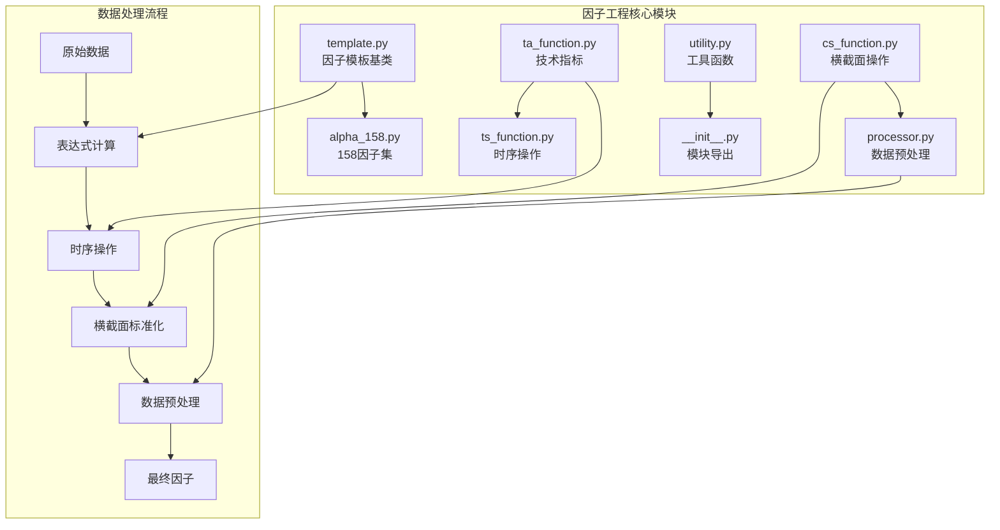
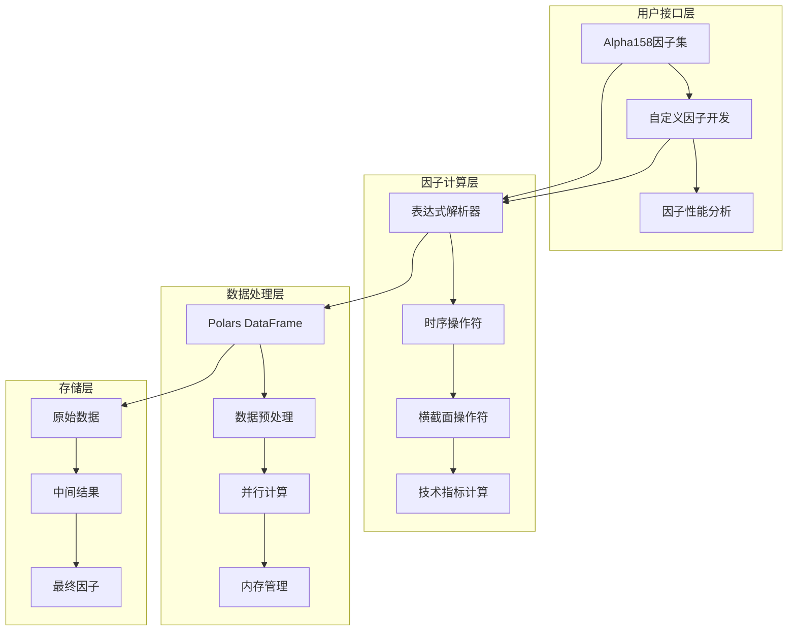
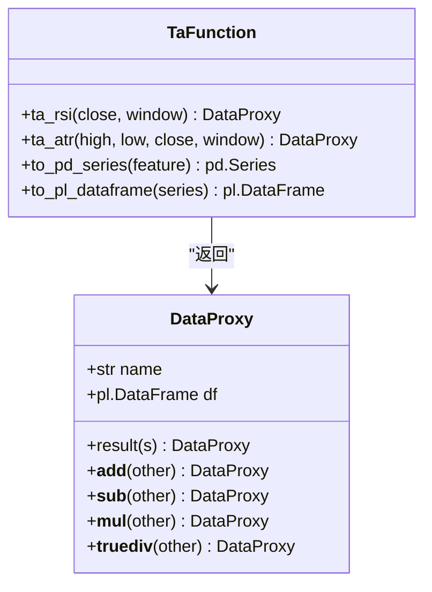
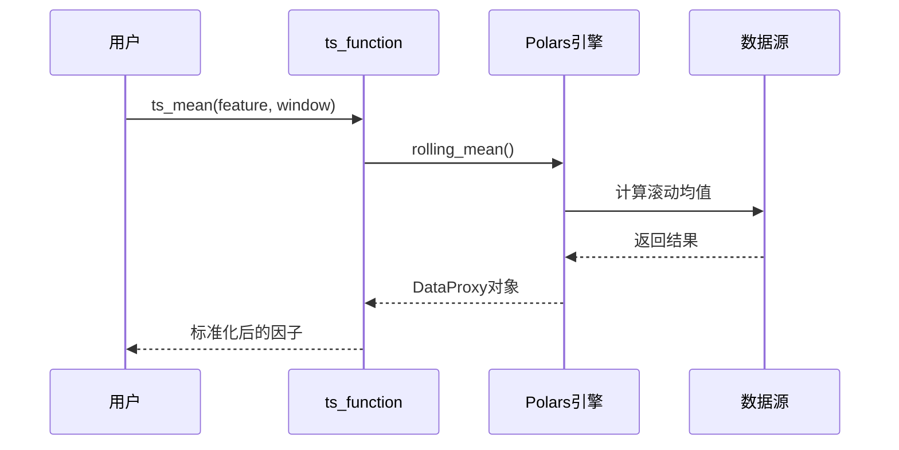
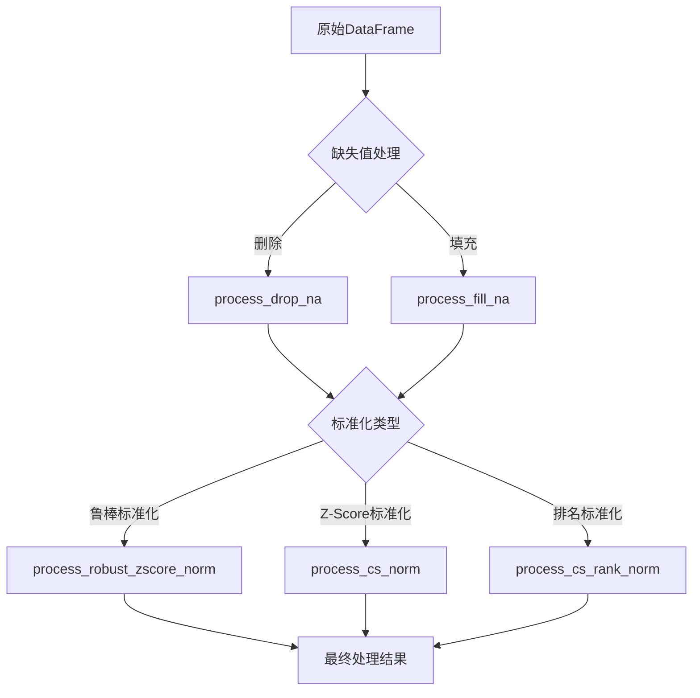
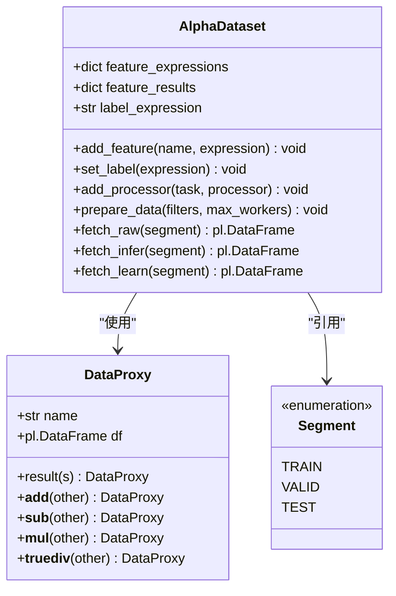
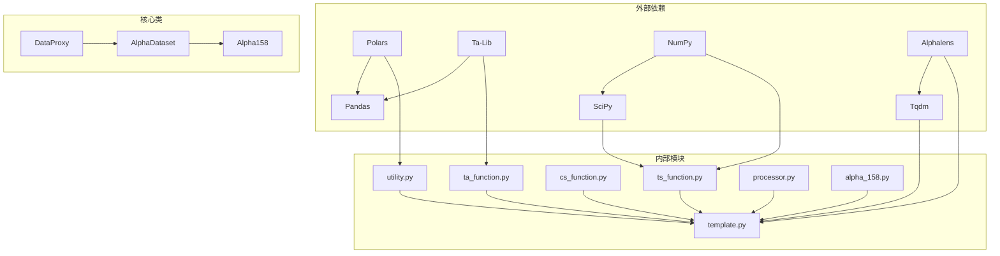

# 因子工程子系统

<cite>
**本文档引用的文件**
- [alpha_158.py](file://vnpy/alpha/dataset/datasets/alpha_158.py)
- [ta_function.py](file://vnpy/alpha/dataset/ta_function.py)
- [ts_function.py](file://vnpy/alpha/dataset/ts_function.py)
- [cs_function.py](file://vnpy/alpha/dataset/cs_function.py)
- [processor.py](file://vnpy/alpha/dataset/processor.py)
- [template.py](file://vnpy/alpha/dataset/template.py)
- [utility.py](file://vnpy/alpha/dataset/utility.py)
- [__init__.py](file://vnpy/alpha/dataset/__init__.py)
</cite>

## 目录
1. [简介](#简介)
2. [项目结构](#项目结构)
3. [核心组件](#核心组件)
4. [架构概览](#架构概览)
5. [详细组件分析](#详细组件分析)
6. [依赖关系分析](#依赖关系分析)
7. [性能考虑](#性能考虑)
8. [故障排除指南](#故障排除指南)
9. [结论](#结论)

## 简介

因子工程子系统是VeighNa量化交易平台的核心模块之一，专门用于构建、管理和优化量化投资中的因子工程。该系统提供了完整的因子开发框架，支持158个经典量价因子、技术指标计算、时序操作封装、横截面标准化以及数据预处理等功能。

系统采用模块化设计，通过Polars作为高性能数据处理引擎，支持表达式驱动的因子计算，具备强大的并行计算能力和灵活的数据预处理管道。用户可以通过继承模板类快速开发自定义因子集，并利用内置的性能分析工具进行因子评估。

## 项目结构

因子工程子系统位于`vnpy/alpha/dataset/`目录下，包含以下核心文件：



**图表来源**
- [template.py](file://vnpy/alpha/dataset/template.py#L1-L50)
- [alpha_158.py](file://vnpy/alpha/dataset/datasets/alpha_158.py#L1-L30)

**章节来源**
- [__init__.py](file://vnpy/alpha/dataset/__init__.py#L1-L20)

## 核心组件

### AlphaDataset模板类

AlphaDataset是整个因子工程系统的核心基类，提供了完整的因子开发框架：

```python
class AlphaDataset:
    """Alpha dataset template class"""
    
    def __init__(self, df: pl.DataFrame, train_period: tuple[str, str], 
                 valid_period: tuple[str, str], test_period: tuple[str, str]):
        self.df: pl.DataFrame = df
        self.feature_expressions: dict[str, str | pl.expr.expr.Expr] = {}
        self.feature_results: dict[str, pl.DataFrame] = {}
        self.label_expression: str = ""
```

### 数据代理类DataProxy

DataProxy类实现了链式调用和操作符重载，使因子表达式更加直观：

```python
class DataProxy:
    """Feature data proxy"""
    
    def __add__(self, other: Union["DataProxy", int, float]) -> "DataProxy":
        """Addition operation"""
        if isinstance(other, DataProxy):
            s: pl.Series = self.df["data"] + other.df["data"]
        else:
            s = self.df["data"] + other
        return self.result(s)
```

**章节来源**
- [template.py](file://vnpy/alpha/dataset/template.py#L25-L50)
- [utility.py](file://vnpy/alpha/dataset/utility.py#L8-L30)

## 架构概览

因子工程系统采用分层架构设计，从底层的数据处理到上层的因子应用：



**图表来源**
- [template.py](file://vnpy/alpha/dataset/template.py#L1-L100)
- [utility.py](file://vnpy/alpha/dataset/utility.py#L1-L50)

## 详细组件分析

### 158个经典量价因子实现

Alpha158类继承自AlphaDataset，实现了来自微软Qlib项目的158个经典因子：

#### 蜡烛图模式因子

```python
# 蜡烛图形态特征
self.add_feature("kmid", "(close - open) / open")
self.add_feature("klen", "(high - low) / open")
self.add_feature("kmid_2", "(close - open) / (high - low + 1e-12)")
self.add_feature("kup", "(high - ts_greater(open, close)) / open")
self.add_feature("klow", "(ts_less(open, close) - low) / open")
```

#### 价格变化特征

```python
# 价格比值特征
for field in ["open", "high", "low", "vwap"]:
    self.add_feature(f"{field}_0", f"{field} / close")
```

#### 时间序列特征

```python
# 多窗口时间序列统计
windows: list[int] = [5, 10, 20, 30, 60]
for w in windows:
    self.add_feature(f"ma_{w}", f"ts_mean(close, {w}) / close")
    self.add_feature(f"std_{w}", f"ts_std(close, {w}) / close")
    self.add_feature(f"beta_{w}", f"ts_slope(close, {w}) / close")
```

**章节来源**
- [alpha_158.py](file://vnpy/alpha/dataset/datasets/alpha_158.py#L15-L130)

### 技术指标类因子

ta_function.py提供了基于TA-Lib的技术指标计算：



**图表来源**
- [ta_function.py](file://vnpy/alpha/dataset/ta_function.py#L15-L42)

#### RSI指标计算

```python
def ta_rsi(close: DataProxy, window: int) -> DataProxy:
    """Calculate RSI indicator by contract"""
    close_: pd.Series = to_pd_series(close)
    result: pd.Series = talib.RSI(close_, timeperiod=window)
    df: pl.DataFrame = to_pl_dataframe(result)
    return DataProxy(df)
```

#### ATR指标计算

```python
def ta_atr(high: DataProxy, low: DataProxy, close: DataProxy, window: int) -> DataProxy:
    """Calculate ATR indicator by contract"""
    high_: pd.Series = to_pd_series(high)
    low_: pd.Series = to_pd_series(low)
    close_: pd.Series = to_pd_series(close)
    result: pd.Series = talib.ATR(high_, low_, close_, timeperiod=window)
    df: pl.DataFrame = to_pl_dataframe(result)
    return DataProxy(df)
```

**章节来源**
- [ta_function.py](file://vnpy/alpha/dataset/ta_function.py#L25-L42)

### 时序操作类因子

ts_function.py实现了丰富的时序操作符：



**图表来源**
- [ts_function.py](file://vnpy/alpha/dataset/ts_function.py#L15-L50)

#### 基础时序操作

```python
def ts_delay(feature: DataProxy, window: int) -> DataProxy:
    """Get the value from a fixed time in the past"""
    df: pl.DataFrame = feature.df.select(
        pl.col("datetime"),
        pl.col("vt_symbol"),
        pl.col("data").shift(window).over("vt_symbol")
    )
    return DataProxy(df)

def ts_mean(feature: DataProxy, window: int) -> DataProxy:
    """Calculate the mean over a rolling window"""
    df: pl.DataFrame = feature.df.select(
        pl.col("datetime"),
        pl.col("vt_symbol"),
        pl.col("data").cast(pl.Float32).rolling_map(lambda s: np.nanmean(s), window, min_samples=1).over("vt_symbol")
    )
    return DataProxy(df)
```

#### 高级时序统计

```python
def ts_slope(feature: DataProxy, window: int) -> DataProxy:
    """Calculate the slope of linear regression over a rolling window"""
    df: pl.DataFrame = feature.df.select(
        pl.col("datetime"),
        pl.col("vt_symbol"),
        pl.col("data").rolling_map(lambda s: np.polyfit(np.arange(len(s)), s, 1)[0], window).over("vt_symbol")
    )
    return DataProxy(df)

def ts_rsquare(feature: DataProxy, window: int) -> DataProxy:
    """Calculate the R-squared value of linear regression over a rolling window"""
    def rsquare(s: pl.Series) -> float:
        if s.std():
            return float(stats.linregress(np.arange(len(s)), s).rvalue ** 2)
        else:
            return float("nan")
    
    df: pl.DataFrame = feature.df.select(
        pl.col("datetime"),
        pl.col("vt_symbol"),
        pl.col("data").rolling_map(lambda s: rsquare(s), window).over("vt_symbol")
    )
    return DataProxy(df)
```

**章节来源**
- [ts_function.py](file://vnpy/alpha/dataset/ts_function.py#L10-L150)

### 横截面标准化实现

cs_function.py提供了跨股票维度的标准化操作：

```python
def cs_rank(feature: DataProxy) -> DataProxy:
    """Perform cross-sectional ranking"""
    df: pl.DataFrame = feature.df.select(
        pl.col("datetime"),
        pl.col("vt_symbol"),
        pl.col("data").rank().over("datetime")
    )
    return DataProxy(df)

def cs_mean(feature: DataProxy) -> DataProxy:
    """Calculate cross-sectional mean"""
    df: pl.DataFrame = feature.df.select(
        pl.col("datetime"),
        pl.col("vt_symbol"),
        pl.col("data").mean().over("datetime")
    )
    return DataProxy(df)
```

**章节来源**
- [cs_function.py](file://vnpy/alpha/dataset/cs_function.py#L8-L37)

### 数据预处理流程

processor.py实现了完整的数据预处理管道：



**图表来源**
- [processor.py](file://vnpy/alpha/dataset/processor.py#L1-L50)

#### 缺失值处理

```python
def process_drop_na(df: pl.DataFrame, names: list[str] | None = None) -> pl.DataFrame:
    """Remove rows with missing values"""
    if names is None:
        names = df.columns[2:-1]
    
    for name in names:
        df = df.with_columns(
            pl.col(name).fill_nan(None)
        )
    df = df.drop_nulls(subset=names)
    return df

def process_fill_na(df: pl.DataFrame, fill_value: float, fill_label: bool = True) -> pl.DataFrame:
    """Fill missing values"""
    if fill_label:
        df = df.fill_null(fill_value)
        df = df.fill_nan(fill_value)
    else:
        df = df.with_columns([
            pl.col(col).fill_null(fill_value).fill_nan(fill_value) 
            for col in df.columns[2:-1]
        ])
    return df
```

#### 横截面标准化

```python
def process_cs_norm(df: pl.DataFrame, names: list[str], method: str) -> pl.DataFrame:
    """Cross-sectional normalization"""
    _df: pl.DataFrame = df.fill_nan(None)
    
    # 鲁棒标准化方法
    if method == "robust":
        for col in names:
            df = df.with_columns(
                _df.select(
                    (pl.col(col) - pl.col(col).median()).over("datetime").alias(col),
                )
            )
            
            df = df.with_columns(
                df.select(
                    pl.col(col).abs().median().over("datetime").alias("mad"),
                )
            )
            
            df = df.with_columns(
                (pl.col(col) / pl.col("mad") / 1.4826).clip(-3, 3).alias(col)
            ).drop(["mad"])
    
    return df
```

**章节来源**
- [processor.py](file://vnpy/alpha/dataset/processor.py#L8-L125)

### 自定义因子开发模板

template.py提供了完整的自定义因子开发框架：



**图表来源**
- [template.py](file://vnpy/alpha/dataset/template.py#L25-L100)
- [utility.py](file://vnpy/alpha/dataset/utility.py#L170-L183)

#### 表达式计算机制

```python
def calculate_by_expression(df: pl.DataFrame, expression: str) -> pl.DataFrame:
    """Execute calculation based on expression"""
    # 导入操作符到本地空间
    from .ts_function import (
        ts_delay, ts_min, ts_max,
        ts_rank, ts_mean, ts_std,
        ts_slope, ts_quantile,
        ts_rsquare, ts_resi,
        ts_corr, ts_less, ts_greater,
        ts_log, ts_abs
    )
    from .cs_function import (
        cs_rank, cs_mean, cs_std
    )
    from .ta_function import (
        ta_rsi, ta_atr
    )
    
    # 提取特征对象到本地空间
    d: dict = locals()
    
    for column in df.columns:
        if column in {"datetime", "vt_symbol"}:
            continue
        
        column_df = df[["datetime", "vt_symbol", column]]
        d[column] = DataProxy(column_df)
    
    # 使用eval执行计算
    other: DataProxy = eval(expression, {}, d)
    return other.df
```

**章节来源**
- [template.py](file://vnpy/alpha/dataset/template.py#L1-L280)
- [utility.py](file://vnpy/alpha/dataset/utility.py#L80-L120)

## 依赖关系分析

因子工程系统的依赖关系呈现清晰的层次结构：



**图表来源**
- [utility.py](file://vnpy/alpha/dataset/utility.py#L1-L10)
- [template.py](file://vnpy/alpha/dataset/template.py#L1-L20)

**章节来源**
- [utility.py](file://vnpy/alpha/dataset/utility.py#L1-L183)
- [template.py](file://vnpy/alpha/dataset/template.py#L1-L50)

## 性能考虑

### 并行计算优化

系统采用多进程并行计算来提升因子计算效率：

```python
def prepare_data(self, filters: dict | None = None, max_workers: int | None = None) -> None:
    """Generate required data"""
    # 创建进程池
    context: BaseContext = get_context("spawn")
    
    with context.Pool(processes=max_workers) as pool:
        # 并行计算所有表达式
        it = pool.imap(calculate_feature, args)
        
        # 收集结果
        for result in tqdm(it, total=len(args)):
            results.append(result)
```

### 内存管理策略

1. **流式处理**: 使用Polars的lazy evaluation避免大量中间结果
2. **数据类型优化**: 强制转换为Float32减少内存占用
3. **及时释放**: 在不需要时删除临时变量

### 性能监控

```python
def calculate_feature(args: tuple[pl.DataFrame, str, str | pl.expr.expr.Expr]) -> pl.Series:
    """Calculate feature by expression"""
    start = time.time()
    
    df, name, expression = args
    
    if isinstance(expression, pl.expr.expr.Expr):
        result = calculate_by_polars(df, expression)["data"].alias(name)
    else:
        result = calculate_by_expression(df, expression)["data"].alias(name)
    
    end = time.time()
    print(f"Feature calculation {name} took: {end - start} seconds")
    
    return result
```

## 故障排除指南

### 常见问题及解决方案

#### 1. 表达式计算错误

**问题**: 因子表达式语法错误或变量未定义
**解决方案**: 
- 检查表达式语法是否符合Polars规则
- 确保所有使用的变量在数据框中存在
- 使用调试模式查看中间计算结果

#### 2. 内存不足

**问题**: 大规模数据处理时内存溢出
**解决方案**:
- 减少并行进程数
- 使用chunked处理大数据集
- 启用内存压缩选项

#### 3. 性能瓶颈

**问题**: 因子计算速度过慢
**解决方案**:
- 优化表达式复杂度
- 使用更高效的操作符组合
- 启用缓存机制

**章节来源**
- [template.py](file://vnpy/alpha/dataset/template.py#L250-L280)

## 结论

因子工程子系统是一个功能完整、设计精良的量化因子开发平台。它通过模块化的架构设计、高效的并行计算能力和灵活的表达式系统，为量化研究人员提供了强大的工具支持。

### 主要优势

1. **完整的因子生态系统**: 从158个经典因子到自定义因子开发的全链条支持
2. **高性能计算**: 基于Polars的向量化计算和多进程并行处理
3. **灵活的扩展性**: 清晰的模板设计便于用户扩展和定制
4. **完善的预处理**: 全套数据清洗和标准化工具
5. **可视化分析**: 内置的因子性能分析和回测功能

### 应用场景

- 量化研究员的因子开发和测试
- 机构投资者的风险模型构建
- 学术研究的因子分析工具
- 交易策略的因子挖掘和优化

该系统为量化投资领域提供了一个可靠、高效的因子工程解决方案，显著提升了因子开发的效率和质量。