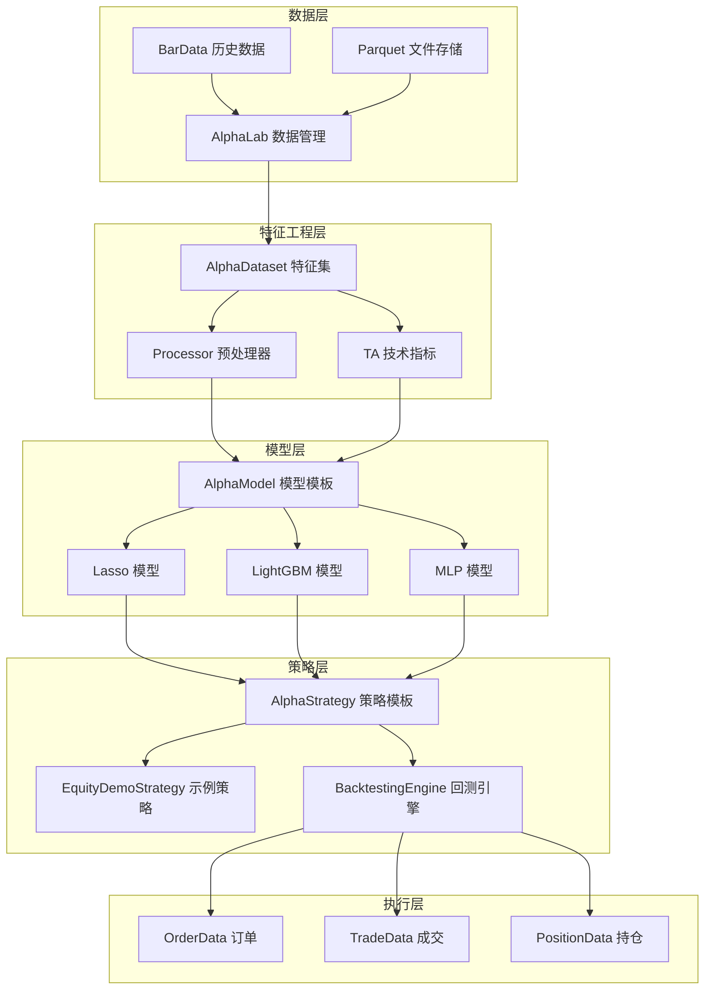
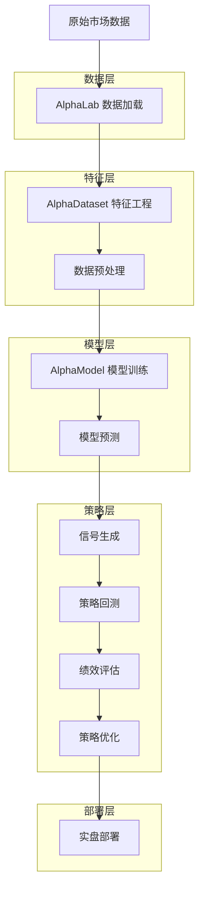
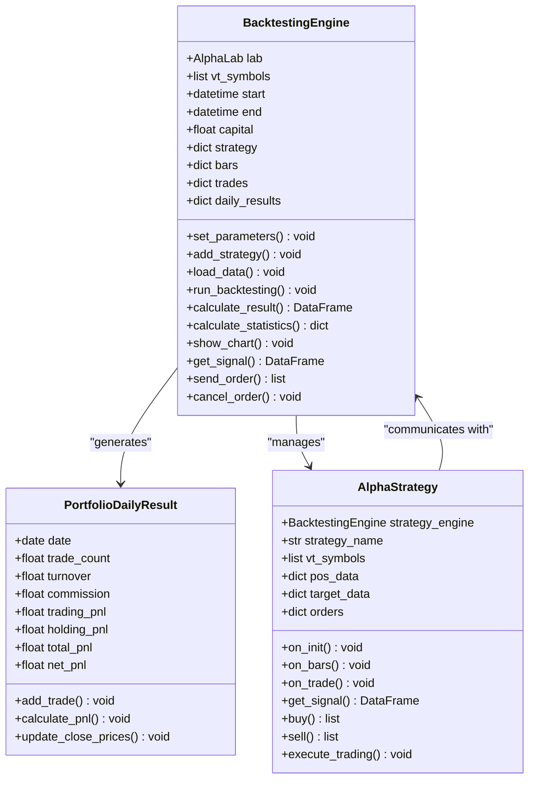
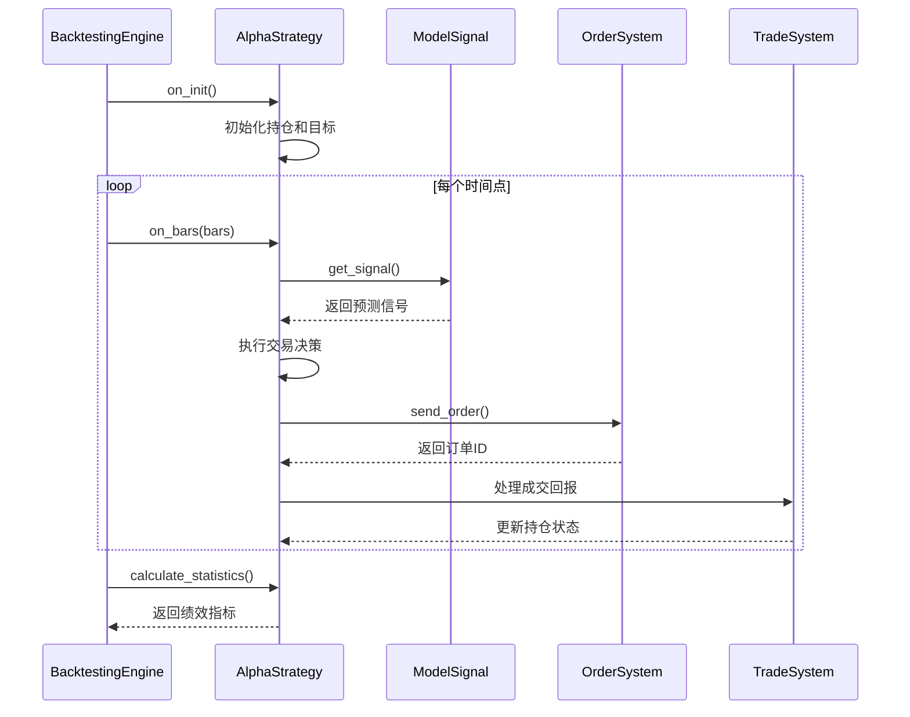
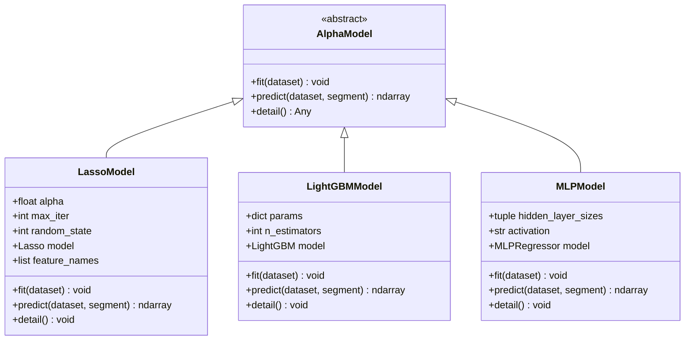
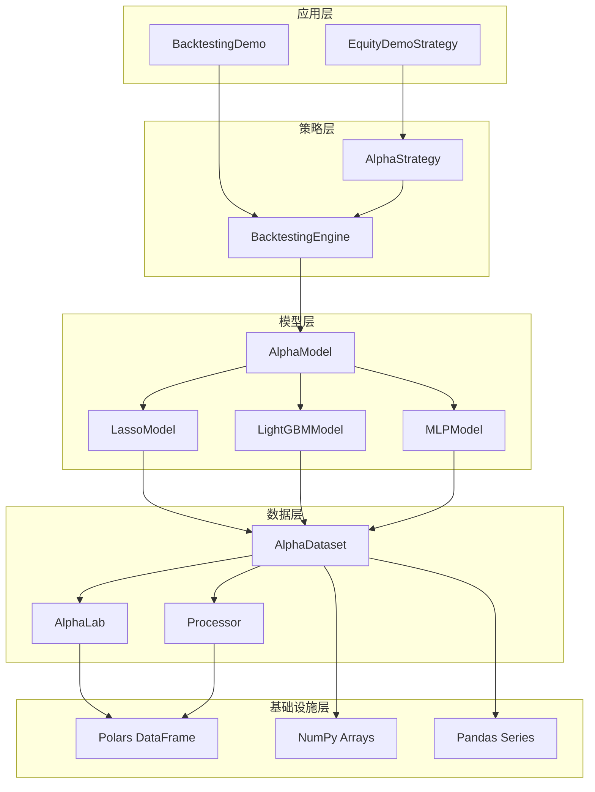

# 基于AI预测模型的量化策略开发流程

<cite>
**本文档引用的文件**
- [examples/cta_backtesting/backtesting_demo.ipynb](file://examples/cta_backtesting/backtesting_demo.ipynb)
- [vnpy/alpha/lab.py](file://vnpy/alpha/lab.py)
- [vnpy/alpha/dataset/template.py](file://vnpy/alpha/dataset/template.py)
- [vnpy/alpha/model/template.py](file://vnpy/alpha/model/template.py)
- [vnpy/alpha/strategy/backtesting.py](file://vnpy/alpha/strategy/backtesting.py)
- [vnpy/alpha/strategy/template.py](file://vnpy/alpha/strategy/template.py)
- [vnpy/alpha/model/models/lasso_model.py](file://vnpy/alpha/model/models/lasso_model.py)
- [vnpy/alpha/dataset/processor.py](file://vnpy/alpha/dataset/processor.py)
</cite>

## 目录
1. [概述](#概述)
2. [项目结构](#项目结构)
3. [核心组件](#核心组件)
4. [架构概览](#架构概览)
5. [详细组件分析](#详细组件分析)
6. [依赖关系分析](#依赖关系分析)
7. [性能考虑](#性能考虑)
8. [故障排除指南](#故障排除指南)
9. [结论](#结论)

## 概述

本文档全面阐述基于AI预测模型的量化策略开发流程，以vnpy框架中的`equity_demo_strategy.py`为例，详细解析如何将机器学习模型的预测结果转化为交易信号，包括信号组合、仓位管理和风险控制逻辑。同时深入介绍`backtesting.py`实现的回测引擎功能，涵盖收益率计算、最大回撤、夏普比率等绩效指标评估体系，并结合`lab.py`展示完整的投研实验工作流：从数据加载、因子计算、模型训练到策略回测的一站式操作。

## 项目结构

vnpy项目采用模块化设计，将量化策略开发的各个环节分离为独立的功能模块：



**图表来源**
- [vnpy/alpha/lab.py](file://vnpy/alpha/lab.py#L1-L50)
- [vnpy/alpha/dataset/template.py](file://vnpy/alpha/dataset/template.py#L1-L30)
- [vnpy/alpha/model/template.py](file://vnpy/alpha/model/template.py#L1-L31)

## 核心组件

### AlphaLab 数据实验室

`AlphaLab`是整个策略开发流程的核心数据管理组件，负责统一的数据存储、加载和管理：

```python
class AlphaLab:
    """Alpha Research Laboratory"""
    
    def __init__(self, lab_path: str) -> None:
        # 设置数据路径
        self.daily_path: Path = self.lab_path.joinpath("daily")
        self.minute_path: Path = self.lab_path.joinpath("minute")
        self.dataset_path: Path = self.lab_path.joinpath("dataset")
        self.model_path: Path = self.lab_path.joinpath("model")
        self.signal_path: Path = self.lab_path.joinpath("signal")
```

主要功能包括：
- **数据持久化**：支持分钟级和日线级K线数据的Parquet格式存储
- **批量数据处理**：高效的多进程并行数据计算
- **数据验证**：自动检测和处理缺失值、异常值
- **版本管理**：支持数据集和模型的版本控制

**章节来源**
- [vnpy/alpha/lab.py](file://vnpy/alpha/lab.py#L1-L200)

### AlphaDataset 特征工程

`AlphaDataset`提供了完整的特征工程框架，支持复杂的因子计算和预处理：

```python
class AlphaDataset:
    """Alpha dataset template class"""
    
    def __init__(self, df: pl.DataFrame, train_period: tuple, valid_period: tuple, test_period: tuple):
        self.feature_expressions: dict[str, str | pl.expr.Expr] = {}
        self.feature_results: dict[str, pl.DataFrame] = {}
        self.label_expression: str = ""
```

核心特性：
- **表达式驱动**：支持Polars表达式和Python函数两种特征计算方式
- **并行计算**：利用多进程池进行大规模特征计算
- **时间序列处理**：内置时间窗口、滞后、变化率等技术指标
- **跨市场标准化**：支持行业、市值等维度的标准化处理

**章节来源**
- [vnpy/alpha/dataset/template.py](file://vnpy/alpha/dataset/template.py#L1-L280)

## 架构概览

整个策略开发流程遵循经典的机器学习管道模式，从原始数据到最终策略部署：



**图表来源**
- [vnpy/alpha/lab.py](file://vnpy/alpha/lab.py#L50-L100)
- [vnpy/alpha/dataset/template.py](file://vnpy/alpha/dataset/template.py#L50-L150)
- [vnpy/alpha/model/template.py](file://vnpy/alpha/model/template.py#L1-L31)

## 详细组件分析

### 回测引擎 BacktestingEngine

`BacktestingEngine`是策略回测的核心组件，提供了完整的回测环境和绩效评估功能：



**图表来源**
- [vnpy/alpha/strategy/backtesting.py](file://vnpy/alpha/strategy/backtesting.py#L1-L100)
- [vnpy/alpha/strategy/template.py](file://vnpy/alpha/strategy/template.py#L1-L50)

#### 关键功能模块

**1. 参数设置与初始化**
```python
def set_parameters(
    self,
    vt_symbols: list[str],
    interval: Interval,
    start: datetime,
    end: datetime,
    capital: int = 1_000_000,
    risk_free: float = 0,
    annual_days: int = 240
) -> None:
    """设置回测参数"""
```

**2. 信号获取与订单执行**
```python
def get_signal(self) -> pl.DataFrame:
    """获取当前时刻的模型预测信号"""
    if not self.datetime:
        return pl.DataFrame()
    
    dt: datetime = self.datetime.replace(tzinfo=None)
    signal: pl.DataFrame = self.signal_df.filter(pl.col("datetime") == dt)
    return signal

def send_order(
    self,
    strategy: AlphaStrategy,
    vt_symbol: str,
    direction: Direction,
    offset: Offset,
    price: float,
    volume: float,
) -> list[str]:
    """发送订单"""
```

**3. 绩效指标计算**
回测引擎自动计算多种关键绩效指标：

```python
# 收益率相关指标
total_return = (end_balance / self.capital - 1) * 100
annual_return = total_return / total_days * self.annual_days
daily_return = df["return"].mean() * 100
return_std = df["return"].std() * 100

# 风险调整指标
sharpe_ratio = (daily_return - daily_risk_free) / return_std * np.sqrt(self.annual_days)
return_drawdown_ratio = -total_net_pnl / max_drawdown
```

**章节来源**
- [vnpy/alpha/strategy/backtesting.py](file://vnpy/alpha/strategy/backtesting.py#L50-L200)

### AlphaStrategy 策略模板

`AlphaStrategy`定义了策略开发的标准接口和通用功能：



**图表来源**
- [vnpy/alpha/strategy/template.py](file://vnpy/alpha/strategy/template.py#L50-L150)

#### 核心交易功能

**1. 仓位管理**
```python
def execute_trading(self, bars: dict[str, BarData], price_add: float) -> None:
    """根据目标仓位执行交易调整"""
    self.cancel_all()
    
    for vt_symbol, bar in bars.items():
        target: float = self.get_target(vt_symbol)
        pos: float = self.get_pos(vt_symbol)
        diff: float = target - pos
        
        # 多头仓位调整
        if diff > 0:
            order_price = bar.close_price * (1 + price_add)
            # 计算平空和开多的仓位
            cover_volume = min(diff, abs(pos)) if pos < 0 else 0
            buy_volume = diff - cover_volume
            
            if cover_volume:
                self.cover(vt_symbol, order_price, cover_volume)
            if buy_volume:
                self.buy(vt_symbol, order_price, buy_volume)
        
        # 空头仓位调整
        elif diff < 0:
            order_price = bar.close_price * (1 - price_add)
            # 计算平多和开空的仓位
            sell_volume = min(abs(diff), pos) if pos > 0 else 0
            short_volume = abs(diff) - sell_volume
            
            if sell_volume:
                self.sell(vt_symbol, order_price, sell_volume)
            if short_volume:
                self.short(vt_symbol, order_price, short_volume)
```

**2. 风险控制**
```python
def get_portfolio_value(self) -> float:
    """获取总资产价值"""
    return self.get_cash_available() + self.get_holding_value()

def get_cash_available(self) -> float:
    """获取可用现金"""
    return self.strategy_engine.get_cash_available()
```

**章节来源**
- [vnpy/alpha/strategy/template.py](file://vnpy/alpha/strategy/template.py#L100-L206)

### AlphaModel 模型模板

`AlphaModel`定义了机器学习模型的标准接口：



**图表来源**
- [vnpy/alpha/model/template.py](file://vnpy/alpha/model/template.py#L1-L31)
- [vnpy/alpha/model/models/lasso_model.py](file://vnpy/alpha/model/models/lasso_model.py#L1-L50)

#### Lasso模型实现示例

```python
class LassoModel(AlphaModel):
    """LASSO回归算法"""
    
    def fit(self, dataset: AlphaDataset) -> None:
        """使用数据集拟合模型"""
        # 获取训练数据
        df_train: pl.DataFrame = dataset.fetch_learn(Segment.TRAIN)
        df_valid: pl.DataFrame = dataset.fetch_learn(Segment.VALID)
        
        # 合并数据，去重排序
        df_train = pl.concat([df_train, df_valid])
        df_train = df_train.unique(subset=["datetime", "vt_symbol"])
        df_train = df_train.sort(["datetime", "vt_symbol"])
        
        # 提取特征名称
        self.feature_names = df_train.columns[2:-1]
        
        # 转换为numpy数组
        X: np.ndarray = df_train.select(self.feature_names).to_numpy()
        y: np.ndarray = np.array(df_train["label"])
        
        # 创建并训练模型
        self.model = Lasso(alpha=self.alpha, max_iter=self.max_iter)
        self.model.fit(X, y)
    
    def predict(self, dataset: AlphaDataset, segment: Segment) -> np.ndarray:
        """使用模型进行预测"""
        if self.model is None:
            raise ValueError("model is not fitted yet!")
        
        # 获取预测数据
        df: pl.DataFrame = dataset.fetch_infer(segment)
        df = df.sort(["datetime", "vt_symbol"])
        
        # 转换为numpy数组
        data: np.ndarray = df.select(df.columns[2: -1]).to_numpy()
        
        # 返回预测结果
        result: np.ndarray = self.model.predict(data)
        return result
```

**章节来源**
- [vnpy/alpha/model/models/lasso_model.py](file://vnpy/alpha/model/models/lasso_model.py#L1-L140)

### 数据预处理与特征工程

`processor.py`提供了丰富的数据预处理功能：

```python
def process_cs_norm(
    df: pl.DataFrame,
    names: list[str],
    method: str  # robust/zscore
) -> pl.DataFrame:
    """横截面标准化"""
    _df: pl.DataFrame = df.fill_nan(None)
    
    # 中位数方法
    if method == "robust":
        for col in names:
            df = df.with_columns(
                _df.select(
                    (pl.col(col) - pl.col(col).median()).over("datetime").alias(col),
                )
            )
            
            df = df.with_columns(
                df.select(
                    pl.col(col).abs().median().over("datetime").alias("mad"),
                )
            )
            
            df = df.with_columns(
                (pl.col(col) / pl.col("mad") / 1.4826).clip(-3, 3).alias(col)
            ).drop(["mad"])
    # Z-Score方法
    else:
        for col in names:
            df = df.with_columns(
                _df.select(
                    pl.col(col).mean().over("datetime").alias("mean"),
                    pl.col(col).std().over("datetime").alias("std"),
                )
            )
            
            df = df.with_columns(
                (pl.col(col) - pl.col("mean")) / pl.col("std").alias(col)
            ).drop(["mean", "std"])
    
    return df
```

**章节来源**
- [vnpy/alpha/dataset/processor.py](file://vnpy/alpha/dataset/processor.py#L1-L126)

## 依赖关系分析

整个策略开发框架具有清晰的层次结构和明确的依赖关系：



**图表来源**
- [vnpy/alpha/strategy/backtesting.py](file://vnpy/alpha/strategy/backtesting.py#L1-L50)
- [vnpy/alpha/dataset/template.py](file://vnpy/alpha/dataset/template.py#L1-L50)

**章节来源**
- [vnpy/alpha/lab.py](file://vnpy/alpha/lab.py#L1-L100)
- [vnpy/alpha/dataset/template.py](file://vnpy/alpha/dataset/template.py#L1-L100)

## 性能考虑

### 并行计算优化

1. **多进程特征计算**：`AlphaDataset`使用`multiprocessing.Pool`进行并行特征计算
2. **内存管理**：采用Polars DataFrame进行高效的数据处理
3. **缓存机制**：回测结果和中间计算结果的智能缓存

### 回测效率

1. **增量更新**：每日损益计算采用增量方式
2. **向量化操作**：大量使用向量化操作减少循环开销
3. **批处理**：订单匹配和成交处理采用批处理模式

## 故障排除指南

### 常见问题及解决方案

**1. 内存不足**
- 问题：大规模数据回测时内存溢出
- 解决：分批加载数据，使用更小的时间粒度

**2. 计算超时**
- 问题：特征计算耗时过长
- 解决：启用并行计算，优化特征表达式

**3. 数据不一致**
- 问题：回测结果与实盘不符
- 解决：检查数据加载和信号生成流程

**章节来源**
- [vnpy/alpha/strategy/backtesting.py](file://vnpy/alpha/strategy/backtesting.py#L700-L800)

## 结论

本文档全面介绍了基于AI预测模型的量化策略开发流程，展示了vnpy框架在策略开发各个阶段的强大功能。通过`AlphaLab`、`AlphaDataset`、`AlphaModel`和`AlphaStrategy`等核心组件的协同工作，开发者可以构建从数据处理到策略回测的完整pipeline。

关键优势包括：
- **模块化设计**：各组件职责清晰，易于扩展和维护
- **高性能计算**：充分利用现代硬件和并行计算能力
- **完整回测**：提供全面的绩效评估和可视化功能
- **灵活配置**：支持多种机器学习模型和特征工程方法

这种架构不仅适用于学术研究，也具备实盘部署的能力，为量化投资提供了坚实的技术基础。