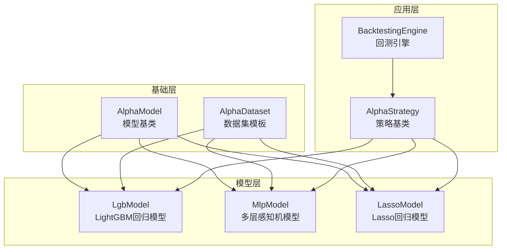
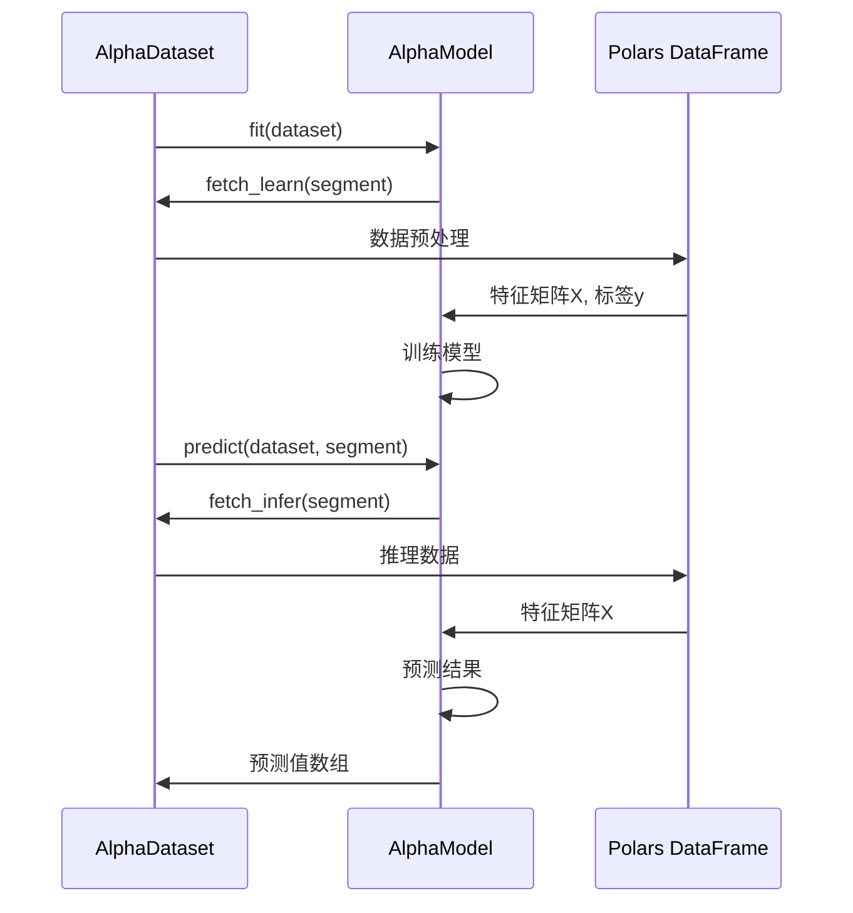
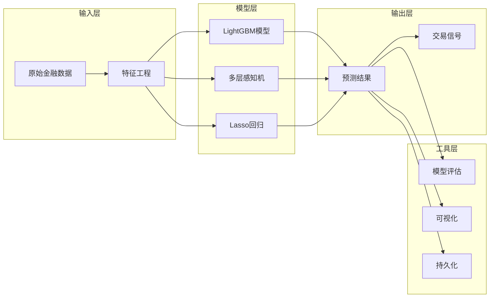
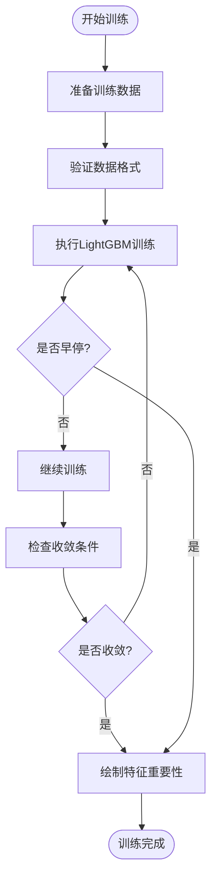
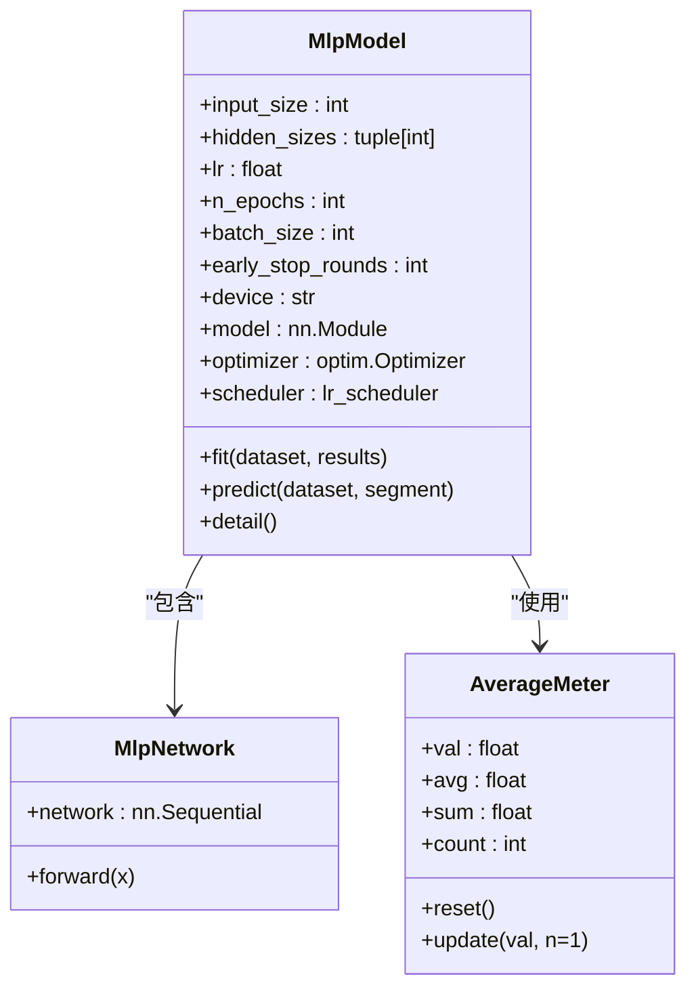
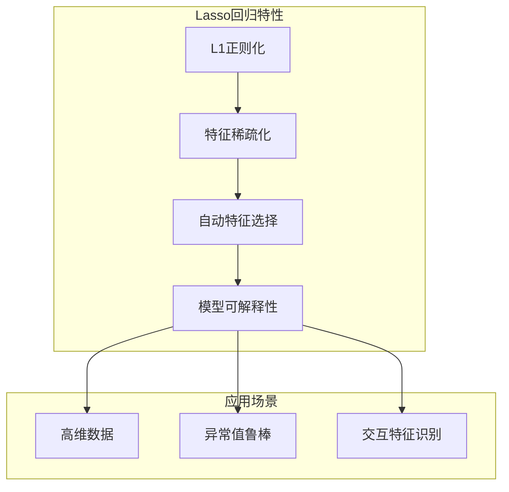
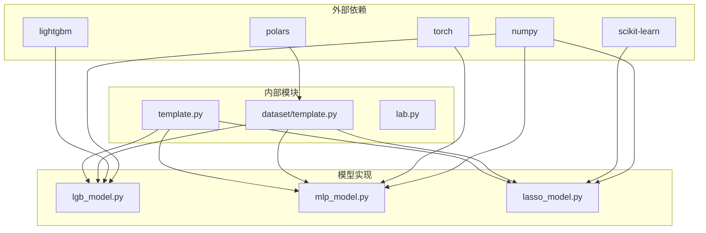

# 预测模型模块

<cite>
**本文档引用的文件**
- [template.py](file://vnpy/alpha/model/template.py)
- [lgb_model.py](file://vnpy/alpha/model/models/lgb_model.py)
- [mlp_model.py](file://vnpy/alpha/model/models/mlp_model.py)
- [lasso_model.py](file://vnpy/alpha/model/models/lasso_model.py)
- [template.py](file://vnpy/alpha/dataset/template.py)
- [backtesting.py](file://vnpy/alpha/strategy/backtesting.py)
- [equity_demo_strategy.py](file://vnpy/alpha/strategy/strategies/equity_demo_strategy.py)
</cite>

## 目录
1. [简介](#简介)
2. [项目结构](#项目结构)
3. [核心组件](#核心组件)
4. [架构概览](#架构概览)
5. [详细组件分析](#详细组件分析)
6. [依赖关系分析](#依赖关系分析)
7. [性能考虑](#性能考虑)
8. [故障排除指南](#故障排除指南)
9. [结论](#结论)

## 简介

预测模型模块是VeighNa AI量化框架的核心组件之一，专门用于Alpha因子预测和机器学习模型的构建。该模块提供了三种主要的机器学习模型实现：基于LightGBM的梯度提升模型、基于多层感知机的深度学习模型以及基于Lasso回归的线性模型。这些模型为量化投资策略提供了强大的预测能力，支持A股市场的复杂金融数据处理。

模块设计遵循面向对象的原则，通过统一的接口规范确保不同模型之间的互操作性和一致性。每个模型都继承自抽象基类AlphaModel，实现了标准化的训练、预测、保存和加载功能。

## 项目结构

预测模型模块采用分层架构设计，将模型实现、数据处理和策略应用分离：



**图表来源**
- [template.py](file://vnpy/alpha/model/template.py#L1-L31)
- [lgb_model.py](file://vnpy/alpha/model/models/lgb_model.py#L1-L171)
- [mlp_model.py](file://vnpy/alpha/model/models/mlp_model.py#L1-L684)
- [lasso_model.py](file://vnpy/alpha/model/models/lasso_model.py#L1-L140)

**章节来源**
- [template.py](file://vnpy/alpha/model/template.py#L1-L31)
- [lgb_model.py](file://vnpy/alpha/model/models/lgb_model.py#L1-L171)
- [mlp_model.py](file://vnpy/alpha/model/models/mlp_model.py#L1-L684)
- [lasso_model.py](file://vnpy/alpha/model/models/lasso_model.py#L1-L140)

## 核心组件

### AlphaModel基类

AlphaModel是所有预测模型的抽象基类，定义了统一的接口规范：

```python
class AlphaModel(metaclass=ABCMeta):
    """机器学习算法模板类"""

    @abstractmethod
    def fit(self, dataset: AlphaDataset) -> None:
        """使用数据集拟合模型"""
        pass

    @abstractmethod
    def predict(self, dataset: AlphaDataset, segment: Segment) -> np.ndarray:
        """使用模型进行预测"""
        pass

    def detail(self) -> Any:
        """输出模型的详细信息"""
        return
```

该基类确保所有具体模型实现都具备以下核心功能：
- **训练接口**：`fit()`方法负责模型训练和参数估计
- **预测接口**：`predict()`方法提供模型预测能力
- **详情展示**：`detail()`方法支持模型诊断和特征重要性分析

### 数据集适配器

模型模块与AlphaDataset紧密集成，确保数据预处理和特征工程的一致性：



**图表来源**
- [template.py](file://vnpy/alpha/dataset/template.py#L1-L280)
- [lgb_model.py](file://vnpy/alpha/model/models/lgb_model.py#L40-L171)

**章节来源**
- [template.py](file://vnpy/alpha/model/template.py#L1-L31)
- [template.py](file://vnpy/alpha/dataset/template.py#L1-L280)

## 架构概览

预测模型模块采用插件化架构，支持多种机器学习算法的无缝集成：



**图表来源**
- [lgb_model.py](file://vnpy/alpha/model/models/lgb_model.py#L1-L171)
- [mlp_model.py](file://vnpy/alpha/model/models/mlp_model.py#L1-L684)
- [lasso_model.py](file://vnpy/alpha/model/models/lasso_model.py#L1-L140)

## 详细组件分析

### LgbModel - LightGBM回归模型

LgbModel是基于LightGBM库的梯度提升决策树模型，专为大规模金融数据设计：

#### 核心特性

```python
class LgbModel(AlphaModel):
    def __init__(
        self,
        learning_rate: float = 0.1,
        num_leaves: int = 31,
        num_boost_round: int = 1000,
        early_stopping_rounds: int = 50,
        log_evaluation_period: int = 1,
        seed: int | None = None
    ):
```

#### 关键参数配置

- **学习率** (`learning_rate`): 控制每棵树的贡献程度，默认0.1
- **叶子节点数** (`num_leaves`): 决定树的复杂度，默认31
- **训练轮数** (`num_boost_round`): 最大训练迭代次数，默认1000
- **早停机制** (`early_stopping_rounds`): 防止过拟合，默认50轮
- **日志频率** (`log_evaluation_period`): 训练日志输出间隔，默认1轮

#### 训练流程



**图表来源**
- [lgb_model.py](file://vnpy/alpha/model/models/lgb_model.py#L40-L171)

#### 特征重要性分析

LgbModel内置特征重要性分析功能，支持两种重要性度量：

```python
def detail(self) -> None:
    """显示模型特征重要性"""
    if not self.model:
        return
    
    for importance_type in ["split", "gain"]:
        ax = lgb.plot_importance(
            self.model,
            max_num_features=50,
            importance_type=importance_type,
            figsize=(10, 20)
        )
        ax.set_title(f"Feature Importance ({importance_type})")
```

**章节来源**
- [lgb_model.py](file://vnpy/alpha/model/models/lgb_model.py#L1-L171)

### MlpModel - 多层感知机模型

MlpModel实现了深度神经网络架构，支持复杂的非线性关系建模：

#### 网络架构设计

```python
class MlpModel(AlphaModel):
    def __init__(
        self,
        input_size: int,
        hidden_sizes: tuple[int] = (256,),
        lr: float = 0.001,
        n_epochs: int = 300,
        batch_size: int = 2000,
        early_stop_rounds: int = 50,
        eval_steps: int = 20,
        optimizer: Literal["sgd", "adam"] = "adam",
        weight_decay: float = 0.0,
        device: str = "cpu",
        seed: int | None = None
    ):
```

#### 核心组件



**图表来源**
- [mlp_model.py](file://vnpy/alpha/model/models/mlp_model.py#L21-L199)
- [mlp_model.py](file://vnpy/alpha/model/models/mlp_model.py#L1-L684)

#### 训练策略

MlpModel采用先进的训练策略确保模型性能：

1. **学习率调度**：使用ReduceLROnPlateau动态调整学习率
2. **早停机制**：防止过拟合，提高泛化能力
3. **批量归一化**：加速收敛，稳定训练过程
4. **Dropout正则化**：减少过拟合风险

#### GPU加速支持

```python
# 移动模型到指定设备
self.model = self.model.to(device)

# 设置优化器
if optimizer_name == "adam":
    self.optimizer = optim.Adam(
        self.model.parameters(),
        lr=lr,
        weight_decay=weight_decay
    )
elif optimizer_name == "sgd":
    self.optimizer = optim.SGD(
        self.model.parameters(),
        lr=lr,
        weight_decay=weight_decay
    )
```

**章节来源**
- [mlp_model.py](file://vnpy/alpha/model/models/mlp_model.py#L1-L684)

### LassoModel - Lasso回归模型

LassoModel基于L1正则化的线性回归，具有自动特征选择能力：

#### 模型特性

```python
class LassoModel(AlphaModel):
    def __init__(
        self,
        alpha: float = 0.0005,
        max_iter: int = 1000,
        random_state: int | None = None,
    ):
```

#### 正则化优势

Lasso回归的核心优势在于其L1正则化特性：



**图表来源**
- [lasso_model.py](file://vnpy/alpha/model/models/lasso_model.py#L1-L140)

#### 特征重要性分析

LassoModel提供直观的特征重要性展示：

```python
def detail(self) -> None:
    """输出模型详细信息"""
    coef = self.model.coef_
    data = list(zip(self.feature_names, coef, strict=False))
    data = [x for x in data if x[1]]
    data.sort(key=lambda x: abs(x[1]), reverse=True)
    data = [x for x in data if round(x[1], 6) != 0]
    
    logger.info(f"LASSO模型特征总数: {len(data)}")
    for name, importance in data:
        logger.info(f"{name}: {importance:.6f}")
```

**章节来源**
- [lasso_model.py](file://vnpy/alpha/model/models/lasso_model.py#L1-L140)

## 依赖关系分析

预测模型模块的依赖关系体现了清晰的分层架构：



**图表来源**
- [lgb_model.py](file://vnpy/alpha/model/models/lgb_model.py#L1-L10)
- [mlp_model.py](file://vnpy/alpha/model/models/mlp_model.py#L1-L20)
- [lasso_model.py](file://vnpy/alpha/model/models/lasso_model.py#L1-L10)

**章节来源**
- [lgb_model.py](file://vnpy/alpha/model/models/lgb_model.py#L1-L171)
- [mlp_model.py](file://vnpy/alpha/model/models/mlp_model.py#L1-L684)
- [lasso_model.py](file://vnpy/alpha/model/models/lasso_model.py#L1-L140)

## 性能考虑

### 计算效率优化

1. **LightGBM优化**：
   - 使用GPU加速训练
   - 启用直方图算法减少内存占用
   - 支持并行特征选择

2. **神经网络优化**：
   - GPU加速推理和训练
   - 批量处理提高吞吐量
   - 混合精度训练节省显存

3. **数据处理优化**：
   - Polars框架提供高性能数据处理
   - 内存映射减少I/O开销
   - 缓存常用计算结果

### 内存管理

```python
# MLP模型的内存优化策略
class MlpModel(AlphaModel):
    def __init__(self, batch_size: int = 2000, ...):
        self.batch_size = batch_size  # 控制内存使用
        
    def fit(self, dataset: AlphaDataset, ...):
        # 分批处理避免内存溢出
        for step in range(1, self.n_epochs + 1):
            # 批量训练逻辑
            pass
```

### 并行计算支持

- **多核CPU训练**：LightGBM和Scikit-learn支持并行计算
- **分布式训练**：LightGBM支持分布式模式
- **异步推理**：支持批量异步预测

## 故障排除指南

### 常见问题及解决方案

#### 1. 内存不足错误

**症状**：训练过程中出现OOM（Out of Memory）错误

**解决方案**：
```python
# 减少批次大小
model = MlpModel(batch_size=1000)  # 从2000减少到1000

# 使用CPU而非GPU
model = MlpModel(device="cpu")

# 减少隐藏层维度
model = MlpModel(hidden_sizes=(128, 64))  # 从(256,)减少到(128, 64)
```

#### 2. 训练不收敛

**症状**：模型损失不下降或震荡

**解决方案**：
```python
# 调整学习率
model = MlpModel(lr=0.0001)  # 降低学习率

# 增加早停轮数
model = MlpModel(early_stop_rounds=100)  # 从50增加到100

# 使用Adam优化器
model = MlpModel(optimizer="adam")  # 默认是Adam，但可以显式指定
```

#### 3. 特征重要性异常

**症状**：特征重要性分布不合理

**解决方案**：
```python
# 检查特征质量
def check_features(dataset):
    df = dataset.fetch_learn(Segment.TRAIN)
    print("特征相关性分析:")
    print(df.select(df.columns[2:-1]).corr())
    
    print("\n缺失值统计:")
    print(df.select(df.columns[2:-1]).null_count())
```

#### 4. 模型性能不佳

**诊断步骤**：
1. 检查数据质量
2. 分析特征分布
3. 调整模型参数
4. 对比不同模型

```python
# 模型性能评估
def evaluate_model(model, dataset):
    # 训练集评估
    train_pred = model.predict(dataset, Segment.TRAIN)
    train_true = dataset.fetch_learn(Segment.TRAIN)["label"].to_numpy()
    
    # 测试集评估
    test_pred = model.predict(dataset, Segment.TEST)
    test_true = dataset.fetch_learn(Segment.TEST)["label"].to_numpy()
    
    # 计算指标
    from sklearn.metrics import r2_score, mean_squared_error
    train_r2 = r2_score(train_true, train_pred)
    test_r2 = r2_score(test_true, test_pred)
    
    print(f"训练集R²: {train_r2:.4f}")
    print(f"测试集R²: {test_r2:.4f}")
```

**章节来源**
- [mlp_model.py](file://vnpy/alpha/model/models/mlp_model.py#L1-L684)
- [lgb_model.py](file://vnpy/alpha/model/models/lgb_model.py#L1-L171)
- [lasso_model.py](file://vnpy/alpha/model/models/lasso_model.py#L1-L140)

## 结论

预测模型模块为VeighNa AI量化框架提供了强大而灵活的机器学习能力。通过统一的接口设计和多样化的模型实现，该模块能够满足不同场景下的Alpha因子预测需求。

### 主要优势

1. **统一接口**：所有模型都继承自AlphaModel基类，确保一致的使用体验
2. **多样化选择**：提供线性模型、树模型和深度学习模型三种选择
3. **高效实现**：充分利用现代机器学习库的优化特性
4. **易于扩展**：清晰的架构设计便于添加新的模型类型

### 应用建议

1. **简单场景**：使用LassoModel进行快速特征选择和线性建模
2. **复杂场景**：使用LgbModel处理非线性关系和高维特征
3. **深度学习**：使用MlpModel捕捉复杂的非线性模式
4. **混合策略**：结合多种模型的优势构建集成预测系统

### 发展方向

1. **模型融合**：实现模型集成和堆叠技术
2. **自动化调参**：引入贝叶斯优化等自动超参数调优
3. **在线学习**：支持增量学习和在线更新
4. **解释性增强**：提供更丰富的模型解释和诊断工具

预测模型模块作为VeighNa AI量化框架的核心组件，将继续演进以适应日益复杂的量化投资需求，为用户提供更加智能和高效的量化交易解决方案。