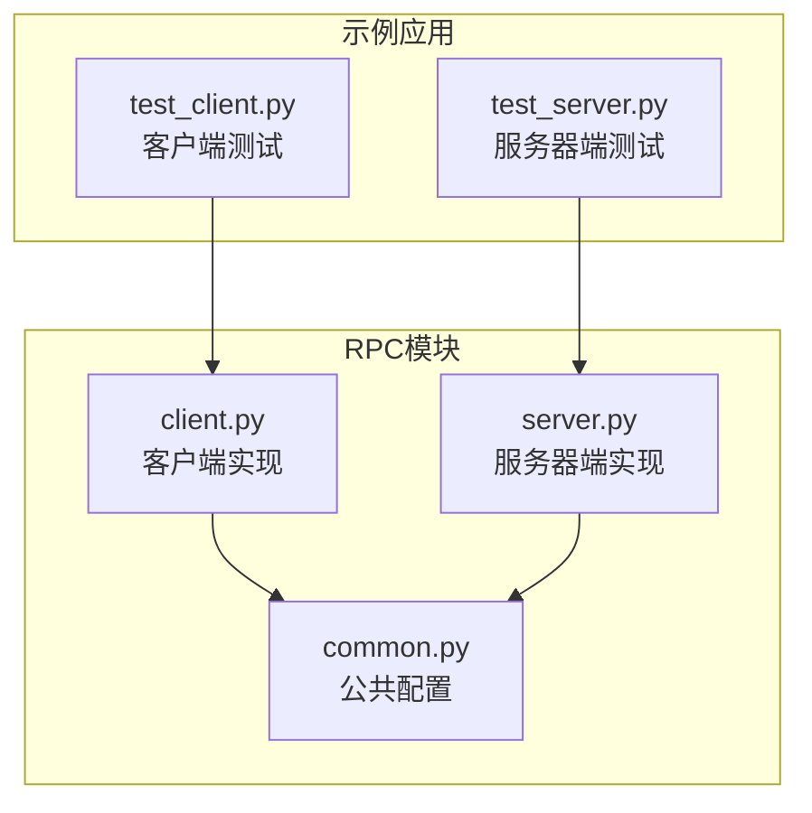
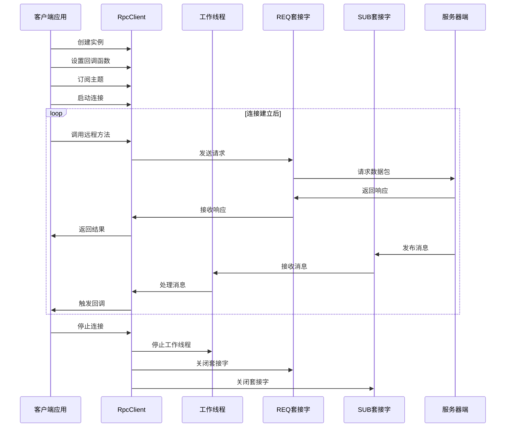
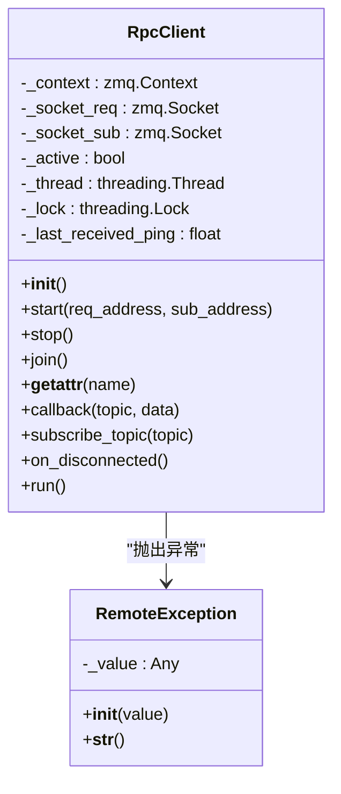
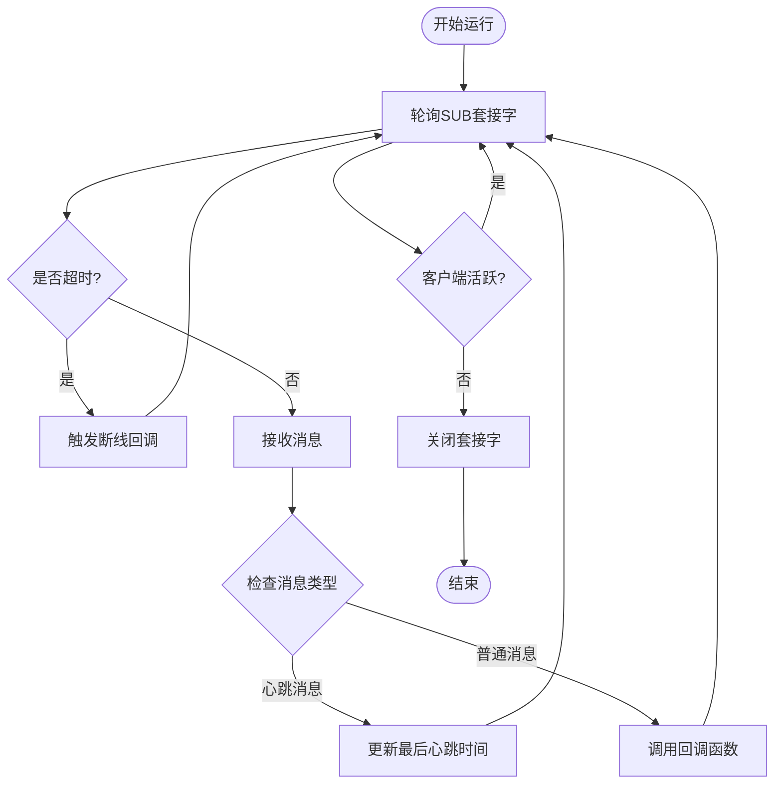
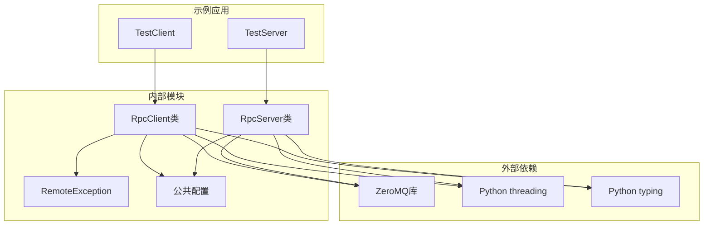

# RPC客户端实现

<cite>
**本文档中引用的文件**
- [client.py](file://vnpy/rpc/client.py)
- [server.py](file://vnpy/rpc/server.py)
- [common.py](file://vnpy/rpc/common.py)
- [test_client.py](file://examples/simple_rpc/test_client.py)
- [test_server.py](file://examples/simple_rpc/test_server.py)
</cite>

## 目录
1. [简介](#简介)
2. [项目结构](#项目结构)
3. [核心组件](#核心组件)
4. [架构概览](#架构概览)
5. [详细组件分析](#详细组件分析)
6. [依赖关系分析](#依赖关系分析)
7. [性能考虑](#性能考虑)
8. [故障排除指南](#故障排除指南)
9. [结论](#结论)

## 简介

vnpy的RPC客户端实现基于ZeroMQ（ZMQ）库，提供了高效的远程过程调用功能。该实现采用请求-回复（Request-Reply）模式进行同步调用，以及发布-订阅（Publish-Subscribe）模式进行异步消息推送。客户端支持自动断线重连、心跳检测、异常恢复等高级特性，确保在不稳定网络环境下的可靠通信。

## 项目结构

RPC模块的核心文件组织如下：



**图表来源**
- [client.py](file://vnpy/rpc/client.py#L1-L170)
- [server.py](file://vnpy/rpc/server.py#L1-L141)
- [common.py](file://vnpy/rpc/common.py#L1-L11)

**章节来源**
- [client.py](file://vnpy/rpc/client.py#L1-L170)
- [server.py](file://vnpy/rpc/server.py#L1-L141)
- [common.py](file://vnpy/rpc/common.py#L1-L11)

## 核心组件

### RpcClient类

RpcClient是整个RPC系统的核心组件，负责管理与服务器的连接、执行远程调用、处理异步消息推送等功能。

主要特性：
- 基于ZeroMQ REQ/REP和SUB/PUB模式
- 支持同步远程过程调用
- 实现异步消息订阅机制
- 提供心跳检测和断线重连功能
- 具备异常处理和超时控制

### RemoteException异常类

自定义异常类，用于封装远程调用过程中发生的错误信息，提供统一的错误处理机制。

**章节来源**
- [client.py](file://vnpy/rpc/client.py#L12-L28)

## 架构概览

RPC客户端采用多线程架构设计，主逻辑运行在一个独立的工作线程中，确保主线程不会被阻塞。



**图表来源**
- [client.py](file://vnpy/rpc/client.py#L75-L100)
- [client.py](file://vnpy/rpc/client.py#L101-L149)

## 详细组件分析

### RpcClient初始化与连接管理

RpcClient的初始化过程包括ZeroMQ上下文创建、套接字配置和连接参数设置：

```python
def __init__(self) -> None:
    """Constructor"""
    # zmq port related
    self._context: zmq.Context = zmq.Context()

    # Request socket (Request–reply pattern)
    self._socket_req: zmq.Socket = self._context.socket(zmq.REQ)

    # Subscribe socket (Publish–subscribe pattern)
    self._socket_sub: zmq.Socket = self._context.socket(zmq.SUB)

    # Set socket option to keepalive
    for socket in [self._socket_req, self._socket_sub]:
        socket.setsockopt(zmq.TCP_KEEPALIVE, 1)
        socket.setsockopt(zmq.TCP_KEEPALIVE_IDLE, 60)
```

关键配置：
- **TCP Keepalive**：启用TCP Keepalive机制，间隔60秒检查连接状态
- **REQ套接字**：用于发送请求并等待响应
- **SUB套接字**：用于接收服务器发布的消息
- **线程安全锁**：使用`threading.Lock`确保并发访问的安全性



**图表来源**
- [client.py](file://vnpy/rpc/client.py#L29-L50)
- [client.py](file://vnpy/rpc/client.py#L12-L28)

### 异步调用封装机制

RpcClient通过Python的`__getattr__`魔术方法实现了透明的远程过程调用：

```python
@lru_cache(100)  # noqa
def __getattr__(self, name: str) -> Any:
    """
    Realize remote call function
    """
    # Perform remote call task
    def dorpc(*args: Any, **kwargs: Any) -> Any:
        # Get timeout value from kwargs, default value is 30 seconds
        timeout: int = kwargs.pop("timeout", 30000)

        # Generate request
        req: list = [name, args, kwargs]

        # Send request and wait for response
        with self._lock:
            self._socket_req.send_pyobj(req)

            # Timeout reached without any data
            n: int = self._socket_req.poll(timeout)
            if not n:
                msg: str = f"Timeout of {timeout}ms reached for {req}"
                raise RemoteException(msg)

            rep = self._socket_req.recv_pyobj()

        # Return response if successed; Trigger exception if failed
        if rep[0]:
            return rep[1]
        else:
            raise RemoteException(rep[1])

    return dorpc
```

调用流程：
1. **动态方法生成**：通过`__getattr__`为每个远程方法名生成对应的调用函数
2. **LRU缓存**：使用LRU缓存优化频繁调用的方法性能
3. **线程安全**：使用锁机制确保并发调用的安全性
4. **超时控制**：支持可配置的超时时间，默认30秒
5. **异常处理**：捕获并转换远程调用异常

**章节来源**
- [client.py](file://vnpy/rpc/client.py#L52-L85)

### 结果回调机制

客户端通过回调函数处理来自服务器的异步消息：

```python
def callback(self, topic: str, data: Any) -> None:
    """
    Callable function
    """
    raise NotImplementedError
```

用户需要继承RpcClient并实现具体的回调逻辑：

```python
class TestClient(RpcClient):
    def callback(self, topic: str, data: Any) -> None:
        print(f"client received topic:{topic}, data:{data}")
```

回调机制特点：
- **主题订阅**：支持按主题订阅特定类型的消息
- **异步处理**：在独立的工作线程中处理回调，不阻塞主线程
- **灵活扩展**：用户可以实现复杂的业务逻辑处理

**章节来源**
- [client.py](file://vnpy/rpc/client.py#L150-L152)
- [test_client.py](file://examples/simple_rpc/test_client.py#L15-L20)

### 心跳检测与断线重连

客户端实现了完善的心跳检测机制来监控连接状态：

```python
def run(self) -> None:
    """
    Run RpcClient function
    """
    pull_tolerance: int = HEARTBEAT_TOLERANCE * 1000

    while self._active:
        if not self._socket_sub.poll(pull_tolerance):
            self.on_disconnected()
            continue

        # Receive data from subscribe socket
        topic, data = self._socket_sub.recv_pyobj(flags=zmq.NOBLOCK)

        if topic == HEARTBEAT_TOPIC:
            self._last_received_ping = data
        else:
            # Process data by callable function
            self.callback(topic, data)

    # Close socket
    self._socket_req.close()
    self._socket_sub.close()
```

心跳机制配置：
- **心跳间隔**：10秒发送一次心跳
- **容忍时间**：30秒无响应判定为断开
- **自动重连**：检测到断开时触发`on_disconnected`回调



**图表来源**
- [client.py](file://vnpy/rpc/client.py#L101-L149)

**章节来源**
- [client.py](file://vnpy/rpc/client.py#L101-L149)
- [common.py](file://vnpy/rpc/common.py#L8-L10)

### 异常恢复策略

RpcClient提供了多层次的异常处理和恢复机制：

1. **连接异常处理**：
```python
def on_disconnected(self) -> None:
    """
    Callback when heartbeat is lost.
    """
    msg: str = f"RpcServer has no response over {HEARTBEAT_TOLERANCE} seconds, please check you connection."
    print(msg)
```

2. **远程调用异常**：
```python
class RemoteException(Exception):
    def __init__(self, value: Any) -> None:
        self._value: Any = value

    def __str__(self) -> str:
        return str(self._value)
```

3. **超时异常处理**：
```python
if not n:
    msg: str = f"Timeout of {timeout}ms reached for {req}"
    raise RemoteException(msg)
```

异常处理策略：
- **网络中断**：检测到连接丢失时打印警告信息
- **服务不可达**：超时异常提示具体的服务调用信息
- **序列化失败**：ZeroMQ底层自动处理对象序列化问题

**章节来源**
- [client.py](file://vnpy/rpc/client.py#L154-L158)
- [client.py](file://vnpy/rpc/client.py#L12-L28)
- [client.py](file://vnpy/rpc/client.py#L75-L85)

## 依赖关系分析

RPC客户端的依赖关系图展示了各组件之间的交互：



**图表来源**
- [client.py](file://vnpy/rpc/client.py#L1-L8)
- [server.py](file://vnpy/rpc/server.py#L1-L8)
- [test_client.py](file://examples/simple_rpc/test_client.py#L1-L4)

**章节来源**
- [client.py](file://vnpy/rpc/client.py#L1-L8)
- [server.py](file://vnpy/rpc/server.py#L1-L8)
- [common.py](file://vnpy/rpc/common.py#L1-L11)

## 性能考虑

### ZeroMQ套接字参数优化

为了提高连接稳定性和响应速度，客户端进行了以下优化：

1. **TCP Keepalive配置**：
```python
for socket in [self._socket_req, self._socket_sub]:
    socket.setsockopt(zmq.TCP_KEEPALIVE, 1)
    socket.setsockopt(zmq.TCP_KEEPALIVE_IDLE, 60)
```

2. **套接字选项优化**：
- **TCP_KEEPALIVE**：启用TCP Keepalive
- **TCP_KEEPALIVE_IDLE**：空闲60秒后开始探测

3. **轮询超时设置**：
```python
pull_tolerance: int = HEARTBEAT_TOLERANCE * 1000
```

### 性能监控建议

1. **连接状态监控**：
```python
# 监控最后心跳时间
last_ping_diff = time() - self._last_received_ping
print(f"Last ping was {last_ping_diff:.2f} seconds ago")
```

2. **调用性能统计**：
```python
import time

def monitored_call(self, method_name, *args, **kwargs):
    start_time = time.time()
    try:
        result = getattr(self, method_name)(*args, **kwargs)
        duration = time.time() - start_time
        print(f"{method_name} took {duration:.3f}s")
        return result
    except Exception as e:
        duration = time.time() - start_time
        print(f"{method_name} failed after {duration:.3f}s: {e}")
        raise
```

3. **内存使用监控**：
```python
import psutil
import os

def monitor_memory_usage():
    process = psutil.Process(os.getpid())
    memory_info = process.memory_info()
    print(f"Memory usage: {memory_info.rss / 1024 / 1024:.2f} MB")
```

## 故障排除指南

### 常见问题及解决方案

1. **连接超时问题**：
```
问题：RpcClient无法连接到服务器
解决方案：
- 检查服务器地址和端口是否正确
- 验证防火墙设置是否允许连接
- 确认服务器是否正在运行
```

2. **序列化失败**：
```
问题：RemoteException: Pickle error
解决方案：
- 确保传递的对象是可序列化的
- 避免传递复杂的数据结构或循环引用
- 使用简单的数据类型（dict, list, str, int等）
```

3. **内存泄漏**：
```
问题：长时间运行后内存占用持续增长
解决方案：
- 定期调用`join()`方法等待线程退出
- 及时释放不再使用的RpcClient实例
- 监控LRU缓存的大小
```

4. **断线重连问题**：
```
问题：连接断开后无法自动重连
解决方案：
- 检查心跳检测配置
- 实现自定义的重连逻辑
- 在`on_disconnected`回调中添加重连尝试
```

### 调试技巧

1. **启用详细日志**：
```python
import logging
logging.basicConfig(level=logging.DEBUG)
```

2. **监控套接字状态**：
```python
def debug_socket_state(client):
    print(f"Request socket FD: {client._socket_req.getsockopt(zmq.FD)}")
    print(f"Subscribe socket FD: {client._socket_sub.getsockopt(zmq.FD)}")
    print(f"Connection active: {client._active}")
```

3. **性能分析**：
```python
import cProfile
import pstats

def profile_rpc_call(client, method_name, *args, **kwargs):
    profiler = cProfile.Profile()
    profiler.enable()
    
    result = getattr(client, method_name)(*args, **kwargs)
    
    profiler.disable()
    stats = pstats.Stats(profiler)
    stats.sort_stats('cumulative')
    stats.print_stats(10)
    
    return result
```

**章节来源**
- [client.py](file://vnpy/rpc/client.py#L38-L45)
- [client.py](file://vnpy/rpc/client.py#L75-L85)

## 结论

vnpy的RPC客户端实现展现了现代网络编程的最佳实践，通过以下特性提供了可靠的远程调用服务：

1. **高性能架构**：基于ZeroMQ的异步I/O模型，支持高并发请求处理
2. **完善的错误处理**：多层次的异常捕获和恢复机制
3. **智能连接管理**：自动断线检测和重连功能
4. **灵活的消息处理**：支持同步调用和异步消息推送
5. **易于使用**：简洁的API设计和丰富的示例代码

该实现特别适合需要实时数据交换和远程控制的应用场景，如金融交易系统、分布式计算平台等。通过合理的配置和监控，可以构建稳定可靠的分布式应用程序。