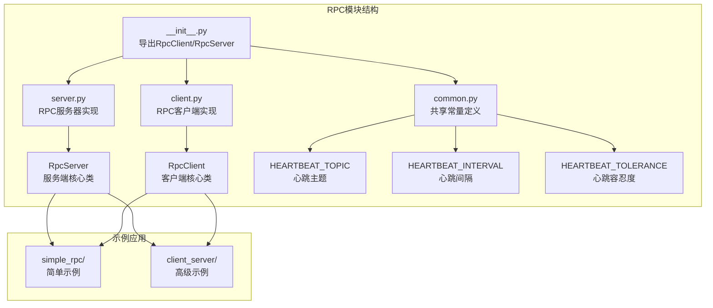
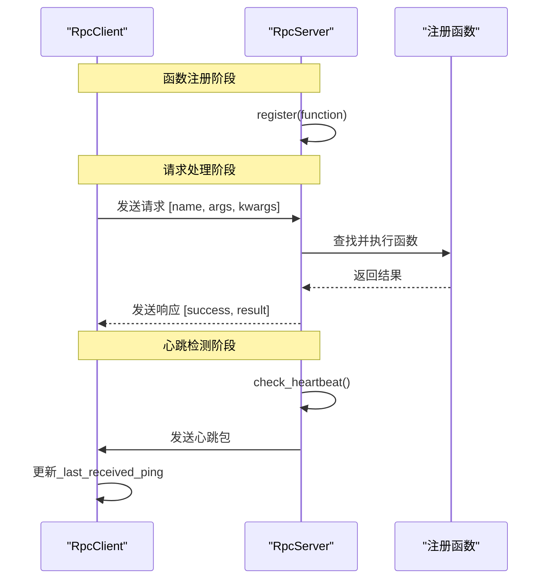
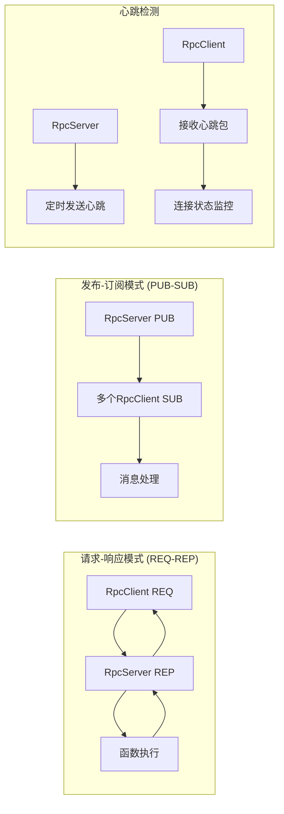
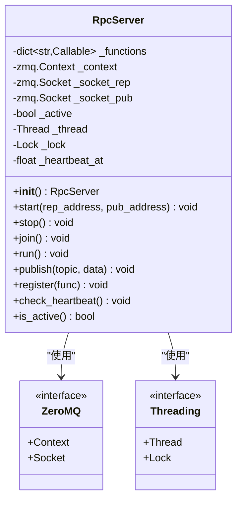
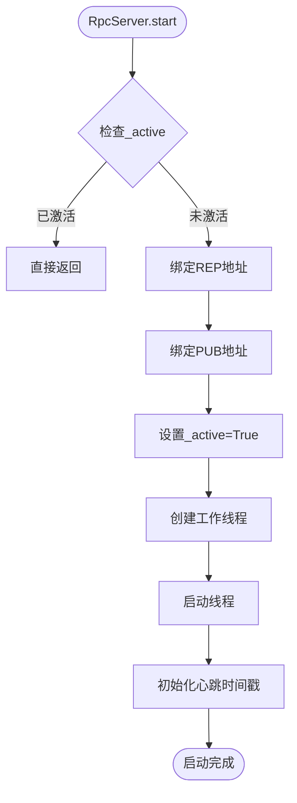
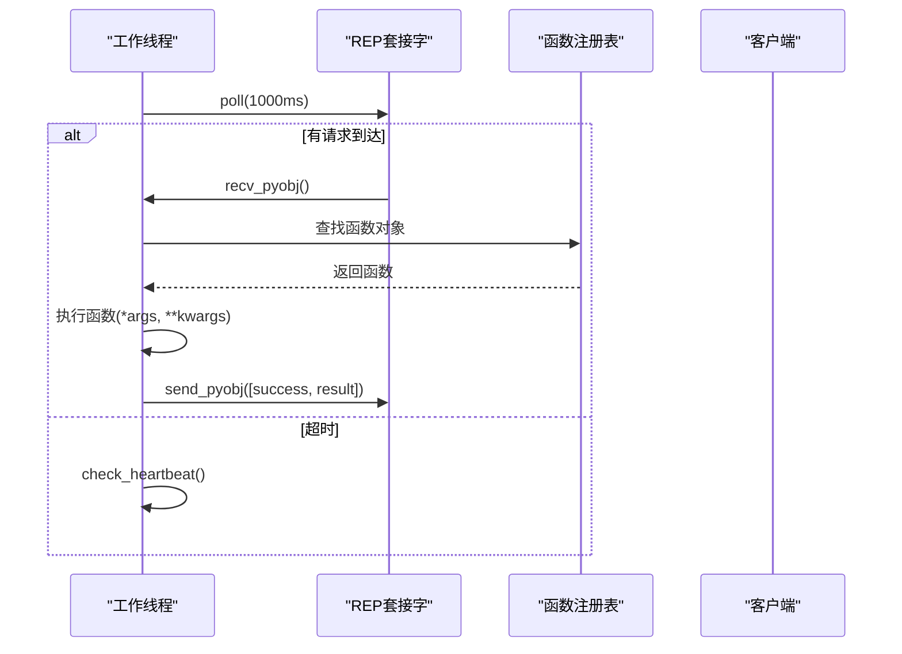
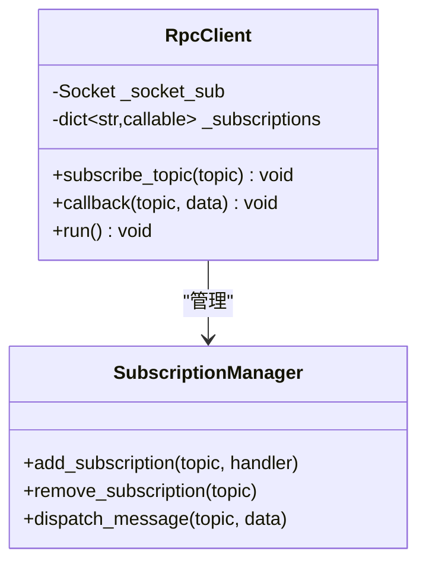
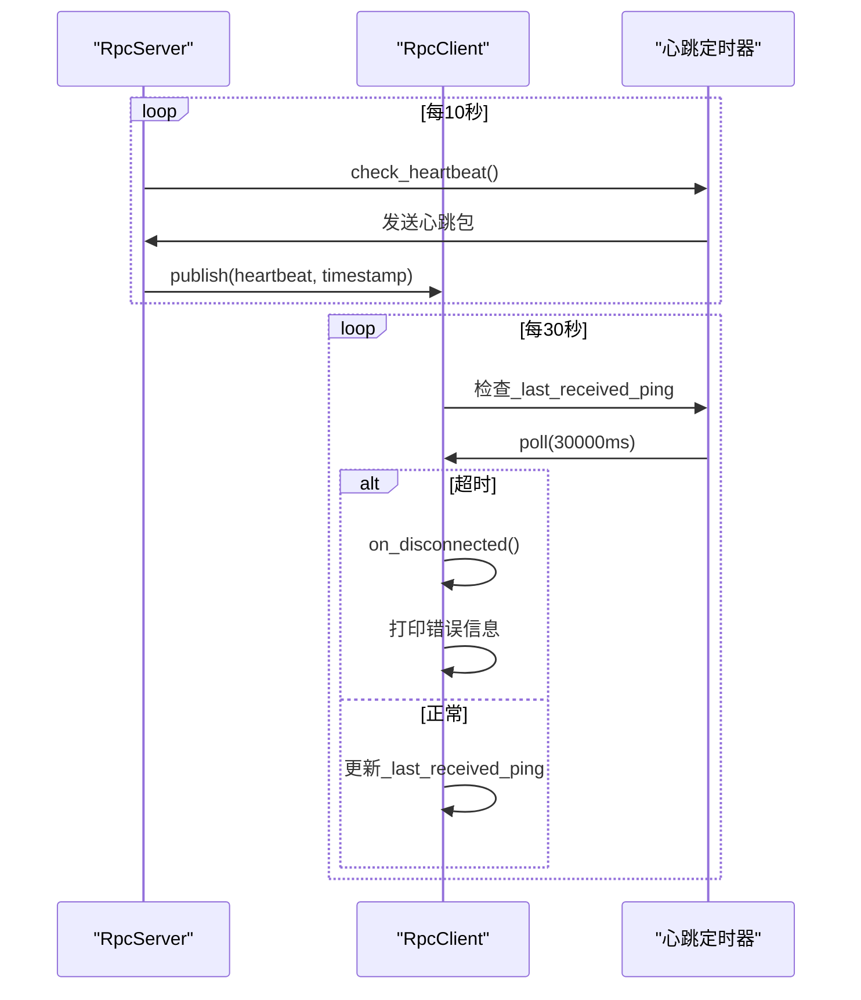
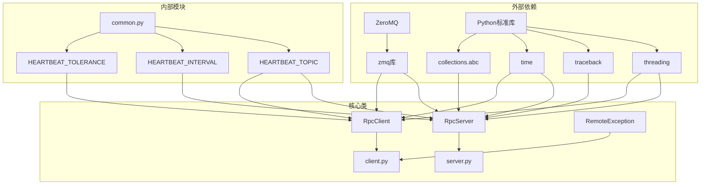

# RPC服务器实现

<cite>
**本文档引用的文件**
- [vnpy/rpc/server.py](file://vnpy/rpc/server.py)
- [vnpy/rpc/client.py](file://vnpy/rpc/client.py)
- [vnpy/rpc/common.py](file://vnpy/rpc/common.py)
- [vnpy/rpc/__init__.py](file://vnpy/rpc/__init__.py)
- [examples/simple_rpc/test_server.py](file://examples/simple_rpc/test_server.py)
- [examples/simple_rpc/test_client.py](file://examples/simple_rpc/test_client.py)
- [examples/client_server/run_server.py](file://examples/client_server/run_server.py)
- [examples/client_server/run_client.py](file://examples/client_server/run_client.py)
</cite>

## 目录
1. [简介](#简介)
2. [项目结构](#项目结构)
3. [核心组件](#核心组件)
4. [架构概览](#架构概览)
5. [详细组件分析](#详细组件分析)
6. [依赖关系分析](#依赖关系分析)
7. [性能考虑](#性能考虑)
8. [故障排除指南](#故障排除指南)
9. [结论](#结论)

## 简介

VeighNa RPC模块提供了一个基于ZeroMQ的高性能分布式RPC通信框架，专门设计用于量化交易平台的分布式架构。该实现采用请求-响应（Request-Reply）和发布-订阅（Publish-Subscribe）双模式通信，支持函数注册、心跳检测、线程安全和优雅关闭等关键特性。

RPC服务器的核心设计理念是通过简单的装饰器或配置方式注册可远程调用函数，确保线程安全的同时提供高可用的分布式服务。该框架特别适用于交易服务器与策略客户端分离、多进程策略并行运行、分布式风险管理等场景。

## 项目结构

RPC模块位于`vnpy/rpc/`目录下，包含以下核心文件：



**图表来源**
- [vnpy/rpc/__init__.py](file://vnpy/rpc/__init__.py#L1-L7)
- [vnpy/rpc/server.py](file://vnpy/rpc/server.py#L1-L141)
- [vnpy/rpc/client.py](file://vnpy/rpc/client.py#L1-L170)
- [vnpy/rpc/common.py](file://vnpy/rpc/common.py#L1-L11)

**章节来源**
- [vnpy/rpc/__init__.py](file://vnpy/rpc/__init__.py#L1-L7)
- [vnpy/rpc/server.py](file://vnpy/rpc/server.py#L1-L141)
- [vnpy/rpc/client.py](file://vnpy/rpc/client.py#L1-L170)
- [vnpy/rpc/common.py](file://vnpy/rpc/common.py#L1-L11)

## 核心组件

### RpcServer - RPC服务端

RpcServer是整个RPC框架的核心服务端组件，负责接收远程调用请求、执行注册的函数并返回结果。它采用多线程架构，支持高并发请求处理。

主要特性：
- **函数注册机制**：通过`register()`方法动态注册可远程调用函数
- **双Socket通信**：使用REQ-REP和PUB-SUB模式分别处理请求响应和广播消息
- **线程安全保障**：使用锁机制确保多线程环境下的数据一致性
- **心跳检测**：定期发送心跳包维持连接活跃状态
- **优雅关闭**：提供`stop()`和`join()`方法确保资源正确释放

### RpcClient - RPC客户端

RpcClient提供透明的远程过程调用功能，通过动态方法绑定实现类似本地调用的体验。

主要特性：
- **动态远程调用**：通过`__getattr__`魔术方法实现动态函数调用
- **订阅机制**：支持订阅特定主题的消息推送
- **异常处理**：捕获并包装远程调用异常
- **心跳监控**：检测服务器连接状态，自动断线重连
- **线程安全**：使用锁机制保护并发访问

**章节来源**
- [vnpy/rpc/server.py](file://vnpy/rpc/server.py#L10-L141)
- [vnpy/rpc/client.py](file://vnpy/rpc/client.py#L25-L170)

## 架构概览

RPC框架采用经典的客户端-服务器架构，结合ZeroMQ的高性能网络通信能力：



**图表来源**
- [vnpy/rpc/server.py](file://vnpy/rpc/server.py#L75-L98)
- [vnpy/rpc/client.py](file://vnpy/rpc/client.py#L52-L85)

### 双模式通信架构

RPC框架采用双模式通信架构，满足不同的业务需求：



**图表来源**
- [vnpy/rpc/server.py](file://vnpy/rpc/server.py#L25-L26)
- [vnpy/rpc/client.py](file://vnpy/rpc/client.py#L28-L29)
- [vnpy/rpc/common.py](file://vnpy/rpc/common.py#L6-L10)

## 详细组件分析

### RpcServer详细分析

#### 类结构设计



**图表来源**
- [vnpy/rpc/server.py](file://vnpy/rpc/server.py#L10-L35)

#### 启动流程分析



**图表来源**
- [vnpy/rpc/server.py](file://vnpy/rpc/server.py#L40-L60)

#### 请求处理流程



**图表来源**
- [vnpy/rpc/server.py](file://vnpy/rpc/server.py#L75-L98)

#### 函数注册机制

RpcServer通过简单的字典映射实现函数注册：

```python
# 注册函数示例
def add(a, b):
    return a + b

server = RpcServer()
server.register(add)  # 自动使用函数名作为键
```

注册过程的安全性：
- 使用线程锁保护函数字典的并发访问
- 支持动态注册和注销
- 函数名冲突时会覆盖原有注册

**章节来源**
- [vnpy/rpc/server.py](file://vnpy/rpc/server.py#L10-L141)
- [examples/simple_rpc/test_server.py](file://examples/simple_rpc/test_server.py#L15-L20)

### RpcClient详细分析

#### 客户端动态调用机制

RpcClient通过`__getattr__`实现透明的远程调用：

```mermaid
flowchart TD
Call[tc.add(1, 2)] --> GetAttr["__getattr__('add')"]
GetAttr --> CreateProxy[创建代理函数]
CreateProxy --> SendReq[发送请求]
SendReq --> Lock[获取锁]
Lock --> SendObj[send_pyobj]
SendObj --> Poll[poll超时等待]
Poll --> CheckResult{"检查响应"}
CheckResult --> |成功| ParseResp[解析响应]
CheckResult --> |失败| RaiseException[抛出RemoteException]
ParseResp --> Return[返回结果]
RaiseException --> End([结束])
Return --> End
```

**图表来源**
- [vnpy/rpc/client.py](file://vnpy/rpc/client.py#L52-L85)

#### 订阅机制实现



**图表来源**
- [vnpy/rpc/client.py](file://vnpy/rpc/client.py#L135-L149)

#### 心跳检测与连接监控



**图表来源**
- [vnpy/rpc/server.py](file://vnpy/rpc/server.py#L135-L141)
- [vnpy/rpc/client.py](file://vnpy/rpc/client.py#L125-L135)

**章节来源**
- [vnpy/rpc/client.py](file://vnpy/rpc/client.py#L25-L170)
- [vnpy/rpc/common.py](file://vnpy/rpc/common.py#L6-L10)

### 示例应用分析

#### 简单RPC示例

TestServer展示了最基础的RPC服务端实现：

```python
class TestServer(RpcServer):
    def __init__(self):
        super().__init__()
        self.register(self.add)
    
    def add(self, a, b):
        print(f"receiving:{a} {b}")
        return a + b
```

使用方式：
```python
rep_address = "tcp://*:2014"
pub_address = "tcp://*:4102"

ts = TestServer()
ts.start(rep_address, pub_address)
```

#### 高级RPC示例

高级示例展示了如何在VeighNa主引擎中集成RPC服务：

```python
# 服务端配置
rpc_engine = main_engine.add_app(RpcServiceApp)
rep_address = "tcp://127.0.0.1:2014"
pub_address = "tcp://127.0.0.1:4102"
rpc_engine.start(rep_address, pub_address)

# 客户端配置
main_engine.add_gateway(RpcGateway)
```

**章节来源**
- [examples/simple_rpc/test_server.py](file://examples/simple_rpc/test_server.py#L1-L39)
- [examples/client_server/run_server.py](file://examples/client_server/run_server.py#L1-L74)
- [examples/client_server/run_client.py](file://examples/client_server/run_client.py#L1-L28)

## 依赖关系分析

RPC模块的依赖关系相对简单但设计精良：



**图表来源**
- [vnpy/rpc/server.py](file://vnpy/rpc/server.py#L1-L8)
- [vnpy/rpc/client.py](file://vnpy/rpc/client.py#L1-L10)
- [vnpy/rpc/common.py](file://vnpy/rpc/common.py#L1-L11)

### 关键依赖说明

1. **ZeroMQ (zmq)**：提供高性能的网络通信基础设施
2. **threading**：支持多线程并发处理
3. **collections.abc**：提供Callable类型检查
4. **traceback**：用于异常堆栈信息捕获

**章节来源**
- [vnpy/rpc/server.py](file://vnpy/rpc/server.py#L1-L8)
- [vnpy/rpc/client.py](file://vnpy/rpc/client.py#L1-L10)

## 性能考虑

### 线程安全设计

RPC框架采用多种机制确保线程安全：

1. **函数字典锁**：`self._lock`保护函数注册表的并发访问
2. **套接字锁**：每个客户端连接使用独立锁防止竞争条件
3. **原子操作**：状态变量的更新使用原子操作避免数据竞争

### 性能优化策略

1. **LRU缓存**：客户端使用LRU缓存存储动态生成的代理函数
2. **异步I/O**：使用ZeroMQ的异步I/O模型提高吞吐量
3. **连接复用**：TCP Keep-Alive机制减少连接建立开销
4. **内存管理**：及时释放不再使用的套接字和上下文

### 并发处理能力

- **最大连接数**：理论上支持数千个并发连接
- **消息队列**：ZeroMQ提供内置的消息队列机制
- **负载均衡**：支持多实例部署实现水平扩展

## 故障排除指南

### 常见问题及解决方案

#### 连接问题

**问题**：客户端无法连接到服务器
**解决方案**：
1. 检查IP地址和端口配置
2. 验证防火墙设置
3. 确认服务器已启动并监听相应端口

#### 超时问题

**问题**：远程调用超时
**解决方案**：
1. 增加超时时间设置
2. 检查网络延迟
3. 优化被调用函数的执行效率

#### 心跳丢失

**问题**：心跳检测失败
**解决方案**：
1. 调整心跳容忍度参数
2. 检查网络稳定性
3. 实现重连机制

### 调试技巧

1. **启用详细日志**：通过事件引擎获取RPC日志
2. **监控连接状态**：使用`is_active()`方法检查服务器状态
3. **性能分析**：监控CPU和内存使用情况

**章节来源**
- [vnpy/rpc/client.py](file://vnpy/rpc/client.py#L135-L149)
- [vnpy/rpc/common.py](file://vnpy/rpc/common.py#L6-L10)

## 结论

VeighNa RPC模块提供了一个功能完整、性能优异的分布式RPC通信框架。其主要优势包括：

### 技术优势

1. **架构简洁**：采用清晰的客户端-服务器架构，易于理解和维护
2. **性能优异**：基于ZeroMQ的高性能网络通信，支持高并发处理
3. **线程安全**：完善的锁机制确保多线程环境下的数据一致性
4. **易于使用**：简单的装饰器或配置方式即可实现函数远程调用

### 应用场景

1. **交易服务器分离**：将交易逻辑与策略执行分离，提高系统稳定性
2. **多进程并行**：支持多个策略进程并行运行，充分利用多核CPU
3. **分布式风险管理**：实现集中化的风险控制和监控
4. **行情分发系统**：高效分发实时行情数据到多个客户端

### 最佳实践建议

1. **合理配置心跳参数**：根据网络环境调整心跳间隔和容忍度
2. **实施访问控制**：在生产环境中添加身份验证和授权机制
3. **监控系统健康**：建立完善的监控和告警机制
4. **定期备份配置**：保存重要的网络配置和函数注册信息

该RPC框架为量化交易平台的分布式架构提供了坚实的基础，是构建高性能、高可用量化系统的理想选择。