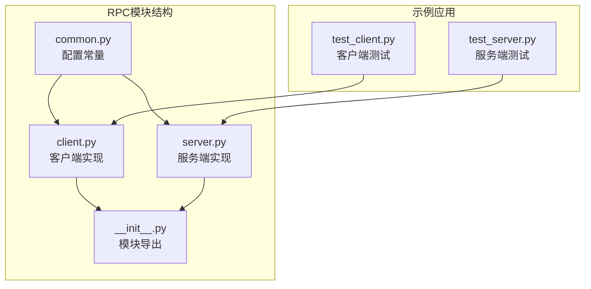
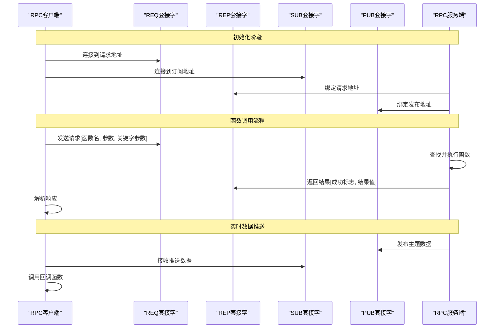
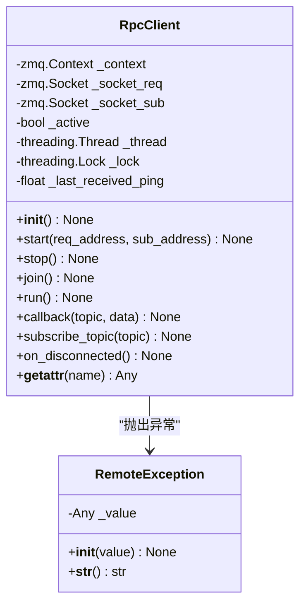
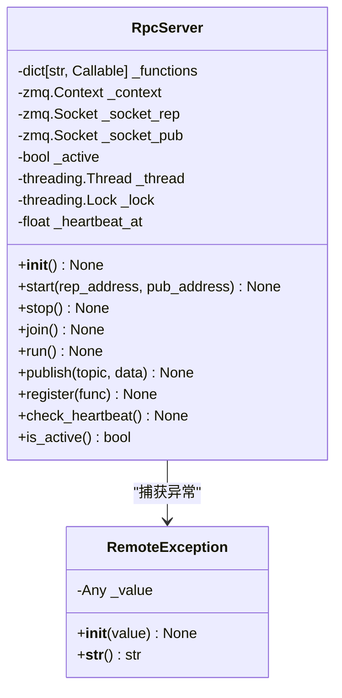
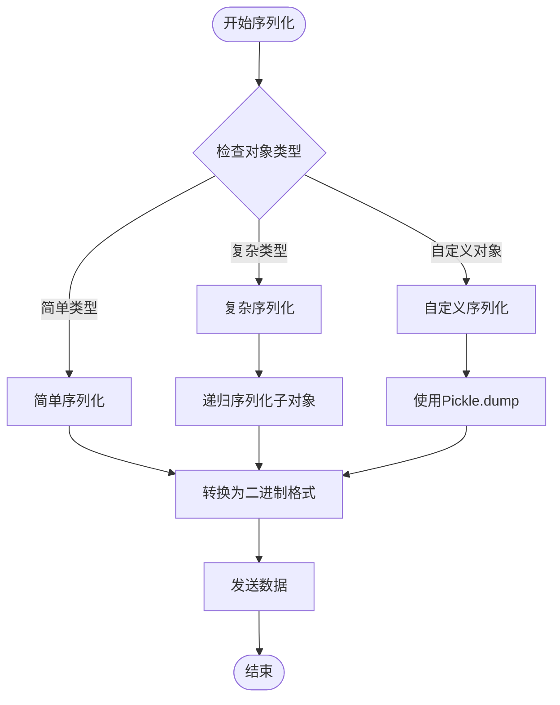
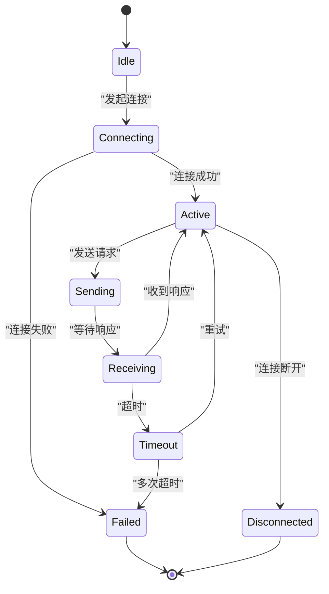
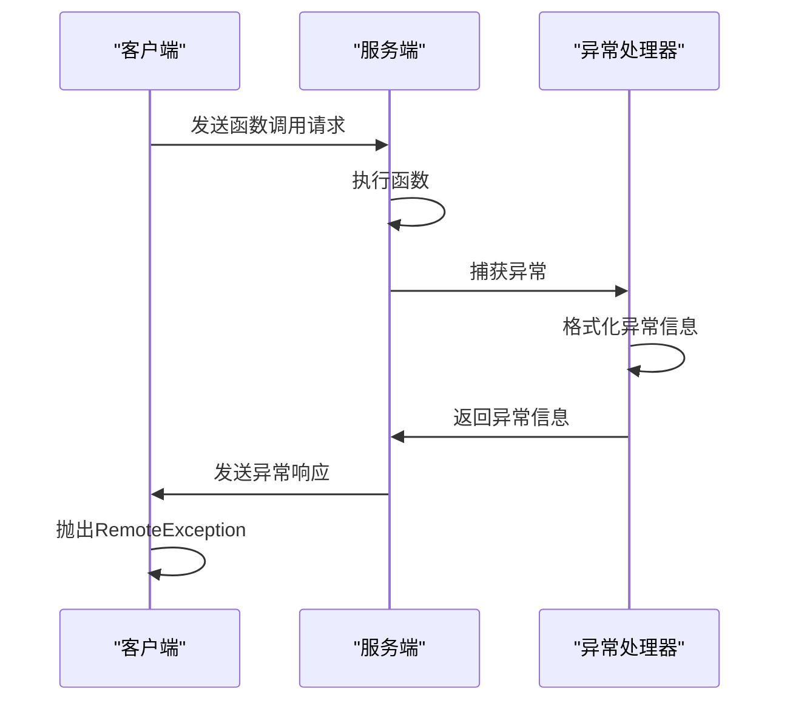

# RPC通信协议技术文档

<cite>
**本文档引用的文件**
- [vnpy/rpc/common.py](file://vnpy/rpc/common.py)
- [vnpy/rpc/client.py](file://vnpy/rpc/client.py)
- [vnpy/rpc/server.py](file://vnpy/rpc/server.py)
- [vnpy/rpc/__init__.py](file://vnpy/rpc/__init__.py)
- [examples/simple_rpc/test_client.py](file://examples/simple_rpc/test_client.py)
- [examples/simple_rpc/test_server.py](file://examples/simple_rpc/test_server.py)
</cite>

## 目录
1. [简介](#简介)
2. [项目结构](#项目结构)
3. [核心组件](#核心组件)
4. [架构概览](#架构概览)
5. [详细组件分析](#详细组件分析)
6. [消息序列化机制](#消息序列化机制)
7. [通信协议设计](#通信协议设计)
8. [错误处理与异常传递](#错误处理与异常传递)
9. [性能考虑](#性能考虑)
10. [故障排除指南](#故障排除指南)
11. [结论](#结论)

## 简介

vnpy的RPC通信协议是一个基于ZeroMQ的高性能远程过程调用系统，专为量化交易环境设计。该协议采用请求-响应模式，支持函数远程调用、实时数据推送和心跳检测机制。协议的核心特点包括：

- 基于Python Pickle的序列化机制
- ZeroMQ DEALER/ROUTER通信模式
- 异步事件驱动架构
- 完善的错误处理和超时控制
- 心跳检测和连接状态监控

## 项目结构

RPC模块采用分层架构设计，主要包含以下核心文件：



**图表来源**
- [vnpy/rpc/common.py](file://vnpy/rpc/common.py#L1-L11)
- [vnpy/rpc/client.py](file://vnpy/rpc/client.py#L1-L170)
- [vnpy/rpc/server.py](file://vnpy/rpc/server.py#L1-L141)

**章节来源**
- [vnpy/rpc/__init__.py](file://vnpy/rpc/__init__.py#L1-L7)

## 核心组件

RPC通信协议由三个核心组件构成：消息结构、序列化机制和通信模式。

### 消息结构定义

消息结构采用简单的列表格式，包含以下字段：
- **函数名**：字符串形式的函数标识符
- **参数列表**：位置参数的元组
- **关键字参数**：字典形式的关键字参数

### 序列化机制

协议使用Python内置的Pickle模块进行对象序列化，支持：
- 复杂数据类型的序列化
- 自定义对象的传输
- 函数调用参数的完整封装

### 通信模式

基于ZeroMQ的双模式通信：
- **请求-响应模式**：用于函数调用
- **发布-订阅模式**：用于实时数据推送

**章节来源**
- [vnpy/rpc/client.py](file://vnpy/rpc/client.py#L52-L98)
- [vnpy/rpc/server.py](file://vnpy/rpc/server.py#L75-L98)

## 架构概览

RPC通信协议采用客户端-服务器架构，通过ZeroMQ实现高效的异步通信：



**图表来源**
- [vnpy/rpc/client.py](file://vnpy/rpc/client.py#L52-L98)
- [vnpy/rpc/server.py](file://vnpy/rpc/server.py#L75-L98)

## 详细组件分析

### RPC客户端 (RpcClient)

RpcClient类实现了完整的客户端功能，包括异步通信、错误处理和心跳检测：



**图表来源**
- [vnpy/rpc/client.py](file://vnpy/rpc/client.py#L20-L170)

#### 核心功能特性

1. **动态方法代理**：通过`__getattr__`实现透明的远程函数调用
2. **异步回调处理**：独立线程处理订阅数据
3. **心跳检测**：监控连接状态，及时发现断连
4. **超时控制**：可配置的请求超时机制

### RPC服务端 (RpcServer)

RpcServer类提供了服务端的核心功能，支持函数注册和实时数据发布：



**图表来源**
- [vnpy/rpc/server.py](file://vnpy/rpc/server.py#L10-L141)

#### 核心功能特性

1. **函数注册机制**：动态注册可调用函数
2. **异常处理**：捕获并返回函数执行异常
3. **心跳管理**：自动发送心跳信号
4. **多线程支持**：独立线程处理请求

**章节来源**
- [vnpy/rpc/client.py](file://vnpy/rpc/client.py#L20-L170)
- [vnpy/rpc/server.py](file://vnpy/rpc/server.py#L10-L141)

## 消息序列化机制

### Pickle序列化

RPC协议使用Python的Pickle模块进行对象序列化，具有以下特点：

1. **通用性强**：支持几乎所有Python对象
2. **性能优化**：使用二进制格式，传输效率高
3. **安全性考虑**：需要防范恶意数据注入

### 消息格式规范

#### 请求消息格式
```python
request_message = [
    function_name: str,      # 函数名称
    args: tuple,             # 位置参数
    kwargs: dict             # 关键字参数
]
```

#### 响应消息格式
```python
response_message = [
    success_flag: bool,      # 成功标志
    result_or_error: Any     # 结果或错误信息
]
```

### 序列化流程



**图表来源**
- [vnpy/rpc/client.py](file://vnpy/rpc/client.py#L65-L85)
- [vnpy/rpc/server.py](file://vnpy/rpc/server.py#L85-L98)

**章节来源**
- [vnpy/rpc/client.py](file://vnpy/rpc/client.py#L65-L85)
- [vnpy/rpc/server.py](file://vnpy/rpc/server.py#L85-L98)

## 通信协议设计

### ZeroMQ通信模式

RPC协议基于ZeroMQ的两种核心模式：

#### 请求-响应模式 (REQ/REP)
- **客户端**：使用REQ套接字发送请求
- **服务端**：使用REP套接字接收和响应
- **特点**：一对一通信，保证消息顺序

#### 发布-订阅模式 (PUB/SUB)
- **服务端**：使用PUB套接字发布数据
- **客户端**：使用SUB套接字订阅主题
- **特点**：一对多通信，支持主题过滤

### 协议扩展指南

#### 添加新消息类型

要安全地添加新的消息类型，建议遵循以下步骤：

1. **定义消息结构**：明确消息格式和字段
2. **版本控制**：添加版本号字段
3. **向后兼容**：确保新字段为可选
4. **验证机制**：添加消息格式验证

#### 示例：添加新的消息类型

```python
# 新消息类型示例
new_message = {
    "version": "1.0",
    "type": "NEW_MESSAGE_TYPE",
    "timestamp": time(),
    "payload": {...},
    "signature": "optional_signature"
}
```

### 会话ID管理和超时处理

#### 会话ID管理



#### 超时处理机制

1. **请求超时**：客户端设置请求超时时间
2. **心跳超时**：检测连接状态
3. **自动重连**：连接断开时尝试重新连接

**章节来源**
- [vnpy/rpc/client.py](file://vnpy/rpc/client.py#L65-L85)
- [vnpy/rpc/server.py](file://vnpy/rpc/server.py#L85-L98)

## 错误处理与异常传递

### RemoteException异常类

RPC协议定义了专门的异常类来处理远程调用错误：

```python
class RemoteException(Exception):
    def __init__(self, value: Any) -> None:
        self._value: Any = value

    def __str__(self) -> str:
        return str(self._value)
```

### 异常传递机制



**图表来源**
- [vnpy/rpc/client.py](file://vnpy/rpc/client.py#L85-L90)
- [vnpy/rpc/server.py](file://vnpy/rpc/server.py#L85-L98)

### 错误码体系

虽然当前实现中没有显式的错误码体系，但可以通过以下方式进行扩展：

1. **标准化异常格式**：定义统一的异常结构
2. **错误分类**：按业务逻辑分类错误类型
3. **国际化支持**：支持多语言错误消息

**章节来源**
- [vnpy/rpc/client.py](file://vnpy/rpc/client.py#L15-L30)
- [vnpy/rpc/server.py](file://vnpy/rpc/server.py#L85-L98)

## 性能考虑

### 并发处理

RPC协议采用多线程架构来处理并发请求：

1. **主线程**：处理函数调用请求
2. **工作线程**：处理订阅数据推送
3. **锁机制**：保护共享资源访问

### 内存管理

1. **LRU缓存**：缓存常用函数代理
2. **对象池**：复用ZMQ套接字对象
3. **垃圾回收**：及时释放不再使用的资源

### 网络优化

1. **TCP Keep-Alive**：保持长连接
2. **批量传输**：合并小数据包
3. **压缩传输**：对大数据进行压缩

## 故障排除指南

### 常见问题诊断

#### 连接问题

1. **检查网络连通性**
   ```bash
   telnet localhost 2014
   ```

2. **验证地址绑定**
   ```python
   # 检查端口是否被占用
   netstat -an | grep 2014
   ```

3. **防火墙配置**
   - 确保防火墙允许相关端口
   - 检查SELinux策略（Linux系统）

#### 性能问题

1. **监控内存使用**
   ```python
   import psutil
   print(psutil.Process().memory_info())
   ```

2. **检查线程状态**
   ```python
   import threading
   print(threading.active_count())
   ```

3. **分析网络延迟**
   ```python
   import time
   start_time = time.time()
   # 执行RPC调用
   end_time = time.time()
   print(f"RPC call took {end_time - start_time} seconds")
   ```

### 调试技巧

#### 启用详细日志

```python
import logging
logging.basicConfig(level=logging.DEBUG)
```

#### 使用Wireshark分析网络流量

1. **捕获ZeroMQ流量**
2. **分析消息格式**
3. **检查序列化问题**

#### 性能分析

```python
import cProfile
import pstats

def profile_rpc_call():
    profiler = cProfile.Profile()
    profiler.enable()
    
    # 执行RPC调用
    result = rpc_client.some_function()
    
    profiler.disable()
    stats = pstats.Stats(profiler)
    stats.sort_stats('cumulative')
    stats.print_stats(10)
```

**章节来源**
- [vnpy/rpc/client.py](file://vnpy/rpc/client.py#L150-L169)
- [vnpy/rpc/server.py](file://vnpy/rpc/server.py#L120-L141)

## 结论

vnpy的RPC通信协议是一个设计精良的分布式通信系统，具有以下优势：

1. **高性能**：基于ZeroMQ的异步通信架构
2. **易用性**：简洁的API设计和透明的远程调用
3. **可靠性**：完善的错误处理和超时控制机制
4. **可扩展性**：清晰的架构设计便于功能扩展

### 最佳实践建议

1. **合理设置超时时间**：根据业务需求调整超时参数
2. **监控连接状态**：定期检查心跳和连接质量
3. **优化序列化**：避免传输大型复杂对象
4. **安全考虑**：在生产环境中启用身份验证

### 未来发展方向

1. **协议版本管理**：支持多版本协议共存
2. **负载均衡**：支持多个服务端实例
3. **安全增强**：添加加密和认证机制
4. **监控集成**：与主流监控系统集成

通过本文档的详细分析，开发者可以深入理解RPC通信协议的工作原理，并能够有效地使用和扩展该协议以满足特定的业务需求。