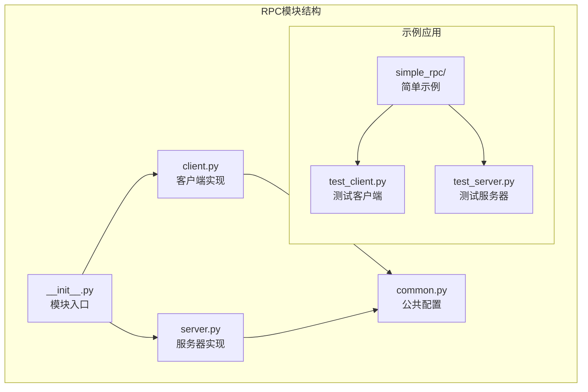
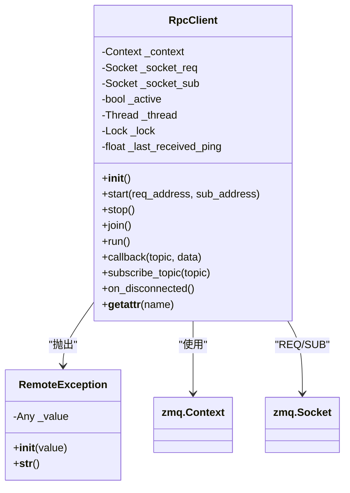
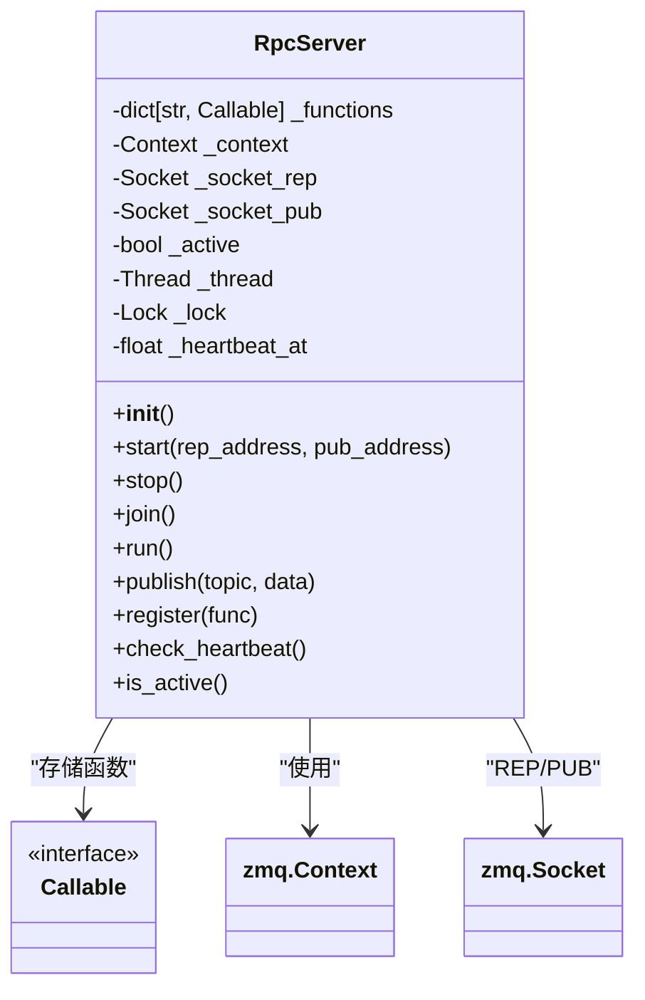
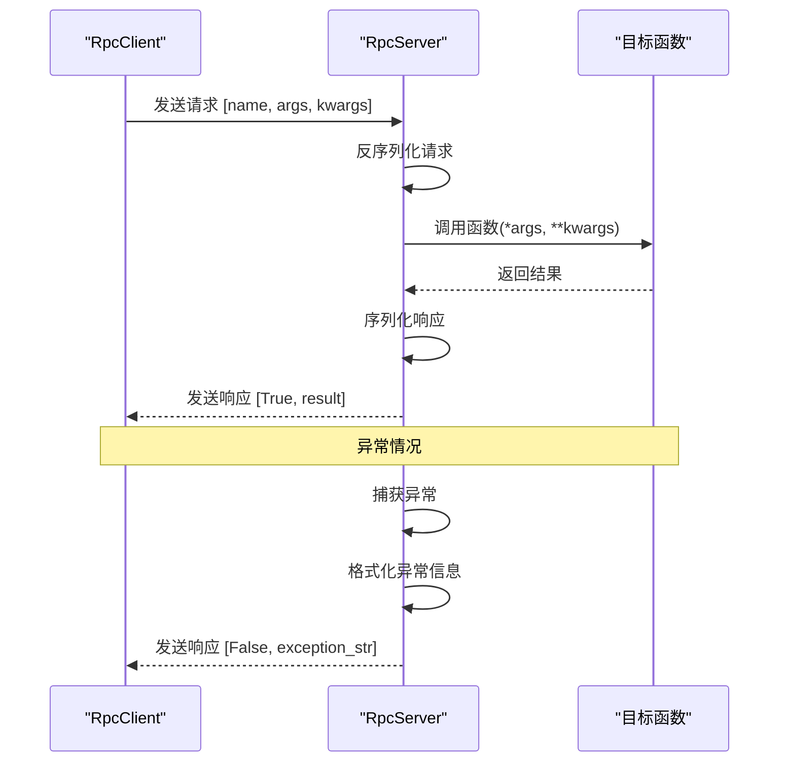
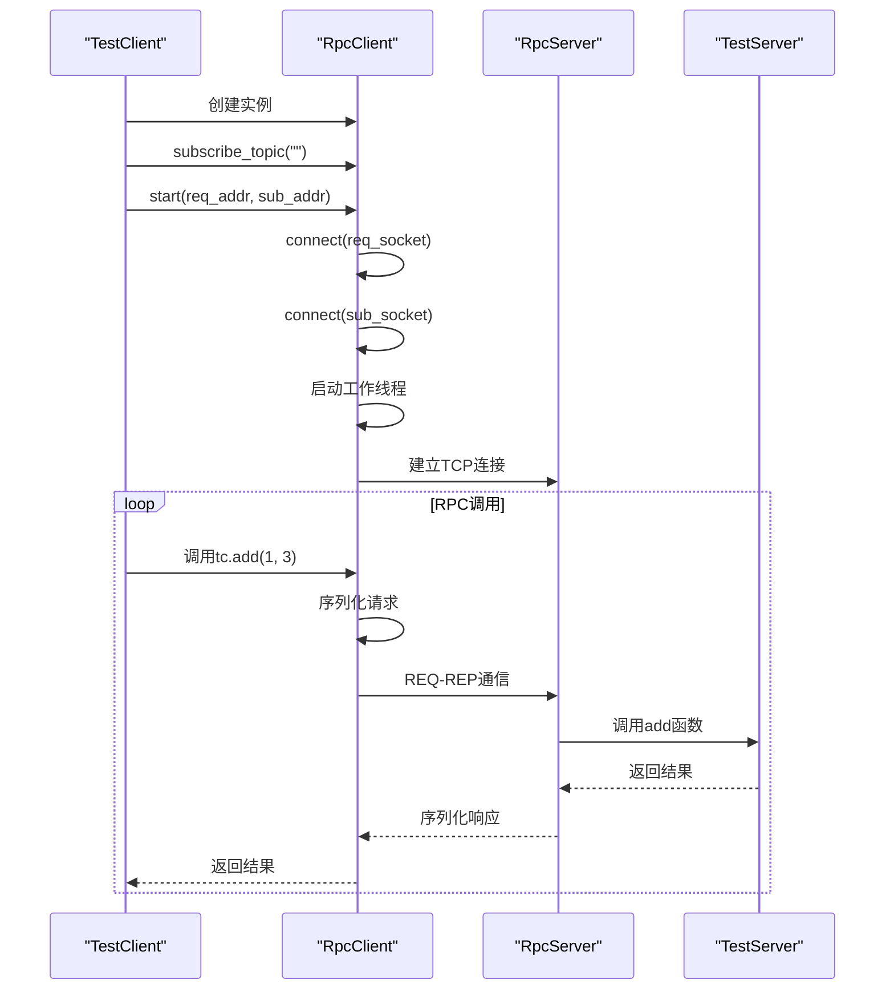

# RPC通信系统

<cite>
**本文档引用的文件**
- [vnpy/rpc/client.py](file://vnpy/rpc/client.py)
- [vnpy/rpc/server.py](file://vnpy/rpc/server.py)
- [vnpy/rpc/common.py](file://vnpy/rpc/common.py)
- [vnpy/rpc/__init__.py](file://vnpy/rpc/__init__.py)
- [examples/simple_rpc/test_client.py](file://examples/simple_rpc/test_client.py)
- [examples/simple_rpc/test_server.py](file://examples/simple_rpc/test_server.py)
- [README.md](file://README.md)
- [vnpy/trader/setting.py](file://vnpy/trader/setting.py)
</cite>

## 目录
1. [简介](#简介)
2. [项目结构](#项目结构)
3. [核心组件](#核心组件)
4. [架构概览](#架构概览)
5. [详细组件分析](#详细组件分析)
6. [消息协议与序列化](#消息协议与序列化)
7. [客户端-服务器通信](#客户端-服务器通信)
8. [错误处理与异常恢复](#错误处理与异常恢复)
9. [分布式部署配置](#分布式部署配置)
10. [性能优化与基准测试](#性能优化与基准测试)
11. [扩展开发指南](#扩展开发指南)
12. [故障排除指南](#故障排除指南)
13. [总结](#总结)

## 简介

VeighNa RPC通信系统是一个基于ZeroMQ（ZMQ）实现的远程过程调用（RPC）框架，专为量化交易平台设计。该系统提供了高效的跨进程通信能力，支持分布式架构部署，能够实现客户端-服务器模式的远程函数调用。

系统采用双模式通信架构：
- **请求-响应模式（REQ-REP）**：用于同步的RPC调用
- **发布-订阅模式（PUB-SUB）**：用于异步数据推送和心跳检测

该RPC系统具有以下核心特性：
- 基于ZeroMQ的高性能网络通信
- 支持函数动态注册和调用
- 自动的心跳检测和连接监控
- 异常处理和超时控制
- 线程安全的并发处理
- 可扩展的分布式部署

## 项目结构

RPC模块位于`vnpy/rpc/`目录下，包含以下核心文件：



**图表来源**
- [vnpy/rpc/client.py](file://vnpy/rpc/client.py#L1-L170)
- [vnpy/rpc/server.py](file://vnpy/rpc/server.py#L1-L141)
- [vnpy/rpc/common.py](file://vnpy/rpc/common.py#L1-L11)

**章节来源**
- [vnpy/rpc/__init__.py](file://vnpy/rpc/__init__.py#L1-L7)
- [vnpy/rpc/client.py](file://vnpy/rpc/client.py#L1-L170)
- [vnpy/rpc/server.py](file://vnpy/rpc/server.py#L1-L141)

## 核心组件

RPC系统由三个核心组件构成：

### 1. RpcClient（客户端）
负责发起RPC调用，管理与服务器的连接状态，处理异步数据推送。

### 2. RpcServer（服务器）
负责接收和处理RPC请求，管理可调用函数列表，提供数据发布功能。

### 3. 公共配置模块
定义系统常量和通用设置，包括心跳检测参数。

**章节来源**
- [vnpy/rpc/client.py](file://vnpy/rpc/client.py#L25-L170)
- [vnpy/rpc/server.py](file://vnpy/rpc/server.py#L10-L141)
- [vnpy/rpc/common.py](file://vnpy/rpc/common.py#L1-L11)

## 架构概览

RPC系统采用分层架构设计，结合ZeroMQ的多种消息模式：

```mermaid
graph TB
subgraph "客户端层"
A[TestClient<br/>测试客户端] --> B[RpcClient<br/>基础客户端]
B --> C[RemoteException<br/>异常处理]
end
subgraph "服务器层"
D[TestServer<br/>测试服务器] --> E[RpcServer<br/>基础服务器]
E --> F[函数注册表<br/>_functions]
end
subgraph "网络层"
G[REQ-REP Socket<br/>请求响应] < --> H[PUB-SUB Socket<br/>发布订阅]
I[TCP连接<br/>传输层] --> G
I --> H
end
subgraph "配置层"
J[common.py<br/>配置常量]
K[心跳检测<br/>HEARTBEAT_*]
end
A -.-> D
B --> G
E --> H
J --> K
K --> B
K --> E
```

**图表来源**
- [examples/simple_rpc/test_client.py](file://examples/simple_rpc/test_client.py#L1-L35)
- [examples/simple_rpc/test_server.py](file://examples/simple_rpc/test_server.py#L1-L39)
- [vnpy/rpc/client.py](file://vnpy/rpc/client.py#L25-L45)
- [vnpy/rpc/server.py](file://vnpy/rpc/server.py#L10-L35)

## 详细组件分析

### RpcClient 客户端组件

RpcClient是RPC系统的核心客户端组件，提供了完整的远程过程调用功能：



**图表来源**
- [vnpy/rpc/client.py](file://vnpy/rpc/client.py#L25-L170)

#### 关键特性

1. **动态方法调用**：通过`__getattr__`魔术方法实现动态RPC调用
2. **线程安全**：使用锁机制保护并发访问
3. **心跳监控**：自动检测连接状态
4. **异常处理**：自定义异常类处理远程错误

#### 实现原理

客户端通过LRU缓存机制缓存动态生成的RPC调用函数，避免重复创建：

```python
@lru_cache(100)
def __getattr__(self, name: str) -> Any:
    def dorpc(*args: Any, **kwargs: Any) -> Any:
        # RPC调用逻辑
        pass
    return dorpc
```

**章节来源**
- [vnpy/rpc/client.py](file://vnpy/rpc/client.py#L52-L85)

### RpcServer 服务器组件

RpcServer负责处理客户端的RPC请求，提供函数注册和数据发布功能：



**图表来源**
- [vnpy/rpc/server.py](file://vnpy/rpc/server.py#L10-L141)

#### 函数注册机制

服务器通过字典存储可调用函数，支持动态注册：

```python
def register(self, func: Callable) -> None:
    self._functions[func.__name__] = func
```

#### 心跳检测机制

服务器定时发送心跳信号，客户端通过轮询检测连接状态：

```python
def check_heartbeat(self) -> None:
    now: float = time()
    if self._heartbeat_at and now >= self._heartbeat_at:
        self.publish(HEARTBEAT_TOPIC, now)
        self._heartbeat_at = now + HEARTBEAT_INTERVAL
```

**章节来源**
- [vnpy/rpc/server.py](file://vnpy/rpc/server.py#L115-L141)

## 消息协议与序列化

RPC系统使用Python的`pickle`模块进行对象序列化，支持复杂的Python对象传输：

### 请求消息格式

客户端发送的RPC请求采用以下格式：
```python
request = [function_name, args, kwargs]
```

### 响应消息格式

服务器返回的RPC响应采用以下格式：
```python
response = [success_flag, result_or_exception]
```

### 序列化流程



**图表来源**
- [vnpy/rpc/client.py](file://vnpy/rpc/client.py#L60-L85)
- [vnpy/rpc/server.py](file://vnpy/rpc/server.py#L75-L95)

**章节来源**
- [vnpy/rpc/client.py](file://vnpy/rpc/client.py#L60-L85)
- [vnpy/rpc/server.py](file://vnpy/rpc/server.py#L75-L95)

## 客户端-服务器通信

### 连接建立流程



**图表来源**
- [examples/simple_rpc/test_client.py](file://examples/simple_rpc/test_client.py#L20-L35)
- [examples/simple_rpc/test_server.py](file://examples/simple_rpc/test_server.py#L20-L39)

### 数据推送机制

服务器可以主动向客户端推送数据：

```python
# 服务器端推送
ts.publish("test", content)

# 客户端接收
def callback(self, topic: str, data: Any) -> None:
    print(f"client received topic:{topic}, data:{data}")
```

**章节来源**
- [examples/simple_rpc/test_client.py](file://examples/simple_rpc/test_client.py#L15-L20)
- [examples/simple_rpc/test_server.py](file://examples/simple_rpc/test_server.py#L30-L35)

## 错误处理与异常恢复

### 异常类型

系统定义了专门的异常类处理远程调用错误：

```python
class RemoteException(Exception):
    def __init__(self, value: Any) -> None:
        self._value: Any = value
    
    def __str__(self) -> str:
        return str(self._value)
```

### 超时处理

客户端设置了30秒的默认超时时间：

```python
timeout: int = kwargs.pop("timeout", 30000)  # 30秒
n: int = self._socket_req.poll(timeout)
if not n:
    msg: str = f"Timeout of {timeout}ms reached for {req}"
    raise RemoteException(msg)
```

### 连接监控

系统实现了心跳检测机制，自动识别断开连接：

```python
def on_disconnected(self) -> None:
    msg: str = f"RpcServer has no response over {HEARTBEAT_TOLERANCE} seconds, please check you connection."
    print(msg)
```

**章节来源**
- [vnpy/rpc/client.py](file://vnpy/rpc/client.py#L10-L25)
- [vnpy/rpc/client.py](file://vnpy/rpc/client.py#L65-L75)
- [vnpy/rpc/client.py](file://vnpy/rpc/client.py#L160-L165)

## 分布式部署配置

### 网络配置参数

系统通过配置文件定义关键参数：

```python
HEARTBEAT_TOPIC = "heartbeat"
HEARTBEAT_INTERVAL = 10  # 秒
HEARTBEAT_TOLERANCE = 30  # 秒
```

### 地址绑定模式

服务器支持不同的网络绑定模式：

```python
# 本地测试
rep_address = "tcp://localhost:2014"
pub_address = "tcp://localhost:4102"

# 网络部署
rep_address = "tcp://*:2014"  # 监听所有接口
pub_address = "tcp://*:4102"
```

### 安全考虑

1. **TCP Keep-Alive**：启用TCP连接保活机制
2. **超时控制**：防止长时间阻塞
3. **异常隔离**：捕获并处理函数执行异常
4. **资源清理**：确保连接正常关闭

**章节来源**
- [vnpy/rpc/common.py](file://vnpy/rpc/common.py#L6-L11)
- [examples/simple_rpc/test_server.py](file://examples/simple_rpc/test_server.py#L20-L25)

## 性能优化与基准测试

### ZeroMQ配置优化

客户端启用了TCP Keep-Alive选项：

```python
for socket in [self._socket_req, self._socket_sub]:
    socket.setsockopt(zmq.TCP_KEEPALIVE, 1)
    socket.setsockopt(zmq.TCP_KEEPALIVE_IDLE, 60)
```

### 并发处理

- 使用线程池处理异步数据
- LRU缓存动态生成的RPC函数
- 线程安全的锁机制

### 网络延迟优化

1. **心跳间隔**：10秒发送一次心跳
2. **容忍时间**：30秒未收到心跳视为断开
3. **轮询超时**：订阅端使用30秒超时

### 性能基准测试建议

1. **吞吐量测试**：测量每秒RPC调用次数
2. **延迟测试**：测量请求-响应往返时间
3. **并发测试**：测试多客户端同时连接
4. **稳定性测试**：长时间运行稳定性验证

**章节来源**
- [vnpy/rpc/client.py](file://vnpy/rpc/client.py#L35-L40)

## 扩展开发指南

### 自定义RPC接口扩展

开发者可以通过继承基类创建自定义RPC服务：

```python
class CustomRpcServer(RpcServer):
    def __init__(self):
        super().__init__()
        self.register(self.custom_function)
    
    def custom_function(self, param1, param2):
        # 自定义业务逻辑
        return result
```

### 新功能注册

```python
def register_custom_functions(server):
    server.register(function1)
    server.register(function2)
    # 注册更多函数...
```

### 数据推送扩展

```python
def publish_custom_data(server, topic, data):
    server.publish(topic, data)
```

### 错误处理扩展

```python
class CustomRpcClient(RpcClient):
    def callback(self, topic: str, data: Any) -> None:
        try:
            # 处理接收到的数据
            pass
        except Exception as e:
            # 自定义错误处理
            self.handle_error(e)
```

**章节来源**
- [examples/simple_rpc/test_server.py](file://examples/simple_rpc/test_server.py#L10-L20)
- [examples/simple_rpc/test_client.py](file://examples/simple_rpc/test_client.py#L10-L20)

## 故障排除指南

### 常见问题诊断

1. **连接超时**
   - 检查网络连通性
   - 验证端口是否被占用
   - 确认防火墙设置

2. **函数调用失败**
   - 检查函数是否正确注册
   - 验证参数类型和数量
   - 查看服务器日志

3. **心跳丢失**
   - 检查网络稳定性
   - 验证服务器负载
   - 调整心跳参数

### 调试技巧

1. **启用详细日志**
```python
import logging
logging.basicConfig(level=logging.DEBUG)
```

2. **监控网络连接**
```python
# 检查连接状态
print(f"Active: {client.is_active()}")
print(f"Last ping: {client._last_received_ping}")
```

3. **测试基本功能**
```python
# 测试连接
try:
    result = client.test_function()
    print(f"Test successful: {result}")
except Exception as e:
    print(f"Test failed: {e}")
```

### 性能监控

1. **连接状态监控**
2. **响应时间统计**
3. **错误率跟踪**
4. **资源使用情况**

**章节来源**
- [vnpy/rpc/client.py](file://vnpy/rpc/client.py#L160-L165)

## 总结

VeighNa RPC通信系统是一个功能完善、设计精良的远程过程调用框架，具有以下优势：

### 技术特点
- 基于ZeroMQ的高性能网络通信
- 支持同步和异步通信模式
- 完善的错误处理和异常恢复机制
- 线程安全的并发处理能力

### 应用价值
- 支持分布式量化交易平台架构
- 提供灵活的扩展接口
- 具备良好的可维护性和可扩展性
- 适用于各种规模的量化交易系统

### 发展方向
- 支持更多的序列化协议
- 增强安全认证机制
- 优化大规模集群部署
- 提供更丰富的监控和管理功能

该RPC系统为VeighNa量化交易平台提供了坚实的通信基础设施，是构建现代量化交易系统的重要组成部分。通过合理的配置和使用，可以满足各种复杂的业务需求，为量化交易策略的开发和部署提供强有力的支持。