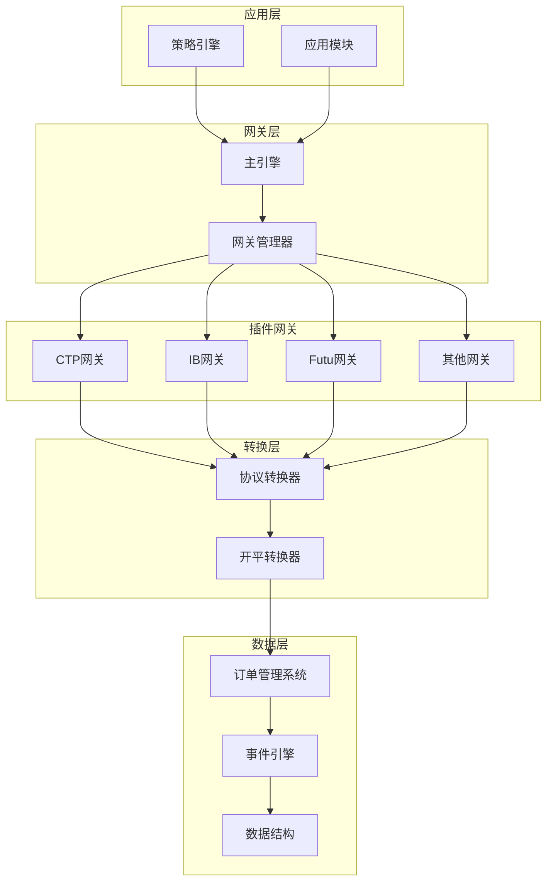
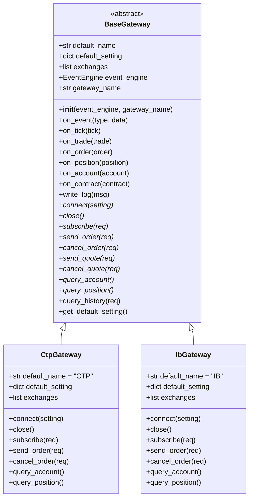
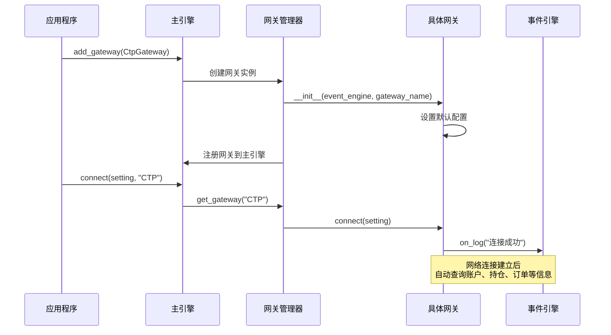
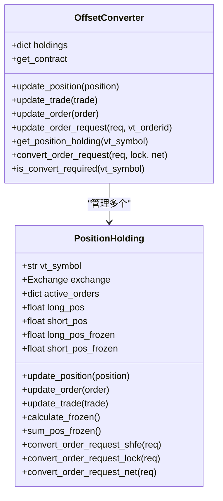
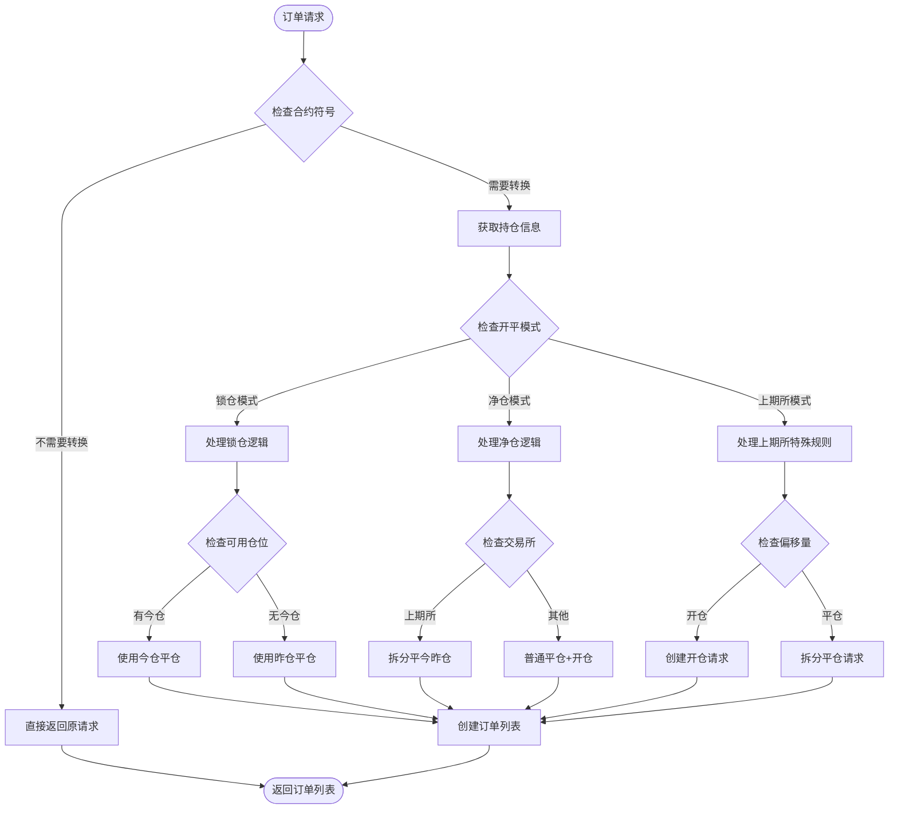
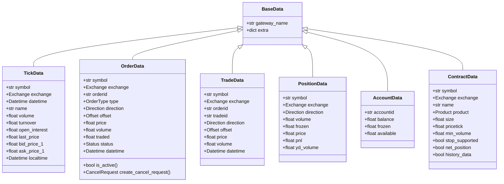
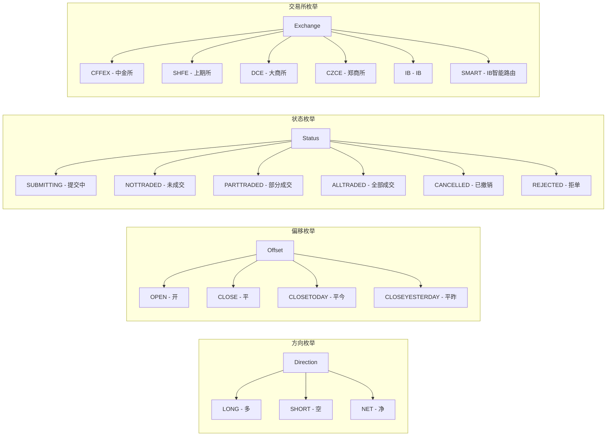
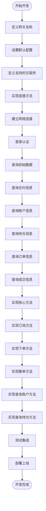
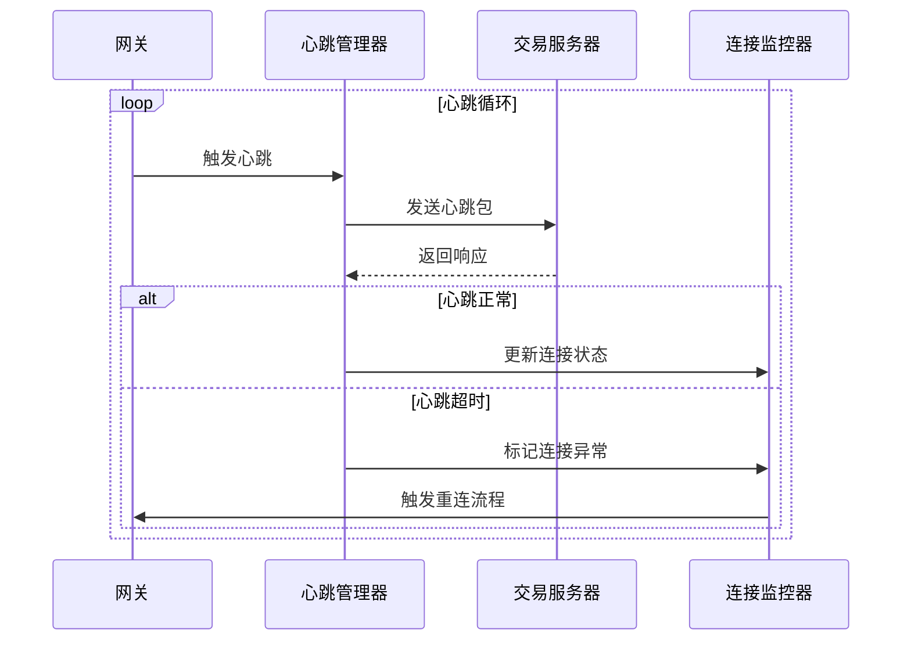
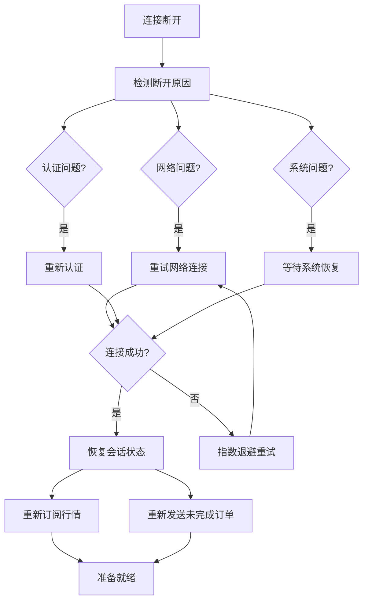

# 交易接口网关架构详解

<cite>
**本文档引用的文件**
- [gateway.py](file://vnpy/trader/gateway.py)
- [converter.py](file://vnpy/trader/converter.py)
- [constant.py](file://vnpy/trader/constant.py)
- [object.py](file://vnpy/trader/object.py)
- [engine.py](file://vnpy/trader/engine.py)
- [README.md](file://README.md)
</cite>

## 目录
1. [简介](#简介)
2. [核心架构概览](#核心架构概览)
3. [BaseGateway抽象基类设计](#basegateway抽象基类设计)
4. [插件式网关架构](#插件式网关架构)
5. [协议转换器系统](#协议转换器系统)
6. [数据结构与枚举定义](#数据结构与枚举定义)
7. [开发新网关插件指南](#开发新网关插件指南)
8. [稳定性保障措施](#稳定性保障措施)
9. [总结](#总结)

## 简介

VeighNa交易接口网关是一个高度模块化的交易接口框架，采用插件式架构设计，能够无缝对接不同的交易所和交易系统。该架构通过标准化的接口设计，实现了不同API之间的协议转换，为上层策略引擎提供了统一的交易接口。

本文档将深入解析该网关架构的设计原理，重点阐述如何通过标准化接口实现对不同交易所（如CTP、IB、Futu等）的统一接入，以及converter.py在协议转换中的关键作用。

## 核心架构概览



**图表来源**
- [engine.py](file://vnpy/trader/engine.py#L60-L120)
- [gateway.py](file://vnpy/trader/gateway.py#L32-L80)

## BaseGateway抽象基类设计

BaseGateway是整个网关架构的核心抽象基类，定义了所有交易接口必须遵循的标准接口规范。



**图表来源**
- [gateway.py](file://vnpy/trader/gateway.py#L32-L273)

### 核心设计原则

1. **线程安全**: 所有方法都必须是线程安全的，确保多线程环境下的正确性
2. **非阻塞**: 所有方法都应该是非阻塞的，避免影响事件循环
3. **自动重连**: 网络连接断开后能够自动重新建立连接
4. **事件驱动**: 通过事件机制传递交易数据，而不是轮询

**章节来源**
- [gateway.py](file://vnpy/trader/gateway.py#L20-L30)

## 插件式网关架构

### 网关注册与管理



**图表来源**
- [engine.py](file://vnpy/trader/engine.py#L101-L120)
- [gateway.py](file://vnpy/trader/gateway.py#L130-L150)

### 网关生命周期管理

每个网关实例都有完整的生命周期管理：

1. **初始化阶段**: 设置默认配置和事件回调
2. **连接阶段**: 建立与交易系统的连接
3. **数据同步**: 查询初始账户、持仓、合约等信息
4. **运行阶段**: 处理实时行情和交易数据
5. **关闭阶段**: 安全断开连接并清理资源

**章节来源**
- [engine.py](file://vnpy/trader/engine.py#L220-L250)

## 协议转换器系统

### OffsetConverter开平转换器

OffsetConverter是协议转换系统的核心组件，负责处理不同交易所的开平仓模式差异。



**图表来源**
- [converter.py](file://vnpy/trader/converter.py#L15-L403)

### 开平转换逻辑

不同交易所的开平仓模式存在显著差异，OffsetConverter通过以下策略处理：



**图表来源**
- [converter.py](file://vnpy/trader/converter.py#L150-L300)

**章节来源**
- [converter.py](file://vnpy/trader/converter.py#L1-L403)

## 数据结构与枚举定义

### 核心数据结构



**图表来源**
- [object.py](file://vnpy/trader/object.py#L15-L428)

### 枚举类型定义

系统定义了完整的枚举类型体系：



**图表来源**
- [constant.py](file://vnpy/trader/constant.py#L1-L161)

**章节来源**
- [constant.py](file://vnpy/trader/constant.py#L1-L161)
- [object.py](file://vnpy/trader/object.py#L1-L428)

## 开发新网关插件指南

### 网关开发步骤



### 核心方法实现示例

以下是开发一个新网关的基本框架：

```python
from vnpy.trader.gateway import BaseGateway
from vnpy.trader.object import (
    TickData, OrderData, TradeData, PositionData,
    AccountData, ContractData, OrderRequest, CancelRequest,
    SubscribeRequest, HistoryRequest
)

class CustomGateway(BaseGateway):
    """自定义交易接口"""
    
    default_name = "CUSTOM"
    
    default_setting = {
        "服务器地址": "localhost",
        "端口": 8080,
        "用户名": "",
        "密码": "",
    }
    
    exchanges = [Exchange.SSE, Exchange.SZSE]
    
    def __init__(self, event_engine, gateway_name):
        super().__init__(event_engine, gateway_name)
        self.api = None
    
    def connect(self, setting: dict) -> None:
        """连接交易系统"""
        server = setting["服务器地址"]
        port = setting["端口"]
        username = setting["用户名"]
        password = setting["密码"]
        
        # 建立连接
        self.api = CustomApi(self)
        self.api.connect(server, port, username, password)
        
        self.write_log("开始连接交易接口")
        
        # 连接成功后查询初始数据
        self.query_contract()
        self.query_account()
        self.query_position()
        self.query_order()
    
    def subscribe(self, req: SubscribeRequest) -> None:
        """订阅行情"""
        self.api.subscribe(req.symbol)
    
    def send_order(self, req: OrderRequest) -> str:
        """发送订单"""
        # 创建订单数据
        order = req.create_order_data(self.generate_order_id(), self.gateway_name)
        order.status = Status.SUBMITTING
        self.on_order(order)
        
        # 发送订单到服务器
        vt_orderid = self.api.send_order(req)
        
        return vt_orderid
    
    def cancel_order(self, req: CancelRequest) -> None:
        """撤销订单"""
        self.api.cancel_order(req.orderid)
```

### 连接管理最佳实践

1. **连接状态管理**: 维护连接状态，及时检测连接断开
2. **自动重连机制**: 实现指数退避的重连策略
3. **心跳检测**: 定期发送心跳包保持连接活跃
4. **错误处理**: 完善的异常捕获和错误恢复机制

**章节来源**
- [gateway.py](file://vnpy/trader/gateway.py#L130-L273)

## 稳定性保障措施

### 心跳机制与连接监控



### 错误码处理策略

系统定义了完善的错误码处理机制：

1. **网络错误**: 自动重试和连接恢复
2. **认证错误**: 提示用户重新登录
3. **参数错误**: 参数验证和错误提示
4. **系统错误**: 降级处理和备用方案

### 会话恢复策略



### 数据一致性保障

1. **幂等性处理**: 确保重复请求不会产生副作用
2. **状态同步**: 定期同步账户和持仓状态
3. **数据校验**: 完善的数据完整性检查
4. **异常补偿**: 异常情况下的数据补偿机制

**章节来源**
- [engine.py](file://vnpy/trader/engine.py#L250-L280)

## 总结

VeighNa交易接口网关架构通过以下核心设计实现了高效的插件式交易接口管理：

1. **标准化接口设计**: BaseGateway抽象基类确保所有网关实现一致的接口规范
2. **协议转换机制**: OffsetConverter处理不同交易所的开平仓模式差异
3. **事件驱动架构**: 基于事件引擎的异步数据处理模式
4. **插件化扩展**: 支持灵活的网关插件开发和部署
5. **稳定性保障**: 完善的心跳机制、错误处理和会话恢复策略

这种架构设计使得开发者能够快速开发新的交易接口插件，同时保证了系统的稳定性和可维护性。通过统一的接口规范和协议转换机制，系统能够无缝对接国内外主流的交易接口，为量化交易策略的开发提供了强大的基础设施支持。