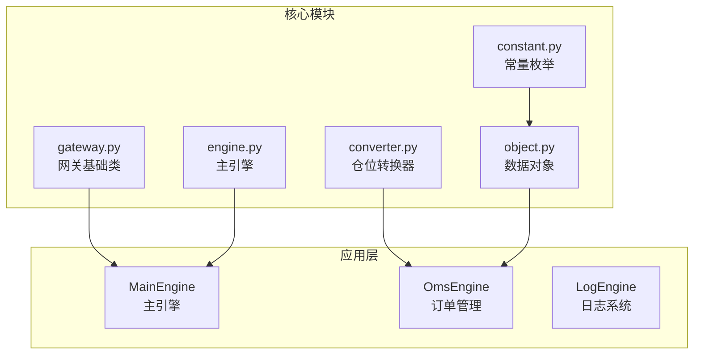
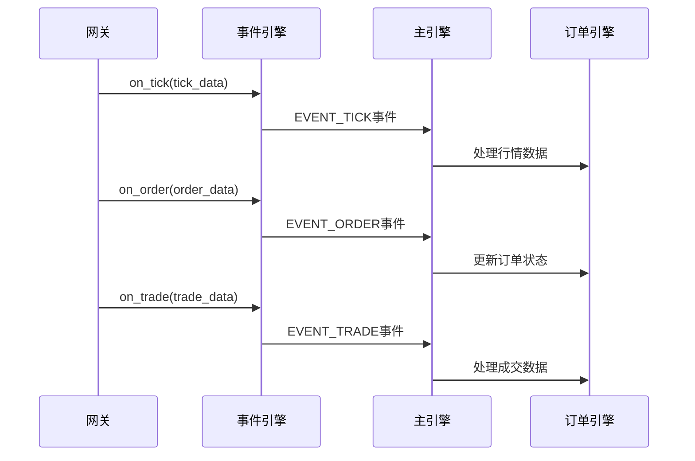
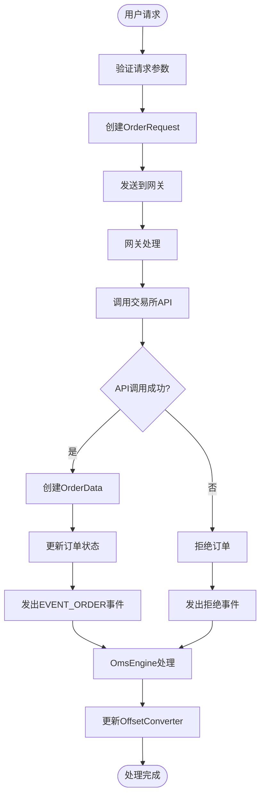
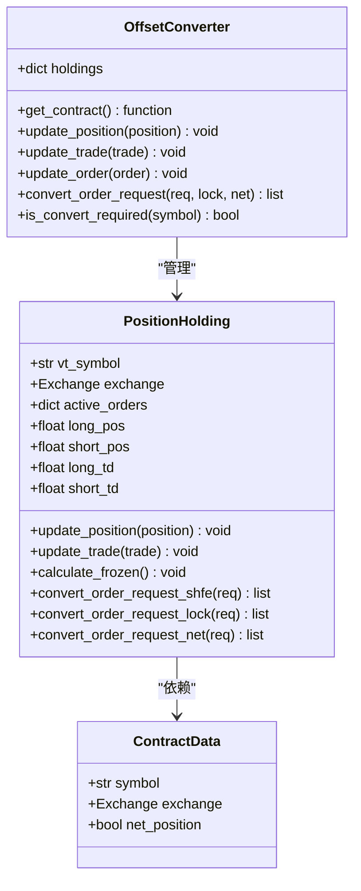
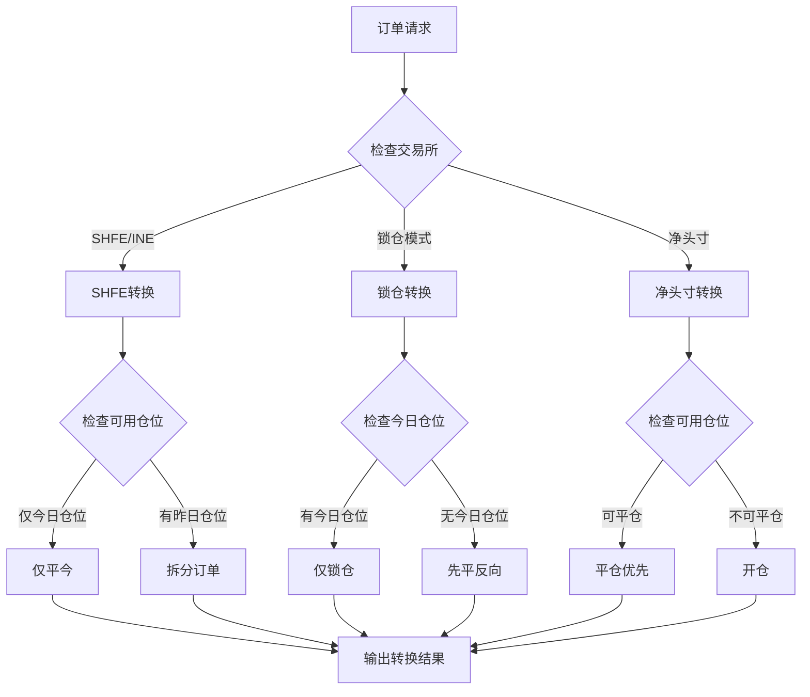
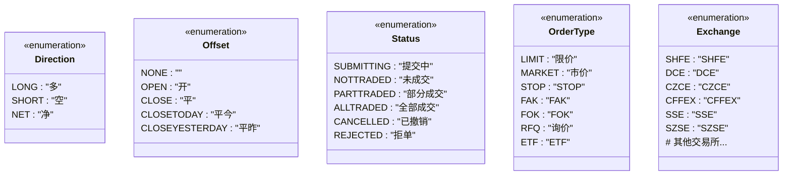
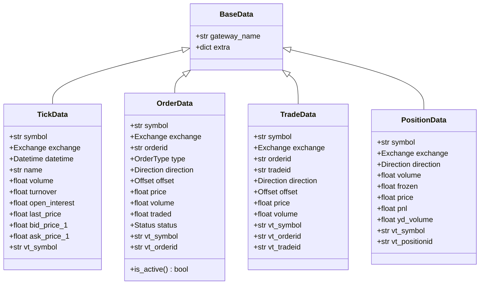
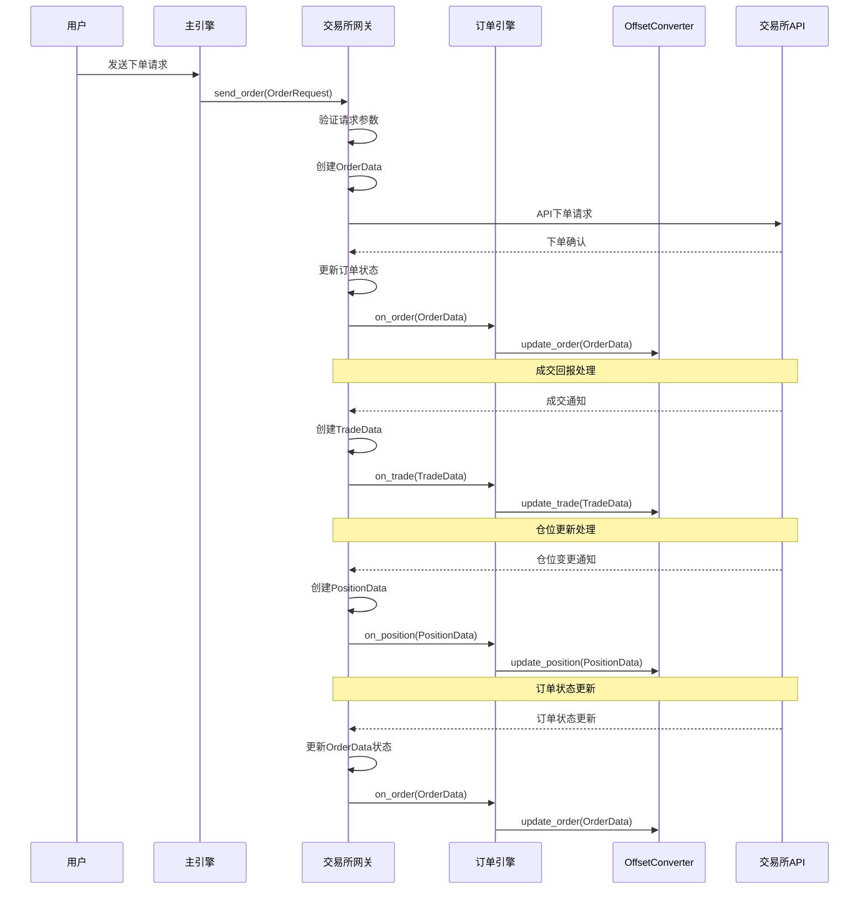
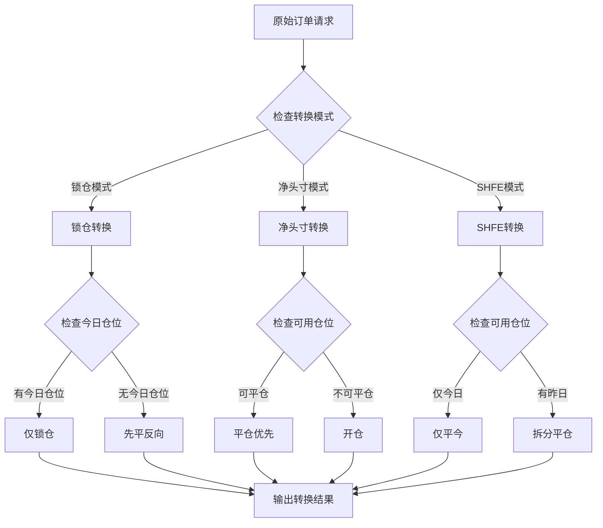

# 网关核心组件解析

<cite>
**本文档引用的文件**
- [gateway.py](file://vnpy/trader/gateway.py)
- [converter.py](file://vnpy/trader/converter.py)
- [constant.py](file://vnpy/trader/constant.py)
- [engine.py](file://vnpy/trader/engine.py)
- [object.py](file://vnpy/trader/object.py)
</cite>

## 目录
1. [简介](#简介)
2. [项目结构概览](#项目结构概览)
3. [网关核心组件](#网关核心组件)
4. [请求/响应消息处理流程](#请求响应消息处理流程)
5. [OffsetConverter实现逻辑](#offsetconverter实现逻辑)
6. [交易域模型标准化建模](#交易域模型标准化建模)
7. [数据流图](#数据流图)
8. [性能考虑](#性能考虑)
9. [故障排除指南](#故障排除指南)
10. [结论](#结论)

## 简介

vn.py是一个高性能的量化交易平台，其核心架构围绕网关系统设计，实现了对多个交易所和交易系统的统一接入。本文档深入解析vn.py网关核心组件的工作原理，重点关注三个关键方面：请求/响应消息处理流程、OffsetConverter的开平仓标记转换机制，以及交易域模型的标准化建模方式。

该系统采用事件驱动架构，通过抽象基类定义统一接口，支持多种交易所API的无缝集成。核心组件包括BaseGateway抽象类、OmsEngine订单管理系统、OffsetConverter仓位转换器和标准化常量枚举等。

## 项目结构概览

vn.py项目采用模块化设计，核心交易功能集中在`vnpy/trader`包中：



**图表来源**
- [gateway.py](file://vnpy/trader/gateway.py#L1-L273)
- [engine.py](file://vnpy/trader/engine.py#L1-L620)
- [converter.py](file://vnpy/trader/converter.py#L1-L403)

## 网关核心组件

### BaseGateway抽象类

BaseGateway是所有交易网关的基础抽象类，定义了统一的接口规范：

```python
class BaseGateway(ABC):
    """
    抽象网关类，用于创建连接到不同交易系统的网关。
    
    实现要求：
    * 线程安全：所有方法必须线程安全
    * 非阻塞：所有方法不应阻塞
    * 自动重连：连接丢失时自动重新连接
    """
    
    # 默认名称
    default_name: str = ""
    
    # 连接设置字段
    default_setting: dict[str, str | int | float | bool] = {}
    
    # 支持的交易所列表
    exchanges: list[Exchange] = []
```

### 核心回调机制

网关通过事件驱动的方式处理各种数据更新：



**图表来源**
- [gateway.py](file://vnpy/trader/gateway.py#L60-L130)
- [engine.py](file://vnpy/trader/engine.py#L350-L400)

**章节来源**
- [gateway.py](file://vnpy/trader/gateway.py#L30-L130)

## 请求/响应消息处理流程

### 消息处理架构

vn.py采用分层的消息处理架构，从原始API消息到标准化对象的完整转换过程：



**图表来源**
- [gateway.py](file://vnpy/trader/gateway.py#L188-L224)
- [engine.py](file://vnpy/trader/engine.py#L240-L280)

### 具体处理步骤

1. **请求验证阶段**：检查OrderRequest的有效性
2. **对象创建阶段**：使用OrderRequest.create_order_data()创建标准化OrderData对象
3. **唯一标识分配**：为订单分配唯一的vt_orderid
4. **API调用阶段**：向交易所服务器发送下单请求
5. **状态更新阶段**：根据API响应更新订单状态
6. **事件传播阶段**：通过事件引擎传播订单更新

### 网关方法实现

```python
def send_order(self, req: OrderRequest) -> str:
    """
    发送新订单到服务器
    
    实现应完成以下任务：
    * 从req创建OrderData
    * 分配唯一的订单ID
    * 发送请求到服务器
    * 响应on_order回调
    * 返回vt_orderid
    """
    # 创建订单数据
    order: OrderData = req.create_order_data(orderid, gateway_name)
    
    # 设置初始状态
    order.status = Status.SUBMITTING
    
    # 发送API请求
    # ...
    
    # 响应事件
    self.on_order(order)
    
    return order.vt_orderid
```

**章节来源**
- [gateway.py](file://vnpy/trader/gateway.py#L188-L224)
- [engine.py](file://vnpy/trader/engine.py#L240-L280)

## OffsetConverter实现逻辑

### OffsetConverter架构

OffsetConverter是vn.py的核心转换器，负责将不同交易所的开平仓标记统一映射为vn.py内部标准：



**图表来源**
- [converter.py](file://vnpy/trader/converter.py#L15-L403)

### 开平仓标记转换机制

OffsetConverter支持三种转换模式：

1. **SHFE模式**（上期所）：区分平今和平昨
2. **锁仓模式**：仅支持开仓或锁仓
3. **净头寸模式**：不区分开平仓



**图表来源**
- [converter.py](file://vnpy/trader/converter.py#L300-L403)

### 具体转换算法

以SHFE交易所为例，OffsetConverter实现了复杂的仓位管理逻辑：

```python
def convert_order_request_shfe(self, req: OrderRequest) -> list[OrderRequest]:
    """
    SHFE交易所的订单请求转换
    
    规则：
    1. 开仓直接返回原请求
    2. 平仓优先使用今日仓位
    3. 不足部分使用昨日仓位
    """
    if req.offset == Offset.OPEN:
        return [req]
    
    # 计算可用仓位
    pos_available = self.short_pos - self.short_pos_frozen
    td_available = self.short_td - self.short_td_frozen
    
    if req.volume > pos_available:
        return []  # 可用仓位不足
    elif req.volume <= td_available:
        # 仅使用今日仓位
        req_td = copy(req)
        req_td.offset = Offset.CLOSETODAY
        return [req_td]
    else:
        # 拆分订单
        req_list = []
        
        if td_available > 0:
            req_td = copy(req)
            req_td.offset = Offset.CLOSETODAY
            req_td.volume = td_available
            req_list.append(req_td)
        
        req_yd = copy(req)
        req_yd.offset = Offset.CLOSEYESTERDAY
        req_yd.volume = req.volume - td_available
        req_list.append(req_yd)
        
        return req_list
```

**章节来源**
- [converter.py](file://vnpy/trader/converter.py#L150-L200)
- [converter.py](file://vnpy/trader/converter.py#L300-L403)

## 交易域模型标准化建模

### 枚举类型定义

vn.py通过枚举类型实现标准化的交易域模型：



**图表来源**
- [constant.py](file://vnpy/trader/constant.py#L1-L161)

### 数据对象标准化

vn.py定义了一系列标准化的数据对象，确保跨市场的数据一致性：



**图表来源**
- [object.py](file://vnpy/trader/object.py#L1-L200)

### 虚拟标识符系统

vn.py采用虚拟标识符（vt_symbol）系统，确保跨市场的唯一性：

```python
# 虚拟符号格式：symbol.exchange_value
# 示例：IF.CFFEX 表示中金所的沪深300股指期货
#       cu.SHFE 表示上期所的铜期货

@property
def vt_symbol(self) -> str:
    """生成虚拟符号"""
    return f"{self.symbol}.{self.exchange.value}"

@property
def vt_orderid(self) -> str:
    """生成虚拟订单ID"""
    return f"{self.gateway_name}.{self.orderid}"
```

**章节来源**
- [constant.py](file://vnpy/trader/constant.py#L1-L161)
- [object.py](file://vnpy/trader/object.py#L1-L200)

## 数据流图

### 完整数据转换流程



**图表来源**
- [engine.py](file://vnpy/trader/engine.py#L350-L400)
- [gateway.py](file://vnpy/trader/gateway.py#L188-L224)

### 转换器工作流程



**图表来源**
- [converter.py](file://vnpy/trader/converter.py#L350-L403)

## 性能考虑

### 异步处理机制

vn.py采用异步事件驱动架构，确保高并发性能：

1. **事件队列**：使用线程安全的队列处理事件
2. **非阻塞IO**：所有网络操作均为异步
3. **批量处理**：支持批量数据更新优化吞吐量
4. **内存池**：复用对象减少GC压力

### 内存管理策略

```python
# 使用dataclass减少内存占用
@dataclass
class OrderData(BaseData):
    """订单数据对象"""
    symbol: str
    exchange: Exchange
    orderid: str
    type: OrderType = OrderType.LIMIT
    direction: Direction | None = None
    offset: Offset = Offset.NONE
    price: float = 0
    volume: float = 0
    traded: float = 0
    status: Status = Status.SUBMITTING
    datetime: Datetime | None = None
    reference: str = ""
```

### 缓存优化

OffsetConverter通过缓存机制提高转换效率：

- **合约信息缓存**：避免重复查询合约属性
- **仓位信息缓存**：快速访问持仓状态
- **活跃订单缓存**：实时跟踪订单状态

## 故障排除指南

### 常见问题诊断

1. **订单转换失败**
   - 检查交易所是否支持锁仓/净头寸模式
   - 验证可用仓位是否充足
   - 确认OffsetConverter初始化正确

2. **数据同步延迟**
   - 检查网络连接稳定性
   - 验证事件引擎运行状态
   - 监控内存使用情况

3. **异常订单状态**
   - 检查API响应完整性
   - 验证订单ID唯一性
   - 确认状态转换逻辑

### 调试工具

```python
# 启用调试日志
from vnpy.trader.logger import logger
logger.setLevel(DEBUG)

# 检查转换器状态
converter = oms_engine.get_converter(gateway_name)
holdings = converter.holdings

# 查看活跃订单
active_orders = oms_engine.get_all_active_orders()
```

**章节来源**
- [engine.py](file://vnpy/trader/engine.py#L350-L400)
- [converter.py](file://vnpy/trader/converter.py#L150-L200)

## 结论

vn.py的网关核心组件通过精心设计的架构实现了高效的跨市场交易系统。主要特点包括：

1. **统一接口设计**：BaseGateway抽象类提供了标准化的网关接口
2. **智能转换机制**：OffsetConverter灵活适配不同交易所的开平仓规则
3. **标准化数据模型**：通过枚举和数据类确保跨市场的数据一致性
4. **高性能架构**：事件驱动和异步处理保证了系统的高并发能力

这种设计不仅简化了多交易所接入的复杂性，还为开发者提供了清晰的扩展路径。OffsetConverter作为核心转换器，在保持灵活性的同时确保了交易行为的一致性，是vn.py系统能够支持多种交易场景的关键所在。

通过深入理解这些核心组件的工作原理，开发者可以更好地利用vn.py平台构建自己的量化交易系统，并根据具体需求进行定制化开发。