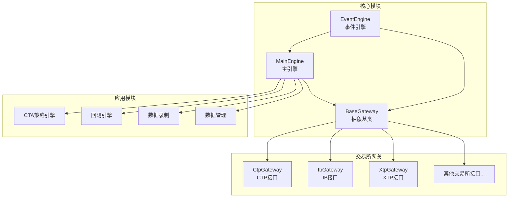
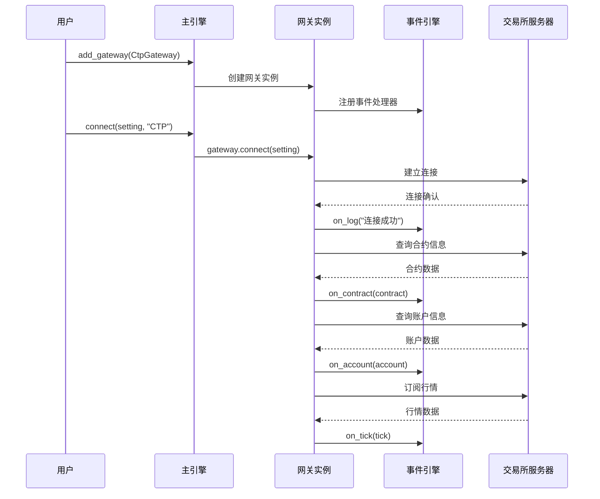
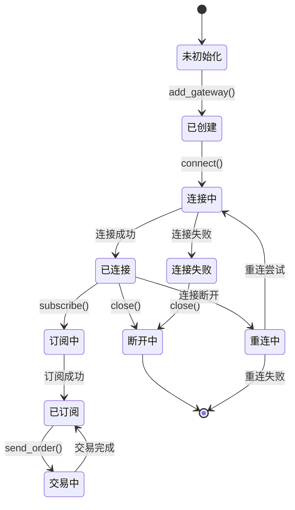
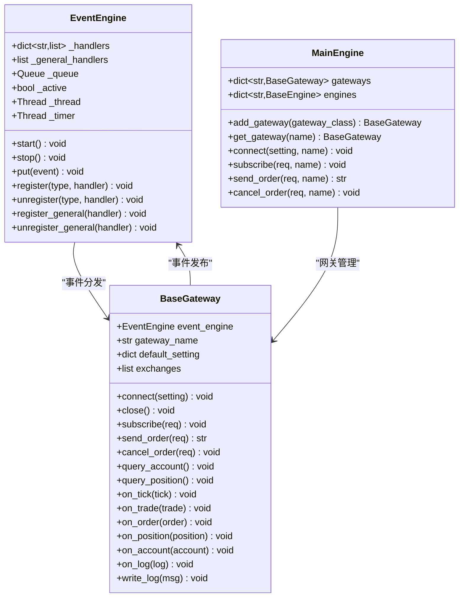
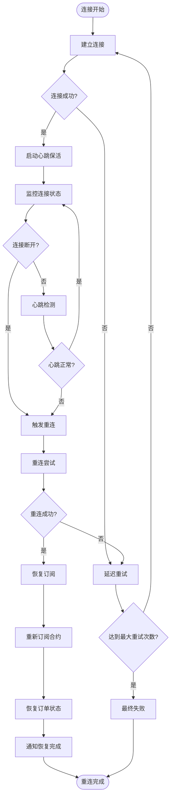
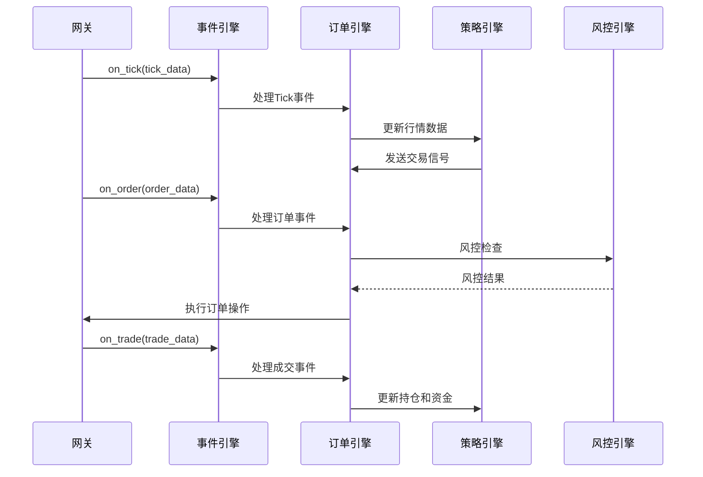
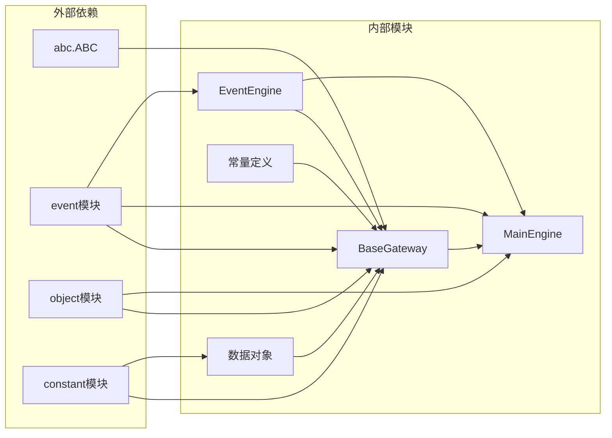

# 网关架构设计

<cite>
**本文档引用的文件**
- [vnpy/trader/gateway.py](file://vnpy/trader/gateway.py)
- [vnpy/trader/engine.py](file://vnpy/trader/engine.py)
- [vnpy/event/engine.py](file://vnpy/event/engine.py)
- [vnpy/trader/object.py](file://vnpy/trader/object.py)
- [vnpy/trader/constant.py](file://vnpy/trader/constant.py)
- [examples/veighna_trader/run.py](file://examples/veighna_trader/run.py)
- [examples/data_recorder/data_recorder.py](file://examples/data_recorder/data_recorder.py)
</cite>

## 目录
1. [简介](#简介)
2. [项目结构](#项目结构)
3. [核心组件](#核心组件)
4. [架构概览](#架构概览)
5. [详细组件分析](#详细组件分析)
6. [依赖关系分析](#依赖关系分析)
7. [性能考虑](#性能考虑)
8. [故障排除指南](#故障排除指南)
9. [结论](#结论)

## 简介

VeighNa框架采用插件式网关架构设计，通过BaseGateway抽象基类定义标准化接口，支持多交易所集成。该架构基于事件驱动模式，实现了网关与核心引擎的松耦合协作。本文档深入分析了网关架构的设计原理、实现机制和最佳实践。

## 项目结构



**图表来源**
- [vnpy/trader/gateway.py](file://vnpy/trader/gateway.py#L32-L273)
- [vnpy/trader/engine.py](file://vnpy/trader/engine.py#L67-L266)

**章节来源**
- [vnpy/trader/gateway.py](file://vnpy/trader/gateway.py#L1-L273)
- [vnpy/trader/engine.py](file://vnpy/trader/engine.py#L1-L620)

## 核心组件

### BaseGateway抽象基类

BaseGateway是所有交易所网关的基础抽象类，定义了标准化的接口规范：

```python
class BaseGateway(ABC):
    """
    Abstract gateway class for creating gateways connection
    to different trading systems.
    """
    
    # 默认网关名称
    default_name: str = ""
    
    # 连接设置字段
    default_setting: dict[str, str | int | float | bool] = {}
    
    # 支持的交易所列表
    exchanges: list[Exchange] = []
    
    def __init__(self, event_engine: EventEngine, gateway_name: str) -> None:
        self.event_engine: EventEngine = event_engine
        self.gateway_name: str = gateway_name
```

### MainEngine主引擎

MainEngine作为核心协调器，负责网关的注册、管理和生命周期控制：

```python
class MainEngine:
    def __init__(self, event_engine: EventEngine | None = None) -> None:
        self.event_engine: EventEngine = event_engine or EventEngine()
        self.gateways: dict[str, BaseGateway] = {}
        self.engines: dict[str, BaseEngine] = {}
        
    def add_gateway(self, gateway_class: type[BaseGateway], gateway_name: str = "") -> BaseGateway:
        if not gateway_name:
            gateway_name = gateway_class.default_name
            
        gateway: BaseGateway = gateway_class(self.event_engine, gateway_name)
        self.gateways[gateway_name] = gateway
        
        # 添加网关支持的交易所
        for exchange in gateway.exchanges:
            if exchange not in self.exchanges:
                self.exchanges.append(exchange)
                
        return gateway
```

**章节来源**
- [vnpy/trader/gateway.py](file://vnpy/trader/gateway.py#L32-L273)
- [vnpy/trader/engine.py](file://vnpy/trader/engine.py#L67-L133)

## 架构概览



**图表来源**
- [vnpy/trader/engine.py](file://vnpy/trader/engine.py#L110-L133)
- [vnpy/trader/gateway.py](file://vnpy/trader/gateway.py#L150-L187)

## 详细组件分析

### 网关生命周期管理



### 事件驱动模式



**图表来源**
- [vnpy/event/engine.py](file://vnpy/event/engine.py#L32-L146)
- [vnpy/trader/gateway.py](file://vnpy/trader/gateway.py#L32-L273)
- [vnpy/trader/engine.py](file://vnpy/trader/engine.py#L67-L266)

### 异常断线重连策略



**图表来源**
- [vnpy/trader/gateway.py](file://vnpy/trader/gateway.py#L150-L187)

### 数据流处理



**图表来源**
- [vnpy/trader/gateway.py](file://vnpy/trader/gateway.py#L60-L149)

**章节来源**
- [vnpy/trader/gateway.py](file://vnpy/trader/gateway.py#L60-L273)
- [vnpy/event/engine.py](file://vnpy/event/engine.py#L1-L146)

## 依赖关系分析



**图表来源**
- [vnpy/trader/gateway.py](file://vnpy/trader/gateway.py#L1-L20)
- [vnpy/trader/engine.py](file://vnpy/trader/engine.py#L1-L20)

**章节来源**
- [vnpy/trader/gateway.py](file://vnpy/trader/gateway.py#L1-L20)
- [vnpy/trader/engine.py](file://vnpy/trader/engine.py#L1-L20)

## 性能考虑

### 异步处理机制

1. **非阻塞操作**: 所有网关方法都必须是非阻塞的，确保不会影响主线程性能
2. **事件驱动**: 使用事件引擎实现异步数据处理，避免轮询带来的性能损耗
3. **线程安全**: 网关类设计为线程安全，支持多线程并发访问

### 内存管理

1. **对象池**: 对于频繁创建的对象（如OrderData、TradeData），使用对象池减少GC压力
2. **弱引用**: 在适当场景使用弱引用避免循环引用导致的内存泄漏
3. **及时清理**: 网关关闭时及时清理资源，释放网络连接和内存占用

### 网络优化

1. **连接复用**: 同一交易所的多个功能共享网络连接
2. **批量处理**: 支持批量订阅和批量查询，减少网络往返次数
3. **压缩传输**: 对大数据包进行压缩传输，降低带宽消耗

## 故障排除指南

### 常见连接问题

1. **网络连接失败**
   - 检查防火墙设置
   - 验证服务器地址和端口
   - 确认网络连通性

2. **认证失败**
   - 核对用户名和密码
   - 检查经纪商代码
   - 验证授权编码

3. **超时问题**
   - 调整连接超时参数
   - 检查网络延迟
   - 优化服务器性能

### 数据同步问题

1. **行情数据丢失**
   - 检查订阅状态
   - 验证合约代码
   - 监控网络质量

2. **订单状态不一致**
   - 检查订单ID生成逻辑
   - 验证状态更新机制
   - 确认事件处理顺序

**章节来源**
- [vnpy/trader/gateway.py](file://vnpy/trader/gateway.py#L150-L187)
- [examples/data_recorder/data_recorder.py](file://examples/data_recorder/data_recorder.py#L31-L61)

## 结论

VeighNa的网关架构设计体现了现代量化交易平台的核心设计理念：

1. **模块化设计**: 通过BaseGateway抽象基类实现标准化接口，支持灵活扩展
2. **事件驱动**: 基于事件引擎的异步处理机制，确保系统的响应性和稳定性
3. **插件化架构**: 支持多种交易所接口的无缝集成，满足不同用户需求
4. **容错机制**: 完善的异常处理和重连策略，保证系统持续稳定运行

这种架构设计不仅提高了代码的可维护性和可扩展性，也为开发者提供了清晰的开发指导和最佳实践。通过合理的抽象层次和接口设计，使得不同类型的交易所接口能够以统一的方式集成到系统中，大大降低了开发和维护成本。

未来的发展方向可以考虑：
- 增强云原生支持，适应分布式部署需求
- 优化WebSocket连接管理，提高实时性
- 加强安全机制，支持更复杂的认证方式
- 扩展更多交易所接口，完善生态系统