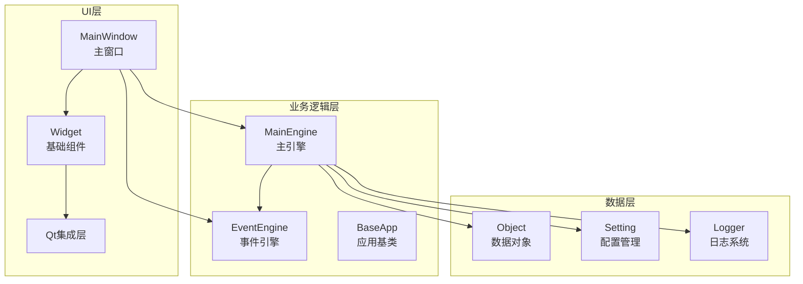
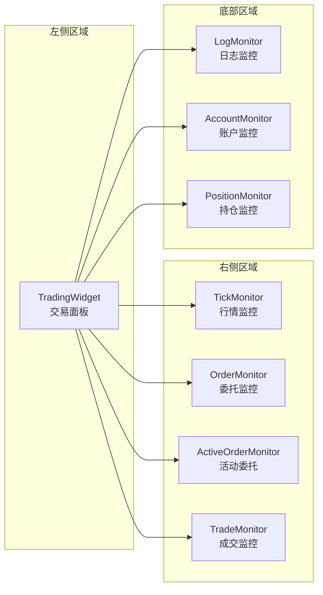
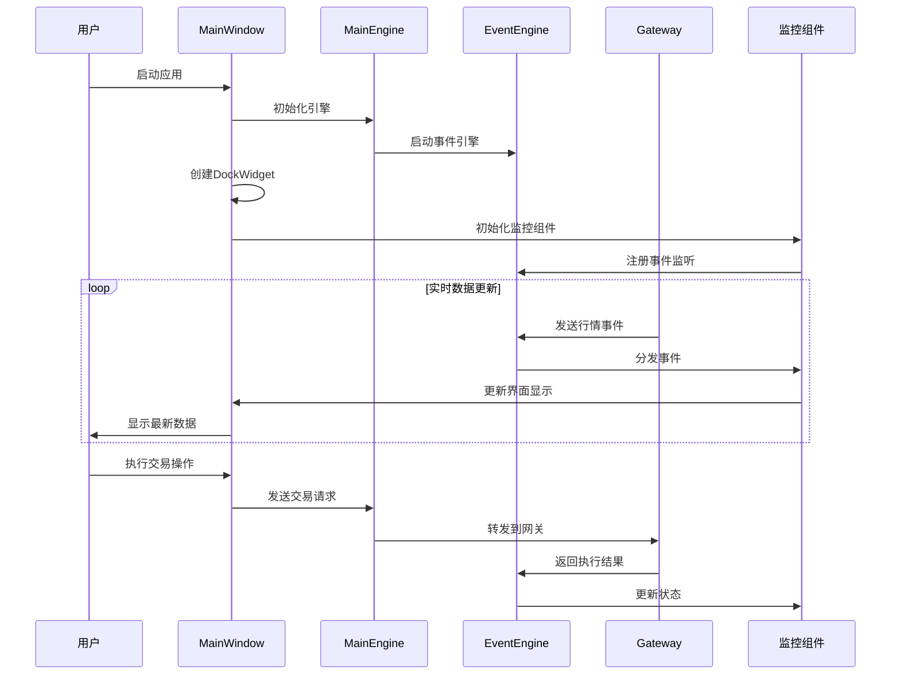
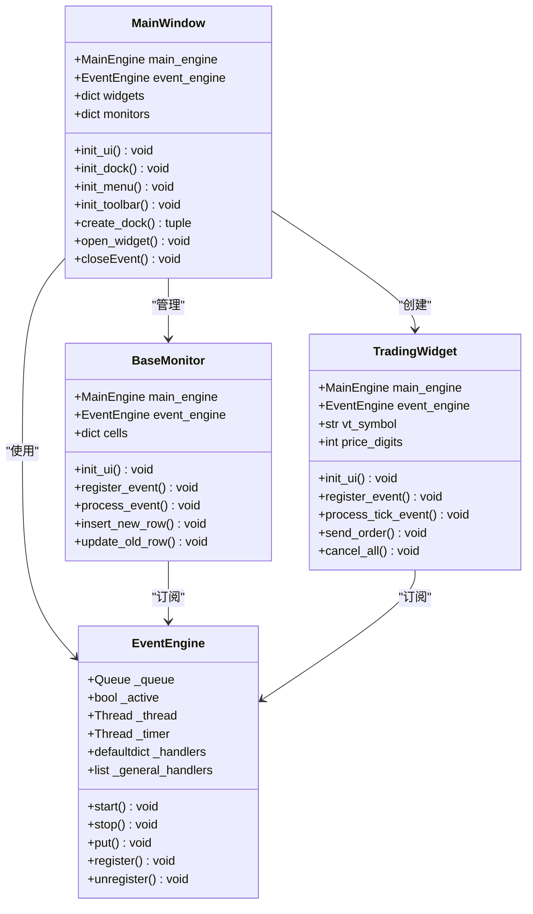
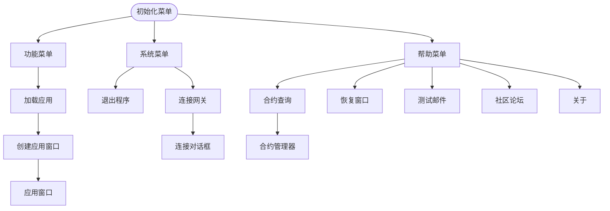
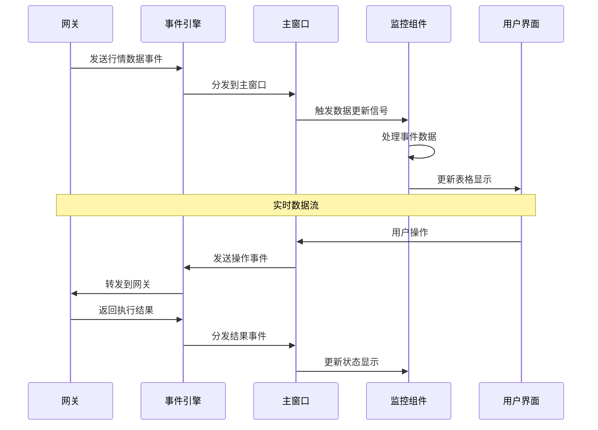
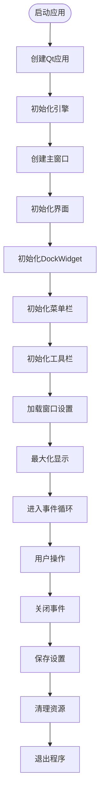
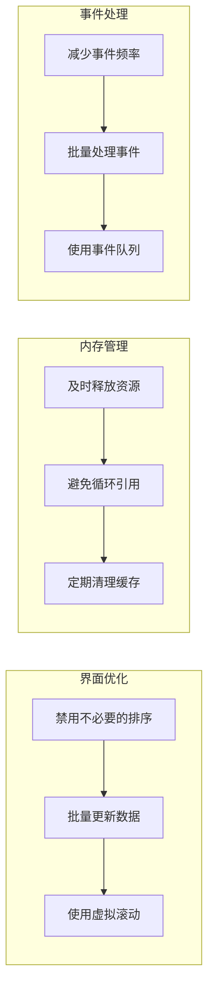

# 主窗口架构设计与实现机制

<cite>
**本文档中引用的文件**
- [mainwindow.py](file://vnpy/trader/ui/mainwindow.py)
- [widget.py](file://vnpy/trader/ui/widget.py)
- [engine.py](file://vnpy/event/engine.py)
- [engine.py](file://vnpy/trader/engine.py)
- [qt.py](file://vnpy/trader/ui/qt.py)
- [run.py](file://examples/veighna_trader/run.py)
</cite>

## 目录
1. [简介](#简介)
2. [项目结构概览](#项目结构概览)
3. [核心组件分析](#核心组件分析)
4. [架构概览](#架构概览)
5. [详细组件分析](#详细组件分析)
6. [事件引擎交互](#事件引擎交互)
7. [窗口生命周期管理](#窗口生命周期管理)
8. [性能优化与故障排除](#性能优化与故障排除)
9. [扩展开发指南](#扩展开发指南)
10. [结论](#结论)

## 简介

主窗口（MainWindow）是VeighNa交易平台的核心GUI容器，负责协调整个交易系统的用户界面展示和交互。作为基于PySide6构建的桌面应用程序，它采用事件驱动架构，通过DockWidget系统实现模块化布局，支持实时行情显示、交易操作、账户管理和系统监控等功能。

主窗口的设计遵循MVC架构模式，将视图层（View）、控制器层（Controller）和模型层（Model）清晰分离。通过事件引擎（EventEngine）实现各组件间的松耦合通信，确保系统的可扩展性和维护性。

## 项目结构概览



**图表来源**
- [mainwindow.py](file://vnpy/trader/ui/mainwindow.py#L1-L334)
- [engine.py](file://vnpy/trader/engine.py#L1-L200)

**章节来源**
- [mainwindow.py](file://vnpy/trader/ui/mainwindow.py#L1-L50)
- [run.py](file://examples/veighna_trader/run.py#L1-L88)

## 核心组件分析

### MainWindow类设计

MainWindow类继承自QMainWindow，是整个GUI系统的核心控制器。它负责：

1. **窗口初始化**：设置窗口标题、图标和基本属性
2. **布局管理**：通过DockWidget系统组织各个功能模块
3. **菜单栏构建**：动态生成系统菜单和功能菜单
4. **工具栏配置**：提供快速访问常用功能的工具栏
5. **事件处理**：响应用户交互和系统事件

```python
class MainWindow(QtWidgets.QMainWindow):
    """
    主窗口类，负责整个交易平台的GUI控制
    """
    
    def __init__(self, main_engine: MainEngine, event_engine: EventEngine) -> None:
        super().__init__()
        
        self.main_engine: MainEngine = main_engine
        self.event_engine: EventEngine = event_engine
        
        self.window_title: str = _("VeighNa Trader 社区版 - {}   [{}]").format(
            vnpy.__version__, TRADER_DIR)
        
        self.widgets: dict[str, QtWidgets.QWidget] = {}
        self.monitors: dict[str, BaseMonitor] = {}
        
        self.init_ui()
```

### 布局管理系统

主窗口采用DockWidget系统实现灵活的布局管理：



**图表来源**
- [mainwindow.py](file://vnpy/trader/ui/mainwindow.py#L50-L90)

**章节来源**
- [mainwindow.py](file://vnpy/trader/ui/mainwindow.py#L30-L120)

## 架构概览

### 整体架构设计



**图表来源**
- [mainwindow.py](file://vnpy/trader/ui/mainwindow.py#L30-L120)
- [engine.py](file://vnpy/event/engine.py#L1-L146)

### 组件依赖关系



**图表来源**
- [mainwindow.py](file://vnpy/trader/ui/mainwindow.py#L30-L120)
- [widget.py](file://vnpy/trader/ui/widget.py#L200-L400)
- [engine.py](file://vnpy/event/engine.py#L30-L100)

**章节来源**
- [mainwindow.py](file://vnpy/trader/ui/mainwindow.py#L30-L120)
- [widget.py](file://vnpy/trader/ui/widget.py#L200-L400)

## 详细组件分析

### DockWidget系统

主窗口使用DockWidget系统实现模块化布局，每个功能模块都封装为独立的DockWidget：

```python
def create_dock(
    self,
    widget_class: type[WidgetType],
    name: str,
    area: QtCore.Qt.DockWidgetArea
) -> tuple[WidgetType, QtWidgets.QDockWidget]:
    """
    初始化一个DockWidget
    """
    widget: WidgetType = widget_class(self.main_engine, self.event_engine)
    if isinstance(widget, BaseMonitor):
        self.monitors[name] = widget

    dock: QtWidgets.QDockWidget = QtWidgets.QDockWidget(name)
    dock.setWidget(widget)
    dock.setObjectName(name)
    dock.setFeatures(dock.DockWidgetFeature.DockWidgetFloatable | 
                     dock.DockWidgetFeature.DockWidgetMovable)
    self.addDockWidget(area, dock)
    return widget, dock
```

### 菜单栏与工具栏

主窗口的菜单栏和工具栏采用动态生成的方式，根据系统配置和应用状态自动调整：



**图表来源**
- [mainwindow.py](file://vnpy/trader/ui/mainwindow.py#L90-L180)

### 监控组件系统

监控组件（BaseMonitor）是主窗口的核心数据展示模块，采用统一的数据模型和事件驱动架构：

```python
class BaseMonitor(QtWidgets.QTableWidget):
    """
    监控数据更新的基础类
    """
    
    event_type: str = ""
    data_key: str = ""
    sorting: bool = False
    headers: dict = {}
    
    signal: QtCore.Signal = QtCore.Signal(Event)
    
    def process_event(self, event: Event) -> None:
        """
        处理新数据并更新到表格中
        """
        # 禁用排序以防止意外错误
        if self.sorting:
            self.setSortingEnabled(False)
        
        data = event.data
        
        if not self.data_key:
            self.insert_new_row(data)
        else:
            key: str = data.__getattribute__(self.data_key)
            
            if key in self.cells:
                self.update_old_row(data)
            else:
                self.insert_new_row(data)
        
        # 启用排序
        if self.sorting:
            self.setSortingEnabled(True)
```

**章节来源**
- [mainwindow.py](file://vnpy/trader/ui/mainwindow.py#L120-L200)
- [widget.py](file://vnpy/trader/ui/widget.py#L200-L400)

## 事件引擎交互

### 事件分发机制

主窗口通过事件引擎实现与各个组件的松耦合通信：



**图表来源**
- [engine.py](file://vnpy/event/engine.py#L50-L100)
- [mainwindow.py](file://vnpy/trader/ui/mainwindow.py#L120-L180)

### 事件类型与处理

主窗口订阅多种类型的事件，包括：

1. **行情事件（EVENT_TICK）**：实时行情数据更新
2. **委托事件（EVENT_ORDER）**：委托状态变化
3. **成交事件（EVENT_TRADE）**：成交记录更新
4. **持仓事件（EVENT_POSITION）**：持仓信息变化
5. **账户事件（EVENT_ACCOUNT）**：账户资金变动
6. **日志事件（EVENT_LOG）**：系统日志输出

**章节来源**
- [engine.py](file://vnpy/event/engine.py#L1-L146)
- [mainwindow.py](file://vnpy/trader/ui/mainwindow.py#L120-L180)

## 窗口生命周期管理

### 窗口初始化流程



**图表来源**
- [mainwindow.py](file://vnpy/trader/ui/mainwindow.py#L30-L60)
- [run.py](file://examples/veighna_trader/run.py#L40-L80)

### 状态持久化机制

主窗口实现了完整的状态持久化机制，包括：

1. **窗口几何状态**：位置、大小、停靠状态
2. **列宽设置**：表格列宽个性化配置
3. **用户偏好**：窗口主题、字体设置等

```python
def save_window_setting(self, name: str) -> None:
    """
    保存当前窗口大小和状态
    """
    settings: QtCore.QSettings = QtCore.QSettings(self.window_title, name)
    settings.setValue("state", self.saveState())
    settings.setValue("geometry", self.saveGeometry())

def load_window_setting(self, name: str) -> None:
    """
    加载之前的窗口大小和状态
    """
    settings: QtCore.QSettings = QtCore.QSettings(self.window_title, name)
    state = settings.value("state")
    geometry = settings.value("geometry")
    
    if isinstance(state, QtCore.QByteArray):
        self.restoreState(state)
        self.restoreGeometry(geometry)
```

**章节来源**
- [mainwindow.py](file://vnpy/trader/ui/mainwindow.py#L280-L320)

## 性能优化与故障排除

### 常见性能问题

1. **大量数据更新导致界面卡顿**
   - 解决方案：禁用排序功能，批量更新数据
   - 实现：在process_event方法中临时禁用排序

2. **内存泄漏问题**
   - 解决方案：正确释放事件监听器和定时器
   - 实现：在closeEvent中清理所有组件

3. **网络延迟影响用户体验**
   - 解决方案：异步处理网络请求，使用进度指示器
   - 实现：事件驱动架构天然支持异步处理

### 性能优化建议



### 故障排除指南

1. **界面无响应**
   - 检查事件处理函数是否阻塞主线程
   - 验证数据库连接状态
   - 查看日志文件中的错误信息

2. **数据不更新**
   - 确认事件引擎正常运行
   - 检查网关连接状态
   - 验证数据订阅是否成功

3. **内存占用过高**
   - 监控组件数量和数据量
   - 检查是否有未释放的事件监听器
   - 使用内存分析工具定位问题

**章节来源**
- [mainwindow.py](file://vnpy/trader/ui/mainwindow.py#L200-L280)

## 扩展开发指南

### 自定义面板集成

要向主窗口添加新的功能面板，需要遵循以下步骤：

1. **创建面板类**：继承QWidget或相关基类
2. **实现数据绑定**：连接到MainEngine和EventEngine
3. **注册到主窗口**：在菜单栏中添加对应项

```python
# 示例：自定义面板类
class CustomPanel(QtWidgets.QWidget):
    def __init__(self, main_engine: MainEngine, event_engine: EventEngine):
        super().__init__()
        self.main_engine = main_engine
        self.event_engine = event_engine
        self.init_ui()
    
    def init_ui(self):
        # 初始化界面布局
        pass
    
    def register_event(self):
        # 注册事件监听
        pass

# 在主窗口中集成
def init_custom_panel(self):
    panel = CustomPanel(self.main_engine, self.event_engine)
    self.widgets["custom"] = panel
    panel.show()
```

### 快捷键配置

主窗口支持自定义快捷键配置：

```python
def add_action(
    self,
    menu: QtWidgets.QMenu,
    action_name: str,
    icon_name: str,
    func: Callable,
    toolbar: bool = False
) -> None:
    """
    添加菜单项和工具栏按钮
    """
    icon: QtGui.QIcon = QtGui.QIcon(icon_name)
    
    action: QtGui.QAction = QtGui.QAction(action_name, self)
    action.triggered.connect(func)
    action.setIcon(icon)
    
    menu.addAction(action)
    
    if toolbar:
        self.toolbar.addAction(action)
```

### 多语言支持

主窗口内置多语言支持机制：

```python
from ..locale import _

# 使用国际化字符串
self.setWindowTitle(_("VeighNa Trader 社区版"))
menu_item = _("连接{}").format(gateway_name)
action_name = _("退出")
```

**章节来源**
- [mainwindow.py](file://vnpy/trader/ui/mainwindow.py#L180-L220)
- [widget.py](file://vnpy/trader/ui/widget.py#L1-L100)

## 结论

主窗口作为VeighNa交易平台的核心GUI容器，展现了优秀的架构设计和实现质量。通过事件驱动架构、模块化设计和灵活的布局系统，它成功地将复杂的交易功能整合到一个直观易用的界面中。

主要优势包括：

1. **架构清晰**：采用MVC模式，职责分明
2. **扩展性强**：支持插件式应用集成
3. **性能优异**：事件驱动架构确保响应速度
4. **易于维护**：松耦合设计便于代码维护
5. **用户体验佳**：丰富的界面定制选项

对于开发者而言，主窗口提供了良好的扩展点和开发指导，使得在保持系统稳定性的同时能够轻松添加新功能。通过遵循既定的设计模式和最佳实践，可以有效地进行二次开发和功能增强。