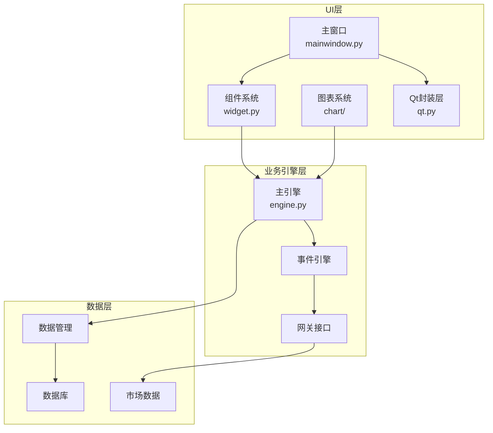
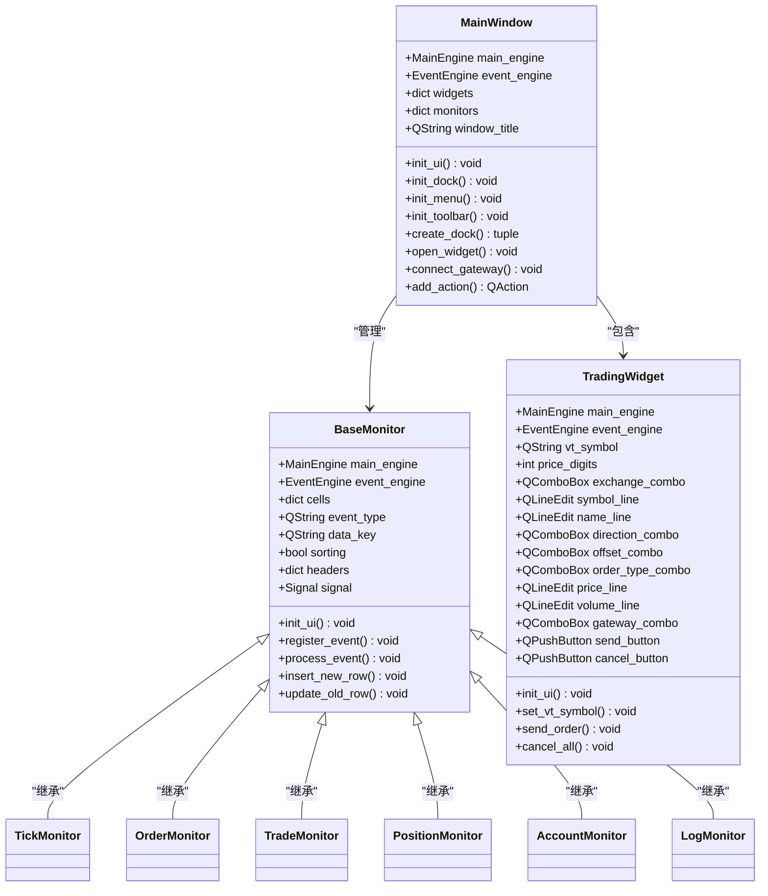
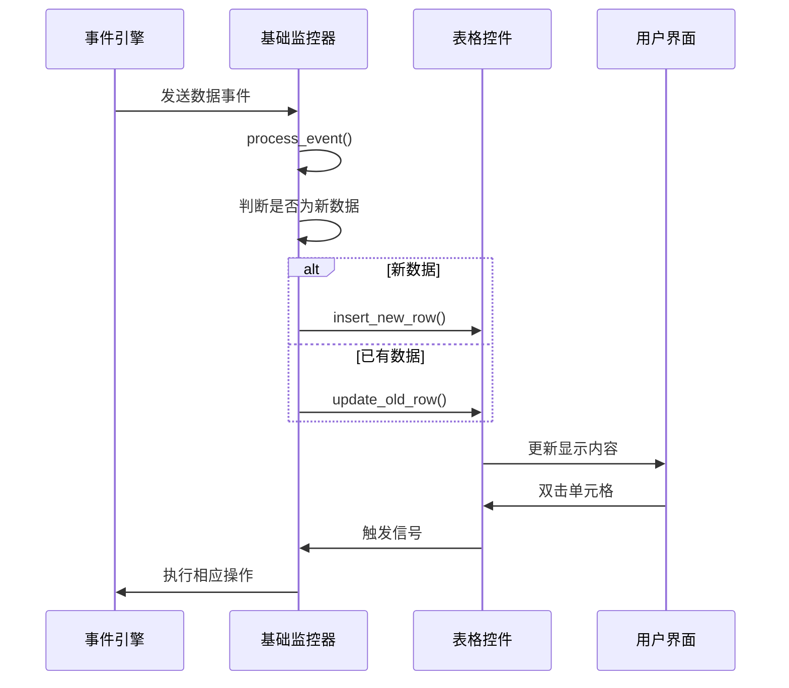
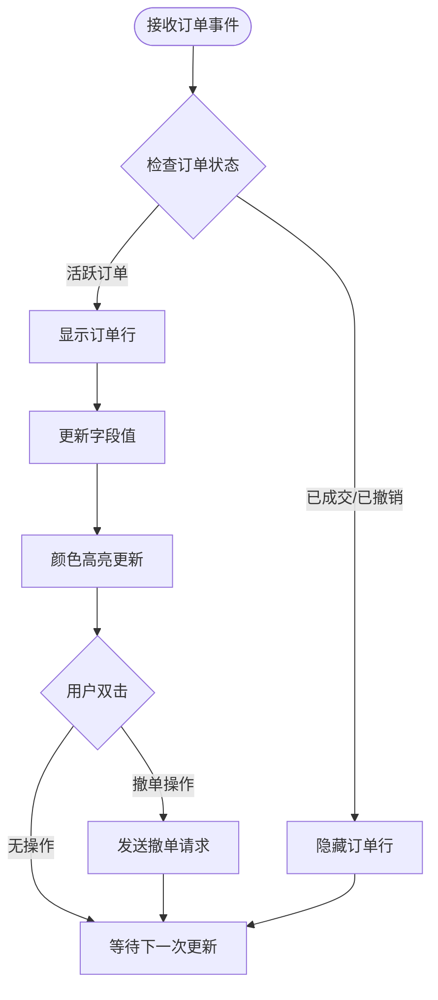
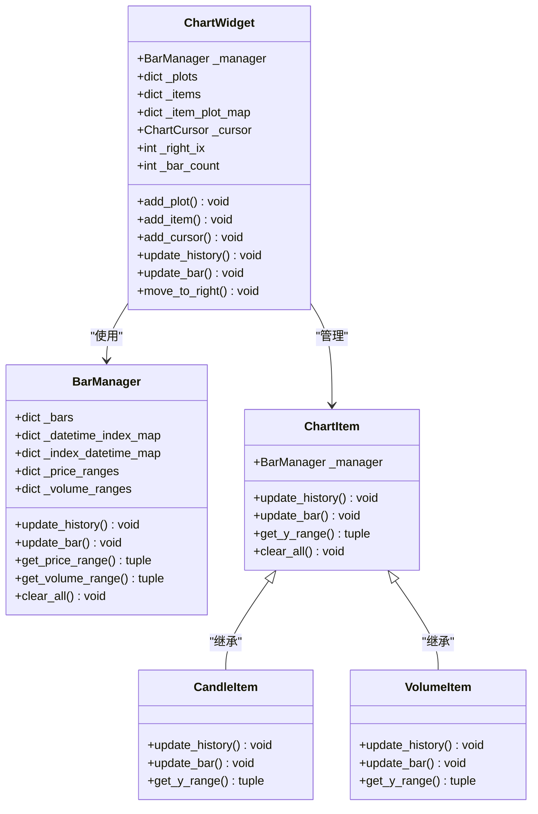
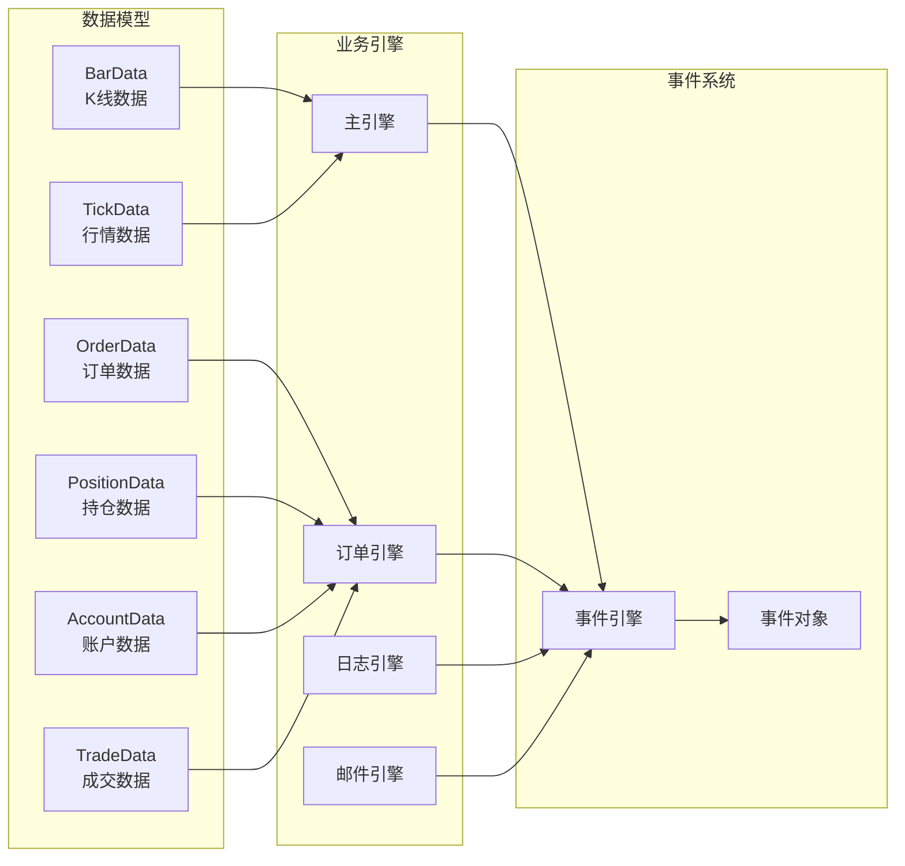
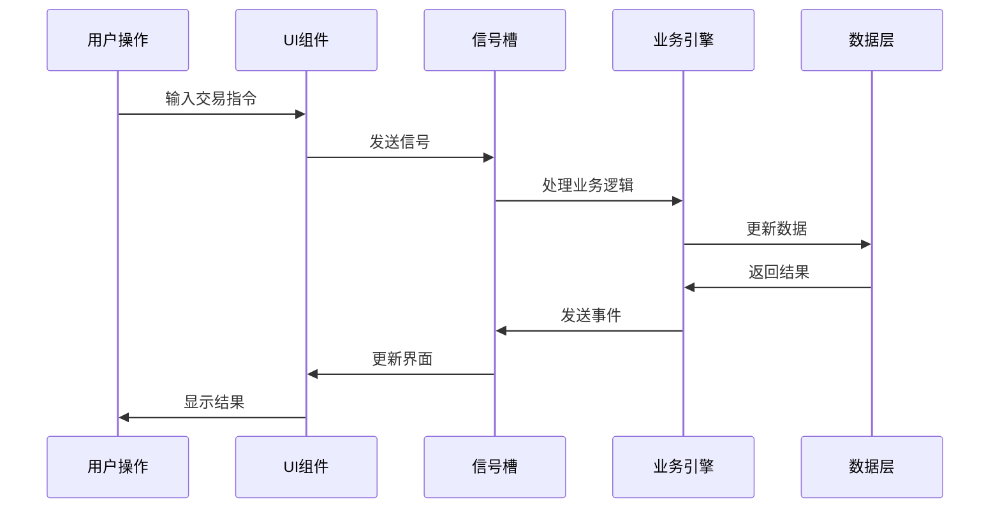

# 图形用户界面设计与实现

<cite>
**本文档中引用的文件**
- [examples/candle_chart/run.py](file://examples/candle_chart/run.py)
- [vnpy/trader/ui/mainwindow.py](file://vnpy/trader/ui/mainwindow.py)
- [vnpy/trader/ui/widget.py](file://vnpy/trader/ui/widget.py)
- [vnpy/trader/ui/qt.py](file://vnpy/trader/ui/qt.py)
- [vnpy/chart/widget.py](file://vnpy/chart/widget.py)
- [vnpy/chart/base.py](file://vnpy/chart/base.py)
- [vnpy/chart/manager.py](file://vnpy/chart/manager.py)
- [vnpy/trader/engine.py](file://vnpy/trader/engine.py)
</cite>

## 目录
1. [简介](#简介)
2. [项目结构概览](#项目结构概览)
3. [主窗口架构分析](#主窗口架构分析)
4. [交易组件系统](#交易组件系统)
5. [图表组件集成](#图表组件集成)
6. [MVC模式实现](#mvc模式实现)
7. [界面定制化开发](#界面定制化开发)
8. [性能优化与兼容性](#性能优化与兼容性)
9. [故障排除指南](#故障排除指南)
10. [总结](#总结)

## 简介

vnpy的图形用户界面采用基于PySide6的现代化桌面应用架构，实现了完整的MVC（Model-View-Controller）设计模式。该界面系统提供了丰富的交易功能，包括实时行情显示、订单管理、持仓监控、资金管理等功能模块，并支持高度定制化的界面布局和主题切换。

界面系统的核心设计理念是模块化、可扩展性和用户体验优先。通过事件驱动的架构，实现了数据的实时更新和响应式交互，为量化交易者提供了直观、高效的交易环境。

## 项目结构概览

vnpy的UI模块采用分层架构设计，主要包含以下核心组件：



**图表来源**
- [vnpy/trader/ui/mainwindow.py](file://vnpy/trader/ui/mainwindow.py#L1-L50)
- [vnpy/trader/ui/widget.py](file://vnpy/trader/ui/widget.py#L1-L50)
- [vnpy/trader/engine.py](file://vnpy/trader/engine.py#L1-L50)

**章节来源**
- [vnpy/trader/ui/mainwindow.py](file://vnpy/trader/ui/mainwindow.py#L1-L334)
- [vnpy/trader/ui/widget.py](file://vnpy/trader/ui/widget.py#L1-L1293)
- [vnpy/trader/ui/qt.py](file://vnpy/trader/ui/qt.py#L1-L126)

## 主窗口架构分析

### 主窗口类设计

主窗口`MainWindow`是整个UI系统的中心控制器，继承自`QtWidgets.QMainWindow`，负责协调各个功能模块的布局和交互。



**图表来源**
- [vnpy/trader/ui/mainwindow.py](file://vnpy/trader/ui/mainwindow.py#L35-L80)
- [vnpy/trader/ui/widget.py](file://vnpy/trader/ui/widget.py#L300-L400)
- [vnpy/trader/ui/widget.py](file://vnpy/trader/ui/widget.py#L670-L750)

### 拖拽停靠系统

主窗口采用Qt的拖拽停靠系统，实现了灵活的界面布局管理：

```python
def init_dock(self) -> None:
    """初始化停靠区域"""
    self.trading_widget, trading_dock = self.create_dock(
        TradingWidget, _("交易"), QtCore.Qt.DockWidgetArea.LeftDockWidgetArea
    )
    tick_widget, tick_dock = self.create_dock(
        TickMonitor, _("行情"), QtCore.Qt.DockWidgetArea.RightDockWidgetArea
    )
    # ... 其他组件创建
    
    # 将活动委托和普通委托标签页合并
    self.tabifyDockWidget(active_dock, order_dock)
```

这种设计允许用户自由调整界面布局，支持多窗口模式和标签页组合，提高了操作效率。

**章节来源**
- [vnpy/trader/ui/mainwindow.py](file://vnpy/trader/ui/mainwindow.py#L65-L100)

## 交易组件系统

### 基础监控组件

交易组件系统基于`BaseMonitor`基类构建，实现了统一的数据监控和表格展示功能：



**图表来源**
- [vnpy/trader/ui/widget.py](file://vnpy/trader/ui/widget.py#L300-L400)

### 实时行情监控

行情监控组件`TickMonitor`专门处理实时市场数据，提供五档行情显示：

```python
headers: dict = {
    "symbol": {"display": _("代码"), "cell": BaseCell, "update": False},
    "exchange": {"display": _("交易所"), "cell": EnumCell, "update": False},
    "name": {"display": _("名称"), "cell": BaseCell, "update": True},
    "last_price": {"display": _("最新价"), "cell": BaseCell, "update": True},
    "volume": {"display": _("成交量"), "cell": BaseCell, "update": True},
    "bid_price_1": {"display": _("买1价"), "cell": BidCell, "update": True},
    "bid_volume_1": {"display": _("买1量"), "cell": BidCell, "update": True},
    "ask_price_1": {"display": _("卖1价"), "cell": AskCell, "update": True},
    "ask_volume_1": {"display": _("卖1量"), "cell": AskCell, "update": True},
    "datetime": {"display": _("时间"), "cell": TimeCell, "update": True},
}
```

### 订单管理系统

订单监控组件实现了完整的订单生命周期管理：



**图表来源**
- [vnpy/trader/ui/widget.py](file://vnpy/trader/ui/widget.py#L500-L550)

### 交易组件核心功能

交易组件`TradingWidget`提供了完整的手动交易功能：

```python
class TradingWidget(QtWidgets.QWidget):
    """通用手动交易组件"""
    
    def __init__(self, main_engine: MainEngine, event_engine: EventEngine) -> None:
        super().__init__()
        self.main_engine = main_engine
        self.event_engine = event_engine
        self.vt_symbol = ""
        self.price_digits = 0
        
        self.init_ui()
        self.register_event()
```

该组件集成了以下核心功能：
- 合约选择和订阅
- 实时行情显示（五档深度）
- 自动价格更新
- 委托下单
- 全部撤单
- 双击联动功能

**章节来源**
- [vnpy/trader/ui/widget.py](file://vnpy/trader/ui/widget.py#L670-L1000)

## 图表组件集成

### K线图组件架构

vnpy的图表系统基于PyQtGraph库构建，提供了高性能的金融图表功能：



**图表来源**
- [vnpy/chart/widget.py](file://vnpy/chart/widget.py#L15-L100)
- [vnpy/chart/manager.py](file://vnpy/chart/manager.py#L1-L50)

### K线图集成示例

以candle_chart示例展示如何集成K线图组件：

```python
from datetime import datetime
from vnpy.trader.ui import create_qapp, QtCore
from vnpy.trader.constant import Exchange, Interval
from vnpy.trader.database import get_database
from vnpy.chart import ChartWidget, VolumeItem, CandleItem

# 创建应用程序
app = create_qapp()

# 加载历史数据
database = get_database()
bars = database.load_bar_data(
    "IF888",
    Exchange.CFFEX,
    interval=Interval.MINUTE,
    start=datetime(2019, 7, 1),
    end=datetime(2019, 7, 17)
)

# 创建图表组件
widget = ChartWidget()
widget.add_plot("candle", hide_x_axis=True)
widget.add_plot("volume", maximum_height=200)
widget.add_item(CandleItem, "candle", "candle")
widget.add_item(VolumeItem, "volume", "volume")
widget.add_cursor()

# 设置初始数据
n = 1000
history = bars[:n]
new_data = bars[n:]
widget.update_history(history)

# 启动定时器更新
timer = QtCore.QTimer()
timer.timeout.connect(update_bar)
timer.start(100)
```

### 高性能数据处理

图表系统采用高效的数据管理策略：

```python
def update_history(self, history: list[BarData]) -> None:
    """批量更新历史数据"""
    self._manager.update_history(history)
    
    for item in self._items.values():
        item.update_history(history)
    
    self._update_plot_limits()
    self.move_to_right()

def update_bar(self, bar: BarData) -> None:
    """增量更新单根K线"""
    self._manager.update_bar(bar)
    
    for item in self._items.values():
        item.update_bar(bar)
    
    self._update_plot_limits()
    
    if self._right_ix >= (self._manager.get_count() - self._bar_count / 2):
        self.move_to_right()
```

**章节来源**
- [examples/candle_chart/run.py](file://examples/candle_chart/run.py#L1-L44)
- [vnpy/chart/widget.py](file://vnpy/chart/widget.py#L1-L200)

## MVC模式实现

### Model层设计

Model层由数据对象和业务逻辑组成，主要包括：



**图表来源**
- [vnpy/trader/engine.py](file://vnpy/trader/engine.py#L1-L100)

### View层设计

View层采用组件化架构，每个组件负责特定的数据展示：

```python
class BaseMonitor(QtWidgets.QTableWidget):
    """基础监控组件"""
    
    def __init__(self, main_engine: MainEngine, event_engine: EventEngine) -> None:
        super().__init__()
        self.main_engine = main_engine
        self.event_engine = event_engine
        self.cells = {}
        
        self.init_ui()
        self.load_setting()
        self.register_event()
    
    def register_event(self) -> None:
        """注册事件处理器"""
        if self.event_type:
            self.signal.connect(self.process_event)
            self.event_engine.register(self.event_type, self.signal.emit)
```

### Controller层设计

Controller层通过事件驱动实现数据流向控制：



**图表来源**
- [vnpy/trader/ui/widget.py](file://vnpy/trader/ui/widget.py#L300-L400)

**章节来源**
- [vnpy/trader/ui/widget.py](file://vnpy/trader/ui/widget.py#L300-L400)
- [vnpy/trader/engine.py](file://vnpy/trader/engine.py#L1-L200)

## 界面定制化开发

### 主题系统

界面采用qdarkstyle主题系统，支持深色模式：

```python
def create_qapp(app_name: str = "VeighNa Trader") -> QtWidgets.QApplication:
    """创建Qt应用程序"""
    qapp = QtWidgets.QApplication(sys.argv)
    qapp.setStyleSheet(qdarkstyle.load_stylesheet(qt_api="pyside6"))
    
    # 设置字体
    font = QtGui.QFont(SETTINGS["font.family"], SETTINGS["font.size"])
    qapp.setFont(font)
    
    # 设置图标
    icon = QtGui.QIcon(get_icon_path(__file__, "vnpy.ico"))
    qapp.setWindowIcon(icon)
    
    return qapp
```

### 布局定制

支持多种布局模式和窗口状态保存：

```python
def save_window_setting(self, name: str) -> None:
    """保存窗口设置"""
    settings = QtCore.QSettings("vnpy", name)
    settings.setValue("state", self.saveState())
    settings.setValue("geometry", self.saveGeometry())

def load_window_setting(self, name: str) -> None:
    """加载窗口设置"""
    settings = QtCore.QSettings("vnpy", name)
    state = settings.value("state")
    geometry = settings.value("geometry")
    
    if state:
        self.restoreState(state)
    if geometry:
        self.restoreGeometry(geometry)
```

### 新组件开发指南

开发新的UI组件需要遵循以下步骤：

1. **继承基类**：从合适的基类继承
2. **定义数据结构**：设置事件类型和表头配置
3. **实现初始化**：完成UI布局和事件绑定
4. **注册事件**：向事件引擎注册监听
5. **添加到菜单**：在主窗口中注册组件

```python
class CustomMonitor(BaseMonitor):
    """自定义监控组件"""
    
    event_type: str = "custom_event_type"
    data_key: str = "vt_custom_id"
    sorting: bool = True
    
    headers: dict = {
        "field1": {"display": _("字段1"), "cell": BaseCell, "update": False},
        "field2": {"display": _("字段2"), "cell": BaseCell, "update": True},
    }
```

**章节来源**
- [vnpy/trader/ui/qt.py](file://vnpy/trader/ui/qt.py#L15-L50)
- [vnpy/trader/ui/mainwindow.py](file://vnpy/trader/ui/mainwindow.py#L100-L150)

## 性能优化与兼容性

### UI性能优化

1. **数据更新优化**：禁用排序以提高更新速度
2. **内存管理**：及时清理不需要的数据
3. **异步处理**：使用事件驱动避免阻塞
4. **缓存机制**：对频繁访问的数据进行缓存

```python
def process_event(self, event: Event) -> None:
    """优化的数据处理流程"""
    # 禁用排序防止错误
    if self.sorting:
        self.setSortingEnabled(False)
    
    # 更新数据
    data = event.data
    
    if not self.data_key:
        self.insert_new_row(data)
    else:
        key = data.__getattribute__(self.data_key)
        
        if key in self.cells:
            self.update_old_row(data)
        else:
            self.insert_new_row(data)
    
    # 重新启用排序
    if self.sorting:
        self.setSortingEnabled(True)
```

### 跨平台兼容性

界面系统支持多平台部署：

- **Windows**：支持Windows 10/11，设置应用ID
- **macOS**：原生菜单栏，支持触控板手势
- **Linux**：支持各种桌面环境，自动适配主题

```python
# Windows特殊处理
if "Windows" in platform.uname():
    ctypes.windll.shell32.SetCurrentProcessExplicitAppUserModelID(
        app_name
    )

# 菜单栏适配
bar.setNativeMenuBar(False)  # 强制使用Qt菜单栏
```

### 错误处理机制

系统内置完善的错误处理：

```python
class ExceptionWidget(QtWidgets.QWidget):
    """异常处理组件"""
    
    signal = QtCore.Signal(str)
    
    def __init__(self, parent: QtWidgets.QWidget = None) -> None:
        super().__init__(parent)
        self.init_ui()
        self.signal.connect(self.show_exception)
    
    def show_exception(self, msg: str) -> None:
        """显示异常信息"""
        self.msg_edit.setText(msg)
        self.show()
```

**章节来源**
- [vnpy/trader/ui/widget.py](file://vnpy/trader/ui/widget.py#L350-L400)
- [vnpy/trader/ui/qt.py](file://vnpy/trader/ui/qt.py#L25-L50)

## 故障排除指南

### 常见问题诊断

1. **界面卡顿**
   - 检查数据更新频率
   - 优化事件处理逻辑
   - 减少不必要的重绘

2. **内存泄漏**
   - 确保正确释放资源
   - 清理事件连接
   - 使用弱引用避免循环引用

3. **主题显示异常**
   - 检查qdarkstyle版本
   - 验证字体设置
   - 确认图标路径

### 调试工具

系统提供多种调试功能：

```python
# 启用调试模式
if DEBUG:
    logger.debug("组件初始化完成")
    logger.debug(f"当前数据条目数：{len(self.cells)}")

# 性能监控
start_time = time.time()
self.process_event(event)
logger.info(f"事件处理耗时：{(time.time() - start_time) * 1000:.2f}ms")
```

### 日志系统

完整的日志记录机制：

```python
def write_log(self, msg: str, source: str = "") -> None:
    """写入日志事件"""
    log = LogData(msg=msg, gateway_name=source)
    event = Event(EVENT_LOG, log)
    self.event_engine.put(event)
```

**章节来源**
- [vnpy/trader/ui/widget.py](file://vnpy/trader/ui/widget.py#L350-L400)
- [vnpy/trader/engine.py](file://vnpy/trader/engine.py#L150-L200)

## 总结

vnpy的图形用户界面系统是一个设计精良、功能完备的交易界面解决方案。通过模块化的架构设计、事件驱动的通信机制和MVC模式的应用，实现了高度的可维护性和可扩展性。

### 核心优势

1. **模块化设计**：清晰的职责分离，便于维护和扩展
2. **事件驱动**：实时数据更新，响应式用户界面
3. **MVC架构**：良好的代码组织，降低耦合度
4. **性能优化**：针对高频数据场景的专门优化
5. **跨平台支持**：统一的界面体验，多平台部署

### 技术特色

- 基于PySide6的现代化Qt封装
- 集成PyQtGraph的高性能图表组件
- 支持主题定制和界面个性化
- 完善的错误处理和异常恢复机制
- 丰富的交易功能组件

### 应用价值

该界面系统不仅满足了量化交易的基本需求，还为开发者提供了强大的扩展能力。通过合理的架构设计和丰富的功能组件，大大降低了交易软件开发的复杂度，提高了开发效率。

未来的发展方向可以考虑进一步优化移动端支持、增强可视化效果、扩展插件机制等方面，以适应不断变化的市场需求和技术发展。