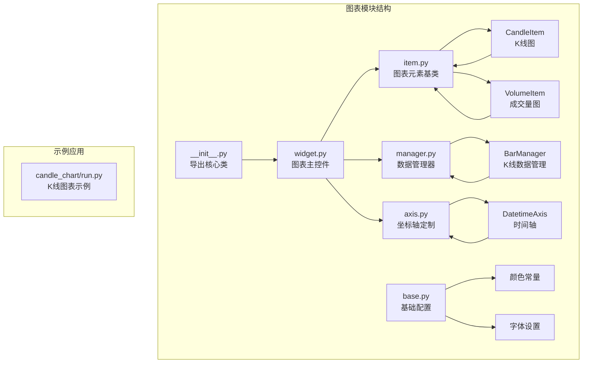
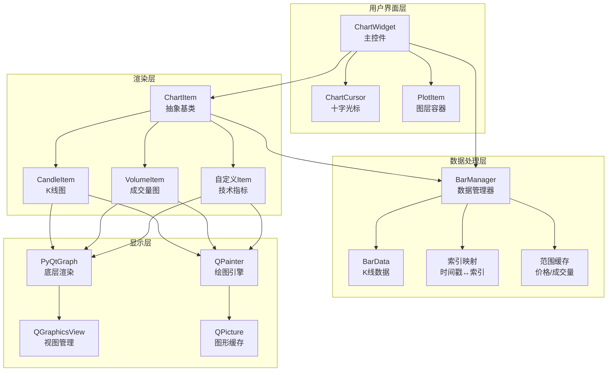
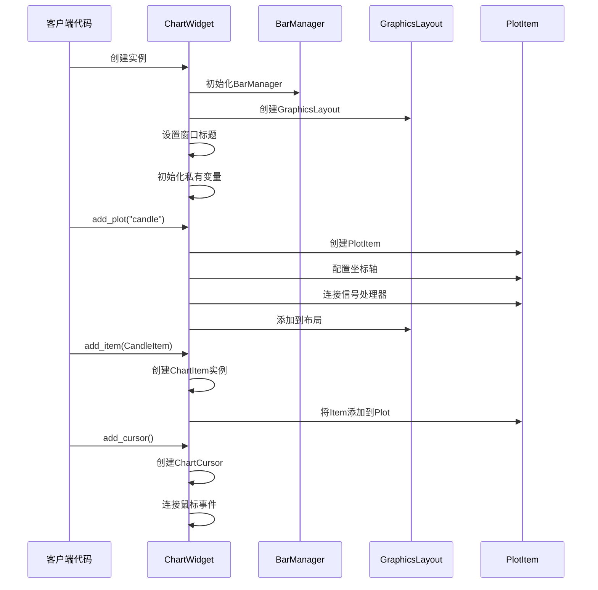
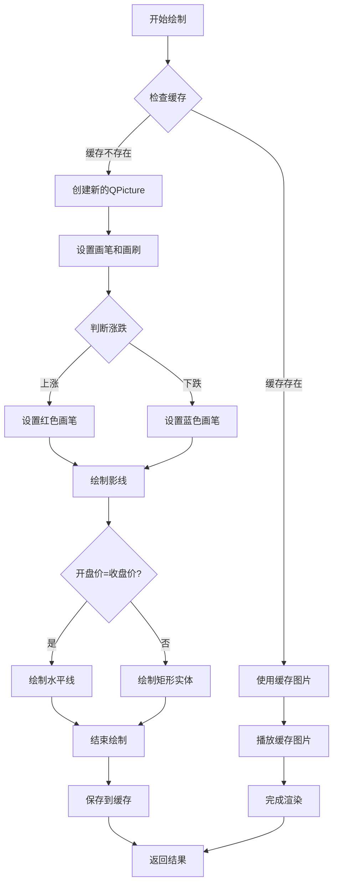
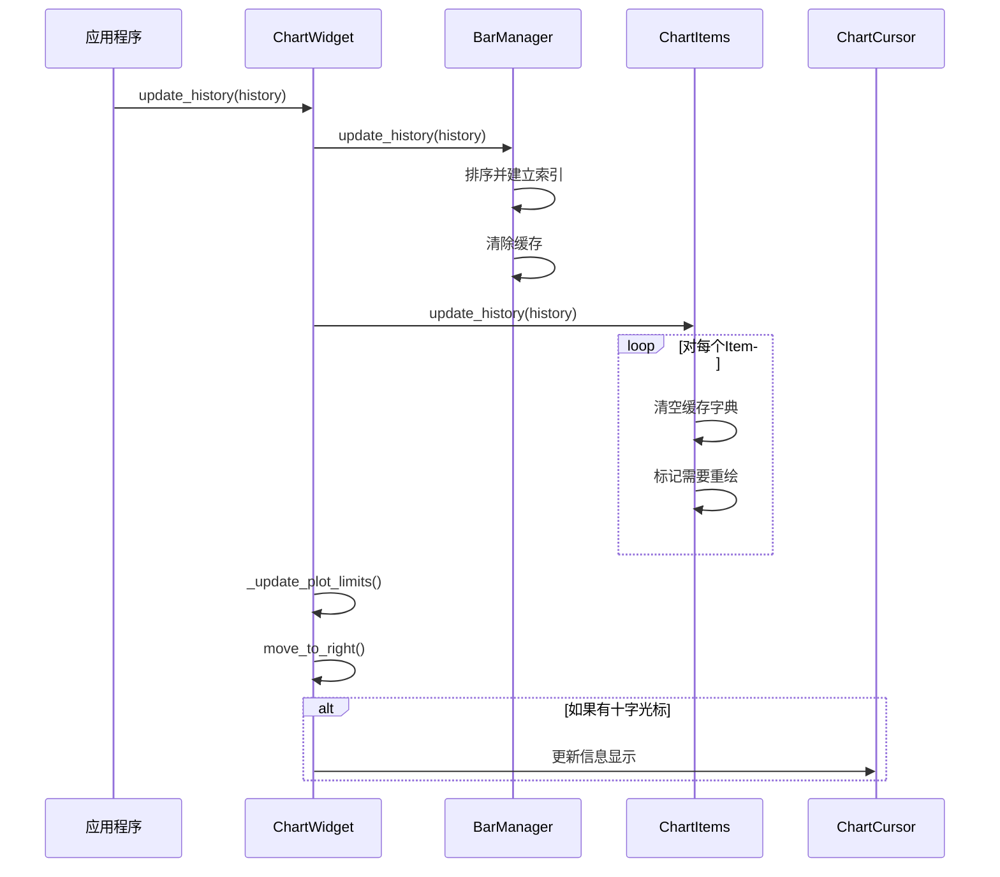
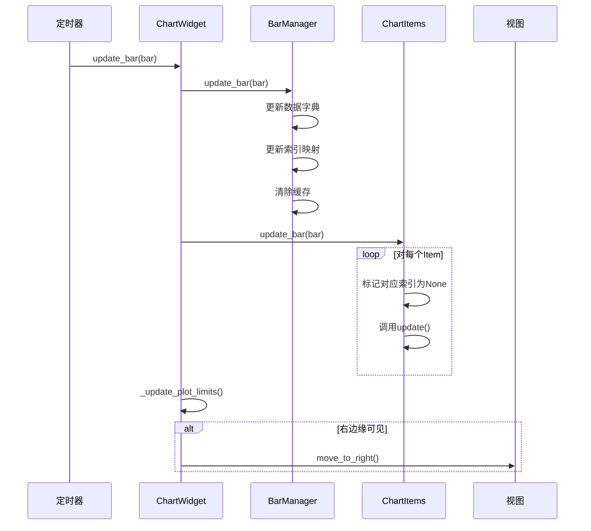
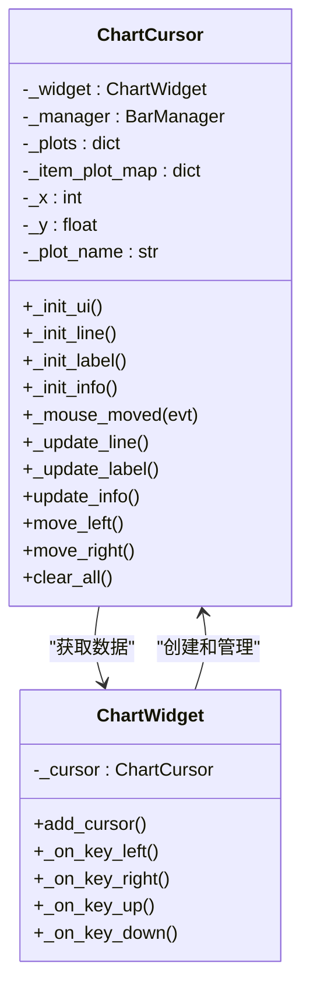
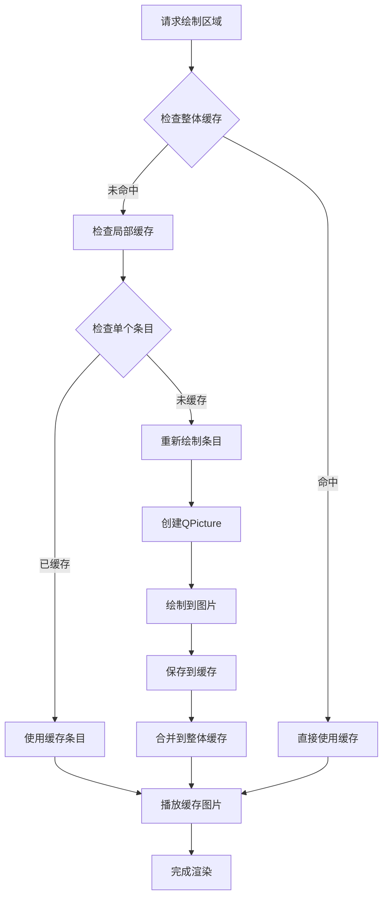

# 图表集成系统

<cite>
**本文档中引用的文件**
- [vnpy/chart/__init__.py](file://vnpy/chart/__init__.py)
- [vnpy/chart/widget.py](file://vnpy/chart/widget.py)
- [vnpy/chart/item.py](file://vnpy/chart/item.py)
- [vnpy/chart/base.py](file://vnpy/chart/base.py)
- [vnpy/chart/manager.py](file://vnpy/chart/manager.py)
- [vnpy/chart/axis.py](file://vnpy/chart/axis.py)
- [examples/candle_chart/run.py](file://examples/candle_chart/run.py)
</cite>

## 目录
1. [简介](#简介)
2. [项目结构](#项目结构)
3. [核心组件](#核心组件)
4. [架构概览](#架构概览)
5. [详细组件分析](#详细组件分析)
6. [数据更新机制](#数据更新机制)
7. [交互功能](#交互功能)
8. [性能优化策略](#性能优化策略)
9. [自定义开发指南](#自定义开发指南)
10. [故障排除指南](#故障排除指南)
11. [结论](#结论)

## 简介

VeighNa图表集成系统是一个基于PyQtGraph的高性能金融图表解决方案，专门设计用于处理K线图、成交量图和其他技术指标的可视化需求。该系统提供了完整的图表生命周期管理，包括数据初始化、实时更新、用户交互和性能优化等功能。

系统的核心优势在于其模块化设计和高度可扩展性，支持多种图表类型、自定义技术指标和跨平台兼容性。通过精心设计的缓存机制和渲染优化策略，系统能够在处理大量历史数据的同时保持流畅的用户体验。

## 项目结构

图表模块采用清晰的分层架构，主要包含以下核心文件：



**图表来源**
- [vnpy/chart/__init__.py](file://vnpy/chart/__init__.py#L1-L10)
- [vnpy/chart/widget.py](file://vnpy/chart/widget.py#L1-L50)
- [vnpy/chart/item.py](file://vnpy/chart/item.py#L1-L41)

**章节来源**
- [vnpy/chart/__init__.py](file://vnpy/chart/__init__.py#L1-L10)
- [vnpy/chart/widget.py](file://vnpy/chart/widget.py#L1-L50)

## 核心组件

### ChartWidget - 主控件

ChartWidget是整个图表系统的核心控制器，继承自PyQtGraph的PlotWidget，负责协调所有子组件的工作。

**主要特性：**
- **多图层支持**：支持多个独立的绘图区域，每个区域可以显示不同类型的数据
- **动态布局**：根据需要自动调整各图层的高度和位置
- **事件处理**：提供键盘和鼠标交互支持
- **数据管理**：统一管理所有图表元素的数据更新

**关键属性：**
- `_manager`: BarManager实例，负责数据存储和索引
- `_plots`: 图层字典，存储所有绘图区域
- `_items`: 图表元素字典，存储所有数据可视化元素
- `_cursor`: 十字光标对象，提供交互式数据浏览

### ChartItem - 图表元素基类

ChartItem是一个抽象基类，定义了所有图表元素必须实现的标准接口。

**核心方法：**
- `_draw_bar_picture()`: 绘制单个数据条目的图形
- `boundingRect()`: 返回元素的边界矩形
- `get_y_range()`: 获取指定范围内的Y轴显示范围
- `get_info_text()`: 为十字光标提供信息文本

### BarManager - 数据管理器

BarManager负责管理所有的K线数据，提供高效的数据查询和索引功能。

**主要功能：**
- **数据存储**：使用字典结构存储历史数据
- **索引管理**：维护时间戳到索引的双向映射
- **范围计算**：缓存价格和成交量范围以提高查询效率
- **数据更新**：支持批量历史数据和单条实时数据更新

**章节来源**
- [vnpy/chart/widget.py](file://vnpy/chart/widget.py#L18-L50)
- [vnpy/chart/item.py](file://vnpy/chart/item.py#L10-L41)
- [vnpy/chart/manager.py](file://vnpy/chart/manager.py#L1-L50)

## 架构概览

图表系统采用分层架构设计，确保各组件职责明确且易于维护：



**图表来源**
- [vnpy/chart/widget.py](file://vnpy/chart/widget.py#L18-L50)
- [vnpy/chart/manager.py](file://vnpy/chart/manager.py#L1-L50)
- [vnpy/chart/item.py](file://vnpy/chart/item.py#L10-L41)

## 详细组件分析

### ChartWidget 初始化流程

ChartWidget的初始化过程遵循严格的顺序，确保所有组件正确建立连接：



**图表来源**
- [vnpy/chart/widget.py](file://vnpy/chart/widget.py#L25-L50)
- [vnpy/chart/widget.py](file://vnpy/chart/widget.py#L52-L120)

### CandleItem 渲染逻辑

CandleItem负责绘制K线蜡烛图，采用了高效的图形缓存策略：



**图表来源**
- [vnpy/chart/item.py](file://vnpy/chart/item.py#L158-L200)

**章节来源**
- [vnpy/chart/widget.py](file://vnpy/chart/widget.py#L52-L152)
- [vnpy/chart/item.py](file://vnpy/chart/item.py#L158-L232)

### VolumeItem 成交量图

VolumeItem专门用于绘制成交量柱状图，与CandleItem共享大部分渲染逻辑但有不同的视觉表现：

**关键差异：**
- **颜色编码**：根据成交量大小使用不同的透明度
- **坐标原点**：从Y=0开始绘制，而不是从开盘价开始
- **信息格式**：显示成交量数值而非价格信息

**章节来源**
- [vnpy/chart/item.py](file://vnpy/chart/item.py#L234-L334)

## 数据更新机制

图表系统支持两种主要的数据更新模式：批量历史数据加载和实时增量更新。

### 批量历史数据更新



**图表来源**
- [vnpy/chart/widget.py](file://vnpy/chart/widget.py#L154-L170)

### 实时增量数据更新

对于实时数据流，系统提供了高效的增量更新机制：



**图表来源**
- [vnpy/chart/widget.py](file://vnpy/chart/widget.py#L172-L185)

**章节来源**
- [vnpy/chart/widget.py](file://vnpy/chart/widget.py#L154-L185)

## 交互功能

### 十字光标系统

ChartCursor提供了强大的交互功能，允许用户通过鼠标或键盘精确浏览数据：



**图表来源**
- [vnpy/chart/widget.py](file://vnpy/chart/widget.py#L310-L350)
- [vnpy/chart/widget.py](file://vnpy/chart/widget.py#L352-L400)

### 缩放和平移操作

系统支持多种缩放和平移方式：

**键盘快捷键：**
- 左箭头：向左移动一个单位
- 右箭头：向右移动一个单位  
- 上箭头：放大（缩小显示范围）
- 下箭头：缩小（扩大显示范围）

**鼠标滚轮：**
- 向上滚动：放大
- 向下滚动：缩小

**章节来源**
- [vnpy/chart/widget.py](file://vnpy/chart/widget.py#L240-L310)

## 性能优化策略

### 图形缓存机制

为了提高渲染性能，系统实现了多层次的缓存策略：



**图表来源**
- [vnpy/chart/item.py](file://vnpy/chart/item.py#L94-L150)

### 可见区域裁剪

系统只渲染当前可见区域内的数据，大大减少了不必要的计算：

**优化原理：**
- 使用`ItemUsesExtendedStyleOption`标志启用扩展样式选项
- 在`paint()`方法中计算可见区域的索引范围
- 只对可见区域内的数据进行重绘

### 数据采样优化

对于大量数据，系统采用峰值采样策略：

```python
# 在add_plot方法中启用
plot.setDownsampling(mode="peak")
```

这种策略在保持数据趋势的同时显著减少渲染点数。

**章节来源**
- [vnpy/chart/item.py](file://vnpy/chart/item.py#L94-L150)
- [vnpy/chart/widget.py](file://vnpy/chart/widget.py#L70-L85)

## 自定义开发指南

### 创建自定义图表元素

要创建自定义的技术指标图表，需要继承ChartItem并实现必要的抽象方法：

```python
class CustomIndicatorItem(ChartItem):
    def __init__(self, manager: BarManager):
        super().__init__(manager)
        # 初始化自定义属性
    
    def _draw_bar_picture(self, ix: int, bar: BarData) -> QtGui.QPicture:
        # 实现自定义绘制逻辑
        picture = QtGui.QPicture()
        painter = QtGui.QPainter(picture)
        
        # 绘制自定义图形
        # ...
        
        painter.end()
        return picture
    
    def boundingRect(self) -> QtCore.QRectF:
        # 返回元素的边界矩形
        min_value, max_value = self._manager.get_custom_range()
        return QtCore.QRectF(0, min_value, len(self._bar_picutures), max_value - min_value)
    
    def get_y_range(self, min_ix: int | None = None, max_ix: int | None = None) -> tuple[float, float]:
        # 计算Y轴范围
        return self._manager.get_custom_range(min_ix, max_ix)
    
    def get_info_text(self, ix: int) -> str:
        # 提供十字光标信息
        data = self._manager.get_custom_data(ix)
        return f"Custom: {data}"
```

### 多图层叠加配置

```python
# 创建主图层（K线）
widget.add_plot("candle", hide_x_axis=True)
widget.add_item(CandleItem, "candle", "candle")

# 创建成交量图层
widget.add_plot("volume", maximum_height=200)
widget.add_item(VolumeItem, "volume", "volume")

# 创建技术指标图层
widget.add_plot("ma", maximum_height=100)
widget.add_item(MovingAverageItem, "ma", "ma")

# 添加十字光标
widget.add_cursor()
```

### 主题样式配置

虽然系统本身不提供完整的主题配置，但可以通过修改基础配置文件来自定义外观：

```python
# 修改vnpy/chart/base.py中的颜色常量
WHITE_COLOR = (255, 255, 255)      # 白色背景
BLACK_COLOR = (0, 0, 0)           # 黑色文字
GREY_COLOR = (100, 100, 100)      # 灰色边框
UP_COLOR = (255, 75, 75)          # 上涨颜色（红色）
DOWN_COLOR = (0, 255, 255)        # 下跌颜色（青色）
CURSOR_COLOR = (255, 245, 162)    # 十字光标颜色
```

**章节来源**
- [vnpy/chart/item.py](file://vnpy/chart/item.py#L10-L41)
- [vnpy/chart/base.py](file://vnpy/chart/base.py#L1-L22)

## 故障排除指南

### 常见问题及解决方案

**问题1：图表显示空白**
- 检查是否正确调用了`update_history()`或`update_bar()`
- 确认BarData对象包含有效的价格和时间数据
- 验证数据时间戳的连续性和完整性

**问题2：性能问题（卡顿/延迟）**
- 减少同时显示的数据点数量
- 考虑使用数据采样策略
- 检查是否有过多的图表元素同时渲染

**问题3：十字光标不显示**
- 确保调用了`add_cursor()`方法
- 检查鼠标事件是否被其他组件拦截
- 验证BarManager是否正确更新数据

**问题4：内存泄漏**
- 定期调用`clear_all()`清理不需要的数据
- 确保不再使用的图表元素被正确销毁
- 监控缓存字典的大小

### 调试技巧

**启用调试输出：**
```python
import logging
logging.basicConfig(level=logging.DEBUG)
```

**监控性能指标：**
```python
import time
start_time = time.time()
# 执行图表操作
print(f"Operation took {time.time() - start_time:.3f} seconds")
```

**章节来源**
- [vnpy/chart/widget.py](file://vnpy/chart/widget.py#L148-L152)
- [vnpy/chart/item.py](file://vnpy/chart/item.py#L152-L158)

## 结论

VeighNa图表集成系统提供了一个功能完整、性能优异的金融图表解决方案。通过模块化的架构设计、高效的缓存机制和丰富的交互功能，系统能够满足从简单K线图到复杂技术指标的各种可视化需求。

**主要优势：**
- **高性能**：通过图形缓存和可见区域裁剪实现流畅的用户体验
- **易扩展**：清晰的抽象层次使得添加新类型的图表元素变得简单
- **跨平台**：基于PyQtGraph的跨平台兼容性
- **实时友好**：优化的增量更新机制支持实时数据流

**最佳实践建议：**
- 合理控制同时显示的数据量以维持性能
- 充分利用缓存机制避免重复计算
- 根据实际需求选择合适的缩放和平移策略
- 定期清理不再需要的数据以防止内存泄漏

通过遵循本文档提供的指导原则和最佳实践，开发者可以充分利用图表系统的强大功能，构建出专业级的金融数据分析界面。