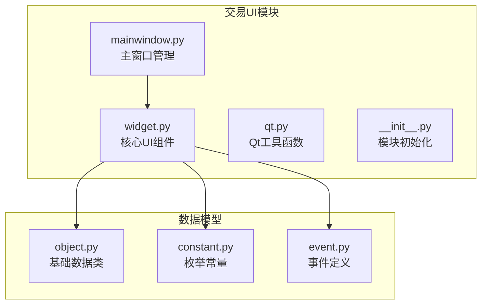
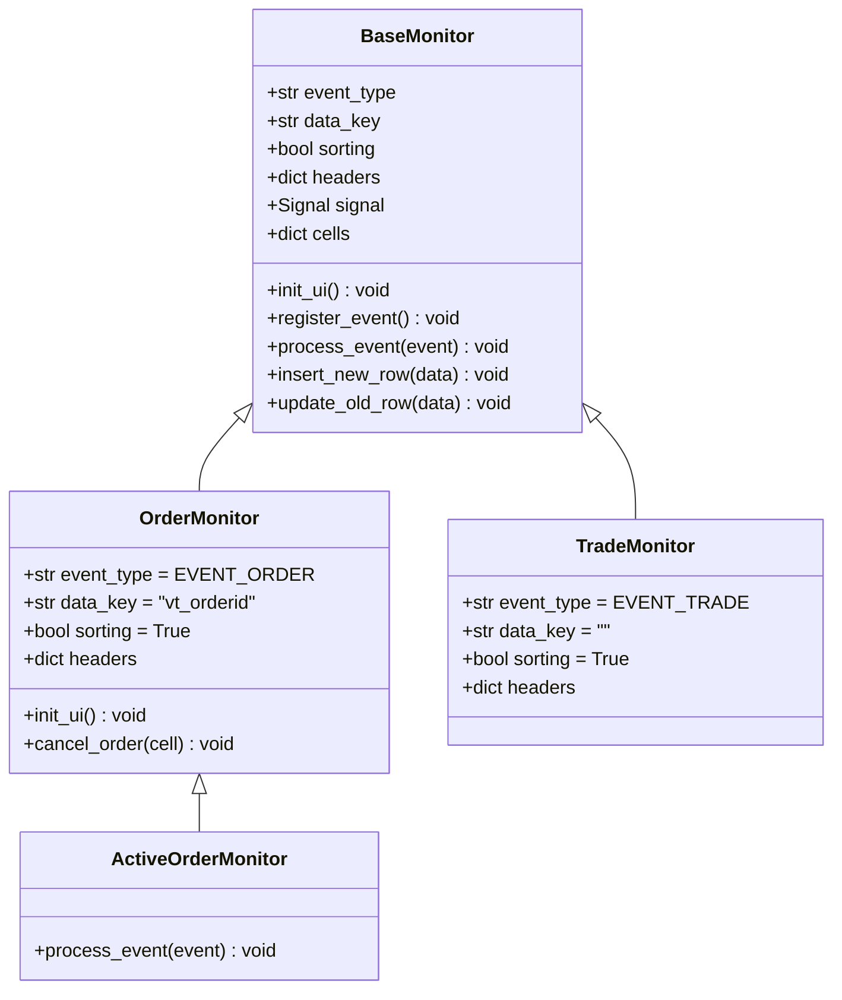
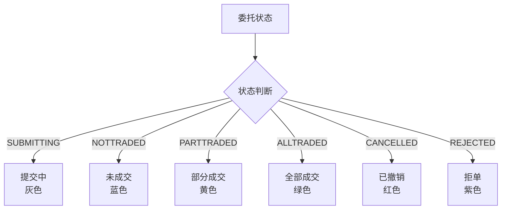
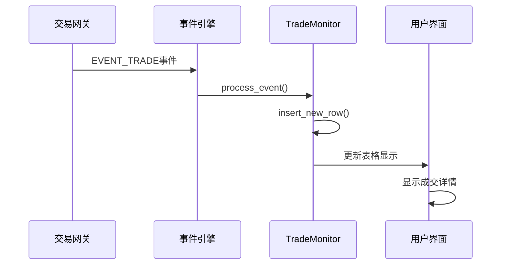
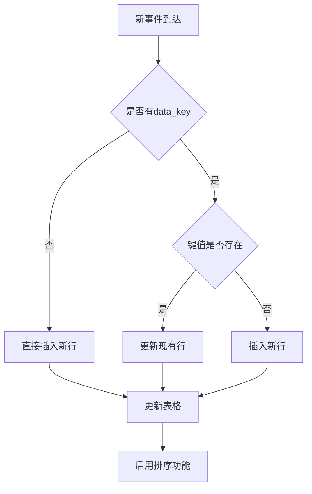
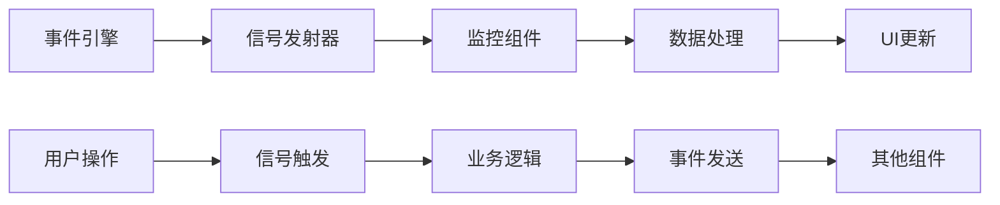

# 交易组件设计与实现文档

<cite>
**本文档引用的文件**
- [widget.py](file://vnpy/trader/ui/widget.py)
- [mainwindow.py](file://vnpy/trader/ui/mainwindow.py)
- [object.py](file://vnpy/trader/object.py)
- [constant.py](file://vnpy/trader/constant.py)
- [event.py](file://vnpy/trader/event.py)
</cite>

## 目录
1. [简介](#简介)
2. [项目结构概览](#项目结构概览)
3. [核心组件架构](#核心组件架构)
4. [OrderMonitor委托单监控](#ordermonitor委托单监控)
5. [TradeMonitor成交回报监控](#trademonitor成交回报监控)
6. [BaseMonitor基类设计](#basemonitor基类设计)
7. [事件驱动架构](#事件驱动架构)
8. [数据绑定与信号槽机制](#数据绑定与信号槽机制)
9. [定制化开发指南](#定制化开发指南)
10. [性能优化建议](#性能优化建议)
11. [故障排除指南](#故障排除指南)
12. [总结](#总结)

## 简介

vnpy交易组件是一个基于Qt框架构建的高性能交易监控系统，专门用于实时监控和管理交易过程中的委托单和成交回报。该系统采用事件驱动架构，通过统一的数据模型和灵活的UI组件，为交易员提供了直观、高效的交易监控界面。

本文档将深入解析OrderMonitor和TradeMonitor两大核心组件的设计理念、实现细节以及扩展方法，帮助开发者理解其工作原理并进行定制化开发。

## 项目结构概览

交易组件位于`vnpy/trader/ui`目录下，主要包含以下关键文件：



**图表来源**
- [widget.py](file://vnpy/trader/ui/widget.py#L1-L50)
- [mainwindow.py](file://vnpy/trader/ui/mainwindow.py#L1-L30)

**章节来源**
- [widget.py](file://vnpy/trader/ui/widget.py#L1-L100)
- [mainwindow.py](file://vnpy/trader/ui/mainwindow.py#L1-L50)

## 核心组件架构

交易组件采用分层架构设计，从底层的数据模型到上层的UI组件，形成了清晰的职责分离：



**图表来源**
- [widget.py](file://vnpy/trader/ui/widget.py#L200-L300)
- [widget.py](file://vnpy/trader/ui/widget.py#L475-L530)

## OrderMonitor委托单监控

OrderMonitor是交易系统中最核心的监控组件之一，专门负责实时跟踪和显示委托单的状态变化。

### 基本属性配置

```python
class OrderMonitor(BaseMonitor):
    """
    Monitor for order data.
    """

    event_type: str = EVENT_ORDER
    data_key: str = "vt_orderid"
    sorting: bool = True

    headers: dict = {
        "orderid": {"display": _("委托号"), "cell": BaseCell, "update": False},
        "reference": {"display": _("来源"), "cell": BaseCell, "update": False},
        "symbol": {"display": _("代码"), "cell": BaseCell, "update": False},
        "exchange": {"display": _("交易所"), "cell": EnumCell, "update": False},
        "type": {"display": _("类型"), "cell": EnumCell, "update": False},
        "direction": {"display": _("方向"), "cell": DirectionCell, "update": False},
        "offset": {"display": _("开平"), "cell": EnumCell, "update": False},
        "price": {"display": _("价格"), "cell": BaseCell, "update": False},
        "volume": {"display": _("总数量"), "cell": BaseCell, "update": True},
        "traded": {"display": _("已成交"), "cell": BaseCell, "update": True},
        "status": {"display": _("状态"), "cell": EnumCell, "update": True},
        "datetime": {"display": _("时间"), "cell": TimeCell, "update": True},
        "gateway_name": {"display": _("接口"), "cell": BaseCell, "update": False},
    }
```

### 双击撤单功能

OrderMonitor实现了便捷的双击撤单功能，这是其最重要的用户交互特性：

```python
def init_ui(self) -> None:
    """
    Connect signal.
    """
    super().init_ui()

    self.setToolTip(_("双击单元格撤单"))
    self.itemDoubleClicked.connect(self.cancel_order)

def cancel_order(self, cell: BaseCell) -> None:
    """
    Cancel order if cell double clicked.
    """
    order: OrderData = cell.get_data()
    req: CancelRequest = order.create_cancel_request()
    self.main_engine.cancel_order(req, order.gateway_name)
```

### 动态更新机制

OrderMonitor通过精心设计的表头字段实现动态更新：

- **静态字段**（update=False）：委托号、代码、交易所等基本信息保持不变
- **动态字段**（update=True）：数量、已成交、状态等实时变化的信息会自动刷新
- **时间字段**：使用TimeCell格式化显示精确的时间戳

### 状态颜色标识

系统通过颜色编码直观显示委托状态：



**图表来源**
- [constant.py](file://vnpy/trader/constant.py#L25-L35)
- [widget.py](file://vnpy/trader/ui/widget.py#L80-L120)

**章节来源**
- [widget.py](file://vnpy/trader/ui/widget.py#L475-L530)
- [object.py](file://vnpy/trader/object.py#L117-L168)

## TradeMonitor成交回报监控

TradeMonitor负责实时显示成交回报信息，为交易员提供即时的成交确认和历史记录。

### 成交数据结构

```python
class TradeMonitor(BaseMonitor):
    """
    Monitor for trade data.
    """

    event_type: str = EVENT_TRADE
    data_key: str = ""
    sorting: bool = True

    headers: dict = {
        "tradeid": {"display": _("成交号"), "cell": BaseCell, "update": False},
        "orderid": {"display": _("委托号"), "cell": BaseCell, "update": False},
        "symbol": {"display": _("代码"), "cell": BaseCell, "update": False},
        "exchange": {"display": _("交易所"), "cell": EnumCell, "update": False},
        "direction": {"display": _("方向"), "cell": DirectionCell, "update": False},
        "offset": {"display": _("开平"), "cell": EnumCell, "update": False},
        "price": {"display": _("价格"), "cell": BaseCell, "update": False},
        "volume": {"display": _("数量"), "cell": BaseCell, "update": False},
        "datetime": {"display": _("时间"), "cell": TimeCell, "update": False},
        "gateway_name": {"display": _("接口"), "cell": BaseCell, "update": False},
    }
```

### 不可编辑设计原则

TradeMonitor采用不可编辑的设计原则，确保成交信息的准确性和完整性：

- **只读模式**：所有单元格设置为不可编辑状态
- **数据验证**：通过严格的数据类型检查防止错误输入
- **历史追溯**：完整的成交历史记录便于事后分析

### 实时成交通知

TradeMonitor通过EVENT_TRADE事件实时接收成交数据：



**图表来源**
- [widget.py](file://vnpy/trader/ui/widget.py#L280-L320)
- [event.py](file://vnpy/trader/event.py#L8-L12)

**章节来源**
- [widget.py](file://vnpy/trader/ui/widget.py#L475-L530)
- [object.py](file://vnpy/trader/object.py#L165-L224)

## BaseMonitor基类设计

BaseMonitor是所有监控组件的基类，提供了统一的事件处理、数据管理和UI渲染框架。

### 统一事件处理机制

```python
def register_event(self) -> None:
    """
    Register event handler into event engine.
    """
    if self.event_type:
        self.signal.connect(self.process_event)
        self.event_engine.register(self.event_type, self.signal.emit)
```

### 数据行管理策略

BaseMonitor采用智能的数据行管理策略：



**图表来源**
- [widget.py](file://vnpy/trader/ui/widget.py#L280-L320)

### 单元格类型系统

系统提供了丰富的单元格类型来满足不同的数据展示需求：

```python
class BaseCell(QtWidgets.QTableWidgetItem):
    """通用单元格，用于表格控件"""
    
class EnumCell(BaseCell):
    """用于显示枚举数据的单元格"""
    
class DirectionCell(EnumCell):
    """用于显示买卖方向的单元格，带颜色标识"""
    
class TimeCell(BaseCell):
    """用于显示时间字符串的单元格"""
    
class PnlCell(BaseCell):
    """用于显示盈亏数据的单元格，带颜色标识"""
```

**章节来源**
- [widget.py](file://vnpy/trader/ui/widget.py#L200-L350)

## 事件驱动架构

vnpy采用基于事件驱动的架构模式，通过统一的事件引擎实现松耦合的组件通信。

### 事件类型定义

```python
EVENT_TICK = "eTick."        # 行情事件
EVENT_TRADE = "eTrade."      # 成交事件  
EVENT_ORDER = "eOrder."      # 委托事件
EVENT_POSITION = "ePosition." # 持仓事件
EVENT_ACCOUNT = "eAccount."   # 资金事件
EVENT_QUOTE = "eQuote."      # 报价事件
EVENT_CONTRACT = "eContract." # 合约事件
EVENT_LOG = "eLog"          # 日志事件
```

### 信号槽连接机制

每个监控组件都通过信号槽机制与事件引擎建立连接：



**图表来源**
- [widget.py](file://vnpy/trader/ui/widget.py#L280-L300)
- [event.py](file://vnpy/trader/event.py#L1-L15)

**章节来源**
- [event.py](file://vnpy/trader/event.py#L1-L15)
- [widget.py](file://vnpy/trader/ui/widget.py#L280-L320)

## 数据绑定与信号槽机制

### 数据绑定策略

交易组件采用双向数据绑定策略，确保UI与数据模型的一致性：

1. **单向绑定**：事件驱动的数据流向
2. **双向绑定**：用户操作触发数据更新
3. **延迟绑定**：批量更新减少性能开销

### ActiveOrderMonitor特殊处理

ActiveOrderMonitor继承自OrderMonitor，但添加了特殊的过滤逻辑：

```python
class ActiveOrderMonitor(OrderMonitor):
    """
    Monitor which shows active order only.
    """

    def process_event(self, event: Event) -> None:
        """
        Hides the row if order is not active.
        """
        super().process_event(event)

        order: OrderData = event.data
        row_cells: dict = self.cells[order.vt_orderid]
        row: int = self.row(row_cells["volume"])

        if order.is_active():
            self.showRow(row)
        else:
            self.hideRow(row)
```

**章节来源**
- [widget.py](file://vnpy/trader/ui/widget.py#L750-L770)

## 定制化开发指南

### 新增过滤条件

开发者可以通过继承现有组件来实现自定义过滤功能：

```python
class FilteredOrderMonitor(OrderMonitor):
    def __init__(self, main_engine, event_engine, filters=None):
        super().__init__(main_engine, event_engine)
        self.filters = filters or {}
    
    def process_event(self, event: Event) -> None:
        order = event.data
        
        # 应用过滤条件
        if self.apply_filters(order):
            super().process_event(event)
    
    def apply_filters(self, order: OrderData) -> bool:
        for key, value in self.filters.items():
            if getattr(order, key) != value:
                return False
        return True
```

### 导出交易记录功能

系统内置了CSV导出功能，支持自定义导出格式：

```python
def save_csv(self) -> None:
    """
    Save table data into a csv file
    """
    path, __ = QtWidgets.QFileDialog.getSaveFileName(
        self, _("保存数据"), "", "CSV(*.csv)")

    if not path:
        return

    with open(path, "w") as f:
        writer = csv.writer(f, lineterminator="\n")

        headers: list = [d["display"] for d in self.headers.values()]
        writer.writerow(headers)

        for row in range(self.rowCount()):
            if self.isRowHidden(row):
                continue

            row_data: list = []
            for column in range(self.columnCount()):
                item: QtWidgets.QTableWidgetItem | None = self.item(row, column)
                if item:
                    row_data.append(str(item.text()))
                else:
                    row_data.append("")
            writer.writerow(row_data)
```

### 高亮异常订单

实现异常订单的视觉高亮功能：

```python
class HighlightedOrderMonitor(OrderMonitor):
    def update_old_row(self, data: Any) -> None:
        super().update_old_row(data)
        
        # 高亮异常订单
        if self.is_abnormal_order(data):
            self.highlight_row(data.vt_orderid, QColor("red"))
    
    def is_abnormal_order(self, order: OrderData) -> bool:
        # 异常条件判断逻辑
        return (order.status == Status.REJECTED or 
                order.traded / order.volume < 0.1)
    
    def highlight_row(self, key: str, color: QColor) -> None:
        row_cells = self.cells[key]
        for cell in row_cells.values():
            cell.setForeground(color)
```

**章节来源**
- [widget.py](file://vnpy/trader/ui/widget.py#L350-L400)

## 性能优化建议

### 大数据量处理

对于大量订单或成交数据的场景，建议采用以下优化策略：

1. **虚拟滚动**：只渲染可见区域的行
2. **数据分页**：按时间段或状态分页显示
3. **异步加载**：使用后台线程处理大数据集

### 内存管理

```python
class OptimizedMonitor(BaseMonitor):
    def __init__(self, *args, max_rows=1000, **kwargs):
        super().__init__(*args, **kwargs)
        self.max_rows = max_rows
        self.row_count = 0
    
    def process_event(self, event: Event) -> None:
        # 控制行数上限
        if self.row_count >= self.max_rows:
            self.removeRow(self.rowCount() - 1)
            self.row_count -= 1
        
        super().process_event(event)
        self.row_count += 1
```

### 排序性能优化

禁用排序功能可以显著提升性能：

```python
class PerformanceOptimizedMonitor(BaseMonitor):
    sorting: bool = False  # 禁用排序以提升性能
```

## 故障排除指南

### 常见问题诊断

1. **事件不更新**
   - 检查事件类型是否正确注册
   - 验证数据键值是否匹配
   - 确认信号槽连接是否正常

2. **UI卡顿**
   - 减少实时更新频率
   - 使用异步处理大数据
   - 优化单元格渲染逻辑

3. **内存泄漏**
   - 及时清理不再使用的行
   - 正确释放事件连接
   - 监控组件生命周期

### 调试技巧

```python
class DebugMonitor(BaseMonitor):
    def process_event(self, event: Event) -> None:
        print(f"Processing event: {event.type}, data: {event.data}")
        super().process_event(event)
```

**章节来源**
- [widget.py](file://vnpy/trader/ui/widget.py#L280-L320)

## 总结

vnpy的交易组件系统展现了优秀的软件架构设计，通过统一的BaseMonitor基类、灵活的事件驱动机制和丰富的内容单元格类型，为交易监控提供了强大而易用的解决方案。

### 主要优势

1. **模块化设计**：清晰的职责分离和可扩展的架构
2. **事件驱动**：松耦合的组件通信机制
3. **类型安全**：强类型的单元格系统确保数据准确性
4. **用户体验**：直观的颜色标识和便捷的操作方式
5. **性能优化**：智能的数据管理和渲染策略

### 扩展建议

开发者可以根据具体需求，在现有基础上进行以下扩展：

- 添加自定义过滤器和搜索功能
- 实现数据可视化图表
- 集成第三方数据分析工具
- 开发移动端适配版本

通过深入理解这些核心组件的设计原理和实现细节，开发者能够更好地利用vnpy平台进行交易系统的二次开发和定制化部署。