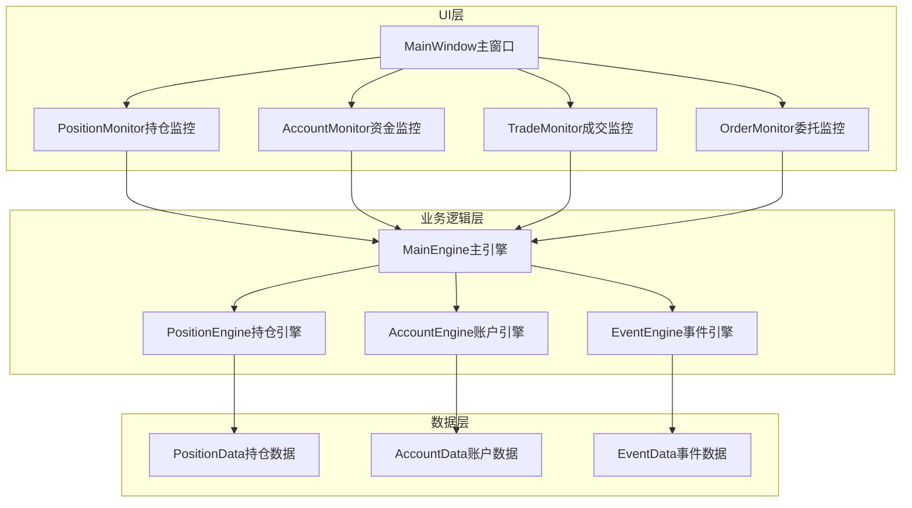
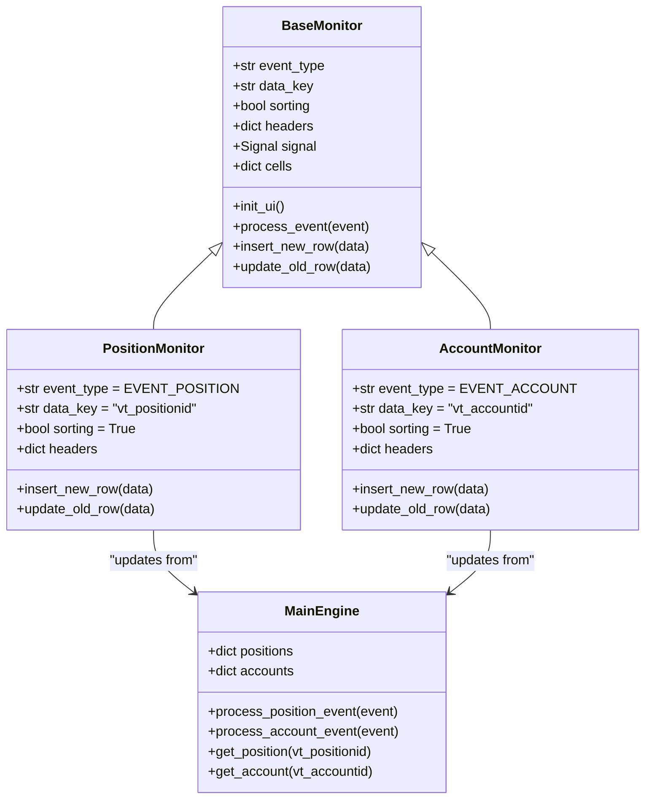
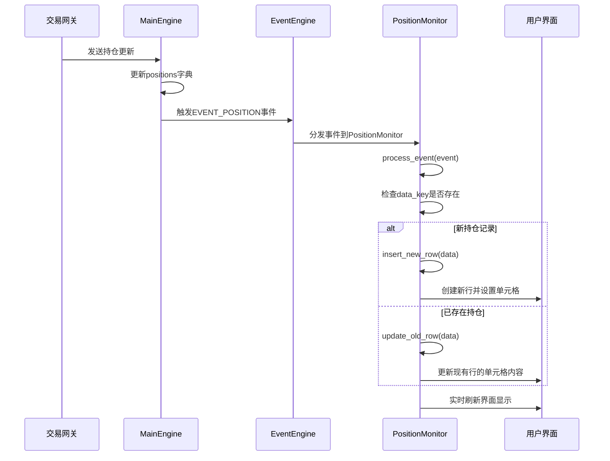
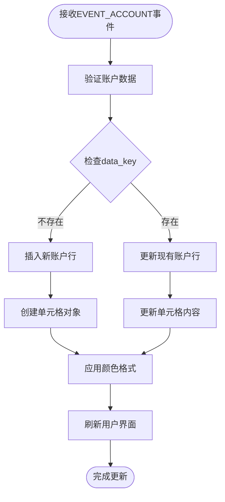
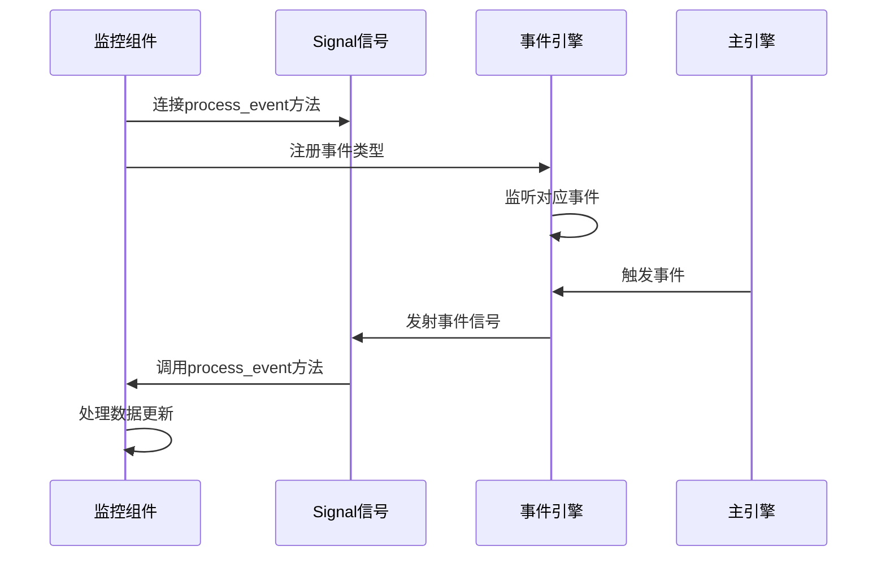

# 持仓与资金组件监控系统

<cite>
**本文档引用的文件**
- [widget.py](file://vnpy/trader/ui/widget.py)
- [engine.py](file://vnpy/trader/engine.py)
- [object.py](file://vnpy/trader/object.py)
- [event.py](file://vnpy/trader/event.py)
- [constant.py](file://vnpy/trader/constant.py)
- [mainwindow.py](file://vnpy/trader/ui/mainwindow.py)
- [utility.py](file://vnpy/trader/utility.py)
</cite>

## 目录
1. [简介](#简介)
2. [项目结构概览](#项目结构概览)
3. [核心组件架构](#核心组件架构)
4. [PositionMonitor持仓监控组件](#positionmonitor持仓监控组件)
5. [AccountMonitor资金账户监控组件](#accountmonitor资金账户监控组件)
6. [事件驱动机制](#事件驱动机制)
7. [数据更新策略](#数据更新策略)
8. [组件扩展方案](#组件扩展方案)
9. [性能优化考虑](#性能优化考虑)
10. [故障排除指南](#故障排除指南)
11. [总结](#总结)

## 简介

本文档深入分析了vnpy交易平台中持仓监控(PositionMonitor)与资金账户监控(AccountMonitor)两个核心组件的实现机制。这两个组件是交易系统中不可或缺的监控模块，负责实时展示用户的持仓信息和资金账户状态，为交易决策提供关键数据支持。

PositionMonitor通过监听EVENT_POSITION事件，实时更新持仓数量、冻结量、持仓均价及浮动盈亏等关键指标，并特别强调方向区分（多空）和昨仓管理的重要性。AccountMonitor则基于EVENT_ACCOUNT事件驱动，动态展示账户余额、可用资金、冻结金额等核心财务数据。

## 项目结构概览

vnpy交易平台采用模块化设计，持仓和资金监控组件位于`vnpy/trader/ui/widget.py`文件中，与其他监控组件共同构成了完整的UI监控体系。



**图表来源**
- [mainwindow.py](file://vnpy/trader/ui/mainwindow.py#L65-L94)
- [widget.py](file://vnpy/trader/ui/widget.py#L228-L279)

## 核心组件架构

PositionMonitor和AccountMonitor都继承自BaseMonitor基类，采用了统一的设计模式和事件驱动架构。



**图表来源**
- [widget.py](file://vnpy/trader/ui/widget.py#L228-L279)
- [widget.py](file://vnpy/trader/ui/widget.py#L503-L540)
- [widget.py](file://vnpy/trader/ui/widget.py#L537-L562)
- [engine.py](file://vnpy/trader/engine.py#L368-L403)

**章节来源**
- [widget.py](file://vnpy/trader/ui/widget.py#L228-L562)
- [engine.py](file://vnpy/trader/engine.py#L368-L403)

## PositionMonitor持仓监控组件

PositionMonitor是专门用于监控用户持仓情况的核心组件，它通过监听EVENT_POSITION事件来实现实时数据更新。

### 组件特性

PositionMonitor具有以下关键特性：

1. **唯一标识符(data_key)**：使用"vt_positionid"作为数据键，确保每个持仓记录的唯一性
2. **方向区分**：支持多头(LONG)和空头(SHORT)持仓的精确区分
3. **昨仓管理**：包含yd_volume字段专门管理昨日持仓
4. **浮动盈亏**：通过pnl字段实时计算并展示持仓浮动盈亏
5. **冻结控制**：跟踪持仓的冻结数量(frozen)，防止超限操作

### 表头配置详解

```python
headers: dict = {
    "symbol": {"display": _("代码"), "cell": BaseCell, "update": False},
    "exchange": {"display": _("交易所"), "cell": EnumCell, "update": False},
    "direction": {"display": _("方向"), "cell": DirectionCell, "update": False},
    "volume": {"display": _("数量"), "cell": BaseCell, "update": True},
    "yd_volume": {"display": _("昨仓"), "cell": BaseCell, "update": True},
    "frozen": {"display": _("冻结"), "cell": BaseCell, "update": True},
    "price": {"display": _("均价"), "cell": BaseCell, "update": True},
    "pnl": {"display": _("盈亏"), "cell": PnlCell, "update": True},
    "gateway_name": {"display": _("接口"), "cell": BaseCell, "update": False},
}
```

### 数据更新流程



**图表来源**
- [engine.py](file://vnpy/trader/engine.py#L385-L395)
- [widget.py](file://vnpy/trader/ui/widget.py#L279-L320)

### 方向区分与昨仓管理

PositionMonitor特别强调方向区分和昨仓管理的重要性：

1. **方向区分**：
   - 多头持仓(DIRECTION_LONG)：表示持有买入仓位
   - 空头持仓(DIRECTION_SHORT)：表示持有卖出仓位
   - 方向信息通过DirectionCell进行颜色标记，红色表示多头，绿色表示空头

2. **昨仓管理**：
   - yd_volume字段专门存储昨日持仓数量
   - 支持平昨和平今两种平仓方式
   - 昨仓数据对于风险管理至关重要

**章节来源**
- [widget.py](file://vnpy/trader/ui/widget.py#L503-L540)
- [object.py](file://vnpy/trader/object.py#L140-L155)

## AccountMonitor资金账户监控组件

AccountMonitor负责监控用户的资金账户状态，通过监听EVENT_ACCOUNT事件来实时更新账户相关信息。

### 组件特性

AccountMonitor的核心特性包括：

1. **账户唯一标识**：使用"vt_accountid"作为数据键，确保每个账户的唯一性
2. **三元组财务指标**：同时展示余额、冻结金额和可用资金
3. **动态计算**：available字段自动计算(balance - frozen)
4. **多接口支持**：支持多个交易接口的资金账户监控

### 表头配置详解

```python
headers: dict = {
    "accountid": {"display": _("账号"), "cell": BaseCell, "update": False},
    "balance": {"display": _("余额"), "cell": BaseCell, "update": True},
    "frozen": {"display": _("冻结"), "cell": BaseCell, "update": True},
    "available": {"display": _("可用"), "cell": BaseCell, "update": True},
    "gateway_name": {"display": _("接口"), "cell": BaseCell, "update": False},
}
```

### 资金计算逻辑

AccountMonitor实现了智能的资金计算逻辑：

```python
@dataclass
class AccountData(BaseData):
    accountid: str
    balance: float = 0
    frozen: float = 0
    
    def __post_init__(self) -> None:
        self.available: float = self.balance - self.frozen
        self.vt_accountid: str = f"{self.gateway_name}.{self.accountid}"
```

### 数据更新策略



**图表来源**
- [widget.py](file://vnpy/trader/ui/widget.py#L279-L320)
- [object.py](file://vnpy/trader/object.py#L200-L215)

**章节来源**
- [widget.py](file://vnpy/trader/ui/widget.py#L537-L562)
- [object.py](file://vnpy/trader/object.py#L200-L215)

## 事件驱动机制

PositionMonitor和AccountMonitor都基于事件驱动架构，这种设计模式提供了高效的数据同步和响应能力。

### 事件注册与分发



**图表来源**
- [widget.py](file://vnpy/trader/ui/widget.py#L279-L285)
- [engine.py](file://vnpy/trader/engine.py#L350-L360)

### 事件类型定义

系统中定义了多种事件类型，其中与监控组件直接相关的是：

```python
EVENT_POSITION = "ePosition."  # 持仓事件
EVENT_ACCOUNT = "eAccount."    # 账户事件
```

这些事件由MainEngine在接收到相应数据后触发，确保监控组件能够及时响应数据变化。

**章节来源**
- [event.py](file://vnpy/trader/event.py#L0-L13)
- [engine.py](file://vnpy/trader/engine.py#L350-L360)

## 数据更新策略

PositionMonitor和AccountMonitor采用了智能的数据更新策略，确保界面显示的准确性和实时性。

### 去重与索引机制

两个组件都使用data_key字段来实现数据去重和索引：

1. **PositionMonitor**：使用"vt_positionid"作为唯一标识
2. **AccountMonitor**：使用"vt_accountid"作为唯一标识

这种设计确保了：
- 同一持仓或账户不会重复显示
- 数据更新时能够准确定位到对应的界面行
- 避免内存泄漏和性能问题

### 更新策略配置

每个表头字段都有一个"update"标志，决定是否需要实时更新：

```python
# PositionMonitor的更新策略
{
    "symbol": {"update": False},    # 不需要更新
    "volume": {"update": True},     # 需要实时更新
    "pnl": {"update": True},        # 需要实时更新
}

# AccountMonitor的更新策略
{
    "accountid": {"update": False}, # 不需要更新
    "balance": {"update": True},    # 需要实时更新
    "available": {"update": True},  # 需要实时更新
}
```

### PnlCell高亮显示

PositionMonitor中的pnl字段使用PnlCell进行特殊处理，实现了盈亏颜色的智能高亮：

```python
class PnlCell(BaseCell):
    def set_content(self, content: Any, data: Any) -> None:
        super().set_content(content, data)
        
        if str(content).startswith("-"):
            self.setForeground(COLOR_SHORT)  # 绿色表示亏损
        else:
            self.setForeground(COLOR_LONG)   # 红色表示盈利
```

**章节来源**
- [widget.py](file://vnpy/trader/ui/widget.py#L503-L540)
- [widget.py](file://vnpy/trader/ui/widget.py#L537-L562)
- [widget.py](file://vnpy/trader/ui/widget.py#L100-L115)

## 组件扩展方案

基于现有的架构设计，可以轻松扩展PositionMonitor和AccountMonitor的功能。

### 多账户聚合显示

扩展方案1：多账户聚合显示

```python
class MultiAccountMonitor(AccountMonitor):
    def __init__(self, main_engine: MainEngine, event_engine: EventEngine) -> None:
        super().__init__(main_engine, event_engine)
        self.aggregated_accounts: dict = {}
    
    def process_event(self, event: Event) -> None:
        super().process_event(event)
        self.aggregate_accounts()
    
    def aggregate_accounts(self) -> None:
        # 实现多账户聚合逻辑
        pass
```

### 持仓盈亏计算逻辑替换

扩展方案2：自定义盈亏计算

```python
class AdvancedPositionMonitor(PositionMonitor):
    def calculate_pnl(self, position: PositionData) -> float:
        # 自定义盈亏计算逻辑
        # 可以考虑历史成本、市场价值等多种因素
        return calculated_pnl
    
    def update_old_row(self, data: Any) -> None:
        # 使用自定义计算逻辑
        pnl_value = self.calculate_pnl(data)
        data.pnl = pnl_value
        super().update_old_row(data)
```

### 自定义风险指标集成

扩展方案3：风险指标集成

```python
class RiskAwarePositionMonitor(PositionMonitor):
    def __init__(self, main_engine: MainEngine, event_engine: EventEngine) -> None:
        super().__init__(main_engine, event_engine)
        self.risk_calculator = RiskCalculator()
    
    def process_event(self, event: Event) -> None:
        super().process_event(event)
        self.update_risk_metrics()
    
    def update_risk_metrics(self) -> None:
        # 计算并显示风险指标
        risk_level = self.risk_calculator.calculate_total_risk()
        self.display_risk_level(risk_level)
```

### 批量数据处理优化

对于大量持仓数据的场景，可以实现批量处理优化：

```python
class BatchPositionMonitor(PositionMonitor):
    def __init__(self, main_engine: MainEngine, event_engine: EventEngine) -> None:
        super().__init__(main_engine, event_engine)
        self.batch_updates: list = []
        self.batch_timer = QtCore.QTimer()
        self.batch_timer.timeout.connect(self.flush_batch_updates)
    
    def process_event(self, event: Event) -> None:
        self.batch_updates.append(event.data)
        if len(self.batch_updates) >= 10:  # 批量大小阈值
            self.flush_batch_updates()
    
    def flush_batch_updates(self) -> None:
        # 批量处理更新
        self.batch_updates.clear()
```

## 性能优化考虑

在实际应用中，PositionMonitor和AccountMonitor的性能优化至关重要。

### 内存管理

1. **数据清理**：定期清理不再活跃的持仓和账户数据
2. **缓存策略**：合理设置cells字典的大小，避免内存溢出
3. **垃圾回收**：及时释放不再使用的单元格对象

### 更新频率控制

1. **事件过滤**：只处理必要的事件更新
2. **批量更新**：对于高频事件，采用批量处理策略
3. **延迟刷新**：适当增加界面刷新的间隔时间

### UI渲染优化

1. **异步更新**：将数据处理和UI更新分离到不同线程
2. **虚拟滚动**：对于大量数据，实现虚拟滚动技术
3. **增量渲染**：只重新渲染发生变化的单元格

## 故障排除指南

### 常见问题诊断

1. **数据不更新**
   - 检查事件注册是否正确
   - 验证data_key是否匹配
   - 确认update标志设置正确

2. **界面显示异常**
   - 检查单元格类型配置
   - 验证颜色设置逻辑
   - 确认排序功能状态

3. **性能问题**
   - 监控内存使用情况
   - 检查事件处理效率
   - 优化批量更新逻辑

### 调试技巧

1. **事件追踪**：启用事件日志记录
2. **数据验证**：检查原始数据完整性
3. **组件隔离**：单独测试监控组件功能

**章节来源**
- [widget.py](file://vnpy/trader/ui/widget.py#L279-L320)
- [engine.py](file://vnpy/trader/engine.py#L385-L403)

## 总结

PositionMonitor和AccountMonitor作为vnpy交易平台的核心监控组件，通过精心设计的事件驱动架构和智能的数据更新策略，为用户提供实时、准确的持仓和资金信息。它们不仅展示了优秀的软件设计原则，还为后续的功能扩展和性能优化奠定了坚实的基础。

主要特点总结：

1. **事件驱动架构**：基于EVENT_POSITION和EVENT_ACCOUNT事件的实时数据更新
2. **智能去重机制**：通过data_key实现数据唯一性和索引管理
3. **方向区分与昨仓管理**：PositionMonitor特别强调多空方向和昨仓的重要性
4. **动态颜色显示**：PnlCell实现盈亏颜色的智能高亮
5. **可扩展设计**：基于BaseMonitor的统一架构，便于功能扩展

通过深入理解这些组件的工作原理，开发者可以更好地维护现有功能，并根据实际需求进行定制化开发，进一步提升交易平台的用户体验和功能性。