# 核心交易组件

<cite>
**本文档中引用的文件**
- [widget.py](file://vnpy/trader/ui/widget.py)
- [qt.py](file://vnpy/trader/ui/qt.py)
- [mainwindow.py](file://vnpy/trader/ui/mainwindow.py)
- [engine.py](file://vnpy/event/engine.py)
- [widget.py](file://vnpy/chart/widget.py)
</cite>

## 目录
1. [简介](#简介)
2. [项目结构](#项目结构)
3. [核心组件概览](#核心组件概览)
4. [架构设计](#架构设计)
5. [详细组件分析](#详细组件分析)
6. [MVC模式实现](#mvc模式实现)
7. [组件通信机制](#组件通信机制)
8. [数据绑定与信号槽](#数据绑定与信号槽)
9. [性能优化策略](#性能优化策略)
10. [故障排除指南](#故障排除指南)
11. [总结](#总结)

## 简介

vnpy的核心交易组件是一个基于PySide6构建的高性能交易界面框架，采用事件驱动架构和MVC设计模式，为量化交易提供了完整的UI解决方案。该框架包含行情监控、订单输入、成交回报、持仓展示和资金账户等核心功能模块，支持实时数据刷新和用户交互操作。

## 项目结构

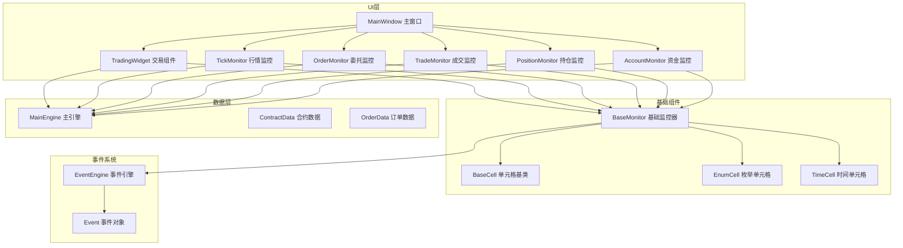

**图表来源**
- [mainwindow.py](file://vnpy/trader/ui/mainwindow.py#L1-L334)
- [widget.py](file://vnpy/trader/ui/widget.py#L1-L1293)

**章节来源**
- [mainwindow.py](file://vnpy/trader/ui/mainwindow.py#L1-L334)
- [widget.py](file://vnpy/trader/ui/widget.py#L1-L1293)

## 核心组件概览

### 组件分类体系

核心交易组件按照功能可分为以下几大类：

1. **监控组件**：负责实时显示各类交易数据
   - TickMonitor：行情数据监控
   - OrderMonitor：委托订单监控
   - TradeMonitor：成交回报监控
   - PositionMonitor：持仓信息监控
   - AccountMonitor：资金账户监控
   - LogMonitor：系统日志监控

2. **交互组件**：提供用户操作界面
   - TradingWidget：手动交易组件
   - ConnectDialog：网关连接对话框
   - ContractManager：合约查询管理器

3. **辅助组件**：支持功能扩展
   - BaseMonitor：基础监控器基类
   - BaseCell：单元格基类
   - 各种专用单元格类（EnumCell、TimeCell等）

### 数据流架构

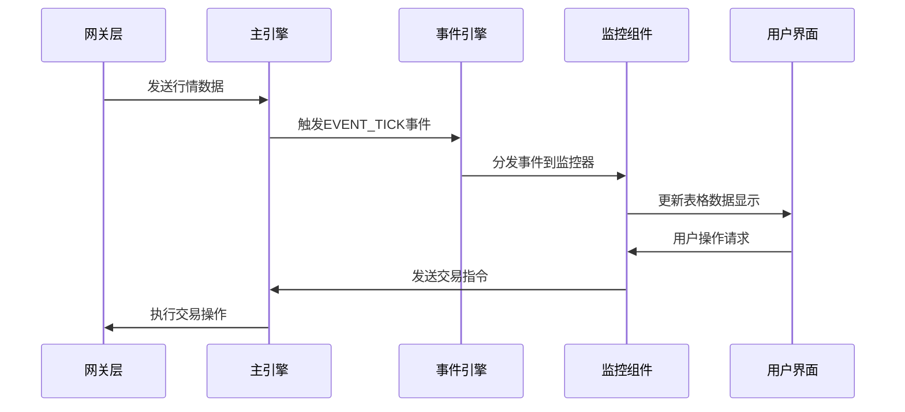

**图表来源**
- [engine.py](file://vnpy/event/engine.py#L1-L144)
- [widget.py](file://vnpy/trader/ui/widget.py#L281-L326)

**章节来源**
- [widget.py](file://vnpy/trader/ui/widget.py#L411-L700)

## 架构设计

### 整体架构模式

核心交易组件采用分层架构设计，遵循MVC（Model-View-Controller）模式：

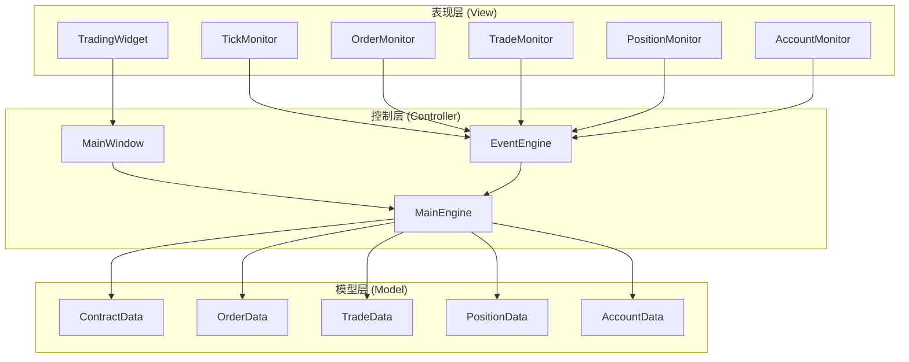

**图表来源**
- [mainwindow.py](file://vnpy/trader/ui/mainwindow.py#L30-L60)
- [widget.py](file://vnpy/trader/ui/widget.py#L1-L50)

### 设计原则

1. **单一职责原则**：每个组件专注于特定功能领域
2. **开放封闭原则**：对扩展开放，对修改封闭
3. **依赖倒置原则**：高层模块不依赖低层模块的具体实现
4. **事件驱动架构**：通过事件系统解耦组件间的直接依赖

**章节来源**
- [widget.py](file://vnpy/trader/ui/widget.py#L1-L100)
- [mainwindow.py](file://vnpy/trader/ui/mainwindow.py#L1-L60)

## 详细组件分析

### TickMonitor - 行情监控组件

TickMonitor是行情数据监控的核心组件，负责实时显示市场行情信息。

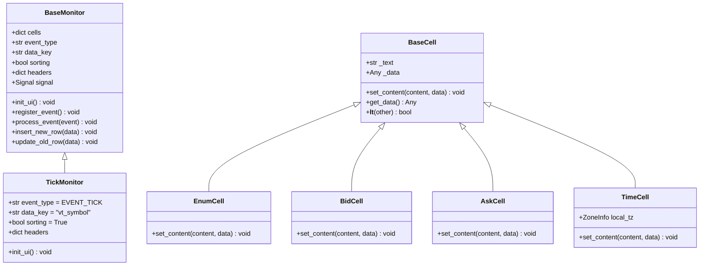

**图表来源**
- [widget.py](file://vnpy/trader/ui/widget.py#L35-L100)
- [widget.py](file://vnpy/trader/ui/widget.py#L411-L440)

#### 核心功能特性

1. **实时数据更新**：支持毫秒级行情数据刷新
2. **智能排序**：自动按最新价、成交量等字段排序
3. **颜色标识**：使用不同颜色区分买卖盘口
4. **右键菜单**：提供列宽调整和数据导出功能

#### 数据绑定机制

```python
# 行情监控的数据绑定示例
headers = {
    "symbol": {"display": "代码", "cell": BaseCell, "update": False},
    "last_price": {"display": "最新价", "cell": BaseCell, "update": True},
    "bid_price_1": {"display": "买1价", "cell": BidCell, "update": True},
    "ask_price_1": {"display": "卖1价", "cell": AskCell, "update": True},
    "datetime": {"display": "时间", "cell": TimeCell, "update": True},
}
```

**章节来源**
- [widget.py](file://vnpy/trader/ui/widget.py#L411-L440)

### TradingWidget - 交易组件

TradingWidget是用户进行手动交易的主要界面，集成了订单输入、市场深度显示和实时行情更新功能。

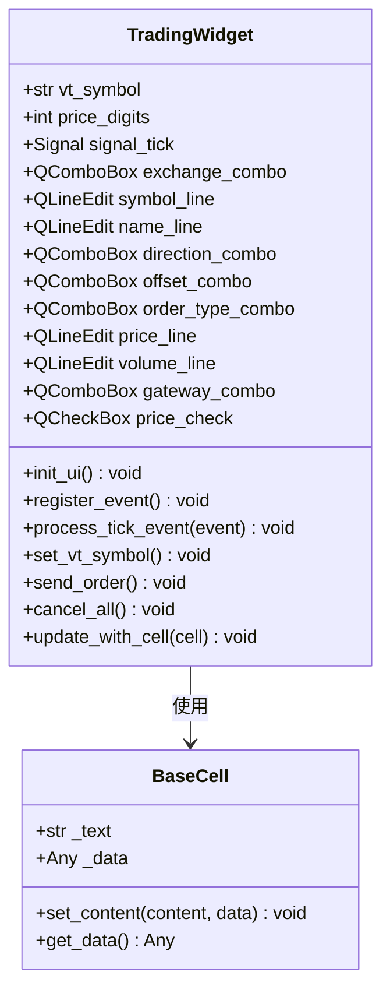

**图表来源**
- [widget.py](file://vnpy/trader/ui/widget.py#L700-L800)

#### 交易功能流程

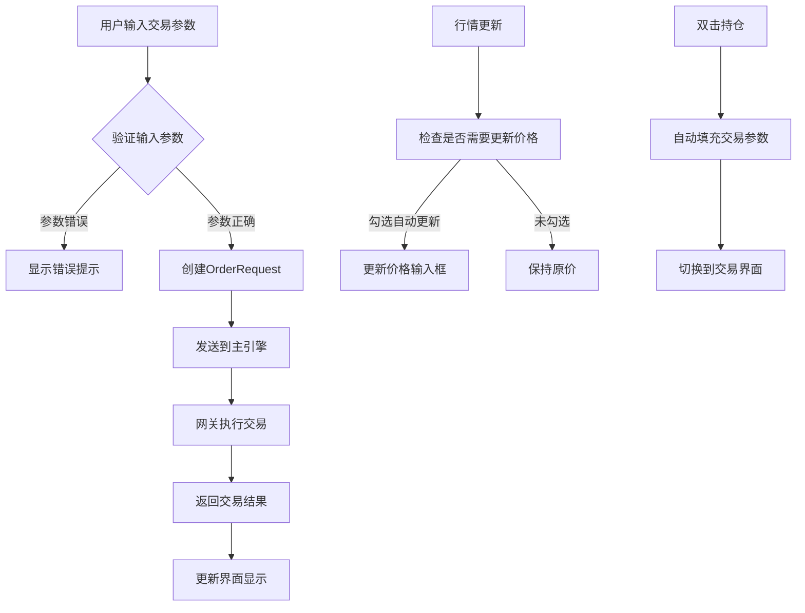

**图表来源**
- [widget.py](file://vnpy/trader/ui/widget.py#L900-L1000)

#### 市场深度显示

TradingWidget内置了五档市场深度显示功能：

1. **买盘深度**：显示买1到买5的价格和数量
2. **卖盘深度**：显示卖1到卖5的价格和数量  
3. **最新价**：实时显示当前最新成交价格
4. **涨跌幅**：计算并显示相对于前收盘价的涨跌幅

**章节来源**
- [widget.py](file://vnpy/trader/ui/widget.py#L700-L900)

### OrderMonitor - 委托监控组件

OrderMonitor专门用于监控委托订单的状态变化，提供完整的订单生命周期跟踪。

#### 订单状态管理

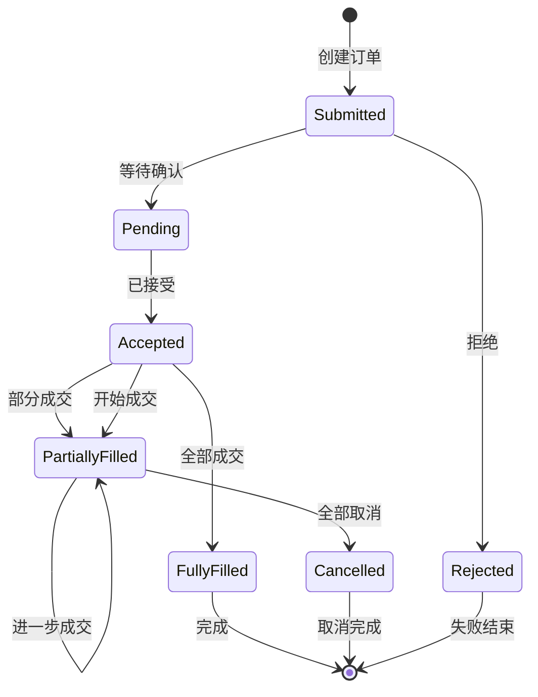

#### 双击撤单功能

OrderMonitor实现了便捷的双击撤单功能：

```python
def cancel_order(self, cell: BaseCell) -> None:
    """如果单元格被双击，则撤单"""
    order: OrderData = cell.get_data()
    req: CancelRequest = order.create_cancel_request()
    self.main_engine.cancel_order(req, order.gateway_name)
```

**章节来源**
- [widget.py](file://vnpy/trader/ui/widget.py#L500-L550)

### AccountMonitor - 资金监控组件

AccountMonitor负责实时显示资金账户信息，包括余额、可用资金、冻结资金等关键指标。

#### 资金数据结构

```python
headers = {
    "accountid": {"display": "账号", "cell": BaseCell, "update": False},
    "balance": {"display": "余额", "cell": BaseCell, "update": True},
    "frozen": {"display": "冻结", "cell": BaseCell, "update": True},
    "available": {"display": "可用", "cell": BaseCell, "update": True},
    "gateway_name": {"display": "接口", "cell": BaseCell, "update": False},
}
```

**章节来源**
- [widget.py](file://vnpy/trader/ui/widget.py#L600-L650)

## MVC模式实现

### Model层设计

Model层主要由各种数据对象组成，包括：

1. **ContractData**：合约基本信息
2. **OrderData**：订单详情数据
3. **TradeData**：成交回报数据
4. **PositionData**：持仓信息数据
5. **AccountData**：账户资金数据

### View层设计

View层采用PySide6的QWidget体系，通过继承和组合实现复杂界面：

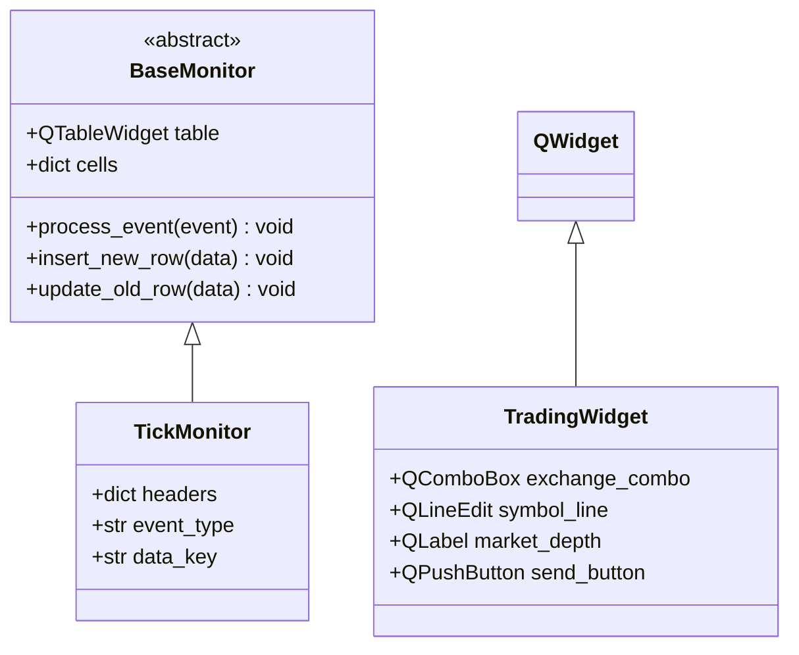

**图表来源**
- [widget.py](file://vnpy/trader/ui/widget.py#L100-L200)

### Controller层设计

Controller层通过事件系统协调各个组件：

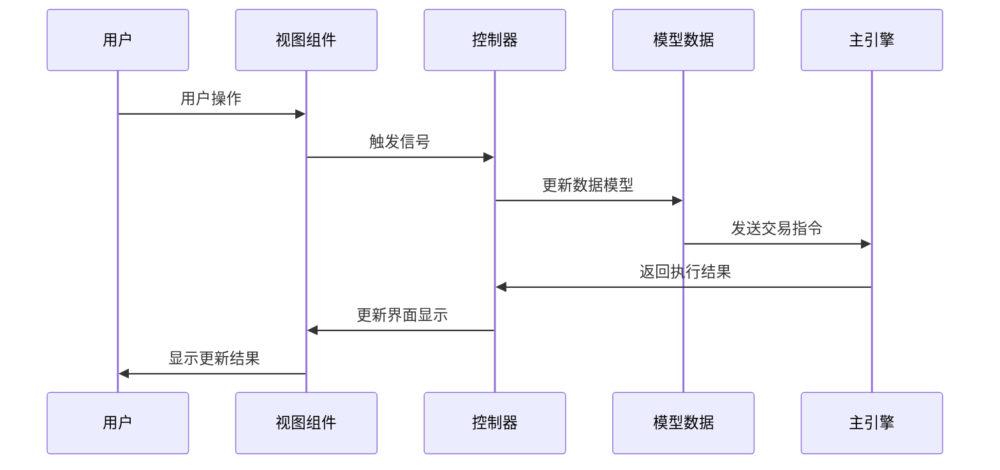

**图表来源**
- [widget.py](file://vnpy/trader/ui/widget.py#L281-L326)

**章节来源**
- [widget.py](file://vnpy/trader/ui/widget.py#L100-L300)

## 组件通信机制

### 事件驱动通信

核心交易组件采用事件驱动架构，通过EventEngine实现松耦合通信：

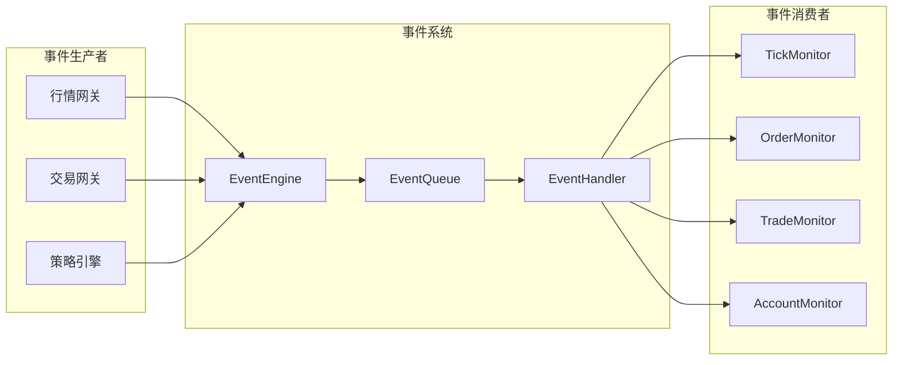

**图表来源**
- [engine.py](file://vnpy/event/engine.py#L1-L144)

### 信号槽机制

组件间通过PySide6的信号槽机制进行通信：

```python
# 信号定义
class TradingWidget(QtWidgets.QWidget):
    signal_tick: QtCore.Signal = QtCore.Signal(Event)

# 信号连接
def register_event(self) -> None:
    self.signal_tick.connect(self.process_tick_event)
    self.event_engine.register(EVENT_TICK, self.signal_tick.emit)

# 信号发射
def process_tick_event(self, event: Event) -> None:
    tick: TickData = event.data
    # 处理行情数据
    self.update_market_depth(tick)
```

### 数据绑定方式

组件采用声明式数据绑定，通过配置字典定义数据映射关系：

```python
# 行情监控的数据绑定配置
headers = {
    "symbol": {"display": "代码", "cell": BaseCell, "update": False},
    "last_price": {"display": "最新价", "cell": BaseCell, "update": True},
    "bid_price_1": {"display": "买1价", "cell": BidCell, "update": True},
    "ask_price_1": {"display": "卖1价", "cell": AskCell, "update": True},
}
```

**章节来源**
- [widget.py](file://vnpy/trader/ui/widget.py#L281-L326)
- [widget.py](file://vnpy/trader/ui/widget.py#L411-L440)

## 数据绑定与信号槽

### 信号槽连接模式

核心交易组件建立了完善的信号槽连接网络：

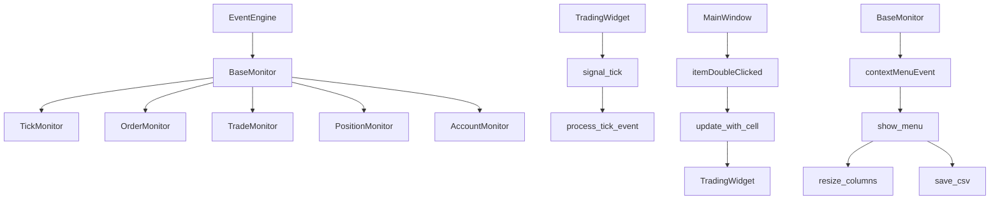

**图表来源**
- [widget.py](file://vnpy/trader/ui/widget.py#L281-L326)
- [widget.py](file://vnpy/trader/ui/widget.py#L858-L870)

### 动态数据更新机制

组件支持动态数据更新，通过以下机制实现：

1. **增量更新**：只更新发生变化的数据行
2. **批量更新**：合并多个更新操作减少界面刷新
3. **异步更新**：在后台线程处理数据，避免阻塞主线程

```python
def process_event(self, event: Event) -> None:
    """处理新数据事件并更新到表格"""
    # 禁用排序以防止意外错误
    if self.sorting:
        self.setSortingEnabled(False)
    
    data = event.data
    
    if not self.data_key:
        self.insert_new_row(data)
    else:
        key: str = data.__getattribute__(self.data_key)
        
        if key in self.cells:
            self.update_old_row(data)
        else:
            self.insert_new_row(data)
    
    # 启用排序
    if self.sorting:
        self.setSortingEnabled(True)
```

**章节来源**
- [widget.py](file://vnpy/trader/ui/widget.py#L300-L350)

## 性能优化策略

### 高频率数据刷新优化

针对高频行情数据刷新，采用了多种优化策略：

1. **延迟排序**：在数据更新期间禁用表格排序功能
2. **增量渲染**：只重新绘制发生变化的单元格
3. **缓存机制**：缓存单元格对象避免重复创建
4. **批量操作**：合并多个UI更新操作

```python
# 性能优化示例：延迟排序
if self.sorting:
    self.setSortingEnabled(False)  # 禁用排序以提高性能
    
# 执行数据更新操作
self.update_data_rows(data)

if self.sorting:
    self.setSortingEnabled(True)  # 重新启用排序
```

### 内存管理优化

1. **对象池**：重用单元格对象减少内存分配
2. **弱引用**：使用弱引用避免循环引用
3. **及时清理**：定期清理不再使用的资源

### UI响应优化

1. **异步处理**：将耗时操作放在后台线程
2. **界面预加载**：提前加载可能用到的界面元素
3. **懒加载**：按需加载组件内容

**章节来源**
- [widget.py](file://vnpy/trader/ui/widget.py#L300-L350)

## 故障排除指南

### 常见问题诊断

1. **组件无数据显示**
   - 检查事件注册是否正常
   - 验证数据源连接状态
   - 确认过滤条件设置

2. **界面卡顿问题**
   - 检查数据更新频率
   - 优化排序算法
   - 减少不必要的界面刷新

3. **信号槽连接失效**
   - 验证信号类型匹配
   - 检查连接函数签名
   - 确认对象生命周期

### 异常处理策略

```python
# 异常处理示例
def safe_update_data(self, data: Any) -> None:
    try:
        # 尝试更新数据
        self.update_data(data)
    except Exception as e:
        # 记录错误日志
        logger.error(f"数据更新失败: {e}")
        # 显示错误提示
        QtWidgets.QMessageBox.critical(
            self, "错误", f"数据更新失败: {str(e)}"
        )
```

### 调试工具

1. **事件追踪**：记录所有事件的产生和处理过程
2. **性能监控**：监控组件的CPU和内存使用情况
3. **数据验证**：验证接收到的数据格式和内容

**章节来源**
- [qt.py](file://vnpy/trader/ui/qt.py#L40-L80)

## 总结

vnpy的核心交易组件通过精心设计的架构和高效的实现，为量化交易提供了完整而强大的UI解决方案。主要特点包括：

### 技术优势

1. **事件驱动架构**：通过事件系统实现组件间的松耦合通信
2. **MVC设计模式**：清晰分离关注点，提高代码可维护性
3. **高性能优化**：针对高频数据刷新进行了多项性能优化
4. **灵活扩展性**：支持组件定制和功能扩展

### 应用价值

1. **实时监控**：提供全方位的交易数据实时监控能力
2. **便捷操作**：简化复杂的交易操作流程
3. **可视化展示**：通过图表和表格直观展示交易信息
4. **稳定可靠**：经过大量实盘验证的稳定系统

### 发展方向

1. **响应式设计**：适配不同尺寸的显示设备
2. **云端集成**：支持云端部署和远程访问
3. **多语言支持**：扩展国际化支持能力
4. **插件化架构**：支持第三方功能插件

核心交易组件作为vnpy框架的重要组成部分，为量化交易者提供了专业、高效、易用的交易界面，是构建现代量化交易平台的理想选择。