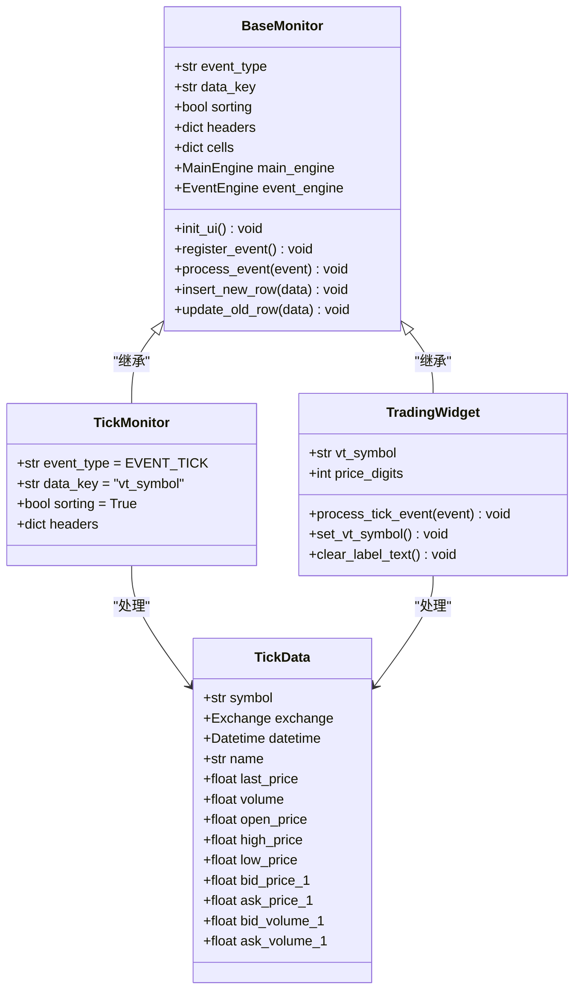
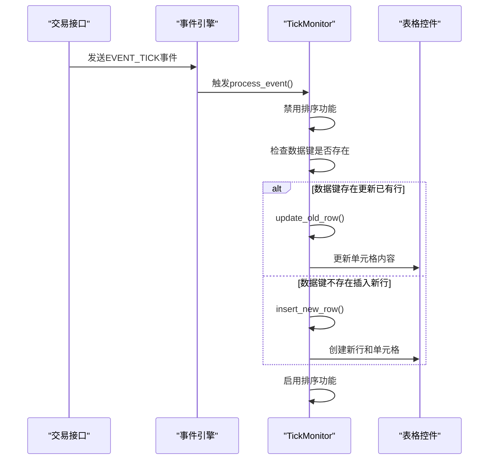
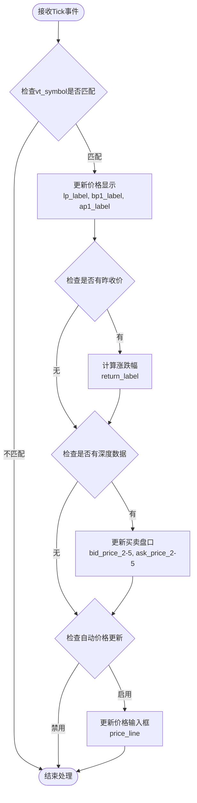

# 行情监控组件（TickMonitor）详细文档

<cite>
**本文档引用的文件**
- [widget.py](file://vnpy/trader/ui/widget.py)
- [object.py](file://vnpy/trader/object.py)
- [event.py](file://vnpy/trader/event.py)
- [constant.py](file://vnpy/trader/constant.py)
- [mainwindow.py](file://vnpy/trader/ui/mainwindow.py)
</cite>

## 目录
1. [简介](#简介)
2. [核心架构](#核心架构)
3. [TickMonitor组件详解](#tickmonitor组件详解)
4. [事件驱动机制](#事件驱动机制)
5. [实时行情数据展示](#实时行情数据展示)
6. [表头定义与单元格类型](#表头定义与单元格类型)
7. [性能优化措施](#性能优化措施)
8. [自定义开发指南](#自定义开发指南)
9. [交互行为与安全控制](#交互行为与安全控制)
10. [总结](#总结)

## 简介

行情监控组件（TickMonitor）是VeighNa量化交易平台中的核心组件之一，专门负责实时展示市场行情数据。该组件继承自BaseMonitor基类，采用事件驱动机制，能够高效处理高频tick数据更新，为交易员提供直观、实时的市场行情信息。

## 核心架构



**图表来源**
- [widget.py](file://vnpy/trader/ui/widget.py#L228-L403)
- [widget.py](file://vnpy/trader/ui/widget.py#L406-L440)
- [object.py](file://vnpy/trader/object.py#L25-L65)

**章节来源**
- [widget.py](file://vnpy/trader/ui/widget.py#L228-L403)
- [widget.py](file://vnpy/trader/ui/widget.py#L406-L440)

## TickMonitor组件详解

### 基本属性配置

TickMonitor作为行情监控的核心组件，具有以下关键属性：

```python
class TickMonitor(BaseMonitor):
    """
    Monitor for tick data.
    """

    event_type: str = EVENT_TICK          # 事件类型标识
    data_key: str = "vt_symbol"           # 数据唯一键
    sorting: bool = True                  # 是否启用排序功能
```

### 表头定义结构

TickMonitor的headers字典定义了所有需要显示的行情字段及其属性：

```python
headers: dict = {
    "symbol": {"display": _("代码"), "cell": BaseCell, "update": False},
    "exchange": {"display": _("交易所"), "cell": EnumCell, "update": False},
    "name": {"display": _("名称"), "cell": BaseCell, "update": True},
    "last_price": {"display": _("最新价"), "cell": BaseCell, "update": True},
    "volume": {"display": _("成交量"), "cell": BaseCell, "update": True},
    "open_price": {"display": _("开盘价"), "cell": BaseCell, "update": True},
    "high_price": {"display": _("最高价"), "cell": BaseCell, "update": True},
    "low_price": {"display": _("最低价"), "cell": BaseCell, "update": True},
    "bid_price_1": {"display": _("买1价"), "cell": BidCell, "update": True},
    "bid_volume_1": {"display": _("买1量"), "cell": BidCell, "update": True},
    "ask_price_1": {"display": _("卖1价"), "cell": AskCell, "update": True},
    "ask_volume_1": {"display": _("卖1量"), "cell": AskCell, "update": True},
    "datetime": {"display": _("时间"), "cell": TimeCell, "update": True},
    "gateway_name": {"display": _("接口"), "cell": BaseCell, "update": False},
}
```

**章节来源**
- [widget.py](file://vnpy/trader/ui/widget.py#L406-L440)

## 事件驱动机制

### EVENT_TICK事件订阅

TickMonitor通过EVENT_TICK事件订阅机制接收实时行情数据：



**图表来源**
- [widget.py](file://vnpy/trader/ui/widget.py#L293-L316)
- [event.py](file://vnpy/trader/event.py#L0-L13)

### 事件处理流程

事件处理的核心逻辑位于process_event方法中：

```python
def process_event(self, event: Event) -> None:
    """
    Process new data from event and update into table.
    """
    # 禁用排序以防止意外错误
    if self.sorting:
        self.setSortingEnabled(False)

    # 更新数据到表格
    data = event.data

    if not self.data_key:
        self.insert_new_row(data)
    else:
        key: str = data.__getattribute__(self.data_key)

        if key in self.cells:
            self.update_old_row(data)
        else:
            self.insert_new_row(data)

    # 启用排序
    if self.sorting:
        self.setSortingEnabled(True)
```

**章节来源**
- [widget.py](file://vnpy/trader/ui/widget.py#L293-L316)

## 实时行情数据展示

### 深度行情显示

除了表格形式的行情展示，TradingWidget还提供了深度行情的实时显示功能：



**图表来源**
- [widget.py](file://vnpy/trader/ui/widget.py#L860-L887)

### 深度行情更新逻辑

深度行情的更新逻辑包含以下关键步骤：

1. **基础价格更新**：
```python
self.lp_label.setText(f"{tick.last_price:.{price_digits}f}")
self.bp1_label.setText(f"{tick.bid_price_1:.{price_digits}f}")
self.ap1_label.setText(f"{tick.ask_price_1:.{price_digits}f}")
```

2. **涨跌幅计算**：
```python
if tick.pre_close:
    r: float = (tick.last_price / tick.pre_close - 1) * 100
    self.return_label.setText(f"{r:.2f}%")
```

3. **深度盘口更新**：
```python
if tick.bid_price_2:
    self.bp2_label.setText(f"{tick.bid_price_2:.{price_digits}f}")
    self.bv2_label.setText(str(tick.bid_volume_2))
    self.ap2_label.setText(f"{tick.ask_price_2:.{price_digits}f}")
    self.av2_label.setText(str(tick.ask_volume_2))
```

**章节来源**
- [widget.py](file://vnpy/trader/ui/widget.py#L860-L887)

## 表头定义与单元格类型

### 字段显示名称映射

每个表头字段都包含三个关键属性：

```python
{
    "字段名": {
        "display": "显示名称",      # 用户界面中显示的中文名称
        "cell": 单元格类型,          # 对应的单元格类
        "update": 是否动态更新      # 是否需要实时更新内容
    }
}
```

### 单元格类型分类

#### 1. 基础单元格类型

- **BaseCell**: 基础文本单元格，用于显示普通字符串数据
- **EnumCell**: 枚举类型单元格，用于显示枚举值（如交易所、方向等）

#### 2. 价格相关单元格

- **BidCell**: 买入价格单元格，显示为红色字体
- **AskCell**: 卖出价格单元格，显示为绿色字体
- **TimeCell**: 时间单元格，格式化显示时间戳

#### 3. 特殊单元格类型

- **PnlCell**: 盈亏单元格，根据正负值显示不同颜色
- **MsgCell**: 日志消息单元格，左对齐显示

### 更新策略配置

单元格的update属性决定了其更新策略：

- **update=True**: 每次接收到新的tick数据时都会更新内容
- **update=False**: 只在创建时设置一次内容，后续不再更新

**章节来源**
- [widget.py](file://vnpy/trader/ui/widget.py#L411-L440)
- [widget.py](file://vnpy/trader/ui/widget.py#L118-L179)

## 性能优化措施

### 排序控制优化

为了提高大量数据更新时的性能，TickMonitor采用了以下优化策略：

1. **临时禁用排序**：
```python
# 禁用排序以防止意外错误
if self.sorting:
    self.setSortingEnabled(False)
```

2. **批量更新后恢复**：
```python
# 启用排序
if self.sorting:
    self.setSortingEnabled(True)
```

### 增量更新机制

通过data_key机制实现增量更新，避免重复创建单元格：

```python
def insert_new_row(self, data: Any) -> None:
    """
    Insert a new row at the top of table.
    """
    self.insertRow(0)
    
    row_cells: dict = {}
    for column, header in enumerate(self.headers.keys()):
        setting: dict = self.headers[header]
        
        content = data.__getattribute__(header)
        cell: QtWidgets.QTableWidgetItem = setting["cell"](content, data)
        self.setItem(0, column, cell)
        
        if setting["update"]:
            row_cells[header] = cell
    
    if self.data_key:
        key: str = data.__getattribute__(self.data_key)
        self.cells[key] = row_cells
```

### 内存管理优化

1. **单元格缓存机制**：
```python
self.cells: dict[str, dict] = {}
```

2. **条件更新策略**：
只有update=True的字段才会被动态更新，减少不必要的计算

**章节来源**
- [widget.py](file://vnpy/trader/ui/widget.py#L293-L316)
- [widget.py](file://vnpy/trader/ui/widget.py#L318-L337)

## 自定义开发指南

### 扩展字段添加

要向TickMonitor添加新的行情字段，可以按照以下步骤操作：

1. **修改headers字典**：
```python
headers: dict = {
    # 现有字段...
    "new_field": {"display": _("新字段"), "cell": BaseCell, "update": True},
}
```

2. **确保数据源包含新字段**：
```python
@dataclass
class TickData(BaseData):
    # 现有字段...
    new_field: float = 0
```

### 自定义单元格类型

创建自定义单元格类型示例：

```python
class CustomCell(BaseCell):
    """
    Custom cell for special data display.
    """
    
    def __init__(self, content: Any, data: Any) -> None:
        super().__init__(content, data)
    
    def set_content(self, content: Any, data: Any) -> None:
        """
        Custom content setting logic.
        """
        super().set_content(content, data)
        
        # 自定义显示逻辑
        if content is not None:
            formatted_value = self.format_value(content)
            self.setText(formatted_value)
    
    def format_value(self, value: Any) -> str:
        """
        Format value for display.
        """
        # 实现自定义格式化逻辑
        return str(value)
```

### 样式调整

通过修改单元格样式来自定义显示效果：

```python
class StyledBidCell(BidCell):
    """
    Styled bid cell with custom appearance.
    """
    
    def __init__(self, content: Any, data: Any) -> None:
        super().__init__(content, data)
        
        # 设置背景色和字体
        self.setBackground(QtGui.QColor(255, 240, 240))
        self.setFont(QtGui.QFont("Arial", 10, QtGui.QFont.Weight.Bold))
```

## 交互行为与安全控制

### 双击撤单功能

虽然TickMonitor本身不支持双击撤单功能，但其他监控组件如OrderMonitor实现了这一功能：

```python
def cancel_order(self, cell: BaseCell) -> None:
    """
    Cancel order if cell double clicked.
    """
    order: OrderData = cell.get_data()
    req: CancelRequest = order.create_cancel_request()
    self.main_engine.cancel_order(req, order.gateway_name)
```

### 安全控制机制

1. **输入验证**：
```python
def send_order(self) -> None:
    """
    Send new order manually.
    """
    symbol: str = str(self.symbol_line.text())
    if not symbol:
        QtWidgets.QMessageBox.critical(self, _("委托失败"), _("请输入合约代码"))
        return
    
    volume_text: str = str(self.volume_line.text())
    if not volume_text:
        QtWidgets.QMessageBox.critical(self, _("委托失败"), _("请输入委托数量"))
        return
```

2. **权限控制**：
```python
def update_with_cell(self, cell: BaseCell) -> None:
    """
    Update trading widget with cell data.
    """
    data = cell.get_data()
    
    # 只允许更新持仓相关的字段
    if isinstance(data, PositionData):
        # 允许的更新逻辑
        pass
    else:
        # 禁止更新非持仓数据
        return
```

### 禁用功能列表

某些功能在特定组件中被禁用以确保安全性：

- **双击撤单**：仅在OrderMonitor中启用
- **编辑功能**：所有监控组件均禁用编辑
- **拖拽排序**：通过setEditTriggers禁用

**章节来源**
- [widget.py](file://vnpy/trader/ui/widget.py#L472-L512)
- [widget.py](file://vnpy/trader/ui/widget.py#L980-L1020)

## 总结

行情监控组件（TickMonitor）是VeighNa平台中实现实时行情展示的核心组件。通过事件驱动机制，它能够高效处理高频tick数据更新，为交易员提供及时、准确的市场信息。

### 主要特点

1. **事件驱动架构**：基于EVENT_TICK事件的实时数据处理
2. **灵活的表头配置**：支持自定义字段和单元格类型
3. **性能优化**：通过排序控制和增量更新提升性能
4. **安全保障**：完善的输入验证和权限控制机制
5. **扩展性强**：支持自定义字段和单元格类型的添加

### 应用场景

- 实时行情监控
- 深度行情分析
- 交易决策支持
- 市场情绪观察

通过合理配置和扩展，TickMonitor能够满足不同交易策略和场景的需求，为量化交易提供强有力的数据支撑。