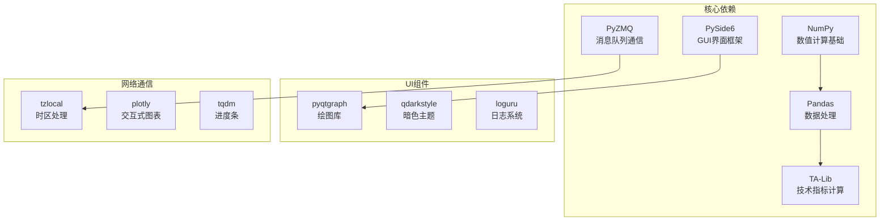
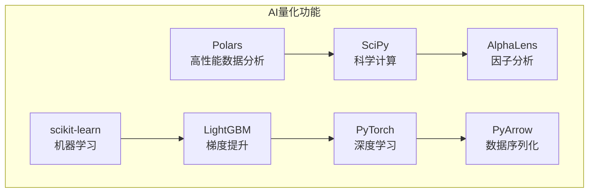

# VeighNa量化交易平台安装与环境配置指南

<cite>
**本文档引用的文件**
- [pyproject.toml](file://pyproject.toml)
- [install.bat](file://install.bat)
- [install.sh](file://install.sh)
- [install_osx.sh](file://install_osx.sh)
- [README.md](file://README.md)
- [examples/no_ui/run.py](file://examples/no_ui/run.py)
- [vnpy/__init__.py](file://vnpy/__init__.py)
</cite>

## 目录
1. [简介](#简介)
2. [系统要求](#系统要求)
3. [安装前准备](#安装前准备)
4. [Windows平台安装](#windows平台安装)
5. [Linux平台安装](#linux平台安装)
6. [macOS平台安装](#macos平台安装)
7. [依赖项详解](#依赖项详解)
8. [环境验证](#环境验证)
9. [常见问题解决](#常见问题解决)
10. [高级配置选项](#高级配置选项)
11. [故障排除指南](#故障排除指南)

## 简介

VeighNa（原名vn.py）是一个基于Python的开源量化交易系统开发框架，专为交易员设计，提供了一站式的量化交易解决方案。本指南将详细介绍在Windows、Linux和macOS三大平台上完整的安装配置流程。

VeighNa 4.1.0版本是第十个年头的重要里程碑，新增了面向AI量化策略的`vnpy.alpha`模块，为专业量化交易员提供一站式多因子机器学习策略开发、投研和实盘交易解决方案。

## 系统要求

### 最低系统要求
- **操作系统**: Windows 10/11、Ubuntu 18.04+、macOS 10.15+
- **Python版本**: 3.10-3.13（推荐3.11）
- **内存**: 至少4GB RAM
- **存储空间**: 至少2GB可用磁盘空间
- **网络**: 稳定的互联网连接

### 推荐配置
- **操作系统**: Windows 11、Ubuntu 22.04 LTS、macOS 12+
- **Python版本**: 3.11
- **内存**: 8GB RAM或更高
- **存储空间**: 10GB可用磁盘空间
- **网络**: 高速宽带连接

## 安装前准备

### 1. Python环境准备

#### Windows用户
- 下载并安装最新稳定版Python 3.11：[python.org](https://www.python.org/downloads/)
- 在安装过程中勾选"Add Python to PATH"
- 安装完成后打开命令提示符，输入`python --version`确认版本

#### Linux用户
```bash
# Ubuntu/Debian
sudo apt update
sudo apt install python3 python3-pip python3-venv

# CentOS/RHEL/Fedora
sudo yum install python3 python3-pip python3-virtualenv
# 或者使用dnf
sudo dnf install python3 python3-pip python3-virtualenv
```

#### macOS用户
```bash
# 使用Homebrew
brew install python@3.11

# 或使用MacPorts
sudo port install python311 py311-pip
```

### 2. 创建虚拟环境（推荐）

```bash
# 创建虚拟环境
python -m venv vnpy_env

# 激活虚拟环境
# Windows
.\vnpy_env\Scripts\activate
# Linux/macOS
source vnpy_env/bin/activate
```

### 3. 更新pip工具

```bash
python -m pip install --upgrade pip wheel
```

## Windows平台安装

### 方法一：使用官方安装脚本

1. **下载源码**
   ```bash
   git clone https://github.com/vnpy/vnpy.git
   cd vnpy
   ```

2. **运行安装脚本**
   ```bash
   # 默认安装（使用vnpy镜像源）
   install.bat
   
   # 自定义Python解释器
   install.bat python.exe
   
   # 自定义PyPI镜像源
   install.bat python.exe https://pypi.tuna.tsinghua.edu.cn/simple
   ```

3. **安装过程详解**
   - **第一步**: 升级pip和wheel工具
   - **第二步**: 安装预编译的ta-lib库
   - **第三步**: 安装VeighNa主包

### 方法二：手动安装

```cmd
@ECHO OFF
SET python=python
SET pypi_index=https://pypi.vnpy.com

:: 升级pip & wheel
%python% -m pip install --upgrade pip wheel --index %pypi_index%

:: 安装预编译wheel
%python% -m pip install --extra-index-url https://pypi.vnpy.com ta_lib==0.6.4

:: 安装VeighNa
%python% -m pip install .
```

### 安装验证

```cmd
python -c "import vnpy; print(f'VeighNa版本: {vnpy.__version__}')"
```

**章节来源**
- [install.bat](file://install.bat#L1-L16)
- [pyproject.toml](file://pyproject.toml#L1-L113)

## Linux平台安装

### 方法一：使用官方安装脚本

1. **安装系统依赖**
   ```bash
   # Ubuntu/Debian
   sudo apt update
   sudo apt install build-essential libffi-dev libssl-dev wget
   
   # CentOS/RHEL/Fedora
   sudo yum groupinstall "Development Tools"
   sudo yum install wget
   
   # Arch Linux
   sudo pacman -Sy base-devel wget
   ```

2. **运行安装脚本**
   ```bash
   chmod +x install.sh
   ./install.sh
   
   # 自定义Python解释器
   ./install.sh python3
   
   # 自定义PyPI镜像源
   ./install.sh python3 https://pypi.tuna.tsinghua.edu.cn/simple
   ```

3. **安装过程详解**
   - **第一步**: 升级pip和wheel工具
   - **第二步**: 编译安装ta-lib库（需要系统编译工具）
   - **第三步**: 设置中文语言环境
   - **第四步**: 安装VeighNa主包

### 方法二：手动安装

```bash
#!/usr/bin/env bash

python=$1
pypi_index=$2
shift 2

[[ -z $python ]] && python=python3
[[ -z $pypi_index ]] && pypi_index=https://pypi.vnpy.com

$python -m pip install --upgrade pip wheel --index $pypi_index

# 获取并编译ta-lib
function install-ta-lib()
{   
    # 先安装numpy
    $python -m pip install numpy==2.2.3 --index $pypi_index

    pushd /tmp
    wget https://pip.vnpy.com/colletion/ta-lib-0.6.4-src.tar.gz
    tar -xf ta-lib-0.6.4-src.tar.gz
    cd ta-lib-0.6.4
    ./configure --prefix=/usr/local
    make -j1
    make install
    popd

    $python -m pip install ta-lib==0.6.4 --index $pypi_index
}

# 检查ta-lib是否已存在
function ta-lib-exists()
{
    $prefix/ta-lib-config --libs > /dev/null
}

ta-lib-exists || install-ta-lib

# 安装本地中文语言环境
locale-gen zh_CN.GB18030

# 安装VeighNa
$python -m pip install . --index $pypi_index
```

### 安装验证

```bash
python3 -c "import vnpy; print(f'VeighNa版本: {vnpy.__version__}')"
```

**章节来源**
- [install.sh](file://install.sh#L1-L41)
- [pyproject.toml](file://pyproject.toml#L1-L113)

## macOS平台安装

### 方法一：使用官方安装脚本

1. **安装Homebrew（如果尚未安装）**
   ```bash
   /bin/bash -c "$(curl -fsSL https://raw.githubusercontent.com/Homebrew/install/HEAD/install.sh)"
   ```

2. **安装系统依赖**
   ```bash
   brew install python@3.11
   brew install ta-lib
   ```

3. **运行安装脚本**
   ```bash
   chmod +x install_osx.sh
   ./install_osx.sh
   
   # 自定义Python解释器
   ./install_osx.sh python3.11
   
   # 自定义PyPI镜像源
   ./install_osx.sh python3.11 https://pypi.tuna.tsinghua.edu.cn/simple
   ```

### 方法二：手动安装

```bash
#!/usr/bin/env bash

python=$1
pypi_index=$2
shift 2

[[ -z $python ]] && python=python3
[[ -z $pypi_index ]] && pypi_index=https://pypi.vnpy.com

$python -m pip install --upgrade pip wheel --index $pypi_index

# 获取并编译ta-lib
function install-ta-lib()
{
    export HOMEBREW_NO_AUTO_UPDATE=true
    brew install ta-lib
}

# 检查ta-lib是否已存在
function ta-lib-exists()
{
    ta-lib-config --libs > /dev/null
}

ta-lib-exists || install-ta-lib

# 安装ta-lib
$python -m pip install numpy==2.2.3 --index $pypi_index
$python -m pip install ta-lib==0.6.4 --index $pypi_index

# 安装VeighNa
$python -m pip install . --index $pypi_index
```

### macOS特殊注意事项

1. **Apple Silicon芯片（M1/M2）用户**
   - 可能需要安装Rosetta 2：`softwareupdate --install-rosetta`
   - 使用x86_64架构的Python：`arch -x86_64 python3`

2. **权限问题**
   ```bash
   # 如果遇到权限错误，可以尝试以下命令
   sudo chown -R $(whoami) ~/.local
   ```

**章节来源**
- [install_osx.sh](file://install_osx.sh#L1-L30)
- [pyproject.toml](file://pyproject.toml#L1-L113)

## 依赖项详解

### 核心依赖项

VeighNa的`pyproject.toml`文件定义了完整的依赖关系，以下是主要依赖项的作用说明：

#### 必需依赖项



**图表来源**
- [pyproject.toml](file://pyproject.toml#L25-L35)

#### 可选依赖项（AI功能）



**图表来源**
- [pyproject.toml](file://pyproject.toml#L37-L46)

#### 详细依赖说明

1. **PySide6 (6.8.2.1)**
   - 用途：提供Qt GUI界面框架
   - 版本锁定原因：确保界面组件的稳定性
   - 功能：主界面、图表窗口、配置对话框

2. **NumPy (>=2.2.3)**
   - 用途：数值计算基础库
   - 功能：数组操作、矩阵运算、科学计算

3. **Pandas (>=2.2.3)**
   - 用途：数据处理和分析
   - 功能：时间序列数据、金融数据处理

4. **TA-Lib (0.6.4)**
   - 用途：技术指标计算
   - 功能：K线形态识别、技术指标计算

5. **PyZMQ (>=26.3.0)**
   - 用途：高性能消息队列通信
   - 功能：进程间通信、实时数据传输

6. **PyQtGraph (>=0.13.7)**
   - 用途：实时数据绘图
   - 功能：K线图、成交量图、指标叠加

**章节来源**
- [pyproject.toml](file://pyproject.toml#L25-L46)

## 环境验证

### 基础功能测试

1. **导入测试**
   ```python
   # 打开Python交互式环境
   python
   
   # 测试基本导入
   >>> import vnpy
   >>> print(vnpy.__version__)
   4.1.0
   
   # 测试核心模块
   >>> from vnpy.trader.engine import MainEngine
   >>> from vnpy.trader.gateway import BaseGateway
   >>> from vnpy.trader.app import BaseApp
   ```

2. **运行示例程序**
   ```bash
   # 运行无界面示例
   python examples/no_ui/run.py
   
   # 运行Veighna Trader界面
   python examples/veighna_trader/run.py
   ```

3. **功能完整性检查**
   - [ ] 主界面正常启动
   - [ ] 数据记录功能可用
   - [ ] 策略回测功能正常
   - [ ] 图表显示正常
   - [ ] 日志输出正常

### 性能基准测试

```python
# 性能测试脚本
import time
import pandas as pd
import numpy as np

print("VeighNa性能基准测试")

# 数据生成测试
start_time = time.time()
data = pd.DataFrame({
    'price': np.random.random(10000),
    'volume': np.random.randint(100, 10000, 10000)
})
gen_time = time.time() - start_time
print(f"数据生成耗时: {gen_time:.4f}秒")

# 技术指标计算测试
start_time = time.time()
from ta import add_all_ta_features
features = add_all_ta_features(
    data['open'], data['high'], data['low'], data['close'], data['volume']
)
calc_time = time.time() - start_time
print(f"技术指标计算耗时: {calc_time:.4f}秒")
```

## 常见问题解决

### 权限错误

#### Windows权限问题
```cmd
# 解决方案1：以管理员身份运行
右键点击命令提示符 -> "以管理员身份运行"

# 解决方案2：修改pip配置
pip config set global.index-url https://pypi.tuna.tsinghua.edu.cn/simple
```

#### Linux/macOS权限问题
```bash
# 解决方案1：使用用户目录安装
pip install --user vnpy

# 解决方案2：修复权限
sudo chown -R $(whoami) ~/.local
```

### 依赖冲突

#### Python版本不匹配
```bash
# 检查Python版本
python --version

# 如果版本过低，升级Python
# Windows: 下载新版本安装
# Linux: sudo apt install python3.11
# macOS: brew install python@3.11
```

#### ta-lib编译失败
```bash
# Windows用户
pip install ta-lib-cp311-win_amd64.whl

# Linux用户
sudo apt-get install libta-lib-dev

# macOS用户
brew install ta-lib
```

### 网络问题

#### PyPI访问慢
```bash
# 使用国内镜像源
pip install -i https://pypi.tuna.tsinghua.edu.cn/simple vnpy

# 设置永久镜像源
pip config set global.index-url https://pypi.tuna.tsinghua.edu.cn/simple
```

#### SSL证书错误
```bash
# 临时禁用SSL验证（不推荐）
pip install --trusted-host pypi.org --trusted-host pypi.vnpy.com vnpy

# 正确做法：更新证书
# Windows: 安装最新版Python
# Linux: sudo apt install ca-certificates
# macOS: brew install curl-ca-bundle
```

### 虚拟环境问题

#### 虚拟环境激活失败
```bash
# Windows
.\venv\Scripts\activate

# Linux/macOS
source venv/bin/activate

# 检查Python路径
which python
python --version
```

## 高级配置选项

### 开发者模式安装

```bash
# 克隆源码仓库
git clone https://github.com/vnpy/vnpy.git
cd vnpy

# 开发者模式安装（包含所有可选依赖）
pip install -e ".[dev,alpha]"

# 开发者模式安装（仅核心功能）
pip install -e .

# 开发者模式安装（自定义镜像源）
pip install -e ".[dev,alpha]" -i https://pypi.tuna.tsinghua.edu.cn/simple
```

### 自定义配置

#### 修改配置文件
```python
# 修改vnpy/trader/setting.py
SETTINGS = {
    "log.active": True,
    "log.level": logging.INFO,
    "log.console": True,
    "log.file": True,
    "database.name": "sqlite",
    "database.driver": "sqlite",
}
```

#### 环境变量配置
```bash
# Linux/macOS
export VNPY_HOME=/path/to/vnpy/home
export PYTHONPATH=/path/to/vnpy:$PYTHONPATH

# Windows
set VNPY_HOME=C:\path\to\vnpy\home
set PYTHONPATH=C:\path\to\vnpy;%PYTHONPATH%
```

### Docker容器部署

```dockerfile
FROM python:3.11-slim

WORKDIR /vnpy
COPY . .

RUN pip install --no-cache-dir -e ".[alpha]"
RUN apt-get update && apt-get install -y \
    libta-lib-dev \
    && rm -rf /var/lib/apt/lists/*

EXPOSE 8000
CMD ["python", "-m", "vnpy.trader", "--port=8000"]
```

## 故障排除指南

### 完整诊断脚本

```python
#!/usr/bin/env python3
"""
VeighNa安装诊断工具
"""

import sys
import os
import subprocess
import platform
from pathlib import Path

def check_python():
    """检查Python环境"""
    print(f"Python版本: {sys.version}")
    print(f"Python路径: {sys.executable}")
    print(f"系统架构: {platform.architecture()}")
    print(f"操作系统: {platform.system()} {platform.release()}")
    
    # 检查Python版本
    version_info = sys.version_info
    if version_info < (3, 10):
        print("❌ 错误: Python版本过低，需要3.10或更高")
        return False
    elif version_info >= (3, 14):
        print("⚠️ 警告: Python 3.14可能不完全兼容")
    else:
        print("✅ Python版本检查通过")
    
    return True

def check_dependencies():
    """检查关键依赖"""
    dependencies = [
        'vnpy', 'pandas', 'numpy', 'ta-lib', 'PySide6',
        'pyzmq', 'pyqtgraph', 'qdarkstyle'
    ]
    
    missing = []
    for dep in dependencies:
        try:
            __import__(dep)
            print(f"✅ {dep} 已安装")
        except ImportError:
            print(f"❌ {dep} 未找到")
            missing.append(dep)
    
    return len(missing) == 0

def check_system():
    """检查系统环境"""
    issues = []
    
    # 检查内存
    try:
        import psutil
        memory = psutil.virtual_memory()
        if memory.available < 2 * 1024 * 1024 * 1024:  # 2GB
            issues.append("内存不足，建议至少4GB")
    except:
        pass
    
    # 检查磁盘空间
    try:
        disk = psutil.disk_usage('.')
        if disk.free < 2 * 1024 * 1024 * 1024:  # 2GB
            issues.append("磁盘空间不足，建议至少2GB可用空间")
    except:
        pass
    
    return issues

def run_diagnostic():
    """运行完整诊断"""
    print("=" * 50)
    print("VeighNa安装诊断工具")
    print("=" * 50)
    
    # 环境检查
    checks = []
    checks.append(("Python环境", check_python()))
    checks.append(("依赖检查", check_dependencies()))
    
    # 系统检查
    issues = check_system()
    if issues:
        print("\n⚠️ 系统警告:")
        for issue in issues:
            print(f"  - {issue}")
    
    # 结果汇总
    passed = sum(1 for _, result in checks if result)
    total = len(checks)
    
    print(f"\n{'=' * 30}")
    print(f"诊断结果: {passed}/{total} 项通过")
    
    if passed == total:
        print("🎉 所有检查通过，环境配置良好")
    else:
        print("❌ 存在问题，请根据提示修复")
    
    return passed == total

if __name__ == "__main__":
    success = run_diagnostic()
    sys.exit(0 if success else 1)
```

### 日志分析

```python
# 日志分析脚本
import logging
from pathlib import Path

def analyze_logs(log_dir="logs"):
    """分析VeighNa日志文件"""
    log_path = Path(log_dir)
    if not log_path.exists():
        print(f"日志目录不存在: {log_path}")
        return
    
    error_count = 0
    warning_count = 0
    
    for log_file in log_path.glob("*.log"):
        with open(log_file, 'r') as f:
            for line in f:
                if 'ERROR' in line:
                    error_count += 1
                    print(f"❌ {line.strip()}")
                elif 'WARNING' in line:
                    warning_count += 1
                    print(f"⚠️ {line.strip()}")
    
    print(f"\n分析结果:")
    print(f"  错误数量: {error_count}")
    print(f"  警告数量: {warning_count}")
    
    if error_count > 0:
        print("❌ 发现错误，请检查配置和依赖")
    elif warning_count > 0:
        print("⚠️ 发现警告，建议检查日志详情")
    else:
        print("✅ 日志正常，无异常信息")
```

### 性能优化建议

1. **内存优化**
   ```python
   # 在setting.py中调整
   SETTINGS.update({
       "database.max_queue_size": 1000,
       "database.buffer_size": 10000,
   })
   ```

2. **CPU优化**
   ```python
   # 启用多线程
   import multiprocessing
   multiprocessing.set_start_method('spawn')
   ```

3. **网络优化**
   ```python
   # 配置网络超时
   import socket
   socket.setdefaulttimeout(30)
   ```

**章节来源**
- [examples/no_ui/run.py](file://examples/no_ui/run.py#L1-L126)
- [README.md](file://README.md#L1-L199)

## 总结

本指南详细介绍了VeighNa量化交易平台在三大平台上的完整安装配置流程。通过遵循本指南，用户可以：

1. **成功安装**：在Windows、Linux和macOS上正确安装VeighNa
2. **理解依赖**：深入了解各个依赖项的作用和重要性
3. **解决问题**：快速诊断和解决常见的安装问题
4. **优化配置**：根据实际需求进行高级配置和性能优化

VeighNa 4.1.0版本带来了重大的功能增强，特别是AI量化功能的引入，为量化交易员提供了更加强大和灵活的工具。建议用户在安装完成后，参考官方文档和示例程序，深入探索VeighNa的各项功能。

对于新手用户，建议从简单的示例程序开始，逐步熟悉界面和基本功能；对于专业用户，可以深入研究AI量化模块和高级配置选项，充分发挥VeighNa的强大功能。