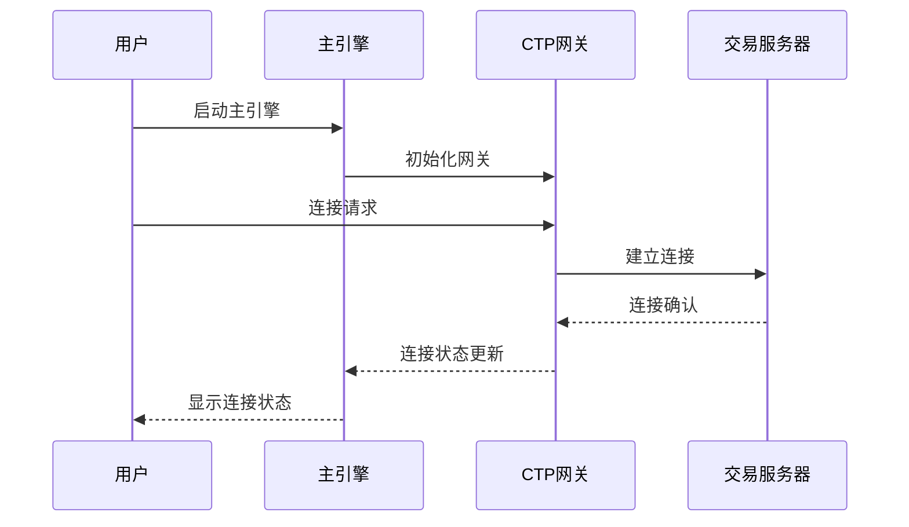
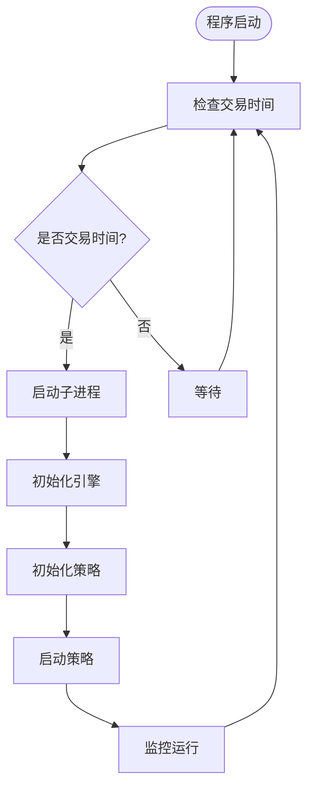
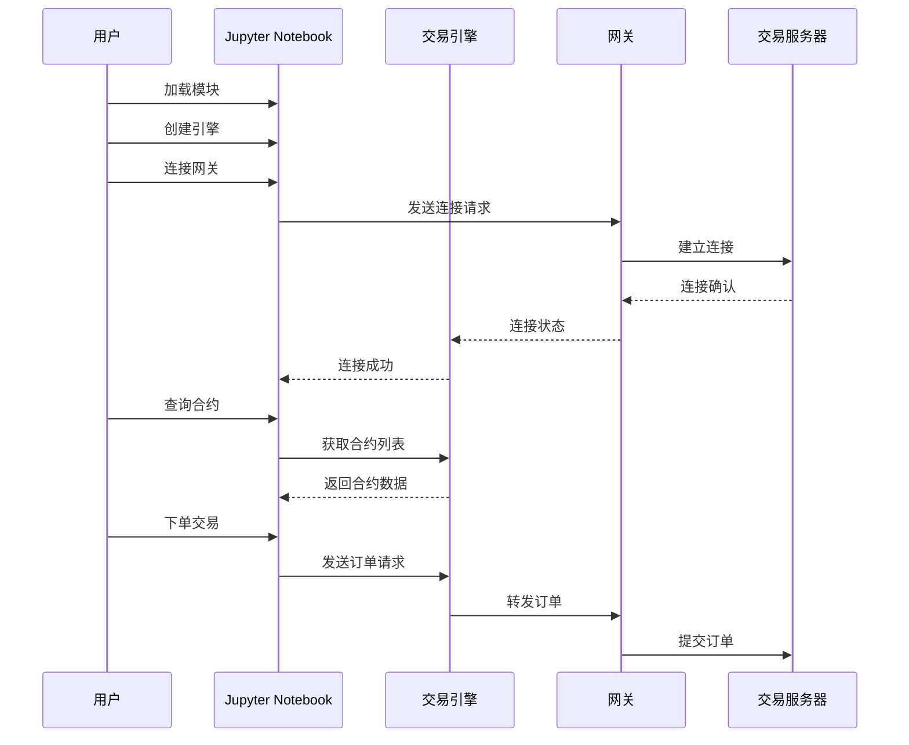
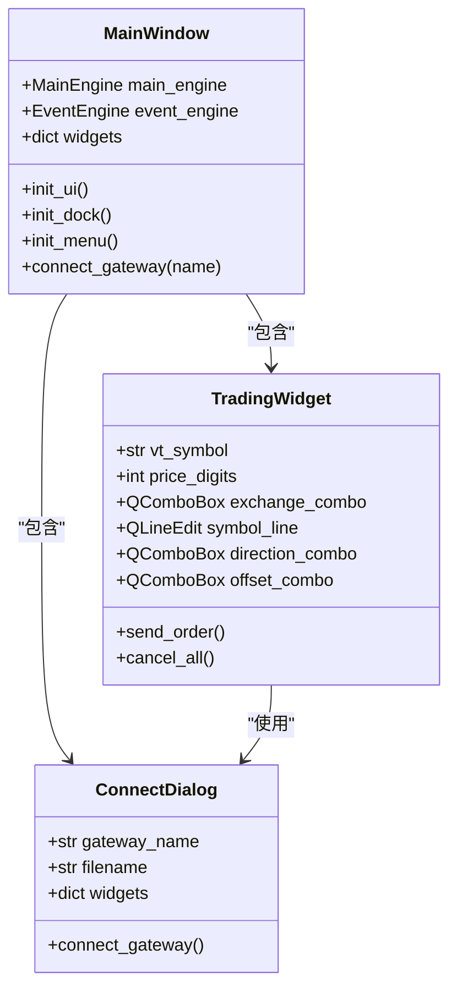
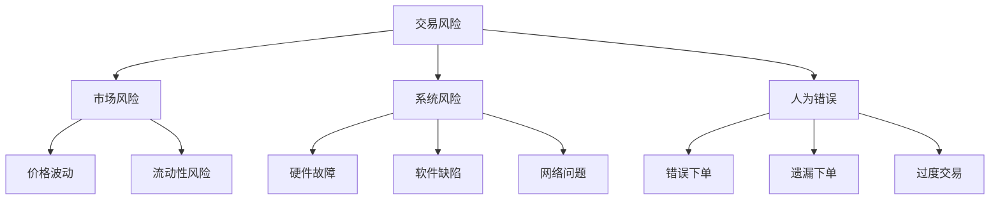

# 快速入门

<cite>
**本文档引用的文件**
- [examples/veighna_trader/run.py](file://examples/veighna_trader/run.py)
- [examples/no_ui/run.py](file://examples/no_ui/run.py)
- [examples/notebook_trading/demo_notebook.ipynb](file://examples/notebook_trading/demo_notebook.ipynb)
- [vnpy/trader/engine.py](file://vnpy/trader/engine.py)
- [vnpy/trader/ui/mainwindow.py](file://vnpy/trader/ui/mainwindow.py)
- [vnpy/trader/gateway.py](file://vnpy/trader/gateway.py)
- [vnpy/trader/setting.py](file://vnpy/trader/setting.py)
- [vnpy/trader/utility.py](file://vnpy/trader/utility.py)
- [vnpy/trader/object.py](file://vnpy/trader/object.py)
- [vnpy/trader/event.py](file://vnpy/trader/event.py)
- [vnpy/trader/ui/widget.py](file://vnpy/trader/ui/widget.py)
</cite>

## 目录
1. [简介](#简介)
2. [系统要求](#系统要求)
3. [安装准备](#安装准备)
4. [图形化交易界面启动](#图形化交易界面启动)
5. [无UI模式启动](#无UI模式启动)
6. [Jupyter Notebook交互式交易](#jupyter-notebook交互式交易)
7. [基本操作流程](#基本操作流程)
8. [安全实践与注意事项](#安全实践与注意事项)
9. [故障排除](#故障排除)
10. [总结](#总结)

## 简介

VeighNa Trader 是一个功能强大的量化交易平台，专为新手和专业交易者设计。本快速入门教程将指导您通过最简步骤启动并运行 VeighNa 系统，让您能够快速上手进行交易。

VeighNa Trader 提供三种主要的使用方式：
- **图形化交易界面**：完整的桌面应用程序，适合初学者和需要可视化界面的用户
- **无UI模式**：轻量级命令行模式，适合自动化部署和后台运行
- **Jupyter Notebook交互式交易**：灵活的交互式编程环境，适合学习和测试

## 系统要求

### 硬件要求
- CPU：Intel i5 或同等性能的处理器
- 内存：至少 4GB RAM（推荐 8GB）
- 存储：至少 2GB 可用磁盘空间
- 网络：稳定的互联网连接

### 软件要求
- Python 3.8 或更高版本
- Windows 10/11、macOS 10.15+ 或 Linux 系统
- pip 包管理器
- Jupyter Notebook（仅用于交互式模式）

## 安装准备

### 步骤1：安装 VeighNa 平台

首先，确保您已经正确安装了 VeighNa 平台。可以通过以下方式安装：

```bash
# 使用pip安装
pip install vnpy

# 或者从源码安装
git clone https://github.com/vnpy/vnpy.git
cd vnpy
pip install -e .
```

### 步骤2：获取仿真账户

为了开始交易，您需要一个仿真交易账户：

1. 前往 [SimNow](http://www.simnow.com.cn/) 注册 CTP 仿真账号
2. 获取经纪商代码以及交易行情服务器地址
3. 在 VeighNa 社区论坛注册获得 VeighNa Station 账号密码

### 步骤3：配置连接文件

VeighNa 使用 JSON 文件存储连接配置。您需要创建或编辑相应的连接配置文件：

```json
{
    "用户名": "您的用户名",
    "密码": "您的密码",
    "经纪商代码": "您的经纪商代码",
    "交易服务器": "您的交易服务器地址",
    "行情服务器": "您的行情服务器地址",
    "产品名称": "您的产品名称",
    "授权编码": "您的授权编码",
    "产品信息": "您的产品信息"
}
```

## 图形化交易界面启动

### 方式一：使用 VeighNa Station

这是最简单的启动方式：

1. 启动 VeighNa Station（安装 VeighNa Studio 后会在桌面自动创建快捷方式）
2. 输入您的 VeighNa 社区论坛账号密码登录
3. 点击底部的 **VeighNa Trader** 按钮，开始您的交易！

**重要提示**：在 VeighNa Trader 的运行过程中请勿关闭 VeighNa Station（会自动退出）

### 方式二：手动启动图形界面

如果您更喜欢手动控制，可以使用以下方法：

#### 步骤1：创建启动脚本

在任意目录下创建 `run.py` 文件，写入以下代码：

```python
from vnpy.event import EventEngine
from vnpy.trader.engine import MainEngine
from vnpy.trader.ui import MainWindow, create_qapp

from vnpy_ctp import CtpGateway
from vnpy_ctastrategy import CtaStrategyApp
from vnpy_ctabacktester import CtaBacktesterApp


def main():
    """启动 VeighNa Trader"""
    qapp = create_qapp()

    event_engine = EventEngine()
    main_engine = MainEngine(event_engine)
    
    main_engine.add_gateway(CtpGateway)
    main_engine.add_app(CtaStrategyApp)
    main_engine.add_app(CtaBacktesterApp)

    main_window = MainWindow(main_engine, event_engine)
    main_window.showMaximized()

    qapp.exec()


if __name__ == "__main__":
    main()
```

#### 步骤2：运行启动脚本

在该目录下打开命令窗口（按住 Shift->点击鼠标右键->在此处打开命令窗口/PowerShell），然后运行：

```bash
python run.py
```

#### 步骤3：连接网关

启动后，您会看到 VeighNa Trader 主界面：

1. 点击菜单栏的 **系统 -> 连接CTP**
2. 在弹出的对话框中填写您的 CTP 仿真账户信息
3. 点击 **连接** 按钮



**图表来源**
- [examples/veighna_trader/run.py](file://examples/veighna_trader/run.py#L38-L86)
- [vnpy/trader/engine.py](file://vnpy/trader/engine.py#L70-L90)

**章节来源**
- [examples/veighna_trader/run.py](file://examples/veighna_trader/run.py#L1-L88)
- [vnpy/trader/engine.py](file://vnpy/trader/engine.py#L70-L120)

## 无UI模式启动

对于需要自动化部署或后台运行的场景，您可以使用无UI模式：

### 启动方式

```bash
python examples/no_ui/run.py
```

### 无UI模式特点

1. **轻量级**：不启动图形界面，占用资源少
2. **自动化**：支持策略的自动启动和停止
3. **后台运行**：适合服务器环境

### 自动化交易逻辑



**图表来源**
- [examples/no_ui/run.py](file://examples/no_ui/run.py#L52-L105)

**章节来源**
- [examples/no_ui/run.py](file://examples/no_ui/run.py#L1-L126)

## Jupyter Notebook交互式交易

对于学习和测试，您可以使用 Jupyter Notebook 进行交互式交易：

### 启动方式

1. 安装 Jupyter Notebook：
```bash
pip install jupyter
```

2. 启动 Jupyter Notebook：
```bash
jupyter notebook
```

3. 打开 `examples/notebook_trading/demo_notebook.ipynb` 文件

### 基本交互流程



**图表来源**
- [examples/notebook_trading/demo_notebook.ipynb](file://examples/notebook_trading/demo_notebook.ipynb#L1-L157)

**章节来源**
- [examples/notebook_trading/demo_notebook.ipynb](file://examples/notebook_trading/demo_notebook.ipynb#L1-L157)

## 基本操作流程

### 第一步：连接网关

连接网关是开始交易的第一步：

```python
# 连接到服务器
setting = load_json("connect_ctp.json")
engine = init_cli_trading([CtpGateway])
engine.connect_gateway(setting, "CTP")
```

### 第二步：订阅行情

了解市场动态是做出交易决策的基础：

```python
# 订阅行情
engine.subscribe(["sc2209.INE"])
```

### 第三步：查询市场信息

```python
# 查询所有合约
engine.get_all_contracts(use_df=True)

# 查询资金
engine.get_all_accounts(use_df=True)

# 查询持仓
engine.get_all_positions(use_df=True)

# 查询活动委托
engine.get_all_active_orders(use_df=True)
```

### 第四步：下单交易

```python
# 委托下单
vt_orderid = engine.buy("sc2209.INE", 32, 1000)
print(vt_orderid)

# 查询特定委托
engine.get_order(vt_orderid)

# 委托撤单
engine.cancel_order(vt_orderid)
```

### 第五步：查看交易结果

```python
# 查询行情
engine.get_tick("sc2209.INE", use_df=True)

# 查看成交记录
engine.get_all_trades(use_df=True)
```

### 交易界面操作详解



**图表来源**
- [vnpy/trader/ui/mainwindow.py](file://vnpy/trader/ui/mainwindow.py#L30-L80)
- [vnpy/trader/ui/widget.py](file://vnpy/trader/ui/widget.py#L600-L650)

**章节来源**
- [vnpy/trader/ui/mainwindow.py](file://vnpy/trader/ui/mainwindow.py#L1-L199)
- [vnpy/trader/ui/widget.py](file://vnpy/trader/ui/widget.py#L600-L799)

## 安全实践与注意事项

### 实盘交易前的准备

1. **充分测试**：在实盘交易前，务必在仿真环境中进行充分测试
2. **策略验证**：验证您的交易策略在不同市场条件下的表现
3. **风险管理**：设置适当的风险控制参数
4. **监控系统**：建立完善的监控和报警机制

### 安全最佳实践

1. **账户安全**
   - 不要将实盘账户信息保存在公共环境中
   - 定期更换交易密码
   - 使用强密码策略

2. **网络安全**
   - 确保网络连接稳定可靠
   - 避免在公共Wi-Fi环境下进行交易
   - 使用防火墙保护您的交易系统

3. **数据安全**
   - 定期备份重要配置文件
   - 使用加密存储敏感信息
   - 定期清理临时文件

### 常见风险防范



## 故障排除

### 常见问题及解决方案

#### 1. 连接失败

**问题症状**：无法连接到交易服务器

**可能原因**：
- 网络连接问题
- 服务器地址配置错误
- 账户权限问题

**解决方法**：
```python
# 检查网络连接
import socket
try:
    socket.create_connection(("www.google.com", 80))
    print("网络连接正常")
except OSError:
    print("网络连接异常")

# 验证服务器地址
# 确保交易服务器和行情服务器地址正确
```

#### 2. 订单提交失败

**问题症状**：下单后没有收到确认

**可能原因**：
- 市场未开盘
- 账户余额不足
- 参数设置错误

**解决方法**：
```python
# 检查市场状态
engine.get_all_contracts(use_df=True)

# 检查账户资金
engine.get_all_accounts(use_df=True)

# 验证下单参数
# 确保价格、数量等参数符合交易所要求
```

#### 3. 行情数据缺失

**问题症状**：无法获取实时行情

**可能原因**：
- 网关未正确连接
- 合约代码错误
- 交易所维护

**解决方法**：
```python
# 检查网关状态
engine.get_all_gateway_names()

# 验证合约代码
engine.get_all_contracts(use_df=True)

# 检查交易所状态
# 联系交易所确认维护时间
```

### 日志分析

VeighNa 提供详细的日志记录功能，可以帮助诊断问题：

```python
# 查看日志
engine.get_all_logs(use_df=True)

# 设置日志级别
from vnpy.trader.logger import INFO, DEBUG
SETTINGS["log.level"] = DEBUG
```

**章节来源**
- [vnpy/trader/engine.py](file://vnpy/trader/engine.py#L150-L200)
- [vnpy/trader/setting.py](file://vnpy/trader/setting.py#L1-L44)

## 总结

通过本快速入门教程，您已经学会了：

1. **三种启动方式**：图形化界面、无UI模式、Jupyter Notebook
2. **基本操作流程**：连接网关、订阅行情、下单交易、查看持仓
3. **安全实践**：实盘前的充分测试和风险防范
4. **故障排除**：常见问题的诊断和解决方法

### 下一步建议

1. **深入学习**：阅读官方文档和社区教程
2. **实践练习**：在仿真环境中反复练习各种交易操作
3. **策略开发**：尝试开发自己的交易策略
4. **社区交流**：加入 VeighNa 社区论坛与其他用户交流经验

### 温馨提示

- **循序渐进**：不要急于求成，逐步掌握各项功能
- **持续学习**：量化交易是一个不断学习和改进的过程
- **理性交易**：始终保持理性和谨慎的态度

祝您在量化交易的道路上取得成功！