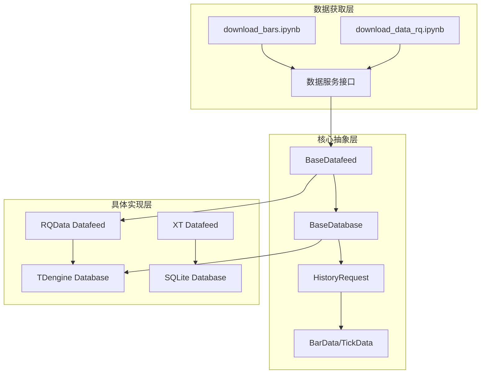
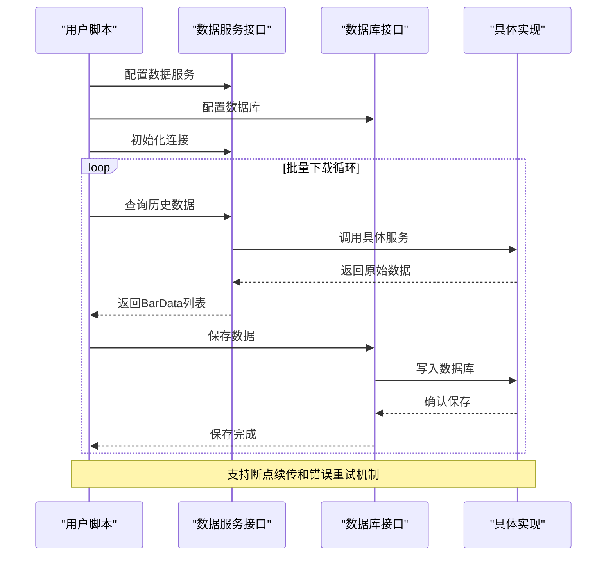
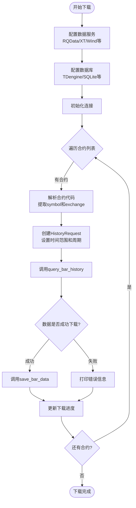
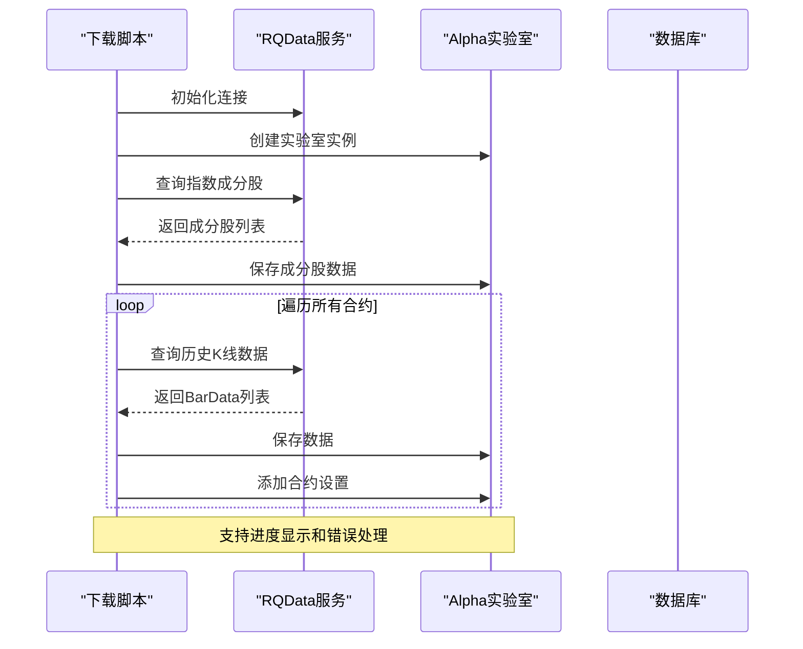
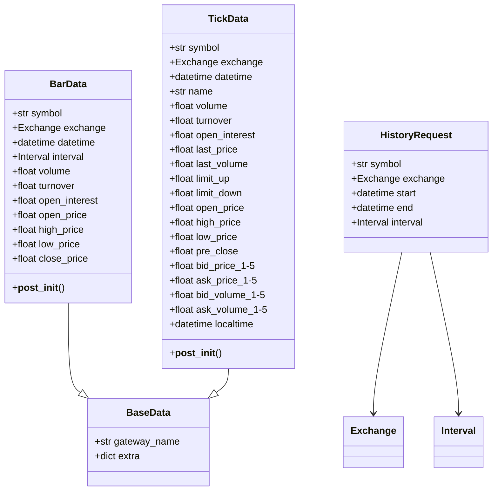
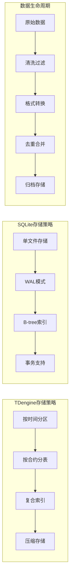
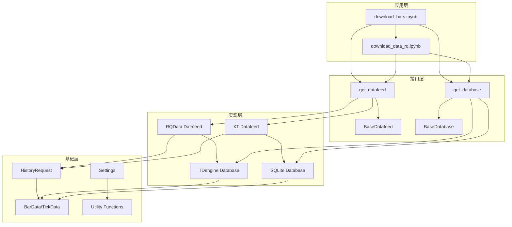

# 历史数据管理

<cite>
**本文档引用的文件**
- [download_bars.ipynb](file://examples/download_bars/download_bars.ipynb)
- [download_data_rq.ipynb](file://examples/alpha_research/download_data_rq.ipynb)
- [database.py](file://vnpy/trader/database.py)
- [datafeed.py](file://vnpy/trader/datafeed.py)
- [object.py](file://vnpy/trader/object.py)
- [constant.py](file://vnpy/trader/constant.py)
- [utility.py](file://vnpy/trader/utility.py)
</cite>

## 目录
1. [简介](#简介)
2. [项目结构](#项目结构)
3. [核心组件](#核心组件)
4. [架构概览](#架构概览)
5. [详细组件分析](#详细组件分析)
6. [依赖关系分析](#依赖关系分析)
7. [性能考虑](#性能考虑)
8. [故障排除指南](#故障排除指南)
9. [结论](#结论)

## 简介

本文档全面介绍了基于vnpy框架的历史K线数据管理实践。该系统提供了完整的解决方案，用于批量获取指定时间范围、周期和合约的历史数据，包括数据清洗、格式转换与去重逻辑，以及高效写入本地数据库以支持回测与分析。

系统采用模块化设计，支持多种数据服务提供商（如RQData、XT等）和数据库后端（如TDengine、SQLite等），为AI因子工程和策略回测准备高质量历史数据集。

## 项目结构

历史数据管理系统的核心文件组织如下：



**图表来源**
- [download_bars.ipynb](file://examples/download_bars/download_bars.ipynb#L1-L181)
- [database.py](file://vnpy/trader/database.py#L1-L160)
- [datafeed.py](file://vnpy/trader/datafeed.py#L1-L69)

**章节来源**
- [download_bars.ipynb](file://examples/download_bars/download_bars.ipynb#L1-L181)
- [download_data_rq.ipynb](file://examples/alpha_research/download_data_rq.ipynb#L1-L195)

## 核心组件

### 数据服务接口层

系统通过抽象基类`BaseDatafeed`定义了统一的数据服务接口：

```python
class BaseDatafeed:
    def init(self, output: Callable = print) -> bool:
        """初始化数据服务连接"""
        return False

    def query_bar_history(self, req: HistoryRequest, output: Callable = print) -> list[BarData]:
        """查询历史K线数据"""
        output(_("查询K线数据失败：没有正确配置数据服务"))
        return []

    def query_tick_history(self, req: HistoryRequest, output: Callable = print) -> list[TickData]:
        """查询历史Tick数据"""
        output(_("查询Tick数据失败：没有正确配置数据服务"))
        return []
```

### 数据库抽象层

`BaseDatabase`类提供了统一的数据库操作接口：

```python
class BaseDatabase(ABC):
    @abstractmethod
    def save_bar_data(self, bars: list[BarData], stream: bool = False) -> bool:
        """保存K线数据到数据库"""
        pass

    @abstractmethod
    def save_tick_data(self, ticks: list[TickData], stream: bool = False) -> bool:
        """保存Tick数据到数据库"""
        pass

    @abstractmethod
    def load_bar_data(self, symbol: str, exchange: Exchange, interval: Interval, start: datetime, end: datetime) -> list[BarData]:
        """从数据库加载K线数据"""
        pass
```

**章节来源**
- [database.py](file://vnpy/trader/database.py#L45-L160)
- [datafeed.py](file://vnpy/trader/datafeed.py#L10-L69)

## 架构概览

历史数据管理系统采用分层架构设计，确保了高度的可扩展性和维护性：



**图表来源**
- [download_bars.ipynb](file://examples/download_bars/download_bars.ipynb#L60-L85)
- [database.py](file://vnpy/trader/database.py#L127-L158)

## 详细组件分析

### 数据下载与处理流程

#### 基础数据下载流程



**图表来源**
- [download_bars.ipynb](file://examples/download_bars/download_bars.ipynb#L60-L85)

#### 高级数据下载流程（RQData示例）

对于更复杂的场景，如Alpha研究中的指数成分股下载：



**图表来源**
- [download_data_rq.ipynb](file://examples/alpha_research/download_data_rq.ipynb#L55-L120)

### 数据结构与类型系统

#### 核心数据类型

系统定义了标准化的数据结构来表示市场数据：



**图表来源**
- [object.py](file://vnpy/trader/object.py#L60-L120)
- [constant.py](file://vnpy/trader/constant.py#L1-L161)

### 数据库存储策略

#### 分区与索引优化

系统支持多种数据库后端，每种都有其特定的存储优化策略：



**图表来源**
- [database.py](file://vnpy/trader/database.py#L1-L160)

**章节来源**
- [download_bars.ipynb](file://examples/download_bars/download_bars.ipynb#L60-L85)
- [download_data_rq.ipynb](file://examples/alpha_research/download_data_rq.ipynb#L55-L120)

## 依赖关系分析

系统的依赖关系体现了清晰的分层架构：



**图表来源**
- [database.py](file://vnpy/trader/database.py#L127-L158)
- [datafeed.py](file://vnpy/trader/datafeed.py#L45-L69)

**章节来源**
- [database.py](file://vnpy/trader/database.py#L127-L158)
- [datafeed.py](file://vnpy/trader/datafeed.py#L45-L69)

## 性能考虑

### 并发下载优化

系统支持批量下载和并发处理，通过以下机制提升性能：

1. **分批处理**：将大量合约分成小批次处理，避免单次请求过大
2. **连接池**：复用数据服务连接，减少建立连接的开销
3. **内存管理**：及时释放不再需要的数据对象
4. **数据库批量写入**：使用数据库的批量插入功能

### 存储空间优化

1. **数据压缩**：TDengine等数据库支持数据压缩
2. **分区策略**：按时间分区存储，便于数据清理
3. **索引优化**：合理创建索引，平衡查询和写入性能
4. **数据归档**：定期将历史数据归档到低成本存储

## 故障排除指南

### 常见问题与解决方案

#### 数据服务连接问题

```python
# 检查数据服务配置
print(f"当前数据服务: {SETTINGS['datafeed.name']}")
print(f"用户名: {SETTINGS['datafeed.username']}")

# 验证连接状态
datafeed = get_datafeed()
if not datafeed.init():
    print("数据服务连接失败，请检查配置")
```

#### 数据库连接问题

```python
# 检查数据库配置
print(f"数据库类型: {SETTINGS['database.name']}")
print(f"主机地址: {SETTINGS['database.host']}")

# 测试数据库连接
try:
    database = get_database()
    # 执行简单查询测试连接
except Exception as e:
    print(f"数据库连接失败: {e}")
```

#### 数据质量问题

```python
# 检查下载的数据完整性
for vt_symbol in vt_symbols:
    # 创建历史数据请求对象
    req: HistoryRequest = HistoryRequest(
        symbol=symbol,
        exchange=exchange,
        start=start,
        end=end,
        interval=Interval.MINUTE
    )
    
    # 从数据服务下载数据
    bars: list[BarData] = datafeed.query_bar_history(req)
    
    if bars:
        print(f"成功下载 {vt_symbol}: {len(bars)} 条数据")
        # 检查数据连续性
        check_data_continuity(bars)
    else:
        print(f"下载失败 {vt_symbol}")
```

**章节来源**
- [download_bars.ipynb](file://examples/download_bars/download_bars.ipynb#L25-L45)

## 结论

vnpy的历史数据管理系统提供了一个完整、灵活且高性能的解决方案，用于管理和处理金融市场的历史数据。系统的主要优势包括：

1. **模块化设计**：清晰的分层架构，易于扩展和维护
2. **多服务支持**：支持多种数据服务提供商和数据库后端
3. **高性能处理**：优化的并发下载和批量存储机制
4. **数据质量保证**：完善的错误处理和数据验证机制
5. **灵活配置**：支持各种部署环境和使用场景

该系统特别适合需要大规模历史数据处理的量化交易应用场景，为AI因子工程和策略回测提供了坚实的数据基础。通过合理的配置和使用，可以显著提高数据处理效率和质量，为后续的策略开发和回测分析奠定良好基础。