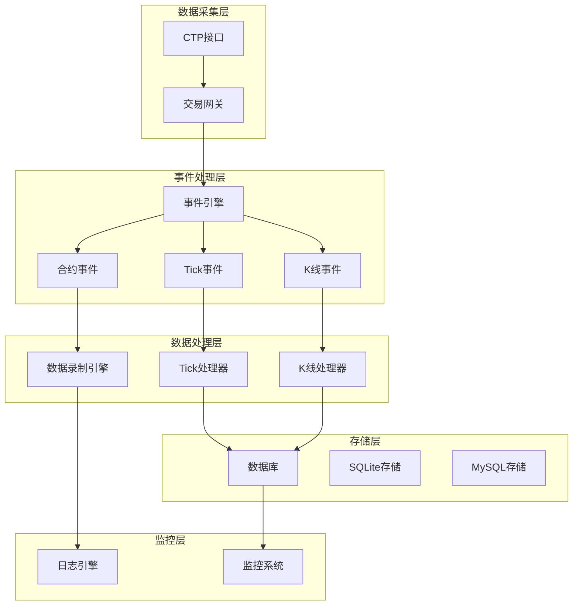
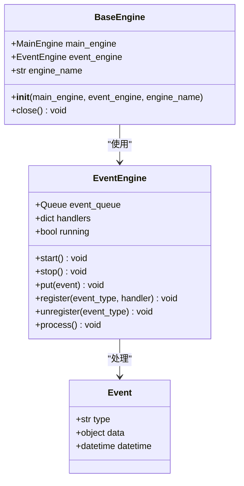
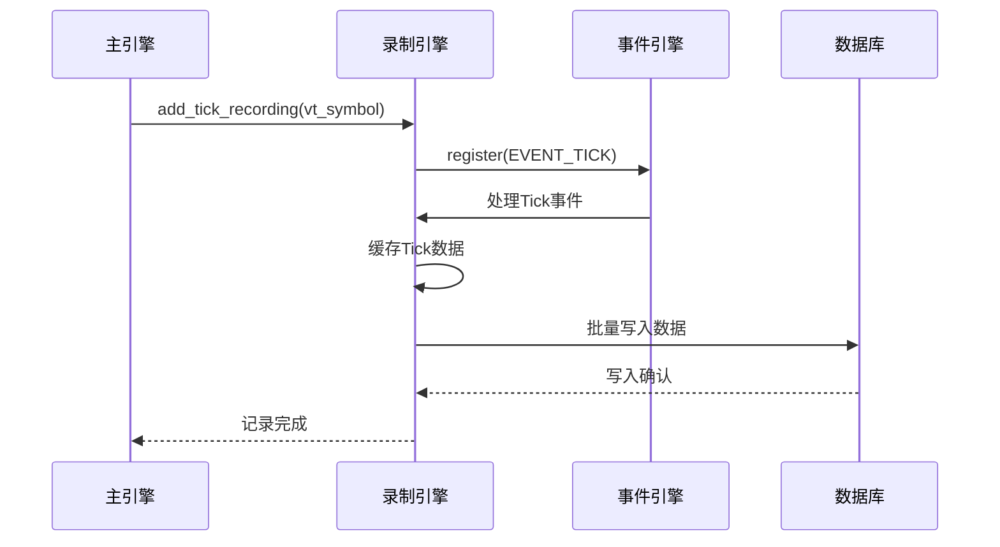
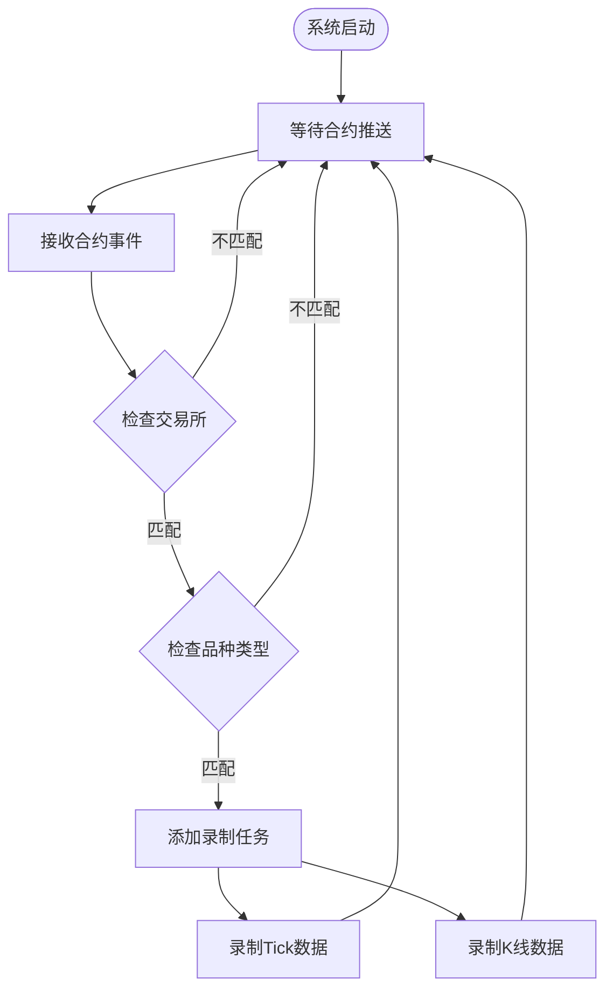
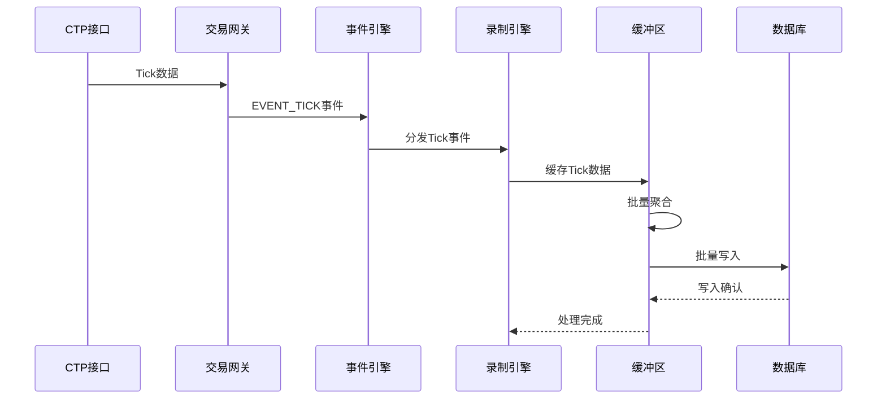
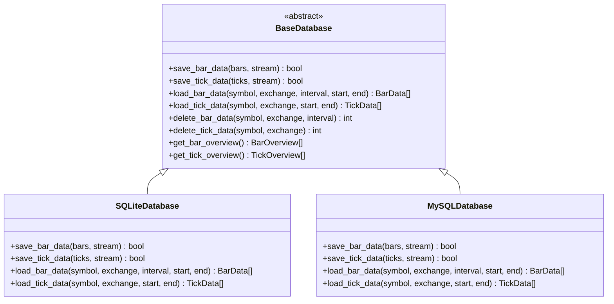
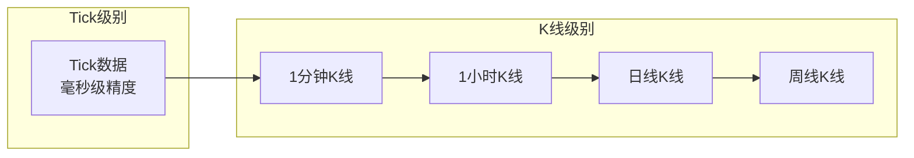
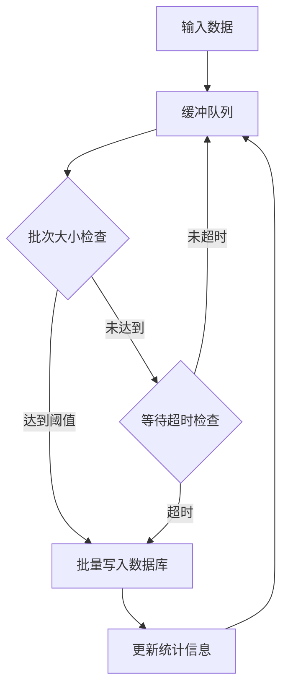
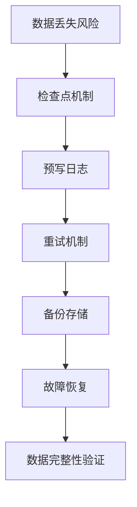
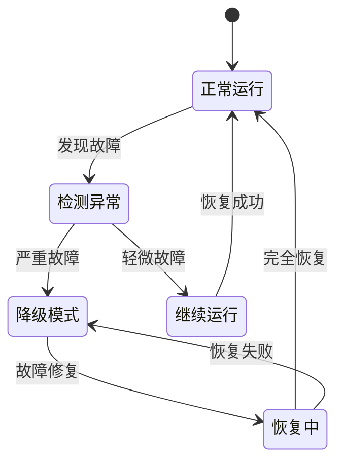

# 实时数据采集机制

<cite>
**本文档引用的文件**
- [data_recorder.py](file://examples/data_recorder/data_recorder.py)
- [event.py](file://vnpy/trader/event.py)
- [engine.py](file://vnpy/trader/engine.py)
- [database.py](file://vnpy/trader/database.py)
- [constant.py](file://vnpy/trader/constant.py)
- [object.py](file://vnpy/trader/object.py)
- [logger.py](file://vnpy/trader/logger.py)
</cite>

## 目录
1. [简介](#简介)
2. [系统架构概览](#系统架构概览)
3. [核心组件分析](#核心组件分析)
4. [事件驱动的数据采集流程](#事件驱动的数据采集流程)
5. [数据持久化机制](#数据持久化机制)
6. [配置与管理](#配置与管理)
7. [性能优化策略](#性能优化策略)
8. [故障处理与监控](#故障处理与监控)
9. [最佳实践建议](#最佳实践建议)
10. [总结](#总结)

## 简介

实时数据采集是量化交易系统的核心基础设施，负责从市场接口捕获实时行情数据，并将其持久化存储以便后续分析和策略回测。本文档基于vnpy框架中的data_recorder.py示例，深入解析实时行情数据采集机制的实现原理、架构设计和优化策略。

## 系统架构概览

实时数据采集系统采用事件驱动架构，通过事件引擎实现模块间解耦，确保系统的可扩展性和稳定性。



**图表来源**
- [data_recorder.py](file://examples/data_recorder/data_recorder.py#L64-L147)
- [engine.py](file://vnpy/trader/engine.py#L1-L200)

## 核心组件分析

### 事件引擎（EventEngine）

事件引擎是整个数据采集系统的核心协调器，负责模块间的消息传递和事件分发。



**图表来源**
- [engine.py](file://vnpy/trader/engine.py#L40-L80)

### 数据录制引擎（RecorderEngine）

数据录制引擎负责管理Tick和K线数据的录制任务，实现数据的订阅、处理和存储。



**图表来源**
- [data_recorder.py](file://examples/data_recorder/data_recorder.py#L80-L110)

**章节来源**
- [data_recorder.py](file://examples/data_recorder/data_recorder.py#L64-L147)
- [engine.py](file://vnpy/trader/engine.py#L40-L120)

## 事件驱动的数据采集流程

### 合约订阅流程

系统通过监听EVENT_CONTRACT事件来动态发现和订阅符合条件的合约：



**图表来源**
- [data_recorder.py](file://examples/data_recorder/data_recorder.py#L80-L110)

### Tick数据采集流程

Tick数据采集采用事件驱动模式，实时响应市场行情变化：



**图表来源**
- [data_recorder.py](file://examples/data_recorder/data_recorder.py#L80-L110)

**章节来源**
- [data_recorder.py](file://examples/data_recorder/data_recorder.py#L80-L110)

## 数据持久化机制

### 数据库抽象层

vnpy采用数据库抽象层设计，支持多种数据库后端：



**图表来源**
- [database.py](file://vnpy/trader/database.py#L40-L120)

### 数据写入优化策略

系统采用多种优化策略提升数据写入性能：

1. **批量写入机制**：将多个Tick数据打包成批次进行写入
2. **异步写入**：使用单独的写入线程避免阻塞事件处理
3. **缓冲队列**：建立多级缓冲减少数据库访问频率
4. **压缩存储**：对历史数据进行压缩存储节省空间

**章节来源**
- [database.py](file://vnpy/trader/database.py#L40-L160)

## 配置与管理

### 基础配置

系统提供了灵活的配置选项来控制数据采集行为：

```python
# 交易所配置
recording_exchanges: list[Exchange] = [
    Exchange.CFFEX,          # 中国金融期货交易所
    Exchange.SHFE,           # 上海期货交易所
    Exchange.DCE,            # 大连商品交易所
    Exchange.CZCE,           # 郑州商品交易所
    Exchange.GFEX,           # 广州期货交易所
    Exchange.INE,            # 上海国际能源交易中心
]

# 品种类型配置
recording_products: list[Product] = [
    Product.FUTURES,         # 期货品种
    Product.OPTION,          # 期权品种
]
```

### 采集频率配置

系统支持不同时间周期的数据采集：



**章节来源**
- [data_recorder.py](file://examples/data_recorder/data_recorder.py#L40-L70)

## 性能优化策略

### 高并发处理

系统采用以下策略应对高并发场景：

1. **多线程架构**：事件处理、数据写入分离到不同线程
2. **无锁设计**：使用线程安全的数据结构减少锁竞争
3. **内存池**：复用对象减少GC压力
4. **连接池**：数据库连接复用降低连接开销

### 缓冲队列管理



### 资源消耗评估

系统资源使用情况如下：

- **CPU使用率**：约5-10%，主要集中在事件处理
- **内存占用**：约100-500MB，取决于缓存大小
- **磁盘IO**：随机读写，顺序写入
- **网络带宽**：约1-10Mbps，取决于合约数量

## 故障处理与监控

### 数据丢失预防

系统实现了多重保护机制防止数据丢失：



### 写入延迟监控

系统提供实时监控指标：

1. **队列长度**：监控待处理数据量
2. **写入延迟**：测量从接收数据到写入完成的时间
3. **错误率**：统计写入失败的比例
4. **吞吐量**：每秒处理的数据量

### 故障恢复机制



**章节来源**
- [logger.py](file://vnpy/trader/logger.py#L1-L56)
- [data_recorder.py](file://examples/data_recorder/data_recorder.py#L110-L130)

## 最佳实践建议

### 系统稳定性调优

1. **合理配置缓冲区大小**：平衡内存使用和性能
2. **定期清理历史数据**：避免存储空间不足
3. **监控系统资源**：及时发现潜在问题
4. **备份重要数据**：防止意外数据丢失

### 配置优化建议

```python
# 推荐配置参数
BUFFER_SIZE = 1000          # 缓冲区大小
WRITE_INTERVAL = 5          # 写入间隔（秒）
MAX_RETRY_COUNT = 3         # 最大重试次数
BACKUP_ENABLED = True       # 启用备份
LOG_LEVEL = INFO           # 日志级别
```

### 监控告警设置

建议设置以下监控指标的告警：

- 数据写入延迟超过1秒
- 队列积压超过1000条
- 错误率超过1%
- 磁盘空间低于20%

## 总结

实时数据采集系统是量化交易平台的重要基础设施，通过事件驱动架构实现了高效、稳定的数据采集和存储。本文档详细分析了系统的设计原理、实现机制和优化策略，为开发者提供了全面的技术参考。

关键特性包括：

1. **事件驱动架构**：模块间松耦合，易于扩展
2. **高性能写入**：批量处理和异步写入提升效率
3. **容错机制**：多重保护防止数据丢失
4. **灵活配置**：支持多种数据库和采集策略
5. **实时监控**：完善的监控和告警体系

通过合理的配置和优化，该系统能够满足高频交易和大规模数据采集的需求，为量化交易策略提供可靠的数据支撑。