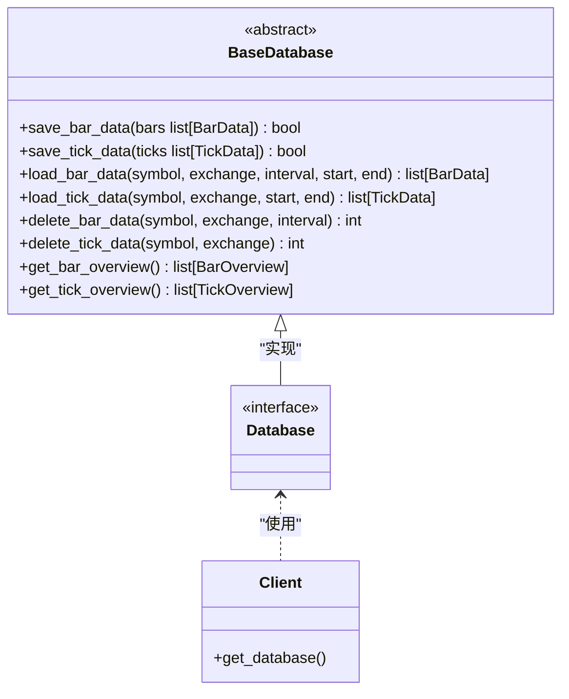
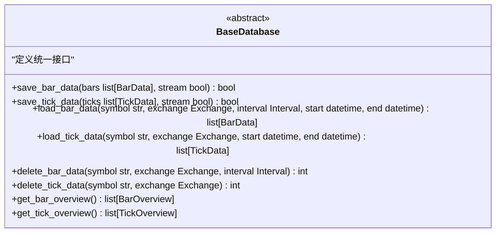
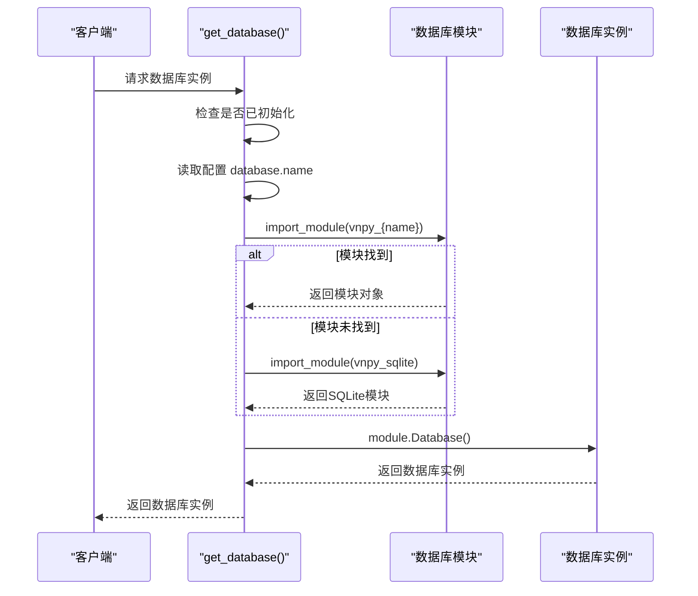
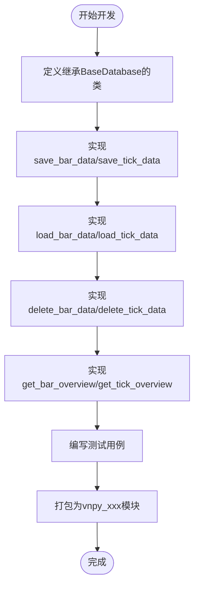

# 数据库适配器

<cite>
**本文档中引用的文件**
- [database.py](file://vnpy/trader/database.py)
- [VeighNa_项目详细文档.md](file://VeighNa_项目详细文档.md)
</cite>

## 目录
1. [引言](#引言)
2. [项目结构](#项目结构)
3. [核心组件](#核心组件)
4. [架构概述](#架构概述)
5. [详细组件分析](#详细组件分析)
6. [依赖分析](#依赖分析)
7. [性能考虑](#性能考虑)
8. [故障排除指南](#故障排除指南)
9. [结论](#结论)

## 引言
vnpy 是一个多功能量化交易平台，其核心设计之一是灵活的数据库适配器架构。该架构通过抽象基类和插件化机制，实现了对多种数据库后端（如 SQLite、MongoDB 等）的统一访问。本文档深入探讨了 `database.py` 文件中实现的多数据库适配器架构，详细解释了其设计原理、接口规范、运行时机制以及高级特性。

## 项目结构
vnpy 项目采用模块化设计，`vnpy/trader/database.py` 是数据库适配器的核心文件，定义了所有数据库实现必须遵循的抽象接口。整个系统通过 `get_database()` 工厂函数动态加载和初始化具体的数据库驱动，实现了高度的可扩展性和灵活性。

```mermaid
graph TD
subgraph "vnpy/trader"
database[database.py]
setting[setting.py]
object[object.py]
constant[constant.py]
end
database --> setting : "读取配置"
database --> object : "使用BarData/TickData"
database --> constant : "使用Interval/Exchange"
```

**Diagram sources**
- [database.py](file://vnpy/trader/database.py)

## 核心组件
`database.py` 文件定义了 `BaseDatabase` 抽象基类，该类为所有数据库适配器提供了统一的接口规范。核心组件包括数据模型 `BarOverview` 和 `TickOverview`，以及一系列用于数据持久化和查询的抽象方法。

**Section sources**
- [database.py](file://vnpy/trader/database.py#L0-L200)

## 架构概述
vnpy 的数据库适配器架构采用经典的抽象工厂模式。`BaseDatabase` 定义了所有数据库操作的契约，具体的数据库实现（如 `vnpy_sqlite`, `vnpy_mongodb`）通过独立的 Python 包提供。系统在运行时根据配置动态加载相应的驱动，实现了数据库后端的无缝切换。



**Diagram sources**
- [database.py](file://vnpy/trader/database.py#L61-L159)

## 详细组件分析

### 抽象基类设计
`BaseDatabase` 类使用 Python 的 `abc` 模块定义了一个抽象基类，强制所有子类实现特定的数据操作方法。这种设计确保了无论使用何种数据库后端，上层应用都能通过一致的 API 进行数据交互。



**Diagram sources**
- [database.py](file://vnpy/trader/database.py#L61-L159)

### 插件化机制与运行时加载
`get_database()` 函数是整个适配器架构的入口点。它根据全局配置 `SETTINGS["database.name"]` 动态导入相应的数据库模块（如 `vnpy_sqlite`），并实例化其 `Database` 类。如果指定的驱动未找到，则自动回退到默认的 SQLite 驱动。



**Diagram sources**
- [database.py](file://vnpy/trader/database.py#L127-L158)

### 自定义适配器开发
开发自定义数据库适配器需要创建一个继承 `BaseDatabase` 的类，并实现所有抽象方法。开发者需要关注 `save`、`load`、`delete` 等核心方法的实现，确保数据的正确序列化和反序列化。



**Diagram sources**
- [VeighNa_项目详细文档.md](file://VeighNa_项目详细文档.md#L1873-L1960)

## 依赖分析
数据库适配器架构依赖于 vnpy 的核心模块，包括 `object.py` 中定义的 `BarData` 和 `TickData` 数据模型，`constant.py` 中的 `Interval` 和 `Exchange` 枚举，以及 `setting.py` 提供的全局配置系统。这种设计确保了数据模型和业务逻辑的统一性。

```mermaid
graph TD
BaseDatabase --> object : "依赖"
BaseDatabase --> constant : "依赖"
BaseDatabase --> setting : "依赖"
get_database --> importlib : "依赖"
get_database --> setting : "依赖"
```

**Diagram sources**
- [database.py](file://vnpy/trader/database.py)

## 性能考虑
不同的数据库后端在性能上有显著差异。SQLite 适合轻量级应用和开发测试，而 MongoDB 和 TDengine 等 NoSQL 数据库在处理海量时序数据时表现出色。开发者应根据数据量、读写频率和查询复杂度选择合适的数据库。连接池配置和异步支持是提升性能的关键因素。

## 故障排除指南
当数据库连接出现问题时，首先检查 `database.name` 配置是否正确，以及相应的数据库驱动包是否已安装。确保数据库服务正在运行，并且连接参数（如主机、端口、认证信息）正确无误。查看日志输出以获取更详细的错误信息。

**Section sources**
- [database.py](file://vnpy/trader/database.py)

## 结论
vnpy 的多数据库适配器架构通过抽象基类和插件化设计，实现了对多种数据库后端的灵活支持。该架构不仅简化了数据库的切换和集成，还为开发者提供了清晰的扩展接口。通过深入理解其设计原理和实现机制，用户可以更好地利用这一特性，构建高性能、可扩展的量化交易系统。