现在我有了足够的信息来创建关于数据持久化的综合文档。让我开始生成文档内容：

<docs>
# 数据持久化

<cite>
**本文档引用的文件**
- [database.py](file://vnpy/trader/database.py)
- [data_recorder.py](file://examples/data_recorder/data_recorder.py)
- [download_bars.ipynb](file://examples/download_bars/download_bars.ipynb)
- [constant.py](file://vnpy/trader/constant.py)
- [object.py](file://vnpy/trader/object.py)
- [setting.py](file://vnpy/trader/setting.py)
- [datafeed.py](file://vnpy/trader/datafeed.py)
- [utility.py](file://vnpy/trader/utility.py)
</cite>

## 目录
1. [简介](#简介)
2. [项目结构概览](#项目结构概览)
3. [核心数据库适配器设计](#核心数据库适配器设计)
4. [多数据库支持架构](#多数据库支持架构)
5. [数据录制机制](#数据录制机制)
6. [历史数据下载与存储](#历史数据下载与存储)
7. [数据查询API设计](#数据查询api设计)
8. [索引优化策略](#索引优化策略)
9. [大规模数据处理性能考量](#大规模数据处理性能考量)
10. [数据库迁移与备份恢复](#数据库迁移与备份恢复)
11. [容量规划与运维指南](#容量规划与运维指南)
12. [故障排除指南](#故障排除指南)
13. [总结](#总结)

## 简介

VeighNa量化交易平台采用了高度模块化和可扩展的数据持久化架构，通过统一的数据库适配器接口支持多种数据库类型，包括SQLite、MySQL、PostgreSQL、MongoDB、TDengine等。这种设计模式不仅提供了灵活的数据存储方案，还确保了系统的可维护性和扩展性。

本文档将深入探讨VeighNa平台的数据持久化机制，重点介绍数据库适配器的设计模式、实时行情数据录制、历史数据批量下载、数据查询API、索引优化策略以及运维最佳实践。

## 项目结构概览

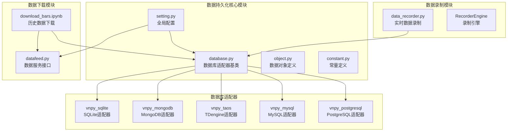

**图表来源**
- [database.py](file://vnpy/trader/database.py#L1-L160)
- [setting.py](file://vnpy/trader/setting.py#L1-L44)
- [data_recorder.py](file://examples/data_recorder/data_recorder.py#L1-L147)

## 核心数据库适配器设计

### 抽象基类设计

VeighNa采用抽象基类模式设计数据库适配器，通过`BaseDatabase`抽象类定义统一的数据操作接口：

```python
class BaseDatabase(ABC):
    """
    Abstract database class for connecting to different database.
    """

    @abstractmethod
    def save_bar_data(self, bars: list[BarData], stream: bool = False) -> bool:
        """
        Save bar data into database.
        """
        pass

    @abstractmethod
    def save_tick_data(self, ticks: list[TickData], stream: bool = False) -> bool:
        """
        Save tick data into database.
        """
        pass

    @abstractmethod
    def load_bar_data(
        self,
        symbol: str,
        exchange: Exchange,
        interval: Interval,
        start: datetime,
        end: datetime
    ) -> list[BarData]:
        """
        Load bar data from database.
        """
        pass

    @abstractmethod
    def load_tick_data(
        self,
        symbol: str,
        exchange: Exchange,
        start: datetime,
        end: datetime
    ) -> list[TickData]:
        """
        Load tick data from database.
        """
        pass
```

### 数据对象标准化

系统定义了标准化的数据对象，确保不同数据库适配器之间的数据一致性：

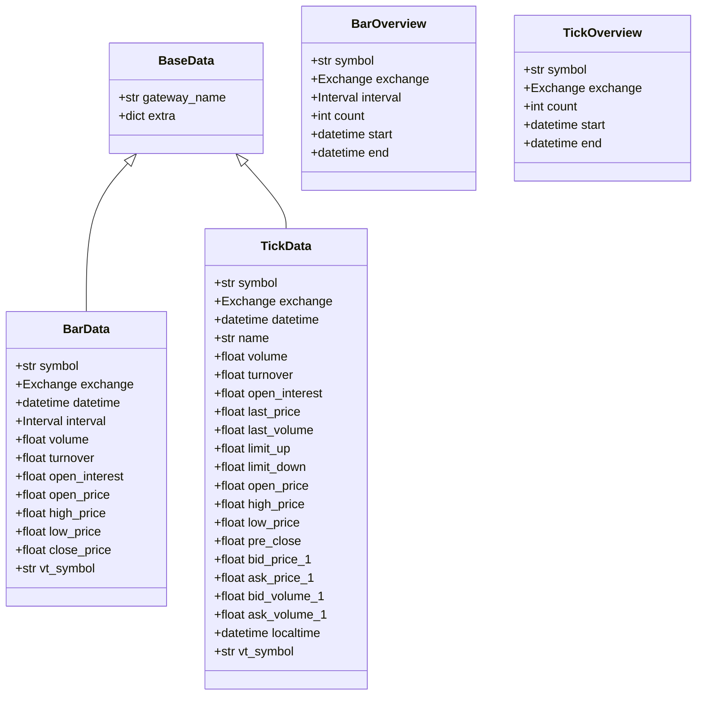

**图表来源**
- [object.py](file://vnpy/trader/object.py#L1-L199)
- [database.py](file://vnpy/trader/database.py#L25-L61)

**章节来源**
- [database.py](file://vnpy/trader/database.py#L1-L160)
- [object.py](file://vnpy/trader/object.py#L1-L199)

## 多数据库支持架构

### 动态适配器加载机制

VeighNa实现了动态数据库适配器加载机制，通过配置文件自动选择合适的数据库驱动：

```python
def get_database() -> BaseDatabase:
    """
    Get database object with dynamic adapter loading.
    """
    global database
    if database:
        return database

    # Read database related global setting
    database_name: str = SETTINGS["database.name"]
    module_name: str = f"vnpy_{database_name}"

    # Try to import database module
    try:
        module: ModuleType = import_module(module_name)
    except ModuleNotFoundError:
        print(_("找不到数据库驱动{}，使用默认的SQLite数据库").format(module_name))
        module = import_module("vnpy_sqlite")

    # Create database object from module
    database = module.Database()
    return database
```

### 支持的数据库类型

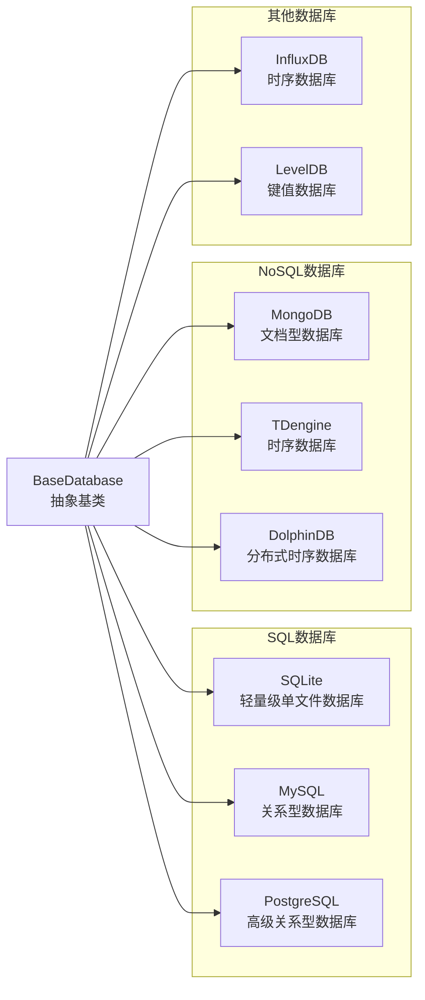

**图表来源**
- [database.py](file://vnpy/trader/database.py#L140-L158)

### 数据库配置管理

系统通过集中化的配置管理支持不同数据库的连接参数：

```python
# 默认SQLite配置
SETTINGS["database.name"] = "sqlite"
SETTINGS["database.database"] = "database.db"
SETTINGS["database.host"] = ""
SETTINGS["database.port"] = 0
SETTINGS["database.user"] = ""
SETTINGS["database.password"] = ""

# TDengine配置示例
SETTINGS["database.name"] = "taos"
SETTINGS["database.database"] = "vnpy"
SETTINGS["database.host"] = "127.0.0.1"
SETTIN["database.port"] = 6030
SETTINGS["database.user"] = "root"
SETTINGS["database.password"] = "taosdata"
```

**章节来源**
- [database.py](file://vnpy/trader/database.py#L140-L158)
- [setting.py](file://vnpy/trader/setting.py#L1-L44)

## 数据录制机制

### 实时行情录制架构

VeighNa的数据录制模块采用事件驱动架构，能够实时捕获和存储市场数据：

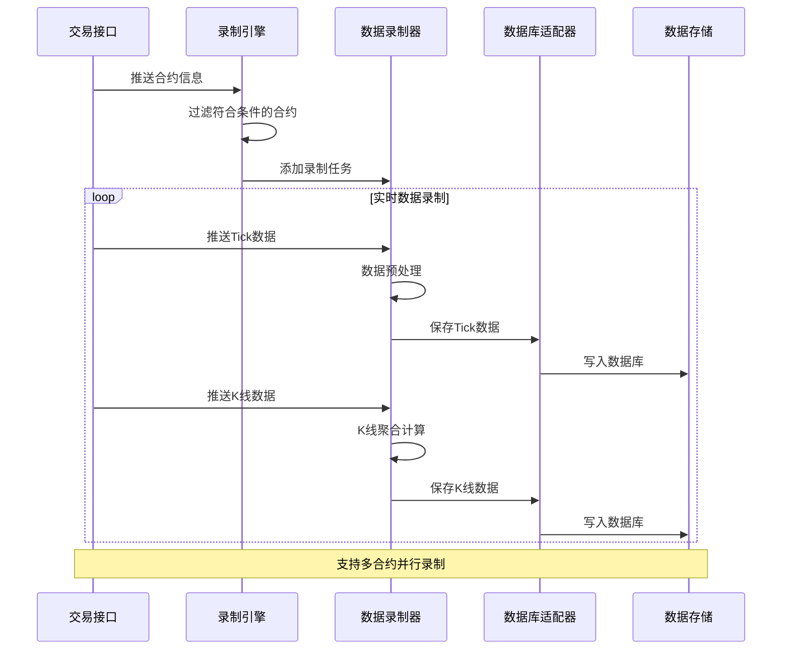

**图表来源**
- [data_recorder.py](file://examples/data_recorder/data_recorder.py#L60-L100)

### 录制规则配置

数据录制模块支持灵活的录制规则配置，可以根据交易所、品种类型等条件筛选需要录制的数据：

```python
# 要录制数据的交易所列表
recording_exchanges: list[Exchange] = [
    Exchange.CFFEX,          # 中国金融期货交易所
    Exchange.SHFE,           # 上海期货交易所
    Exchange.DCE,            # 大连商品交易所
    Exchange.CZCE,           # 郑州商品交易所
    Exchange.GFEX,           # 广州期货交易所
    Exchange.INE,            # 上海国际能源交易中心
]

# 要录制数据的品种类型
recording_products: list[Product] = [
    Product.FUTURES,        # 期货品种
    Product.OPTION,         # 期权品种
]
```

### 录制任务管理

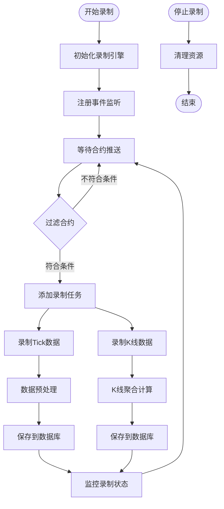

**图表来源**
- [data_recorder.py](file://examples/data_recorder/data_recorder.py#L70-L120)

**章节来源**
- [data_recorder.py](file://examples/data_recorder/data_recorder.py#L1-L147)

## 历史数据下载与存储

### 批量数据下载流程

VeighNa提供了完整的批量历史数据下载和存储解决方案，支持多种数据服务提供商：

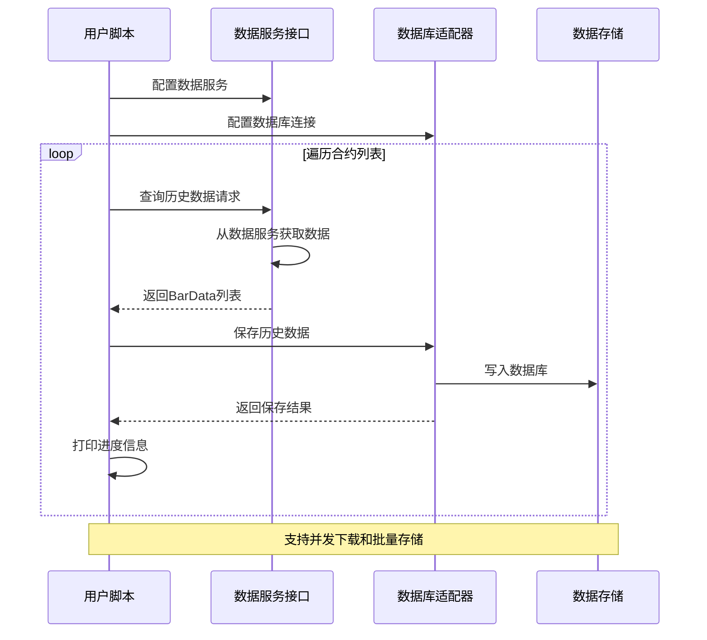

**图表来源**
- [download_bars.ipynb](file://examples/download_bars/download_bars.ipynb#L100-L150)

### 数据服务集成

系统支持多种数据服务提供商，通过统一的接口实现数据获取：

```python
# 配置数据服务
SETTINGS["datafeed.name"] = "rqdata"            # 可以根据自己的需求选择数据服务：rqdata/xt/wind等
SETTINGS["datafeed.username"] = "license"       # RQData的用户名统一为"license"
SETTINGS["datafeed.password"] = "123456"        # 这里需要替换为你购买或者申请试用的RQData数据license

# 配置数据库
SETTINGS["database.name"] = "taos"              # 可以根据自己的需求选择数据库，这里使用的是TDengine
SETTINGS["database.database"] = "vnpy"
SETTINGS["database.host"] = "127.0.0.1"
SETTINGS["database.port"] = 6030
SETTINGS["database.user"] = "root"
SETTINGS["database.password"] = "taosdata"
```

### 批量下载最佳实践

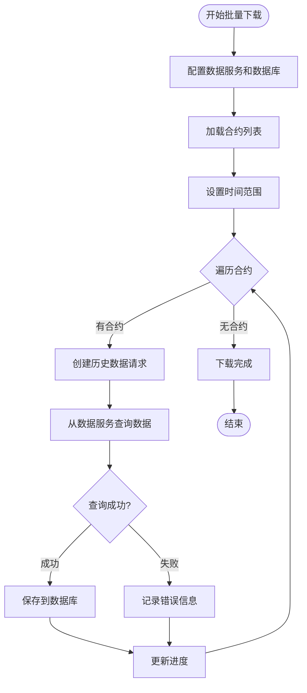

**图表来源**
- [download_bars.ipynb](file://examples/download_bars/download_bars.ipynb#L100-L180)

**章节来源**
- [download_bars.ipynb](file://examples/download_bars/download_bars.ipynb#L1-L181)
- [datafeed.py](file://vnpy/trader/datafeed.py#L1-L69)

## 数据查询API设计

### 统一查询接口

VeighNa提供了统一的数据查询API，支持多种数据类型的检索：

```python
class BaseDatabase(ABC):
    """
    Abstract database class for connecting to different database.
    """

    @abstractmethod
    def load_bar_data(
        self,
        symbol: str,
        exchange: Exchange,
        interval: Interval,
        start: datetime,
        end: datetime
    ) -> list[BarData]:
        """
        Load bar data from database.
        """
        pass

    @abstractmethod
    def load_tick_data(
        self,
        symbol: str,
        exchange: Exchange,
        start: datetime,
        end: datetime
    ) -> list[TickData]:
        """
        Load tick data from database.
        """
        pass

    @abstractmethod
    def get_bar_overview(self) -> list[BarOverview]:
        """
        Return bar data available in database.
        """
        pass

    @abstractmethod
    def get_tick_overview(self) -> list[TickOverview]:
        """
        Return tick data available in database.
        """
        pass
```

### 数据概览查询

系统提供了数据概览查询功能，帮助用户了解数据库中存储的数据情况：

```python
@dataclass
class BarOverview:
    """
    Overview of bar data stored in database.
    """
    symbol: str = ""
    exchange: Exchange | None = None
    interval: Interval | None = None
    count: int = 0
    start: datetime | None = None
    end: datetime | None = None

@dataclass
class TickOverview:
    """
    Overview of tick data stored in database.
    """
    symbol: str = ""
    exchange: Exchange | None = None
    count: int = 0
    start: datetime | None = None
    end: datetime | None = None
```

### 查询优化策略

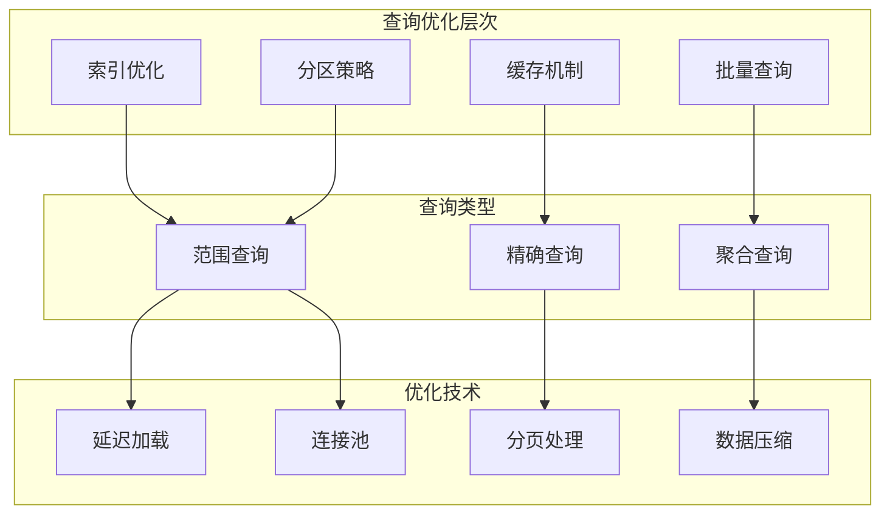

**章节来源**
- [database.py](file://vnpy/trader/database.py#L25-L127)

## 索引优化策略

### 数据库索引设计

不同数据库类型的索引优化策略：

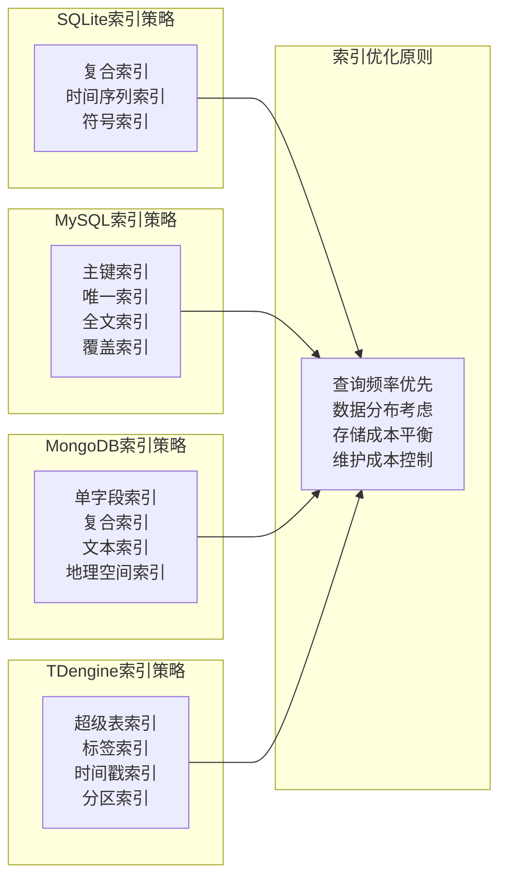

### 时间序列数据优化

针对时间序列数据的特点，系统采用专门的优化策略：

```python
# 时间序列数据的典型查询模式
# 1. 按时间范围查询
# 2. 按符号查询
# 3. 按时间间隔聚合

# 推荐的索引设计
# SQLite: CREATE INDEX idx_symbol_time ON bar_data(symbol, datetime)
# MySQL: CREATE INDEX idx_symbol_interval ON bar_data(symbol, interval, datetime)
# MongoDB: db.createIndex({symbol: 1, datetime: 1})
# TDengine: CREATE STABLE IF NOT EXISTS bar_data (timestamp TIMESTAMP, ...)
```

## 大规模数据处理性能考量

### 数据分片策略

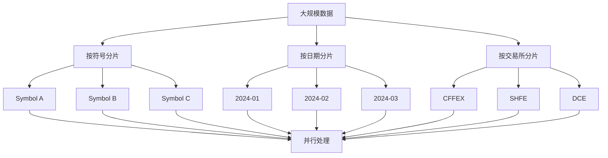

### 批量处理优化

```python
# 批量插入优化示例
def save_bar_data_optimized(self, bars: list[BarData]) -> bool:
    """
    Optimized batch insertion for large datasets.
    """
    # 1. 分批处理，避免内存溢出
    batch_size = 1000
    batches = [bars[i:i + batch_size] for i in range(0, len(bars), batch_size)]
    
    # 2. 使用事务批量提交
    success_count = 0
    for batch in batches:
        try:
            # 开始事务
            self.connection.begin()
            
            # 批量插入
            self._batch_insert_bars(batch)
            
            # 提交事务
            self.connection.commit()
            success_count += len(batch)
        except Exception as e:
            self.connection.rollback()
            logger.error(f"Batch insert failed: {e}")
    
    return success_count > 0
```

### 内存管理策略

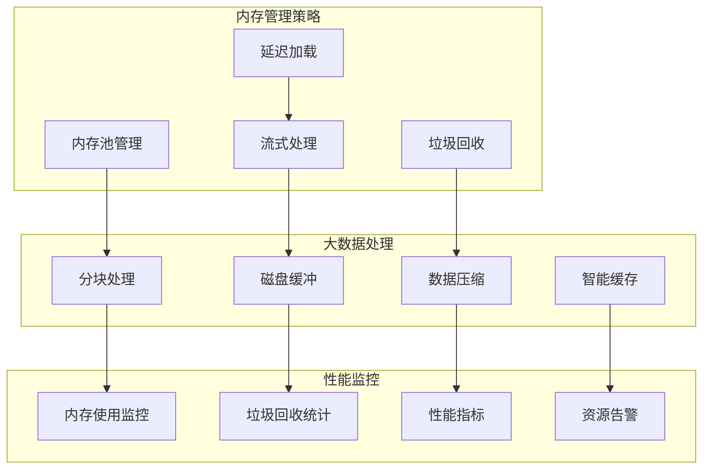

## 数据库迁移与备份恢复

### 数据库迁移策略

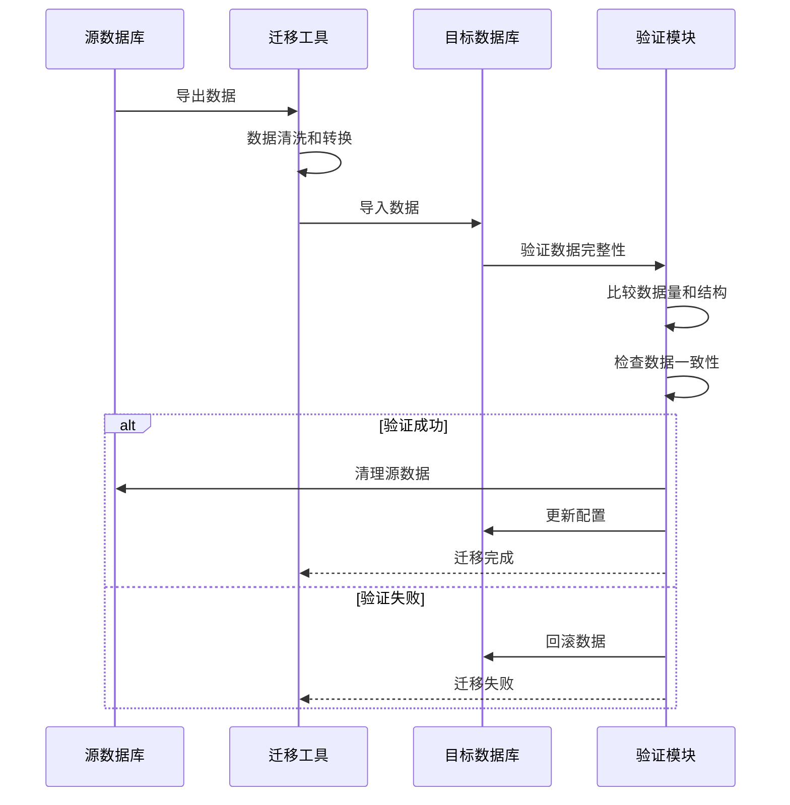

### 备份策略设计

```python
class DatabaseBackup:
    """
    Database backup and restore management.
    """
    
    def __init__(self, database: BaseDatabase):
        self.database = database
        self.backup_path = Path.home() / ".vntrader" / "backups"
    
    def create_backup(self, backup_type: str = "full") -> str:
        """
        Create database backup.
        """
        timestamp = datetime.now().strftime("%Y%m%d_%H%M%S")
        backup_file = self.backup_path / f"backup_{backup_type}_{timestamp}.zip"
        
        # 根据数据库类型执行相应的备份策略
        if isinstance(self.database, SQLiteAdapter):
            return self._backup_sqlite(backup_file)
        elif isinstance(self.database, MongoDBAdapter):
            return self._backup_mongodb(backup_file)
        elif isinstance(self.database, TDengineAdapter):
            return self._backup_taos(backup_file)
        
        return str(backup_file)
    
    def restore_from_backup(self, backup_file: str) -> bool:
        """
        Restore database from backup file.
        """
        # 实现恢复逻辑
        pass
```

### 数据一致性保证

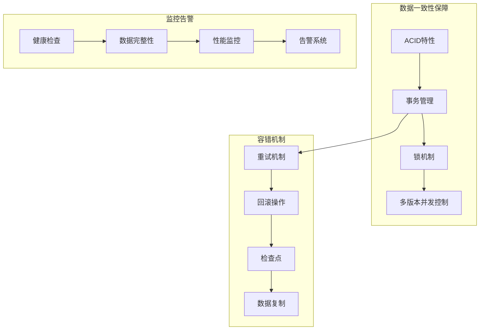

## 容量规划与运维指南

### 存储容量评估

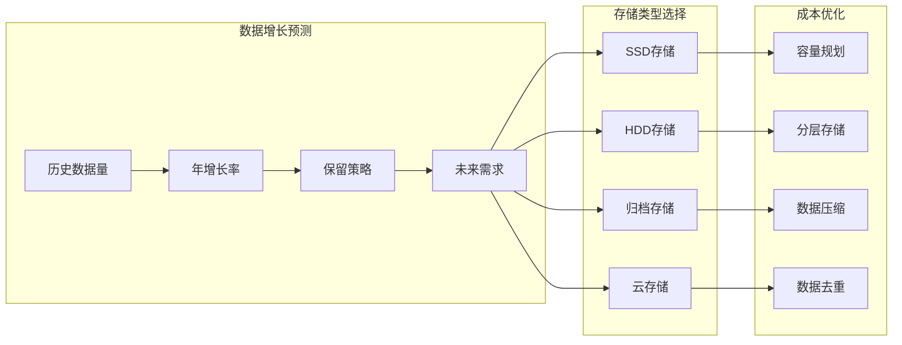

### 运维监控体系

```python
class DatabaseMonitor:
    """
    Comprehensive database monitoring system.
    """
    
    def __init__(self, database: BaseDatabase):
        self.database = database
        self.metrics = {}
    
    def collect_metrics(self) -> dict:
        """
        Collect database performance metrics.
        """
        metrics = {
            "storage_usage": self._get_storage_usage(),
            "query_performance": self._get_query_performance(),
            "connection_stats": self._get_connection_stats(),
            "data_integrity": self._check_data_integrity(),
            "backup_status": self._get_backup_status()
        }
        return metrics
    
    def alert_on_threshold(self, threshold_config: dict) -> list[str]:
        """
        Generate alerts based on threshold configuration.
        """
        alerts = []
        
        # 检查存储使用率
        storage_usage = self.metrics.get("storage_usage", 0)
        if storage_usage > threshold_config.get("storage_threshold", 80):
            alerts.append(f"High storage usage: {storage_usage}%")
        
        # 检查查询性能
        slow_queries = self.metrics.get("slow_queries", [])
        if len(slow_queries) > threshold_config.get("slow_query_threshold", 10):
            alerts.append(f"Too many slow queries: {len(slow_queries)}")
        
        return alerts
```

### 性能调优指南

```mermaid
flowchart TD
    PerfIssue[性能问题] --> Diagnose[诊断分析]
    Diagnose --> QueryAnalysis[查询分析]
    Diagnose --> IndexAnalysis[索引分析]
    Diagnose --> HardwareAnalysis[硬件分析]
    
    QueryAnalysis --> SlowQueries[慢查询识别]
    QueryAnalysis --> ExecutionPlan[执行计划分析]
    
    IndexAnalysis --> MissingIndexes[缺失索引]
    IndexAnalysis --> UnusedIndexes[未使用索引]
    IndexAnalysis --> IndexFragmentation[索引碎片化]
    
    HardwareAnalysis --> CPUUsage[CPU使用率]
    HardwareAnalysis --> MemoryUsage[内存使用率]
    HardwareAnalysis --> DiskIO[磁盘I/O]
    HardwareAnalysis --> NetworkLatency[网络延迟]
    
    SlowQueries --> OptimizeQuery[查询优化]
    ExecutionPlan --> OptimizeQuery
    MissingIndexes --> CreateIndex[创建索引]
    UnusedIndexes --> DropIndex[删除索引]
    IndexFragmentation --> RebuildIndex[重建索引]
    
    CPUUsage --> ScaleUp