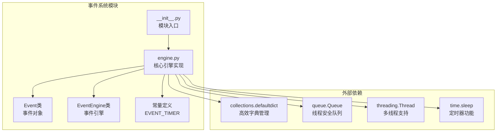
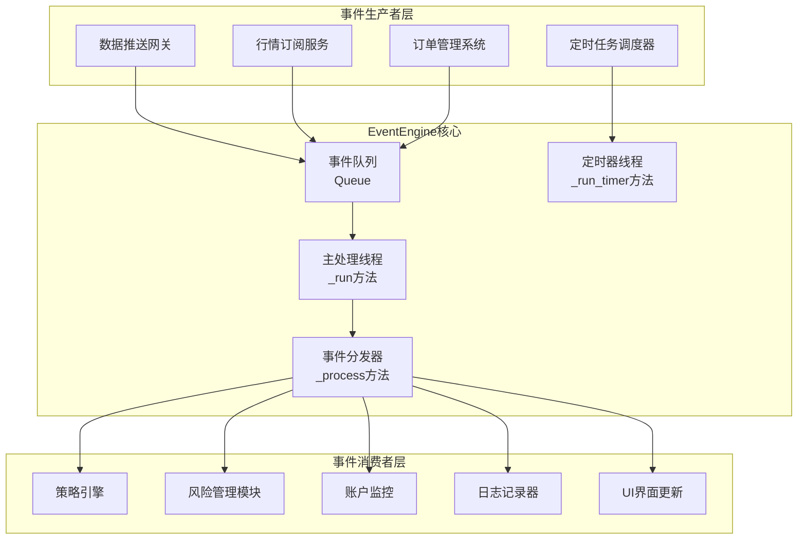
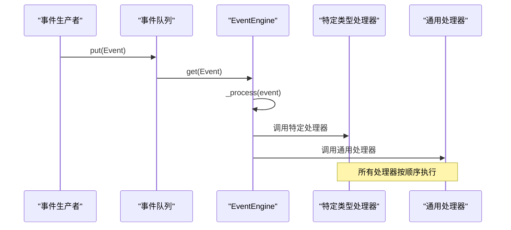
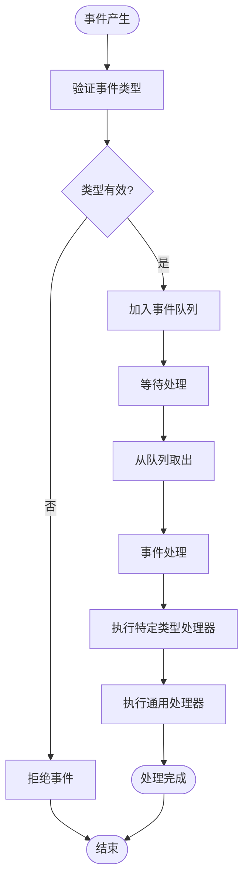

# vnpy事件驱动架构：EventEngine深度解析

<cite>
**本文档引用的文件**
- [vnpy/event/engine.py](file://vnpy/event/engine.py)
- [vnpy/event/__init__.py](file://vnpy/event/__init__.py)
- [VeighNa_项目详细文档.md](file://VeighNa_项目详细文档.md)
</cite>

## 目录
1. [简介](#简介)
2. [项目结构概览](#项目结构概览)
3. [核心组件分析](#核心组件分析)
4. [架构设计原理](#架构设计原理)
5. [详细组件分析](#详细组件分析)
6. [事件处理流程](#事件处理流程)
7. [定时器机制实现](#定时器机制实现)
8. [性能优化与最佳实践](#性能优化与最佳实践)
9. [故障排除指南](#故障排除指南)
10. [总结](#总结)

## 简介

vnpy的EventEngine是整个交易系统的核心事件驱动框架，采用生产者-消费者模式实现高效的异步事件处理。该引擎通过线程池和队列机制，实现了跨线程事件通信，为vnpy提供了强大的事件分发能力。

EventEngine的设计遵循以下核心原则：
- **事件驱动**：基于事件类型进行分发和处理
- **异步处理**：支持非阻塞事件处理
- **线程安全**：通过队列机制确保线程安全
- **高性能**：最小化锁竞争和上下文切换

## 项目结构概览

vnpy事件系统的文件组织结构简洁明了：



**图表来源**
- [vnpy/event/engine.py](file://vnpy/event/engine.py#L1-L146)
- [vnpy/event/__init__.py](file://vnpy/event/__init__.py#L1-L9)

**章节来源**
- [vnpy/event/__init__.py](file://vnpy/event/__init__.py#L1-L9)
- [vnpy/event/engine.py](file://vnpy/event/engine.py#L1-L146)

## 核心组件分析

### Event类：事件数据载体

Event类是所有事件的基础数据结构，采用简单的键值对设计：

```python
class Event:
    def __init__(self, type: str, data: Any = None) -> None:
        self.type: str = type      # 事件类型标识
        self.data: Any = data      # 事件携带的数据
```

**特点**：
- **轻量级设计**：仅包含两个必要字段，减少内存开销
- **类型安全**：通过类型注解确保编译时检查
- **灵活扩展**：data字段支持任意Python对象

### EventEngine类：核心事件引擎

EventEngine类是整个事件系统的核心控制器：

```python
class EventEngine:
    def __init__(self, interval: int = 1) -> None:
        self._interval: int = interval                    # 定时器间隔
        self._queue: Queue = Queue()                      # 事件队列
        self._active: bool = False                        # 运行状态标志
        self._thread: Thread = Thread(target=self._run)   # 主事件处理线程
        self._timer: Thread = Thread(target=self._run_timer)  # 定时器线程
        self._handlers: defaultdict = defaultdict(list)   # 按类型分类的处理器
        self._general_handlers: list = []                 # 通用处理器列表
```

**章节来源**
- [vnpy/event/engine.py](file://vnpy/event/engine.py#L15-L52)

## 架构设计原理

### 整体架构图



**图表来源**
- [vnpy/event/engine.py](file://vnpy/event/engine.py#L54-L144)

### 设计模式应用

EventEngine采用了多种经典设计模式：

1. **观察者模式**：事件发布者无需知道订阅者
2. **生产者-消费者模式**：通过队列解耦生产和消费
3. **单例模式**：通常在整个系统中只有一个EventEngine实例
4. **工厂模式**：Event类作为事件对象的工厂

## 详细组件分析

### 事件队列管理

EventEngine使用Python标准库的Queue作为事件队列：

```python
def _run(self) -> None:
    """
    Get event from queue and then process it.
    """
    while self._active:
        try:
            event: Event = self._queue.get(block=True, timeout=1)
            self._process(event)
        except Empty:
            pass
```

**关键特性**：
- **阻塞获取**：等待最多1秒，避免忙等待
- **超时机制**：防止线程永久阻塞
- **异常处理**：优雅处理空队列情况

### 事件分发机制



**图表来源**
- [vnpy/event/engine.py](file://vnpy/event/engine.py#L54-L70)

### 处理器注册与管理

EventEngine提供了两种处理器注册方式：

#### 特定类型处理器注册

```python
def register(self, type: str, handler: HandlerType) -> None:
    """
    Register a new handler function for a specific event type.
    """
    handler_list: list = self._handlers[type]
    if handler not in handler_list:
        handler_list.append(handler)
```

#### 通用处理器注册

```python
def register_general(self, handler: HandlerType) -> None:
    """
    Register a new handler function for all event types.
    """
    if handler not in self._general_handlers:
        self._general_handlers.append(handler)
```

**章节来源**
- [vnpy/event/engine.py](file://vnpy/event/engine.py#L104-L144)

## 事件处理流程

### 事件生命周期



**图表来源**
- [vnpy/event/engine.py](file://vnpy/event/engine.py#L54-L70)

### 异步处理机制

EventEngine的异步处理基于以下机制：

1. **线程隔离**：事件生产者和消费者运行在不同线程
2. **队列缓冲**：提供背压控制和流量整形
3. **非阻塞设计**：避免处理器执行时间影响整体性能

## 定时器机制实现

### 定时器线程设计

```python
def _run_timer(self) -> None:
    """
    Sleep by interval second(s) and then generate a timer event.
    """
    while self._active:
        sleep(self._interval)
        event: Event = Event(EVENT_TIMER)
        self.put(event)
```

### 定时器事件类型

```python
EVENT_TIMER = "eTimer"
```

**定时器特性**：
- **独立线程**：定时器运行在专用线程中
- **固定间隔**：可配置的定时器间隔（默认1秒）
- **自动重置**：每次事件产生后重新计时
- **统一处理**：所有定时器事件都使用相同类型

### 定时器应用场景

1. **策略触发**：定期执行策略逻辑
2. **数据刷新**：定时更新市场数据
3. **状态检查**：定期检查系统状态
4. **资源清理**：定时清理过期资源

**章节来源**
- [vnpy/event/engine.py](file://vnpy/event/engine.py#L72-L82)

## 性能优化与最佳实践

### 性能调优建议

#### 1. 队列大小优化

```python
# 建议根据系统负载调整队列大小
from queue import Queue
queue = Queue(maxsize=1000)  # 根据实际需求设置
```

#### 2. 处理器执行优化

```python
# 避免长时间阻塞操作
def fast_handler(event: Event):
    # 使用异步I/O或后台线程
    asyncio.run(async_process(event))
```

#### 3. 内存管理

```python
# 及时释放不需要的事件数据
def cleanup_handler(event: Event):
    if hasattr(event.data, '__del__'):
        del event.data
```

### 最佳实践

#### 事件设计原则

1. **轻量级事件**：保持Event对象尽可能小
2. **类型安全**：使用明确的事件类型标识
3. **数据封装**：将相关数据封装到data字段中
4. **及时处理**：避免事件积压

#### 处理器设计原则

1. **快速响应**：处理器应尽快返回
2. **异常处理**：每个处理器都应包含异常处理
3. **资源管理**：正确管理文件句柄、网络连接等资源
4. **日志记录**：记录重要事件和错误信息

## 故障排除指南

### 常见问题及解决方案

#### 1. 事件丢失问题

**症状**：某些事件没有被处理

**可能原因**：
- 处理器注册不正确
- 队列满导致事件被丢弃
- 线程未启动或已崩溃

**解决方案**：
```python
# 检查处理器注册
def debug_registration(engine: EventEngine):
    for event_type, handlers in engine._handlers.items():
        print(f"事件类型 {event_type}: {len(handlers)} 个处理器")

# 监控队列状态
def monitor_queue(queue: Queue):
    print(f"队列大小: {queue.qsize()}")
```

#### 2. 性能瓶颈

**症状**：系统响应变慢，事件处理延迟

**诊断方法**：
```python
import time

class PerformanceMonitor:
    def __init__(self):
        self.start_time = time.time()
        
    def log_processing_time(self, event_type: str):
        elapsed = time.time() - self.start_time
        if elapsed > 0.1:  # 超过100ms记录
            print(f"事件 {event_type} 处理耗时: {elapsed:.3f}s")
```

#### 3. 死锁问题

**症状**：程序无响应，线程挂起

**预防措施**：
- 避免在事件处理器中调用阻塞操作
- 使用超时机制
- 定期检查线程状态

### 调试工具

```python
class EventDebugger:
    def __init__(self, engine: EventEngine):
        self.engine = engine
        
    def dump_state(self):
        """转储当前引擎状态"""
        print("=== EventEngine状态 ===")
        print(f"活跃状态: {self.engine._active}")
        print(f"队列大小: {self.engine._queue.qsize()}")
        print(f"特定处理器数量: {sum(len(h) for h in self.engine._handlers.values())}")
        print(f"通用处理器数量: {len(self.engine._general_handlers)}")
```

## 总结

vnpy的EventEngine是一个设计精良的事件驱动框架，具有以下核心优势：

### 技术优势

1. **简洁高效**：代码结构清晰，算法复杂度低
2. **线程安全**：通过队列机制确保多线程环境下的安全性
3. **扩展性强**：支持特定类型和通用处理器两种注册方式
4. **性能优异**：最小化锁竞争，避免不必要的上下文切换

### 应用价值

1. **解耦设计**：事件生产者和消费者完全解耦
2. **异步处理**：支持高并发事件处理
3. **定时功能**：内置定时器机制，简化定时任务实现
4. **易于调试**：提供完整的状态监控和调试接口

### 发展方向

随着vnpy系统的不断发展，EventEngine可以考虑以下改进：

1. **性能监控**：增加更详细的性能指标收集
2. **动态配置**：支持运行时调整队列大小和定时器间隔
3. **优先级队列**：支持事件优先级处理
4. **分布式支持**：扩展到多节点分布式环境

EventEngine作为vnpy的核心组件，为整个交易系统提供了稳定可靠的事件基础设施，是理解vnpy架构的关键所在。通过深入掌握其设计原理和使用方法，开发者可以更好地构建高性能的交易应用程序。