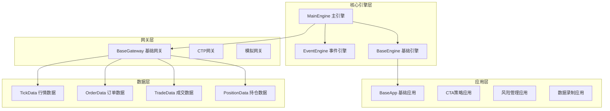
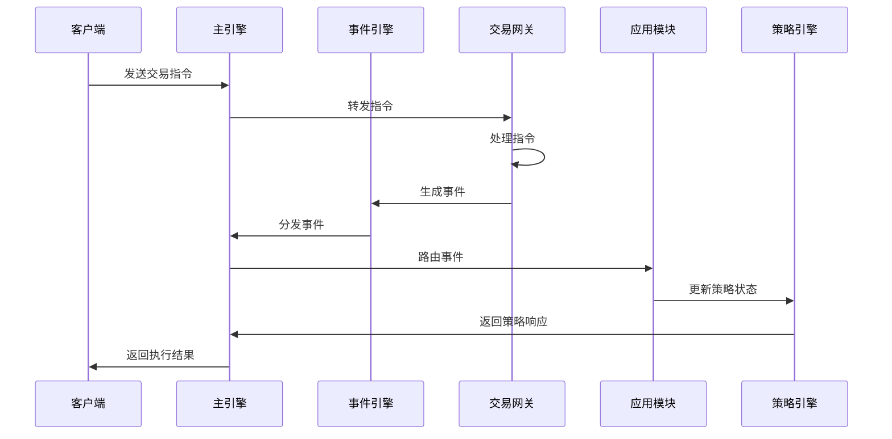
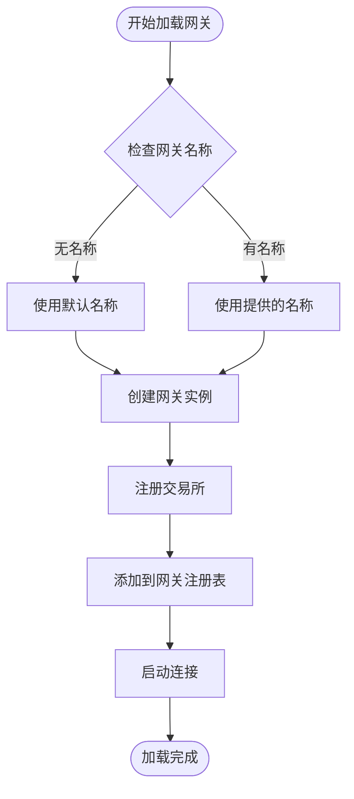
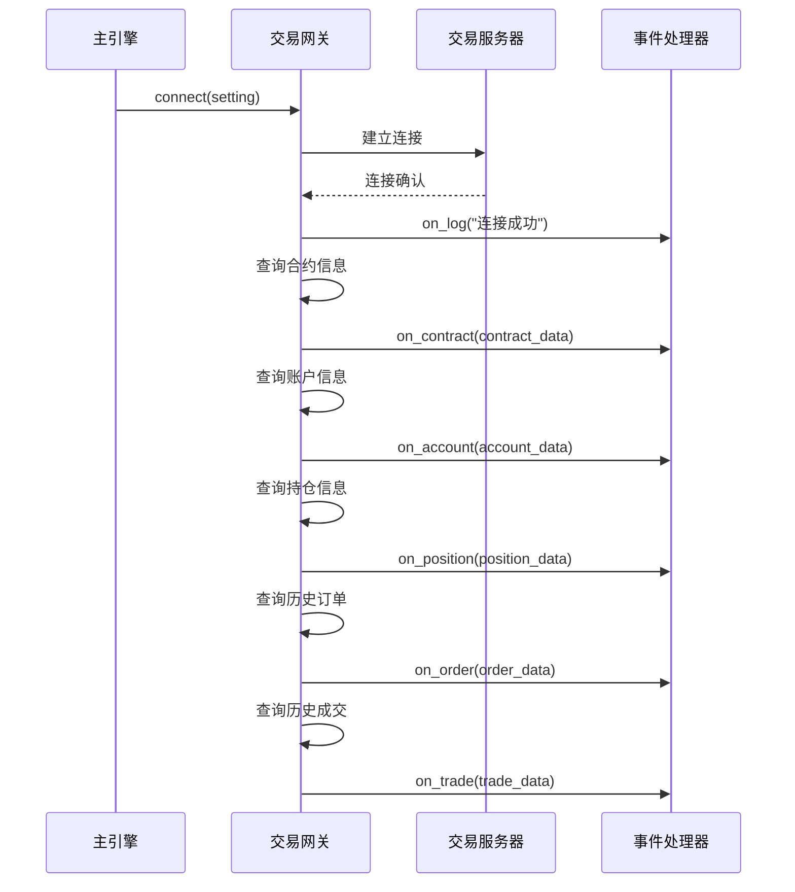
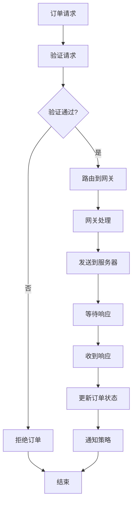
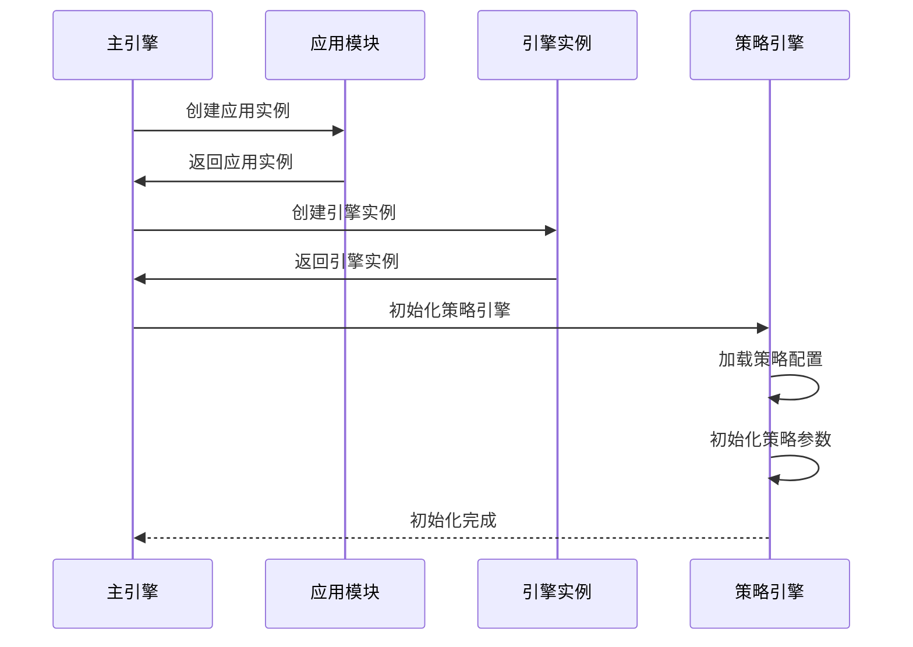
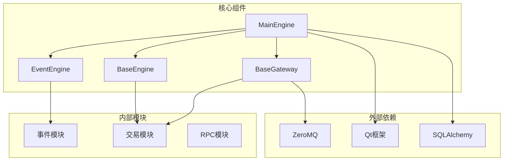

# 交易引擎

<cite>
**本文档引用的文件**
- [vnpy/trader/engine.py](file://vnpy/trader/engine.py)
- [vnpy/trader/gateway.py](file://vnpy/trader/gateway.py)
- [vnpy/trader/app.py](file://vnpy/trader/app.py)
- [vnpy/trader/object.py](file://vnpy/trader/object.py)
- [vnpy/trader/event.py](file://vnpy/trader/event.py)
- [vnpy/event/engine.py](file://vnpy/event/engine.py)
- [examples/no_ui/run.py](file://examples/no_ui/run.py)
- [examples/data_recorder/data_recorder.py](file://examples/data_recorder/data_recorder.py)
</cite>

## 目录
1. [简介](#简介)
2. [项目结构](#项目结构)
3. [核心组件](#核心组件)
4. [架构概览](#架构概览)
5. [详细组件分析](#详细组件分析)
6. [依赖关系分析](#依赖关系分析)
7. [性能考虑](#性能考虑)
8. [故障排除指南](#故障排除指南)
9. [结论](#结论)

## 简介

VeighNa交易引擎是一个高度模块化的交易系统核心，作为整个交易平台的中枢，负责协调各个子引擎、交易网关和应用模块。该引擎采用事件驱动架构，支持多网关连接、策略管理和实时数据处理，为量化交易提供了完整的基础设施。

主要特点：
- **事件驱动架构**: 基于发布-订阅模式的异步事件处理
- **模块化设计**: 支持插件式应用模块和网关扩展
- **高性能并发**: 优化的多线程处理能力
- **灵活配置**: 支持多种交易接口和策略引擎
- **完整生命周期**: 从初始化到优雅关闭的全流程管理

## 项目结构



**图表来源**
- [vnpy/trader/engine.py](file://vnpy/trader/engine.py#L67-L110)
- [vnpy/trader/gateway.py](file://vnpy/trader/gateway.py#L25-L50)

**章节来源**
- [vnpy/trader/engine.py](file://vnpy/trader/engine.py#L1-L620)
- [vnpy/trader/gateway.py](file://vnpy/trader/gateway.py#L1-L273)

## 核心组件

### MainEngine 主引擎

MainEngine是整个交易系统的核心，负责协调各个组件的工作。它维护着所有网关、引擎和应用模块的实例，并提供统一的接口供外部调用。

```python
class MainEngine:
    """
    Acts as the core of the trading platform.
    """
    
    def __init__(self, event_engine: EventEngine | None = None) -> None:
        if event_engine:
            self.event_engine: EventEngine = event_engine
        else:
            self.event_engine = EventEngine()
        self.event_engine.start()

        self.gateways: dict[str, BaseGateway] = {}
        self.engines: dict[str, BaseEngine] = {}
        self.apps: dict[str, BaseApp] = {}
        self.exchanges: list[Exchange] = []
```

主要功能：
- **组件管理**: 管理所有网关、引擎和应用模块的生命周期
- **事件分发**: 通过EventEngine进行事件的统一分发
- **数据聚合**: 收集和整合来自不同源的数据
- **接口暴露**: 提供统一的交易和查询接口

### EventEngine 事件引擎

EventEngine实现了事件驱动架构的核心，负责事件的队列管理、分发和处理。

```python
class EventEngine:
    """
    Implements event-driven architecture core.
    """
    
    def __init__(self) -> None:
        self._queue: Queue = Queue()
        self._active: bool = False
        self._thread: Thread = Thread(target=self._run)
        
    def put(self, event: Event) -> None:
        """Put event into queue."""
        self._queue.put(event)
        
    def register(self, type: str, handler: Callable) -> None:
        """Register event handler."""
        handlers: list = self._handlers[type]
        if handler not in handlers:
            handlers.append(handler)
```

### BaseEngine 基础引擎

BaseEngine是所有功能引擎的抽象基类，定义了引擎的基本接口和行为规范。

```python
class BaseEngine(ABC):
    """
    Abstract class for implementing a function engine.
    """
    
    @abstractmethod
    def __init__(
        self,
        main_engine: "MainEngine",
        event_engine: EventEngine,
        engine_name: str,
    ) -> None:
        self.main_engine: MainEngine = main_engine
        self.event_engine: EventEngine = event_engine
        self.engine_name: str = engine_name
```

**章节来源**
- [vnpy/trader/engine.py](file://vnpy/trader/engine.py#L67-L110)
- [vnpy/event/engine.py](file://vnpy/event/engine.py#L1-L100)

## 架构概览



**图表来源**
- [vnpy/trader/engine.py](file://vnpy/trader/engine.py#L220-L250)
- [vnpy/trader/gateway.py](file://vnpy/trader/gateway.py#L100-L150)

系统采用分层架构设计：

1. **表示层**: 用户界面和交互组件
2. **业务逻辑层**: MainEngine和各种功能引擎
3. **数据访问层**: 网关和数据源连接
4. **数据存储层**: 内存缓存和持久化存储

## 详细组件分析

### 网关管理机制

#### 动态加载机制



**图表来源**
- [vnpy/trader/engine.py](file://vnpy/trader/engine.py#L100-L130)

网关的动态加载过程包括以下步骤：

```python
def add_gateway(self, gateway_class: type[BaseGateway], gateway_name: str = "") -> BaseGateway:
    """
    Add gateway.
    """
    # Use default name if gateway_name not passed
    if not gateway_name:
        gateway_name = gateway_class.default_name

    gateway: BaseGateway = gateway_class(self.event_engine, gateway_name)
    self.gateways[gateway_name] = gateway

    # Add gateway supported exchanges into engine
    for exchange in gateway.exchanges:
        if exchange not in self.exchanges:
            self.exchanges.append(exchange)

    return gateway
```

#### 连接管理流程



**图表来源**
- [vnpy/trader/gateway.py](file://vnpy/trader/gateway.py#L150-L200)

### 命令路由逻辑

#### 订单指令流转

订单指令从发出到网关的完整流转过程：



**图表来源**
- [vnpy/trader/engine.py](file://vnpy/trader/engine.py#L220-L250)

#### 发送订单的实现

```python
def send_order(self, req: OrderRequest, gateway_name: str) -> str:
    """
    Send new order request to a specific gateway.
    """
    gateway: BaseGateway | None = self.get_gateway(gateway_name)
    if gateway:
        return gateway.send_order(req)
    else:
        return ""
```

### 应用模块注册与启动

#### 注册流程



**图表来源**
- [vnpy/trader/engine.py](file://vnpy/trader/engine.py#L130-L150)

#### 启动过程

应用模块的启动遵循严格的生命周期管理：

```python
def add_app(self, app_class: type[BaseApp]) -> BaseEngine:
    """
    Add app.
    """
    app: BaseApp = app_class()
    self.apps[app.app_name] = app

    engine: BaseEngine = self.add_engine(app.engine_class)
    return engine
```

### 自定义引擎扩展指南

#### 新增子引擎的集成方法

要创建新的子引擎，需要继承BaseEngine并实现必要的方法：

```python
class CustomEngine(BaseEngine):
    """
    自定义功能引擎
    """
    
    def __init__(self, main_engine: MainEngine, event_engine: EventEngine) -> None:
        super().__init__(main_engine, event_engine, "custom")
        
        self.register_event()
        
    def register_event(self) -> None:
        """注册事件处理器"""
        self.event_engine.register(EVENT_CUSTOM, self.process_custom_event)
        
    def process_custom_event(self, event: Event) -> None:
        """处理自定义事件"""
        # 实现事件处理逻辑
        pass
```

#### 生命周期管理

引擎的生命周期包括以下阶段：

1. **初始化阶段**: 创建引擎实例，注册事件处理器
2. **运行阶段**: 处理事件，执行业务逻辑
3. **关闭阶段**: 清理资源，保存状态

```python
class BaseEngine(ABC):
    """
    Abstract class for implementing a function engine.
    """
    
    def close(self) -> None:
        """Close engine and clean up resources."""
        return
```

**章节来源**
- [vnpy/trader/engine.py](file://vnpy/trader/engine.py#L130-L200)
- [vnpy/trader/gateway.py](file://vnpy/trader/gateway.py#L100-L200)

## 依赖关系分析



**图表来源**
- [vnpy/trader/engine.py](file://vnpy/trader/engine.py#L1-L30)

### 组件耦合度分析

系统采用松耦合设计，主要体现在：

1. **接口隔离**: 不同组件通过抽象接口通信
2. **依赖注入**: 通过构造函数传递依赖
3. **事件解耦**: 基于事件的异步通信机制
4. **插件化**: 支持动态加载和卸载组件

### 循环依赖处理

系统通过以下方式避免循环依赖：

- **单向依赖**: 明确定义组件间的依赖方向
- **接口抽象**: 使用接口而非具体实现
- **事件驱动**: 减少直接调用关系
- **工厂模式**: 延迟实例化时机

**章节来源**
- [vnpy/trader/engine.py](file://vnpy/trader/engine.py#L1-L620)

## 性能考虑

### 高并发下单场景下的性能瓶颈

在高并发下单场景下，系统可能面临以下性能瓶颈：

1. **网络延迟**: 交易服务器响应时间
2. **内存竞争**: 多线程同时访问共享数据
3. **事件处理**: 事件队列积压
4. **数据库写入**: 批量数据持久化

### 优化策略

#### 1. 异步处理优化

```python
class OptimizedEventEngine(EventEngine):
    """
    优化的事件引擎
    """
    
    def __init__(self) -> None:
        super().__init__()
        self._batch_size: int = 100
        self._batch_timeout: float = 0.1
        
    def put_batch(self, events: List[Event]) -> None:
        """批量处理事件"""
        if len(events) >= self._batch_size:
            self._process_events(events)
        else:
            self._pending_events.extend(events)
            
    def _process_pending_events(self) -> None:
        """处理待处理事件"""
        if len(self._pending_events) > 0:
            self._process_events(self._pending_events)
            self._pending_events.clear()
```

#### 2. 内存池优化

```python
class MemoryPool:
    """
    对象内存池
    """
    
    def __init__(self, class_type: type, initial_size: int = 1000):
        self.class_type = class_type
        self.pool = deque(maxlen=initial_size)
        
    def get_object(self) -> Any:
        """获取对象"""
        try:
            return self.pool.popleft()
        except IndexError:
            return self.class_type()
            
    def return_object(self, obj: Any) -> None:
        """归还对象"""
        self.pool.append(obj)
```

#### 3. 批量操作优化

```python
class BatchProcessor:
    """
    批量处理器
    """
    
    def __init__(self, batch_size: int = 100, interval: float = 0.1):
        self.batch_size = batch_size
        self.interval = interval
        self.pending_items = []
        self.last_process_time = time.time()
        
    def add_item(self, item: Any) -> None:
        """添加待处理项"""
        self.pending_items.append(item)
        
        if (len(self.pending_items) >= self.batch_size or 
            time.time() - self.last_process_time > self.interval):
            self.process_batch()
            
    def process_batch(self) -> None:
        """处理批次"""
        if self.pending_items:
            self._process_items(self.pending_items)
            self.pending_items.clear()
            self.last_process_time = time.time()
```

### 性能监控指标

关键性能指标包括：

- **事件处理延迟**: 从事件产生到处理完成的时间
- **吞吐量**: 每秒处理的事件数量
- **内存使用率**: 系统内存占用情况
- **CPU利用率**: 处理器负载情况
- **网络带宽**: 网络传输效率

## 故障排除指南

### 常见问题及解决方案

#### 1. 网关连接失败

**症状**: 网关无法正常连接到交易服务器

**排查步骤**:
```python
# 检查网关配置
gateway_setting = main_engine.get_default_setting("CTP")
print(f"网关配置: {gateway_setting}")

# 检查网络连接
try:
    # 测试网络连通性
    pass
except Exception as e:
    print(f"网络连接失败: {e}")
```

**解决方案**:
- 验证服务器地址和端口配置
- 检查防火墙设置
- 确认网络连通性
- 验证账户权限

#### 2. 事件处理异常

**症状**: 事件处理过程中出现异常

**排查步骤**:
```python
# 启用详细日志
main_engine.write_log("启用详细日志模式")

# 检查事件队列状态
queue_size = event_engine.get_queue_size()
print(f"事件队列大小: {queue_size}")

# 监控异常事件
def handle_exception(event: Event) -> None:
    if event.type == EVENT_EXCEPTION:
        print(f"异常事件: {event.data}")

event_engine.register(EVENT_EXCEPTION, handle_exception)
```

#### 3. 内存泄漏问题

**症状**: 系统内存使用持续增长

**排查步骤**:
```python
import psutil
import gc

def monitor_memory_usage():
    """监控内存使用情况"""
    process = psutil.Process()
    memory_info = process.memory_info()
    print(f"RSS: {memory_info.rss / 1024 / 1024:.2f} MB")
    print(f"VMS: {memory_info.vms / 1024 / 1024:.2f} MB")
    
    # 强制垃圾回收
    collected = gc.collect()
    print(f"回收对象: {collected}")
```

### 调试工具和技巧

#### 1. 事件追踪

```python
class EventTracer:
    """事件追踪器"""
    
    def __init__(self):
        self.event_counts = defaultdict(int)
        
    def trace_event(self, event: Event) -> None:
        """追踪事件"""
        self.event_counts[event.type] += 1
        
    def get_stats(self) -> Dict[str, int]:
        """获取统计信息"""
        return dict(self.event_counts)
```

#### 2. 性能分析

```python
import cProfile
import pstats

def profile_main_engine():
    """性能分析主引擎"""
    profiler = cProfile.Profile()
    profiler.enable()
    
    # 执行测试代码
    main_engine.run_test()
    
    profiler.disable()
    stats = pstats.Stats(profiler)
    stats.sort_stats('cumulative')
    stats.print_stats(20)
```

**章节来源**
- [vnpy/trader/engine.py](file://vnpy/trader/engine.py#L280-L330)

## 结论

VeighNa交易引擎是一个设计精良、功能完备的交易系统核心。它通过事件驱动架构实现了高度的模块化和可扩展性，支持多种交易接口和策略引擎的无缝集成。

### 主要优势

1. **架构清晰**: 分层设计使得系统易于理解和维护
2. **扩展性强**: 插件式架构支持快速添加新功能
3. **性能优异**: 优化的并发处理能力和内存管理
4. **稳定性高**: 完善的错误处理和恢复机制
5. **文档完善**: 丰富的示例和详细的API文档

### 发展方向

未来可以考虑以下改进方向：

1. **微服务架构**: 将不同组件拆分为独立的服务
2. **容器化部署**: 支持Docker和Kubernetes部署
3. **云原生支持**: 适配云平台的弹性伸缩需求
4. **AI集成**: 集成机器学习和深度学习功能
5. **多语言支持**: 提供多种编程语言的SDK

通过持续的优化和改进，VeighNa交易引擎将继续为量化交易领域提供强大而可靠的基础设施支持。