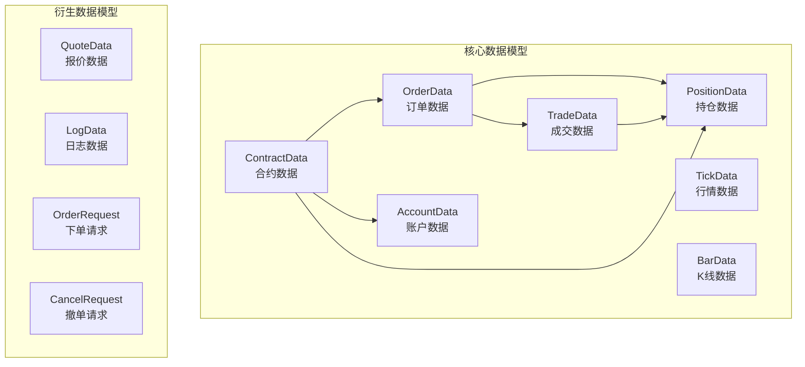
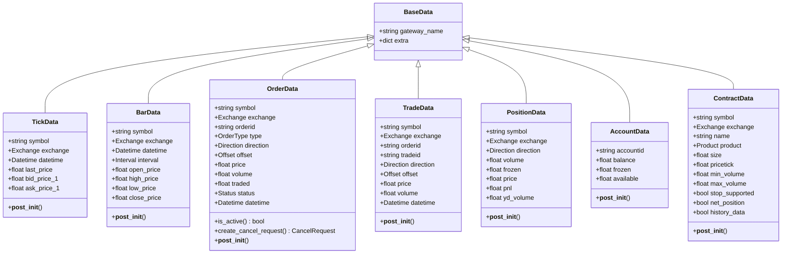
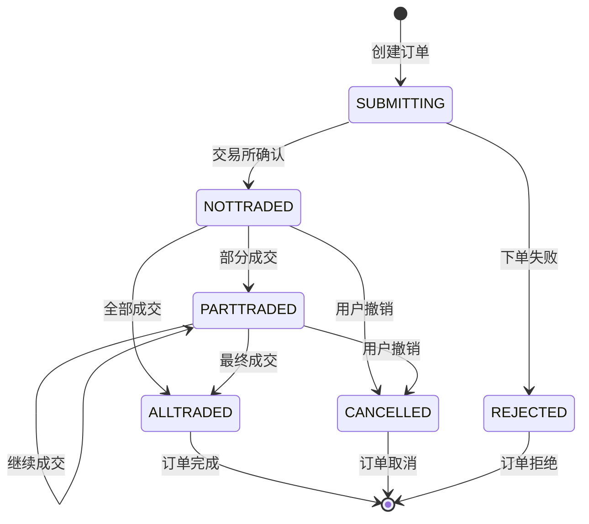
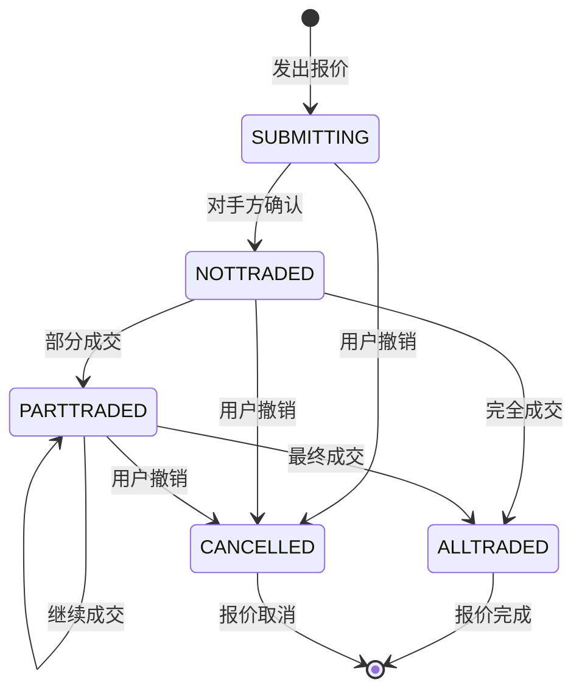
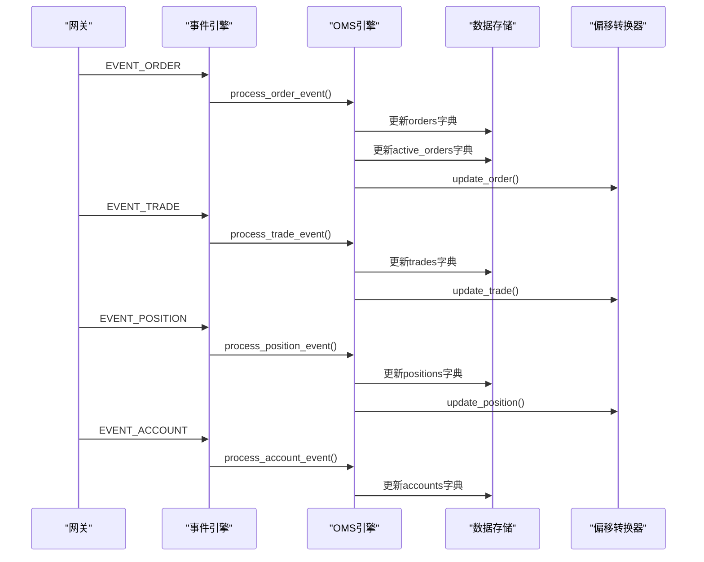
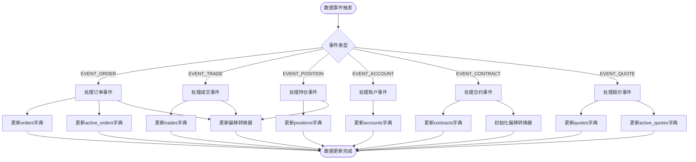
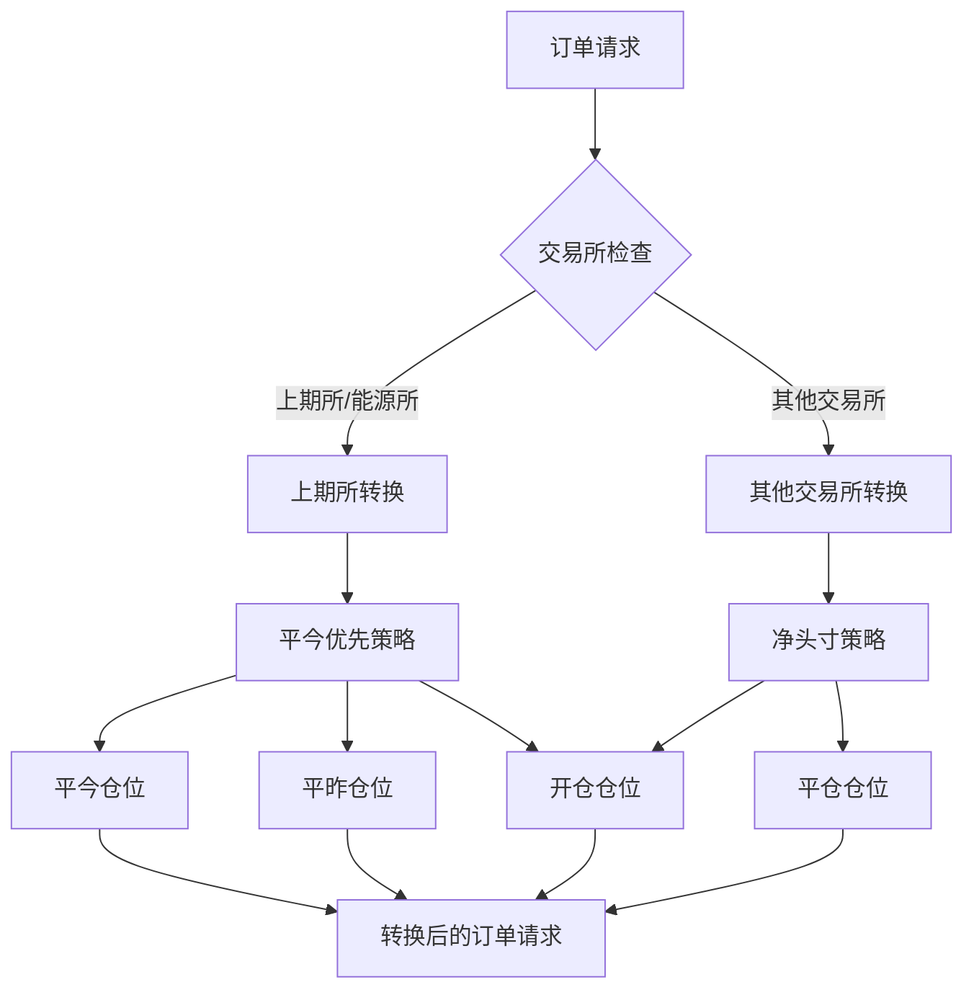

# vnpy数据模型系统化分析

<cite>
**本文档引用的文件**
- [object.py](file://vnpy/trader/object.py)
- [engine.py](file://vnpy/trader/engine.py)
- [converter.py](file://vnpy/trader/converter.py)
- [constant.py](file://vnpy/trader/constant.py)
</cite>

## 目录
1. [简介](#简介)
2. [核心数据模型概览](#核心数据模型概览)
3. [基础数据类架构](#基础数据类架构)
4. [核心交易数据模型](#核心交易数据模型)
5. [数据模型继承关系](#数据模型继承关系)
6. [状态机转换逻辑](#状态机转换逻辑)
7. [事件流与数据传播](#事件流与数据传播)
8. [序列化机制](#序列化机制)
9. [偏移量转换器](#偏移量转换器)
10. [最佳实践指南](#最佳实践指南)
11. [常见误用与调试](#常见误用与调试)
12. [总结](#总结)

## 简介

vnpy是一个功能强大的量化交易平台，其数据模型系统是整个平台的核心基础设施。本文档深入分析vnpy中定义的核心数据模型，包括OrderData、TradeData、PositionData、AccountData和ContractData等关键对象，详细说明它们的字段含义、状态机转换逻辑及业务约束，并结合事件流展示数据对象在不同交易阶段的生成、更新与传播路径。

## 核心数据模型概览

vnpy的数据模型系统围绕五个核心数据类构建，每个类都承担着特定的业务职责：



**图表来源**
- [object.py](file://vnpy/trader/object.py#L75-L272)

## 基础数据类架构

所有数据模型都继承自`BaseData`基类，该类提供了统一的网关标识和扩展字段：

```python
@dataclass
class BaseData:
    """
    Any data object needs a gateway_name as source
    and should inherit base data.
    """
    gateway_name: str
    extra: dict | None = field(default=None, init=False)
```

这种设计确保了：
- **数据溯源**：每条数据都有明确的来源网关
- **扩展性**：支持动态添加额外字段
- **统一性**：所有数据对象具有一致的基础属性

**章节来源**
- [object.py](file://vnpy/trader/object.py#L18-L25)

## 核心交易数据模型

### OrderData - 订单数据模型

`OrderData`是订单生命周期的核心数据载体，包含订单的所有关键信息：

```python
@dataclass
class OrderData(BaseData):
    symbol: str
    exchange: Exchange
    orderid: str
    
    type: OrderType = OrderType.LIMIT
    direction: Direction | None = None
    offset: Offset = Offset.NONE
    price: float = 0
    volume: float = 0
    traded: float = 0
    status: Status = Status.SUBMITTING
    datetime: Datetime | None = None
    reference: str = ""
```

#### 关键字段解析

- **symbol/exchange**：唯一标识合约
- **orderid**：订单在交易所的唯一编号
- **type**：订单类型（限价、市价等）
- **direction**：买卖方向
- **offset**：开平仓标志
- **price/volume**：价格和数量
- **traded**：已成交数量
- **status**：订单状态
- **reference**：参考信息

#### 自动生成字段

```python
def __post_init__(self) -> None:
    self.vt_symbol: str = f"{self.symbol}.{self.exchange.value}"
    self.vt_orderid: str = f"{self.gateway_name}.{self.orderid}"
```

这些字段通过Python的`__post_init__`方法自动计算，确保数据一致性。

**章节来源**
- [object.py](file://vnpy/trader/object.py#L75-L119)

### TradeData - 成交数据模型

`TradeData`记录订单执行的每一个细节：

```python
@dataclass
class TradeData(BaseData):
    symbol: str
    exchange: Exchange
    orderid: str
    tradeid: str
    direction: Direction | None = None
    offset: Offset = Offset.NONE
    price: float = 0
    volume: float = 0
    datetime: Datetime | None = None
```

#### 业务约束

- 每个订单可以有多个成交记录
- 成交数据不可修改，只能追加
- vt_tradeid由网关名和交易所ID组成

**章节来源**
- [object.py](file://vnpy/trader/object.py#L121-L168)

### PositionData - 持仓数据模型

`PositionData`跟踪每个持仓头寸的详细信息：

```python
@dataclass
class PositionData(BaseData):
    symbol: str
    exchange: Exchange
    direction: Direction
    
    volume: float = 0
    frozen: float = 0
    price: float = 0
    pnl: float = 0
    yd_volume: float = 0
```

#### 分层持仓管理

```python
def __post_init__(self) -> None:
    self.vt_symbol: str = f"{self.symbol}.{self.exchange.value}"
    self.vt_positionid: str = f"{self.gateway_name}.{self.vt_symbol}.{self.direction.value}"
```

- **volume**：总持仓量
- **yd_volume**：昨日持仓量
- **td_volume**：今日持仓量（通过yesterday - today计算）
- **frozen**：冻结数量（不能平仓的数量）

**章节来源**
- [object.py](file://vnpy/trader/object.py#L170-L200)

### AccountData - 账户数据模型

`AccountData`管理账户资金信息：

```python
@dataclass
class AccountData(BaseData):
    accountid: str
    balance: float = 0
    frozen: float = 0
    
    def __post_init__(self) -> None:
        self.available: float = self.balance - self.frozen
        self.vt_accountid: str = f"{self.gateway_name}.{self.accountid}"
```

#### 资金管理约束

- **balance**：账户总余额
- **frozen**：冻结资金（不能使用的金额）
- **available**：可用资金（实时计算得出）

**章节来源**
- [object.py](file://vnpy/trader/object.py#L202-L224)

### ContractData - 合约数据模型

`ContractData`包含所有合约的基本信息：

```python
@dataclass
class ContractData(BaseData):
    symbol: str
    exchange: Exchange
    name: str
    product: Product
    size: float
    pricetick: float
    
    min_volume: float = 1
    max_volume: float | None = None
    stop_supported: bool = False
    net_position: bool = False
    history_data: bool = False
```

#### 期权合约特殊字段

```python
option_strike: float | None = None
option_underlying: str | None = None
option_type: OptionType | None = None
option_listed: Datetime | None = None
option_expiry: Datetime | None = None
option_portfolio: str | None = None
option_index: str | None = None
```

**章节来源**
- [object.py](file://vnpy/trader/object.py#L226-L272)

## 数据模型继承关系



**图表来源**
- [object.py](file://vnpy/trader/object.py#L18-L272)

## 状态机转换逻辑

### OrderData状态机



**图表来源**
- [object.py](file://vnpy/trader/object.py#L105-L119)
- [constant.py](file://vnpy/trader/constant.py#L28-L36)

### QuoteData状态机



**图表来源**
- [object.py](file://vnpy/trader/object.py#L274-L318)

### ACTIVE_STATUSES集合

```python
ACTIVE_STATUSES = set([Status.SUBMITTING, Status.NOTTRADED, Status.PARTTRADED])
```

这个集合用于判断订单是否处于活跃状态，决定是否保留在`active_orders`字典中。

**章节来源**
- [object.py](file://vnpy/trader/object.py#L15-L16)

## 事件流与数据传播

### OMS引擎数据处理流程



**图表来源**
- [engine.py](file://vnpy/trader/engine.py#L368-L403)

### 数据传播路径



**图表来源**
- [engine.py](file://vnpy/trader/engine.py#L368-L450)

**章节来源**
- [engine.py](file://vnpy/trader/engine.py#L368-L450)

## 序列化机制

### 自动生成字段

所有数据模型都使用Python的`dataclasses`装饰器，通过`__post_init__`方法实现字段的自动计算：

```python
def __post_init__(self) -> None:
    self.vt_symbol: str = f"{self.symbol}.{self.exchange.value}"
    self.vt_orderid: str = f"{self.gateway_name}.{self.orderid}"
    self.vt_tradeid: str = f"{self.gateway_name}.{self.tradeid}"
    self.vt_positionid: str = f"{self.gateway_name}.{self.vt_symbol}.{self.direction.value}"
    self.vt_accountid: str = f"{self.gateway_name}.{self.accountid}"
    self.vt_quoteid: str = f"{self.gateway_name}.{self.quoteid}"
```

### 字段命名规范

- **vt_symbol**：虚拟符号，格式为`symbol.exchange`
- **vt_orderid**：虚拟订单ID，格式为`gateway_name.orderid`
- **vt_tradeid**：虚拟成交ID
- **vt_positionid**：虚拟持仓ID
- **vt_accountid**：虚拟账户ID
- **vt_quoteid**：虚拟报价ID

### 不可变字段设计

- **symbol/exchange**：合约标识符，一旦创建不可更改
- **orderid/tradeid**：交易标识符，具有唯一性和不可变性
- **gateway_name**：数据来源网关，确保数据溯源

**章节来源**
- [object.py](file://vnpy/trader/object.py#L95-L230)

## 偏移量转换器

### PositionHolding - 持仓持有者

`PositionHolding`类负责管理单个合约的持仓状态和偏移量转换：

```python
class PositionHolding:
    def __init__(self, contract: ContractData) -> None:
        self.vt_symbol: str = contract.vt_symbol
        self.exchange: Exchange = contract.exchange
        
        # 持仓分层管理
        self.long_pos: float = 0
        self.long_yd: float = 0
        self.long_td: float = 0
        
        self.short_pos: float = 0
        self.short_yd: float = 0
        self.short_td: float = 0
        
        # 冻结数量管理
        self.long_pos_frozen: float = 0
        self.long_yd_frozen: float = 0
        self.long_td_frozen: float = 0
        
        self.short_pos_frozen: float = 0
        self.short_yd_frozen: float = 0
        self.short_td_frozen: float = 0
```

### 偏移量转换策略



**图表来源**
- [converter.py](file://vnpy/trader/converter.py#L200-L402)

### 转换算法实现

#### 上期所特殊处理

```python
def convert_order_request_shfe(self, req: OrderRequest) -> list[OrderRequest]:
    if req.offset == Offset.OPEN:
        return [req]
    
    if req.direction == Direction.LONG:
        pos_available: float = self.short_pos - self.short_pos_frozen
        td_available: float = self.short_td - self.short_td_frozen
    else:
        pos_available = self.long_pos - self.long_pos_frozen
        td_available = self.long_td - self.long_td_frozen
    
    if req.volume > pos_available:
        return []
    elif req.volume <= td_available:
        req_td: OrderRequest = copy(req)
        req_td.offset = Offset.CLOSETODAY
        return [req_td]
    else:
        # 混合平今和平昨
        req_list: list[OrderRequest] = []
        
        if td_available > 0:
            req_td = copy(req)
            req_td.offset = Offset.CLOSETODAY
            req_td.volume = td_available
            req_list.append(req_td)
        
        req_yd: OrderRequest = copy(req)
        req_yd.offset = Offset.CLOSEYESTERDAY
        req_yd.volume = req.volume - td_available
        req_list.append(req_yd)
        
        return req_list
```

#### 净头寸模式

```python
def convert_order_request_net(self, req: OrderRequest) -> list[OrderRequest]:
    if req.direction == Direction.LONG:
        pos_available: float = self.short_pos - self.short_pos_frozen
        td_available: float = self.short_td - self.short_td_frozen
        yd_available: float = self.short_yd - self.short_yd_frozen
    else:
        pos_available = self.long_pos - self.long_pos_frozen
        td_available = self.long_td - self.long_td_frozen
        yd_available = self.long_yd - self.long_yd_frozen
    
    # 分配到不同仓位
    reqs: list[OrderRequest] = []
    volume_left: float = req.volume
    
    if td_available:
        td_volume: float = min(td_available, volume_left)
        volume_left -= td_volume
        
        td_req: OrderRequest = copy(req)
        td_req.offset = Offset.CLOSETODAY
        td_req.volume = td_volume
        reqs.append(td_req)
    
    if volume_left and yd_available:
        yd_volume: float = min(yd_available, volume_left)
        volume_left -= yd_volume
        
        yd_req: OrderRequest = copy(req)
        yd_req.offset = Offset.CLOSEYESTERDAY
        yd_req.volume = yd_volume
        reqs.append(yd_req)
    
    if volume_left > 0:
        open_volume: float = volume_left
        
        open_req: OrderRequest = copy(req)
        open_req.offset = Offset.OPEN
        open_req.volume = open_volume
        reqs.append(open_req)
    
    return reqs
```

**章节来源**
- [converter.py](file://vnpy/trader/converter.py#L200-L402)

## 最佳实践指南

### 1. 安全访问数据对象

#### 使用只读访问器

```python
# 推荐：通过引擎提供的只读接口访问数据
order = main_engine.get_order(vt_orderid)
position = main_engine.get_position(vt_positionid)
account = main_engine.get_account(vt_accountid)

# 避免：直接修改数据对象
# 错误示例：order.price = new_price  # 不要直接修改
```

#### 检查数据有效性

```python
def safe_get_order(main_engine: MainEngine, vt_orderid: str) -> OrderData | None:
    order = main_engine.get_order(vt_orderid)
    if order and order.is_active():
        return order
    return None
```

### 2. 正确处理状态变化

#### 订单状态检查

```python
def handle_order_update(order: OrderData) -> None:
    if order.status == Status.ALLTRADED:
        # 处理完全成交
        process_filled_order(order)
    elif order.status == Status.CANCELLED:
        # 处理撤销订单
        process_cancelled_order(order)
    elif order.status == Status.REJECTED:
        # 处理被拒绝订单
        process_rejected_order(order)
```

#### 活跃订单过滤

```python
def get_active_orders(main_engine: MainEngine) -> list[OrderData]:
    orders = main_engine.get_all_orders()
    return [order for order in orders if order.is_active()]
```

### 3. 策略开发中的数据使用

#### 使用数据副本进行计算

```python
def calculate_pnl(strategy: BaseStrategy, position: PositionData) -> float:
    # 获取数据副本进行计算
    position_copy = copy.deepcopy(position)
    # 执行复杂的PNL计算
    return calculate_position_pnl(position_copy)
```

#### 事件驱动的数据更新

```python
def on_position_event(self, event: Event) -> None:
    position: PositionData = event.data
    # 只在持仓发生变化时才重新计算
    if position.volume != self.last_position_volume:
        self.recalculate_position_metrics(position)
```

### 4. 数据验证和约束检查

#### 合约参数验证

```python
def validate_contract(contract: ContractData) -> bool:
    if contract.min_volume <= 0:
        raise ValueError(f"最小交易量必须大于0: {contract.min_volume}")
    
    if contract.pricetick <= 0:
        raise ValueError(f"价格跳动必须大于0: {contract.pricetick}")
    
    if contract.size <= 0:
        raise ValueError(f"合约乘数必须大于0: {contract.size}")
    
    return True
```

#### 资金约束检查

```python
def check_funding_constraints(account: AccountData, required_amount: float) -> bool:
    if required_amount > account.available:
        logger.warning(f"资金不足: 需要 {required_amount}, 可用 {account.available}")
        return False
    return True
```

## 常见误用与调试

### 1. 直接修改不可变字段

#### 问题描述

```python
# 错误示例：直接修改vt_symbol
order.vt_symbol = "new.symbol.SSE"  # 这会导致数据不一致

# 错误示例：直接修改订单状态
order.status = Status.ALLTRADED  # 状态应该通过事件更新
```

#### 解决方案

```python
# 正确做法：通过事件引擎发送新的订单数据
new_order = OrderData(
    symbol=order.symbol,
    exchange=order.exchange,
    orderid=order.orderid,
    status=Status.ALLTRADED,
    gateway_name=order.gateway_name
)
event = Event(EVENT_ORDER, new_order)
event_engine.put(event)
```

### 2. 忽略数据同步问题

#### 问题场景

```python
# 错误示例：同时访问多个相关数据对象
order = main_engine.get_order(vt_orderid)
position = main_engine.get_position(vt_positionid)
# 在这之间可能发生数据不一致
```

#### 解决方案

```python
# 使用事务性操作或事件监听
class DataSynchronizer:
    def __init__(self):
        self.pending_updates = {}
    
    def on_order_update(self, event: Event) -> None:
        order = event.data
        self.pending_updates[order.vt_orderid] = order
        
        # 等待相关持仓数据更新
        if self.all_related_data_ready(order):
            self.process_synchronized_update()
```

### 3. 忽略偏移量转换

#### 问题描述

```python
# 错误示例：直接发送平仓请求而不考虑交易所规则
req = OrderRequest(
    symbol=symbol,
    exchange=exchange,
    direction=Direction.SHORT,
    type=OrderType.LIMIT,
    volume=10,
    price=price,
    offset=Offset.CLOSE  # 没有考虑交易所特殊规则
)
```

#### 解决方案

```python
# 正确做法：使用偏移转换器
converter = main_engine.get_converter(gateway_name)
converted_requests = converter.convert_order_request(
    req, 
    lock=False,  # 或根据需要设置
    net=True
)

for converted_req in converted_requests:
    main_engine.send_order(converted_req, gateway_name)
```

### 4. 性能问题

#### 问题场景

```python
# 错误示例：频繁查询活跃订单
def inefficient_check():
    for i in range(1000):
        orders = main_engine.get_all_active_orders()  # 每次都重新查询
```

#### 解决方案

```python
# 正确做法：缓存结果并定期更新
class ActiveOrderCache:
    def __init__(self, main_engine: MainEngine):
        self.main_engine = main_engine
        self.cached_orders = []
        self.last_update_time = None
    
    def get_cached_active_orders(self) -> list[OrderData]:
        now = datetime.now()
        if not self.last_update_time or (now - self.last_update_time).seconds > 5:
            self.cached_orders = self.main_engine.get_all_active_orders()
            self.last_update_time = now
        return self.cached_orders
```

### 5. 调试工具和技巧

#### 数据完整性检查

```python
def check_data_integrity(engine: OmsEngine) -> dict:
    issues = {}
    
    # 检查订单状态一致性
    for order in engine.get_all_orders():
        if order.status in ACTIVE_STATUSES and order.vt_orderid not in engine.active_orders:
            issues[f"订单状态不一致: {order.vt_orderid}"] = order
    
    # 检查持仓冻结数量
    for position in engine.get_all_positions():
        if position.frozen > position.volume:
            issues[f"持仓冻结过多: {position.vt_positionid}"] = position
    
    return issues
```

#### 性能监控

```python
import time
from functools import wraps

def monitor_performance(func):
    @wraps(func)
    def wrapper(*args, **kwargs):
        start_time = time.time()
        result = func(*args, **kwargs)
        end_time = time.time()
        
        logger.info(f"{func.__name__} 执行时间: {end_time - start_time:.4f}秒")
        return result
    return wrapper

@monitor_performance
def get_all_orders_with_monitoring(engine: OmsEngine) -> list[OrderData]:
    return engine.get_all_orders()
```

## 总结

vnpy的数据模型系统是一个精心设计的、高度模块化的架构，它通过以下关键特性确保了系统的稳定性和可维护性：

### 核心优势

1. **类型安全**：使用Python的`dataclasses`和类型注解确保数据类型正确性
2. **状态机管理**：清晰的状态转换逻辑和约束条件
3. **事件驱动**：基于事件的数据传播机制，确保数据一致性
4. **扩展性强**：统一的基类设计支持灵活的功能扩展
5. **性能优化**：智能的缓存和索引机制提高数据访问效率

### 设计原则

- **不可变性**：核心字段设计为不可变，确保数据一致性
- **单一职责**：每个数据类专注于特定的业务领域
- **松耦合**：通过事件机制实现组件间的松耦合
- **防御性编程**：内置的验证和约束检查机制

### 应用建议

在实际应用中，开发者应该：

1. **遵循只读访问原则**：通过官方接口访问数据，避免直接修改
2. **正确处理状态变化**：理解并正确响应各种状态转换
3. **合理使用偏移转换器**：根据不同交易所规则进行适当的转换
4. **实施数据验证**：在关键业务逻辑中加入必要的验证检查
5. **关注性能影响**：避免不必要的数据查询和转换操作

通过深入理解和正确应用这些数据模型，开发者可以构建出更加稳定、高效和可靠的量化交易系统。