# vnpy核心引擎架构详解

<cite>
**本文档引用的文件**
- [vnpy/event/engine.py](file://vnpy/event/engine.py)
- [vnpy/trader/engine.py](file://vnpy/trader/engine.py)
- [vnpy/trader/object.py](file://vnpy/trader/object.py)
- [vnpy/trader/event.py](file://vnpy/trader/event.py)
- [vnpy/trader/gateway.py](file://vnpy/trader/gateway.py)
- [vnpy/trader/app.py](file://vnpy/trader/app.py)
- [vnpy/trader/constant.py](file://vnpy/trader/constant.py)
- [examples/veighna_trader/run.py](file://examples/veighna_trader/run.py)
</cite>

## 目录
1. [简介](#简介)
2. [项目结构概览](#项目结构概览)
3. [核心组件分析](#核心组件分析)
4. [事件驱动架构](#事件驱动架构)
5. [MainEngine主引擎详解](#mainengine主引擎详解)
6. [数据模型与流转](#数据模型与流转)
7. [自定义事件开发指南](#自定义事件开发指南)
8. [生命周期管理](#生命周期管理)
9. [性能优化与并发处理](#性能优化与并发处理)
10. [故障排除指南](#故障排除指南)
11. [总结](#总结)

## 简介

vnpy是一个基于Python的开源量化交易平台，其核心采用了事件驱动架构设计。本文档深入分析vnpy的核心引擎架构，重点讲解事件驱动引擎（EventEngine）与交易主引擎（MainEngine）的工作机制，包括事件分发模型、观察者模式实现以及多线程处理策略。

## 项目结构概览

vnpy项目采用模块化设计，核心组件分布在以下目录结构中：

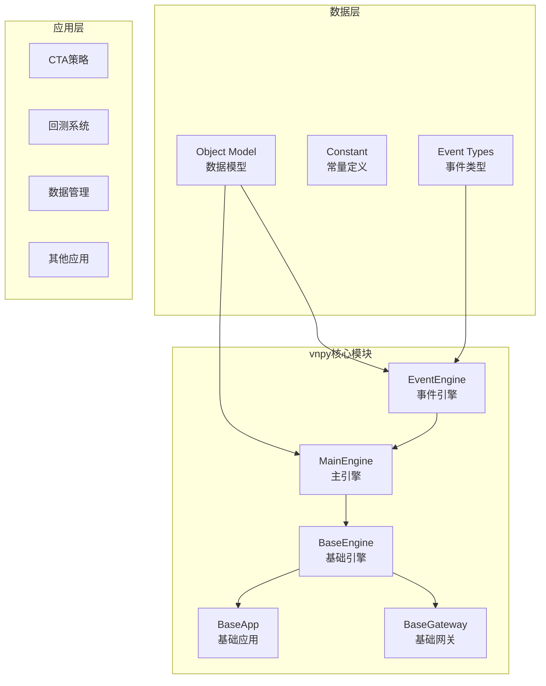

**图表来源**
- [vnpy/event/engine.py](file://vnpy/event/engine.py#L1-L146)
- [vnpy/trader/engine.py](file://vnpy/trader/engine.py#L1-L620)

## 核心组件分析

### EventEngine事件引擎

EventEngine是vnpy事件驱动架构的核心组件，实现了发布-订阅模式的事件分发机制。

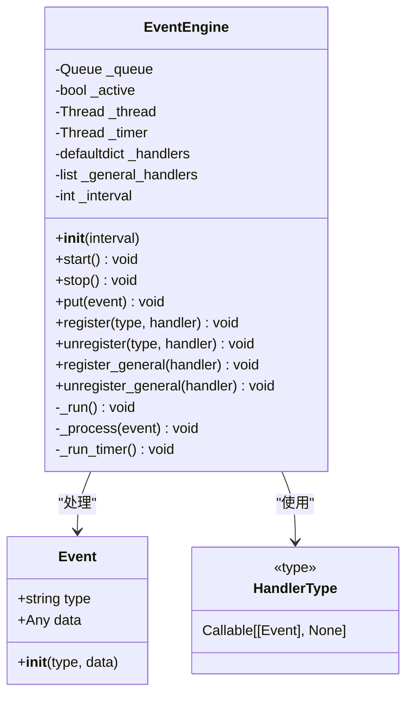

**图表来源**
- [vnpy/event/engine.py](file://vnpy/event/engine.py#L15-L146)

#### 核心特性

1. **事件队列管理**: 使用Queue实现线程安全的事件队列
2. **事件分发机制**: 支持按类型分发和通用处理器
3. **定时器事件**: 自动产生定时器事件用于周期性任务
4. **多线程支持**: 通过独立线程处理事件和定时器

**章节来源**
- [vnpy/event/engine.py](file://vnpy/event/engine.py#L1-L146)

### MainEngine主引擎

MainEngine作为整个交易平台的核心，负责协调各个子系统的工作。

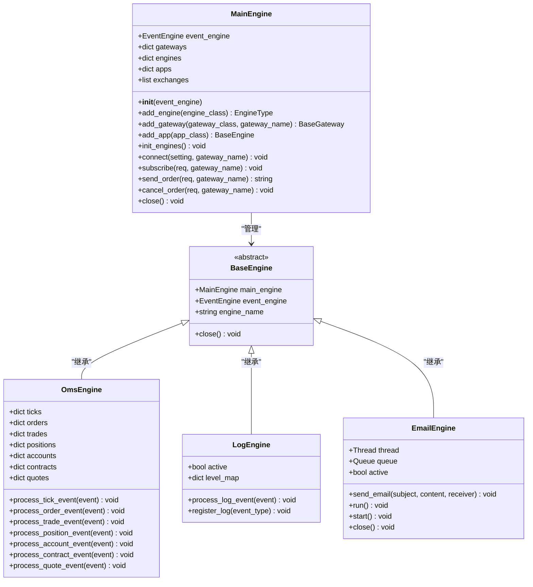

**图表来源**
- [vnpy/trader/engine.py](file://vnpy/trader/engine.py#L67-L620)

**章节来源**
- [vnpy/trader/engine.py](file://vnpy/trader/engine.py#L67-L282)

## 事件驱动架构

### 事件类型体系

vnpy定义了一套完整的事件类型体系，用于标识不同类型的交易数据：

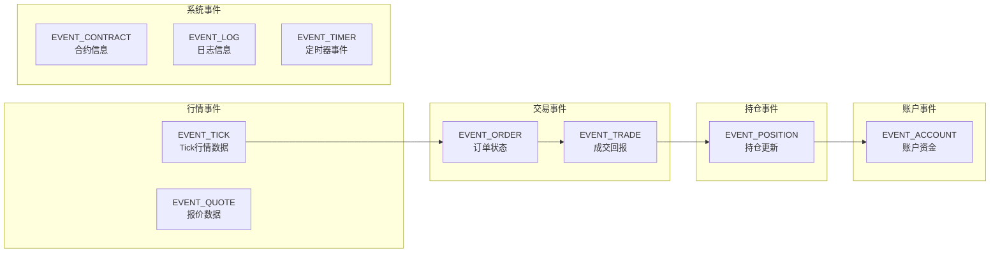

**图表来源**
- [vnpy/trader/event.py](file://vnpy/trader/event.py#L1-L15)

### 观察者模式实现

EventEngine通过观察者模式实现了松耦合的事件处理机制：

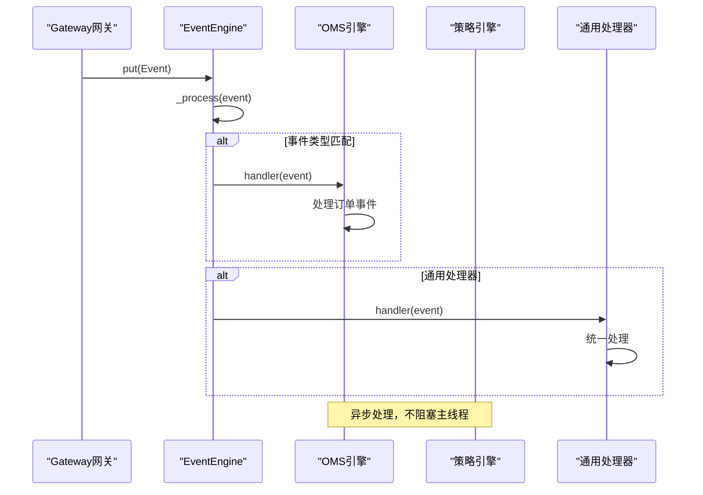

**图表来源**
- [vnpy/event/engine.py](file://vnpy/event/engine.py#L50-L70)

**章节来源**
- [vnpy/event/engine.py](file://vnpy/event/engine.py#L50-L70)
- [vnpy/trader/event.py](file://vnpy/trader/event.py#L1-L15)

## MainEngine主引擎详解

### 初始化流程

MainEngine的初始化遵循严格的生命周期管理：

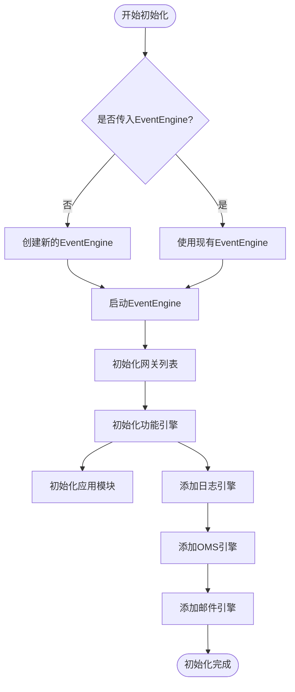

**图表来源**
- [vnpy/trader/engine.py](file://vnpy/trader/engine.py#L80-L110)

### 网关管理机制

MainEngine通过add_gateway方法管理不同的交易接口：

```python
def add_gateway(self, gateway_class: type[BaseGateway], gateway_name: str = "") -> BaseGateway:
    """
    添加网关。
    """
    # 使用默认名称如果未传递gateway_name
    if not gateway_name:
        gateway_name = gateway_class.default_name

    gateway: BaseGateway = gateway_class(self.event_engine, gateway_name)
    self.gateways[gateway_name] = gateway

    # 将网关支持的交易所添加到引擎中
    for exchange in gateway.exchanges:
        if exchange not in self.exchanges:
            self.exchanges.append(exchange)

    return gateway
```

### 应用模块集成

MainEngine通过add_app方法集成各种应用模块：

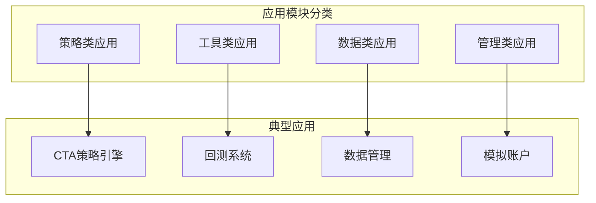

**章节来源**
- [vnpy/trader/engine.py](file://vnpy/trader/engine.py#L110-L140)
- [vnpy/trader/engine.py](file://vnpy/trader/engine.py#L140-L170)

## 数据模型与流转

### 核心数据模型

vnpy定义了一系列数据模型来表示交易过程中的各种数据：

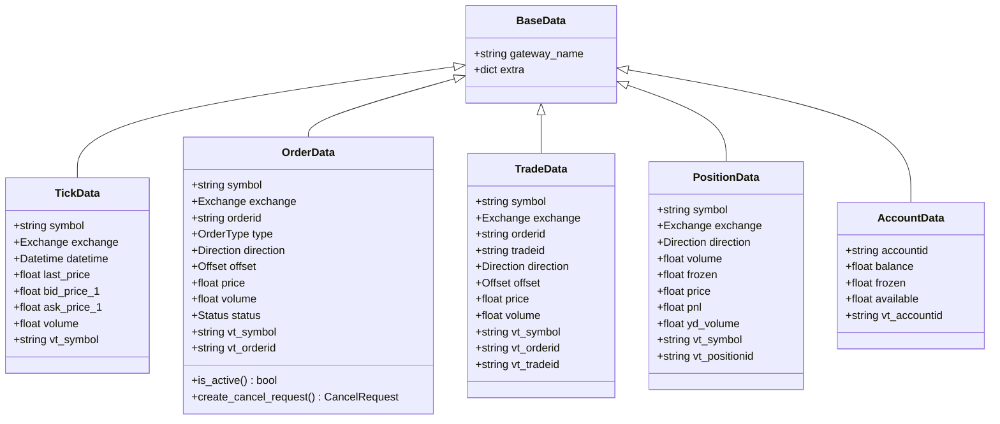

**图表来源**
- [vnpy/trader/object.py](file://vnpy/trader/object.py#L15-L428)

### 数据流转过程

交易数据在系统内的流转遵循严格的路径：

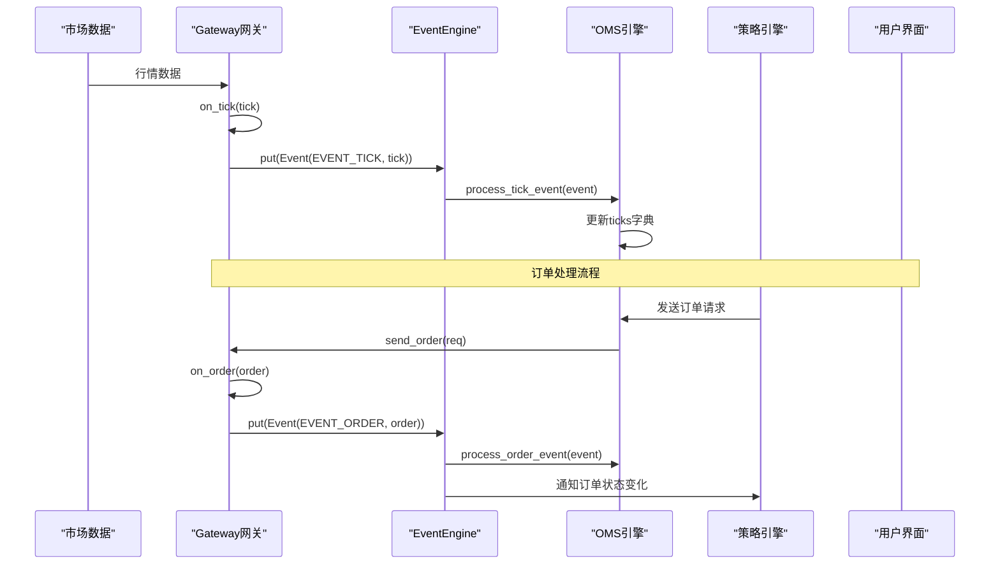

**图表来源**
- [vnpy/trader/gateway.py](file://vnpy/trader/gateway.py#L60-L120)
- [vnpy/trader/engine.py](file://vnpy/trader/engine.py#L350-L400)

**章节来源**
- [vnpy/trader/object.py](file://vnpy/trader/object.py#L15-L428)
- [vnpy/trader/gateway.py](file://vnpy/trader/gateway.py#L60-L120)

## 自定义事件开发指南

### 创建自定义事件类型

开发者可以通过扩展EventEngine来创建自定义事件类型：

```python
# 定义新的事件类型
CUSTOM_EVENT_TYPE = "eCustom."

# 创建自定义数据模型
@dataclass
class CustomData(BaseData):
    custom_field: str
    timestamp: datetime

# 注册事件处理器
def process_custom_event(self, event: Event) -> None:
    custom_data: CustomData = event.data
    # 处理自定义事件逻辑
    print(f"收到自定义事件: {custom_data.custom_field}")

# 在引擎中注册
self.event_engine.register(CUSTOM_EVENT_TYPE, self.process_custom_event)
```

### 开发自定义监听器

实现自定义监听器的最佳实践：

```python
class CustomEventListener(BaseEngine):
    def __init__(self, main_engine: MainEngine, event_engine: EventEngine) -> None:
        super().__init__(main_engine, event_engine, "custom_listener")
        
        # 注册感兴趣的事件类型
        self.register_event()
        
    def register_event(self) -> None:
        """注册事件监听"""
        self.event_engine.register(CUSTOM_EVENT_TYPE, self.process_custom_event)
        
    def process_custom_event(self, event: Event) -> None:
        """处理自定义事件"""
        custom_data: CustomData = event.data
        # 实现具体的业务逻辑
        self.handle_custom_logic(custom_data)
        
    def handle_custom_logic(self, data: CustomData) -> None:
        """处理自定义逻辑"""
        # 自定义业务逻辑实现
        pass
```

**章节来源**
- [vnpy/event/engine.py](file://vnpy/event/engine.py#L80-L120)

## 生命周期管理

### 引擎启动流程

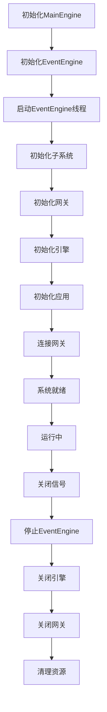

**图表来源**
- [vnpy/trader/engine.py](file://vnpy/trader/engine.py#L80-L110)
- [vnpy/trader/engine.py](file://vnpy/trader/engine.py#L270-L282)

### 资源清理机制

MainEngine提供了完善的资源清理机制：

```python
def close(self) -> None:
    """
    关闭前确保每个网关和应用都正确关闭。
    """
    # 先停止事件引擎以防止新定时器事件
    self.event_engine.stop()

    # 关闭所有引擎
    for engine in self.engines.values():
        engine.close()

    # 关闭所有网关
    for gateway in self.gateways.values():
        gateway.close()
```

**章节来源**
- [vnpy/trader/engine.py](file://vnpy/trader/engine.py#L270-L282)

## 性能优化与并发处理

### 多线程处理策略

vnpy采用多线程架构来提高系统性能：

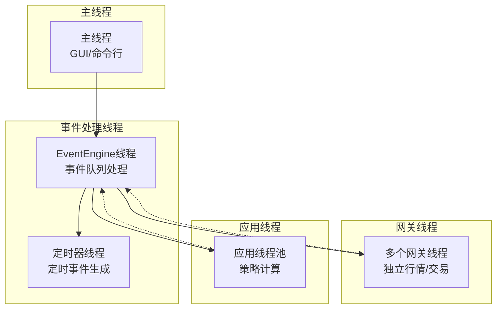

### 性能优化技巧

1. **事件批处理**: 对于高频事件，可以考虑批量处理
2. **内存管理**: 及时清理过期数据，避免内存泄漏
3. **线程池**: 使用线程池管理应用级别的并发任务
4. **异步IO**: 利用asyncio进行网络I/O优化

### 并发问题解决方案

```python
# 使用线程安全的数据结构
from threading import Lock

class ThreadSafeDataManager:
    def __init__(self):
        self.data_dict = {}
        self.lock = Lock()
    
    def update_data(self, key, value):
        with self.lock:
            self.data_dict[key] = value
    
    def get_data(self, key):
        with self.lock:
            return self.data_dict.get(key)
```

## 故障排除指南

### 常见并发问题

1. **死锁问题**: 检查EventEngine线程间的锁依赖关系
2. **竞态条件**: 确保数据访问的原子性操作
3. **内存泄漏**: 定期清理不再使用的事件处理器
4. **线程阻塞**: 监控EventEngine线程的CPU使用率

### 调试方法

```python
# 启用详细日志记录
import logging
logging.basicConfig(level=logging.DEBUG)

# 监控EventEngine状态
def debug_event_engine_status(engine: EventEngine):
    print(f"Active: {engine._active}")
    print(f"Queue size: {engine._queue.qsize()}")
    print(f"Handlers count: {len(engine._handlers)}")

# 检查引擎状态
def check_system_health(main_engine: MainEngine):
    print(f"Gateways: {len(main_engine.gateways)}")
    print(f"Engines: {len(main_engine.engines)}")
    print(f"Apps: {len(main_engine.apps)}")
```

### 错误处理机制

```python
# 事件处理器错误处理
def robust_event_handler(event: Event) -> None:
    try:
        # 处理事件的业务逻辑
        process_event(event)
    except Exception as e:
        # 记录错误并继续处理
        logger.error(f"事件处理失败: {e}", exc_info=True)
        # 可选：发送错误通知
        send_error_notification(e)
```

**章节来源**
- [vnpy/trader/engine.py](file://vnpy/trader/engine.py#L270-L282)

## 总结

vnpy的核心引擎架构展现了优秀的软件设计原则：

1. **事件驱动架构**: 通过EventEngine实现松耦合的组件通信
2. **模块化设计**: MainEngine协调各个子系统，职责清晰
3. **线程安全**: 采用Queue和Lock确保多线程环境下的数据一致性
4. **可扩展性**: 支持自定义事件类型和监听器
5. **生命周期管理**: 完善的初始化和清理机制

这种架构设计使得vnpy能够：
- 支持多种交易接口的并发接入
- 实现复杂的交易策略和风险管理
- 提供稳定可靠的量化交易平台
- 便于开发者扩展和定制功能

通过深入理解这些核心概念，开发者可以更好地利用vnpy构建自己的量化交易系统，并根据具体需求进行优化和扩展。