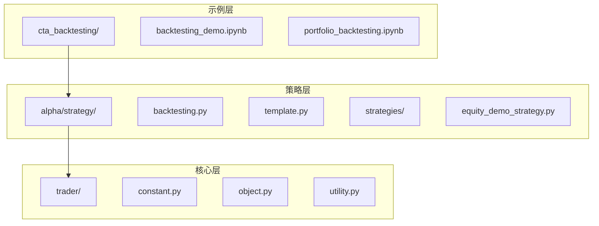
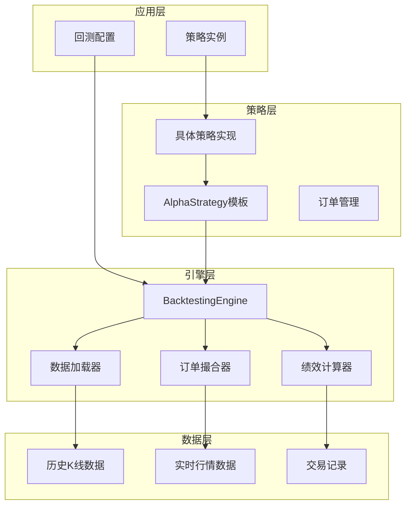
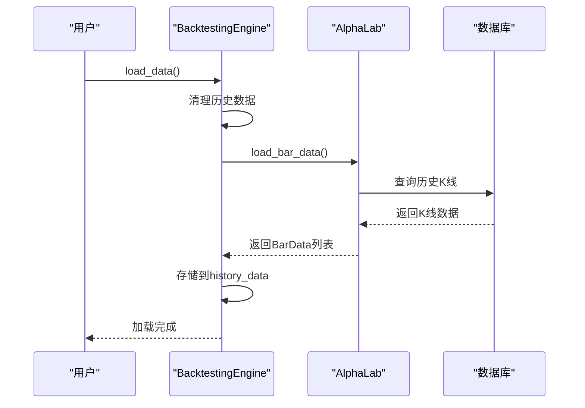
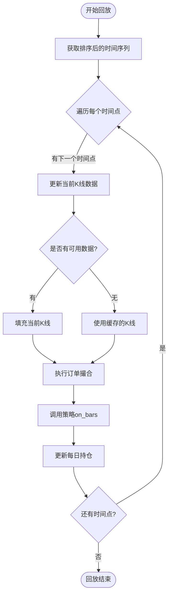
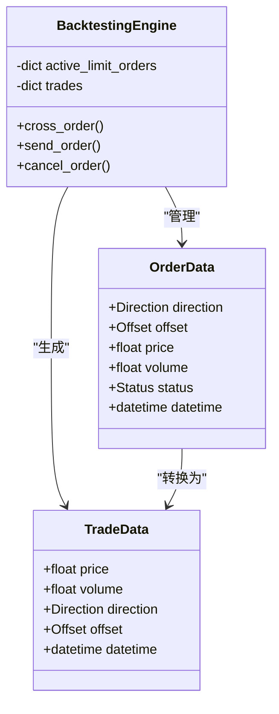
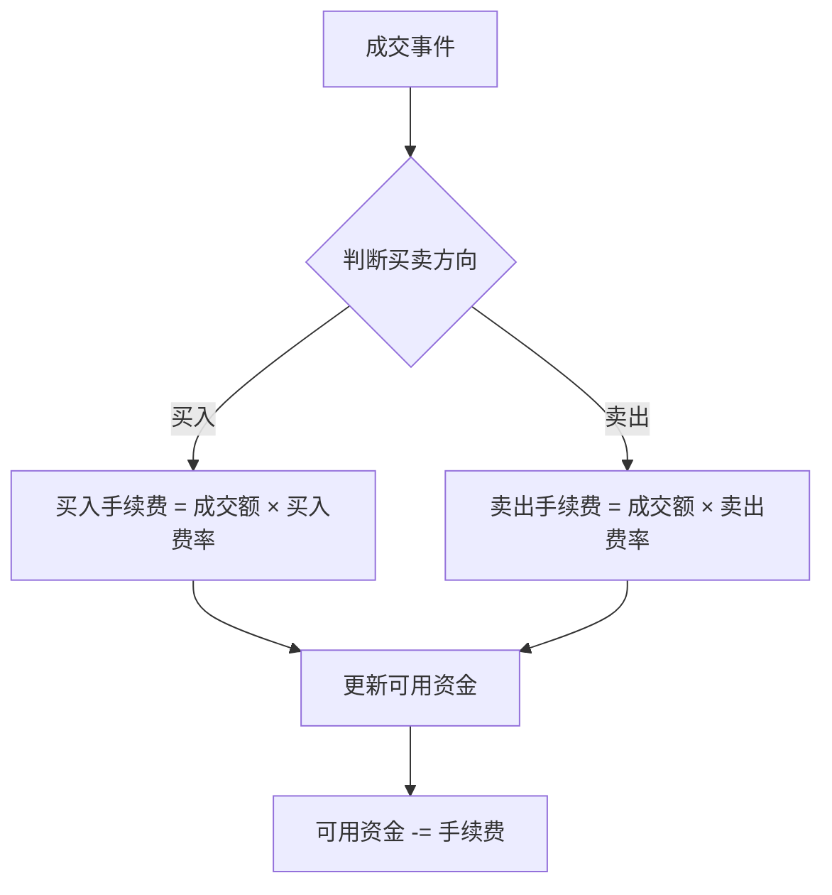
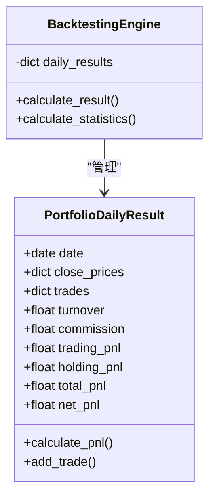
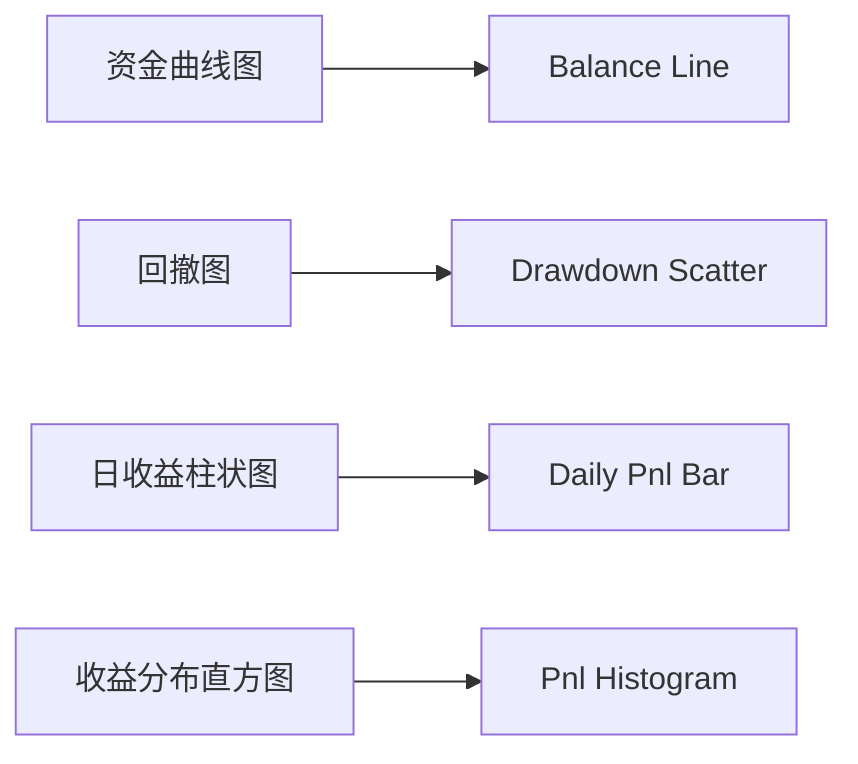
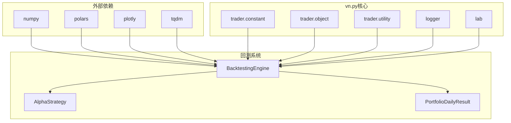

# vn.py单策略回测实现机制详解

<cite>
**本文档引用的文件**
- [backtesting_demo.ipynb](file://examples/cta_backtesting/backtesting_demo.ipynb)
- [portfolio_backtesting.ipynb](file://examples/cta_backtesting/portfolio_backtesting.ipynb)
- [backtesting.py](file://vnpy/alpha/strategy/backtesting.py)
- [template.py](file://vnpy/alpha/strategy/template.py)
- [equity_demo_strategy.py](file://vnpy/alpha/strategy/strategies/equity_demo_strategy.py)
</cite>

## 目录
1. [概述](#概述)
2. [项目结构](#项目结构)
3. [核心组件](#核心组件)
4. [架构概览](#架构概览)
5. [详细组件分析](#详细组件分析)
6. [依赖关系分析](#依赖关系分析)
7. [性能考虑](#性能考虑)
8. [故障排除指南](#故障排除指南)
9. [结论](#结论)

## 概述

vn.py的单策略回测系统是一个功能完整的量化交易回测框架，基于BacktestingEngine实现。该系统支持CTA（商品交易顾问）策略的完整回测流程，包括历史数据加载、策略执行、订单撮合、绩效分析等功能。

本系统的核心特点包括：
- 支持多种交易品种和时间周期
- 完整的交易成本建模（手续费、滑点）
- 实时订单撮合引擎
- 丰富的绩效指标计算
- 可视化图表展示

## 项目结构

vn.py回测系统的文件组织结构如下：



**图表来源**
- [backtesting_demo.ipynb](file://examples/cta_backtesting/backtesting_demo.ipynb#L1-L20)
- [backtesting.py](file://vnpy/alpha/strategy/backtesting.py#L1-L30)

**章节来源**
- [backtesting_demo.ipynb](file://examples/cta_backtesting/backtesting_demo.ipynb#L1-L50)
- [backtesting.py](file://vnpy/alpha/strategy/backtesting.py#L1-L50)

## 核心组件

### BacktestingEngine - 回测引擎

BacktestingEngine是整个回测系统的核心，负责协调各个组件的工作：

```python
class BacktestingEngine:
    """Alpha strategy backtesting engine"""
    
    def __init__(self, lab: AlphaLab) -> None:
        self.lab: AlphaLab = lab
        
        # 基础参数
        self.vt_symbols: list[str] = []
        self.start: datetime
        self.end: datetime
        
        # 合约配置
        self.long_rates: dict[str, float] = {}
        self.short_rates: dict[str, float] = {}
        self.sizes: dict[str, float] = {}
        self.priceticks: dict[str, float] = {}
        
        # 资金管理
        self.capital: float = 0
        self.cash: float = 0
        
        # 订单和交易管理
        self.limit_order_count: int = 0
        self.limit_orders: dict[str, OrderData] = {}
        self.active_limit_orders: dict[str, OrderData] = {}
        self.trades: dict[str, TradeData] = {}
```

### AlphaStrategy - 策略模板

AlphaStrategy提供了策略开发的基础框架：

```python
class AlphaStrategy:
    def __init__(self, strategy_engine: "BacktestingEngine", 
                 strategy_name: str, vt_symbols: list[str], setting: dict) -> None:
        self.strategy_engine: BacktestingEngine = strategy_engine
        self.strategy_name: str = strategy_name
        self.vt_symbols: list[str] = vt_symbols
        
        # 仓位数据字典
        self.pos_data: dict[str, float] = defaultdict(float)
        self.target_data: dict[str, float] = defaultdict(float)
        
        # 订单缓存容器
        self.orders: dict[str, OrderData] = {}
        self.active_orderids: set[str] = set()
```

**章节来源**
- [backtesting.py](file://vnpy/alpha/strategy/backtesting.py#L21-L60)
- [template.py](file://vnpy/alpha/strategy/template.py#L10-L40)

## 架构概览

vn.py回测系统采用分层架构设计，各层职责明确：



**图表来源**
- [backtesting.py](file://vnpy/alpha/strategy/backtesting.py#L21-L100)
- [template.py](file://vnpy/alpha/strategy/template.py#L10-L50)

## 详细组件分析

### 数据加载与回放机制

#### 历史数据加载



**图表来源**
- [backtesting.py](file://vnpy/alpha/strategy/backtesting.py#L90-L120)

数据加载过程的关键步骤：

1. **参数验证**：检查起始时间和结束时间的有效性
2. **数据清理**：清空之前的加载结果
3. **批量加载**：为每个交易品种并行加载历史数据
4. **数据存储**：将K线数据按时间-品种索引存储

#### Bar回放逻辑



**图表来源**
- [backtesting.py](file://vnpy/alpha/strategy/backtesting.py#L130-L165)

### 订单撮合引擎

订单撮合是回测系统的核心功能，负责模拟真实市场环境：



**图表来源**
- [backtesting.py](file://vnpy/alpha/strategy/backtesting.py#L400-L500)

#### 限价单成交判断

订单撮合的核心算法：

```python
def cross_order(self) -> None:
    """匹配限价订单"""
    for order in list(self.active_limit_orders.values()):
        bar: BarData = self.bars[order.vt_symbol]
        
        # 计算撮合价格
        long_cross_price: float = bar.low_price
        short_cross_price: float = bar.high_price
        long_best_price: float = bar.open_price
        short_best_price: float = bar.open_price
        
        # 价格限制计算
        pricetick: float = self.priceticks[order.vt_symbol]
        pre_close: float = self.pre_closes.get(order.vt_symbol, 0)
        
        limit_up: float = round_to(pre_close * 1.1, pricetick)
        limit_down: float = round_to(pre_close * 0.9, pricetick)
        
        # 判断是否成交
        long_cross: bool = (
            order.direction == Direction.LONG
            and order.price >= long_cross_price
            and long_cross_price > 0
            and bar.low_price < limit_up
        )
        
        short_cross: bool = (
            order.direction == Direction.SHORT
            and order.price <= short_cross_price
            and short_cross_price > 0
            and bar.high_price > limit_down
        )
```

### 交易成本建模

#### 手续费计算



**图表来源**
- [backtesting.py](file://vnpy/alpha/strategy/backtesting.py#L450-L500)

#### 滑点建模

滑点通过订单价格调整来模拟：

```python
def send_order(self, strategy: AlphaStrategy, vt_symbol: str, 
               direction: Direction, offset: Offset, price: float, 
               volume: float) -> list[str]:
    """发送订单"""
    # 价格调整
    price = round_to(price, self.priceticks[vt_symbol])
    
    # 根据方向调整价格
    if direction == Direction.LONG:
        price *= (1 + self.slippage)  # 买入时加滑点
    else:
        price *= (1 - self.slippage)  # 卖出时减滑点
    
    # 创建订单
    order: OrderData = OrderData(
        symbol=symbol,
        exchange=exchange,
        orderid=str(self.limit_order_count),
        direction=direction,
        offset=offset,
        price=price,
        volume=volume,
        status=Status.SUBMITTING,
        datetime=self.datetime,
        gateway_name=self.gateway_name,
    )
```

### 绩效分析系统

#### 日收益计算



**图表来源**
- [backtesting.py](file://vnpy/alpha/strategy/backtesting.py#L885-L945)

#### 关键绩效指标

系统计算以下核心指标：

1. **基础指标**
   - 总收益率 (%)
   - 年化收益率 (%)
   - 最大回撤 (金额)
   - 百分比最大回撤 (%)
   - 最长回撤天数

2. **风险指标**
   - 收益标准差 (%)
   - Sharpe比率
   - 收益回撤比

3. **交易指标**
   - 总盈亏 (元)
   - 总手续费 (元)
   - 总成交金额 (元)
   - 总成交笔数
   - 日均盈亏 (元)

**章节来源**
- [backtesting.py](file://vnpy/alpha/strategy/backtesting.py#L167-L300)
- [template.py](file://vnpy/alpha/strategy/template.py#L100-L200)

### 可视化系统

#### 图表展示



**图表来源**
- [backtesting.py](file://vnpy/alpha/strategy/backtesting.py#L350-L400)

可视化系统提供四个子图：
1. **资金曲线**：展示每日账户净值变化
2. **回撤曲线**：展示最大回撤幅度
3. **日收益**：展示每日盈亏分布
4. **收益分布**：展示收益的概率分布

**章节来源**
- [backtesting.py](file://vnpy/alpha/strategy/backtesting.py#L350-L400)

## 依赖关系分析

### 核心依赖图



**图表来源**
- [backtesting.py](file://vnpy/alpha/strategy/backtesting.py#L1-L20)

### 组件耦合度

- **低耦合**：BacktestingEngine与具体策略实现解耦
- **适配器模式**：通过AlphaStrategy模板适配不同策略
- **工厂模式**：策略实例由BacktestingEngine创建

**章节来源**
- [backtesting.py](file://vnpy/alpha/strategy/backtesting.py#L1-L30)

## 性能考虑

### 内存优化

1. **数据压缩**：使用Polars DataFrame进行高效数据处理
2. **缓存策略**：只保留当前时间点的K线数据
3. **垃圾回收**：及时清理不再需要的对象

### 计算优化

1. **向量化运算**：利用Polars的向量化特性
2. **批量处理**：一次处理多个时间点的数据
3. **延迟计算**：只在需要时才计算复杂指标

### 并发处理

虽然目前是单线程回放，但系统设计支持：
- 多品种并行数据加载
- 异步订单撮合
- 分布式结果计算

## 故障排除指南

### 常见问题及解决方案

#### 1. 数据缺失处理

**问题**：某些时间段缺少历史数据
**解决方案**：
```python
def new_bars(self, dt: datetime) -> None:
    """推送历史数据"""
    for vt_symbol in self.vt_symbols:
        bar: BarData | None = self.history_data.get((dt, vt_symbol), None)
        
        if bar:
            self.bars[vt_symbol] = bar
        elif vt_symbol in self.bars:
            # 使用缓存数据填充
            old_bar: BarData = self.bars[vt_symbol]
            
            fill_bar: BarData = BarData(
                symbol=old_bar.symbol,
                exchange=old_bar.exchange,
                datetime=dt,
                open_price=old_bar.close_price,
                high_price=old_bar.close_price,
                low_price=old_bar.close_price,
                close_price=old_bar.close_price,
                gateway_name=old_bar.gateway_name
            )
            self.bars[vt_symbol] = fill_bar
```

#### 2. 爆仓检测逻辑

```python
# 在calculate_statistics中检测爆仓
positive_balance: bool = (df["balance"] > 0).all()
if not positive_balance:
    logger.info("回测中出现爆仓（资金小于等于0），无法计算策略统计指标")
    return None
```

#### 3. 前向偏差防范

**措施**：
- 使用未来数据检查：确保策略只能访问当前及之前的数据
- 严格的时间顺序：按时间顺序回放数据
- 避免前瞻性错误：不要在策略中使用未来的市场信息

#### 4. 性能问题诊断

**监控指标**：
- 数据加载速度
- 回放进度
- 内存使用情况
- 订单撮合效率

**优化建议**：
- 增加数据预处理
- 使用更高效的数据结构
- 减少不必要的计算

**章节来源**
- [backtesting.py](file://vnpy/alpha/strategy/backtesting.py#L130-L165)
- [backtesting.py](file://vnpy/alpha/strategy/backtesting.py#L259-L293)

## 结论

vn.py的单策略回测系统是一个功能完善、设计精良的量化交易回测框架。它具有以下优势：

### 主要特点

1. **完整性**：覆盖从数据加载到绩效分析的完整流程
2. **灵活性**：支持多种交易品种和策略类型
3. **准确性**：精确模拟真实市场环境
4. **易用性**：简洁的API设计，易于上手

### 技术亮点

1. **模块化设计**：清晰的分层架构，便于维护和扩展
2. **高性能**：利用现代Python库实现高效计算
3. **可视化**：丰富的图表展示，直观的分析结果
4. **可扩展性**：良好的接口设计，支持自定义策略

### 应用场景

- **策略开发**：快速验证新策略的可行性
- **参数优化**：系统化地寻找最优参数组合
- **风险评估**：全面评估策略的风险特征
- **教育培训**：量化交易知识的学习和实践

通过深入理解vn.py回测系统的设计原理和实现细节，用户可以更好地利用这一强大工具进行量化交易研究和策略开发。