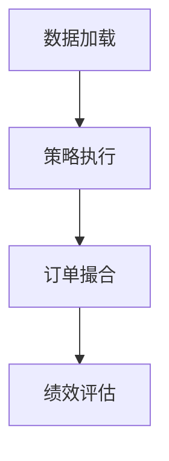
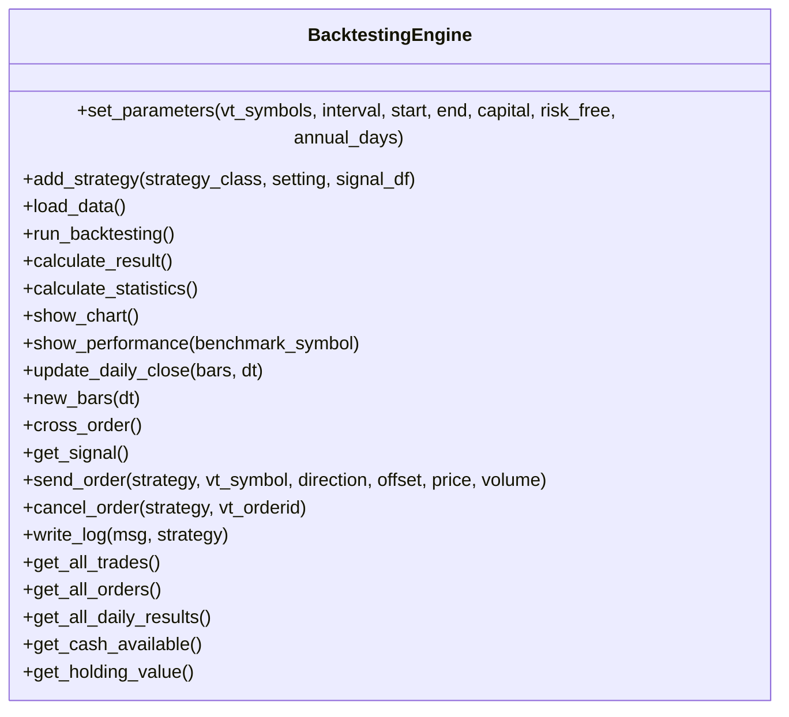
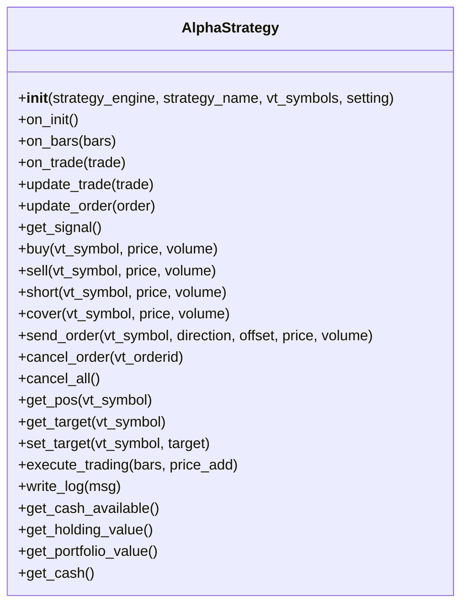
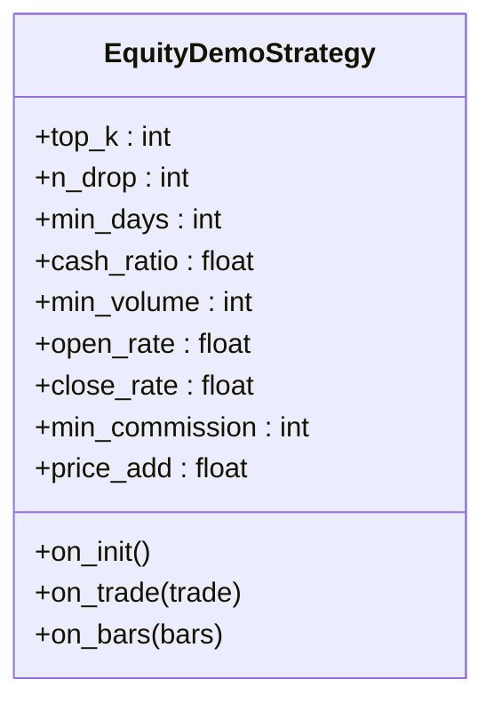
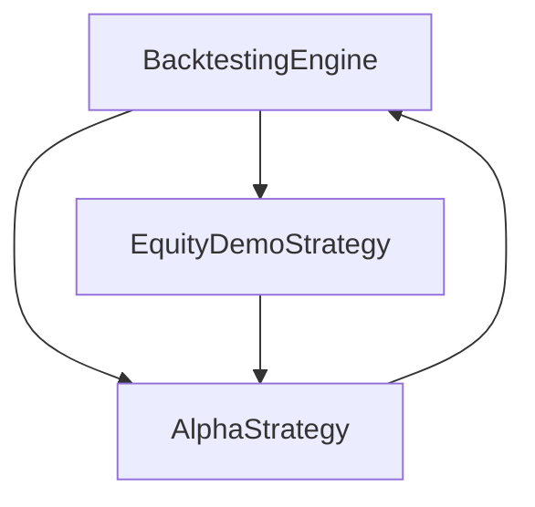

# 回测系统

<cite>
**本文档引用文件**   
- [backtesting_demo.ipynb](file://examples/cta_backtesting/backtesting_demo.ipynb)
- [portfolio_backtesting.ipynb](file://examples/cta_backtesting/portfolio_backtesting.ipynb)
- [backtesting.py](file://vnpy/alpha/strategy/backtesting.py)
- [template.py](file://vnpy/alpha/strategy/template.py)
- [equity_demo_strategy.py](file://vnpy/alpha/strategy/strategies/equity_demo_strategy.py)
- [optimize.py](file://vnpy/trader/optimize.py)
</cite>

## 目录
1. [引言](#引言)
2. [项目结构](#项目结构)
3. [核心组件](#核心组件)
4. [架构概述](#架构概述)
5. [详细组件分析](#详细组件分析)
6. [依赖分析](#依赖分析)
7. [性能考虑](#性能考虑)
8. [故障排除指南](#故障排除指南)
9. [结论](#结论)
10. [附录](#附录) (如有必要)

## 引言
本文档全面介绍vn.py回测引擎的架构设计与使用方法。基于cta_backtesting和portfolio_backtesting示例，说明单策略回测与组合策略回测的工作流程差异。详细阐述回测引擎的核心组件：Bar回放机制、订单撮合逻辑、滑点与手续费建模、绩效评估指标（年化收益率、最大回撤、夏普比率等）计算原理。指导用户如何配置回测参数、加载历史数据、运行回测任务并可视化结果。提供性能优化建议，如使用Polars加速数据处理、并行化参数寻优。分析回测偏差来源及避免方法，强调前向偏差和幸存者偏差的防范措施。

## 项目结构
vn.py项目包含多个模块和示例，主要结构如下：
- **examples**: 包含各种使用示例，如cta_backtesting、portfolio_backtesting等。
- **vnpy**: 核心模块，包括alpha、chart、event、rpc、trader等子模块。
- **vnpy/alpha/strategy**: 包含策略相关的实现，如backtesting.py、template.py等。

**Section sources**
- [backtesting_demo.ipynb](file://examples/cta_backtesting/backtesting_demo.ipynb)
- [portfolio_backtesting.ipynb](file://examples/cta_backtesting/portfolio_backtesting.ipynb)

## 核心组件
回测引擎的核心组件包括：
- **BacktestingEngine**: 回测引擎，负责加载数据、运行回测、计算结果和显示图表。
- **AlphaStrategy**: 策略模板类，定义了策略的基本接口。
- **EquityDemoStrategy**: 示例策略，展示了如何实现具体的交易策略。

**Section sources**
- [backtesting.py](file://vnpy/alpha/strategy/backtesting.py)
- [template.py](file://vnpy/alpha/strategy/template.py)
- [equity_demo_strategy.py](file://vnpy/alpha/strategy/strategies/equity_demo_strategy.py)

## 架构概述
回测引擎的架构设计如下：
- **数据加载**: 从历史数据中加载K线数据。
- **策略执行**: 根据K线数据执行策略逻辑。
- **订单撮合**: 模拟订单的撮合过程。
- **绩效评估**: 计算各种绩效指标。

**Diagram sources**
- [backtesting.py](file://vnpy/alpha/strategy/backtesting.py)

## 详细组件分析
### BacktestingEngine 分析
BacktestingEngine是回测引擎的核心类，负责整个回测过程的管理。

#### 类图

**Diagram sources**
- [backtesting.py](file://vnpy/alpha/strategy/backtesting.py)

### AlphaStrategy 分析
AlphaStrategy是策略模板类，定义了策略的基本接口。

#### 类图

**Diagram sources**
- [template.py](file://vnpy/alpha/strategy/template.py)

### EquityDemoStrategy 分析
EquityDemoStrategy是示例策略，展示了如何实现具体的交易策略。

#### 类图

**Diagram sources**
- [equity_demo_strategy.py](file://vnpy/alpha/strategy/strategies/equity_demo_strategy.py)

## 依赖分析
回测引擎的依赖关系如下：
- **BacktestingEngine** 依赖于 **AlphaStrategy** 和 **EquityDemoStrategy**。
- **AlphaStrategy** 依赖于 **BacktestingEngine**。
- **EquityDemoStrategy** 依赖于 **AlphaStrategy**。

**Diagram sources**
- [backtesting.py](file://vnpy/alpha/strategy/backtesting.py)
- [template.py](file://vnpy/alpha/strategy/template.py)
- [equity_demo_strategy.py](file://vnpy/alpha/strategy/strategies/equity_demo_strategy.py)

## 性能考虑
为了提高回测性能，可以采取以下措施：
- 使用Polars加速数据处理。
- 并行化参数寻优。
- 优化数据加载和存储。

**Section sources**
- [optimize.py](file://vnpy/trader/optimize.py)

## 故障排除指南
常见问题及解决方法：
- **数据加载失败**: 检查数据源是否正确，确保数据文件存在。
- **策略执行异常**: 检查策略逻辑，确保没有语法错误。
- **订单撮合失败**: 检查订单参数，确保价格和数量合理。

**Section sources**
- [backtesting.py](file://vnpy/alpha/strategy/backtesting.py)
- [template.py](file://vnpy/alpha/strategy/template.py)

## 结论
本文档详细介绍了vn.py回测引擎的架构设计与使用方法，涵盖了从数据加载到绩效评估的全过程。通过示例和详细的组件分析，帮助用户更好地理解和使用回测引擎。

## 附录
### 附录A: 回测引擎配置参数
| 参数 | 描述 |
| --- | --- |
| vt_symbols | 合约代码列表 |
| interval | K线周期 |
| start | 回测开始时间 |
| end | 回测结束时间 |
| capital | 初始资金 |
| risk_free | 无风险利率 |
| annual_days | 年交易日数 |

### 附录B: 绩效评估指标
| 指标 | 描述 |
| --- | --- |
| 总收益率 | 回测期间的总收益 |
| 年化收益 | 年化收益率 |
| 最大回撤 | 最大资金回撤 |
| 夏普比率 | 收益与风险的比值 |
| 收益回撤比 | 收益与最大回撤的比值 |