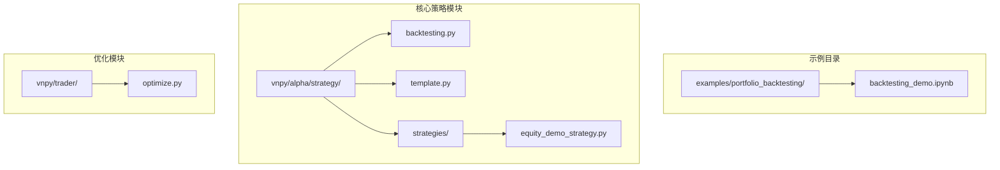
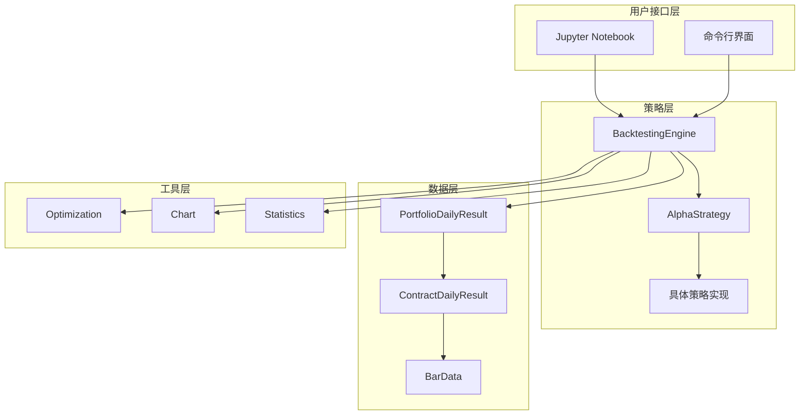
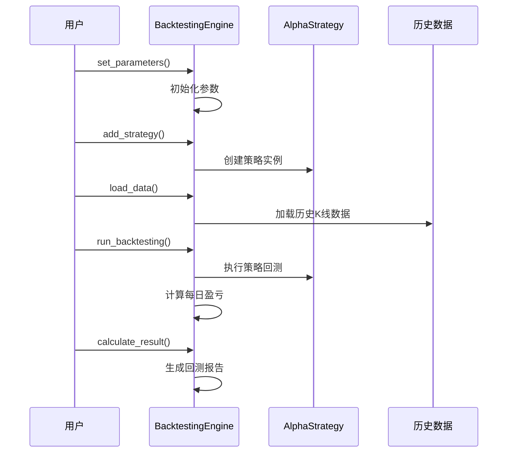
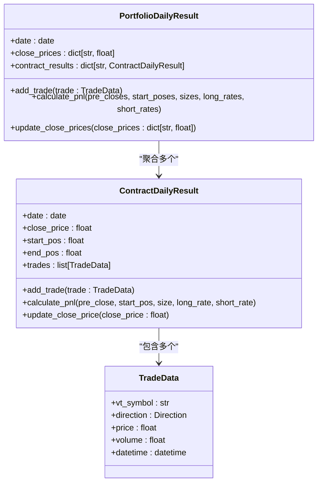
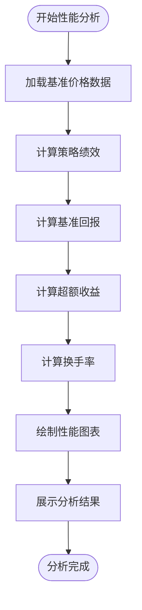
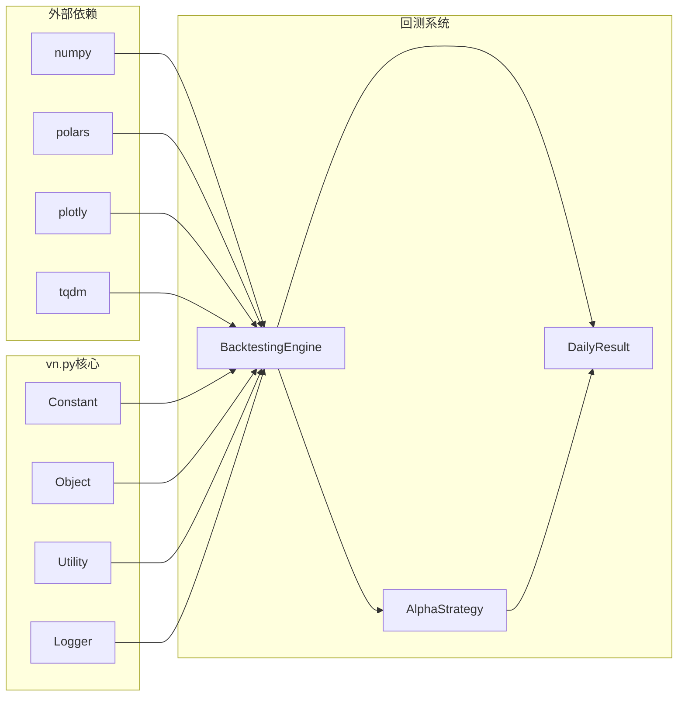

# vn.py组合策略回测系统

<cite>
**本文档引用的文件**
- [backtesting_demo.ipynb](file://examples/portfolio_backtesting/backtesting_demo.ipynb)
- [backtesting.py](file://vnpy/alpha/strategy/backtesting.py)
- [template.py](file://vnpy/alpha/strategy/template.py)
- [equity_demo_strategy.py](file://vnpy/alpha/strategy/strategies/equity_demo_strategy.py)
- [optimize.py](file://vnpy/trader/optimize.py)
</cite>

## 目录
1. [简介](#简介)
2. [项目结构](#项目结构)
3. [核心组件](#核心组件)
4. [架构概览](#架构概览)
5. [详细组件分析](#详细组件分析)
6. [依赖关系分析](#依赖关系分析)
7. [性能考虑](#性能考虑)
8. [故障排除指南](#故障排除指南)
9. [结论](#结论)

## 简介

vn.py组合策略回测系统是一个强大的多资产组合回测框架，专门设计用于支持复杂的多合约交易策略。该系统通过PortfolioDailyResult类实现了对多个资产交易结果的统一聚合，能够精确计算组合层面的总盈亏、手续费、持仓盈亏与交易盈亏。

系统的核心优势在于其完善的多资产持仓管理机制，包括资金分配逻辑、组合绩效评估以及风险敞口处理。用户可以通过该系统分析组合回测报告，比较不同资产对整体收益的贡献，并利用show_performance方法进行基准对比分析。

## 项目结构

vn.py组合策略回测系统的文件组织结构清晰，主要包含以下关键目录和文件：



**图表来源**
- [backtesting_demo.ipynb](file://examples/portfolio_backtesting/backtesting_demo.ipynb#L1-L117)
- [backtesting.py](file://vnpy/alpha/strategy/backtesting.py#L1-L50)

**章节来源**
- [backtesting_demo.ipynb](file://examples/portfolio_backtesting/backtesting_demo.ipynb#L1-L117)
- [backtesting.py](file://vnpy/alpha/strategy/backtesting.py#L1-L945)

## 核心组件

### BacktestingEngine - 回测引擎

BacktestingEngine是整个回测系统的核心控制器，负责协调各个组件的工作流程。它提供了完整的回测生命周期管理，从数据加载到结果分析的全过程。

主要功能特性：
- **多资产支持**：同时支持多个合约的回测
- **参数配置**：灵活的资金分配和交易参数设置
- **策略管理**：支持多种策略类型的回测
- **结果计算**：自动计算每日盈亏和统计指标

### PortfolioDailyResult - 组合日度结果

PortfolioDailyResult类是组合回测的核心数据结构，负责聚合多个资产的交易结果。它通过以下机制实现组合层面的统一管理：

```python
class PortfolioDailyResult:
    """组合日度盈亏结果"""
    
    def __init__(self, result_date: date, close_prices: dict[str, float]) -> None:
        self.date: date = result_date
        self.close_prices: dict[str, float] = close_prices
        self.pre_closes: dict[str, float] = {}
        self.start_poses: dict[str, float] = {}
        self.end_poses: dict[str, float] = {}
        
        self.contract_results: dict[str, ContractDailyResult] = {}
        
        for vt_symbol, close_price in close_prices.items():
            self.contract_results[vt_symbol] = ContractDailyResult(result_date, close_price)
```

**章节来源**
- [backtesting.py](file://vnpy/alpha/strategy/backtesting.py#L885-L922)
- [template.py](file://vnpy/alpha/strategy/template.py#L1-L50)

## 架构概览

vn.py组合策略回测系统采用分层架构设计，确保了代码的可维护性和扩展性：



**图表来源**
- [backtesting.py](file://vnpy/alpha/strategy/backtesting.py#L20-L50)
- [template.py](file://vnpy/alpha/strategy/template.py#L14-L50)

## 详细组件分析

### 回测引擎配置

回测引擎的配置过程包括多个关键步骤，每个步骤都为后续的回测计算奠定基础：



**图表来源**
- [backtesting.py](file://vnpy/alpha/strategy/backtesting.py#L60-L100)
- [backtesting.py](file://vnpy/alpha/strategy/backtesting.py#L130-L180)

### 多合约持仓管理

系统通过ContractDailyResult类实现对单个合约的持仓管理，而PortfolioDailyResult则负责聚合多个合约的结果：



**图表来源**
- [backtesting.py](file://vnpy/alpha/strategy/backtesting.py#L885-L922)
- [backtesting.py](file://vnpy/alpha/strategy/backtesting.py#L800-L844)

### 资金分配与风险管理

系统通过以下机制实现资金分配和风险管理：

1. **资金分配逻辑**：通过set_parameters方法设置初始资本和分配比例
2. **保证金计算**：根据合约规格自动计算保证金要求
3. **风险敞口控制**：实时监控组合的风险水平
4. **爆仓检测**：自动检测资金不足的情况并停止回测

### 组合绩效评估

系统提供全面的绩效评估指标，包括：

```python
def calculate_statistics(self) -> dict:
    """计算策略统计指标"""
    # 资本相关指标
    df = df.with_columns(
        balance=pl.col("net_pnl").cum_sum() + self.capital
    ).with_columns(
        return=pl.col("balance").pct_change().fill_null(0),
        highlevel=pl.col("balance").cum_max()
    ).with_columns(
        drawdown=pl.col("balance") - pl.col("highlevel"),
        ddpercent=(pl.col("balance") / pl.col("highlevel") - 1) * 100
    )
```

**章节来源**
- [backtesting.py](file://vnpy/alpha/strategy/backtesting.py#L259-L293)
- [backtesting.py](file://vnpy/alpha/strategy/backtesting.py#L403-L446)

### 基准对比分析

show_performance方法提供了强大的基准对比功能：



**图表来源**
- [backtesting.py](file://vnpy/alpha/strategy/backtesting.py#L448-L531)

**章节来源**
- [backtesting.py](file://vnpy/alpha/strategy/backtesting.py#L448-L600)

## 依赖关系分析

系统的依赖关系呈现清晰的层次结构：



**图表来源**
- [backtesting.py](file://vnpy/alpha/strategy/backtesting.py#L1-L20)

**章节来源**
- [backtesting.py](file://vnpy/alpha/strategy/backtesting.py#L1-L20)
- [optimize.py](file://vnpy/trader/optimize.py#L1-L50)

## 性能考虑

### 数据处理优化

系统采用Polars库进行高效的数据处理，相比传统Pandas在大数据量场景下具有显著性能优势：

- **内存效率**：使用列式存储减少内存占用
- **并行计算**：充分利用多核CPU进行并行处理
- **惰性计算**：延迟计算优化内存使用

### 回测性能优化

1. **批量处理**：一次性加载所有历史数据，避免重复查询
2. **缓存机制**：缓存常用数据减少计算开销
3. **增量更新**：只更新变化的数据部分
4. **多进程支持**：支持并行优化算法

### 内存管理

系统通过以下机制优化内存使用：
- 及时释放不再需要的历史数据
- 使用弱引用避免循环引用
- 定期清理临时对象

## 故障排除指南

### 常见问题及解决方案

1. **数据加载失败**
   - 检查合约配置是否正确
   - 验证数据源连接状态
   - 确认时间范围设置合理

2. **回测结果异常**
   - 检查交易参数设置
   - 验证策略逻辑正确性
   - 确认资金充足性

3. **性能问题**
   - 减少回测时间范围
   - 优化策略复杂度
   - 增加硬件资源

### 调试技巧

- 使用日志输出关键变量值
- 利用Jupyter Notebook进行交互式调试
- 分阶段验证各组件功能

**章节来源**
- [backtesting.py](file://vnpy/alpha/strategy/backtesting.py#L130-L180)
- [optimize.py](file://vnpy/trader/optimize.py#L100-L150)

## 结论

vn.py组合策略回测系统是一个功能完善、架构清晰的多资产回测平台。通过PortfolioDailyResult类的精心设计，系统能够有效聚合多个资产的交易结果，提供准确的组合绩效评估。

系统的主要优势包括：
- **多资产支持**：轻松处理多个合约的回测需求
- **精确计算**：提供完整的盈亏和费用计算
- **可视化分析**：丰富的图表和指标展示
- **扩展性强**：模块化设计便于功能扩展

对于量化研究人员和交易员而言，该系统提供了从策略开发到绩效分析的完整解决方案，是进行组合策略研究的理想工具。