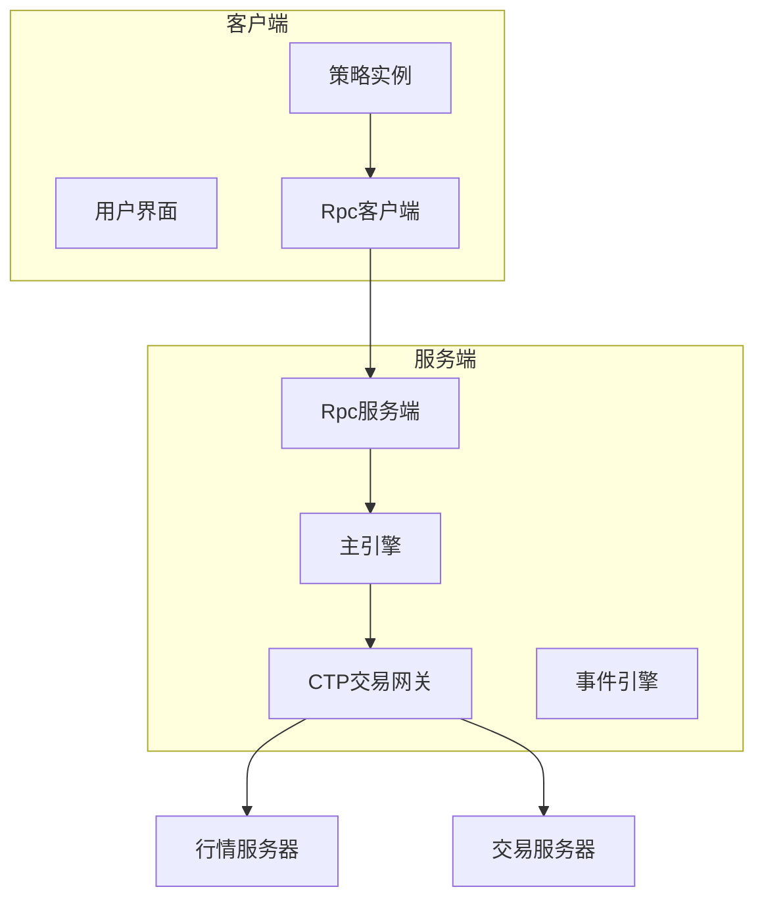
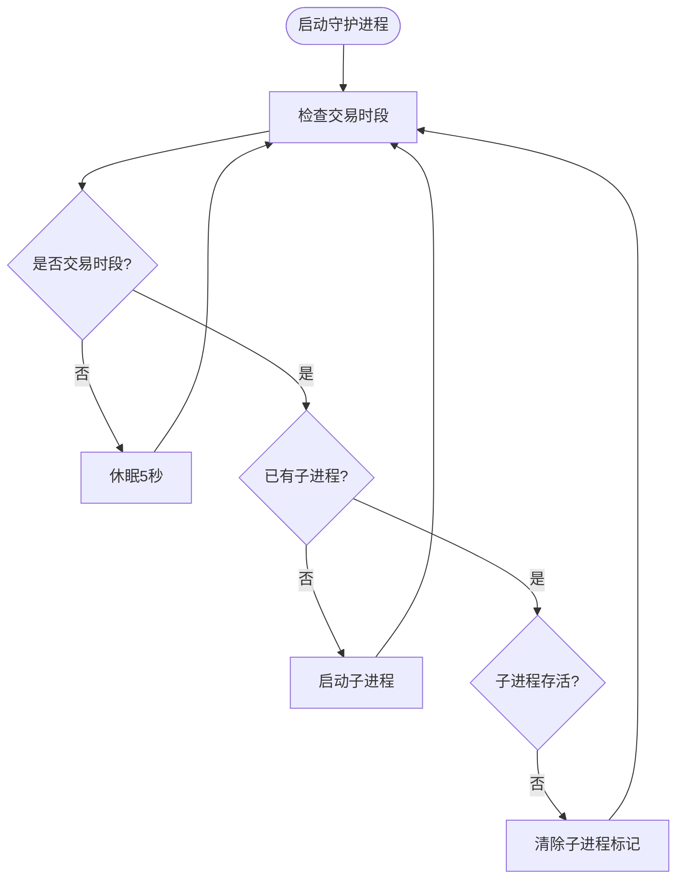
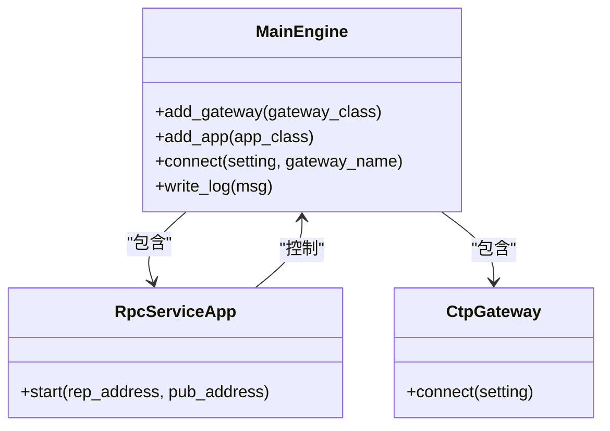
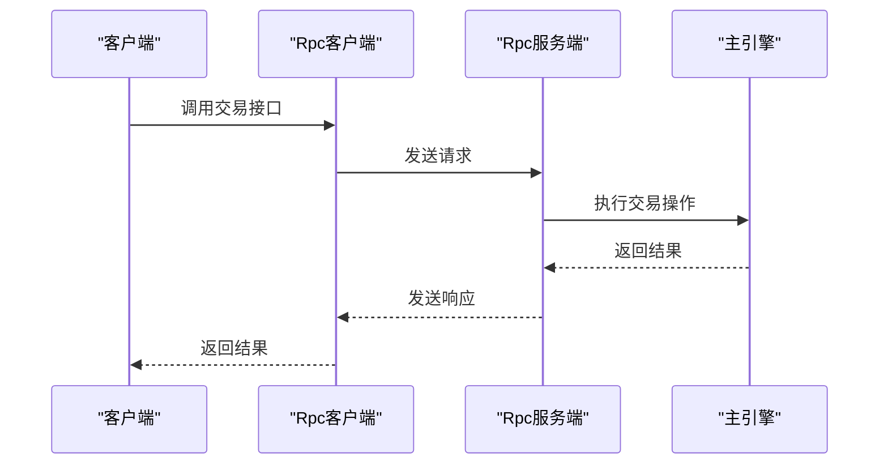
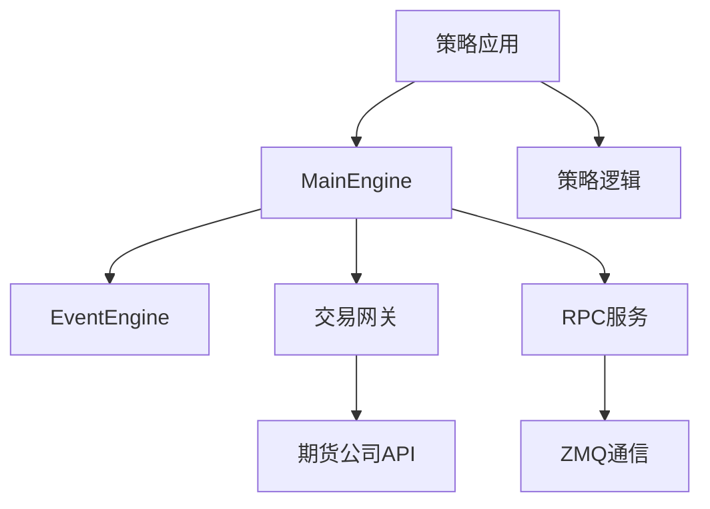

# 实盘部署

<cite>
**本文档引用的文件**  
- [run.py](file://examples/veighna_trader/run.py)
- [no_ui/run.py](file://examples/no_ui/run.py)
- [client_server/run_server.py](file://examples/client_server/run_server.py)
- [client_server/run_client.py](file://examples/client_server/run_client.py)
- [engine.py](file://vnpy/trader/engine.py)
- [server.py](file://vnpy/rpc/server.py)
- [client.py](file://vnpy/rpc/client.py)
</cite>

## 目录
1. [引言](#引言)
2. [项目结构](#项目结构)
3. [核心组件](#核心组件)
4. [架构概览](#架构概览)
5. [详细组件分析](#详细组件分析)
6. [依赖分析](#依赖分析)
7. [性能考量](#性能考量)
8. [故障排查指南](#故障排查指南)
9. [结论](#结论)

## 引言
本文档详述了从回测环境迁移到实盘交易的完整部署流程。重点介绍如何通过MainEngine集成策略实例、连接交易网关、订阅行情数据流并启动自动化交易。涵盖基于脚本模式（run.py）和Notebook交互式模式的两种部署方式及其适用场景。强调实盘运行中的关键注意事项：连接稳定性监控、异常处理机制、日志记录与报警设置。提供灾备恢复方案，如策略状态持久化、订单状态同步等。结合rpc/client_server示例说明分布式部署架构，实现策略计算与交易执行的物理分离以提升系统可靠性。

## 项目结构
vnpy项目采用模块化设计，主要分为examples示例目录和vnpy核心库目录。examples目录包含多种部署模式的示例代码，包括GUI模式、无界面脚本模式和分布式RPC模式。vnpy核心库实现了事件驱动引擎、主引擎、交易网关、策略应用等核心组件，为实盘交易提供基础架构支持。

**Section sources**
- [run.py](file://examples/veighna_trader/run.py)
- [no_ui/run.py](file://examples/no_ui/run.py)
- [client_server/run_server.py](file://examples/client_server/run_server.py)
- [client_server/run_client.py](file://examples/client_server/run_client.py)

## 核心组件
实盘部署的核心组件包括MainEngine主引擎、EventEngine事件引擎、交易网关（如CtpGateway）、策略应用（如CtaStrategyApp）和RPC服务。MainEngine负责集成所有功能模块，管理网关连接和应用生命周期。EventEngine实现事件驱动架构，处理行情、订单、成交等事件的分发。交易网关封装了与期货公司的API通信。策略应用提供策略管理功能。RPC服务支持分布式部署，实现计算与交易的物理分离。

**Section sources**
- [engine.py](file://vnpy/trader/engine.py)
- [server.py](file://vnpy/rpc/server.py)
- [client.py](file://vnpy/rpc/client.py)

## 架构概览

**Diagram sources**
- [client_server/run_client.py](file://examples/client_server/run_client.py)
- [client_server/run_server.py](file://examples/client_server/run_server.py)

## 详细组件分析

### 策略部署模式分析
vnpy支持多种策略部署模式，包括GUI模式、脚本模式和分布式模式。

#### GUI模式
通过veighna_trader/run.py实现，提供图形化界面进行策略管理。适合策略开发和调试阶段使用。

**Section sources**
- [run.py](file://examples/veighna_trader/run.py)

#### 脚本模式
通过no_ui/run.py实现，采用守护进程架构。父进程监控交易时段，子进程在交易时段内运行策略。提供交易时段自动启停功能，适合生产环境部署。

**Diagram sources**
- [no_ui/run.py](file://examples/no_ui/run.py)

### 分布式部署架构分析
通过client_server示例实现计算节点与交易节点的物理分离。

#### 服务端架构
服务端运行在安全的交易环境中，负责连接交易网关和执行交易指令。通过RPC服务暴露接口，接收来自客户端的调用请求。

**Diagram sources**
- [client_server/run_server.py](file://examples/client_server/run_server.py)

#### 客户端架构
客户端运行在策略计算环境中，通过RPC网关连接服务端。策略在客户端实例化，但交易执行在服务端完成，实现计算与交易的分离。

**Diagram sources**
- [client_server/run_client.py](file://examples/client_server/run_client.py)

## 依赖分析

**Diagram sources**
- [engine.py](file://vnpy/trader/engine.py)
- [server.py](file://vnpy/rpc/server.py)
- [client.py](file://vnpy/rpc/client.py)

## 性能考量
实盘系统需重点关注连接稳定性、消息延迟和异常处理。RPC通信采用ZMQ的REQ/REP和PUB/SUB模式，保证请求响应的可靠性和事件推送的实时性。心跳机制监控连接状态，超时自动断开重连。多线程设计确保I/O操作不阻塞主循环。建议在生产环境使用独立服务器部署交易节点，避免资源竞争。

## 故障排查指南
实盘运行中需重点关注以下问题：

1. **连接问题**：检查网络连接、防火墙设置和服务器地址
2. **认证失败**：验证用户名、密码、经纪商代码等登录信息
3. **行情中断**：监控心跳信号，实现自动重连
4. **订单异常**：检查订单状态同步机制，防止重复下单
5. **性能瓶颈**：监控CPU、内存使用率，优化策略逻辑

日志系统记录所有关键操作，便于问题追溯。建议配置邮件报警，在异常发生时及时通知。

**Section sources**
- [engine.py](file://vnpy/trader/engine.py)
- [server.py](file://vnpy/rpc/server.py)
- [client.py](file://vnpy/rpc/client.py)

## 结论
vnpy提供了完整的从回测到实盘的迁移解决方案。通过MainEngine统一管理交易组件，支持多种部署模式满足不同场景需求。分布式架构通过RPC实现计算与交易的物理分离，提升系统安全性和可靠性。完善的错误处理和日志记录机制确保实盘运行的稳定性。建议生产环境采用无界面脚本模式或分布式模式部署，配合监控报警系统，构建稳健的自动化交易体系。