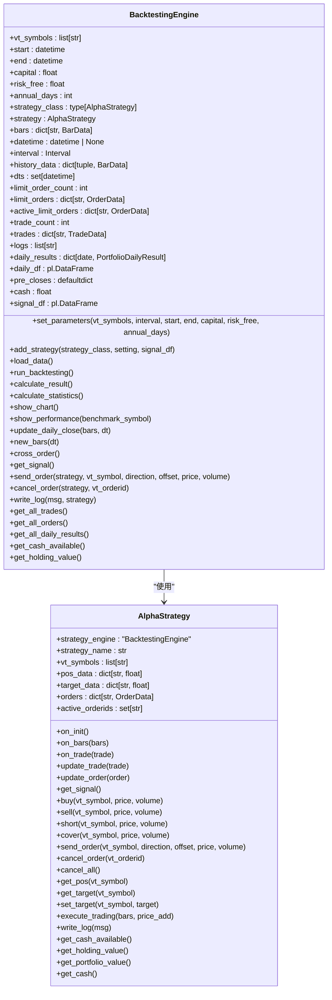
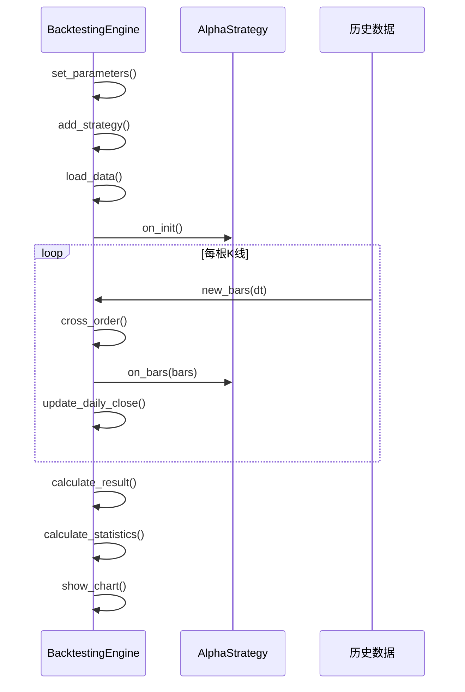
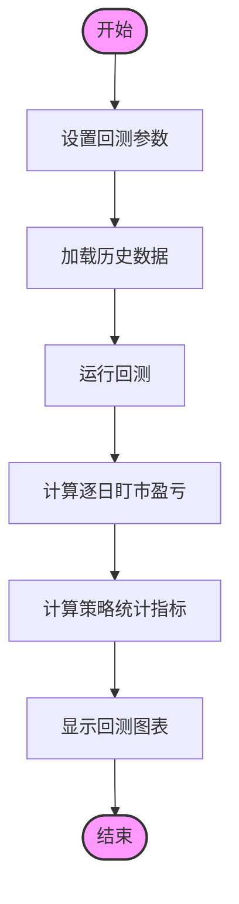
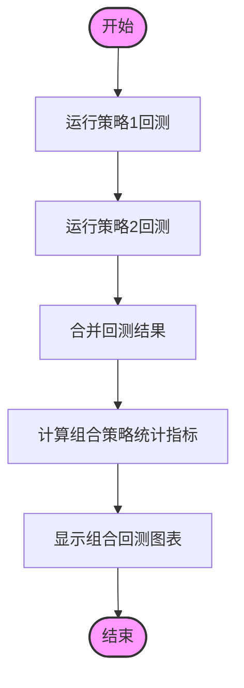
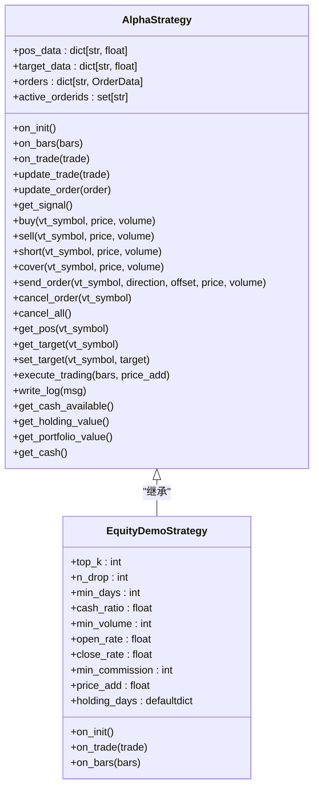
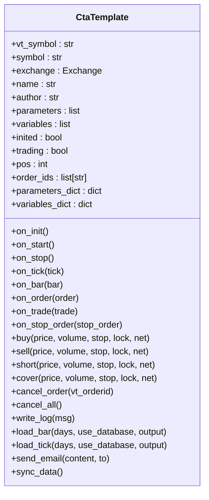
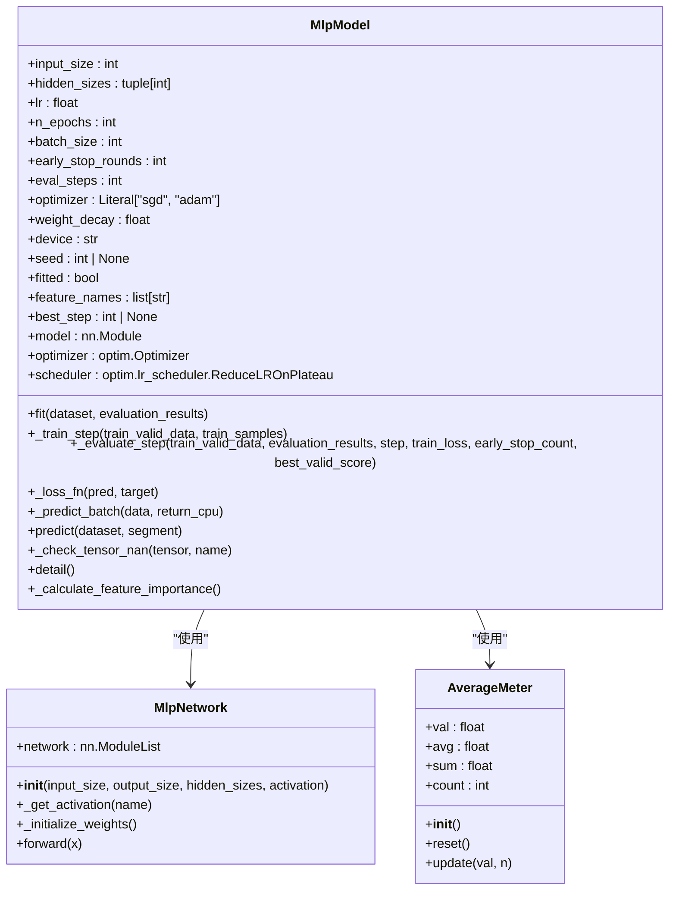
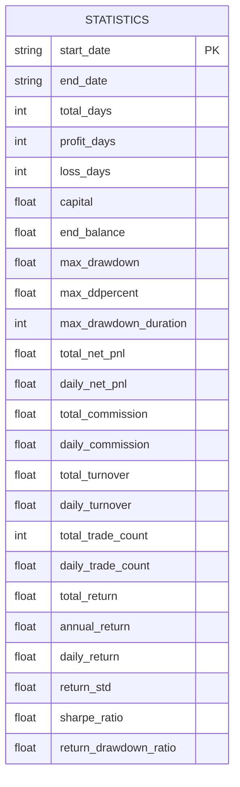
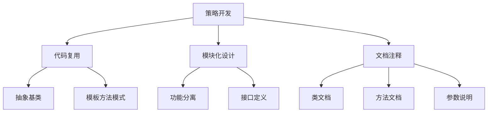

# 策略开发

<cite>
**Referenced Files in This Document**   
- [backtesting_demo.ipynb](file://examples/cta_backtesting/backtesting_demo.ipynb)
- [portfolio_backtesting.ipynb](file://examples/cta_backtesting/portfolio_backtesting.ipynb)
- [template.py](file://vnpy/alpha/strategy/template.py)
- [backtesting.py](file://vnpy/alpha/strategy/backtesting.py)
- [equity_demo_strategy.py](file://vnpy/alpha/strategy/strategies/equity_demo_strategy.py)
- [mlp_model.py](file://vnpy/alpha/model/models/mlp_model.py)
</cite>

## 目录
1. [引言](#引言)
2. [策略设计与回测框架](#策略设计与回测框架)
3. [单策略与组合策略回测](#单策略与组合策略回测)
4. [Alpha与Trader策略模板对比](#alpha与trader策略模板对比)
5. [具体策略实现案例](#具体策略实现案例)
6. [参数优化与绩效评估](#参数优化与绩效评估)
7. [风险控制与代码可维护性](#风险控制与代码可维护性)
8. [结论](#结论)

## 引言
本文档旨在构建完整的策略开发指南，覆盖从策略设计、回测验证到实盘部署的全生命周期。通过分析vnpy框架中的cta_backtesting和portfolio_backtesting示例，详细说明单策略与组合策略的回测框架使用方法。对比分析vnpy/alpha和trader两个路径下的策略模板差异与适用场景。提供事件驱动型策略、定时任务型策略和机器学习增强型策略的具体实现案例。详细说明参数优化、绩效评估指标计算和风险控制机制集成方法。强调代码可维护性和策略复用性设计原则。

## 策略设计与回测框架

### 回测引擎核心组件
vnpy框架中的回测引擎提供了完整的策略测试环境，其核心组件包括数据加载、策略执行、交易撮合和绩效计算。回测引擎通过`BacktestingEngine`类实现，该类负责管理历史数据、执行策略逻辑、处理订单撮合并计算最终的绩效指标。



**Diagram sources**
- [backtesting.py](file://vnpy/alpha/strategy/backtesting.py#L1-L945)
- [template.py](file://vnpy/alpha/strategy/template.py#L1-L206)

**Section sources**
- [backtesting.py](file://vnpy/alpha/strategy/backtesting.py#L1-L945)
- [template.py](file://vnpy/alpha/strategy/template.py#L1-L206)

### 策略生命周期管理
策略的生命周期管理是回测框架的核心，包括策略初始化、K线数据推送、交易执行和订单管理。`AlphaStrategy`类作为策略模板，定义了策略的基本接口和生命周期方法。策略通过`on_init`方法进行初始化，通过`on_bars`方法接收K线数据，通过`on_trade`方法处理交易执行。



**Diagram sources**
- [backtesting.py](file://vnpy/alpha/strategy/backtesting.py#L1-L945)
- [template.py](file://vnpy/alpha/strategy/template.py#L1-L206)

**Section sources**
- [backtesting.py](file://vnpy/alpha/strategy/backtesting.py#L1-L945)
- [template.py](file://vnpy/alpha/strategy/template.py#L1-L206)

## 单策略与组合策略回测

### 单策略回测实现
单策略回测通过`cta_backtesting/backtesting_demo.ipynb`示例展示了完整的回测流程。回测过程包括设置参数、加载数据、运行回测和计算结果。回测引擎通过`set_parameters`方法设置回测参数，包括交易品种、时间周期、起止时间、费率、滑点、合约乘数、价格跳动和初始资金。



**Diagram sources**
- [backtesting_demo.ipynb](file://examples/cta_backtesting/backtesting_demo.ipynb#L1-L1959)

**Section sources**
- [backtesting_demo.ipynb](file://examples/cta_backtesting/backtesting_demo.ipynb#L1-L1959)

### 组合策略回测实现
组合策略回测通过`cta_backtesting/portfolio_backtesting.ipynb`示例展示了多策略组合的回测方法。组合回测通过`run_backtesting`函数实现，该函数接受策略类、参数设置、交易品种、时间周期、起止时间、费率、滑点、合约乘数、价格跳动和初始资金作为参数，返回回测结果数据框。



**Diagram sources**
- [portfolio_backtesting.ipynb](file://examples/cta_backtesting/portfolio_backtesting.ipynb#L1-L225)

**Section sources**
- [portfolio_backtesting.ipynb](file://examples/cta_backtesting/portfolio_backtesting.ipynb#L1-L225)

## Alpha与Trader策略模板对比

### Alpha策略模板特点
Alpha策略模板位于`vnpy/alpha/strategy/template.py`，主要面向量化研究和机器学习增强型策略。该模板提供了更高级的抽象，支持多品种组合策略和信号驱动的交易逻辑。Alpha策略通过`get_signal`方法获取模型预测信号，通过`set_target`方法设置目标持仓，通过`execute_trading`方法执行交易。



**Diagram sources**
- [template.py](file://vnpy/alpha/strategy/template.py#L1-L206)
- [equity_demo_strategy.py](file://vnpy/alpha/strategy/strategies/equity_demo_strategy.py#L1-L102)

**Section sources**
- [template.py](file://vnpy/alpha/strategy/template.py#L1-L206)
- [equity_demo_strategy.py](file://vnpy/alpha/strategy/strategies/equity_demo_strategy.py#L1-L102)

### Trader策略模板特点
Trader策略模板位于`vnpy/trader`路径下，主要面向传统CTA策略和事件驱动型策略。该模板提供了更底层的交易接口，支持更精细的订单管理和风险控制。Trader策略通过`on_tick`方法接收行情数据，通过`on_order`方法处理订单状态，通过`on_trade`方法处理交易执行。



**Diagram sources**
- [cta_template.py](file://vnpy/trader/cta_strategy/template.py#L1-L500)

**Section sources**
- [cta_template.py](file://vnpy/trader/cta_strategy/template.py#L1-L500)

## 具体策略实现案例

### 事件驱动型策略
事件驱动型策略通过监听市场事件来触发交易决策。在vnpy框架中，事件驱动型策略通过`on_tick`和`on_bar`方法实现。当接收到新的行情数据或K线数据时，策略会根据预设的交易逻辑进行判断并执行相应的交易操作。

```python
def on_tick(self, tick: TickData) -> None:
    """
    Tick数据更新回调
    """
    if self.inited:
        self.on_bar(self.bars[self.vt_symbol])
```

### 定时任务型策略
定时任务型策略通过定时器来触发交易决策。在vnpy框架中，定时任务型策略通过`register_event`方法注册定时器事件，并在`process_timer_event`方法中处理定时任务。

```python
def register_event(self) -> None:
    """
    注册事件
    """
    self.event_engine.register(EVENT_TIMER, self.process_timer_event)

def process_timer_event(self, event: Event) -> None:
    """
    处理定时器事件
    """
    self.on_timer()
```

### 机器学习增强型策略
机器学习增强型策略通过机器学习模型生成交易信号。在vnpy框架中，机器学习增强型策略通过`get_signal`方法获取模型预测信号，并根据信号执行交易。`vnpy/alpha/model/models/mlp_model.py`提供了多层感知机模型的实现，用于预测Alpha因子值。



**Diagram sources**
- [mlp_model.py](file://vnpy/alpha/model/models/mlp_model.py#L1-L684)

**Section sources**
- [mlp_model.py](file://vnpy/alpha/model/models/mlp_model.py#L1-L684)

## 参数优化与绩效评估

### 参数优化方法
参数优化是策略开发的重要环节，通过优化策略参数可以提高策略的绩效表现。vnpy框架提供了`OptimizationSetting`类用于定义参数优化范围，支持网格搜索和遗传算法等优化方法。

```python
from vnpy.trader.optimize import OptimizationSetting

setting = OptimizationSetting()
setting.add_parameter("atr_length", 3, 39, 1)
setting.add_parameter("atr_multiplier", 0.5, 5, 0.1)
```

### 绩效评估指标
绩效评估指标用于衡量策略的表现，包括收益率、最大回撤、夏普比率等。vnpy框架通过`calculate_statistics`方法计算策略统计指标，包括总收益率、年化收益、最大回撤、百分比最大回撤、总盈亏、总手续费、总滑点、日均盈亏、日均手续费、日均滑点、日均收益率、收益标准差、夏普比率和收益回撤比。



**Diagram sources**
- [backtesting.py](file://vnpy/alpha/strategy/backtesting.py#L1-L945)

**Section sources**
- [backtesting.py](file://vnpy/alpha/strategy/backtesting.py#L1-L945)

## 风险控制与代码可维护性

### 风险控制机制
风险控制是策略开发的关键环节，包括资金管理、止损止盈、仓位控制等。vnpy框架通过`set_target`方法实现仓位控制，通过`cancel_order`和`cancel_all`方法实现订单管理，通过`write_log`方法记录策略日志。

```python
def set_target(self, vt_symbol: str, target: float) -> None:
    """
    设置目标持仓
    """
    self.target_data[vt_symbol] = target

def cancel_order(self, vt_orderid: str) -> None:
    """
    撤销订单
    """
    self.strategy_engine.cancel_order(self, vt_orderid)

def cancel_all(self) -> None:
    """
    撤销所有活动订单
    """
    for vt_orderid in list(self.active_orderids):
        self.cancel_order(vt_orderid)
```

### 代码可维护性设计
代码可维护性是策略开发的重要原则，包括代码复用、模块化设计、文档注释等。vnpy框架通过抽象基类和模板方法模式实现代码复用，通过模块化设计实现功能分离，通过详细的文档注释提高代码可读性。



**Diagram sources**
- [template.py](file://vnpy/alpha/strategy/template.py#L1-L206)

**Section sources**
- [template.py](file://vnpy/alpha/strategy/template.py#L1-L206)

## 结论
本文档详细介绍了vnpy框架中的策略开发全流程，包括策略设计、回测验证、实盘部署等环节。通过分析cta_backtesting和portfolio_backtesting示例，说明了单策略与组合策略的回测框架使用方法。对比分析了vnpy/alpha和trader两个路径下的策略模板差异与适用场景。提供了事件驱动型策略、定时任务型策略和机器学习增强型策略的具体实现案例。详细说明了参数优化、绩效评估指标计算和风险控制机制集成方法。强调了代码可维护性和策略复用性设计原则。这些内容为开发者提供了完整的策略开发指南，有助于提高策略开发效率和质量。