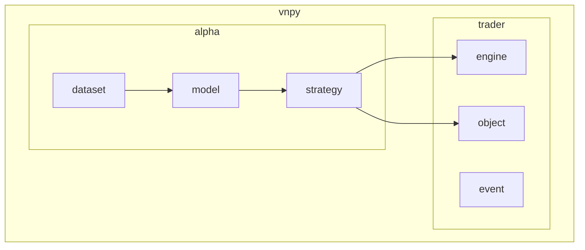
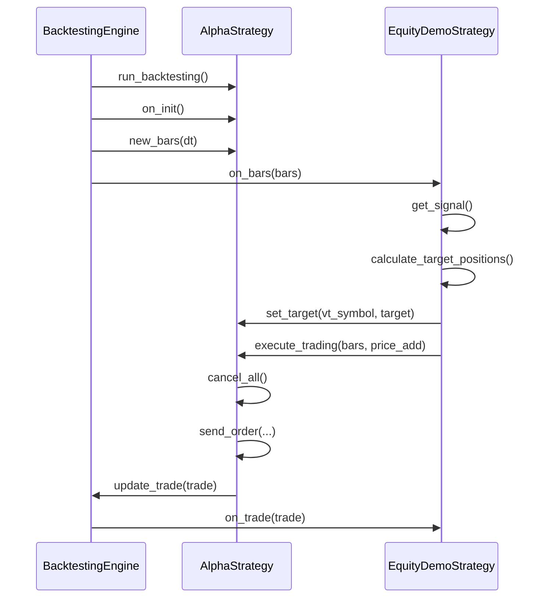
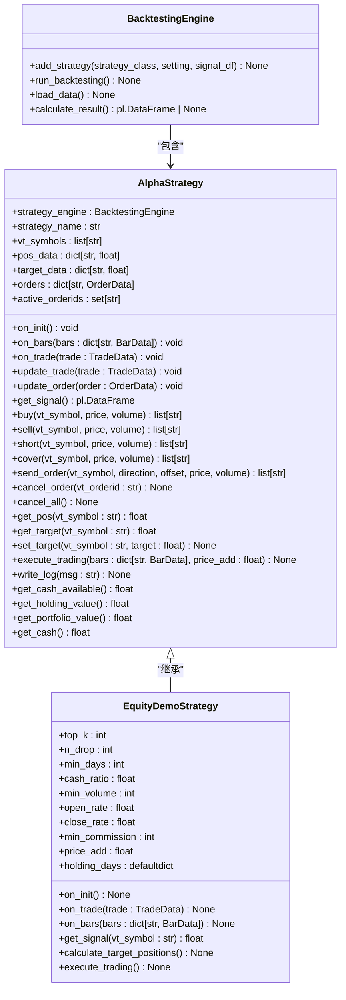
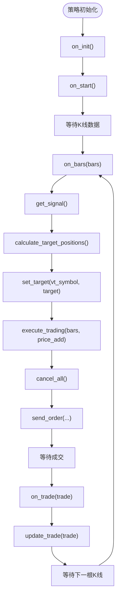
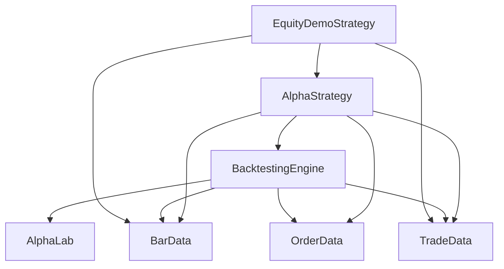

# 策略模板

<cite>
**本文档中引用的文件**  
- [template.py](file://vnpy/alpha/strategy/template.py)
- [backtesting.py](file://vnpy/alpha/strategy/backtesting.py)
- [equity_demo_strategy.py](file://vnpy/alpha/strategy/strategies/equity_demo_strategy.py)
- [engine.py](file://vnpy/trader/engine.py)
- [object.py](file://vnpy/trader/object.py)
</cite>

## 目录
1. [引言](#引言)
2. [项目结构](#项目结构)
3. [核心组件](#核心组件)
4. [架构概述](#架构概述)
5. [详细组件分析](#详细组件分析)
6. [依赖分析](#依赖分析)
7. [性能考虑](#性能考虑)
8. [故障排除指南](#故障排除指南)
9. [结论](#结论)

## 引言
本文档深入解析 `vnpy/alpha` 和 `vnpy/trader` 两个路径下的策略模板实现机制。重点分析 `AlphaStrategy` 基类的核心方法与生命周期管理，包括 `on_init`、`on_start`、`on_bars` 等事件回调函数的设计意图与执行流程。对比 AI 量化策略模板与传统交易策略模板在数据处理、信号生成和执行逻辑上的差异。结合代码片段展示如何继承模板类并实现自定义策略逻辑。解释参数管理（parameters）、变量持久化（variables）的设计模式及其在策略复用中的作用。提供常见错误示例及调试建议，如事件绑定遗漏、状态同步异常等。

## 项目结构
`vnpy` 项目采用模块化设计，主要包含 `alpha` 和 `trader` 两大核心模块。`alpha` 模块专注于 AI 量化策略的实现，包含数据集、模型和策略三个子模块。`trader` 模块提供基础交易功能，包括事件引擎、对象定义和策略执行引擎。

**图示来源**  
- [template.py](file://vnpy/alpha/strategy/template.py#L1-L20)
- [engine.py](file://vnpy/trader/engine.py#L1-L20)

**本节来源**  
- [template.py](file://vnpy/alpha/strategy/template.py#L1-L50)
- [engine.py](file://vnpy/trader/engine.py#L1-L50)

## 核心组件
`AlphaStrategy` 是 AI 量化策略的核心基类，定义了策略的生命周期管理和交易执行接口。`BacktestingEngine` 是回测引擎，负责驱动策略执行和数据回放。`EquityDemoStrategy` 是一个具体的策略实现示例，展示了如何继承基类并实现自定义逻辑。

**本节来源**  
- [template.py](file://vnpy/alpha/strategy/template.py#L1-L206)
- [backtesting.py](file://vnpy/alpha/strategy/backtesting.py#L1-L200)
- [equity_demo_strategy.py](file://vnpy/alpha/strategy/strategies/equity_demo_strategy.py#L1-L102)

## 架构概述
`AlphaStrategy` 基类采用事件驱动架构，通过回调函数管理策略生命周期。策略初始化时调用 `on_init`，启动时调用 `on_start`，收到 K 线数据时调用 `on_bars`，成交时调用 `on_trade`。策略通过 `send_order` 发送订单，通过 `cancel_order` 撤单，通过 `get_pos` 查询持仓。

**图示来源**  
- [template.py](file://vnpy/alpha/strategy/template.py#L1-L206)
- [backtesting.py](file://vnpy/alpha/strategy/backtesting.py#L1-L200)

## 详细组件分析
### AlphaStrategy 基类分析
`AlphaStrategy` 基类定义了策略的核心接口和状态管理。它维护实际持仓 `pos_data` 和目标持仓 `target_data`，缓存订单信息 `orders` 和活动订单 ID `active_orderids`。通过 `setting` 参数字典初始化策略参数。

#### 类图

**图示来源**  
- [template.py](file://vnpy/alpha/strategy/template.py#L1-L206)
- [equity_demo_strategy.py](file://vnpy/alpha/strategy/strategies/equity_demo_strategy.py#L1-L102)

#### 生命周期流程图

**图示来源**  
- [template.py](file://vnpy/alpha/strategy/template.py#L1-L206)
- [backtesting.py](file://vnpy/alpha/strategy/backtesting.py#L1-L200)

**本节来源**  
- [template.py](file://vnpy/alpha/strategy/template.py#L1-L206)
- [backtesting.py](file://vnpy/alpha/strategy/backtesting.py#L1-L200)
- [equity_demo_strategy.py](file://vnpy/alpha/strategy/strategies/equity_demo_strategy.py#L1-L102)

### AI策略与传统策略对比
AI量化策略模板与传统交易策略模板在设计上存在显著差异。AI策略通常处理多标的组合，使用 `dict[str, BarData]` 接收多个合约的K线数据，而传统策略多为单标的。AI策略依赖外部信号数据，通过 `get_signal()` 获取预测结果，而传统策略在 `on_bar` 中直接计算技术指标。AI策略采用目标持仓驱动模式，通过 `set_target` 和 `execute_trading` 实现仓位调整，而传统策略直接调用 `buy`/`sell` 等交易指令。

**本节来源**  
- [template.py](file://vnpy/alpha/strategy/template.py#L1-L206)
- [equity_demo_strategy.py](file://vnpy/alpha/strategy/strategies/equity_demo_strategy.py#L1-L102)

## 依赖分析
`AlphaStrategy` 依赖 `BacktestingEngine` 提供回测环境和交易执行，依赖 `BarData`、`TradeData`、`OrderData` 等基础对象进行数据交互。`BacktestingEngine` 依赖 `AlphaLab` 加载数据和模型配置。

**图示来源**  
- [template.py](file://vnpy/alpha/strategy/template.py#L1-L206)
- [backtesting.py](file://vnpy/alpha/strategy/backtesting.py#L1-L200)

**本节来源**  
- [template.py](file://vnpy/alpha/strategy/template.py#L1-L206)
- [backtesting.py](file://vnpy/alpha/strategy/backtesting.py#L1-L200)
- [object.py](file://vnpy/trader/object.py#L1-L200)

## 性能考虑
`AlphaStrategy` 的设计考虑了回测性能。使用 `defaultdict` 管理持仓和目标仓位，避免键不存在的检查开销。批量处理多合约K线数据，减少函数调用次数。`execute_trading` 方法集中处理所有交易指令，先撤消所有活动订单，再统一发送新订单，减少网络交互。使用 `polars` DataFrame 高效处理信号数据。

## 故障排除指南
常见错误包括事件绑定遗漏、状态同步异常等。确保 `on_init` 中正确初始化所有状态变量。检查 `update_trade` 是否正确更新 `pos_data`。验证 `active_orderids` 是否及时清理已成交或已撤单的订单ID。调试时使用 `write_log` 输出关键状态，检查 `get_pos` 返回值是否与预期一致。回测时确认 `load_data` 成功加载历史数据，避免空数据导致策略异常。

**本节来源**  
- [template.py](file://vnpy/alpha/strategy/template.py#L1-L206)
- [backtesting.py](file://vnpy/alpha/strategy/backtesting.py#L1-L200)
- [equity_demo_strategy.py](file://vnpy/alpha/strategy/strategies/equity_demo_strategy.py#L1-L102)

## 结论
`vnpy` 的策略模板设计清晰，`AlphaStrategy` 基类提供了完整的生命周期管理和交易执行接口。AI量化策略采用目标持仓驱动模式，与传统技术分析策略形成互补。通过继承 `AlphaStrategy` 并实现 `on_init`、`on_bars`、`on_trade` 等回调方法，可以快速构建自定义量化策略。参数管理和状态持久化机制支持策略配置复用，提高了开发效率。