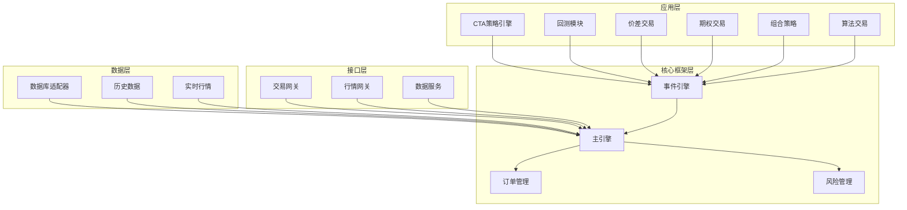
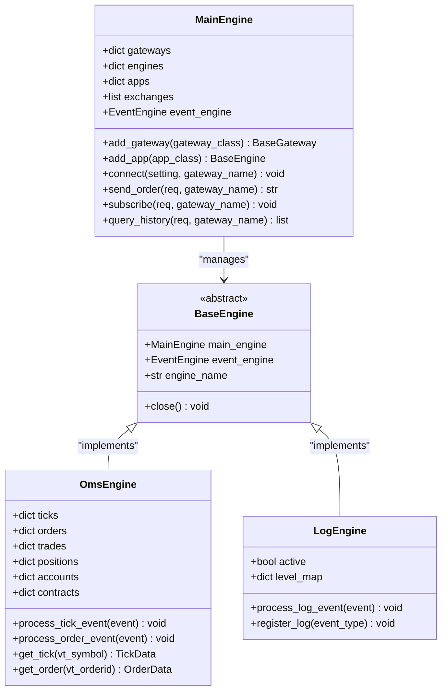
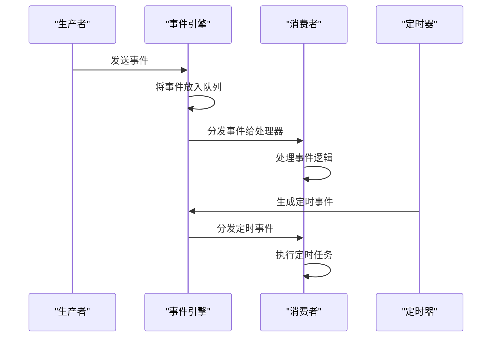
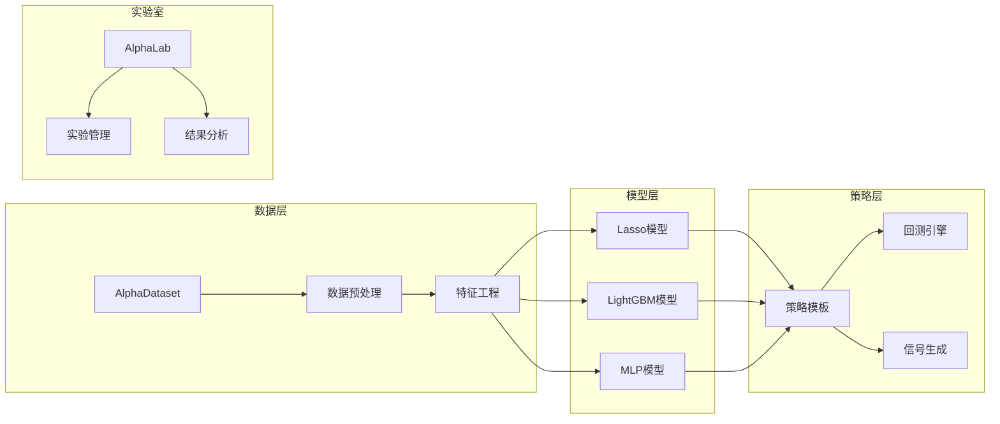
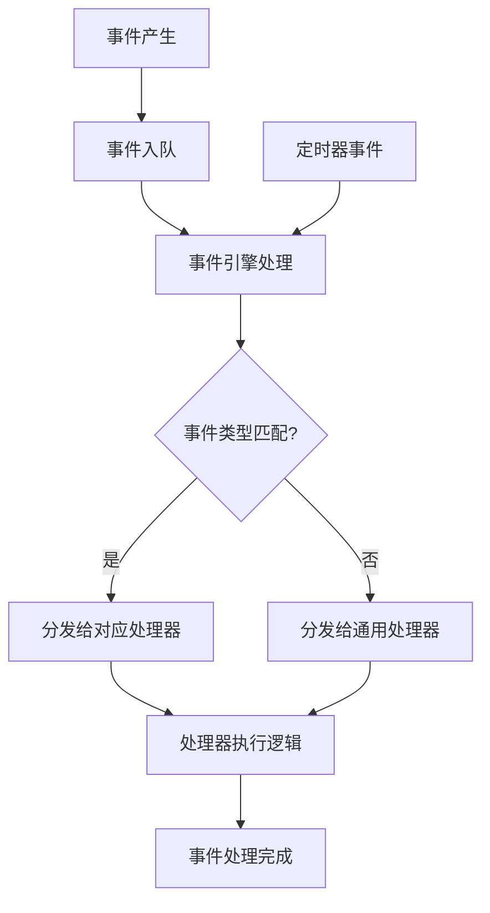
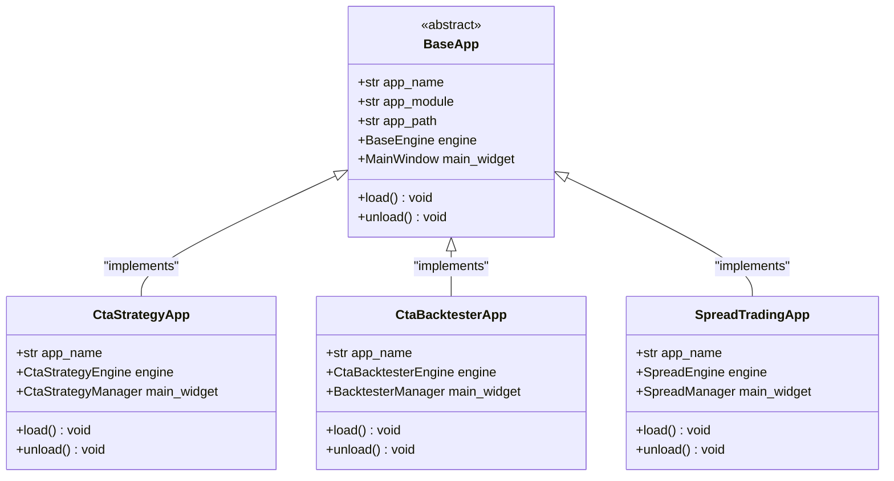
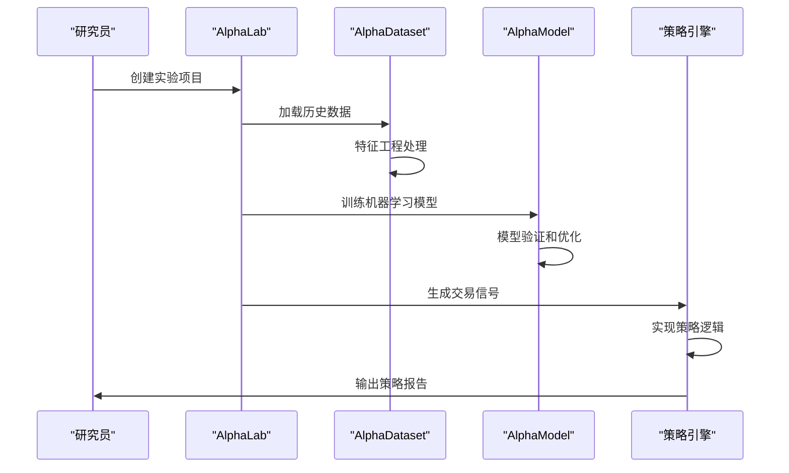

# VeighNa量化交易框架项目概述

<cite>
**本文档中引用的文件**
- [README.md](file://README.md)
- [CHANGELOG.md](file://CHANGELOG.md)
- [vnpy/__init__.py](file://vnpy/__init__.py)
- [vnpy/trader/engine.py](file://vnpy/trader/engine.py)
- [vnpy/event/engine.py](file://vnpy/event/engine.py)
- [vnpy/alpha/lab.py](file://vnpy/alpha/lab.py)
- [vnpy/chart/widget.py](file://vnpy/chart/widget.py)
</cite>

## 目录
1. [项目简介](#项目简介)
2. [核心目标与定位](#核心目标与定位)
3. [技术架构概览](#技术架构概览)
4. [核心组件分析](#核心组件分析)
5. [AI量化模块详解](#ai量化模块详解)
6. [事件驱动架构](#事件驱动架构)
7. [插件化设计](#插件化设计)
8. [典型应用场景](#典型应用场景)
9. [版本演进历程](#版本演进历程)
10. [学习路径指导](#学习路径指导)
11. [总结](#总结)

## 项目简介

VeighNa（原名vn.py）是由Traders为Traders打造的开源量化交易系统开发框架，自发布以来已成为国内量化交易领域最具影响力的开源项目之一。该项目基于Python语言开发，致力于为量化交易者提供一站式多因子机器学习（ML）策略开发、投研和实盘交易解决方案。

VeighNa项目的核心理念是"让量化交易更简单"，通过模块化设计、插件化架构和事件驱动机制，为不同层次的用户提供灵活可扩展的量化交易平台。项目采用MIT开源协议，拥有活跃的开发者社区和完善的文档体系。

**章节来源**
- [README.md](file://README.md#L1-L50)
- [vnpy/__init__.py](file://vnpy/__init__.py#L1-L25)

## 核心目标与定位

### 一站式量化开发平台

VeighNa定位于成为完整的量化交易生态系统，覆盖从研究到实盘交易的全生命周期：

- **研究阶段**：提供AI量化策略开发、多因子特征工程、模型训练和验证功能
- **回测阶段**：支持CTA策略、价差交易、组合策略等多种回测场景
- **实盘阶段**：提供多市场接入、风险管理、交易执行等实盘功能

### 技术特色

1. **AI驱动的量化策略**：全新推出的vnpy.alpha模块，集成机器学习算法，支持Lasso回归、LightGBM、MLP等多种模型
2. **多市场覆盖**：支持国内外主要金融市场，包括股票、期货、期权、外汇等多个品种
3. **高性能架构**：基于事件驱动的异步处理机制，支持高频交易和实时数据分析
4. **模块化设计**：采用插件化架构，各功能模块独立开发、独立部署

### 用户群体定位

- **量化研究员**：专注于策略研究和模型开发的专业人士
- **交易员**：需要实盘交易执行和风险管理的实战用户
- **开发者**：希望基于框架进行二次开发的技术人员
- **机构用户**：私募基金、证券公司、期货公司等专业机构

**章节来源**
- [README.md](file://README.md#L15-L100)

## 技术架构概览

VeighNa采用分层架构设计，包含核心框架层、应用层、接口层和数据层四个主要层次：

**图表来源**
- [vnpy/trader/engine.py](file://vnpy/trader/engine.py#L40-L100)
- [vnpy/event/engine.py](file://vnpy/event/engine.py#L25-L50)

### 架构设计理念

1. **事件驱动**：所有操作通过事件机制触发，确保系统的响应性和可扩展性
2. **插件化**：各功能模块作为独立插件，可以按需加载和卸载
3. **模块化**：核心功能按模块划分，职责清晰，便于维护和扩展
4. **标准化**：统一的接口规范，确保各模块间的良好协作

**章节来源**
- [vnpy/trader/engine.py](file://vnpy/trader/engine.py#L1-L50)
- [vnpy/event/engine.py](file://vnpy/event/engine.py#L1-L50)

## 核心组件分析

### 主引擎（MainEngine）

主引擎是整个系统的核心控制器，负责协调各个子系统的工作：

**图表来源**
- [vnpy/trader/engine.py](file://vnpy/trader/engine.py#L40-L150)
- [vnpy/trader/engine.py](file://vnpy/trader/engine.py#L300-L400)

### 订单管理系统（OmsEngine）

订单管理系统负责处理所有的交易相关数据，包括行情、订单、成交、持仓等：

- **数据存储**：维护各种交易数据的内存缓存
- **事件处理**：监听并处理各类交易事件
- **数据查询**：提供便捷的数据查询接口
- **状态管理**：跟踪订单和持仓的生命周期

### 事件引擎（EventEngine）

事件引擎是系统的核心调度器，采用生产者-消费者模式：

**图表来源**
- [vnpy/event/engine.py](file://vnpy/event/engine.py#L50-L100)

**章节来源**
- [vnpy/trader/engine.py](file://vnpy/trader/engine.py#L40-L200)
- [vnpy/event/engine.py](file://vnpy/event/engine.py#L1-L100)

## AI量化模块详解

### vnpy.alpha模块架构

vnpy.alpha是VeighNa 4.0版本新增的核心模块，专门面向机器学习量化策略开发：

**图表来源**
- [vnpy/alpha/lab.py](file://vnpy/alpha/lab.py#L1-L50)

### 核心功能组件

1. **AlphaDataset**：提供多因子数据集管理，支持Alpha 158等经典因子
2. **AlphaModel**：集成多种机器学习模型，支持模型训练和验证
3. **AlphaLab**：提供完整的实验管理功能，包括数据存储、模型管理和信号分析

### 特征工程能力

- **时间序列特征**：支持K线形态、价格趋势、成交量等特征
- **横截面特征**：支持行业分类、市值、流动性等特征
- **技术指标**：内置丰富的技术指标计算函数
- **自定义扩展**：支持用户自定义特征表达式

**章节来源**
- [vnpy/alpha/lab.py](file://vnpy/alpha/lab.py#L1-L100)

## 事件驱动架构

### 事件系统设计

VeighNa采用经典的事件驱动架构，具有以下特点：

1. **松耦合**：生产者和消费者通过事件进行通信，降低系统耦合度
2. **异步处理**：事件处理采用异步机制，提高系统响应速度
3. **可扩展**：支持动态注册和注销事件处理器
4. **高性能**：基于队列的事件分发机制，支持高并发处理

### 事件类型体系

系统定义了多种标准事件类型：

- **行情事件**：EVENT_TICK（行情推送）、EVENT_QUOTE（报价推送）
- **交易事件**：EVENT_ORDER（委托推送）、EVENT_TRADE（成交推送）
- **账户事件**：EVENT_ACCOUNT（账户推送）、EVENT_POSITION（持仓推送）
- **系统事件**：EVENT_LOG（日志事件）、EVENT_TIMER（定时事件）

### 事件处理流程

**图表来源**
- [vnpy/event/engine.py](file://vnpy/event/engine.py#L60-L90)

**章节来源**
- [vnpy/event/engine.py](file://vnpy/event/engine.py#L1-L146)

## 插件化设计

### 应用插件架构

VeighNa采用插件化架构，每个功能模块都是独立的插件：

### 插件加载机制

1. **动态加载**：运行时动态加载插件模块
2. **依赖管理**：自动解析和加载插件依赖
3. **生命周期管理**：支持插件的启动、运行和卸载
4. **配置管理**：支持插件级别的配置管理

### 网关插件系统

交易网关作为特殊的插件，负责与外部交易系统对接：

- **统一接口**：所有网关遵循相同的接口规范
- **多市场支持**：支持国内外多个交易市场的接入
- **实时行情**：提供实时行情数据订阅和推送
- **交易执行**：支持委托下单、撤单等交易功能

**章节来源**
- [vnpy/trader/engine.py](file://vnpy/trader/engine.py#L150-L250)

## 典型应用场景

### 场景一：AI量化策略开发

**图表来源**
- [vnpy/alpha/lab.py](file://vnpy/alpha/lab.py#L200-L300)

### 场景二：CTA策略回测

1. **数据准备**：从历史数据库加载K线数据
2. **策略开发**：基于CTA模板编写交易逻辑
3. **参数优化**：使用遗传算法优化策略参数
4. **结果分析**：生成详细的回测报告和性能指标

### 场景三：实盘交易执行

1. **账户连接**：建立与交易网关的连接
2. **风险管理**：设置交易限额和风控规则
3. **策略监控**：实时监控策略运行状态
4. **业绩跟踪**：记录和分析交易业绩

### 场景四：多市场套利

1. **跨市场监控**：同时监控多个市场的行情
2. **价差计算**：实时计算价差和套利机会
3. **自动化交易**：自动执行套利交易
4. **风险控制**：设置套利阈值和止损规则

## 版本演进历程

### 4.1.0版本（最新稳定版）

**新增功能**：
- 支持ETF申购和赎回业务
- 增强遗传算法优化功能
- 扩展MultiCharts数据服务支持

**技术改进**：
- 升级扩展模块适配4.0版本
- 优化事件引擎的资源管理
- 改进PySide6依赖版本

**修复问题**：
- 修复ta-lib相关的指标计算问题
- 解决邮件发送引擎的兼容性问题

### 4.0.0版本（重大更新）

**核心创新**：
- 新增vnpy.alpha模块，支持AI量化策略
- 升级核心支持版本到Python 3.13
- 引入现代化的开发工具链

**技术架构**：
- 使用pyproject.toml统一项目配置
- 替换logging为loguru日志框架
- 优化静态类型声明和代码质量

### 3.9.x系列（稳定发展期）

**功能扩展**：
- 新增迅投研数据服务支持
- 扩展IB接口的交易所支持范围
- 增强期权交易功能

**性能优化**：
- 优化数据库连接池管理
- 改进图表显示性能
- 增强多线程处理能力

**章节来源**
- [CHANGELOG.md](file://CHANGELOG.md#L1-L100)

## 学习路径指导

### 初学者路径

1. **基础环境搭建**
   - 下载VeighNa Studio 4.1.0
   - 注册VeighNa Station账号
   - 熟悉图形化界面操作

2. **核心概念理解**
   - 学习事件驱动架构原理
   - 理解主引擎和子引擎的关系
   - 掌握交易数据的基本概念

3. **简单策略实践**
   - 使用CTA策略模板编写简单均线策略
   - 进行策略回测验证
   - 观察策略运行效果

### 进阶用户路径

1. **深入理解架构**
   - 分析事件引擎的实现原理
   - 研究插件化设计模式
   - 学习自定义网关开发

2. **高级功能掌握**
   - 学习AI量化策略开发
   - 掌握多因子模型训练
   - 研究算法交易实现

3. **系统集成应用**
   - 开发定制化交易模块
   - 实现多市场套利策略
   - 构建完整的交易系统

### 高级开发者路径

1. **框架扩展开发**
   - 设计新的应用插件
   - 开发专用交易网关
   - 优化系统性能瓶颈

2. **企业级应用**
   - 构建分布式交易系统
   - 实现高可用架构
   - 开发监控和运维工具

3. **技术创新探索**
   - 研究新型量化策略
   - 探索前沿AI算法
   - 参与开源社区贡献

## 总结

VeighNa量化交易框架作为国内领先的开源量化平台，通过其先进的技术架构和丰富的功能特性，为量化交易者提供了完整的解决方案。项目的核心优势体现在以下几个方面：

### 技术优势

1. **架构先进**：采用事件驱动和插件化设计，具有良好的可扩展性和维护性
2. **功能完整**：覆盖从研究到实盘的全流程，支持多种交易策略和市场
3. **性能优异**：基于Python的高性能实现，支持高频交易和大数据处理
4. **生态完善**：拥有活跃的开发者社区和丰富的第三方模块支持

### 应用价值

1. **降低门槛**：为初学者提供友好的学习环境和丰富的示例代码
2. **提高效率**：通过模块化设计和标准化接口，显著提升开发效率
3. **保障质量**：完善的测试体系和代码规范，确保系统的稳定性和可靠性
4. **促进创新**：开放的架构设计鼓励技术创新和功能扩展

### 发展前景

随着量化交易行业的快速发展和AI技术的不断进步，VeighNa将继续在以下方向发力：

- **AI量化深化**：进一步增强机器学习能力，支持更复杂的策略开发
- **多市场拓展**：扩大支持的交易市场和金融产品种类
- **性能优化**：持续优化系统性能，支持更大规模的交易场景
- **生态建设**：加强与其他量化平台的集成，构建完整的生态系统

VeighNa不仅是一个技术工具，更是连接量化交易从业者的桥梁。通过持续的技术创新和社区建设，它将继续推动中国量化交易行业的发展，为更多交易者提供优质的服务和支持。