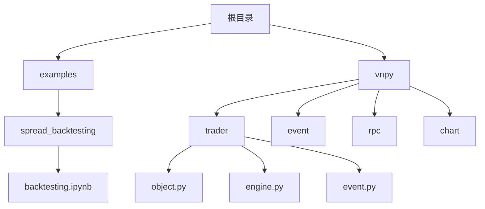
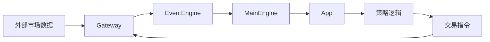
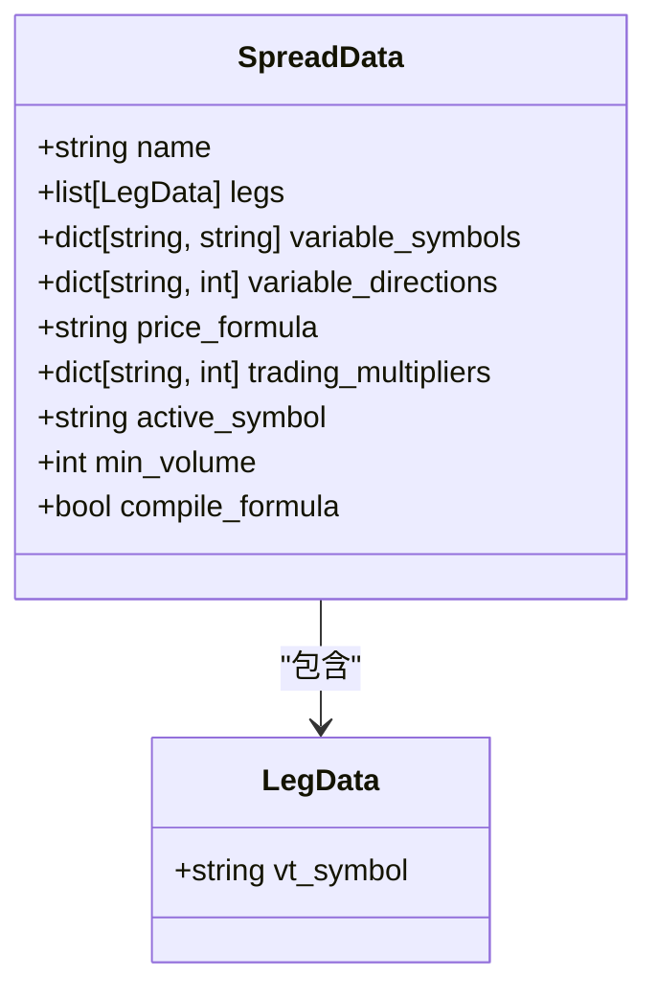
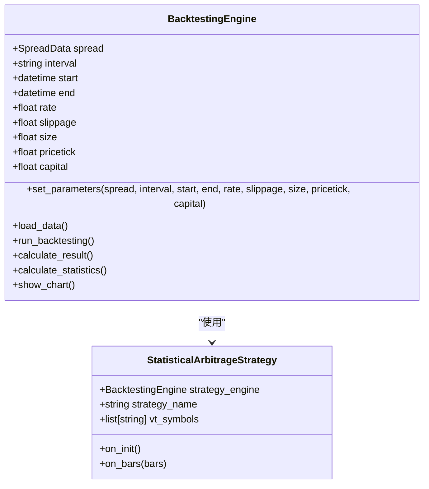
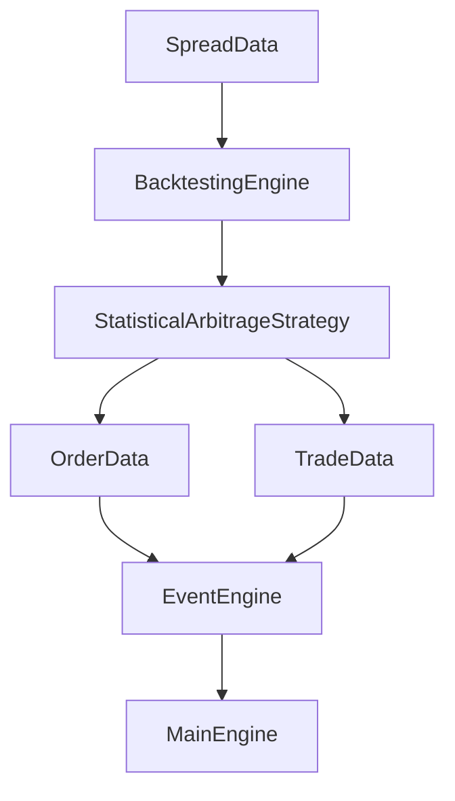

# 价差交易

<cite>
**本文档引用文件**   
- [backtesting.ipynb](file://examples/spread_backtesting/backtesting.ipynb)
- [object.py](file://vnpy/trader/object.py)
- [engine.py](file://vnpy/trader/engine.py)
- [event.py](file://vnpy/trader/event.py)
- [spread_trading](file://README.md)
</cite>

## 目录
1. [引言](#引言)
2. [项目结构](#项目结构)
3. [核心组件](#核心组件)
4. [架构概述](#架构概述)
5. [详细组件分析](#详细组件分析)
6. [依赖分析](#依赖分析)
7. [性能考虑](#性能考虑)
8. [故障排除指南](#故障排除指南)
9. [结论](#结论)

## 引言
本文档深入探讨了基于vn.py平台的价差交易策略建模与回测。通过分析`backtesting.ipynb`实例，详细解析配对交易、跨期套利等价差策略的构建逻辑。文档重点说明如何定义价差公式、设置触发阈值、管理多腿持仓同步等问题，并结合`object.py`中的`OrderData`、`TradeData`等数据模型，解释多合约联合下单与成交匹配机制。同时阐述事件引擎在价差信号生成与执行反馈中的协调作用，提供价差序列构建、统计检验、风险控制等关键环节的最佳实践。

## 项目结构
项目结构清晰地展示了vn.py平台的模块化设计，其中`examples/spread_backtesting`目录下的`backtesting.ipynb`文件是价差交易策略回测的核心示例。`vnpy`主目录包含了交易、事件、RPC、图表等多个核心模块，支持多种交易接口和策略应用。

**图示来源**
- [backtesting.ipynb](file://examples/spread_backtesting/backtesting.ipynb)
- [object.py](file://vnpy/trader/object.py)

## 核心组件
价差交易策略的核心组件包括`SpreadData`、`LegData`、`BacktestingEngine`和`StatisticalArbitrageStrategy`。这些组件共同实现了价差的定义、回测参数的设置、策略的执行和结果的计算。

**组件来源**
- [backtesting.ipynb](file://examples/spread_backtesting/backtesting.ipynb)
- [object.py](file://vnpy/trader/object.py)

## 架构概述
vn.py平台采用事件驱动架构，通过事件引擎协调各个组件。价差交易模块支持自定义价差，实时计算价差行情和持仓，支持半自动价差算法交易和全自动价差策略交易模式。

**图示来源**
- [event.py](file://vnpy/trader/event.py)
- [engine.py](file://vnpy/trader/engine.py)

## 详细组件分析
### SpreadData分析
`SpreadData`类用于定义价差合约，包括价差名称、腿数据、变量符号、变量方向、价格公式、交易乘数等属性。通过`price_formula`属性定义价差计算公式，如"A-B"表示两个合约价格的差值。

**图示来源**
- [backtesting.ipynb](file://examples/spread_backtesting/backtesting.ipynb)

### BacktestingEngine分析
`BacktestingEngine`类是回测引擎的核心，负责加载数据、运行回测、计算结果和显示图表。通过`set_parameters`方法设置回测参数，包括价差、时间间隔、起止时间、费率、滑点、合约乘数、价格跳动和初始资金。

**图示来源**
- [backtesting.ipynb](file://examples/spread_backtesting/backtesting.ipynb)

## 依赖分析
价差交易策略依赖于多个核心模块，包括交易模块、事件模块和回测模块。这些模块通过事件引擎进行协调，确保数据流和控制流的正确传递。

**图示来源**
- [object.py](file://vnpy/trader/object.py)
- [event.py](file://vnpy/trader/event.py)

## 性能考虑
在进行价差交易策略回测时，性能是一个重要的考虑因素。通过设置`compile_formula=False`，可以支持多进程优化，提高回测效率。此外，合理设置回测参数，如时间间隔、滑点和费率，可以更准确地模拟实际交易环境。

## 故障排除指南
在使用价差交易策略时，可能会遇到数据缺失、回测结果异常等问题。建议检查数据源连接，补充缺失数据，并验证价差公式的正确性。同时，监控回测过程中的内存使用情况，避免因内存不足导致回测失败。

**组件来源**
- [backtesting.ipynb](file://examples/spread_backtesting/backtesting.ipynb)
- [object.py](file://vnpy/trader/object.py)

## 结论
本文档详细解析了vn.py平台中价差交易策略的建模与回测。通过分析核心组件和架构，提供了价差策略构建的最佳实践。未来可以进一步探索更复杂的价差策略，如多腿价差、动态价差等，以提高策略的稳定性和盈利能力。