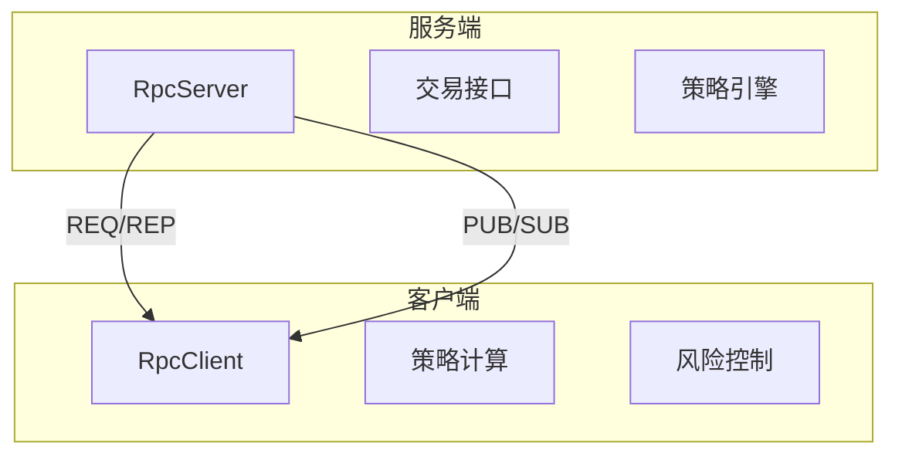
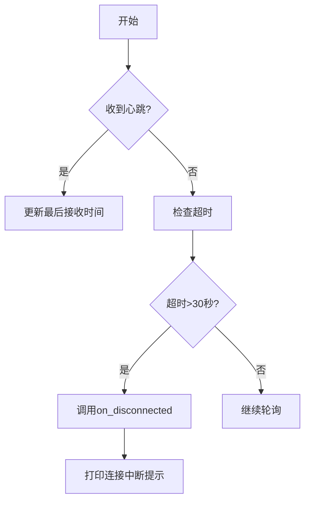
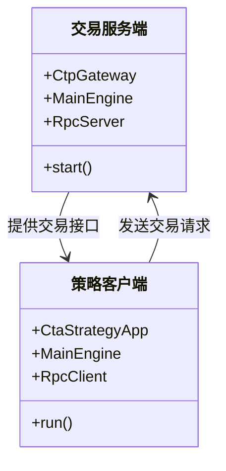

# 分布式部署

<cite>
**本文档引用的文件**
- [run_server.py](file://examples/client_server/run_server.py)
- [run_client.py](file://examples/client_server/run_client.py)
- [server.py](file://vnpy/rpc/server.py)
- [client.py](file://vnpy/rpc/client.py)
- [common.py](file://vnpy/rpc/common.py)
- [test_server.py](file://examples/simple_rpc/test_server.py)
- [test_client.py](file://examples/simple_rpc/test_client.py)
</cite>

## 目录
1. [引言](#引言)
2. [RPC通信架构概述](#rpc通信架构概述)
3. [服务端实现原理](#服务端实现原理)
4. [客户端实现原理](#客户端实现原理)
5. [远程方法调用机制](#远程方法调用机制)
6. [会话保持与错误重连](#会话保持与错误重连)
7. [高可用部署架构](#高可用部署架构)
8. [模块分离部署实践](#模块分离部署实践)
9. [常见问题排查](#常见问题排查)
10. [性能监控建议](#性能监控建议)

## 引言
本文档详细阐述vn.py框架中基于ZeroMQ的RPC通信机制在分布式部署中的实现原理。通过分析`run_server.py`和`run_client.py`示例，深入解析进程间通信模式、服务端引擎暴露、客户端连接管理等关键技术点。结合`rpc/server.py`和`rpc/client.py`源码，说明异步调用、会话保持和错误重连机制，并提供生产级高可用部署方案。

## RPC通信架构概述
vn.py的RPC通信采用经典的请求-回复（Request-Reply）与发布-订阅（Publish-Subscribe）双通道模式：

- **请求响应通道**：使用ZMQ的`REQ/REP`模式，客户端发送请求，服务端同步返回结果
- **事件广播通道**：使用ZMQ的`PUB/SUB`模式，服务端主动推送事件数据到所有订阅客户端

该架构实现了功能解耦，允许策略计算模块与交易执行模块分离部署，降低系统耦合度。



**图示来源**
- [server.py](file://vnpy/rpc/server.py#L1-L20)
- [client.py](file://vnpy/rpc/client.py#L1-L20)

## 服务端实现原理
`RpcServer`类是RPC服务端的核心，负责暴露本地功能供远程调用。

### 核心组件
- `_socket_rep`：绑定到指定地址的`REP`套接字，处理客户端请求
- `_socket_pub`：绑定到指定地址的`PUB`套接字，广播事件数据
- `_functions`：注册的可调用函数字典，以函数名作为键

### 启动流程
1. 绑定请求响应地址（如`tcp://*:2014`）
2. 绑定事件广播地址（如`tcp://*:4102`）
3. 启动工作线程执行`run()`方法
4. 定时发送心跳信号

**关键机制**：
- 心跳机制：每10秒通过`HEARTBEAT_TOPIC`主题发送心跳包
- 函数注册：通过`register()`方法将本地函数暴露为远程可调用接口
- 异常捕获：远程调用异常被捕获并序列化返回，避免服务中断

**本节来源**
- [server.py](file://vnpy/rpc/server.py#L1-L50)
- [run_server.py](file://examples/client_server/run_server.py#L1-L30)

## 客户端实现原理
`RpcClient`类是RPC客户端的核心，负责连接服务端并发起远程调用。

### 核心组件
- `_socket_req`：连接到服务端的`REQ`套接字，发送请求并接收响应
- `_socket_sub`：连接到服务端的`SUB`套接字，订阅事件推送
- `_thread`：独立线程处理订阅消息的接收

### 连接管理
- TCP Keepalive：启用TCP保活机制，检测连接状态
- 超时控制：远程调用默认30秒超时，可通过`timeout`参数调整
- 主题订阅：通过`subscribe_topic()`方法订阅特定主题的数据推送

### 工作线程
`run()`方法在独立线程中持续轮询订阅套接字：
- 检测心跳信号，更新最后接收时间
- 接收非心跳消息，交由`callback()`方法处理
- 超时未收到心跳时触发`on_disconnected()`回调

**本节来源**
- [client.py](file://vnpy/rpc/client.py#L1-L50)
- [run_client.py](file://examples/client_server/run_client.py#L1-L15)

## 远程方法调用机制
vn.py的RPC机制通过Python的`__getattr__`魔术方法实现透明的远程调用。

### 动态代理
当客户端访问不存在的属性时，`__getattr__`返回一个`dorpc`闭包函数：
```python
def dorpc(*args, **kwargs):
    # 构造请求 [方法名, 位置参数, 关键字参数]
    req = [name, args, kwargs]
    # 发送请求并等待响应
    socket_req.send_pyobj(req)
    # 超时控制
    if not socket_req.poll(timeout):
        raise RemoteException("Timeout")
    # 接收响应
    rep = socket_req.recv_pyobj()
    # 成功返回结果，失败抛出异常
    if rep[0]: return rep[1]
    else: raise RemoteException(rep[1])
```

### 序列化机制
- 使用`send_pyobj()`和`recv_pyobj()`进行Python对象序列化
- 支持基本数据类型、复杂对象和异常信息的完整传输
- 请求格式：`[方法名, 位置参数元组, 关键字参数字典]`
- 响应格式：`[成功标志, 数据或异常信息]`

### 异步调用支持
虽然底层是同步调用，但通过多线程和事件驱动模式实现逻辑上的异步：
- 客户端调用阻塞在单个请求上
- 事件订阅在独立线程处理，不影响调用线程

**本节来源**
- [client.py](file://vnpy/rpc/client.py#L50-L100)
- [server.py](file://vnpy/rpc/server.py#L80-L120)

## 会话保持与错误重连
### 心跳机制
- **服务端**：每`HEARTBEAT_INTERVAL`（10秒）发送一次心跳
- **客户端**：设置`HEARTBEAT_TOLERANCE`（30秒）容忍窗口
- **断线检测**：30秒内未收到心跳即判定连接中断

### 断线处理


**本节来源**
- [common.py](file://vnpy/rpc/common.py#L1-L10)
- [client.py](file://vnpy/rpc/client.py#L140-L160)

## 高可用部署架构
### 主从备份方案
部署双活服务端实例，通过虚拟IP或DNS轮询实现故障转移：
```
客户端 --> 负载均衡器 --> 服务端A (主)
                     --> 服务端B (备)
```

### 负载均衡
对于读多写少场景，可部署多个只读服务端实例：
- 交易执行服务端：处理下单、撤单等写操作
- 行情查询服务端：处理合约、持仓等读操作

### 网络隔离
- **生产环境**：使用独立VLAN或物理隔离网络
- **端口规划**：
  - 请求端口：2014（TCP）
  - 推送端口：4102（TCP）
- **安全策略**：
  - 防火墙限制访问IP范围
  - 使用IPC协议（`ipc://`）实现本机进程通信

**本节来源**
- [run_server.py](file://examples/client_server/run_server.py#L50-L70)
- [docs/community/app/rpc_service.md](file://docs/community/app/rpc_service.md#L1-L50)

## 模块分离部署实践
### 策略与交易分离


### 部署步骤
1. **服务端部署**：
   - 运行`run_server.py`
   - 连接交易接口
   - 启动RPC服务（2014/4102端口）

2. **客户端部署**：
   - 运行`run_client.py`
   - 配置RPC连接参数
   - 加载策略应用

**本节来源**
- [run_server.py](file://examples/client_server/run_server.py#L1-L70)
- [run_client.py](file://examples/client_server/run_client.py#L1-L25)

## 常见问题排查
### 连接中断
- **现象**：客户端持续输出"RpcServer has no response over 30 seconds"
- **排查步骤**：
  1. 检查服务端进程是否正常运行
  2. 验证防火墙是否放行2014/4102端口
  3. 使用`telnet`测试端口连通性
  4. 检查网络延迟是否过高

### 序列化失败
- **现象**：远程调用返回`RemoteException`，内容为序列化错误
- **解决方案**：
  - 避免传递不可序列化对象（如文件句柄、线程锁）
  - 复杂对象应实现`__getstate__`和`__setstate__`方法
  - 大数据量传输应分批处理

### 性能瓶颈
- **高延迟**：检查网络质量，考虑使用IPC协议替代TCP
- **高CPU**：优化序列化对象大小，减少不必要的数据传输

**本节来源**
- [client.py](file://vnpy/rpc/client.py#L160-L168)
- [server.py](file://vnpy/rpc/server.py#L120-L140)

## 性能监控建议
### 关键指标
| 指标 | 采集方法 | 告警阈值 |
|------|---------|---------|
| 连接延迟 | 客户端调用耗时统计 | >500ms |
| 心跳间隔 | 服务端日志时间戳差 | >15s |
| 消息吞吐 | ZMQ消息计数器 | 突增200% |
| CPU占用 | 系统监控工具 | >80% |

### 监控实现
1. **服务端日志**：监控`EVENT_RPC_LOG`事件
2. **客户端埋点**：记录每次调用的响应时间
3. **网络监控**：使用`iftop`或`nethogs`监控ZMQ端口流量

**本节来源**
- [run_server.py](file://examples/client_server/run_server.py#L30-L50)
- [docs/community/app/rpc_service.md](file://docs/community/app/rpc_service.md#L50-L100)